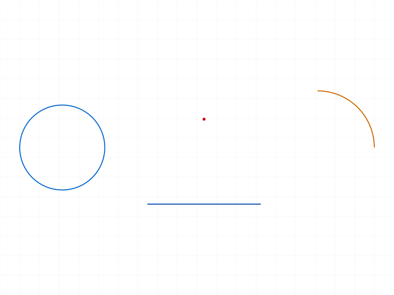
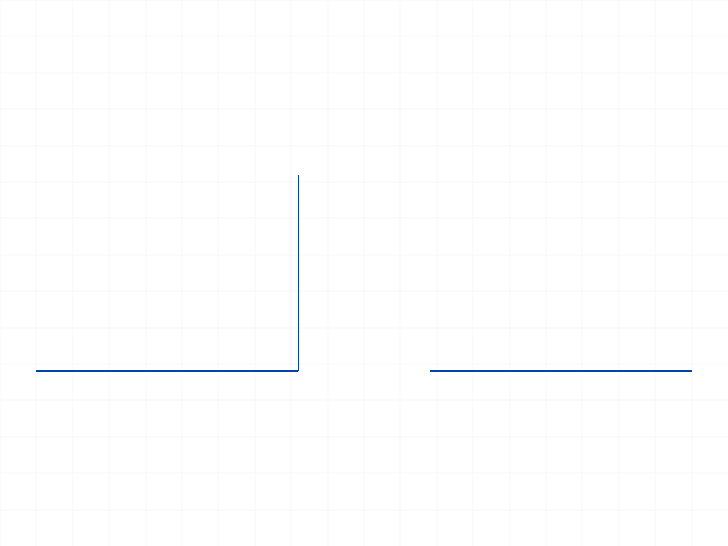
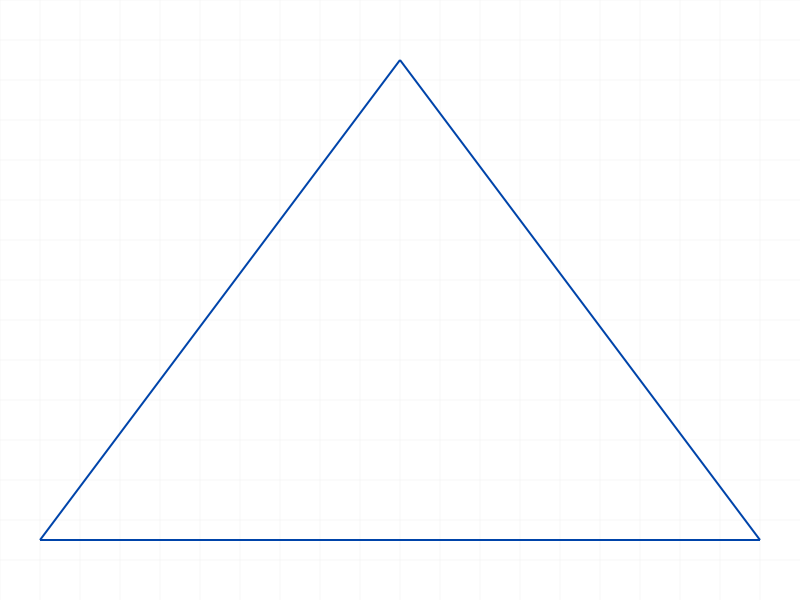
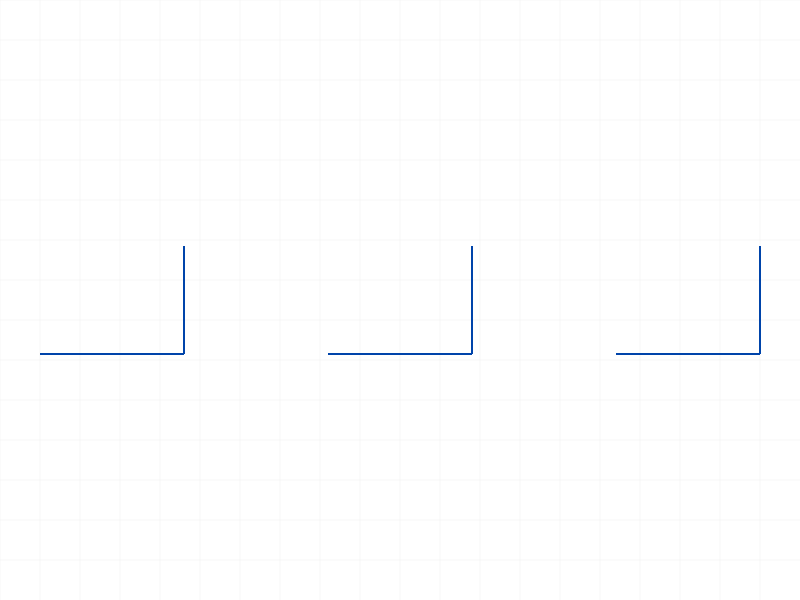
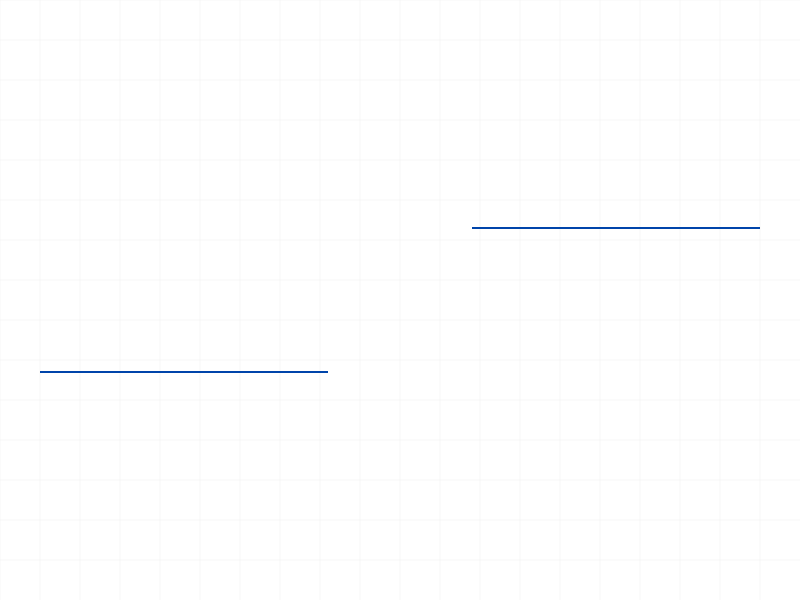
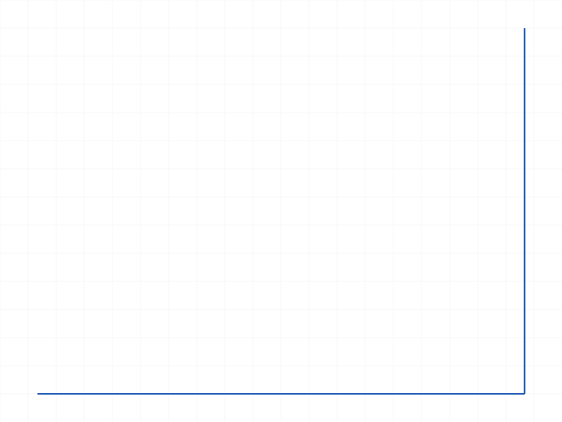
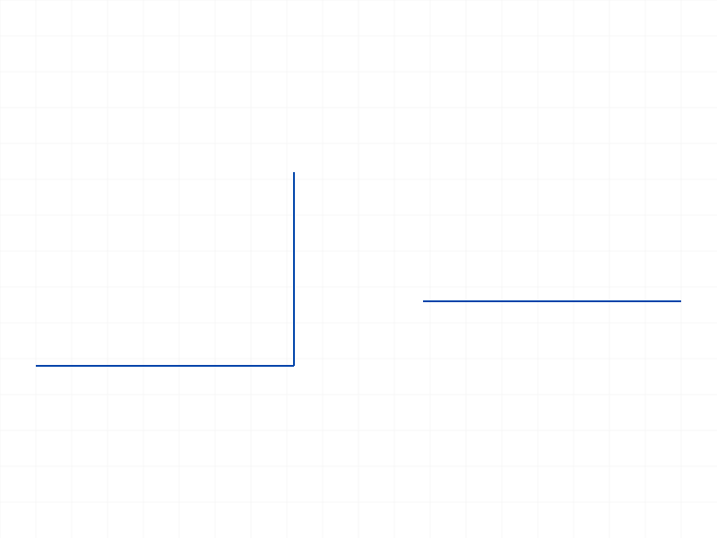

# Training: sketch.rigidSet

**Date:** 2026-04-10

## Goal

Testing `v1.sketch.rigidSet` — creates a rigid set from sketch geometry.

**Methods to cover:**

- `rigidSet` — basic creation with `geomIds` array
- `rigidSet` — return value (ID of created rigid set)
- `rigidSet` — what types of geometry can be grouped (lines, arcs, circles, points)
- `rigidSet` — behavior with single element vs multiple
- `rigidSet` — what happens with invalid/empty geomIds
- `rigidSet` — how rigid sets interact with constraints
- `rigidSet` — usage as input to pattern APIs (linearPattern, circularPattern, mirrorPattern)

**Questions:**

- What does the returned rigid set ID represent in the structure tree?
- Can a rigid set contain any sketch geometry type?
- What happens if you pass an empty array for geomIds?
- What happens if you pass geometry from a different sketch?
- Does creating a rigid set add constraints between the members?
- Can you create multiple rigid sets in one sketch?
- Can geometry belong to multiple rigid sets?

---

## 01 — Basic rigidSet with two lines

Script: `scripts/01-basic.mjs` — ✅ Creates rigid set from two connected lines. Returns ID 74, maxLevel 31.

|  |
|---|

**Data:** Result is a numeric ID (74). maxLevel=31 on success (not 0). Empty messages array.

## 02 — Mixed geometry types

Script: `scripts/02-mixed-geom.mjs` — ✅ All geometry types accepted: line, arc, circle, point. Returns ID 76, maxLevel 31.

|  |
|---|

**📌 LLM doc:** Accepts all sketch geometry types — lines, arcs, circles, points.

## 03 — Edge cases (empty, single, invalid)

Script: `scripts/03-edge-cases.mjs` — Mixed results.

- **Empty geomIds `[]`:** Succeeds — returns ID 66, maxLevel 31. Creates an empty rigid set.
- **Single element:** Succeeds — returns ID 68, maxLevel 31.
- **Invalid ID (999999):** Returns `null`, maxLevel 51. Error: `"An element of parameter \"geomIds\" has an invalid id!"` (code 1006). Also a warning (level 41): `"ToId()/TOID() didn't get an existing or valid id."`

**📌 LLM doc:** Empty geomIds creates an empty rigid set (not an error). Invalid IDs return null with error code 1006.

## 04 — Multiple rigid sets and shared geometry

Script: `scripts/04-multiple-sets.mjs` — ✅ All three rigid sets created successfully.

|  |
|---|

**Data:** Created 3 rigid sets (IDs 80, 82, 84) in one sketch. The third used geometry already in rs1 (line1) — accepted without error, maxLevel 31.

**📌 LLM doc:** Multiple rigid sets allowed per sketch. Geometry can belong to multiple rigid sets simultaneously.

## 05 — Structure tree representation

Script: `scripts/05-structure.mjs` — ✅ Dumped structure to inspect rigid set node.

|  |
|---|

**Data:** Rigid set appears as class `CC_RigidSet`, direct child of the `CC_Sketch` node. Members:
- `entities` — array of IDs referencing the member geometry
- `color` — numeric color value (5)
- `lgsState` — numeric value (0)
- `_VERSION` — version string

**📌 LLM doc:** Structure tree class is `CC_RigidSet`. `entities` array stores member geometry IDs.

## 06 — Usage with linearPattern

Script: `scripts/06-with-pattern.mjs` — ✅ Rigid set used as `rigidSetId` in linearPattern.

|  |
|---|

**Data:** `linearPattern` result: `{ constraint: 92, dimensions: [94, null], geometry: [74, 82, 90] }`. The `geometry` array contains the original rigid set ID (74) plus new pattern copies (82, 90). xCount=3 produces 3 instances total (original + 2 copies).

**📌 LLM doc:** Pass rigid set ID as `rigidSetId` to pattern APIs. Pattern result `geometry` array contains all rigid set instances.

## 07 — Constraint interaction

Script: `scripts/07-constraints.mjs` — ✅ No constraints added by rigid set creation.

|  |
|---|

**Data:** Constraint count 0 before, 0 after creating rigid set. Rigid sets are a grouping mechanism, not constraints.

**📌 LLM doc:** Rigid sets don't create constraints — they're purely a grouping mechanism for pattern operations.

## 08 — Cross-sketch geometry references

Script: `scripts/08-cross-sketch.mjs` — ⚠️ Accepted without error. Created rigid set in sketch2 referencing geometry from sketch1.

**Data:** maxLevel 31, no error messages. Succeeds silently.

## 09 — Cross-sketch structure verification

Script: `scripts/09-cross-sketch-structure.mjs` — Verified the cross-sketch rigid set structure.

**Data:** Rigid set (72) parented under sk2 (58), but its `entities` array points to geometry (64) that lives in sk1 (52). sk2 has only [72] as child (just the rigid set, no geometry). sk1 has [64, 68, 70] — the geometry and its sub-elements.

**📌 LLM doc:** Cross-sketch geometry references are silently accepted. The rigid set is parented under the target sketch, but points to geometry in another sketch. Avoid this — it's likely unintended behavior.

## 10 — Delete attempt via common.deleteObjects

Script: `scripts/10-delete.mjs` — ❌ `api.v1.common.deleteObjects` does not exist.

## 11 — Delete via sketch.deleteObject

Script: `scripts/11-delete-object.mjs` — ✅ `sketch.deleteObject({ ids: [rigidSetId] })` works. Returns null result, maxLevel 31.

|  |
|---|

**Data:** Initial test showed 0 geometry after delete, but this was due to `getGeometry` format issue, not actual geometry deletion. See script 13 for proper verification.

## 12–13 — Delete verification (structure tree)

Script: `scripts/13-delete-verify.mjs` — ✅ Verified with structure tree.

|  |
|---|

**Data:** Before delete: sketch children = [58, 64, 66, 70, 72, 74, 78, 80]. After delete: [58, 64, 66, 70, 72, 74, 78]. Only rigid set node (80) removed. All member geometry (58=l1, 66=l2) and standalone geometry (74=l3) survive.

**📌 LLM doc:** `sketch.deleteObject` removes the rigid set grouping only — member geometry is preserved. No dedicated deleteRigidSet API exists.

---

## Coverage checklist

- [x] API called successfully (scripts 01-06)
- [x] Every required parameter tested (id, geomIds)
- [x] Key optional parameters — none exist (only id and geomIds)
- [x] No enum values (not applicable)
- [x] No update method exists (no updateRigidSet in API docs)
- [x] Delete tested via `sketch.deleteObject` (scripts 11-13)
- [x] Realistic usage: rigidSet → linearPattern (script 06)
- [x] Behavioral claims verified with data (structure dumps, delete verification)
