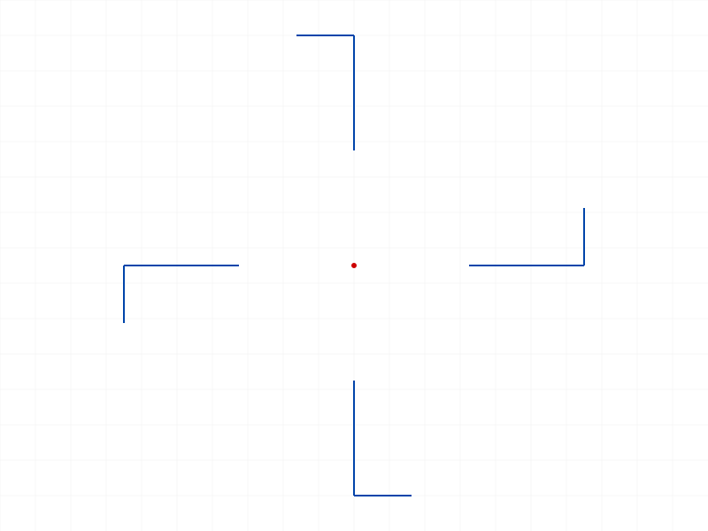
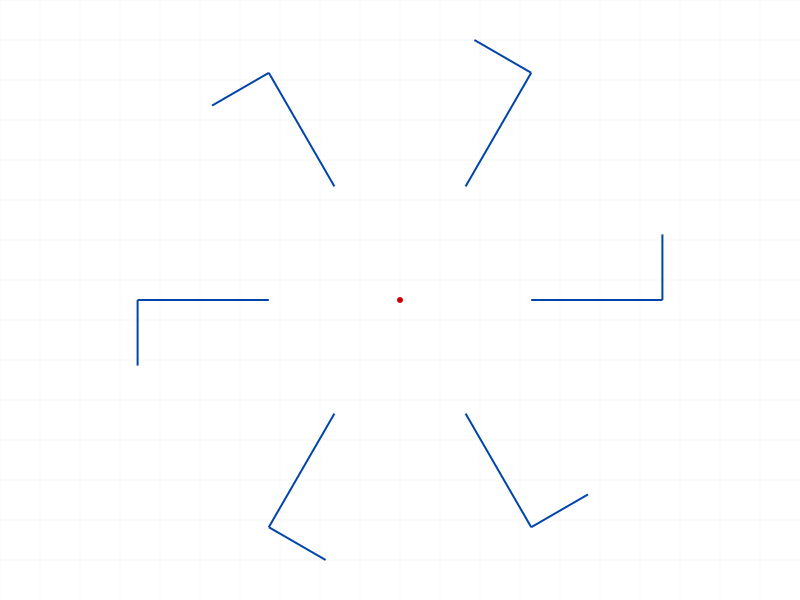
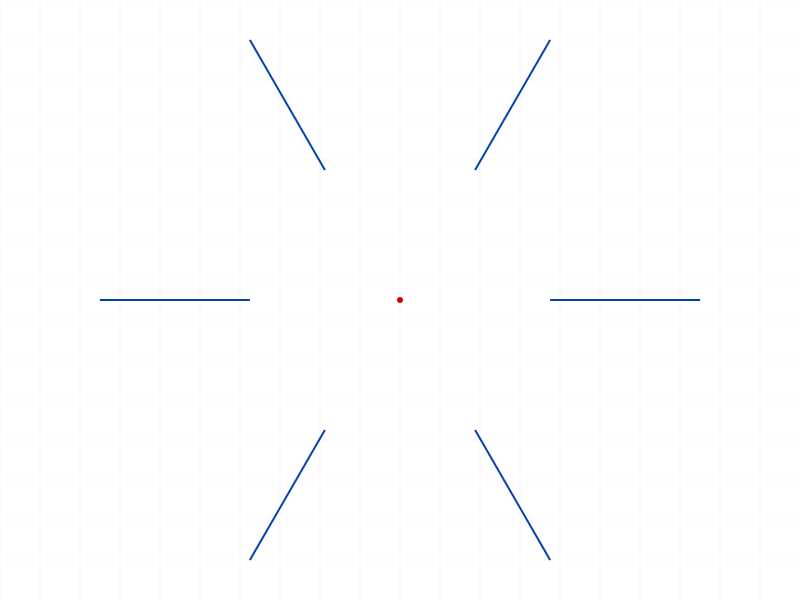
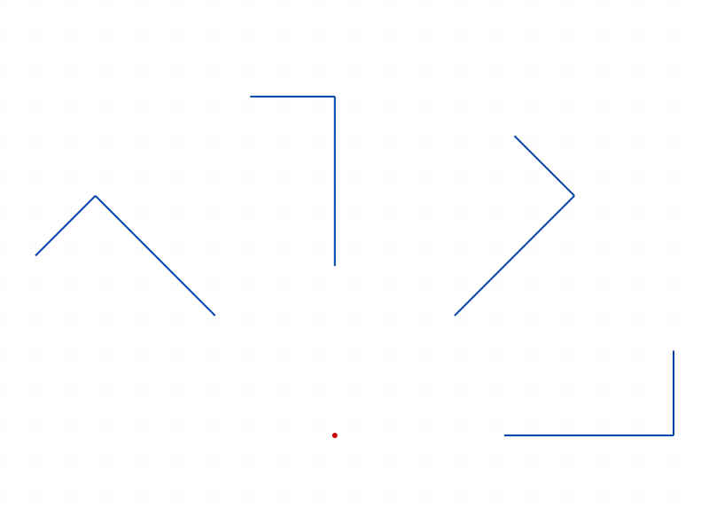
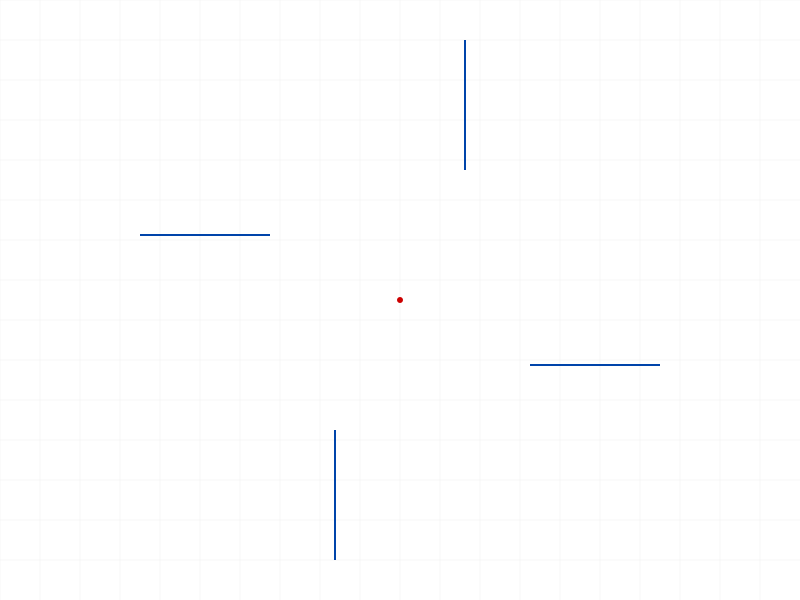
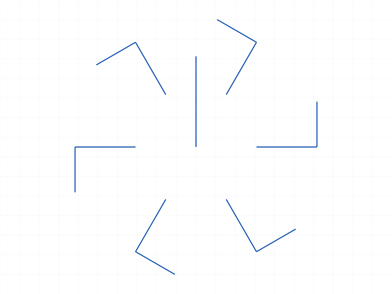
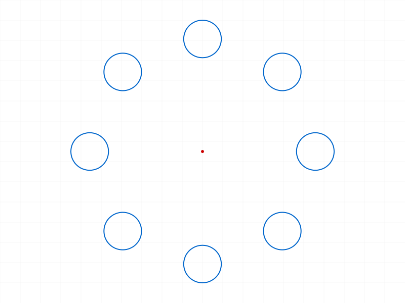

# Training: sketch.circularPattern

**Date:** 2026-04-10

## Goal

Testing `v1.sketch.circularPattern` — circular pattern of a rigid set around a center point.

**Methods to cover:**

- `circularPattern` — basic call with rigid set, center point, angle, count
- Return value: `{ constraint, dimension, geometry }`
- Angle parameter: positive/negative, zero, full circle
- Count parameter: 1, 0, negative, fractional
- Using single geometry ID vs rigid set ID as rigidSetId
- Dimension update after creation (angle spacing)
- Deletion behavior (deleteObject on constraint)

**Questions:**

- Does `dimension` return an ID or VOID? → Always returns an ID
- Is `angle` the total sweep or spacing between copies? → Spacing between neighboring copies
- Does count include the original (like linearPattern)? → Yes, count includes original
- What happens with count=0, count=1, negative count? → Division by zero error, but result still returned
- Can you pass a single geometry ID instead of a rigid set? → Yes, auto-wraps
- What center point types work? → sketch.point, line endpoint IDs

---

## 01 — basic happy path

Script: `scripts/01-basic.mjs` — ✅ 4 copies at 90° (PI/2) around origin.

|  |
|---|

**Data:** maxLevel=31. `dimension` returns an actual ID (104), not VOID. `geometry` has 4 entries including the original rigid set as `geometry[0]` (see `files/01-basic-basic-response.json`).

**Learned:** count includes the original (count=4 → 4 total geometry items). `angle` is spacing between neighbors in radians. `dimension` is always a real ID.

**📌 LLM doc:** count includes original; angle = spacing not sweep; dimension always returned as ID

**Note:** First attempt failed because `sketch.point` takes `pos` not `position`. The API docs use `pos` — always check parameter names.

## 02 — count=1

Script: `scripts/02-count-one.mjs` — maxLevel 51 (error), but result still returned.

**Data:** `geometry: [68]` (just original). Error: `"[Evaluation error in CP.SetSE:Division by zero!]"` (see `files/02-count-one-count-1.json`). The constraint and dimension nodes are created despite the error.

**📌 LLM doc:** count=1 is a solver error (division by zero). Pattern is created but in error state. Avoid count < 2.

## 03 — count=0

Script: `scripts/03-count-zero.mjs` — maxLevel 51 (error), same division by zero.

**Data:** Identical behavior to count=1: result returned with `geometry: [68]`, constraint and dimension created, but solver error (see `files/03-count-zero-count-0.json`).

## 04 — count=-1

Script: `scripts/04-count-negative.mjs` — maxLevel 51 (error), same division by zero.

**Data:** Same pattern as count=0 and count=1 (see `files/04-count-negative-count-neg1.json`).

**📌 LLM doc:** count ≤ 1 (including 0 and negative) all produce division by zero. Unlike linearPattern which silently succeeds, circularPattern errors.

## 05 — count=3.7 (fractional)

Script: `scripts/05-count-fractional.mjs` — ✅ maxLevel 31 (success).

**Data:** `geometry` has 3 items. 3.7 floored to 3 (see `files/05-count-fractional-count-fractional.json`).

**📌 LLM doc:** Fractional counts are floored, consistent with linearPattern.

## 06 — negative angle

Script: `scripts/06-angle-variations.mjs` — ✅ maxLevel 31, 4 copies.

|  |
|---|

**Data:** Negative angle (-PI/2) produces clockwise rotation instead of counterclockwise. No error. (see `files/06-angle-variations-negative-angle.json`)

**📌 LLM doc:** Negative angle = clockwise rotation. Valid, no error.

## 07 — zero angle

Script: `scripts/07-zero-angle.mjs` — maxLevel 51 (error), but result returned.

**Data:** `geometry` has 3 items (count=3 respected), but all copies stacked at same position. Division by zero error (see `files/07-zero-angle-zero-angle.json`).

**📌 LLM doc:** angle=0 causes solver error (division by zero). Copies are created but stacked. Avoid angle=0.

## 08 — full circle (6 copies at 60°)

Script: `scripts/08-full-circle.mjs` — ✅ maxLevel 31, 6 copies.

|  |
|---|

**Data:** 6 copies evenly spaced at 60° each = full 360° circle. Works perfectly (see `files/08-full-circle-full-circle.json`).

## 09 — single geometry ID as rigidSetId

Script: `scripts/09-single-geom.mjs` — ✅ maxLevel 31, 6 copies.

|  |
|---|

**Data:** Passed a line ID (58) directly as `rigidSetId`. Worked. `geometry[0]` = 68 (auto-created rigid set, not the original line 58). Same auto-wrapping behavior as linearPattern (see `files/09-single-geom-single-geom.json`).

**📌 LLM doc:** Single geometry ID works as rigidSetId. Auto-wrapped into rigid set — geometry[0] is a new ID, not the original.

## 10 — update dimension (angle spacing)

Script: `scripts/10-update-dimension.mjs` — ✅ updateDimension succeeded.

|  |  |
|---|---|

**Data:** Initial pattern at 45°, updated to 90° via `sketch.updateDimension`. maxLevel 31 on update (see `files/10-update-dimension-update-result.json`). No openFeature/closeFeature needed.

**📌 LLM doc:** Dimension update works with updateDimension. No openFeature needed.

## 11 — delete pattern constraint

Script: `scripts/11-delete-pattern.mjs` — ✅ deleteObject succeeded (maxLevel 31).

**Data:** `sketch.deleteObject({ ids: [constraintId] })` removes the pattern. getPositions returned undefined (not the right API for checking survival — would need getGeometry). Delete maxLevel=31 (see `files/11-delete-pattern-delete-pattern.json`).

**📌 LLM doc:** Delete pattern via deleteObject on constraintId. Same pattern as linearPattern.

## 12 — off-center point

Script: `scripts/12-center-types.mjs` — ✅ off-center point at [10,10,0] works (maxLevel 31).

**Data:** Pattern rotates around the off-center position. getPoints on a line returned `{ startId, endId }` — but the second test failed due to multi-part.create invalidation.

|  |
|---|

## 13 — line endpoint as center

Script: `scripts/13-line-endpoint-center.mjs` — ✅ maxLevel 31, 6 copies.

|  |
|---|

**Data:** Used `getPoints({ id: lineId }).result.startId` as centerId. Works perfectly. Any sketch point ID can serve as center.

## 14 — realistic bolt hole circle

Script: `scripts/14-realistic.mjs` — ✅ 8 circles at 45° spacing around origin.

|  |
|---|

**Data:** 8 bolt holes evenly spaced (PI/4 each). maxLevel 31. geometry has 8 entries. dimension ID returned for later update (see `files/14-realistic-bolt-holes.json`).

---

## Coverage Checklist

- [x] API called successfully
- [x] Every required parameter tested (id, rigidSetId, centerId, angle, count)
- [x] Count edge cases: 0, 1, -1 (all error), fractional (floored)
- [x] Angle edge cases: negative (clockwise), zero (error), full circle (works)
- [x] Single geometry ID as rigidSetId (auto-wraps)
- [x] updateDimension on pattern dimension
- [x] deleteObject on pattern constraint
- [x] Different center point types (sketch.point, line endpoint)
- [x] Realistic usage (bolt hole circle)
- [x] All behavioral claims verified with data (filewrite dumps and log values)
