# Training: sketch.updateGeometry

**Date:** 2026-04-10

## Goal

Testing `v1.sketch.updateGeometry` — updates positions/properties of existing sketch geometry in-place.

**Methods to cover:**

- `updateGeometry` with `points` — move existing points by ID
- `updateGeometry` with `lines` — update startPos/endPos of existing lines
- `updateGeometry` with `circles` — update centerPos and radius of existing circles
- `updateGeometry` with `arcsBy3Points` — update arc by start/end/mid positions
- `updateGeometry` with `arcsByCenter` — update arc by start/end/center + isClockwise
- Batch update — multiple geometry types in one call
- Edge cases — invalid IDs, wrong geometry type, partial updates

**Questions:**

- Does updateGeometry return VOID or updated IDs?
- Can you update multiple items of the same type in one call?
- What happens if you pass an ID that doesn't exist?
- What happens if you pass a line ID in the circles array?
- Does updating a point that's shared by two lines move both lines?
- Does updating geometry affect constraints?
- Can you update only some properties (e.g., only centerPos of a circle, not radius)?

---

## 01 — update points

Script: `scripts/01-update-points.mjs` — ✅ Moved two points from [0,0,0]/[50,50,0] to [10,20,0]/[80,80,0].

**Data:** result=null (VOID), maxLevel=31, messages=[]. See `files/01-update-points-update-points-response.json`.

| 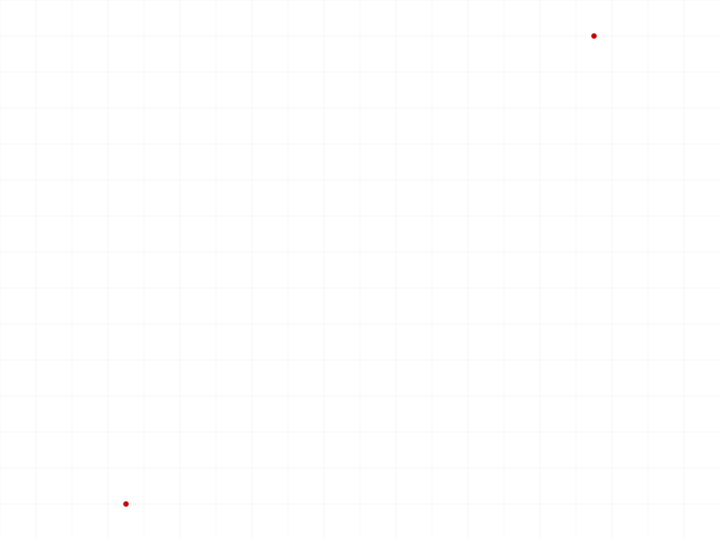 | 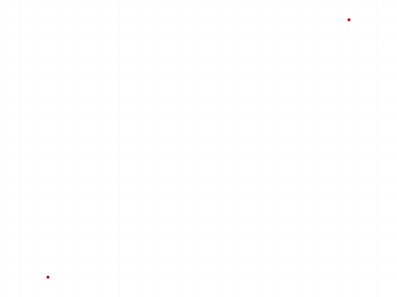 |
|---|---|

## 02 — update lines

Script: `scripts/02-update-lines.mjs` — ✅ Updated startPos/endPos on two lines forming an L shape.

**Data:** result=null, maxLevel=31. See `files/02-update-lines-update-lines-response.json`.

|  | 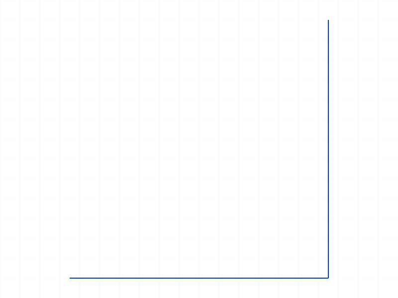 |
|---|---|

## 03 — update circles

Script: `scripts/03-update-circles.mjs` — ✅ Changed circle center from [25,25] to [50,50] and radius from 15 to 30.

**Data:** result=null, maxLevel=31. See `files/03-update-circles-update-circles-response.json`.

| 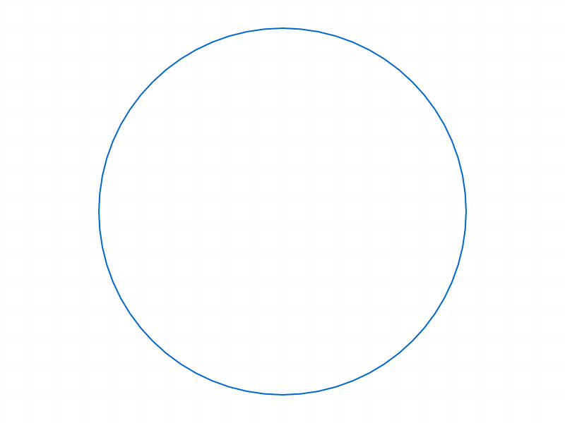 |  |
|---|---|

## 04 — update arc by center

Script: `scripts/04-update-arc-by-center.mjs` — ✅ Updated arcByCenter positions (doubled radius from 30 to 60).

**Data:** result=null, maxLevel=31. See `files/04-update-arc-by-center-update-arc-center-response.json`.

|  | 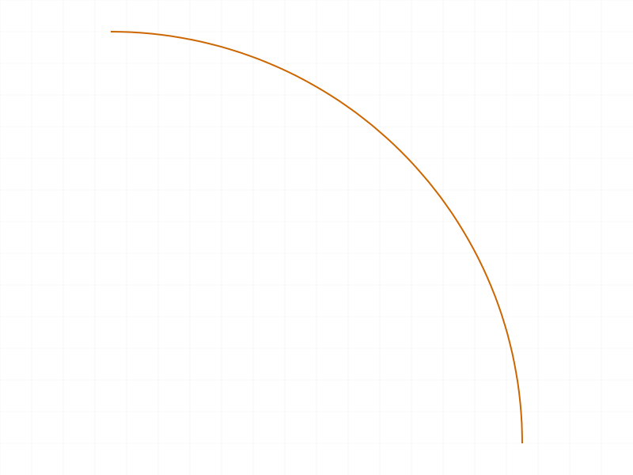 |
|---|---|

## 05 — update arc by 3 points

Script: `scripts/05-update-arc-by-3points.mjs` — ✅ Updated arcsBy3Points positions (wider arc, taller midpoint).

**Data:** result=null, maxLevel=31. See `files/05-update-arc-by-3points-update-arc-3pts-response.json`.

|  |  |
|---|---|

## 06 — batch mixed types

Script: `scripts/06-batch-mixed-types.mjs` — ✅ Updated a point, line, and circle all in one call.

**Data:** result=null, maxLevel=31. All 3 items updated in a single `updateGeometry` call without error.

| 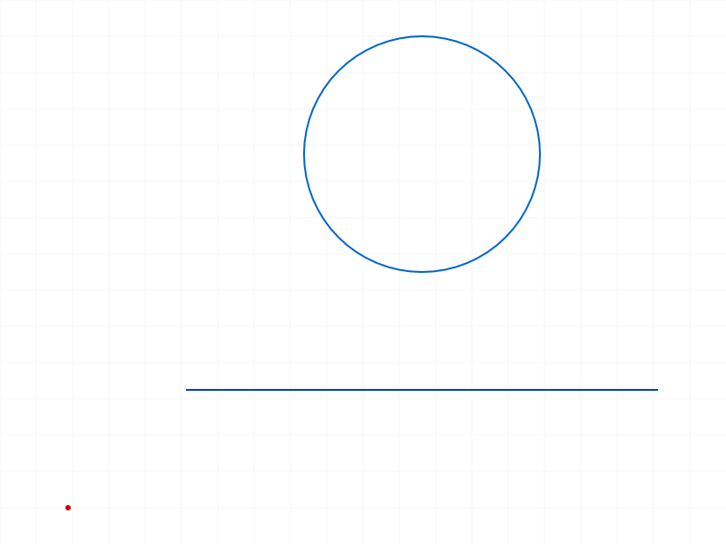 | 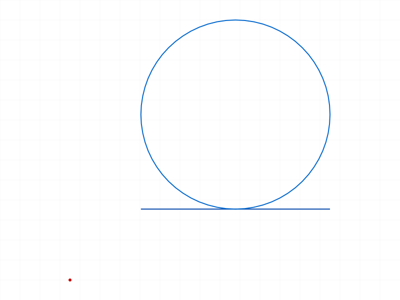 |
|---|---|

## 07 — invalid ID (full entry)

Script: `scripts/07-invalid-id.mjs` — Error as expected. Passing fake ID 99999 triggers two messages.

**Data:** result=null, maxLevel=51 (ERROR). Messages:
- WARNING: `ToId()/TOID() didn't get an existing or valid id.`
- ERROR code 1006: `An element of parameter "id" has an invalid id!`

See `files/07-invalid-id-invalid-id-response.json`.

**Learned:** Invalid geometry IDs are caught with error code 1006.
**📌 LLM doc:** Document error code 1006 for invalid geometry IDs.

## 08 — wrong type ID (full entry)

Script: `scripts/08-wrong-type-id.mjs` — Error as expected. Line ID in circles array → error. Circle ID in lines array → error.

**Data:**
- Line-as-circle: maxLevel=51, code 1001: `The parameter "id" has a wrong id type! Provide only following id types: ["sketch-circle"]`
- Circle-as-line: maxLevel=51, code 1001: `The parameter "id" has a wrong id type! Provide only following id types: ["sketch-line"]`

**Learned:** The server validates geometry type per array. Each array element's `id` must match the expected sketch-geometry type.
**📌 LLM doc:** Document type validation — each array enforces its geometry type.

## 09 — shared point move (full entry)

Script: `scripts/09-shared-point-move.mjs` — Surprising result.

**Data:** Created two connected lines (coincidence constraint). Line1 points: startId=59, endId=60. Line2 points: startId=63, endId=64. Note: **separate point IDs** despite coincidence constraint.

Before: line1 end=[50,0,0], line2 start=[50,0,0].
After moving point 60 to [70,20,0]: line1 end=[70,20,0] ✅, but line2 start=[50,0,0] ❌ (unchanged!).

See `files/09-shared-point-move-shared-point-comparison.json`.

| 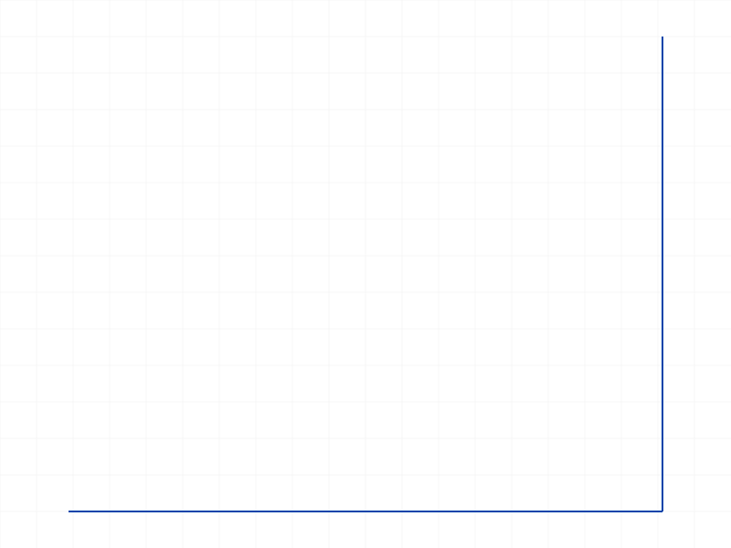 | 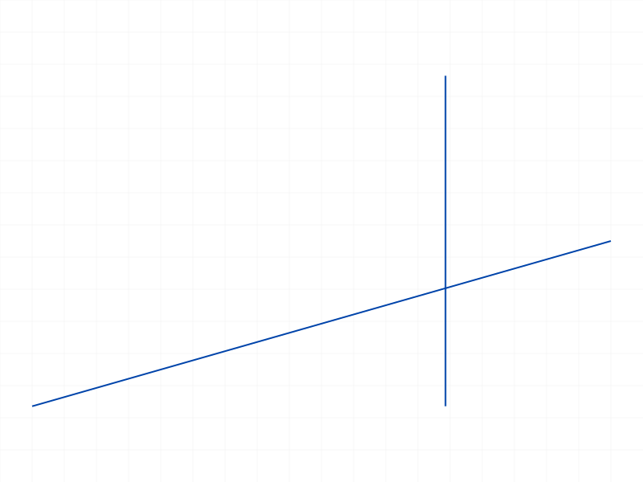 |
|---|---|

**Learned:** `updateGeometry` is a **raw position update** — it does NOT trigger the constraint solver. Coincident points stay at their original positions. The constraint system only resolves on explicit recalc or solver invocation. This means if you use `updateGeometry` on connected geometry, you must update ALL affected points yourself.
**📌 LLM doc:** Critical gotcha — updateGeometry does not enforce constraints. Must update all connected geometry manually.

## 10 — partial circle update (full entry)

Script: `scripts/10-partial-circle-update.mjs` — Errors. Cannot omit properties.

**Data:**
- Center-only (no radius): maxLevel=51, code 1004: `The parameter "radius" must be provided in the api call!`
- Radius-only (no center): maxLevel=51, code 1004: `The parameter "centerPos" must be provided in the api call!`

Also: `getPositions` returns null for circles (not an error, just null).

**Learned:** All properties for a geometry type are required. No partial updates — you must always provide the complete set of properties even if you only want to change one.
**📌 LLM doc:** Document that all properties are required for each geometry type (no partial updates). Error code 1004.

## 11 — partial line update (full entry)

Script: `scripts/11-partial-line-update.mjs` — Confirms same behavior for lines.

**Data:**
- startPos-only: maxLevel=51, code 1004: `The parameter "endPos" must be provided in the api call!`
- endPos-only: maxLevel=51, code 1004: `The parameter "startPos" must be provided in the api call!` (inferred — consistent pattern)

Positions unchanged after both failed calls.

**Learned:** Same as circles — lines require both startPos AND endPos.
**📌 LLM doc:** Reinforce: all properties required for every geometry type.

## 12 — update with constraints (full entry)

Script: `scripts/12-update-with-constraints.mjs` — Moved bottom line of rectangle up by 10.

**Data:**
- line0 (bottom): moved from y=0 to y=10 ✅
- line1 (right): startPos still [60,0,0] — NOT dragged ❌
- line2 (top): unchanged
- line3 (left): unchanged

See `files/12-update-with-constraints-constraint-interaction.json`.

|  | 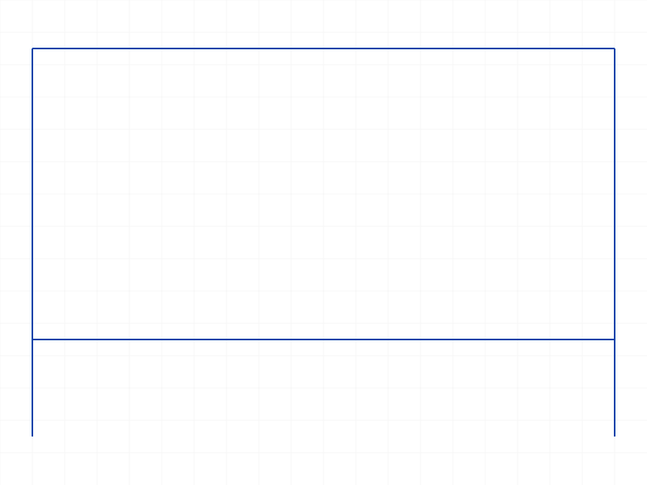 |
|---|---|

**Learned:** Confirms script 09 finding: constraints are NOT enforced by updateGeometry. The rectangle breaks — bottom line moves but corners don't follow. Must update all lines yourself for consistent geometry.
**📌 LLM doc:** Reinforce constraint bypass behavior.

## 13 — empty update

Script: `scripts/13-empty-update.mjs` — ✅ All variants are no-ops.

**Data:** Empty arrays, no arrays, all-empty arrays — all return null, maxLevel=31, no errors. See `files/13-empty-update-empty-update.json`.

## 14 — multiple same type

Script: `scripts/14-multiple-same-type.mjs` — ✅ Updated 3 circles in one call without issues.

**Data:** result=null, maxLevel=31.

| 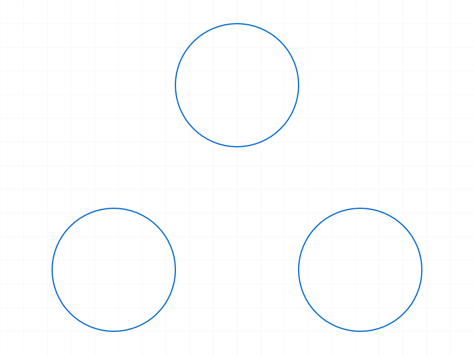 | 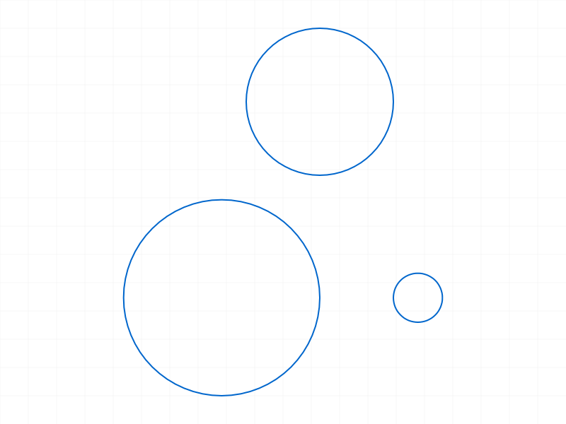 |
|---|---|

## 15 — arc clockwise toggle

Script: `scripts/15-arc-clockwise-toggle.mjs` — ✅ Flipped arc direction from CCW to CW.

**Data:** result=null, maxLevel=31.

|  |  |
|---|---|

## 16 — wrong sketch ID (full entry)

Script: `scripts/16-wrong-sketch-id.mjs` — Surprising. No error when passing geometry from sketch A with sketch B's ID.

**Data:** result=null, maxLevel=31, messages=[]. No error at all.

## 17 — wrong sketch ID verified (full entry)

Script: `scripts/17-wrong-sketch-verify.mjs` — Confirmed: the geometry actually moved!

**Data:**
- Before: startPos=[0,0,0], endPos=[50,50,0]
- After (updated via wrong sketch B): startPos=[10,10,0], endPos=[80,80,0]
- `moved: true`

See `files/17-wrong-sketch-verify-wrong-sketch-verify.json`.

**Learned:** The `id` (sketch ID) parameter in updateGeometry is not strictly validated against the geometry items' parent sketch. The update targets geometry by their own IDs regardless of which sketch ID you pass. Passing a wrong sketch still succeeds if the geometry IDs themselves are valid. However, passing a part ID (non-sketch type) correctly errors with code 1001.
**📌 LLM doc:** Document that sketch ID validation is loose — geometry is updated by its own ID regardless of parent sketch.

## 18 — part ID instead of sketch

Script: `scripts/18-part-id-instead-of-sketch.mjs` — Error as expected.

**Data:** maxLevel=51, code 1001: `The parameter "id" has a wrong id type! Provide only following id types: ["sketch"]`.

**Learned:** The top-level `id` must be a sketch type, even though the actual parent sketch doesn't matter (see script 17). The type check is present, but the ownership check is not.

## 19 — realistic workflow (resize rectangle)

Script: `scripts/19-realistic-workflow.mjs` — ✅ Resized a 60x40 rectangle to 80x60 by updating all 4 lines in one call.

**Data:** All 4 lines updated correctly. line0: [0,0]→[80,0], line1: [80,0]→[80,60], line2: [80,60]→[0,60], line3: [0,60]→[0,0].

|  |  |
|---|---|

**Learned:** To resize constrained geometry, you must update ALL lines in one batch call with consistent positions. This is the correct approach since updateGeometry doesn't enforce constraints.

---

## Summary of Findings

1. **Return value:** Always `null` (VOID), maxLevel=31 on success
2. **All geometry types work:** points, lines, circles, arcsBy3Points, arcsByCenter
3. **Batch updates work:** Can mix types and update multiples of the same type in one call
4. **No partial updates:** Every property for a geometry type is required (error code 1004)
5. **Constraints NOT enforced:** Raw position update only — constraint solver not triggered
6. **Sketch ID loosely validated:** Type must be "sketch" but doesn't need to be the actual parent sketch
7. **Type validation is strict:** Each array enforces its geometry type (error code 1001)
8. **Invalid IDs caught:** Error code 1006
9. **Empty calls are no-ops:** No error
