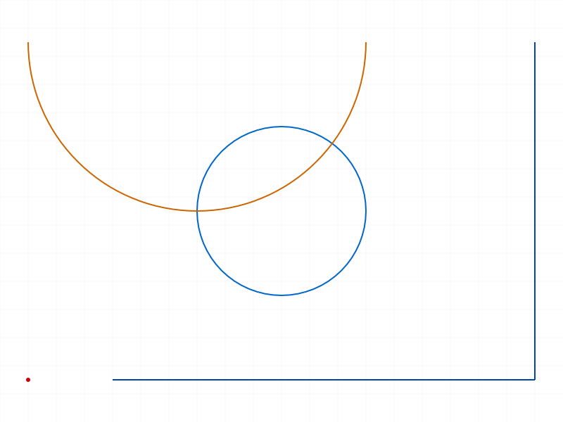
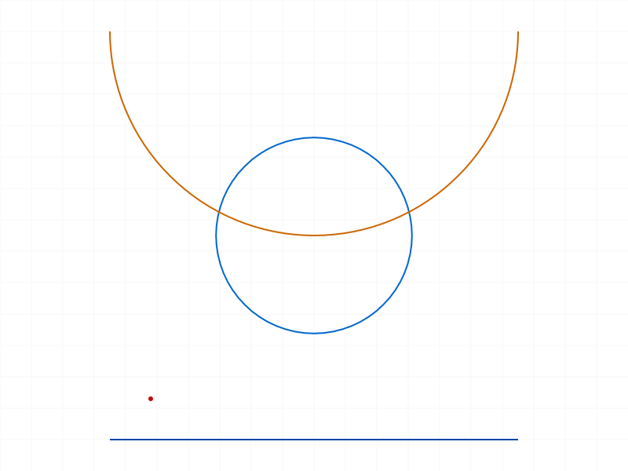
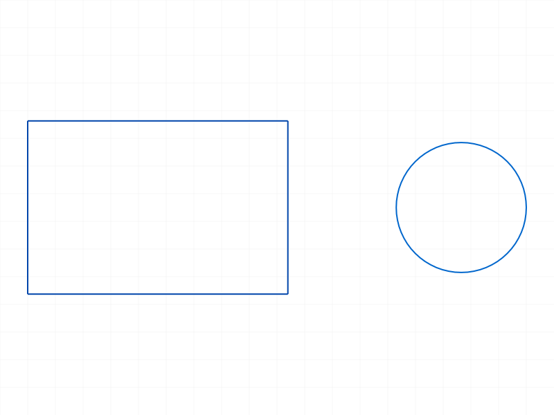
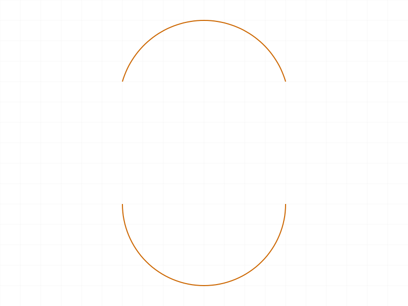

# Training: sketch.getGeometry

**Date:** 2026-04-10

## Goal

Testing `v1.sketch.getGeometry` — retrieves all geometry IDs from a sketch, sketch region, or rigid set, grouped by type.

**Methods to cover:**

- `getGeometry` with sketch ID — returns `{ points, lines, arcs, circles }`
- `getGeometry` with sketch region ID
- `getGeometry` with empty sketch (no geometry)
- `getGeometry` after creating mixed geometry types
- `getGeometry` after deleting geometry (does it reflect removal?)
- `getGeometry` with different geometry creation methods (individual vs batch)
- `getGeometry` return value structure — are arcs split into arcByCenter vs arcBy3Points?

**Questions:**

- Does the return separate arc types or merge them into one `arcs` array?
- Does passing a sketch region ID only return geometry within that region?
- What IDs come back — are they the same IDs returned by creation APIs?
- What happens with invalid/non-existent IDs?
- Does it include auto-generated constraint points or only explicit geometry?

---

## 01 — empty sketch

Script: `scripts/01-empty-sketch.mjs` — ✅ Returns `{ arcs: [], circles: [], lines: [], points: [] }` with maxLevel=31. All 4 arrays present but empty.

## 02 — mixed geometry (batch creation)

Script: `scripts/02-mixed-geometry.mjs` — ✅ Created point, 2 lines, 1 arcByCenter, 1 circle via batch `geometry()`.

|  |
|---|

**Data:** `geometry()` returns `{ arcsByCenter: [68], arcsBy3Points: [], circles: [73], lines: [60,64], points: [58] }`. `getGeometry()` returns `{ arcs: [68], circles: [73], lines: [60,64], points: [58] }`. IDs match exactly.

**📌 LLM doc:** `geometry()` uses `arcsByCenter`/`arcsBy3Points` keys but `getGeometry` merges them into a single `arcs` array. The creation-time key names differ from the query-time key names.

## 03 — individual creation APIs

Script: `scripts/03-individual-creation.mjs` — ✅ Created geometry via `sketch.point`, `sketch.line`, `sketch.circle`, `sketch.arcByCenter` individually.

|  |
|---|

**Data:** All individually-created IDs appear in `getGeometry` result. `pointInList: true`, `lineInList: true`, `circleInList: true`, `arcInList: true` (see `files/03-individual-creation-individual-vs-query.json`).

## 04 — sketch region scoping

Script: `scripts/04-sketch-region.mjs` — ✅ Created rectangle (4 lines) + separate circle. Created a sketch region from rectangle lines.

|  |
|---|

**Data:** `getGeometry(sketchId)` returns all 5 items: `lines: [58,64,70,76], circles: [92]`. `getGeometry(regionId)` returns only the rectangle's 4 lines: `lines: [58,64,70,76], circles: []`. Region ID scopes the query.

**📌 LLM doc:** Passing a sketch region ID to `getGeometry` returns only geometry belonging to that region, not the entire sketch. This is the filtering mechanism.

## 05 — delete (failed — wrong API call)

Script: `scripts/05-after-delete.mjs` — ❌ Used `deleteObject({ id: circId })` instead of `deleteObject({ ids: [circId] })`. maxLevel=51. Geometry unchanged. **My bug, not a server issue.**

## 06 — invalid IDs

Script: `scripts/06-invalid-id.mjs` — ✅ Tested 3 error cases:

- **Part ID:** error 1001 — "wrong id type! Provide only following id types: `[\"sketch\",\"sketchregion\",\"rigidset\",\"sketch-curve\",\"sketch-point\"]`"
- **Nonexistent ID (99999):** error 1006 — "invalid id!" (also warning about ToId())
- **Missing id param:** error 1004 — "must be provided in the api call!"

**📌 LLM doc:** Accepted ID types are broader than documented: `sketch`, `sketchregion`, `rigidset`, `sketch-curve`, `sketch-point`. The docs only mention sketch, sketch region, rigid set — but individual curve and point IDs also work.

## 07 — arc types merged

Script: `scripts/07-arc-types.mjs` — ✅ Created one `arcByCenter` (ID 58) and one `arcBy3Points` (ID 65).

|  |
|---|

**Data:** `getGeometry` returns `arcs: [58, 65]`. Both arc types merged into a single `arcs` array. Result has 4 keys: `arcs`, `circles`, `lines`, `points`.

**📌 LLM doc:** `getGeometry` does not distinguish arc creation method. Both `arcByCenter` and `arcBy3Points` end up in the same `arcs` array.

## 08 — rectangle IDs

Script: `scripts/08-rectangle-ids.mjs` — ✅ `rectangle()` returns 4 IDs `[58,64,70,76]`. `getGeometry` returns them all as `lines`. No points created.

|  |
|---|

**Data:** `rectIdsAreLines: true`, `pointCount: 0`, `lineCount: 4` (see `files/08-rectangle-ids-rectangle-ids.json`).

## 09 — delete (fixed)

Script: `scripts/09-after-delete-fix.mjs` — ✅ Used correct `deleteObject({ ids: [circId] })`. Before: `circles: [72], lines: [58,64]`. After: `circles: [], lines: [58,64]`. Circle removed successfully.

**Data:** `circleRemoved: true`, maxLevel=31 on delete (see `files/09-after-delete-fix-delete-fixed.json`).

**📌 LLM doc:** `getGeometry` reflects deletions immediately — no recalc needed.

## 10 — curve and point IDs as input

Script: `scripts/10-curve-point-id.mjs` — ✅ Tested passing individual geometry IDs instead of sketch ID.

**Data:**
- `getGeometry(lineId)` → `{ lines: [58], points: [], arcs: [], circles: [] }` — returns just that line
- `getGeometry(circId)` → `{ circles: [66], ... }` — returns just that circle
- `getGeometry(pointId 59)` → `{ points: [59], ... }` — returns just that point

All maxLevel=31 (success).

**📌 LLM doc:** `getGeometry` accepts individual sketch-curve and sketch-point IDs. When passed a curve/point ID, it returns only that single item in its corresponding array. This effectively makes it a "does this ID exist and what type is it?" query.

## 11 — multiple sketches isolation

Script: `scripts/11-multiple-sketches.mjs` — ✅ Two sketches in one part. Sketch1 has 1 line + 1 circle. Sketch2 has 1 line. Results properly scoped.

**Data:** sketch1: `lines: [64], circles: [72]`. sketch2: `lines: [75], circles: []`.

## 12 — auto-constraint points

Script: `scripts/12-constraint-points.mjs` — ✅ Created 2 connected lines with all auto-constraint flags defaulting to TRUE.

**Data:** `geometry()` returned 0 points, `getGeometry()` returned 0 points. Auto-constraints (fixation, coincidence, horizontal, vertical) do not create additional point objects visible to `getGeometry`.

**📌 LLM doc:** Constraint-generated anchor points are internal — they do not appear in `getGeometry` results.

---

## Coverage Checklist

- [x] API called successfully
- [x] Required parameter `id` tested (sketch, region, curve, point IDs)
- [x] Empty sketch tested (all empty arrays)
- [x] Mixed geometry types tested
- [x] Arc type merging confirmed (arcByCenter + arcBy3Points → single `arcs` array)
- [x] Sketch region scoping confirmed
- [x] Post-deletion reflection confirmed
- [x] Invalid ID error handling documented
- [x] Accepted ID types documented (broader than docs say)
- [x] Individual curve/point ID behavior discovered
- [x] Multi-sketch isolation confirmed
- [x] Auto-constraint points not included
