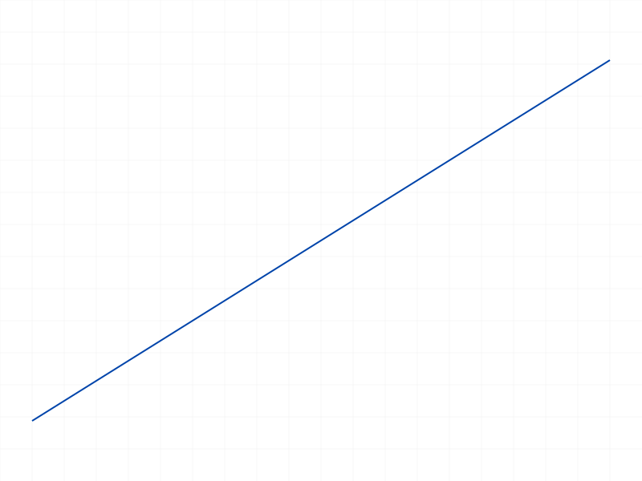
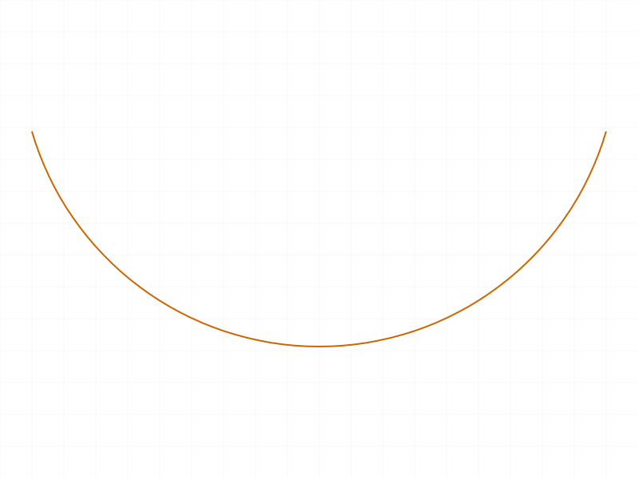
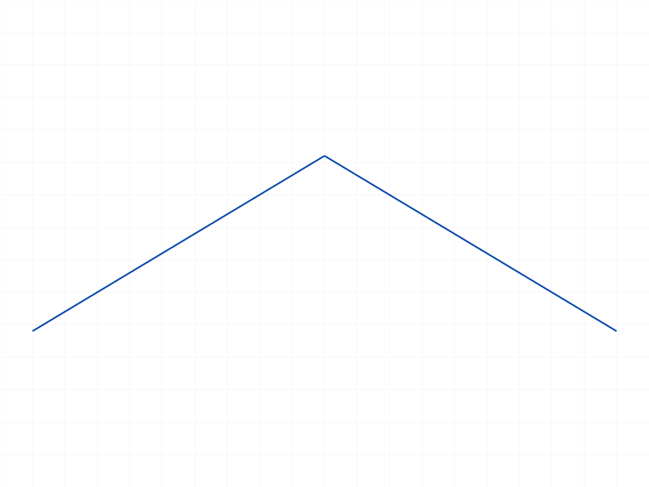
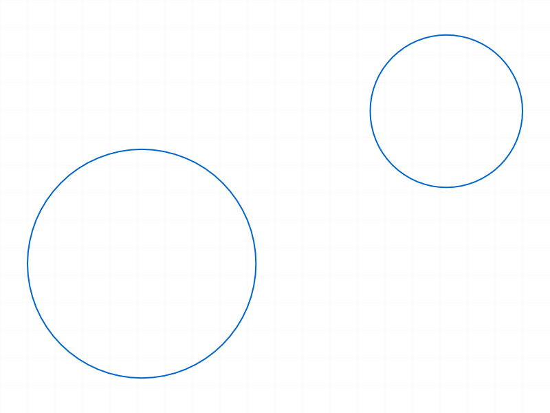

# Training: sketch.getPoints

**Date:** 2026-04-10

## Goal

Testing `v1.sketch.getPoints` — returns point IDs (start, end, center) for sketch curves.

**Methods to cover:**

- `getPoints({ id })` with a **line** → expects `{ startId, endId }`
- `getPoints({ id })` with an **arc** → expects `{ startId, endId, centerId }`
- `getPoints({ id })` with a **circle** → expects `{ centerId }`
- `getPoints({ id })` with a **point** → what happens? (docs say lines/arcs/circles only)
- `getPoints({ id })` with a **rectangle** segment — do rectangle lines behave like regular lines?
- Edge: invalid ID, sketch ID instead of curve ID, part ID

**Questions:**

- Are the returned point IDs the same as standalone sketch point IDs? Can they be used with `getPositions`?
- Does `getPoints` work with all curve types or only the three documented?
- What does VOID return look like — when does it happen?
- Can returned point IDs be used as constraint targets?

---

## 01 — getPoints on a line

Script: `scripts/01-line.mjs` — ✅ as documented. Returns `{ startId: 59, endId: 60 }` for a line. maxLevel=31 (info).

|  |
|---|

**Data:** `result: { endId: 60, startId: 59 }`, maxLevel: 31, messages: [] (see `files/01-line-line-getPoints.json`).

---

## 02 — getPoints on an arc (arcByCenter)

Script: `scripts/02-arc.mjs` — ✅ as documented. Returns `{ startId: 60, endId: 59, centerId: 61 }`.

|  |
|---|

**Data:** `result: { centerId: 61, endId: 59, startId: 60 }`, maxLevel: 31 (see `files/02-arc-arc-getPoints.json`).

---

## 03 — getPoints on a circle

Script: `scripts/03-circle.mjs` — ✅ as documented. Returns `{ centerId: 59 }` only. No startId/endId (circles have no endpoints).

|  |
|---|

**Data:** `result: { centerId: 59 }`, maxLevel: 31 (see `files/03-circle-circle-getPoints.json`).

---

## 04 — getPoints on a standalone point (error)

Script: `scripts/04-point.mjs` — ❌ Error as expected. Points are not curves.

**Data:** result: null, maxLevel: 51 (ERROR). Message: `The parameter "id" has a wrong id type! Provide only following id types: ["sketch-curve"]` (code 1001).

**Learned:** `getPoints` strictly requires a `sketch-curve` ID. Standalone points (created with `sketch.point`) are not sketch-curves — they are a different ID type. The docs say "lines, arcs or circles" and the server enforces this with a clear error.

📌 LLM doc: Document that passing a point ID returns error 1001 — only sketch-curve IDs (lines, arcs, circles) are accepted.

---

## 05 — getPoints on rectangle lines

Script: `scripts/05-rectangle-lines.mjs` — ✅ works. Rectangle produces 4 line IDs, each returns `{ startId, endId }`.

|  |
|---|

**Data:** All 4 lines return valid start/end IDs:
- line 0 (id=58): `{ startId: 59, endId: 60 }`
- line 1 (id=64): `{ startId: 65, endId: 66 }`
- line 2 (id=70): `{ startId: 71, endId: 72 }`
- line 3 (id=76): `{ startId: 77, endId: 78 }`

See `files/05-rectangle-lines-rectangle-getPoints.json`.

**Learned:** Rectangle lines are regular sketch-curves. Each line in the rectangle has its own independent start/end point IDs. The point IDs are NOT shared between lines (see script 10 for explicit test).

---

## 06 — point IDs usable with getPositions

Script: `scripts/06-point-ids-with-getPositions.mjs` — ✅ Point IDs from `getPoints` work directly with `getPositions`.

**Data:** Line created from [10,20,0] to [70,60,0].
- `getPoints` → `{ startId: 59, endId: 60 }`
- `getPositions({ id: 59 })` → `{ pos: { x: 10, y: 20, z: 0 } }` ✓ matches creation start
- `getPositions({ id: 60 })` → `{ pos: { x: 70, y: 60, z: 0 } }` ✓ matches creation end
- Direct `getPositions({ id: lineId })` → `{ startPos: {x:10,y:20,z:0}, endPos: {x:70,y:60,z:0} }` — same coords

See `files/06-point-ids-with-getPositions-positions-comparison.json`.

**Learned:** `getPoints` returns real sketch-point IDs that are fully usable with `getPositions`. The `getPositions` call on a point ID returns `{ pos: {x,y,z} }` format, while calling `getPositions` on the line directly returns `{ startPos, endPos }` format.

📌 LLM doc: Point IDs from `getPoints` are valid sketch-point IDs usable with `getPositions` and likely with constraints.

---

## 07 — arc center point ID with getPositions

Script: `scripts/07-arc-center-with-getPositions.mjs` — ✅ All three point IDs (start, end, center) resolve correctly.

**Data:** Arc created with center [50,40,0], start [80,40,0], end [50,70,0].
- `getPoints` → `{ centerId: 61, endId: 59, startId: 60 }`
- startId → `{ pos: {x:80, y:40, z:0} }` ✓
- endId → `{ pos: {x:50, y:70, z:0} }` ✓
- centerId → `{ pos: {x:50, y:39.999999999999, z:0} }` ✓ (floating-point near 40)
- Direct `getPositions(arcId)` → same coordinates

See `files/07-arc-center-with-getPositions-arc-points-positions.json`.

**Learned:** Minor floating-point imprecision on center Y (39.999... vs 40). This is normal numerical noise from the geometry kernel — not a bug. All point IDs resolve correctly.

---

## 08 — invalid IDs (error cases)

Script: `scripts/08-invalid-id.mjs` — ❌ All three cases error as expected.

**Data (see `files/08-invalid-id-invalid-ids.json`):**
- **Sketch ID** → result: null, maxLevel: 51, error code 1001: `wrong id type! Provide only following id types: ["sketch-curve"]`
- **Part ID** → same error as sketch ID (code 1001, same message)
- **Bogus ID (99999)** → result: null, maxLevel: 51, TWO messages: warning code 0 `ToId()/TOID() didn't get an existing or valid id.` + error code 1006 `An element of parameter "id" has an invalid id!`

**Learned:** Server distinguishes between "wrong ID type" (code 1001, when the ID exists but isn't a sketch-curve) and "invalid ID" (code 1006, when the ID doesn't exist at all). Bogus IDs produce a warning+error pair.

📌 LLM doc: Document the two error modes — wrong type (1001) vs invalid/nonexistent (1006).

---

## 09 — getPoints on arcBy3Points

Script: `scripts/09-arcBy3Points.mjs` — ✅ Returns same `{ startId, endId, centerId }` structure as arcByCenter.

**Data:** Arc via 3 points [0,0,0], [30,40,0], [60,0,0]. `getPoints` → `{ centerId: 61, endId: 59, startId: 60 }`. Center position resolved to `{ x: 30, y: 8.75, z: 0 }` — server computed the geometric center.

|  |
|---|

**Learned:** Both arc creation methods (arcByCenter, arcBy3Points) produce the same getPoints output. The centerId always exists and points to the geometric center, even when created via 3 points.

---

## 10 — shared points between connected lines

Script: `scripts/10-shared-points.mjs` — Interesting finding: **lines do NOT share point IDs** at their junction.

|  |
|---|

**Data:** Two lines connected at [50,30,0]:
- line1: `{ startId: 59, endId: 60 }`
- line2: `{ startId: 65, endId: 66 }`
- `line1.endId (60) === line2.startId (65)` → **false**

See `files/10-shared-points-shared-points.json`.

**Learned:** Each line has its own independent point objects, even when they share the same coordinate. Lines created separately don't share point IDs at coincident endpoints. The sketch constraint system (coincident constraints) is what links them topologically — not shared point IDs.

📌 LLM doc: Lines do NOT share point IDs at coincident endpoints. Each geometry owns its own points. Topological connection requires coincident constraints.

---

## 11 — multiple circles, distinct center IDs

Script: `scripts/11-multiple-circles.mjs` — ✅ Each circle has its own unique centerId.

|  |
|---|

**Data:** circle1 centerId=59, circle2 centerId=62. Different IDs — confirmed.

See `files/11-multiple-circles-multiple-circles.json`.

---

## Coverage Check

- [x] `getPoints` called successfully (scripts 01-03)
- [x] Required parameter `id` tested
- [x] All geometry types tested: line (01, 05), arc via arcByCenter (02), arc via arcBy3Points (09), circle (03)
- [x] Point type tested and confirmed unsupported (04)
- [x] Error cases: wrong ID type, invalid ID, sketch/part ID (08)
- [x] Point IDs verified usable with `getPositions` (06, 07)
- [x] No `update` or `delete` variant exists for getPoints (query-only API)
- [x] Realistic usage: rectangle lines (05), connected lines (10), multiple circles (11)
- [x] Behavioral claims verified with data (all scripts use filewrite)

All questions answered. No gaps.
