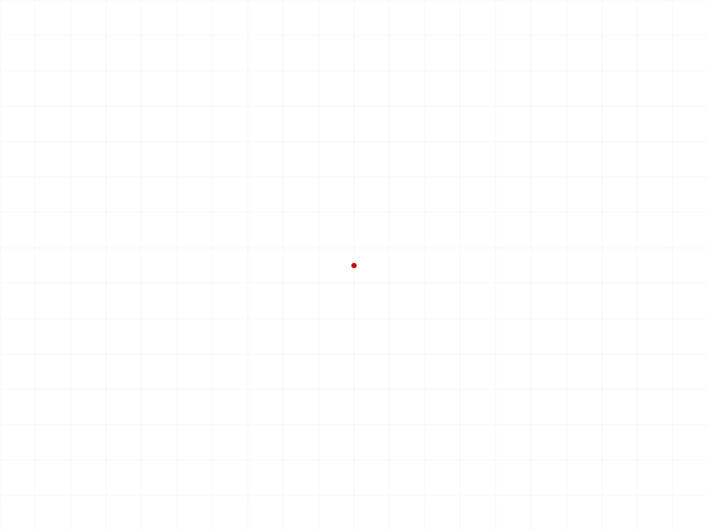
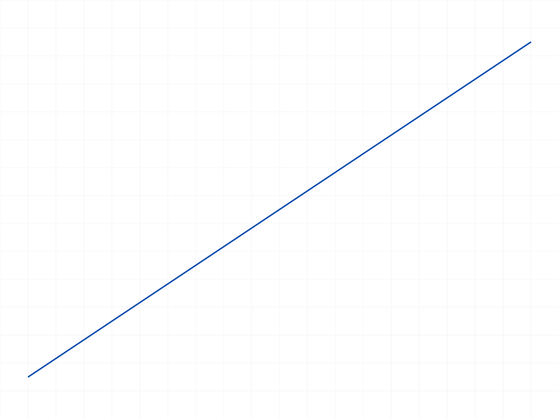
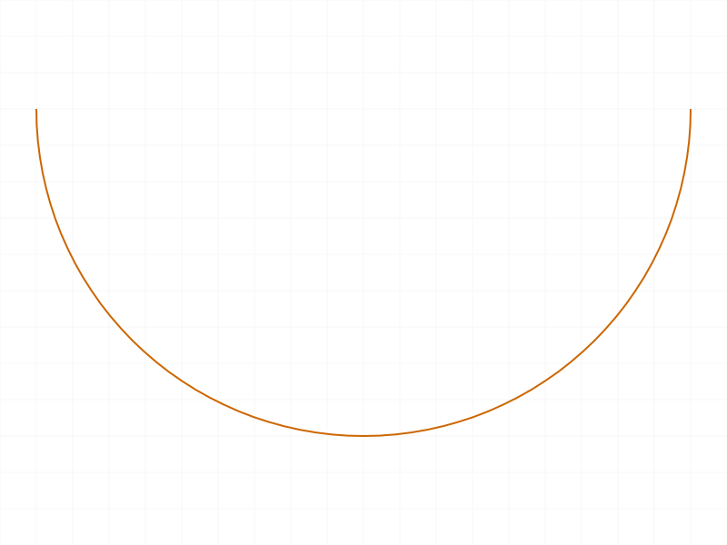

# Training: sketch.getPositions

**Date:** 2026-04-10

## Goal

Testing `v1.sketch.getPositions` — returns coordinate positions for sketch geometry (points, lines, arcs, circles).

**Methods to cover:**

- `getPositions` with a **point** ID — expects `{ pos: point }`
- `getPositions` with a **line** ID — expects `{ startPos: point, endPos: point }`
- `getPositions` with an **arc** ID — expects `{ startPos: point, endPos: point, centerPos: point }`
- `getPositions` with a **circle** ID — expects `{ centerPos: point }`
- `getPositions` with point IDs obtained from `getPoints` (indirect resolution)
- Error cases: invalid ID, wrong ID type (part, sketch), missing param

**Questions:**

- What exact format are positions returned in? `{ x, y, z }` named object or `[x, y, z]` array?
- Does `getPositions` on a curve return the same coordinates as `getPoints` → `getPositions` on each point?
- What happens with `arcBy3Points` vs `arcByCenter` — same return shape?
- Does rectangle decompose — can I call getPositions on each rectangle line?
- What does calling getPositions on a sketch ID or part ID return?
- Does position reflect updates after `updateGeometry`?

---

## 01 — getPositions on a point

Script: `scripts/01-point.mjs` — ✅ returns `{ pos: { x: 25, y: 40, z: 0 } }`, maxLevel=31.

|  |
|---|

**Data:** Position is a named `{ x, y, z }` object, not an array. Preserves exact input values (no floating-point noise on simple integers).

## 02 — getPositions on a line

Script: `scripts/02-line.mjs` — ✅ returns `{ startPos: { x: 10, y: 20, z: 0 }, endPos: { x: 70, y: 60, z: 0 } }`, maxLevel=31.

|  |
|---|

## 03 — getPositions on a circle (FAILS)

Script: `scripts/03-circle.mjs` — ❌ returns null, maxLevel=51.

Error: `[Evaluation error in SketchAPI_v1.getPositions::PROC:[CCVM::lcm: objId not found]]` (code 0, level 51).

**Learned:** Despite docs claiming circle returns `{ centerPos }`, `getPositions` fails on circle IDs with an internal eval error. This is a doc discrepancy or server bug.

**📌 LLM doc:** `getPositions` does NOT work on circles. Use `getPoints(circleId)` → `getPositions(centerId)` as workaround.

## 04 — getPositions on arcByCenter

Script: `scripts/04-arc-by-center.mjs` — ✅ returns `{ startPos, endPos, centerPos }` all as `{ x, y, z }` objects, maxLevel=31. Values match creation inputs exactly.

|  |
|---|

## 05 — getPositions on arcBy3Points

Script: `scripts/05-arc-by-3points.mjs` — ✅ same return shape as arcByCenter: `{ startPos, endPos, centerPos }`. The `centerPos` is computed from the 3-point definition (`{ x: 20, y: 0, z: 0 }`).

|  |
|---|

**Learned:** Both arc creation methods produce identical `getPositions` output. No `midPos` returned — the midpoint from `arcBy3Points` is not part of the canonical representation.

## 06 — getPositions on rectangle lines

Script: `scripts/06-rectangle-lines.mjs` — ✅ all 4 lines return `{ startPos, endPos }`. Rectangle `[0,0,0]→[80,50,0]` produces 4 lines forming a closed loop:

| Line | startPos | endPos |
|------|----------|--------|
| 58 | (0,0,0) | (80,0,0) |
| 64 | (80,0,0) | (80,50,0) |
| 70 | (80,50,0) | (0,50,0) |
| 76 | (0,50,0) | (0,0,0) |

|  |
|---|

**Data:** See `files/06-rectangle-lines-rectangle-positions.json`.

## 07 — getPoints vs getPositions comparison

Script: `scripts/07-getpoints-vs-getpositions.mjs` — ✅ both methods produce identical coordinates. Direct `getPositions(lineId)` returns `{ startPos, endPos }` and indirect `getPoints(lineId)` → `getPositions(startId/endId)` returns `{ pos }` with matching values.

**Data:** `startMatch: true, endMatch: true` (see `files/07-getpoints-vs-getpositions-comparison.json`).

## 08 — error cases

Script: `scripts/08-error-wrong-id-type.mjs` — tested 4 error cases:

| Case | maxLevel | Code | Message |
|------|----------|------|---------|
| sketch ID | 51 | 1001 | wrong id type: `["sketch-curve","sketch-point"]` |
| part ID | 51 | 1001 | wrong id type: `["sketch-curve","sketch-point"]` |
| bogus ID (99999) | 51 | 1006 | invalid id (+ warning code 0 about ToId) |
| missing `id` | 51 | 1004 | parameter "id" must be provided |

**Learned:** Accepted ID types are `["sketch-curve","sketch-point"]`. Sketch and part IDs are explicitly rejected. Error messages are consistent with other sketch APIs.

**📌 LLM doc:** Document accepted types and error codes.

## 09 — updateGeometry with wrong params (failed)

Script: `scripts/09-after-update.mjs` — ❌ used wrong `updateGeometry` signature (passed point ID as `id` instead of sketch ID). maxLevel=51. This is a script bug, not a getPositions issue.

## 10 — position format analysis

Script: `scripts/10-position-format.mjs` — partial success (crashed on circle). Confirmed format for all working types:

| Type | Result keys | Position format |
|------|-------------|-----------------|
| point | `{ pos }` | `{ x, y, z }` |
| line | `{ endPos, startPos }` | `{ x, y, z }` each |
| arc | `{ centerPos, endPos, startPos }` | `{ x, y, z }` each |
| circle | crashes (null result) | N/A |

**Learned:** Positions are always `{ x, y, z }` named objects. Decimals preserved (tested 15.5, 22.3).

## 11 — circle workaround via getPoints

Script: `scripts/11-circle-via-getpoints.mjs` — ✅ workaround confirmed. `getPositions(circleId)` fails, but `getPoints(circleId)` → `{ centerId: 59 }` → `getPositions(59)` → `{ pos: { x: 30, y: 30, z: 0 } }` works.

**📌 LLM doc:** Document the getPoints workaround for circles.

## 12 — updateGeometry with wrong params (line ID)

Script: `scripts/12-update-then-getpos.mjs` — ❌ `updateGeometry` requires sketch ID, not line ID. Error 1001: `Provide only following id types: ["sketch"]`. Script bug — see 16 for correct version.

## 13 — point update (wrong params)

Script: `scripts/13-point-update-reflect.mjs` — ❌ same issue as 12 — passed point ID instead of sketch ID to `updateGeometry`. See 16 for correct approach.

## 14 — arc position floating-point precision

Script: `scripts/14-arc-positions-precision.mjs` — ✅ Arc `center=(0,0,0)`, `start=(10,0,0)`, `end=(0,10,0)`.

Center returned as `{ x: 0, y: -4.440892098500626e-16, z: 0 }` — epsilon noise on y coordinate (should be 0). This is standard kernel floating-point behavior.

**Direct vs indirect positions match exactly** — same epsilon noise in both paths.

**📌 LLM doc:** Note floating-point noise on computed positions (especially arc centers).

## 15 — circle center resolved via getPoints

Script: `scripts/15-circle-center-via-getpoints.mjs` — ✅ circle at (50,50,0) radius 25. `getPoints` → `{ centerId: 59 }`, `getPositions(59)` → `{ pos: { x: 50, y: 50, z: 0 } }`. Clean values, no noise.

## 16 — correct updateGeometry + getPositions verification

Script: `scripts/16-update-correct.mjs` — ✅ Used correct `updateGeometry` signature (sketch ID + geometry arrays). Both line and point positions updated and confirmed via `getPositions`:

- Line: `(10,20)→(70,60)` updated to `(0,0)→(100,80)` — **confirmed**
- Point: `(5,5,0)` updated to `(50,50,0)` — **confirmed**

**Data:** `files/16-update-correct-correct-update.json`

**📌 LLM doc:** `getPositions` reflects `updateGeometry` changes immediately.

---

## Summary of Findings

1. **Position format**: always `{ x, y, z }` named object (not `[x,y,z]` array)
2. **Point**: returns `{ pos: { x, y, z } }`
3. **Line**: returns `{ startPos: { x, y, z }, endPos: { x, y, z } }`
4. **Arc** (both types): returns `{ startPos, endPos, centerPos }` — no `midPos`
5. **Circle**: **FAILS** — returns null/error. Use `getPoints → getPositions(centerId)` workaround
6. **Accepted ID types**: `["sketch-curve", "sketch-point"]`
7. **Floating-point noise**: arc center positions may have epsilon-level noise
8. **Reflects updates**: positions update immediately after `updateGeometry`
9. **Direct vs indirect**: `getPositions(curveId)` and `getPoints → getPositions(pointId)` produce identical values
