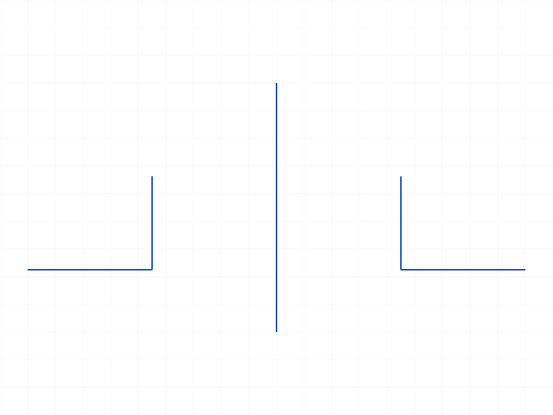
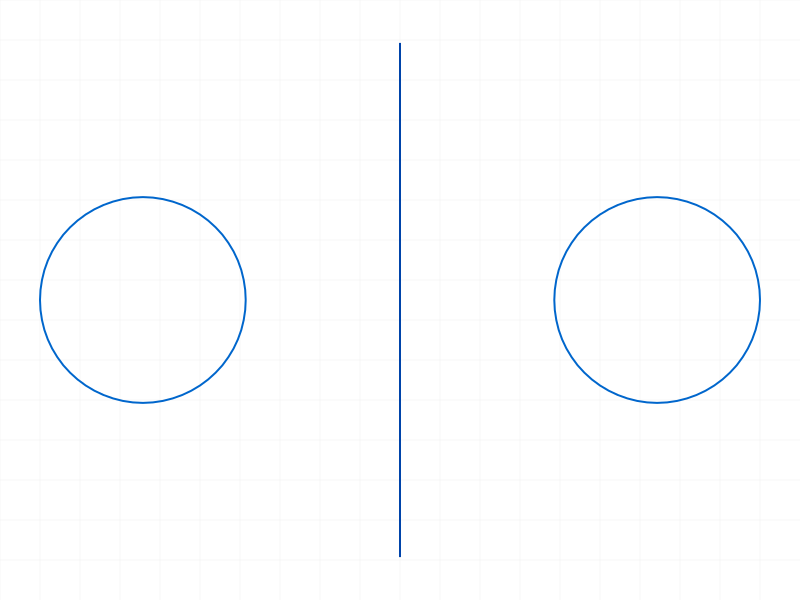
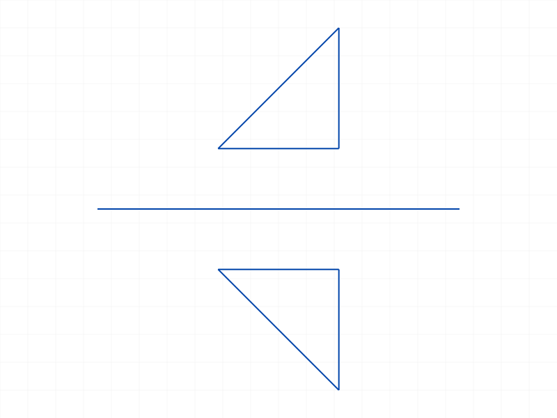
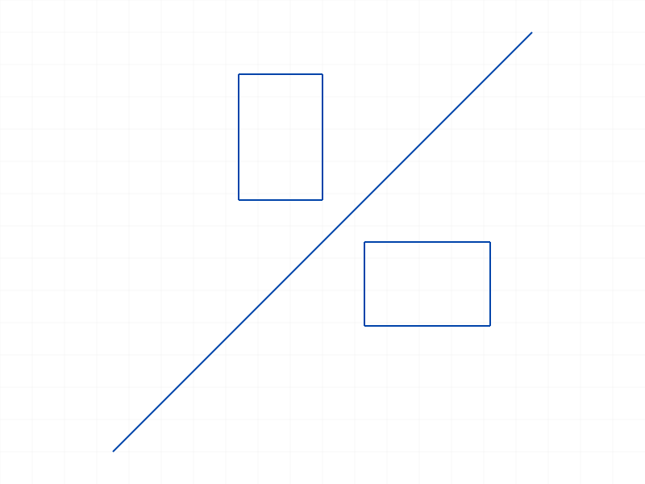
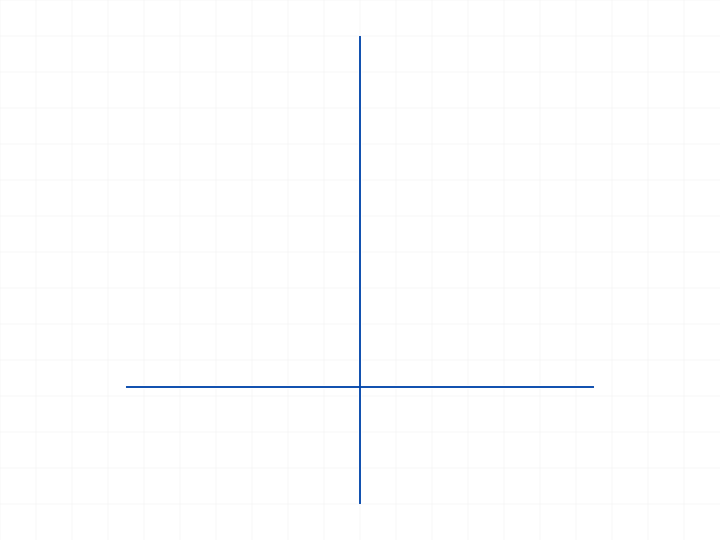
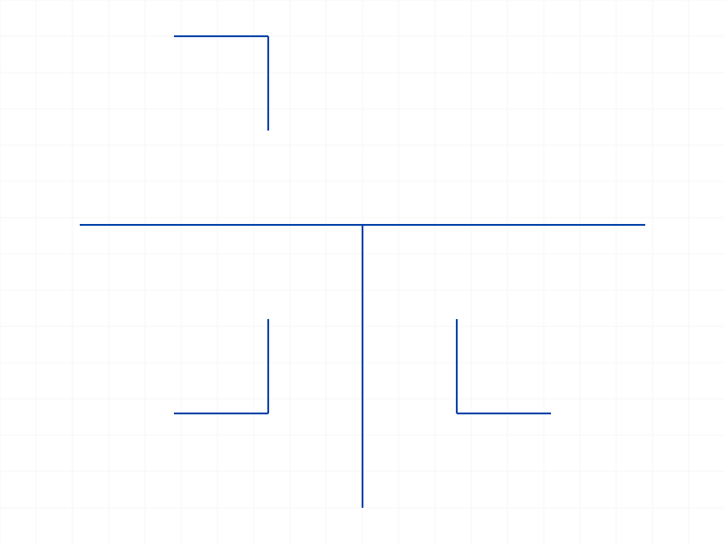
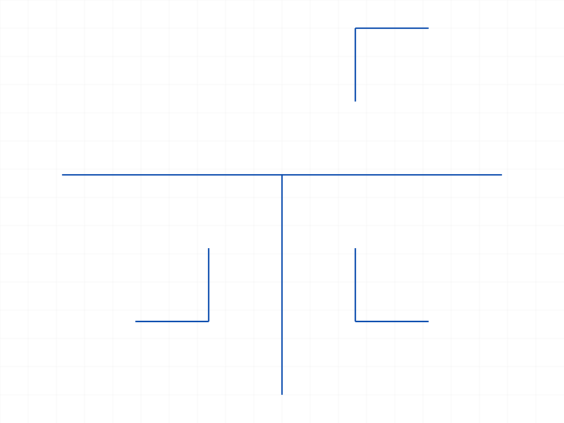
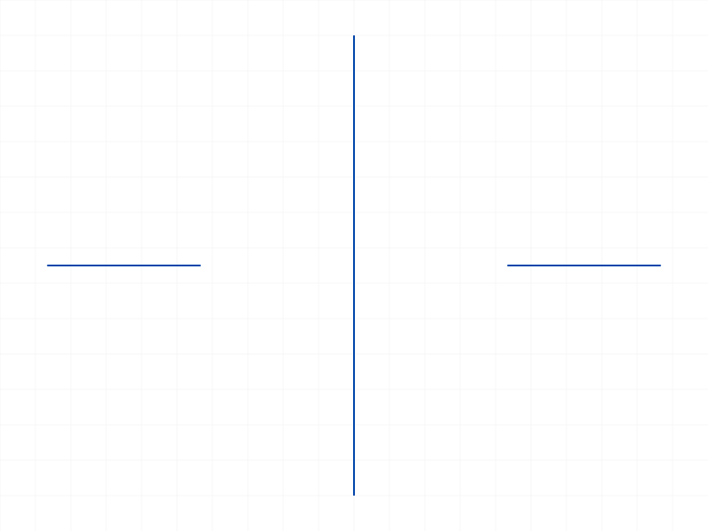
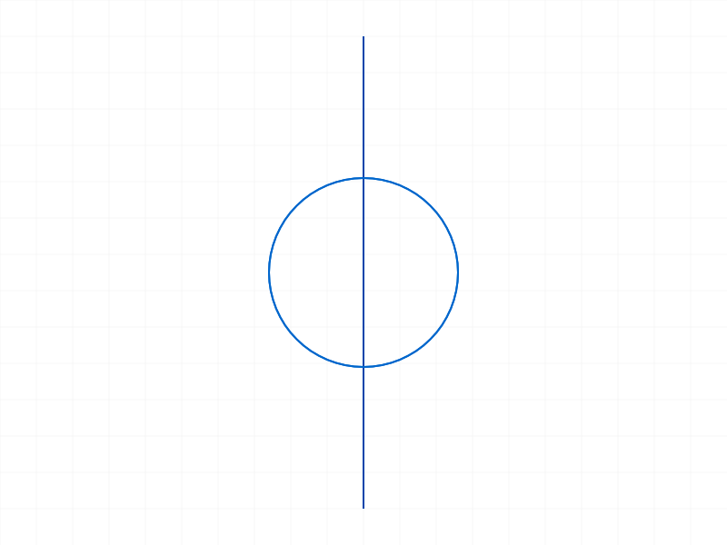
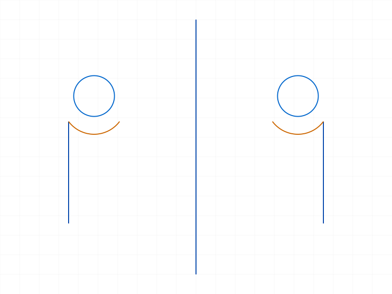

# Training: sketch.mirrorPattern

**Date:** 2026-04-10

## Goal

Testing `v1.sketch.mirrorPattern` — mirrors a rigid set (or single geometry) across a symmetry line.

**Methods to cover:**

- `mirrorPattern` — basic mirroring of a rigid set across a line
- `mirrorPattern` params: id, rigidSetId, symmetryLineId
- Single geometry ID as rigidSetId (auto-wrap behavior, like linearPattern/circularPattern)
- Return value: `{ constraint, geometry }` — what IDs are returned
- Symmetry line variations: horizontal, vertical, diagonal, off-center
- Edge cases: mirror across arc/circle (non-line geometry as symmetryLineId)
- Deletion of mirror pattern constraint
- Multiple mirror operations on same geometry

**Questions:**

- Does `geometry` array include the original rigid set? What is its length?
- Can a single geometry ID be passed as rigidSetId (auto-wrap)?
- What types of geometry work as symmetryLineId? Lines only, or arcs/circles too?
- Can the symmetry line be part of the rigid set being mirrored?
- What happens with an invalid symmetryLineId?
- Is there an updateMirrorPattern? (docs don't show one)
- Does deleting the pattern constraint preserve mirrored geometry?

---

## 01 — basic mirror (rigid set across vertical line)

Script: `scripts/01-basic-mirror.mjs` — ✅ L-shape (two lines) mirrored across vertical symmetry line at x=40.

Result: `{ constraint: 90, geometry: [74, 88] }`. maxLevel 31. `geometry[0]` = original rigid set, `geometry[1]` = mirrored copy rigid set. Array length always 2.

|  |
|---|

**📌 LLM doc:** geometry always has exactly 2 entries (original + 1 copy). Unlike linear/circular, there's no count parameter — mirror always produces exactly one copy.

---

## 02 — single geometry as rigidSetId

Script: `scripts/02-single-geom.mjs` — ✅ Single circle ID passed as rigidSetId. Auto-wrapped into rigid set internally.

Result: `{ constraint: 73, geometry: [67, 71] }`. geometry[0] = 67 (new auto-created rigid set, NOT the original circle ID 58). maxLevel 31.

|  |
|---|

**📌 LLM doc:** Single geometry ID works as rigidSetId — auto-wrapped. geometry[0] is a new rigid set ID, not the original geometry ID.

---

## 03 — horizontal symmetry line

Script: `scripts/03-horizontal-sym.mjs` — ✅ Triangle above X axis mirrored across horizontal line at y=0. geometry length 2, maxLevel 31.

|  |
|---|

---

## 04 — diagonal symmetry line

Script: `scripts/04-diagonal-sym.mjs` — ✅ Rectangle mirrored across 45° diagonal through origin. Works as expected. geometry length 2, maxLevel 31.

|  |
|---|

---

## 05 — symmetry line in rigid set (self-reference)

Script: `scripts/05-sym-line-in-rigidset.mjs` — ✅ Symmetry line is also a member of the rigid set being mirrored. No error (maxLevel 31). The mirror operation succeeds — the line mirrors itself onto itself while the other geometry mirrors normally.

|  |
|---|

**📌 LLM doc:** Symmetry line can be part of the mirrored rigid set without error. The line effectively mirrors onto itself.

---

## 06 — circle as symmetryLineId

Script: `scripts/06-circle-as-sym.mjs` — ❌ Error. Only `sketch-line` type accepted.

Result: null. maxLevel 51. Message: `"The parameter \"symmetryLineId\" has a wrong id type! Provide only following id types: [\"sketch-line\"]"` (code 1001).

**📌 LLM doc:** symmetryLineId only accepts sketch lines. Circles, arcs, and other geometry types are rejected with error 1001.

---

## 07 — invalid symmetryLineId

Script: `scripts/07-invalid-sym-id.mjs` — ❌ Error with bogus string ID.

Result: null. maxLevel 51. Two messages: warning (code 0, level 41) about string conversion failure, then error (code 1006, level 51) about invalid ID.

---

## 08 — delete pattern constraint

Script: `scripts/08-delete-pattern.mjs` — ✅ Deleting the constraint preserves all mirrored geometry.

Mirror result: `{ constraint: 73, geometry: [61, 71] }`. After `deleteObject({ ids: [73] })`: maxLevel 31, both circles remain visible.

|  |  |
|---|---|

**📌 LLM doc:** Deleting the pattern constraint preserves mirrored geometry as independent sketch geometry. Consistent with linear/circular pattern behavior.

---

## 09 — multiple mirrors of same rigid set

Script: `scripts/09-multiple-mirrors.mjs` — ✅ Same rigid set mirrored across two different lines. Both succeed independently.

Mirror 1 result: `{ constraint: 88, geometry: [72, 86] }`. Mirror 2 result: `{ constraint: 104, geometry: [72, 102] }`. Note geometry[0] is the same original rigid set (72) in both results. maxLevel 31 for both.

|  |
|---|

---

## 10 — chain mirror (mirror the copy)

Script: `scripts/10-mirror-mirrored.mjs` — ✅ Mirrored copy (geometry[1] from first mirror) used as rigidSetId for second mirror.

Mirror 1 geometry: [72, 86]. Mirror 2 uses copyRsId=86, result: `{ constraint: 104, geometry: [86, 102] }`. maxLevel 31.

|  |
|---|

**📌 LLM doc:** Copies (geometry[1]) can be used as rigidSetId for further pattern operations.

---

## 11 — arc as symmetryLineId

Script: `scripts/11-arc-as-sym.mjs` — ❌ Same error as circle. Only `sketch-line` accepted. Code 1001, level 51.

---

## 12 — verify positions via getGeometry

Script: `scripts/12-verify-positions.mjs` — getPositions fails on rigid set ID (maxLevel 51), but getGeometry works on the copy rigid set, returning its member geometry IDs (`{ lines: [71], arcs: [], circles: [], points: [] }`).

|  |
|---|

---

## 13 — no dimension, no updateMirrorPattern

Script: `scripts/13-no-dimension.mjs` — ✅ Confirmed.

Result keys: `['constraint', 'geometry']` only. No `dimension` or `dimensions` field. `api.v1.sketch.updateMirrorPattern` is `undefined`.

**📌 LLM doc:** Unlike linearPattern (dimensions) and circularPattern (dimension), mirrorPattern returns NO dimension. There is no updateMirrorPattern method. The mirror is fully defined by the symmetry line position — to change the mirror axis, delete and recreate.

---

## 14 — geometry centered on symmetry line

Script: `scripts/14-on-symmetry-line.mjs` — ✅ Circle centered exactly on the symmetry line. No error, geometry length 2. The copy overlaps the original exactly (both at x=30).

|  |
|---|

**📌 LLM doc:** Geometry on the symmetry line creates a copy that overlaps the original. No error or special handling.

---

## 15 — mixed geometry types in rigid set

Script: `scripts/15-mixed-geometry.mjs` — ✅ Rigid set with line + circle + arc mirrors correctly. geometry length 2, maxLevel 31.

|  |
|---|

---

## 16 — numerical coordinate verification

Script: `scripts/16-verify-coords.mjs` — ✅ Original line: (10,5)→(20,5). Symmetry at x=30. Copy: (50,5)→(40,5).

**Data:** `original: {startPos: {x:10,y:5}, endPos: {x:20,y:5}}`, `copy: {startPos: {x:50,y:5}, endPos: {x:40,y:5}}`. Reflection formula `x' = 2*symX - x` confirmed. Note start/end swap: mirrored start corresponds to original start reflected, mirrored end to original end reflected (see `files/16-verify-coords-coords-verify.json`).

**📌 LLM doc:** Mirror reflection is geometric: each point (x,y) maps to (2*symX - x, y) for vertical lines. Start/end points of mirrored lines may swap relative to the original.

---

## Coverage Checklist

- [x] API called successfully (basic happy path)
- [x] Every required parameter tested (id, rigidSetId, symmetryLineId)
- [x] Key optional parameters — none exist (all 3 are required)
- [x] No enum values / type variants (not applicable)
- [x] No update method (confirmed: updateMirrorPattern does not exist)
- [x] Delete tested (deleteObject on constraint, geometry survives)
- [x] Realistic usage: multiple mirrors, chained mirrors, mixed geometry
- [x] Behavioral claims verified with data (coordinate verification in script 16)
