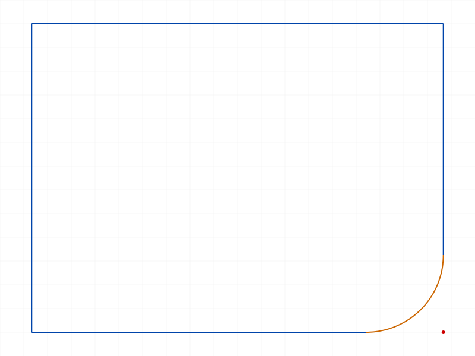
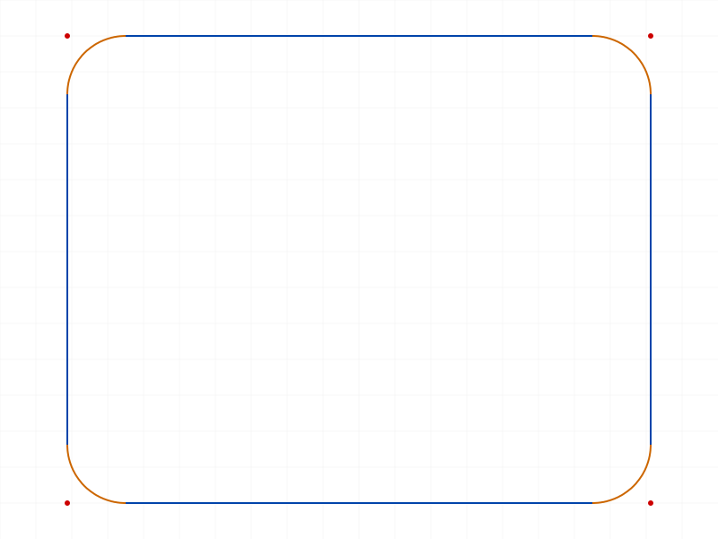
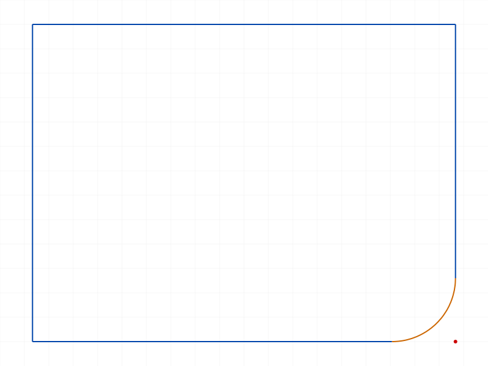
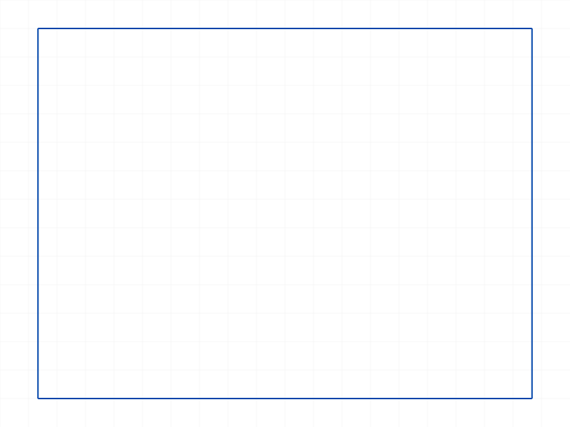
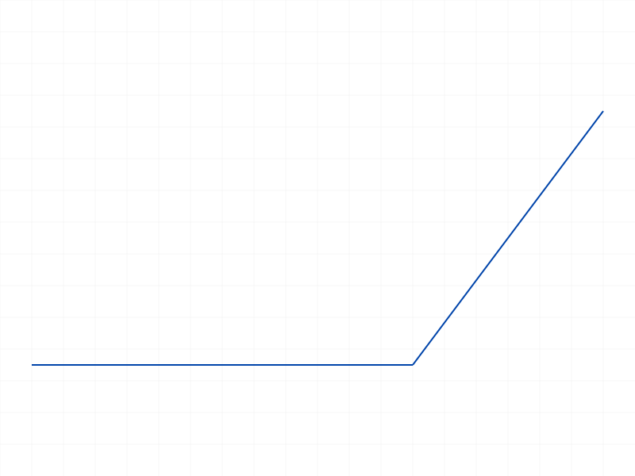
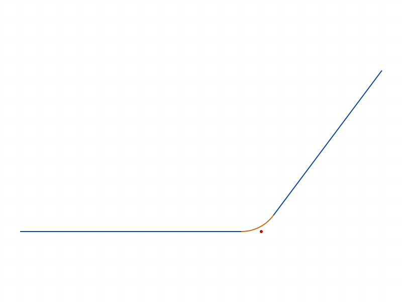
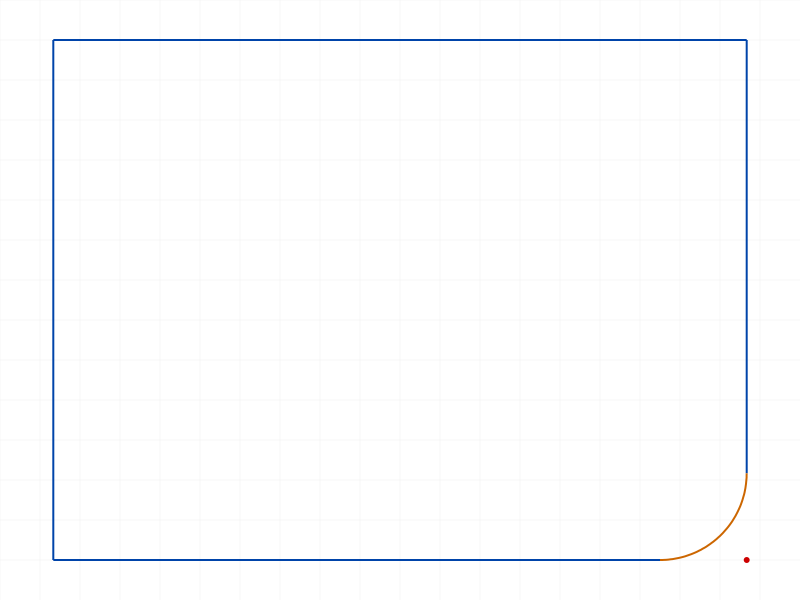
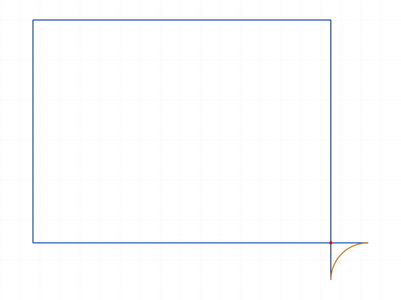

# Training: sketch.fillet & sketch.undoFillet

**Date:** 2026-04-10

## Goal

Testing `v1.sketch.fillet` and `v1.sketch.undoFillet`.

**Methods to cover:**

- `fillet` — create fillet arc between two connected lines
- `fillet` params: id, lineIds, offset, radius
- `fillet` return value: tuple of (arcId, controlPointId, startPointId, endPointId)
- `fillet` default behavior (no offset or radius — defaults to 1/4 shortest line)
- `fillet` — offset overrides radius when both provided
- `undoFillet` — remove fillet, reconnect lines
- `undoFillet` params: id, arcId

**Questions:**

- What exactly are the 4 returned IDs (arcId, controlPointId, startPointId, endPointId)?
- Does fillet work on non-connected lines?
- Can you fillet multiple corners of a rectangle?
- What happens with zero/negative/oversized offset or radius?
- Does undoFillet fully restore the original geometry?
- What happens if you undoFillet with an invalid arcId?

---

## 01 — basic fillet with offset

Script: `scripts/01-basic-offset.mjs` — ✅ fillet with `offset: 10` on two adjacent rectangle lines.

|  |  |
|---|---|

**Data:** Result `[94, 92, 96, 95]` = `[arcId, controlPointId, startPointId, endPointId]`. maxLevel=31 (INFO). The fillet arc (orange) replaces the corner with the original lines trimmed. Red dot is the control point.

## 02 — fillet with radius

Script: `scripts/02-basic-radius.mjs` — ✅ fillet with `radius: 15` works identically to offset. Returns `[94, 92, 96, 95]`, maxLevel=31.

|  |
|---|

## 03 — default fillet (no offset or radius)

Script: `scripts/03-default-fillet.mjs` — ✅ default fillet uses 1/4 of shortest line length. Rectangle is 80×60, shortest line = 60, so default offset = 15. Result `[94, 92, 96, 95]`, maxLevel=31.

|  |
|---|

## 04 — offset overrides radius

Script: `scripts/04-offset-overrides-radius.mjs` — ✅ when both `offset: 5` and `radius: 30` are provided, offset wins. The fillet is small (offset=5), confirming radius is ignored when offset is set. Result `[94, 92, 96, 95]`, maxLevel=31.

|  |
|---|

📌 LLM doc: `offset` takes precedence over `radius` — if both are set, `radius` is silently ignored.

## 05 — return value inspection

Script: `scripts/05-return-value-inspection.mjs` — ✅ destructured the 4 returned IDs.

|  |
|---|

**Data:** `arcId=94`, `controlPointId=92`, `startPointId=96`, `endPointId=95`. The `controlPointId` is the center/control point of the fillet arc (the red dot visible in snapshots). `startPointId` and `endPointId` are the new endpoints where the arc meets the trimmed lines. Structure tree dumped to `files/05-return-value-inspection-fillet-structure.json` (47KB).

📌 LLM doc: The return tuple is `[arcId, controlPointId, startPointId, endPointId]`. The `arcId` is what you pass to `undoFillet`. The other IDs are the points created by the fillet operation.

## 06 — multiple fillets on rectangle

Script: `scripts/06-multiple-fillets.mjs` — ✅ all 4 corners of a rectangle can be filleted sequentially.

|  |
|---|

**Data:** Four successful fillets with unique IDs: f1=`[94,92,96,95]`, f2=`[113,111,115,114]`, f3=`[132,130,134,133]`, f4=`[151,149,153,152]`. All maxLevel=31. Each fillet produces a distinct arc+points.

📌 LLM doc: Multiple fillets can be applied sequentially to different corners. Each gets unique IDs.

## 07 — undoFillet

Script: `scripts/07-undo-fillet.mjs` — ✅ `undoFillet` removes the fillet arc and reconnects the original lines.

|  |  |
|---|---|

**Data:** `undoFillet` returns `null` (VOID), maxLevel=31, no messages. The after snapshot shows the rectangle fully restored to its original shape.

📌 LLM doc: `undoFillet` returns VOID. Pass the `arcId` from the fillet result tuple.

## 08 — zero offset (edge case)

Script: `scripts/08-edge-zero-offset.mjs` — ❌ `offset: 0` fails with ERROR (maxLevel=51).

**Data:** Result `null`. Error messages: "Invalid arc parameters" and "CCVM::ldm: objId not found". A zero-size arc cannot be created.

📌 LLM doc: `offset: 0` is an error. Must be a positive value (or negative for exterior fillets).

## 09 — negative offset (edge case)

Script: `scripts/09-edge-negative-offset.mjs` — ✅ `offset: -10` succeeds! Returns `[94, 92, 96, 95]`, maxLevel=31.

**Learned:** Negative offset is accepted and creates a valid fillet. See script 17 for visual comparison.

## 10 — oversized offset (edge case)

Script: `scripts/10-edge-oversized-offset.mjs` — ❌ `offset: 70` on 80×60 rectangle fails. Shortest line is 60.

**Data:** Result `null`, maxLevel=51. Error: "Can't create a fillet with offset larger than line length!"

📌 LLM doc: Offset must be smaller than both line lengths. Clear error message when exceeded.

## 11 — zero radius (edge case)

Script: `scripts/11-zero-radius.mjs` — ❌ `radius: 0` fails with same error as zero offset.

**Data:** Result `null`, maxLevel=51. Same "Invalid arc parameters" error.

📌 LLM doc: `radius: 0` is an error, same as `offset: 0`.

## 12 — non-connected lines

Script: `scripts/12-non-connected-lines.mjs` — ❌ fillet requires lines that share a common point.

**Data:** Result `null`, maxLevel=51. Error: "Lines don't have incident points!"

📌 LLM doc: Lines must share an incident point (be connected). Two separate lines at the same coordinate may or may not share a point — rectangle lines are inherently connected.

## 13 — undoFillet with invalid arcId

Script: `scripts/13-undo-invalid-arc.mjs` — ❌ invalid arcId produces a clear error.

**Data:** Result `null`, maxLevel=51. Warning: "ToId()/TOID() didn't get an existing or valid id." Error code 1006: "An element of parameter 'arcId' has an invalid id!"

📌 LLM doc: Invalid arcId is properly rejected with error code 1006.

## 14 — fillet on angled lines

Script: `scripts/14-fillet-on-angle.mjs` — ✅ fillet works on lines meeting at any angle, not just 90°.

|  |  |
|---|---|

**Data:** Two lines meeting at ~53° angle, fillet with `radius: 10` succeeds. Result `[74, 72, 76, 75]`, maxLevel=31.

## 15 — undo then re-fillet

Script: `scripts/15-undo-then-redo.mjs` — ✅ after undoFillet, the same lines can be filleted again.

|  |
|---|

**Data:** First fillet `arcId=94`, undo succeeds (maxLevel=31), re-fillet produces NEW IDs `[115, 113, 117, 116]` (not the same as original). maxLevel=31.

📌 LLM doc: After undoFillet, re-filleting the same lines produces new IDs (not the original ones).

## 16 — double fillet on same lines

Script: `scripts/16-fillet-same-lines-twice.mjs` — ❌ cannot fillet the same line pair twice.

**Data:** First fillet succeeds `[94, 92, 96, 95]`. Second fillet returns `null`, maxLevel=51, error: "Lines don't have incident points!" — because after the first fillet, the two original lines no longer share a point (the arc separates them).

📌 LLM doc: After filleting, the original lines are trimmed and no longer share a point. Cannot fillet the same pair again.

## 17 — negative offset investigation

Script: `scripts/17-negative-offset-detail.mjs` — ✅ negative offset creates an *exterior* fillet.

|  |
|---|

**Data:** `offset: -10` succeeds with `[94, 92, 96, 95]`, maxLevel=31. The arc extends *outside* the rectangle corner instead of rounding it inward. The lines are extended beyond their intersection, and the arc connects them on the exterior.

📌 LLM doc: Negative offset = exterior fillet (arc on outside of corner). Positive offset = interior fillet (rounds the corner). Absolute value determines the fillet size.

## 18 — fillet with non-line geometry

Script: `scripts/18-fillet-non-lines.mjs` — ❌ fillet ONLY accepts `sketch-line` IDs.

**Data:** Passing a circle ID in `lineIds` returns `null`, maxLevel=51. Error: "The parameter 'lineIds' has a wrong id type! Provide only following id types: ['sketch-line']" (code 1001).

📌 LLM doc: `lineIds` strictly requires `sketch-line` type IDs. Arcs, circles, and other sketch elements are rejected with error code 1001.

---

## Coverage Check

- [x] `fillet` called successfully (scripts 01–06, 14, 15, 17)
- [x] Required params tested: `id`, `lineIds` (all scripts)
- [x] Optional params: `offset` (01, 04, 08–10, 17), `radius` (02, 11, 14)
- [x] Default behavior (03)
- [x] `offset` overrides `radius` (04)
- [x] `undoFillet` tested (07, 13, 15)
- [x] Edge cases: zero offset/radius (08, 11), negative offset (09, 17), oversized offset (10)
- [x] Error cases: non-connected lines (12), invalid arcId (13), non-line IDs (18), double fillet (16)
- [x] Realistic usage: multiple corners (06), undo-redo cycle (15)
- [x] Behavioral claims verified with data (all scripts use `filewrite` and `console.log`)
