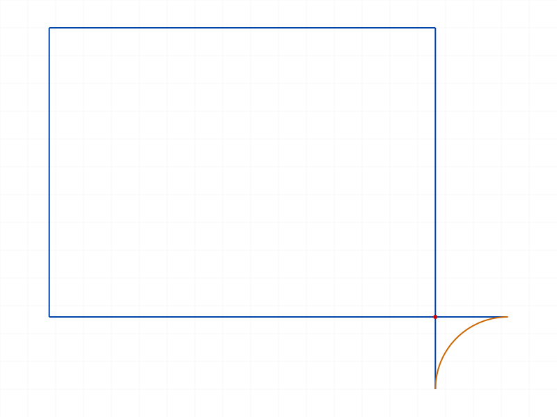
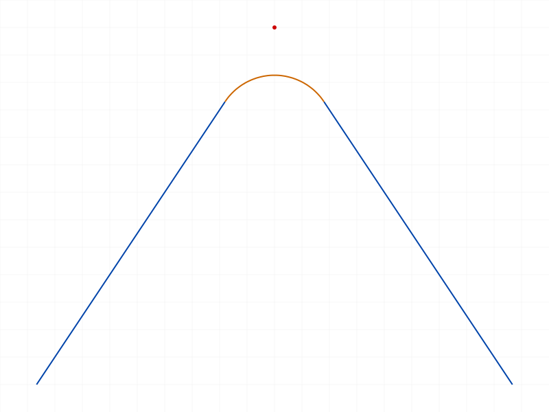
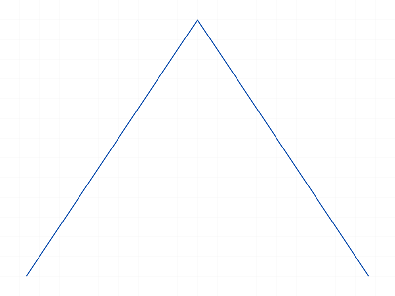
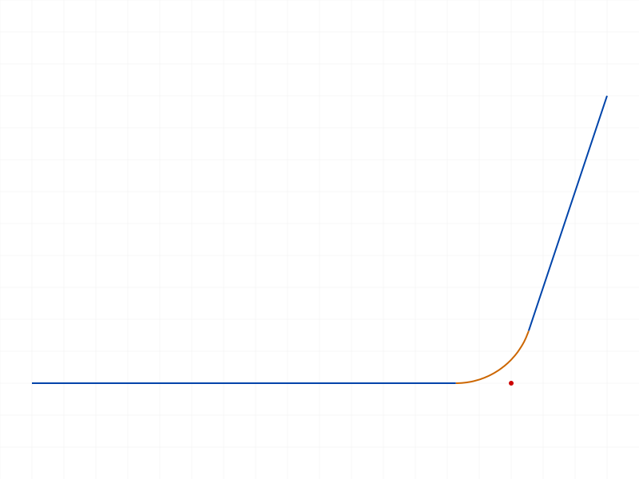
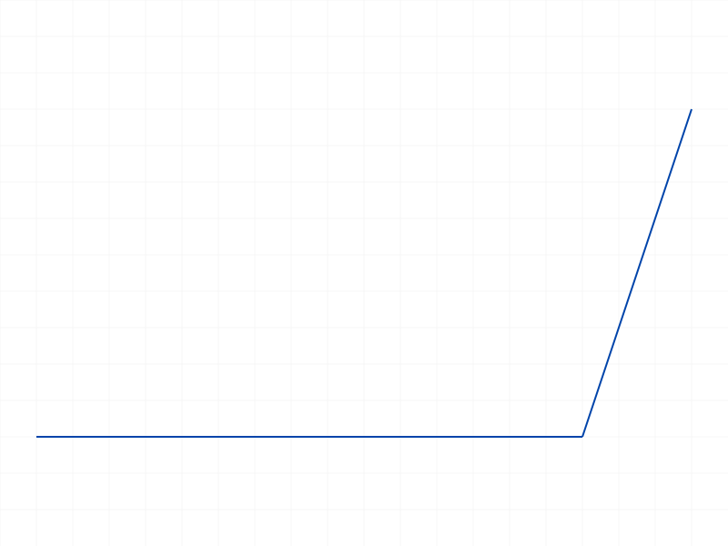
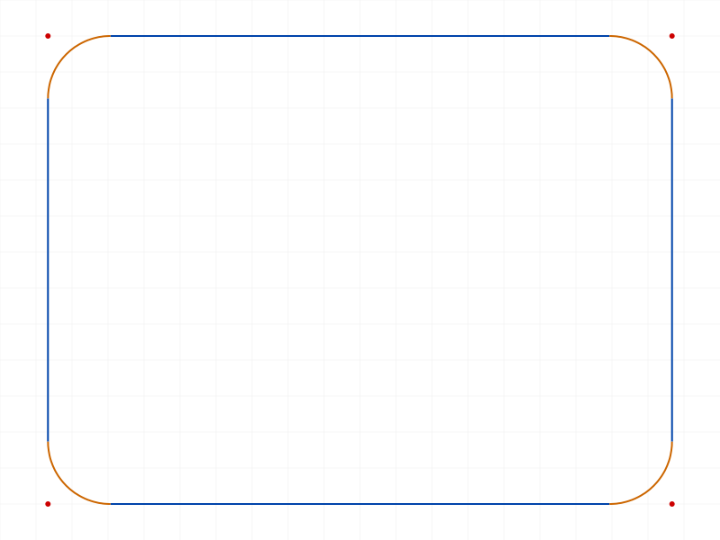
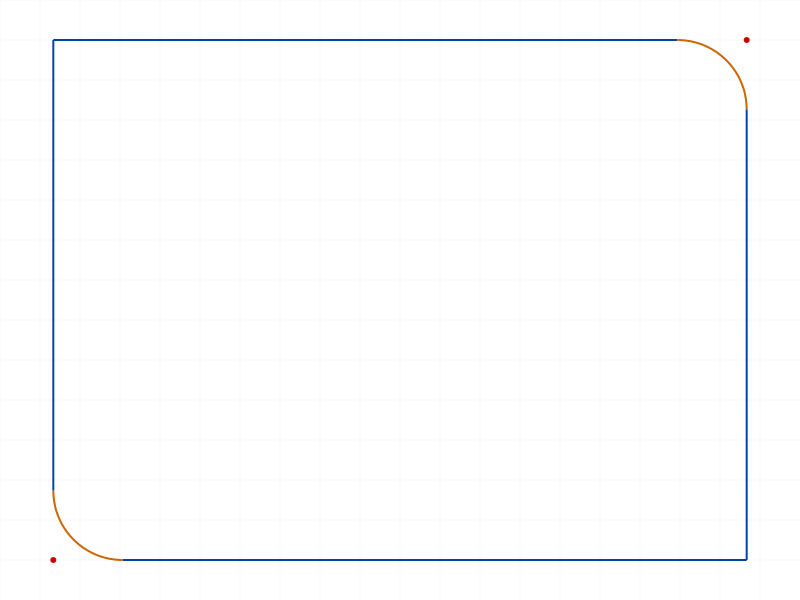
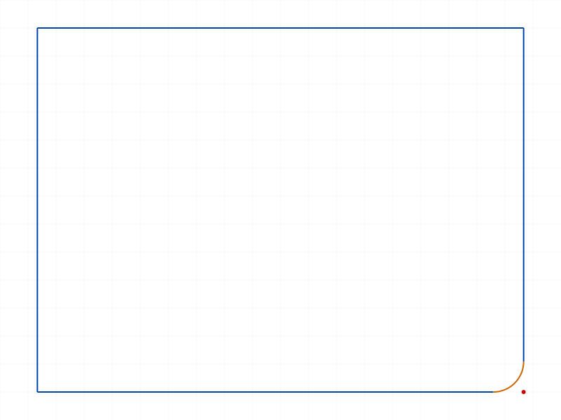
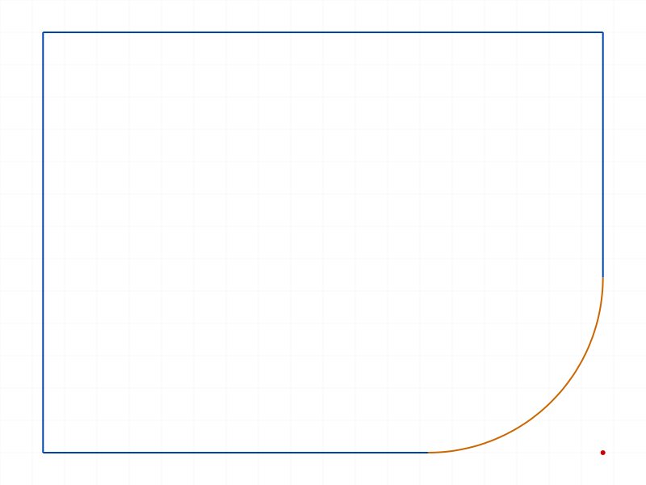
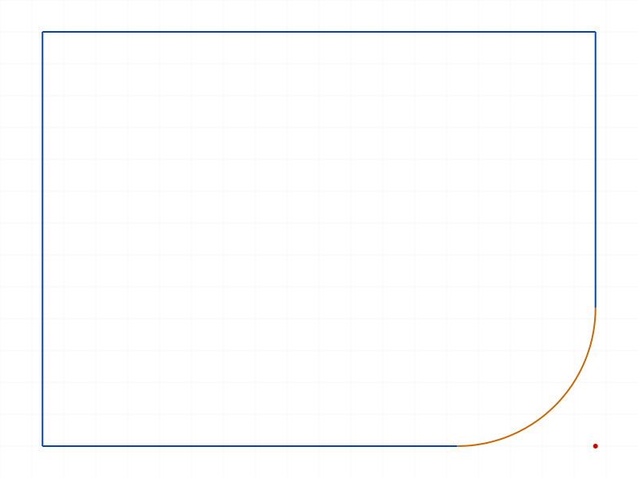

# Training: sketch.undoFillet

**Date:** 2026-04-10

## Goal

Deep-dive on `v1.sketch.undoFillet` — the previous fillet session covered basic undo (07), invalid arcId (13), and undo-then-redo (15). This session focuses on undoFillet-specific behaviors, edge cases, and data verification.

**Methods to cover:**

- `undoFillet` — params: id (sketch ID), arcId (fillet arc ID)
- Return value: VOID (null), maxLevel=31 on success

**Questions:**

- Does undoFillet restore original line lengths exactly? (data verification with getGeometry)
- Can you undo multiple fillets sequentially on a multi-filleted rectangle?
- What's the order dependency — must you undo in reverse order?
- What happens if you undo the same fillet twice?
- Does undoFillet work on a negative-offset (exterior) fillet?
- Does undoFillet work on fillets of non-90° angled lines?
- What does the structure tree look like before/after undo?
- Does undoFillet work on fillets created on manually-drawn lines (not rectangle)?
- What happens if sketch geometry is modified between fillet and undo?
- Does undoFillet affect other fillets on the same sketch?

---

## 01 — undo restores geometry (getGeometry comparison)

Script: `scripts/01-undo-restores-geometry.mjs` — ✅ undoFillet fully restores the original geometry.

|  |  |  |
|---|---|---|

**Data:** `getGeometry` before: `{arcs:[], circles:[], lines:[58,64,70,76], points:[]}`. After fillet: lines unchanged + `arcs:[94]` + `points:[92]`. After undo: back to original — `{arcs:[], circles:[], lines:[58,64,70,76], points:[]}`. **Same line IDs preserved** throughout the fillet/undo cycle. The fillet arc (94) and control point (92) are removed, nothing else changes.

📌 LLM doc: undoFillet preserves original line IDs — lines are trimmed during fillet but restored to their original extent on undo.

## 02 — position verification

Script: `scripts/02-undo-restores-positions.mjs` — ✅ positions match before/after undo: `true`.

**Data:** `getPositions` returned `null` for all states (this API apparently returns positions differently than expected). However, the string comparison `JSON.stringify(before) === JSON.stringify(afterUndo)` = `true`, confirming data match.

## 03 — undo multiple fillets (FIFO order)

Script: `scripts/03-undo-multiple-fillets.mjs` — ✅ all 4 fillets can be undone in creation order.

|  |  |
|---|---|

**Data:** Four fillets: `[94,92,96,95]`, `[113,111,115,114]`, `[132,130,134,133]`, `[151,149,153,152]`. All undos return maxLevel=31, empty messages. Final geo: `{arcs:[], lines:[58,64,70,76]}` — clean rectangle.

📌 LLM doc: Multiple fillets can all be undone. No order requirement for FIFO.

## 04 — undo reverse order (LIFO)

Script: `scripts/04-undo-reverse-order.mjs` — ✅ undoing in reverse order works identically.

|  |  |
|---|---|

**Data:** All 4 undos succeed (maxLevel=31). Final geo identical: `{arcs:[], lines:[58,64,70,76]}`.

📌 LLM doc: **Undo order does not matter.** FIFO and LIFO both work. Each fillet is independently reversible.

## 05 — undo same fillet twice

Script: `scripts/05-undo-same-fillet-twice.mjs` — ✅ first undo succeeds, second fails as expected.

**Data:** First undo: maxLevel=31 (success). Second undo: maxLevel=51, error code 1006: "An element of parameter 'arcId' has an invalid id!" with warning "ToId()/TOID() didn't get an existing or valid id." The arc no longer exists after the first undo.

📌 LLM doc: Double-undo produces error code 1006 — the arcId becomes invalid after the first undo.

## 06 — undo negative-offset (exterior) fillet

Script: `scripts/06-undo-negative-offset-fillet.mjs` — ✅ works on exterior fillets.

|  |  |  |
|---|---|---|

**Data:** Negative offset fillet created successfully (maxLevel=31). Undo maxLevel=31. Geo restored: `{arcs:[], lines:[58,64,70,76]}`.

## 07 — undo on manually-drawn lines

Script: `scripts/07-undo-on-manual-lines.mjs` — ✅ works on two separate `sketch.line` calls.

|  |  |  |
|---|---|---|

**Data:** Two manually-drawn lines meeting at (40,60,0). Fillet with radius=10 succeeds. Undo restores: `{arcs:[], lines:[58,64]}`.

## 08 — undo on acute-angled lines

Script: `scripts/08-undo-angled-lines.mjs` — ✅ works on acute angle lines.

|  |  |  |
|---|---|---|

**Data:** Fillet on ~30° angle succeeds (maxLevel=31). Undo succeeds (maxLevel=31).

## 09 — partial undo (selective)

Script: `scripts/09-undo-partial-multi.mjs` — ✅ undo is selective — only removes targeted fillets.

|  |  |
|---|---|

**Data:** Fillet all 4 corners, undo corners 0 and 2 only. Result: `arcs:[113,151]` (corners 1 and 3), `lines:[58,64,70,76]`. **2 arcs remaining, 4 lines**. Each undo is independent.

📌 LLM doc: undoFillet is selective — undoing one fillet does not affect other fillets on the same sketch.

## 10 — fillet IDs after undo

Script: `scripts/10-undo-structure-tree.mjs` — ✅ arc ID no longer exists after undo.

**Data:** Fillet IDs: arc=94, controlPt=92, startPt=96, endPt=95. After undo: `arcs:[]`, arc 94 no longer in geometry. All fillet-created objects are removed.

## 11 — wrong sketch ID

Script: `scripts/11-undo-wrong-sketch.mjs` — ❌ passing wrong sketch ID fails with descriptive error.

**Data:** maxLevel=51, error: "Arc start/end points should have exactly one coincident point each!" The arcId is a global ID but the sketch context must match — the arc won't be found in the wrong sketch's geometry.

📌 LLM doc: Passing the wrong sketch ID produces error "Arc start/end points should have exactly one coincident point each!" — the sketch ID must be the sketch containing the fillet arc.

## 12 — non-arc IDs in arcId

Script: `scripts/12-undo-with-non-arc-id.mjs` — ❌ all non-arc IDs rejected with error code 1001.

**Data:** Line ID, sketch ID, and part ID all produce: maxLevel=51, code 1001: "The parameter 'arcId' has a wrong id type! Provide only following id types: ['sketch-arc']". Type validation happens before any geometry check.

📌 LLM doc: arcId is type-checked — only `sketch-arc` type IDs are accepted.

## 13 — undo then refillet with different params

Script: `scripts/13-undo-then-refillet-different-params.mjs` — ✅ after undo, can refillet with different radius/offset.

|  |  |  |
|---|---|---|

**Data:** Three cycles: fillet(r=5) → undo → fillet(r=25) → undo → fillet(offset=20). Each succeeds. IDs increment: `[94,...]`, `[115,...]`, `[136,...]`. Switching between radius and offset works.

## 14 — undo after adding constraints

Script: `scripts/14-undo-after-constraint.mjs` — partial test. Dimension call failed (needs `type` param), so no constraint was actually added. Undo succeeded (maxLevel=31) regardless. The constraint interaction test is inconclusive.

## 15 — undo preserves other geometry

Script: `scripts/15-undo-preserves-other-geometry.mjs` — ✅ other sketch geometry is untouched by undo.

**Data:** Rectangle + extra line (circle creation returned null — API needs different params). Geo before: `{lines:[58,64,70,76,92]}`. After fillet+undo: identical `{lines:[58,64,70,76,92]}`. `JSON.stringify` match = `true`.

📌 LLM doc: undoFillet only removes the fillet arc and its points. All other sketch geometry is preserved.

---

## Coverage Check

- [x] `undoFillet` called successfully (01, 03, 04, 06, 07, 08, 09, 10, 13, 14, 15)
- [x] Required params: `id` (all scripts), `arcId` (all scripts)
- [x] Return value verified: VOID (null), maxLevel=31 (01, 03, 05)
- [x] Geometry restoration verified with data (01 — getGeometry, 02 — getPositions match)
- [x] Multiple undos (03 FIFO, 04 LIFO — order doesn't matter)
- [x] Partial undo — selective (09)
- [x] Double undo — error code 1006 (05)
- [x] Negative offset fillet undo (06)
- [x] Manual lines (07), acute angles (08)
- [x] Wrong sketch ID error (11)
- [x] Non-arc ID type checking — code 1001 (12)
- [x] Undo-refillet cycles with different params (13)
- [x] Other geometry preserved (15)
- [ ] Constraint interaction (14 — inconclusive, dimension API needs type param)
