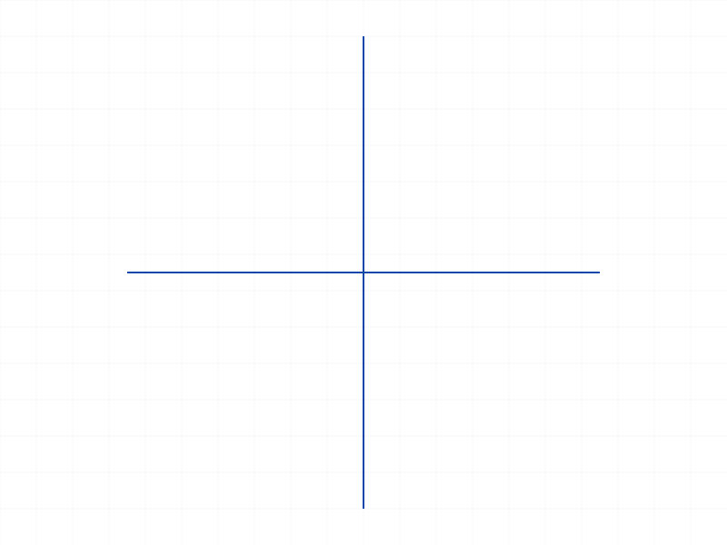
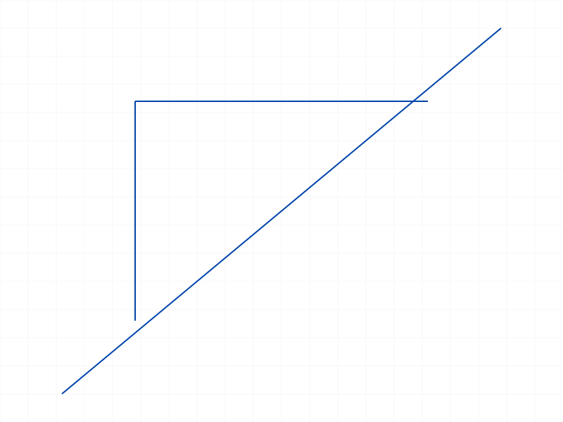

# Training: sketch.trimCurves

**Date:** 2026-04-10

## Goal

Testing `v1.sketch.trimCurves` — trims away curves that are "suitable for trimming."

**Methods to cover:**

- `trimCurves` — basic usage with intersecting curves
- `trimCurves` — relationship with `splitAllCurves` (splitting appears to be a prerequisite)
- `trimCurves` — what makes a curve "suitable for trimming"?
- `trimCurves` — behavior with different curve types (lines, circles, arcs)
- `trimCurves` — error cases (invalid IDs, non-splittable curves, empty array)

**Questions:**

- Must `splitAllCurves` be called before `trimCurves`? Or does trimming work on unsplit curves too?
- What does `splitAllCurves` return exactly — the IDs of the segments that can be trimmed?
- Can you selectively trim some segments and keep others?
- Does trimming delete the curve or just hide/shorten it?
- What does "suitable for trimming" mean precisely?

---

## 01 — basic trim (two intersecting lines)

Script: `scripts/01-basic-trim.mjs` — ✅ trimCurves succeeds on split sub-curve IDs.

`splitAllCurves` returned `[80, 84, 88, 92]` — 4 segments from 2 intersecting lines (each split at the intersection). Trimming ID 80 returned VOID with maxLevel=31 (success).

|  |  |
|---|---|

**Data:** Both snapshots look identical — the trim removes the sub-curve from the internal SplittedCurves container but the original geometry is still rendered. Need to investigate further.

## 02 — geometry before/after with getGeometry

Script: `scripts/02-geometry-before-after.mjs` — `getGeometry` reports the same 2 line IDs (58, 64) before split, after split, and after trim.

**Learned:** `getGeometry` tracks original sketch curves, not split sub-curves. The split sub-curve IDs (80, 84, 88, 92) are a separate internal layer. `getPositions` returns null for these sub-curve IDs.

## 03 — structure tree analysis

Script: `scripts/03-structure-dump.mjs` — ✅ confirmed trimCurves deletes sub-curves from the structure tree.

**Data:** After `splitAllCurves`, the structure tree contains a `SplittedCurves` container (CC_Container, parent of split sub-curves). Split of 2 intersecting lines produced:
- `Line_part0` (ID 96, CC_Line)
- `Line_part1` (ID 100, CC_Line)
- `Line0_part0` (ID 104, CC_Line)
- `Line0_part1` (ID 108, CC_Line)

After `trimCurves([96])`, ID 96 is gone from the structure tree. The other 3 remain. Structure tree size: 36KB → 46KB (after split) → 44KB (after trim). The trim physically removes the node.

📌 LLM doc: split creates sub-curves in a SplittedCurves container; trim deletes sub-curves from it.

## 04 — trim without split

Script: `scripts/04-trim-without-split.mjs` — trimCurves on an unsplit original line ID → maxLevel=31, silent no-op.

**Data:** No error, no visual change. Passing an original curve ID (not a split sub-curve) to trimCurves is silently ignored.

📌 LLM doc: trimCurves only works on split sub-curve IDs, not original curve IDs. Silent no-op otherwise.

## 05 — circle + line intersection

Script: `scripts/05-circle-line-trim.mjs` — ✅ circle + line produces 5 split segments.

**Data:** Circle (r=30) + line (-60 to 60 on x-axis) → `splitAllCurves` returns 5 IDs: 2 arcs (circle halves) + 3 line segments (left, middle, right). Trimming the first two segments succeeded (maxLevel=31).

## 06 — sequential trim of all segments

Script: `scripts/06-identify-segments.mjs` — trimmed all 5 segments one by one. All calls returned maxLevel=31.

**Data:** After trimming ALL sub-curves, the snapshot still shows the original circle+line. Confirms that trim only affects the SplittedCurves container, not the rendered original geometry.

📌 LLM doc: trim alone does NOT change visible geometry — must call `splitCurvesMergeBack` to apply.

## 07 — structure tree access pattern

Script: `scripts/07-dump-split-structure.mjs` — identified the structure tree format.

**Data:** `structure` is `{ root, currentProduct, currentInstance, testRoot, tree }` — NOT a flat map by ID. Sub-curve nodes are nested inside `tree`. Must use recursive search by `id` field, not direct key lookup.

Split segment identification from structure:
- **80**: `Circle_part0` (CC_Arc) — upper half arc
- **85**: `Circle_part1` (CC_Arc) — lower half arc
- **90**: `Line_part0` (CC_Line) — left segment
- **94**: `Line_part1` (CC_Line) — middle segment (inside circle)
- **98**: `Line_part2` (CC_Line) — right segment

## 08 — the full workflow: split → trim → mergeBack (KEY FINDING)

Script: `scripts/08-trim-then-merge.mjs` — ✅ **This is the correct workflow.**

Trimmed Circle_part0 (upper arc, ID 80) and Line_part1 (middle line, ID 94), then called `splitCurvesMergeBack`.

**Data:** After merge, `getGeometry` returns `{arcs:[103], circles:[], lines:[110,114]}` — circle became a single arc (bottom half), original line became 2 line segments (left + right). The original IDs (58, 63) are gone, replaced by new IDs.

|  |  |
|---|---|

📌 LLM doc: The full workflow is `splitAllCurves` → `trimCurves` → `splitCurvesMergeBack`. Merge applies the trims to actual geometry.

## 09 — trim multiple segments in one call

Script: `scripts/09-trim-multiple.mjs` — ✅ rectangle + diagonal, trimmed 3 segments at once.

**Data:** Rectangle (4 lines) + diagonal → 9 split segments. Notable: unsplit rectangle edges (IDs 62, 74) appear directly in the split result — edges not intersected by the diagonal are returned as-is (original IDs, not new sub-curves). After trimming 3 segments and merging, geometry correctly shows 3 remaining lines.

|  |
|---|

📌 LLM doc: `splitAllCurves` returns ALL curves (including non-intersected ones) — non-intersected curves appear as their original IDs.

## 10 — error cases

Script: `scripts/10-trim-invalid-id.mjs` — comprehensive error testing.

**Results:**
- **Invalid ID (99999):** maxLevel=51, error "An element of parameter curveIds has an invalid id!"
- **Empty array:** maxLevel=31, silent success (no-op)
- **Original line ID (unsplit):** maxLevel=31, silent no-op
- **Re-trim already-trimmed ID:** maxLevel=51, same "invalid id" error (sub-curve no longer exists)
- **Mix of valid + invalid IDs:** maxLevel=51, error raised

📌 LLM doc: Invalid IDs → error. Empty array → no-op. Original curve IDs → silent no-op. Re-trim → error.

## 11 — single non-intersecting curve

Script: `scripts/11-single-curve-split.mjs` — `splitAllCurves` returns even non-intersecting curves.

**Data:** Single line → splitAllCurves returns `[58]` (the original line ID). Two parallel non-intersecting lines → second splitAllCurves returns `[70]` (only newly added line). After trimming non-intersecting line 70 and merging, only line 58 remains. Trimming a non-intersecting curve removes it entirely.

📌 LLM doc: Can use split+trim+merge to delete individual curves entirely.

## 12 — mixed valid+invalid IDs (atomicity test)

Script: `scripts/12-mixed-valid-invalid.mjs` — **entire call fails if any ID is invalid.**

**Data:** Trimmed `[splitIds[0], 99999]` → maxLevel=51 error. After mergeBack, geometry = `{circles:[58], lines:[63]}` — originals restored, no trim applied. The valid ID's trim was NOT applied.

📌 LLM doc: trimCurves is atomic — if any curveId is invalid, the entire call fails and no segments are trimmed.

---

## Coverage checklist

- [x] `trimCurves` called successfully (scripts 01, 08)
- [x] `id` param tested (sketch ID, always required)
- [x] `curveIds` param tested — single (01), multiple (09), empty (10)
- [x] Workflow with `splitAllCurves` and `splitCurvesMergeBack` (script 08)
- [x] Different curve types: lines (01), circles→arcs (08), rectangles (09)
- [x] Error cases: invalid ID, empty array, re-trim, mixed valid+invalid (10, 12)
- [x] Edge case: non-intersecting curves (11)
- [x] Behavioral claims verified with structure tree data and getGeometry (scripts 03, 08)
