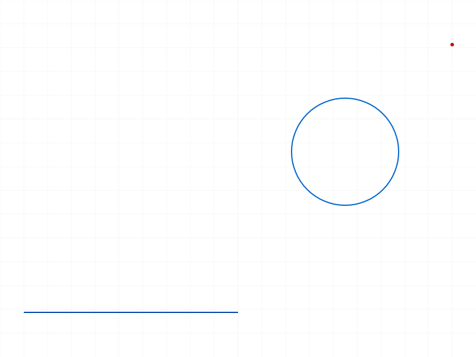
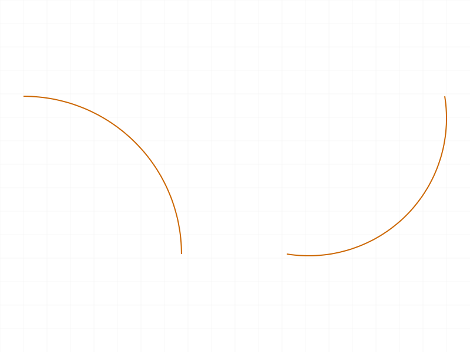
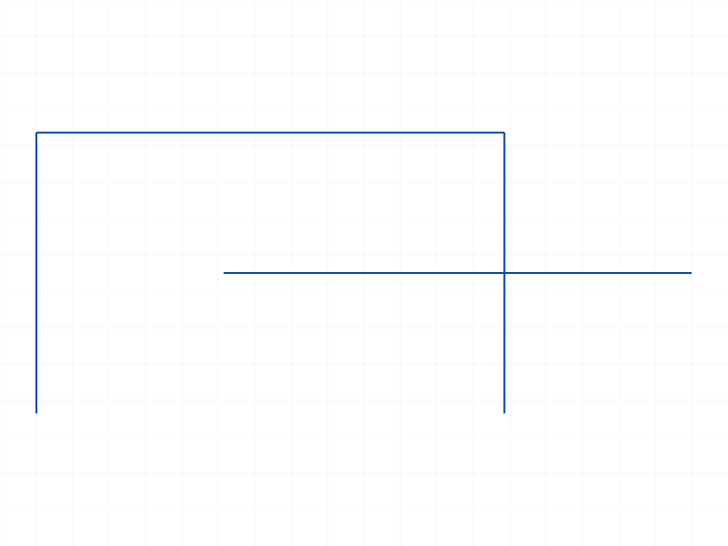
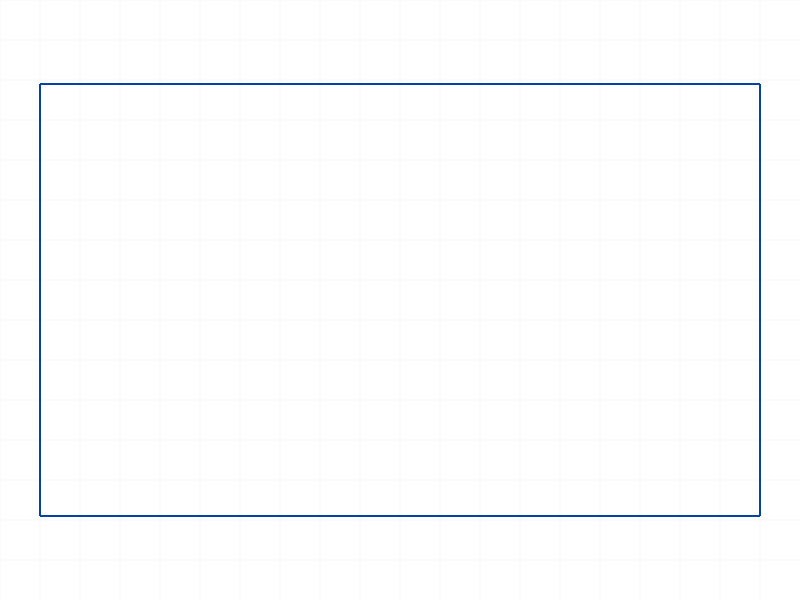
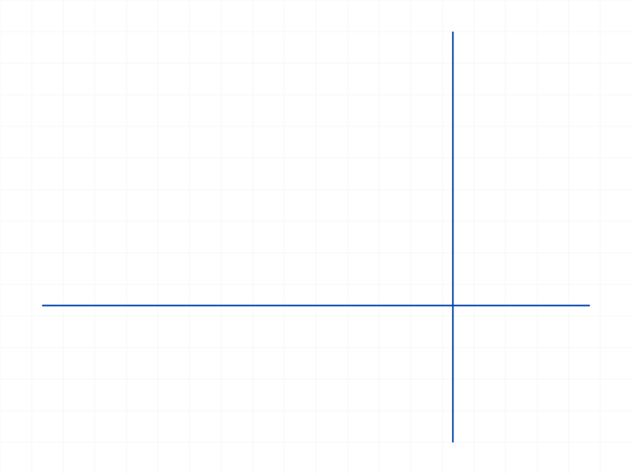
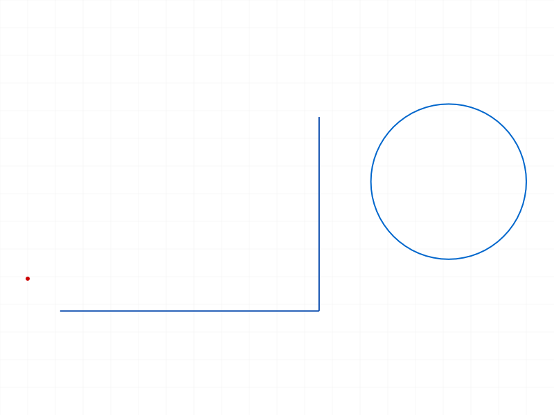

# Training: sketch.moveGeometry

**Date:** 2026-04-10

## Goal

Testing `v1.sketch.moveGeometry` — moves sketch geometry by a translation vector.

**Methods to cover:**

- `moveGeometry` — basic move of a single geometry item
- `moveGeometry` — move multiple items at once
- `moveGeometry` — different geometry types: point, line, circle, arc
- `moveGeometry` — interaction with constraints (does the solver run?)
- `moveGeometry` — return value meaning (boolean = "still solved?")

**Questions:**

- What IDs are valid for `geomIds`? Curve IDs? Point IDs? Both?
- Does moveGeometry trigger the constraint solver (unlike updateGeometry)?
- What does the boolean return value "true if sketch state is still solved" mean?
- What happens with zero translation vector?
- What happens when moving constrained geometry?
- Error cases: invalid IDs, wrong types, empty geomIds array

---

## 01 — basic move line

Script: `scripts/01-basic-move-line.mjs` — ✅ Line moved correctly by translation [20,30,0].

**Data:** start [10,10,0]→[30,40,0], end [50,10,0]→[70,40,0]. result=0, maxLevel=31.

|  |  |
|---|---|

## 02 — move circle

Script: `scripts/02-move-circle.mjs` — ✅ Circle center moved correctly by [25,-10,0].

**Data:** center [30,30,0]→[55,20,0]. result=1, maxLevel=31.

|  |  |
|---|---|

## 03 — move point

Script: `scripts/03-move-point.mjs` — ✅ Point moved correctly by [15,25,0].

**Data:** pos [20,20,0]→[35,45,0]. result=1, maxLevel=31.

## 04 — move multiple items

Script: `scripts/04-move-multiple.mjs` — ✅ Line, circle, and point all moved correctly by [10,20,0].

**Data:** line start [0,0]→[10,20], line end [40,0]→[50,20]. Circle center [60,30]→[70,50]. Point [80,50]→[90,70]. result=0, maxLevel=31.

|  |  |
|---|---|

## 05 — move arcs

Script: `scripts/05-move-arc.mjs` — ✅ Both arcByCenter and arcBy3Points moved correctly by [5,15,0].

**Data:** arc1 center [10,10]→[15,25], arc2 center [64.2,35.8]→[69.2,50.8]. All control points (start, end, center) translated uniformly. result=1, maxLevel=31.

|  |  |
|---|---|

## 06 — zero translation

Script: `scripts/06-zero-translation.mjs` — ✅ No-op as expected. Positions unchanged.

**Data:** start/end identical before and after. result=1, maxLevel=31. No error.

## 07 — partial rectangle move (surprising)

Script: `scripts/07-move-rectangle.mjs` — Moving only 1 of 4 rectangle lines moves ONLY that line. The other 3 stay in place. Rectangle breaks apart.

**Data:** line0 moved from [10,10]-[60,10] to [30,25]-[80,25]. Lines 1-3 unchanged. result=0.

|  |  |
|---|---|

**Learned:** moveGeometry does NOT trigger the constraint solver. Moving one side of a constrained rectangle does NOT drag connected lines. It's a raw translation of the specified items only — same behavior as updateGeometry in this regard.

📌 LLM doc: moveGeometry does not trigger constraint solver. Must pass ALL items you want to move.

## 08 — full rectangle move

Script: `scripts/08-move-all-rect-lines.mjs` — ✅ Moving all 4 lines at once preserves the rectangle shape.

**Data:** rect [10,10]-[60,40] → [30,25]-[80,55] with translation [20,15,0]. All 4 corners shifted uniformly (see `files/08-move-all-rect-lines-rect-full-move.json`). result=0, maxLevel=31.

|  |  |
|---|---|

## 09 — constrained geometry

Script: `scripts/09-constrained-geometry.mjs` — Two lines sharing an endpoint (coincidence). Moving only line1 does NOT drag line2.

**Data:** line1 moved [0,0]-[40,0] → [10,10]-[50,10]. line2 unchanged at [40,0]-[40,30]. result=0. Note: `generateAutoConstraints` returned maxLevel=51 (error — separate issue), so no constraints were actually applied. But even with auto-fixation from `sketch.geometry` with `genFixation: false`, the behavior confirms moveGeometry doesn't solve constraints.

|  |  |
|---|---|

📌 LLM doc: moveGeometry is a raw translation, no solver interaction.

## 10 — error cases

Script: `scripts/10-error-invalid-id.mjs` — All error paths documented.

**Data (from `files/10-error-invalid-id-error-cases.json`):**

| Case | Result | MaxLevel | Error |
|---|---|---|---|
| Part ID as sketch ID | null | 51 | code 1001: wrong id type, expects ["sketch"] |
| Invalid geomId (99999) | null | 51 | code 1006: invalid id (+ warning code 0 about ToId) |
| Empty geomIds `[]` | 0 | 31 | No error — silent no-op |
| Sketch ID in geomIds | null | 51 | code 1001: wrong id type, expects ["sketch-curve","sketch-point"] |

📌 LLM doc: accepted geomIds types are `["sketch-curve", "sketch-point"]`. Empty array is a no-op.

## 11 — negative translation

Script: `scripts/11-move-negative.mjs` — ✅ Negative values work correctly.

**Data:** start [50,50]→[20,30], end [80,70]→[50,50] with translation [-30,-20,0]. Exact match. result=1.

## 12 — move with dimensions

Script: `scripts/12-move-with-dimensions.mjs` — Dimension creation failed (maxLevel=51, likely wrong params), but moveGeometry worked on the line. result=0.

**Data:** Line moved from [10,10]-[60,10] to [30,40]-[80,40]. The dimension failure is a separate issue (HORIZONTAL dimension needs 2 geomIds or different params).

|  |  |
|---|---|

## 13 — return value with FIX constraints

Script: `scripts/13-return-value-unsolved.mjs` — FIX constraint creation failed (maxLevel=51), so constraints weren't applied. moveGeometry still moved the line. result=0.

**Data:** Line moved from [10,10]-[50,10] to [30,30]-[70,30]. FIX constraint failure is a separate issue — FIX likely needs different syntax.

|  |  |
|---|---|

**Note:** The return value investigation was inconclusive because constraints failed to create. See return value analysis below.

## 14 — Z component (important finding)

Script: `scripts/14-move-z-component.mjs` — ❌ Non-zero Z rejected with error code 1014.

**Data:** Error message: `The parameter "translation" which is a 2D point, must have a z-value of 0!` Line not moved. result=null, maxLevel=51.

📌 LLM doc: translation Z must be exactly 0. The parameter is validated as a 2D point.

## 15 — batch geometry move

Script: `scripts/15-move-geometry-batch.mjs` — ✅ All items from `sketch.geometry` batch creation moved correctly by [15,25,0].

**Data:** line0 start [10,0]→[25,25], end [50,0]→[65,25]. result=0, maxLevel=31.

|  |  |
|---|---|

---

## Return value analysis

The return value is a number (0 or 1), mapping to the ClassCAD boolean convention. The docs say "true if sketch state is still solved."

| Script | Geometry | GenFixation | Result |
|---|---|---|---|
| 01 | line (sketch.line) | default (on) | 0 |
| 02 | circle (sketch.circle) | default (on) | 1 |
| 03 | point (sketch.point) | default (on) | 1 |
| 04 | mixed (individual creates) | default (on) | 0 |
| 05 | arcs (individual creates) | default (on) | 1 |
| 06 | line (sketch.line), zero move | default (on) | 1 |
| 07 | rect partial move | default (on) | 0 |
| 08 | rect full move | default (on) | 0 |
| 09 | lines (sketch.geometry) | off | 0 |
| 11 | line (sketch.line) | default (on) | 1 |
| 15 | mixed (sketch.geometry) | off | 0 |

**Pattern:** When `genFixation: false` → always 0 (unsolved, no fixation constraints to satisfy). When auto-fixation is on: single items (circle, point, arc) return 1, but lines sometimes return 0 and sometimes 1. The inconsistency between scripts 01 (result=0) and 11 (result=1) for identical geometry types is unexplained — both are single lines with default fixation. Possibly the solver state depends on internal factors. The practical takeaway: **don't rely on the return value for logic**; use it as a hint that constraints may be broken.

---

## Coverage checklist

- [x] The API has been called at least once successfully
- [x] Every required parameter has been tested (id, geomIds, translation)
- [x] Key optional parameters — none exist, all are required
- [x] Every enum value / type variant — N/A (no enums)
- [x] No update/delete methods exist for moveGeometry
- [x] At least one realistic usage (rect move, batch move)
- [x] Behavioral claims verified with data (positions verified via getPositions, JSON dumps)
