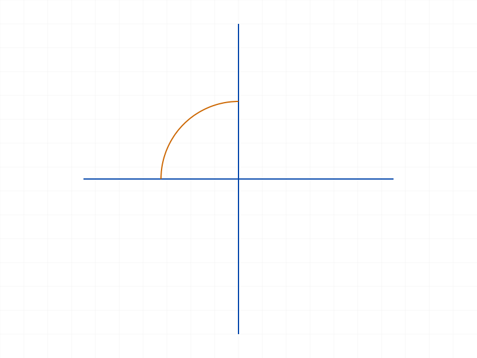
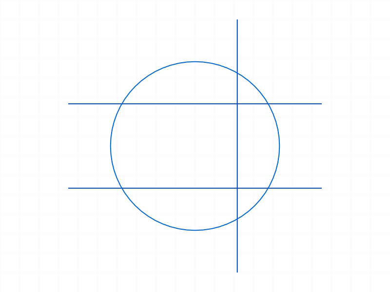

# Training: sketch.splitAllCurves

**Date:** 2026-04-10

## Goal

Testing `v1.sketch.splitAllCurves` — the first step in the trim workflow that splits all curves at their intersection points.

**Methods to cover:**

- `splitAllCurves` — basic call with intersecting curves
- Return value: `Array<id|VOID>` — how IDs map to split segments
- Naming convention: `{OriginalName}_part{N}` in structure tree
- Non-intersecting curves — do they appear in the result?
- Multiple intersections (3+ curves crossing)
- Different curve types: lines, circles, arcs, rectangles
- Edge cases: empty sketch, single curve (no intersections), tangent curves
- Collinear/overlapping curves
- T-junction intersections (endpoint touching curve middle)
- Order of returned IDs — is it deterministic?
- Calling splitAllCurves twice without mergeBack
- Structure tree state after split (SplittedCurves container)

---

## 01 — Basic intersection (circle + line)

Script: `scripts/01-basic-intersection.mjs` — ✅ Circle (r=30) + horizontal line through center → 5 segments.

|  |  |
|---|---|

**Data:** Result: `[80, 85, 90, 94, 98]`. maxLevel=31. Structure tree shows:
- `Circle_part0` (80, CC_Arc) — upper arc
- `Circle_part1` (85, CC_Arc) — lower arc
- `Line_part0` (90, CC_Line) — left segment
- `Line_part1` (94, CC_Line) — middle segment (inside circle)
- `Line_part2` (98, CC_Line) — right segment

All segments live under `SplittedCurves` container (id 78). Original `Circle` (58) and `Line` (63) still exist under the sketch's geometry container.

📌 LLM doc: Document segment naming convention `{OriginalName}_part{N}` and the SplittedCurves container structure.

## 02 — Non-intersecting curves

Script: `scripts/02-no-intersections.mjs` — ✅ Two parallel horizontal lines → result: `[58, 66]` (original IDs returned as-is).

**Data:** maxLevel=31. Non-intersecting curves are returned with their original IDs. In structure tree they go into a `NoneSplitted` container.

📌 LLM doc: Non-intersecting curves return original IDs, placed in NoneSplitted container.

## 03 — Empty sketch

Script: `scripts/03-empty-sketch.mjs` — ✅ Empty sketch → result: `[]`. maxLevel=31. No error.

## 04 — Single curve (no intersections possible)

Script: `scripts/04-single-curve.mjs` — ✅ Single circle → result: `[58]` (original ID). `result[0] === circle` confirmed true.

**Learned:** Single curve with no intersections returns its own original ID.

## 05 — Three lines crossing at origin

Script: `scripts/05-three-curves-crossing.mjs` — ✅ Three lines through origin → 6 segments (2 per line).

**Data:** Result length=6. Each line split into exactly 2 parts at the common crossing point. Naming: `Line_part0`, `Line_part1`, `Line0_part0`, `Line0_part1`, `Line1_part0`, `Line1_part1`.

**Learned:** When multiple curves cross at the same point, each curve is split at that single intersection. A 3-way crossing doesn't generate extra segments — each curve gets exactly 1 split point.

## 06 — Rectangle + diagonal line

Script: `scripts/06-rectangle-line.mjs` — ✅ Rectangle (4 lines) + diagonal → 9 segments.

**Data:** Rectangle creates 4 lines: `Rect_Line` (58), `Rect_Line0` (62), `Rect_Line1` (68), `Rect_Line2` (74). The diagonal crosses 2 of the 4 rectangle sides. Result:
- `Rect_Line_part0` (112), `Rect_Line_part1` (116) — split rectangle side → `SplittedCurves` (parent 110)
- `Rect_Line0` (62) — unsplit rectangle side → `NoneSplitted` (parent 94)
- `Rect_Line1_part0` (120), `Rect_Line1_part1` (124) — split rectangle side
- `Rect_Line2` (74) — unsplit rectangle side → `NoneSplitted`
- `Line_part0` (128), `Line_part1` (132), `Line_part2` (136) — diagonal split into 3

**Learned:** Rectangle sides are individual lines that split independently. Only sides that intersect the diagonal get split; the others retain original IDs in NoneSplitted.

📌 LLM doc: Rectangle geometry is individual lines — they split independently based on which sides have intersections.

## 07 — Arc + line (no intersection)

Script: `scripts/07-arc-intersection.mjs` — ✅ Quarter arc (arcByCenter) + line → result: `[58, 65]` (original IDs). No split occurred.

**Data:** The arc from (30,0) to (0,30) and line from (-10,10) to (40,10) returned unsplit. The arc created by `arcByCenter` may have been too short or the intersection wasn't found. This was clarified in script 13.

## 08 — Tangent intersection (circle + tangent line)

Script: `scripts/08-tangent.mjs` — ✅ Circle + horizontal tangent at top → 3 segments.

**Data:** Circle stays unsplit as original `CC_Circle` (id 58). Line splits into `Line_part0` (78), `Line_part1` (82). Result: `[58, 78, 82]`.

**Learned:** Tangent contact (touching, not crossing) — the circle is NOT split at the tangent point. But the tangent LINE is split at the contact point into 2 segments. This is asymmetric: the touching curve gets split but the touched curve doesn't.

📌 LLM doc: Tangent intersections split the line at the contact point but do NOT split the circle. Asymmetric behavior.

## 09 — T-junction (endpoint touching midpoint)

Script: `scripts/09-t-junction.mjs` — ✅ Horizontal line + vertical line starting at horizontal's midpoint → 3 segments.

**Data:** Horizontal line → `Line_part0` (83), `Line_part1` (87). Vertical line → `Line0` (64, original ID). Result: `[83, 87, 64]`.

**Learned:** When a curve's endpoint touches another curve's interior, the curve being touched gets split at that point. The curve whose endpoint does the touching stays whole (it ends there naturally). Similar to tangent behavior: the curve with an intersection in its interior gets split; the curve that just terminates there doesn't.

📌 LLM doc: T-junctions split the continuous curve at the contact point but leave the terminating curve whole.

## 10 — Double call (splitAllCurves twice without mergeBack)

Script: `scripts/10-double-call.mjs` — ✅ Same setup, called twice → different IDs each time.

**Data:** First call: `[80, 85, 90, 94, 98]`. Second call: `[113, 118, 123, 127, 131]`. Both maxLevel=31. No error.

**Learned:** Calling splitAllCurves again without mergeBack doesn't error — it re-splits and produces new segment IDs. The old SplittedCurves are presumably replaced. Safe to call multiple times.

📌 LLM doc: Repeated calls without mergeBack are idempotent (same segments, new IDs). No error.

## 11 — NoneSplitted vs SplittedCurves containers

Script: `scripts/11-nonesplitted-container.mjs` — ✅ Two crossing lines + one isolated line → 5 segments.

**Data:** Crossing lines → `Line_part0` (88), `Line_part1` (92), `Line0_part0` (96), `Line0_part1` (100) in `SplittedCurves` (id 86). Isolated line → `Line1` (70) stays in `NoneSplitted` (id 76) with its original ID. `l3 in result? true`.

**Learned:** Result array is a flat mix of split sub-curve IDs (from SplittedCurves) and original curve IDs (from NoneSplitted). Both containers are created under the sketch geometry container.

## 12 — Two intersecting circles

Script: `scripts/12-two-circles.mjs` — ✅ Two overlapping circles → 4 arcs.

**Data:** `Circle_part0` (76), `Circle_part1` (81), `Circle0_part0` (86), `Circle0_part1` (91). All CC_Arc class. Each circle splits into 2 arcs at the 2 intersection points.

## 13 — Arc + line (confirmed intersection)

Script: `scripts/13-arc-line-retry.mjs` — ✅ Semicircular arc (arcBy3Points) + horizontal line at y=15 → 6 segments.

**Data:** Arc → `Arc_part0`, `Arc_part1`, `Arc_part2` (3 arcs). Line → `Line_part0`, `Line_part1`, `Line_part2` (3 line segments). The line crosses the arc at 2 points, creating 3 segments on the line. The arc is also split at those 2 points into 3 arcs.

**Learned:** Arc splitting works correctly. Script 07 was a false negative — the small quarter arc from `arcByCenter` apparently didn't intersect the test line at y=10.

## 14 — Points in sketch

Script: `scripts/14-with-points.mjs` — ✅ Point + two crossing lines → 4 segments. Point NOT in result.

**Data:** Point (58) not included in result. Only the 4 line segments (84, 88, 92, 96) returned. `point in result? false`.

📌 LLM doc: Points are excluded from splitAllCurves result. Only curves (lines, circles, arcs) are included.

## 15 — Result ordering

Script: `scripts/15-result-ordering.mjs` — ✅ Circle + hLine + vLine (all intersecting each other) → 12 segments.

**Data:** Circle → 4 arcs (`Circle_part0..3`), hLine → 4 parts (`Line_part0..3`), vLine → 4 parts (`Line0_part0..3`). Result is ordered: all circle segments first, then hLine segments, then vLine segments. Segments within each curve are ordered by part number.

📌 LLM doc: Result array is ordered by original curve creation order, then by part number within each curve. Deterministic.

## 16 — Split → trim → mergeBack → re-split

Script: `scripts/16-split-trim-resplit.mjs` — ✅ Full workflow then re-split works.

**Data:** First split: 12 segments. After trimming one arc and merging back: second split produces 11 segments. The trimmed arc is gone; remaining geometry re-splits correctly with new intersection topology.

|  |  |
|---|---|

## 17 — Collinear overlapping lines

Script: `scripts/17-collinear.mjs` — ✅ Two collinear overlapping horizontal lines → 4 segments.

**Data:** `Line_part0` (82), `Line_part1` (86), `Line0_part0` (90), `Line0_part1` (94). Each line split into 2 at the overlap boundary points.

**Learned:** Collinear overlapping lines DO get split at the overlap endpoints. Each line is split at the point where the other line's endpoint falls on it.

📌 LLM doc: Collinear overlapping curves are split at overlap boundaries.

## 18 — Complex: circle + 3 crossing lines

Script: `scripts/18-many-intersections.mjs` — ✅ Circle + 3 lines → 19 segments.

**Data:** Circle → 6 arcs (3 lines × 2 intersections each = 6 split points, but some coincide → 6 arcs). Lines: l1 → 4 parts (intersects circle + l3), l2 → 4 parts (intersects circle + l3), l3 → 5 parts (intersects circle + l1 + l2). Total: 6 + 4 + 4 + 5 = 19.

|  |  |
|---|---|

## 19 — Error cases (invalid IDs)

Script: `scripts/19-invalid-id.mjs` — ✅ Both error cases handled.

**Data:**
- Part ID (wrong type): maxLevel=51, code 1001, message "The parameter \"id\" has a wrong id type! Provide only following id types: [\"sketch\"]". Result: null.
- Nonexistent ID (99999): maxLevel=51, code 1006, message "An element of parameter \"id\" has an invalid id!". Also preceded by warning (level 41) "ToId()/TOID() didn't get an existing or valid id."

📌 LLM doc: Document error cases — wrong ID type (code 1001) and invalid ID (code 1006).

## 20 — Constrained geometry

Script: `scripts/20-with-constraints.mjs` — ✅ Two crossing lines (unconstrained but intersecting) → 4 segments. Works normally.

**Data:** 4 segments, standard split. Constraints don't interfere with splitting.

---

## Coverage Checklist

- [x] Basic successful call
- [x] Every required parameter tested (only `id` — sketch ID)
- [x] Return value structure documented (Array<id>)
- [x] Non-intersecting curves
- [x] Empty sketch edge case
- [x] Single curve edge case
- [x] Multiple curve types: lines, circles, arcs, rectangles
- [x] Tangent intersections
- [x] T-junction intersections
- [x] Collinear/overlapping curves
- [x] Complex multi-intersection scenarios
- [x] Double call behavior
- [x] Re-split after trim+mergeBack
- [x] Points excluded from result
- [x] Result ordering (deterministic, grouped by curve)
- [x] Container structure (SplittedCurves vs NoneSplitted)
- [x] Error cases (wrong ID type, invalid ID)
- [x] With constraints
