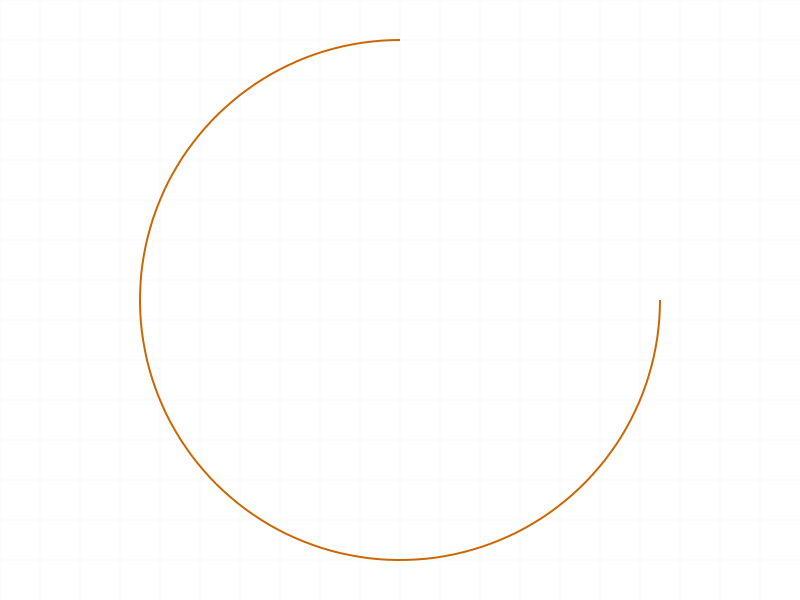

# Training: sketch.splitCurves

**Date:** 2026-04-13

## Goal

Testing `v1.sketch.splitCurves` — manual splitting of curves at specific parameterized positions.

**Methods to cover:**

- `splitCurves` — basic split of a line at one position
- `splitCurves` — split at multiple positions on one curve
- `splitCurves` — split multiple curves in one call
- `splitCurves` — split a circle (closed curve behavior)
- `splitCurves` — split an arc
- `splitCurves` — interaction with `splitCurvesMergeBack` and `trimCurves`
- `splitCurves` — edge cases: value=0, value=1, out-of-range values
- `splitCurves` — error cases: invalid ID, non-existent curve

**Questions:**

- What exactly do the returned IDs represent? Are they usable with trimCurves?
- How does the result structure map to splits — N values → N+1 segments?
- What happens at boundary values (0 and 1)?
- Can you split an already-split curve?
- Does splitCurvesMergeBack work the same way as with splitAllCurves?
- What happens with out-of-range values (negative, >1)?
- Do split segments get names like with splitAllCurves?

---

## 01 — basic line split at midpoint

Script: `scripts/01-basic-line-split.mjs` — ✅ Split at 0.5 on a 100-unit line returns `[[64, 68]]` (2 segments for 1 split = N+1).

|  |  |
|---|---|

**Data:** maxLevel=31. Original line (id=58) is **immediately replaced** in the structure tree — not staged like `splitAllCurves`. Segments named `Split_Line` (id=64) and `Split_Line0` (id=68). A `Split_Coinc` (CC_2DCoincidentConstraint) auto-created at the split point. No `SplittedCurves` or `NoneSplitted` containers.

**Learned:** `splitCurves` is a **direct, immediate operation** — the original curve is destroyed and replaced by segments right away. This is fundamentally different from `splitAllCurves` which stages splits in containers.

**📌 LLM doc:** Critical difference from `splitAllCurves` — immediate replacement, no staging.
**📌 LLM doc:** Naming convention: `Split_{OriginalName}`, `Split_{OriginalName}0`, etc.
**📌 LLM doc:** Auto-creates `Split_Coinc` constraints at split points.

---

## 02 — multiple split positions

Script: `scripts/02-multi-split-line.mjs` — ✅ As documented. 3 split values → 4 segments (`[[64,68,72,76]]`). N+1 confirmed for open curves.

---

## 03 — split a circle

Script: `scripts/03-split-circle.mjs` — ⚠️ Doc discrepancy. 2 split values on a circle → only **2 segments** (`[[63, 68]]`), not 3 (N+1). Docs say "length of result[i] will be N+1" but for closed curves, N splits → N segments.

**📌 LLM doc:** Closed curves (circles): N splits → N segments. Docs claim N+1 but this only applies to open curves.

---

## 04 — split multiple curves in one call

Script: `scripts/04-split-multiple-curves.mjs` — ✅ Works as expected. Outer array matches splits array length. Line1 (1 split → 2 segments), Line2 (2 splits → 3 segments).

---

## 05 — boundary values (invalid due to multi-part-create bug)

Script: `scripts/05-boundary-values.mjs` — ⚠️ Test 1 (value=0.0) succeeded. Tests 2-4 all errored with "Set the parameter id = VOID is not allowed" — caused by calling `part.create` multiple times within one harness run. The second `part.create` invalidates state. **This is a harness/session limitation, not a splitCurves bug.** Re-tested individually in scripts 13-15.

---

## 06 — splitCurves + splitCurvesMergeBack

Script: `scripts/06-mergeback.mjs` — ✅ mergeBack returns VOID, maxLevel=31. After mergeBack, the split segments **persist** (Split_Line, Split_Line0 still in tree). mergeBack does NOT merge segments back into one curve.

**Learned:** After `splitCurves`, calling `splitCurvesMergeBack` is a no-op — the split is already permanent. mergeBack is only meaningful in the `splitAllCurves → trimCurves → mergeBack` workflow.

**📌 LLM doc:** splitCurvesMergeBack has no effect after splitCurves — the split is already committed.

---

## 07 — split an arc

Script: `scripts/07-split-arc.mjs` — ✅ Arc split at 0.5 returns 2 segments. Works identically to line splitting.

|  |
|---|

---

## 08 — error cases

Script: `scripts/08-error-cases.mjs` — ✅ All error cases documented.

| Scenario | maxLevel | Message |
|---|---|---|
| Part ID instead of sketch ID | 51 | "wrong id type! Provide only following id types: [\"sketch\"]" |
| Invalid/nonexistent geomId | 51 | "ToId()/TOID() didn't get an existing or valid id." |
| Empty splits array | 31 | Returns `[]` — no error |
| Empty values array | 31 | Returns `[[64]]` — original curve returned as single-element |
| Point ID as geomId | 51 | "wrong id type! Provide only following id types: [\"sketch-curve\"]" |

**Learned:** Empty values → returns `[[originalId]]` (no actual split). Empty splits → returns `[]`. The `geomId` must be a `sketch-curve` type.

**📌 LLM doc:** Error messages and edge cases.

---

## 09 — trimCurves after splitCurves

Script: `scripts/09-trim-after-split.mjs` — ⚠️ Surprising result. Split line into 3 segments, trimmed middle one (id=68), merged back. **All 3 segments still present** after merge (Split_Line, Split_Line0, Split_Line1). trimCurves returned maxLevel=31 (no error) but was a **silent no-op**.

**Learned:** `trimCurves` does NOT work on `splitCurves` results. The IDs from `splitCurves` are real geometry, not staged in a `SplittedCurves` container. trimCurves only operates on the `SplittedCurves` container from `splitAllCurves`. Passing real geometry IDs is a silent no-op.

**📌 LLM doc:** CRITICAL — trimCurves is incompatible with splitCurves. They use different mechanisms.

---

## 11 — circle 1-split behavior

Script: `scripts/11-circle-count.mjs` — 1 split on a circle returns **null/VOID**. A single cut on a closed curve is not supported — you need at least 2 splits to divide a circle.

**📌 LLM doc:** Circles need ≥2 split values. 1 value returns VOID.

---

## 12 — circle 3-split count

Script: `scripts/12-circle-3splits.mjs` — ✅ 3 splits on circle → 3 segments. Confirms N splits → N segments for closed curves.

---

## 13–15 — boundary values (individual tests)

Scripts: `13-split-at-1.mjs`, `14-split-negative.mjs`, `15-split-over1.mjs` — All succeed (maxLevel=31)!

| Value | Result | Segments |
|---|---|---|
| 1.0 | `[[64,68]]` | 2 |
| -0.5 | `[[64,68]]` | 2 |
| 1.5 | `[[64,68]]` | 2 |

**📌 LLM doc:** Values outside [0,1] are accepted — they extrapolate the curve.

---

## 16 — unsorted values

Script: `scripts/16-unsorted-values.mjs` — ✅ Values [0.75, 0.25, 0.5] (unsorted) → 4 segments. The API sorts internally.

---

## 18 — positions of out-of-range splits

Script: `scripts/18-positions-after-split.mjs` — Reveals that out-of-range values **extrapolate** the geometry:

Line from (-50,0,0) to (50,0,0), split at -0.5, 0.5, 1.5:
- Segment 64: (-50,0,0) → (-100,0,0) — extends 50 units before start
- Segment 68: (-100,0,0) → (0,0,0) — from extrapolated start to midpoint
- Segment 72: (0,0,0) → (100,0,0) — from midpoint to extrapolated end
- Segment 76: (100,0,0) → (50,0,0) — extends 50 units past end

**📌 LLM doc:** DANGER — out-of-range values silently extrapolate geometry. t=-0.5 creates a point 50% before the start. Always use values strictly within (0, 1) for predictable behavior.

---

## 19–20 — boundary value positions

Scripts: `19-split-at-zero.mjs`, `20-split-at-one-positions.mjs`

| Value | Segment 1 | Segment 2 |
|---|---|---|
| 0.0 | (-50,0,0) → (-50,0,0) **degenerate** | (-50,0,0) → (50,0,0) full line |
| 1.0 | (-50,0,0) → (50,0,0) full line | (50,0,0) → (50,0,0) **degenerate** |

**📌 LLM doc:** Splitting at 0.0 or 1.0 creates a degenerate zero-length segment. Use values strictly in (0, 1) exclusive.

---

## Coverage Checklist

- [x] API called successfully
- [x] Every required parameter tested (id, splits.geomId, splits.values)
- [x] All curve types: line, circle, arc
- [x] Multiple curves in one call
- [x] Multiple split positions
- [x] Circle (closed curve) N→N segment behavior
- [x] Boundary values (0.0, 1.0) — degenerate segments
- [x] Out-of-range values — extrapolation behavior
- [x] Unsorted values — auto-sorted
- [x] Error cases documented
- [x] Interaction with trimCurves (incompatible)
- [x] Interaction with splitCurvesMergeBack (no-op after splitCurves)
- [x] Naming convention: `Split_{Name}`, `Split_{Name}0`, etc.
