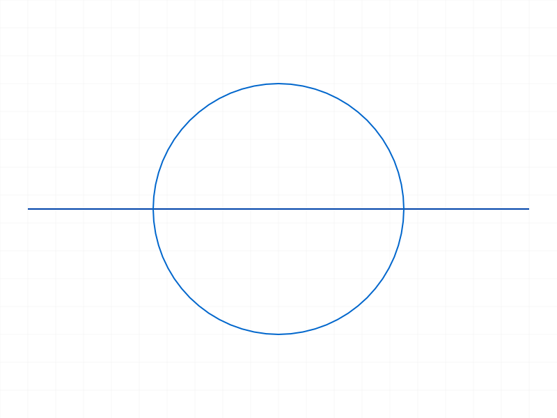
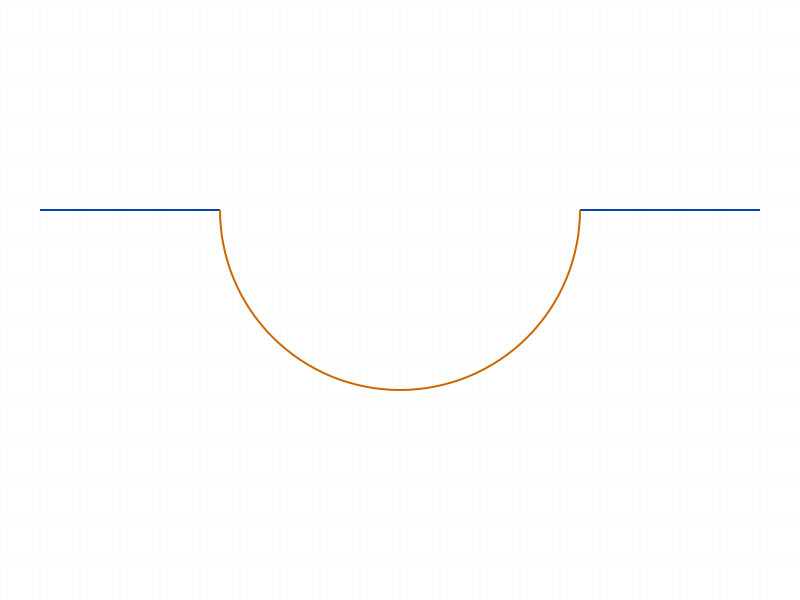
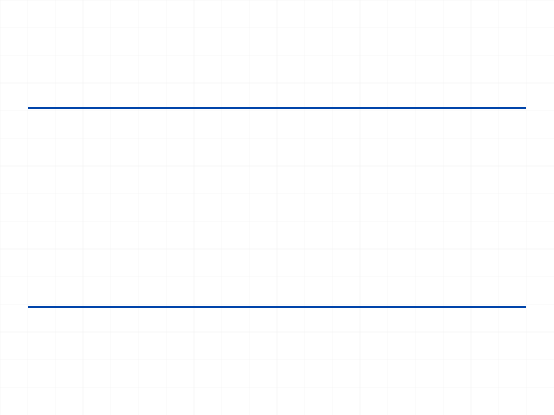
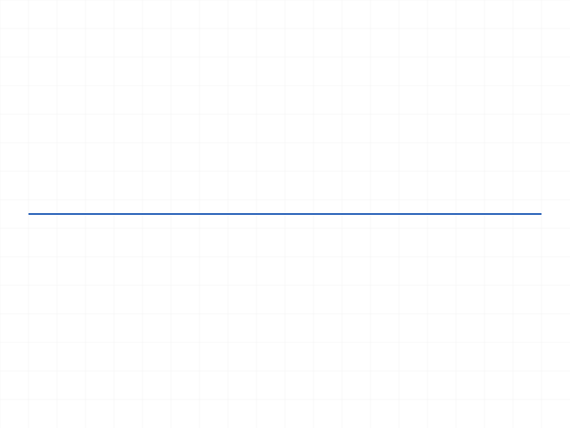
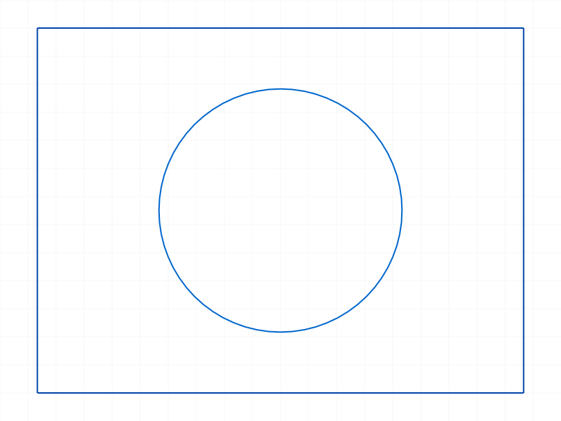
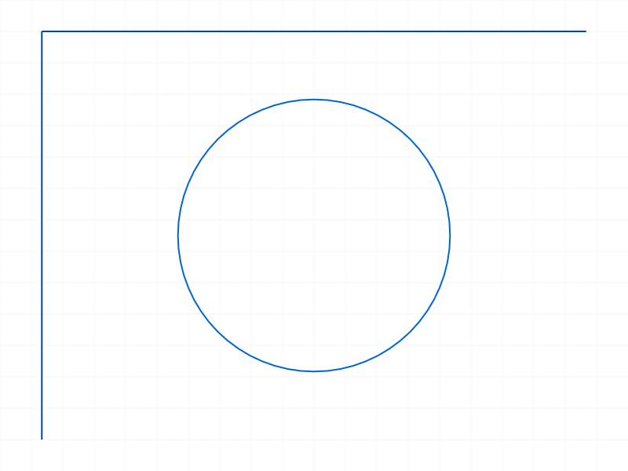

# Training: sketch.splitCurvesMergeBack

**Date:** 2026-04-13

## Goal

Testing `v1.sketch.splitCurvesMergeBack` — the final step in the trim workflow (`splitAllCurves → trimCurves → splitCurvesMergeBack`). This merges staged split results back into real sketch geometry.

**Methods to cover:**

- `splitCurvesMergeBack` — basic call after splitAllCurves (no trim)
- `splitCurvesMergeBack` — full workflow after splitAllCurves + trimCurves
- `splitCurvesMergeBack` — on empty/no-split sketch
- `splitCurvesMergeBack` — after splitCurves (expected no-op per prior findings)
- `splitCurvesMergeBack` — multiple calls in a row
- `splitCurvesMergeBack` — structure tree before/after comparison

**Questions:**

- What geometry exists after mergeBack without any trimming? Do original curves persist or do they become new IDs?
- What does the structure tree look like before and after mergeBack?
- Does mergeBack return any useful data, or always VOID?
- What happens calling mergeBack on a sketch that was never split?
- Can you splitAllCurves → mergeBack → splitAllCurves → mergeBack repeatedly?
- What happens to constraints (Split_Coinc etc.) after mergeBack?
- After mergeBack, are the new curve segments separate entities or re-merged into originals?
- Does mergeBack with trimmed segments produce correct geometry? (visual + data verification)

---

## 01 — basic mergeBack without trimming (initial)

Script: `scripts/01-basic-mergeBack-no-trim.mjs` — ✅ mergeBack returns null, maxLevel=31, empty messages. Used `sketch.geometry` (creation API) instead of `sketch.getGeometry` — returned empty arrays. Fixed in script 06.

## 02 — full trim workflow (initial)

Script: `scripts/02-full-trim-workflow.mjs` — ✅ Full workflow ran. Same geometry query issue as 01. Fixed in script 07.

## 03 — mergeBack without prior split

Script: `scripts/03-no-prior-split.mjs` — ✅ No-op. Returns null, maxLevel=31, no messages. Geometry unchanged.

**Learned:** Calling mergeBack on a sketch with no prior splitAllCurves is safe — silent no-op.

## 04 — mergeBack on empty sketch

Script: `scripts/04-empty-sketch.mjs` — ✅ Returns null, maxLevel=31, no messages. No error on an empty sketch.

**Learned:** mergeBack on empty sketch is a safe no-op.

## 05 — mergeBack after manual splitCurves

Script: `scripts/05-after-splitCurves.mjs` — ✅ Confirmed: mergeBack is a no-op after `splitCurves` (manual split). Returns null, maxLevel=31. The split from `splitCurves` is already committed — there's no staged state for mergeBack to operate on.

**📌 LLM doc:** mergeBack is a no-op after `splitCurves`. Only works with `splitAllCurves` staged splits.

## 06 — mergeBack no trim v2 (with getGeometry)

Script: `scripts/06-mergeBack-no-trim-v2.mjs` — ✅ Key findings with proper `getGeometry` query:

- Before split: `{circles:[58], lines:[63]}`
- After splitAllCurves: getGeometry still returns `{circles:[58], lines:[63]}` — the split is purely internal/staged
- After mergeBack (no trim): `{circles:[58], lines:[63]}` — **same IDs as before**

**Data:** `IDs changed? false` — splitAllCurves → mergeBack without trimming is a **complete round-trip no-op**. Original curve IDs are preserved.

|  |  |
|---|---|

**📌 LLM doc:** When no segments are trimmed, mergeBack reconstructs original curves with their original IDs. The split+merge cycle is a no-op.

## 07 — full workflow v2 (with getGeometry)

Script: `scripts/07-full-workflow-v2.mjs` — ✅ Full workflow (split → trim upper arc + middle line → merge):

- Before: `{circles:[58], lines:[63]}` — circle + line
- splitIds: [80,85,90,94,98] — 5 segments (2 circle arcs + 3 line parts)
- Trimmed: splitIds[0]=80 (upper arc) and splitIds[3]=94 (middle line)
- After mergeBack: `{arcs:[103], lines:[110,114]}` — 1 arc + 2 lines (new IDs)

**Data:** Original circle (58) replaced by arc 103 (lower half). Original line (63) replaced by two line segments 110, 114 (left + right, gap in middle where trimmed segment was).

|  |  |  |
|---|---|---|

**📌 LLM doc:** After mergeBack, trimmed curves get NEW IDs. Original IDs are invalidated. Circles become arcs if segments were removed.

## 08 — structure tree analysis

Script: `scripts/08-structure-tree.mjs` — ✅ Dumped full API responses at each stage. Key findings:

- Stage 1 (before split): `{circles:[58], lines:[63]}`
- Stage 2 (after split): splitIds [80,85,90,94,98]
- Stage 3 (after trim of upper arc only): getGeometry STILL returns `{circles:[58], lines:[63]}` — trimCurves alone is invisible
- Stage 4 (after mergeBack): result=null, maxLevel=31
- Stage 5 (final): `{arcs:[103], lines:[63]}` — circle→arc 103, line stays ID 63

**Data:** When only circle segments are trimmed and no line segments are trimmed, the **line keeps its original ID** (63). Only the affected curve (circle→arc) gets a new ID.

**📌 LLM doc:** Untrimmed split curves are **reconstructed to their originals** with the same ID. Only curves that had segments removed get new IDs.

## 09 — double mergeBack

Script: `scripts/09-double-mergeBack.mjs` — ✅ Calling mergeBack twice after splitAllCurves:

- First mergeBack: null, maxLevel=31
- Second mergeBack: null, maxLevel=31, no messages
- Final geometry: `{circles:[58], lines:[63]}` — unchanged

**Learned:** Second mergeBack is a harmless no-op. No error, no state change.

## 10 — repeated split-merge cycles

Script: `scripts/10-repeated-split-merge-cycles.mjs` — ✅ Three cycles on the same geometry:

- Start: `{circles:[58], lines:[63]}`
- Cycle 1 (split → mergeBack, no trim): `{circles:[58], lines:[63]}` — IDs preserved
- Cycle 2 (split → mergeBack, no trim): `{circles:[58], lines:[63]}` — IDs preserved
- Cycle 3 (split → trim upper arc → mergeBack): `{arcs:[177], lines:[63]}` — circle→arc, line preserved

**Data:** Split IDs increment each cycle (80-98, 117-135, 154-172) but originals survive mergeBack when no segments trimmed. Cycles are independently clean. The line (63) survives all 3 cycles because it was never the target of trimming.

**📌 LLM doc:** Repeated split-merge cycles work cleanly. Each cycle gets fresh split IDs.

## 11 — wrong ID type (part ID)

Script: `scripts/11-wrong-id-type.mjs` — ✅ Error as expected:

- maxLevel=51, code=1001
- Message: `"The parameter \"id\" has a wrong id type! Provide only following id types: [\"sketch\"]"`

## 12 — invalid ID

Script: `scripts/12-invalid-id.mjs` — ✅ Error:

- maxLevel=51, two messages: warning (code 0) "ToId()/TOID() didn't get an existing or valid id" + error (code 1006) "An element of parameter \"id\" has an invalid id!"

## 13 — trim ALL segments then mergeBack

Script: `scripts/13-trim-all-segments.mjs` — ✅ Trim every segment returned by splitAllCurves, then mergeBack:

- After: `{arcs:[], circles:[], lines:[], points:[]}` — empty sketch
- maxLevel=31, no error

**Learned:** Trimming all segments + mergeBack empties the sketch completely. No error.

**📌 LLM doc:** Trimming all segments effectively deletes all geometry.

## 14 — non-intersecting curves

Script: `scripts/14-non-intersecting-curves.mjs` — ✅ Two parallel lines (no intersection):

- Before: `{lines:[58,64]}`
- splitAllCurves returns [58,64] (original IDs — no intersections)
- After mergeBack: `{lines:[58,64]}` — IDs preserved: true

**Learned:** With non-intersecting curves, splitAllCurves returns originals. mergeBack preserves them. Complete no-op cycle.

## 15 — trim non-intersecting curve then mergeBack

Script: `scripts/15-trim-non-intersecting-then-merge.mjs` — ✅ Trim one of two non-intersecting lines:

- Before: `{lines:[58,64]}`
- splitIds: [58,64] (originals, no intersections)
- Trim line 58 (first line)
- After mergeBack: `{lines:[64]}` — line 58 is gone

|  |  |
|---|---|

**📌 LLM doc:** trimCurves can remove non-intersecting curves via their original IDs (from NoneSplitted container). mergeBack deletes them.

## 16 — complex geometry (rectangle + circle)

Script: `scripts/16-complex-geometry.mjs` — ✅ Rectangle + non-intersecting circle (circle fully inside rectangle):

- Before: `{circles:[90], lines:[58,62,68,74]}`
- splitIds: [58,62,68,74,90] — all originals (no intersections, circle is inside rect)
- Trimmed [0]=58 and [1]=62 (two rect sides)
- After mergeBack: `{circles:[90], lines:[68,74]}` — two rect sides removed, circle + remaining 2 sides survive

|  |  |
|---|---|

**Learned:** Confirms that non-intersecting curves trimmed via original IDs are removed by mergeBack.

## 17 — constraints after trim+mergeBack

Script: `scripts/17-mergeBack-preserves-constraints.mjs` — ✅ L-shape (2 connected lines) + crossing diagonal:

- Before: `{lines:[58,66,74]}` — 3 lines
- splitIds: [90,94,66,98,102] — 5 segments (lines 58,74 split; line 66 untouched)
- Trimmed index 3 (ID 98 — a segment of one of the split lines)
- After: `{lines:[66,58,108]}` — 3 lines

**Data:** Line 66 (untouched by splitting) keeps original ID. Line 58 (split but no segments trimmed) keeps original ID. The trimmed line's remaining segment gets new ID 108.

## 18 — points survive mergeBack

Script: `scripts/18-points-survive-mergeBack.mjs` — ✅ Sketch with a point + two crossing lines:

- Before: `{lines:[60,66], points:[58]}`
- After trim+mergeBack: `{lines:[66,99], points:[58]}`

**Data:** Point ID 58 survived the entire split-trim-merge cycle. Points are unaffected.

**📌 LLM doc:** Sketch points are completely unaffected by the split/trim/merge workflow. They keep their IDs.

## 19 — positions after mergeBack

Script: `scripts/19-getPositions-after-merge.mjs` — ✅ Verify endpoint coordinates of remaining geometry:

- Created line (-50,0) to (50,0) first, then circle at origin r=30
- splitIds: [82,86,90,94,99] — 3 line segments + 2 circle arcs (creation order: line first → line segments first)
- Trimmed splitIds[3]=94 — this is a **circle arc** (not middle line), because line has indices 0-2, circle has 3-4
- After: `{arcs:[106], lines:[58]}` — arc 106 + original line 58

**Data:**
- Line 58: positions (-50,0) to (50,0) — **full original line**, reconstructed because no line segments were trimmed
- Arc 106: center (0,0), start (-30,~0) to end (30,~0) — lower semicircle (the untrimmed half)

**📌 LLM doc:** Untrimmed curves are fully reconstructed as their originals (same ID, same endpoints). Segment ordering in splitIds follows creation order, NOT the circle/line pattern assumed in earlier training.

## 20 — single curve, no intersections

Script: `scripts/20-single-curve-no-intersections.mjs` — ✅ Single line in sketch:

- splitAllCurves returns [58] (the original ID), maxLevel=31
- mergeBack: null, maxLevel=31
- After: `{lines:[58]}` — IDs preserved: true

**Learned:** Single curve + split + merge is a no-op. Consistent with all other no-intersection cases.

---

## Summary of Findings

### Core Behavior
1. **mergeBack always returns VOID (null)** with maxLevel=31. No useful return data.
2. **Only one parameter:** `id` (sketch ID). No options or configuration.
3. **Purpose:** Commits staged split results from `splitAllCurves` into real geometry.

### ID Preservation Rules
- **Untrimmed curves → same ID.** If a curve was split by `splitAllCurves` but NO segments were trimmed, mergeBack reconstructs the original curve with its original ID.
- **Trimmed curves → new IDs.** If any segment of a curve was removed by trimCurves, the remaining segments get new IDs.
- **Non-intersecting curves** that were trimmed (via original ID from NoneSplitted container) → removed entirely.
- **Points** are completely unaffected — keep their IDs throughout.

### When mergeBack is a No-Op
- No prior splitAllCurves → no-op
- After `splitCurves` (manual split) → no-op
- splitAllCurves + mergeBack (no trim) → no-op (geometry unchanged, IDs preserved)
- Double mergeBack → second call is a no-op
- Empty sketch → no-op

### Segment Ordering
- `splitAllCurves` returns segments grouped by **creation order** of original curves
- First-created curve's segments come first in the array
- This matters when indexing splitIds for trimCurves

### Error Handling
- Wrong ID type (not sketch): maxLevel=51, code=1001
- Invalid/nonexistent ID: maxLevel=51, code=1006
- All safe no-op cases: maxLevel=31, no messages
