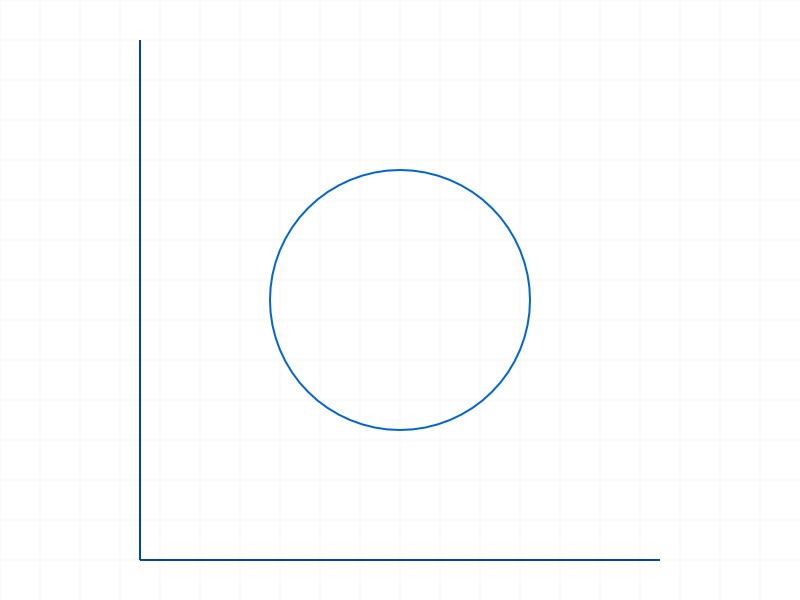
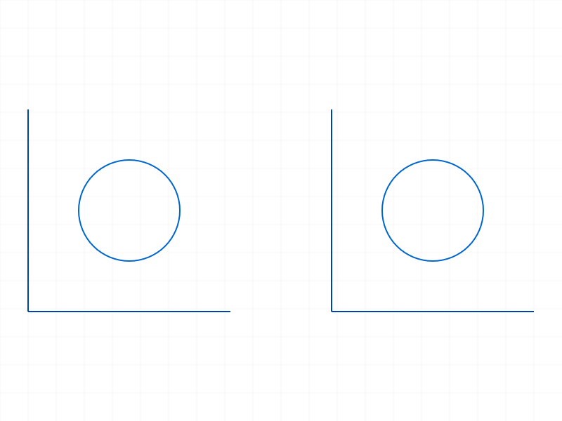
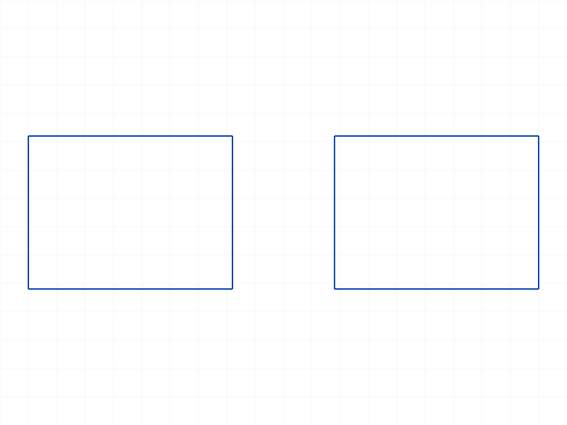
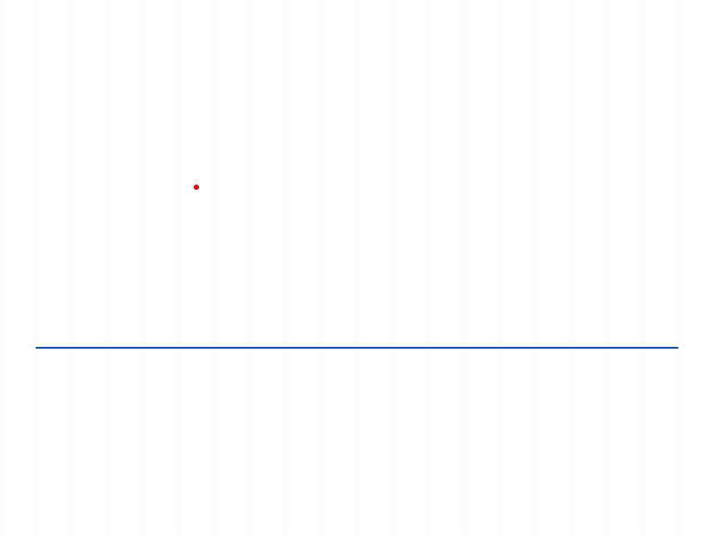
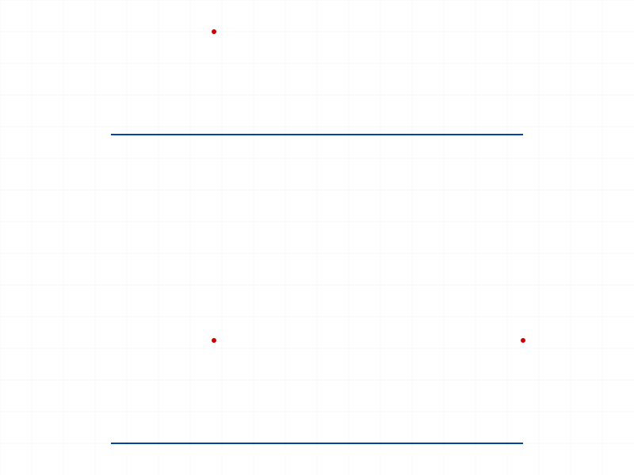

# Training: sketch.copyGeometry

**Date:** 2026-04-13

## Goal

Testing `v1.sketch.copyGeometry` — copies sketch geometry within a sketch with optional translation.

**Methods to cover:**

- `copyGeometry` — basic copy of a single element
- `copyGeometry` — copy multiple elements (geomIds array)
- `copyGeometry` — translation offset
- `copyGeometry` — `doCopyConstraints` param (TRUE default, test FALSE)
- Return value: array of new IDs

**Questions:**

- What IDs are returned? One per copied element, or grouped?
- Does copying a constrained element also copy its constraints by default?
- What happens when doCopyConstraints=FALSE?
- Can you copy points? Arcs? Rectangles (which are multi-element)?
- What happens with invalid geomIds?
- Does the copy maintain the same geometry type/parameters?

---

## 01 — basic copy of a single line

Script: `scripts/01-basic-copy-line.mjs` — Copy works visually but result is `null`.

|  |  |
|---|---|

**Data:** result=null, maxLevel=31 (info), no messages. Two lines visible in snapshot — copy succeeded geometrically.

**Learned:** The docs claim result is `id[]|VOID`, but with default params the result is null. The copy does happen — geometry appears — but no IDs are returned.

**📌 LLM doc:** Document that result is null when doCopyConstraints is default/true.

---

## 02 — copy multiple (broken circle param)

Script: `scripts/02-copy-multiple.mjs` — Error because `sketch.circle` param is `centerPos` not `center`. Passing null in geomIds causes error 1001: "wrong type".

**Data:** maxLevel=51 (ERROR), message: "An element of parameter \"geomIds\" has the wrong type! It should be of type (string|real|id)".

**Learned:** Null values in geomIds are caught as type errors — good validation.

---

## 03 — copy multiple elements (fixed)

Script: `scripts/03-copy-multiple-fixed.mjs` — ✅ Copies 2 lines + 1 circle with [60,0,0] translation.

|  |  |
|---|---|

**Data:** result=null, maxLevel=31. All three elements duplicated at correct offset.

---

## 04 — copy constrained rectangle (doCopyConstraints=default)

Script: `scripts/04-copy-constraints-default.mjs` — ✅ Rectangle (4 lines) copied with default doCopyConstraints.

|  |  |
|---|---|

**Data:** result=null, maxLevel=31. Copied rectangle maintains shape (appears constrained). Structure dump (55KB) contains no constraint type nodes at the structure level — constraints aren't surfaced in `r.structure`.

---

## 05 — doCopyConstraints=false

Script: `scripts/05-doCopyConstraints-false.mjs` — ✅ Key discovery: when `doCopyConstraints: false`, result returns the array of new IDs!

**Data:** result=`[91, 94, 97, 100]` (4 IDs for 4 rectangle lines), maxLevel=31.

|  |
|---|

**📌 LLM doc:** `doCopyConstraints: false` is the only way to get back the IDs of copied elements. Default (true) always returns null.

---

## 06 — doCopyConstraints=true (explicit)

Script: `scripts/06-doCopyConstraints-true.mjs` — Confirms: `doCopyConstraints: true` (explicit) also returns null.

**Data:** result=null, maxLevel=31. Identical behavior to default.

---

## 07 — copy unconstrained geometry with default

Script: `scripts/07-copy-unconstrained-default.mjs` — Even on geometry with NO constraints, default returns null and `doCopyConstraints: false` returns IDs.

**Data:** default result=null, false result=`[67]`, maxLevel=31 for both.

**Learned:** The null-vs-IDs return behavior is driven entirely by the `doCopyConstraints` flag, not by whether constraints actually exist. This is a code-path difference, not a data-dependent one.

**📌 LLM doc:** Critical gotcha — to get IDs of copied elements, you must pass `doCopyConstraints: false`.

---

## 08 — edge cases

Script: `scripts/08-edge-cases.mjs` — Tests empty array, invalid ID, zero translation, missing translation.

|  |
|---|

**Data:**
- **Empty geomIds `[]`:** result=null, maxLevel=31, no messages. Silent no-op.
- **Invalid ID `9999`:** maxLevel=51 (ERROR), code 1006: "An element of parameter \"geomIds\" has an invalid id!"
- **Zero translation `[0,0,0]`:** result=`[65]`, maxLevel=31. Copies on top of original — works fine.
- **Missing translation:** maxLevel=51 (ERROR), code 1004: "The parameter \"translation\" must be provided in the api call!"

**📌 LLM doc:** `translation` is REQUIRED (not optional). Empty geomIds is silent no-op. Invalid IDs produce error 1006.

---

## 09 — copy arc (point failed — wrong param)

Script: `scripts/09-copy-arc-point.mjs` — Arc copies fine. Point creation failed (used `position` instead of `pos`).

**Data:** arc copy result=`[62]`, maxLevel=31.

---

## 10 — copy point and mixed types

Script: `scripts/10-copy-point-fixed.mjs` — ✅ Points, lines, and mixed types all copy correctly.

**Data:**
- Point copy: result=`[67]` (1 ID for 1 point)
- Mixed copy (point + line): result=`[68, 69]` (2 IDs for 2 elements)

|  |  |
|---|---|

**Learned:** Return array matches geomIds count 1:1. Each input element produces exactly one output ID.

---

## Coverage Summary

- [x] API called successfully
- [x] Every required parameter tested (id, geomIds, translation)
- [x] Key optional parameter tested (doCopyConstraints: true, false, default)
- [x] Different geometry types: line, circle, arc, point, mixed
- [x] Edge cases: empty array, invalid ID, zero translation, missing translation
- [x] No update/delete method exists for copyGeometry
- [x] Realistic usage: rectangle copy with constraints
- [x] Behavioral claims verified with data (filewrite dumps, logged return values)
