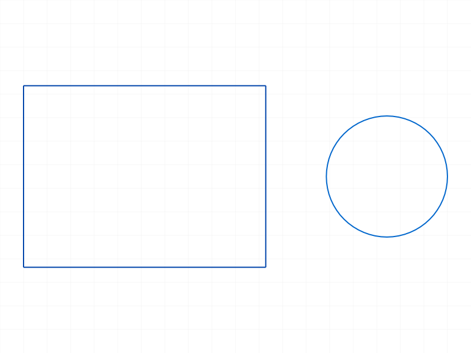
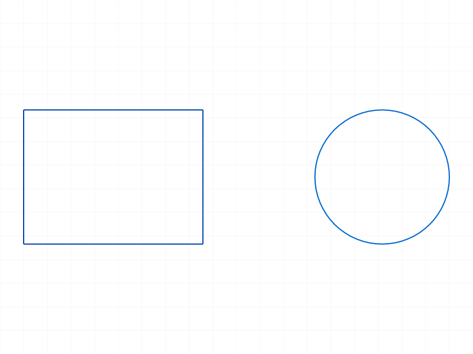
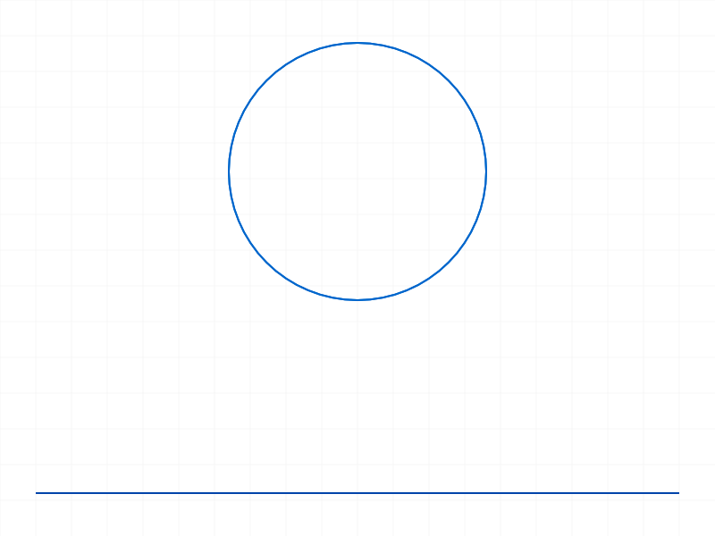

# Training: sketch.copyFrom

**Date:** 2026-04-13

## Goal

Testing `v1.sketch.copyFrom` — copies sketch geometry from one sketch to another.

**Methods to cover:**

- `copyFrom` — basic copy between two sketches
- `copyFrom` params: `id` (destination sketch), `toCopyId` (source sketch)
- Return value: VOID (per docs)

**Questions:**

- Does it copy all geometry (lines, circles, arcs, points, rectangles)?
- Does it copy constraints from the source sketch?
- What happens when source sketch is empty?
- What happens with overlapping geometry (source has elements at same positions as destination)?
- Does it work across different parts, or only within the same part?
- What happens if source or destination sketch IDs are invalid?
- How does it differ from `copyGeometry` (which copies within same sketch with offset)?
- Does the destination sketch retain its existing geometry, or is it replaced?
- Are the copied element IDs new, or do they reference the originals?

---

## 01 — basic copy between sketches

Script: `scripts/01-basic-copy.mjs` — ✅ copies rectangle + circle from source to destination sketch.

|  |  |
|---|---|

**Data:** result=null, maxLevel=31, messages=[]. Destination sketch (Sketch0) shows identical geometry to source (rectangle + circle).

**Learned:** `copyFrom` returns VOID (null), maxLevel 31 (info), no messages on success. Geometry is faithfully copied with same positions.

---

## 02 — destination already has geometry (merge test)

Script: `scripts/02-dest-has-geometry.mjs` — ✅ destination retains existing geometry, source geometry is added (merge, not replace).

|  |  |
|---|---|

**Data:** result=null, maxLevel=31. Destination had a circle at [80,15], after copyFrom it has circle + rectangle from source.

**📌 LLM doc:** copyFrom merges — it does NOT replace existing geometry. Destination keeps all its elements and gets the source elements added.

---

## 03 — empty source sketch

Script: `scripts/03-empty-source.mjs` — ✅ silent no-op when source is empty.

**Data:** result=null, maxLevel=31, messages=[]. Destination sketch retains its line. No error.

**Learned:** Empty source is a silent no-op — same behavior pattern as copyGeometry with empty geomIds.

---

## 04 — invalid IDs

Script: `scripts/04-invalid-ids.mjs` — ✅ proper error handling for invalid IDs.

**Data:**
- Invalid toCopyId: maxLevel=51, code=1006 "An element of parameter \"toCopyId\" has an invalid id!"
- Invalid id: maxLevel=51, code=1006 "An element of parameter \"id\" has an invalid id!"
- Both also produce warning (level 41) "ToId()/TOID() didn't get an existing or valid id."

**📌 LLM doc:** Both params validate — error 1006 for invalid IDs, with a preceding level-41 warning.

---

## 05 — wrong ID type (part ID instead of sketch ID)

Script: `scripts/05-cross-part.mjs` — ✅ clear error when passing non-sketch IDs.

**Data:**
- toCopyId=partId: maxLevel=51, code=1001 "The parameter \"toCopyId\" has a wrong id type! Provide only following id types: [\"sketch\"]"
- id=partId: maxLevel=51, code=1001 "The parameter \"id\" has a wrong id type! Provide only following id types: [\"sketch\"]"

**📌 LLM doc:** Both params require sketch IDs specifically. Error 1001 with descriptive message naming the required type.

---

## 06 — constraints are copied

Script: `scripts/06-copy-constraints.mjs` — ✅ constraints from source are copied to destination.

**Data:** Inspected structure tree after copyFrom. Source sketch (id=52) had 9 constraints (1 fixation, 4 coincident, 1 parallel, 2 perpendicular, 1 horizontal — all auto-generated from rectangle). Destination sketch (id=92) had the same 9 constraint types and names. See `files/06-copy-constraints-structure-after-copy.json`.

**📌 LLM doc:** copyFrom copies both geometry AND constraints. Unlike copyGeometry (where constraint copying is controlled by doCopyConstraints flag), copyFrom always copies constraints.

---

## 07 — self-copy (source = destination)

Script: `scripts/07-copy-to-self.mjs` — ✅ self-copy is allowed, produces duplicate geometry.

|  |
|---|

**Data:** result=null, maxLevel=31, no messages. The sketch now has duplicate geometry stacked on top of originals (line + circle each appear twice at same positions).

**📌 LLM doc:** Self-copy (id === toCopyId) is not rejected — it silently duplicates all elements on top of existing ones. Probably not useful but not an error.

---

## 08 — feature-based sketches (part.sketch)

Script: `scripts/08-feature-sketch.mjs` — ✅ works between feature sketches.

**Data:** result=null, maxLevel=31, no messages. Successfully copied rectangle + circle from one part.sketch to another part.sketch.

**Learned:** copyFrom works with both sketch.create (EI) sketches and part.sketch (feature) sketches interchangeably.

---

## Coverage checklist

- [x] API called successfully
- [x] `id` param tested (valid, invalid, wrong type)
- [x] `toCopyId` param tested (valid, invalid, wrong type)
- [x] No enum values (simple API)
- [x] No update/delete method exists
- [x] Realistic usage: copy between feature sketches
- [x] Behavioral claims verified with structure tree data (constraints), not just screenshots

## Summary of findings

1. **Return value:** Always null (VOID), maxLevel 31 on success
2. **Merge behavior:** Adds to destination, does not replace existing geometry
3. **Constraints:** Copies constraints along with geometry (always, no flag to control this)
4. **Empty source:** Silent no-op
5. **Self-copy:** Allowed, duplicates geometry on top of itself
6. **Wrong ID types:** Clear error 1001 naming required type ["sketch"]
7. **Invalid IDs:** Error 1006
8. **Cross sketch types:** Works between sketch.create and part.sketch sketches
