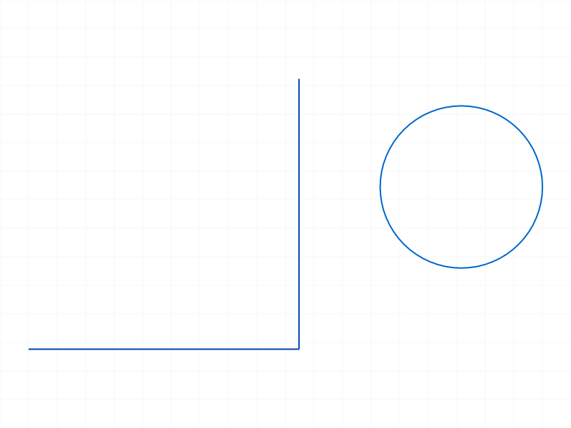
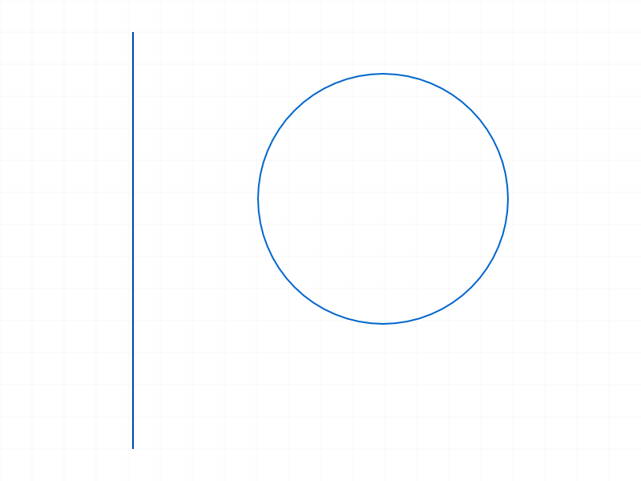
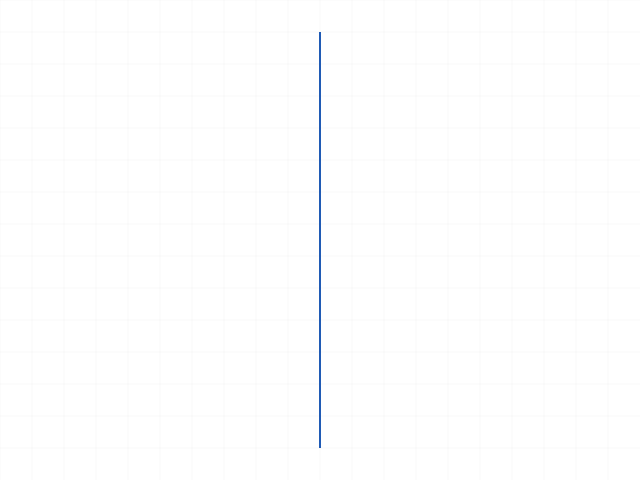
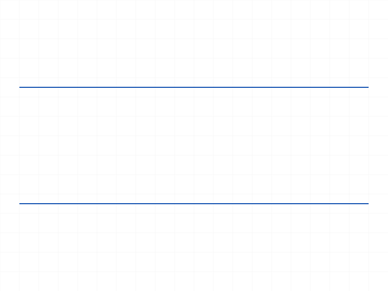
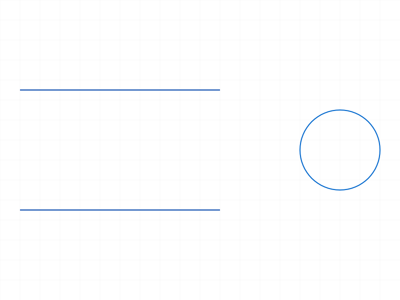
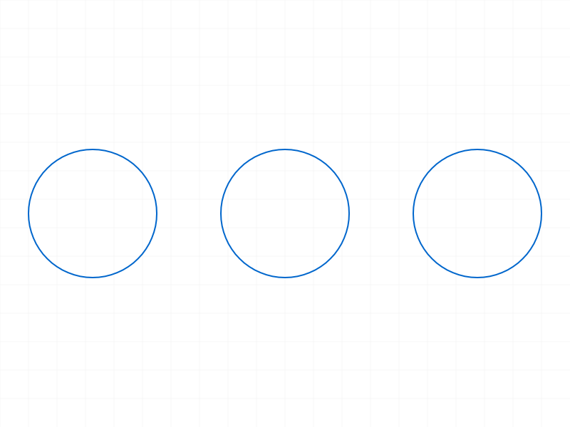
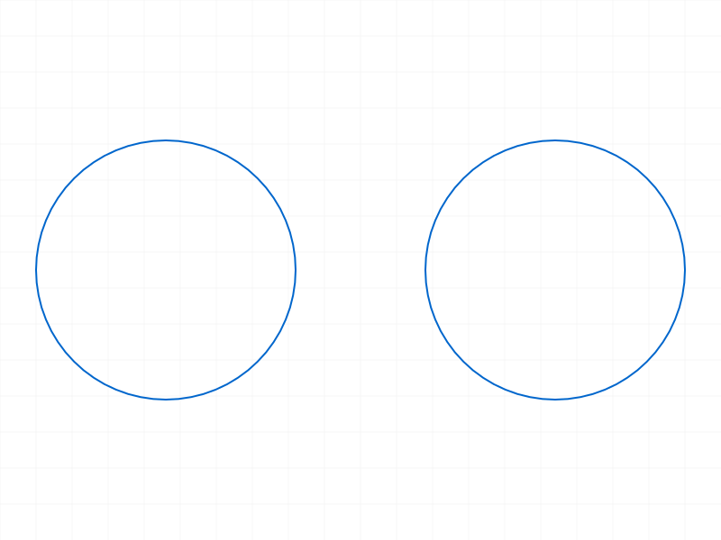

# Training: sketch.deleteObject

**Date:** 2026-04-13

## Goal

Testing `v1.sketch.deleteObject` — deletes dimensions, constraints, sketch geometry, sketch regions, or rigid sets from a sketch.

**Methods to cover:**

- `deleteObject` — basic deletion of geometry (lines, circles, arcs)
- `deleteObject` — deletion of constraints
- `deleteObject` — deletion of dimensions
- `deleteObject` — deletion of sketch regions
- `deleteObject` — deletion of rigid sets
- `deleteObject` — mixed IDs (geometry + constraints together)
- `deleteObject` — edge cases: invalid IDs, empty array, already-deleted IDs

**Questions:**

- Does it return VOID on success regardless of what was deleted?
- What happens when passing invalid/nonexistent IDs?
- What happens when deleting geometry that has constraints on it — are constraints auto-deleted?
- Can you delete a sketch region without deleting its underlying geometry?
- What maxLevel do we get on various error conditions?
- Does deleting pattern instances work? What about pattern source geometry?

---

## 01 — basic geometry deletion

Script: `scripts/01-delete-geometry.mjs` — ✅ Lines and circles delete successfully.

|  |  |  |
|---|---|---|

**Data:** Both deletions return `result: null` (VOID), `messages: []`, `maxLevel: 31` (info = success).

**Learned:** Successful deletion returns null result with empty messages and maxLevel=31.
**📌 LLM doc:** Return value is null (VOID), maxLevel=31 on success.

---

## 02 — delete constraints and dimensions

Script: `scripts/02-delete-constraints.mjs` — ✅ FIXATION constraint and OFFSET dimension both delete successfully.

|  |  |
|---|---|

**Data:** Both return `result: null`, `messages: []`, `maxLevel: 31`. Constraint ID 72 and dimension ID 76 deleted, underlying lines remain.

**Learned:** Deleting constraints/dimensions does not affect the geometry they reference.

---

## 03 — edge cases: invalid IDs, empty array, double-delete

Script: `scripts/03-invalid-ids.mjs` — ✅ edge cases handled cleanly.

**Data:**
- **Empty `ids: []`**: returns `result: null`, `messages: []`, `maxLevel: 31` — silent no-op, no error.
- **Nonexistent ID `9999`**: returns `maxLevel: 51` with two messages: WARNING "ToId()/TOID() didn't get an existing or valid id" (level 41) + ERROR "An element of parameter ids has an invalid id!" (code 1006, level 51).
- **Double-delete** (same ID twice): identical error to nonexistent ID — `maxLevel: 51`, same messages.

**📌 LLM doc:** Empty array is a silent no-op. Invalid/already-deleted IDs produce maxLevel=51 with code 1006. Double-delete is the same as invalid ID.

---

## 04 — deleting geometry that has constraints/dimensions

Script: `scripts/04-delete-constrained-geom.mjs` — ✅ constraints and dimensions auto-cascade.

**Data:**
- Line had FIXATION constraint (ID 66) and OFFSET dimension (ID 70).
- Deleting line: `maxLevel: 31` (success). `getGeometry` shows empty after.
- Attempting to delete constraint (66) after: `maxLevel: 51`, "invalid id" — already gone.
- Attempting to delete dimension (70) after: `maxLevel: 51`, "invalid id" — already gone.

**Learned:** Deleting geometry **auto-deletes** all constraints and dimensions referencing it. No orphan constraints are left behind.
**📌 LLM doc:** Cascading deletion — geometry deletion removes associated constraints/dimensions automatically.

---

## 05 — deleting a sketch region

Script: `scripts/05-delete-sketch-region.mjs` — ✅ region deleted, geometry preserved.

|  |  |
|---|---|

**Data:** Region ID 92 deleted successfully (maxLevel=31). `getGeometry` shows all 4 rectangle lines still present after region deletion.

**Learned:** Deleting a sketch region removes only the region object — the underlying geometry is untouched.
**📌 LLM doc:** Region deletion is non-cascading. Geometry is preserved.

---

## 06 — deleting a rigid set

Script: `scripts/06-delete-rigid-set.mjs` — ✅ rigid set deleted, geometry preserved.

**Data:** Rigid set ID 74 deleted (maxLevel=31). Both lines (58, 66) still present in `getGeometry`.

**Learned:** Deleting a rigid set removes only the grouping — individual geometry elements remain.
**📌 LLM doc:** Rigid set deletion is non-cascading. Geometry is preserved.

---

## 07 — multi-delete (mixed types in one call)

Script: `scripts/07-multi-delete.mjs` — ✅ deletes line, circle, and constraint in a single call.

|  |  |
|---|---|

**Data:** Deleted IDs [58 (line1), 72 (circle), 75 (constraint)] in one call. `maxLevel: 31`. Only line2 (ID 66) remains in `getGeometry`.

**Learned:** Multi-delete works with mixed object types. All specified objects deleted atomically.
**📌 LLM doc:** `ids` array accepts mixed types (geometry, constraints, dimensions, regions, rigid sets).

---

## 08 — deleting pattern constraint

Script: `scripts/08-delete-pattern-geom.mjs` — ✅ pattern constraint deleted, all geometry persists.

|  |  |
|---|---|

**Data:** Linear pattern created 3 circles (original + 2 copies). Deleting pattern constraint (ID 73): `maxLevel: 31`. All 3 circles remain in `getGeometry`.

**Learned:** Deleting a pattern constraint removes the pattern relationship but preserves ALL geometry (original + copies). The circles become independent, unlinked geometry.
**📌 LLM doc:** Pattern constraint deletion is non-cascading — all geometry (original + copies) persists as independent elements.

---

## 09 — deleting pattern source geometry

Script: `scripts/09-delete-pattern-source.mjs` — ✅ source deleted, copies survive.

|  |  |
|---|---|

**Data:** 3 circles before. Deleted source circle. 2 circles remain after.

**Learned:** Deleting the source geometry of a pattern removes only the source. Pattern copies survive independently.
**📌 LLM doc:** Deleting pattern source removes only that element. Copies are not cascaded.

---

## 10 — deleting a standalone point

Script: `scripts/10-delete-point.mjs` — ✅ point deleted, line preserved.

**Data:** Point (ID 58) deleted with `maxLevel: 31`. Line (ID 60) remains.

**Learned:** Points delete like any other geometry element. No special behavior.

---

## Coverage Checklist

- [x] API called successfully
- [x] Required parameter `ids` tested
- [x] Key optional params: N/A (only `ids`)
- [x] All documented object types tested: geometry (lines, circles, points), constraints, dimensions, sketch regions, rigid sets
- [x] No `update*` / `delete*` companion — this IS the delete API
- [x] Realistic usage: cascading behavior with constraints, pattern cleanup, multi-delete workflow
- [x] Behavioral claims verified with data (filewrite dumps, logged return values)
