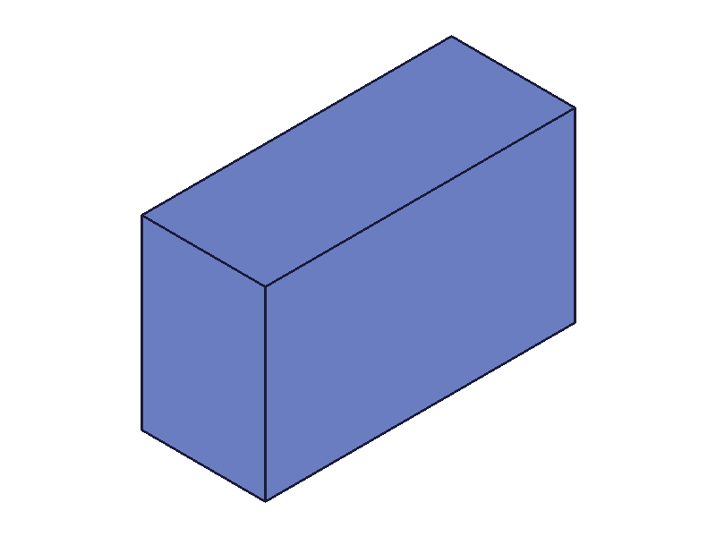
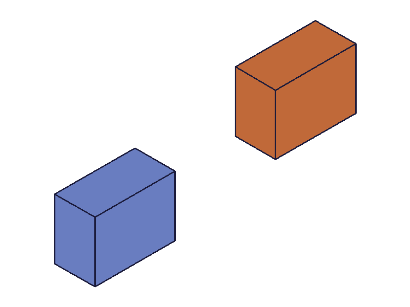
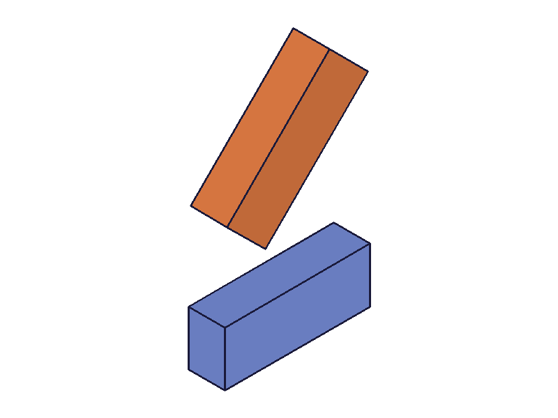
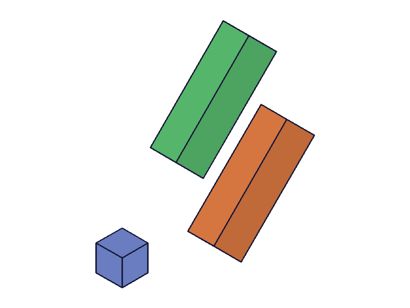
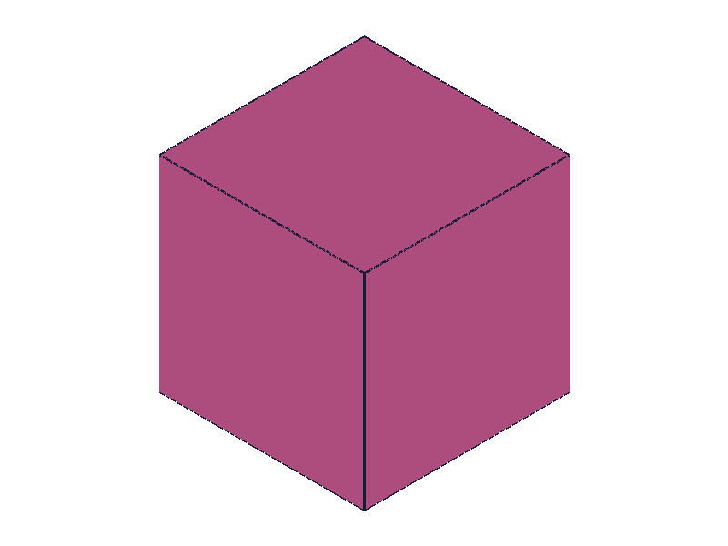
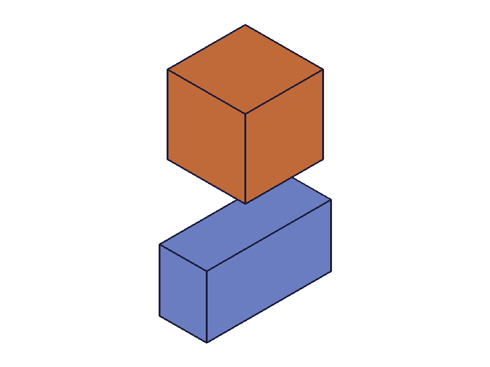
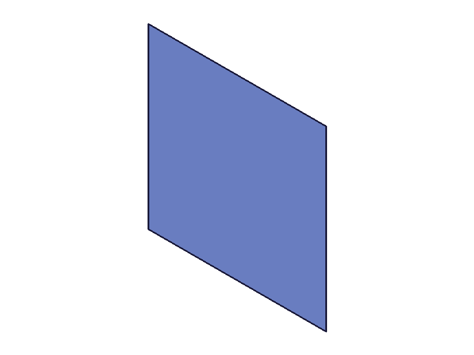

# Training: solid.box

**Date:** 2026-04-13

## Goal

Testing `v1.solid.box` — creating box primitives within entity injection features.

**Methods to cover:**

- `solid.box` — required params: `id`, `length`, `width`, `height`
- `solid.box` optional params: `translation`, `rotation`, `rotateFirst`
- `solid.deleteSolid` — deleting created boxes

**Questions:**

- What does `solid.box` return? An ID or VOID?
- What happens with zero or negative dimensions?
- How do `translation` and `rotation` interact? What does `rotateFirst` do?
- Can multiple boxes coexist in one entity injection feature?
- What's the box's default origin/alignment (centered? corner-aligned?)

---

## 01 — basic box

Script: `scripts/01-basic.mjs` — ✅ Creates a box with required params (length=100, width=60, height=40).

|  |
|---|

**Data:** result=61 (integer ID), maxLevel=31, messages=[]. See `files/01-basic-box-response.json`.

**📌 LLM doc:** `solid.box` returns an integer solid ID on success, not VOID. maxLevel=31 indicates success (not 0 as in some other APIs).

---

## 02 — translation

Script: `scripts/02-translation.mjs` — ✅ Two boxes: one at origin, one translated [60, 40, 30].

|  |
|---|

**Data:** Both boxes created successfully (IDs 61 and 64). Translation works as expected — offsets the box from its default position.

---

## 03 — rotation

Script: `scripts/03-rotation.mjs` — ✅ Box rotated 45° around Z axis, translated to [0, 80, 0] for visibility.

|  |
|---|

**Data:** Rotation applied correctly. Rotation values are in radians (Math.PI/4 = 45°).

---

## 04 — rotateFirst comparison

Script: `scripts/04-rotateFirst.mjs` — ✅ Three boxes: reference cube at origin, rotateFirst=true (green), rotateFirst=false (orange). Same rotation [0,0,π/4] and translation [100,0,0].

|  |
|---|

**Data:** Clear visual difference. rotateFirst=true (default): the box is first rotated 45° in place, then translated 100 units along X. rotateFirst=false: the box is first translated 100 units along X, then rotated 45° around the origin — ending up in a completely different position.

**📌 LLM doc:** Document rotateFirst behavior — it controls transform order. Default TRUE means rotate-then-translate. FALSE means translate-then-rotate (rotation is always around the origin).

---

## 05 — edge cases (zero, negative, tiny, huge dimensions)

Script: `scripts/05-edge-cases.mjs` — ⚠️ All succeed silently with maxLevel=31 and no error messages.

|  |
|---|

**Data:** See `files/05-edge-cases-edge-cases.json`. Zero length: ID=61, maxLevel=31, messages=[]. Negative length: ID=64, maxLevel=31, messages=[]. Tiny (0.001): ID=67. Huge (100000³): ID=70. All return valid IDs with no warnings.

**📌 LLM doc:** Zero and negative dimensions are accepted without error — this is a gotcha. Zero creates degenerate geometry (flat plane). Negative creates geometry the renderer cannot display (no PNG produced). Always validate dimensions > 0 before calling.

---

## 06 — multiple boxes and deleteSolid

Script: `scripts/06-multiple-boxes.mjs` — ✅ Three boxes in one EIF, then delete one.

|  |
|---|

**Data:** Three boxes created (IDs 61, 64, 67). After deleting box2 (ID 64), `deleteSolid` returns null (VOID) with maxLevel=31. Snapshot shows two remaining boxes.

**📌 LLM doc:** Multiple boxes can coexist in one entity injection feature. `deleteSolid` with specific `ids` removes only those solids; returns VOID.

---

## 07 — missing/wrong parameters

Script: `scripts/07-missing-params.mjs` — ✅ Error handling works correctly.

**Data:** See `files/07-missing-params-missing-params.json`.
- Missing `height`: result=null, maxLevel=51, message: `"The parameter \"height\" must be provided in the api call!"`
- Missing all dims: result=null, maxLevel=51, message: `"The parameter \"length\" must be provided in the api call!"` (checks length first)
- Wrong ID type (partId instead of eifId): result=null, maxLevel=51, message: `"The parameter \"id\" has a wrong id type! Provide only following id types: [\"entityinjection\"]"`

**📌 LLM doc:** Clear error messages at maxLevel=51. Required params validated in order: length → width → height. ID must be entity injection feature type.

---

## 08 — zero/negative dimension geometry verification

Script: `scripts/08-zero-negative-verify.mjs` — ✅ Detailed verification of degenerate cases.

|  |
|---|

**Data:** Zero-length box produces a flat plane (degenerate solid) — visible in snapshot as a rectangle. Negative-length and all-negative boxes produce solids that the renderer cannot display (no solid PNG generated, only OFB/STEP). Normal reference box renders correctly.

**📌 LLM doc:** Zero dimension → flat degenerate solid. Negative dimensions → internal geometry that can't render. Neither produces errors or warnings.

---

## Coverage checklist

- [x] The API has been called at least once successfully (scripts 01-06)
- [x] Every required parameter has been tested (id, length, width, height — scripts 01, 07)
- [x] Key optional parameters have been exercised (translation=02, rotation=03, rotateFirst=04)
- [x] N/A — no enum values
- [x] `deleteSolid` tested (script 06)
- [x] Realistic usage combining with prerequisites — part.create + entityInjection + solid.box (all scripts)
- [x] Behavioral claims verified with data (filewrite dumps in scripts 05, 07, 08)
