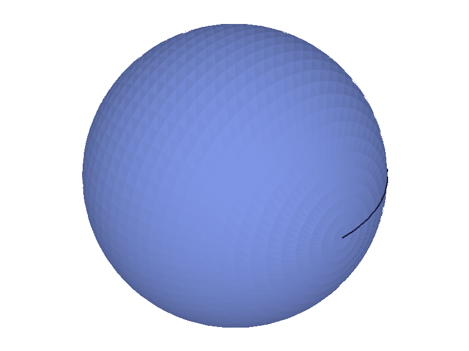
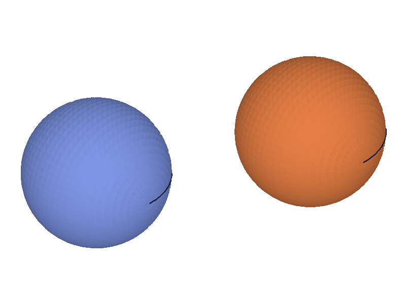
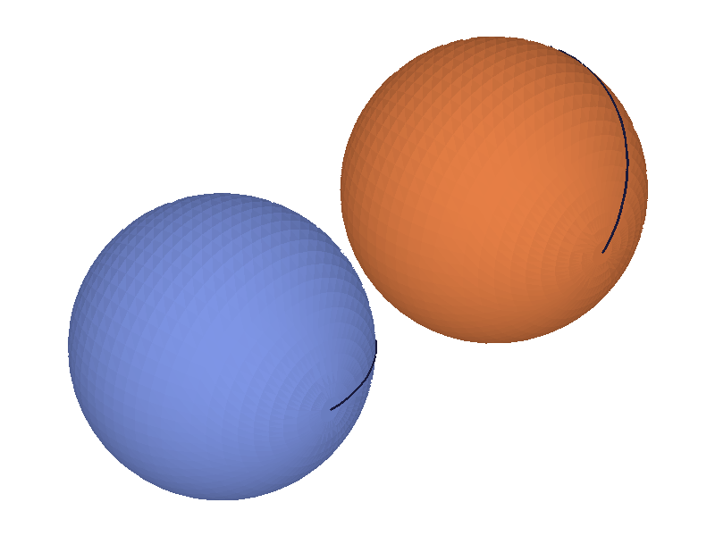
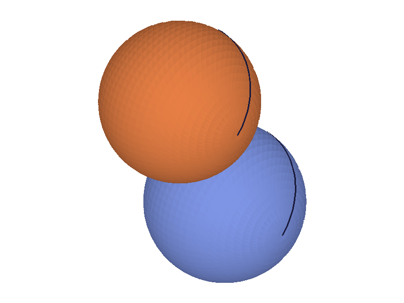
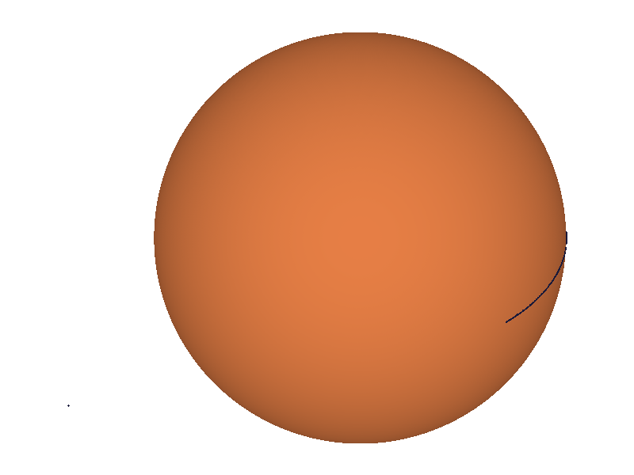
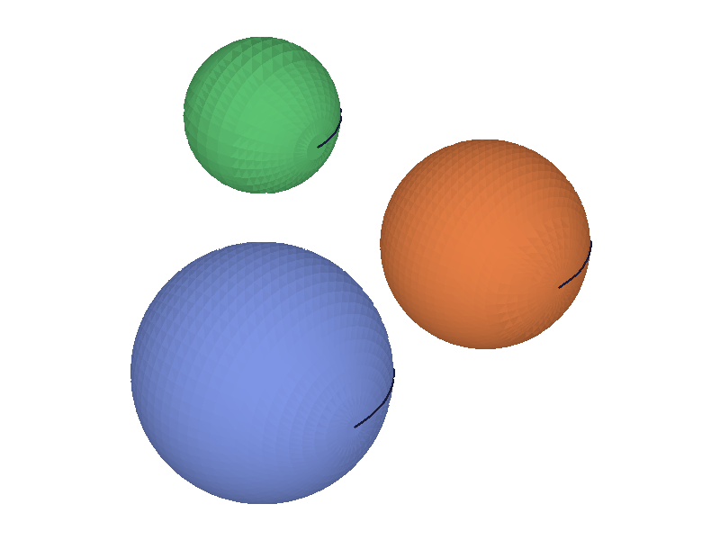
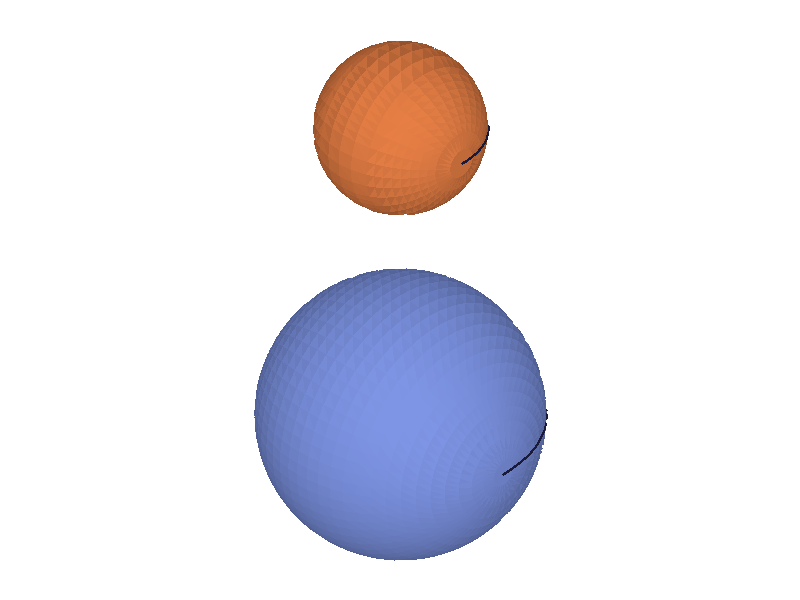
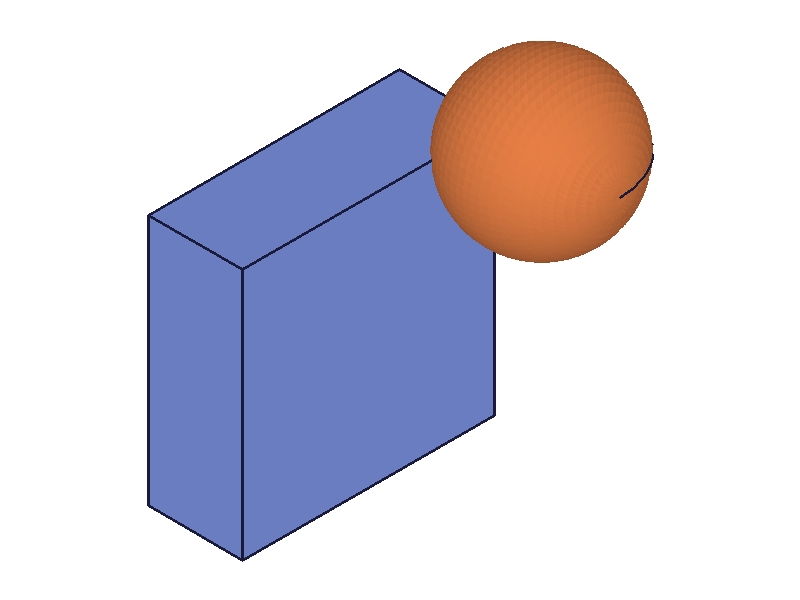

# Training: solid.sphere

**Date:** 2026-04-13

## Goal

Testing `v1.solid.sphere` — creating sphere primitives within entity injection features.

**Methods to cover:**

- `sphere` — basic creation with `radius`
- `sphere` params: id, radius, translation, rotation, rotateFirst

**Questions:**

- What does the return value look like? (integer ID like box?)
- Does radius=0 work? Negative radius?
- How does the sphere orient? Is it centered at origin or corner-aligned?
- Do rotation/translation/rotateFirst behave identically to box?
- What vertex/face count does a default sphere produce?

---

## 01 — basic sphere

Script: `scripts/01-basic.mjs` — ✅ Creates a sphere with radius=50. Returns integer solid ID (60), maxLevel=31, messages=[].

|  |
|---|

**Data:** result=60 (integer ID), maxLevel=31. Same return pattern as `solid.box`.

**📌 LLM doc:** Sphere is centered at origin (unlike box which is corner-aligned). Return value is integer solid ID.

## 02 — translation

Script: `scripts/02-translation.mjs` — ✅ Two spheres: one at origin (r=30), one translated [80, 0, 40] (r=30).

|  |
|---|

**Data:** Both succeed with maxLevel=31. IDs: 60, 63. Translation works as expected — per-body coloring confirms two distinct solids.

## 03 — rotation

Script: `scripts/03-rotation.mjs` — ✅ Two spheres: unrotated at origin, rotated 45° around Z with translation [100, 0, 0].

|  |
|---|

**Data:** Both succeed. Rotation is accepted but visually meaningless for a perfect sphere (the center doesn't move from rotation alone). The translation separates them.

## 04 — rotateFirst

Script: `scripts/04-rotateFirst.mjs` — ✅ Two spheres, both with rotation=[0, 0, π/4] and translation=[80, 0, 0], one with rotateFirst=true, one with rotateFirst=false.

|  |
|---|

**Data:** Both succeed. They end up at different positions because rotateFirst controls whether the translation happens before or after rotation. With `rotateFirst=true`: sphere center rotates (no-op for sphere symmetry), then translates to [80, 0, 0]. With `rotateFirst=false`: sphere translates to [80, 0, 0], then rotates 45° around origin — center orbits to ~[56.6, 56.6, 0]. This matches the box behavior exactly.

**📌 LLM doc:** rotateFirst affects the center position when both rotation and translation are provided, even though the sphere's shape is rotationally symmetric.

## 05 — radius=0 (edge case)

Script: `scripts/05-edge-zero-radius.mjs` — ❌ **Timeout (30s).** The server hung when given `radius: 0`.

**📌 LLM doc:** radius=0 hangs the server. Never pass radius ≤ 0.

## 06 — negative radius (edge case)

Script: `scripts/06-edge-negative-radius.mjs` — ❌ **Timeout (30s).** The server hung when given `radius: -30`.

**📌 LLM doc:** Negative radius hangs the server. Never pass radius ≤ 0. This is worse than box (which silently accepts negative dimensions).

## 07 — missing radius

Script: `scripts/07-missing-radius.mjs` — ✅ Returns null, maxLevel=51, clear error: `"The parameter \"radius\" must be provided in the api call!"` (code 1004).

## 07b — wrong ID type

Script: `scripts/07b-wrong-id-type.mjs` — ✅ Returns null, maxLevel=51, error: `"The parameter \"id\" has a wrong id type! Provide only following id types: [\"entityinjection\"]"` (code 1001). Same as box.

## 08 — very small and very large radii

Script: `scripts/08-very-small-large.mjs` — ✅ Both radius=0.001 and radius=10000 succeed (maxLevel=31). Extremes are fine as long as > 0.

|  |
|---|

## 09 — multiple spheres and deleteSolid

Script: `scripts/09-multiple-spheres.mjs` — ✅ Three spheres created (IDs: 60, 63, 66). `deleteSolid` on s2 returns null (VOID), maxLevel=31.

|  |  |
|---|---|

**Data:** After deletion, only two spheres remain (different sizes confirm correct one was removed).

## 10 — sphere with box (mixed primitives)

Script: `scripts/10-sphere-with-box.mjs` — ✅ Box (80×80×30) and sphere (r=25, translated to [40, 40, 30]) coexist in same EIF.

|  |
|---|

**Data:** box ID=61, sphere ID=63. Mixed primitives work cleanly.

## 11 — graphic data structure

Script: `scripts/11-graphic-data.mjs` — ✅ graphic.containers has 1 container with keys: id, owner, type, properties, meshes, edges, vertices. Structure has: root, currentProduct, currentInstance, testRoot, tree.

## 12 — mesh detail

Script: `scripts/12-mesh-detail.mjs` — ✅ Detailed tessellation data for a radius=40 sphere.

**Data:** 1 mesh with 2017 vertices and 3776 triangles. 1 edge (the seam line visible in renders). 2 topological vertices (poles). Container type=1.

**📌 LLM doc:** Default sphere tessellation produces ~2000 vertices / ~3800 triangles. Has 1 topological edge (seam) and 2 topological vertices (poles). Much denser mesh than a box.
