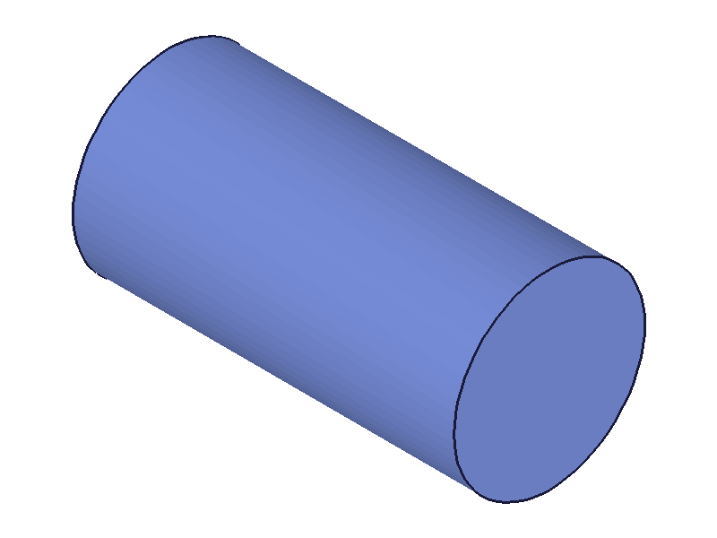
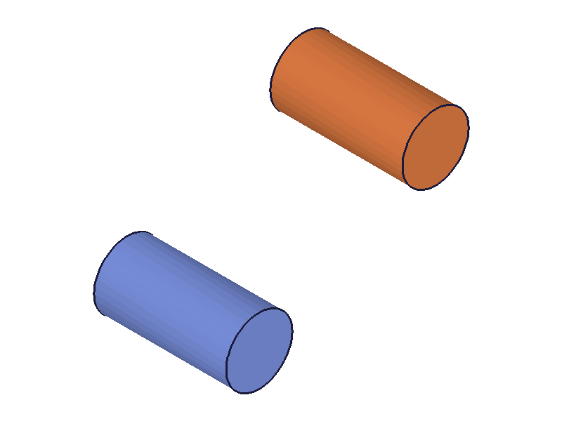
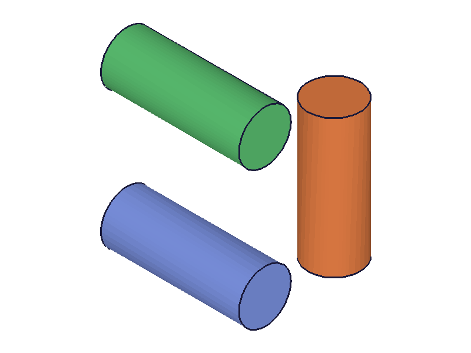
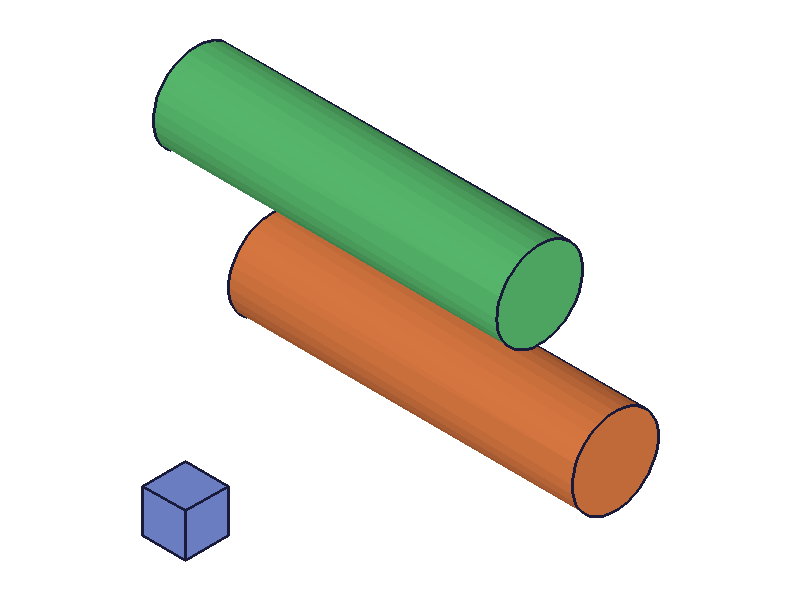
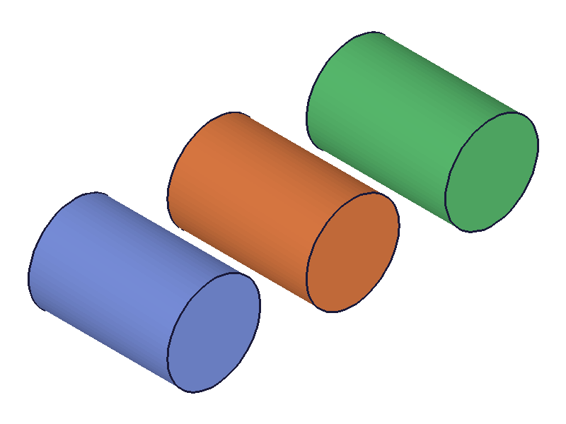
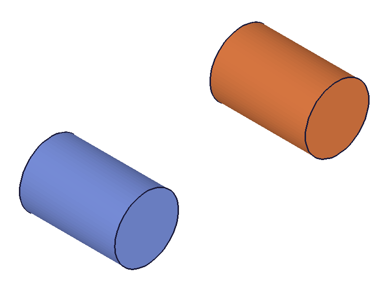
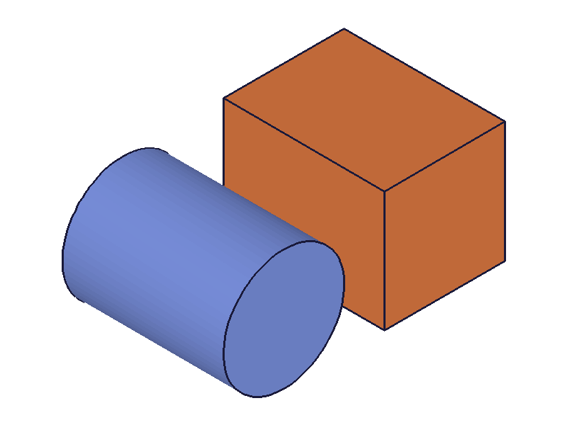

# Training: solid.cylinder

**Date:** 2026-04-13

## Goal

Testing `v1.solid.cylinder` — creating cylinder primitives inside an entity injection feature.

**Methods to cover:**

- `cylinder` — required params: `id`, `height`, `diameter`
- `cylinder` optional params: `translation`, `rotation`, `rotateFirst`
- Edge cases: zero/negative height, zero/negative diameter, missing params

**Questions:**

- Does cylinder behave like box for degenerate dimensions (zero/negative)?
- Is the cylinder centered on its axis or corner-aligned?
- How does rotation interact with translation (rotateFirst flag)?
- Can multiple cylinders coexist in one EIF?
- What does the return value look like?

---

## 01 — basic cylinder

Script: `scripts/01-basic.mjs` — ✅ basic creation works. Returns integer solid ID (61), maxLevel=31, messages=[].

|  |
|---|

**Data:** result=61, maxLevel=31, messages=[] (see `files/01-basic-response.json`). Uses `diameter` not `radius` — docs are accurate.

## 02 — translation

Script: `scripts/02-translation.mjs` — ✅ translation works as expected. Two identical cylinders, one offset by [80, 40, 0].

|  |
|---|

**Data:** cyl1=61 (origin), cyl2=64 (translated). Both created successfully.

## 03 — rotation

Script: `scripts/03-rotation.mjs` — ✅ rotation works. Three cylinders: upright, rotated 90° around X (lies along Y), rotated 45° around Z.

|  |
|---|

**Data:** cyl1=61 (blue, upright), cyl2=64 (orange, lies along Y after 90° X rotation + translation), cyl3=67 (green, tilted 45° around Z). Rotation is in radians, as documented.

## 04 — rotateFirst flag

Script: `scripts/04-rotateFirst.mjs` — ✅ rotateFirst produces visibly different results. Both cylinders use same rotation [0,0,π/4] and translation [60,0,0].

|  |
|---|

**Data:** cyl1=64 (green, rotateFirst=true — rotate then translate, ends up at [60,0,0] tilted), cyl2=67 (orange, rotateFirst=false — translate first then rotate around origin, ends up orbiting further from origin). Small blue cube at origin for reference. Behavior matches `solid.box` findings.

## 05 — degenerate dimensions (zero/negative)

Script: `scripts/05-degenerate.mjs` — ⚠️ all degenerate cases silently succeed with maxLevel=31, no warnings.

**Data:**
- Zero height: result=61, maxLevel=31 — creates degenerate flat disk
- Zero diameter: result=64, maxLevel=31 — creates degenerate line/point
- Negative height: result=67, maxLevel=31 — creates internal geometry
- Negative diameter: result=70, maxLevel=31 — creates internal geometry

All four produce an ID and maxLevel=31. Same behavior as `solid.box` with zero/negative dimensions. **Always validate dimensions > 0 before calling.**

📌 LLM doc: Document degenerate dimension behavior — silent no-op/degenerate geometry, no error.

## 06 — missing/wrong parameters

Script: `scripts/06-missing-params.mjs` — ✅ clear error messages for all missing/wrong params.

**Data (from `files/06-missing-params-error-responses.json`):**
- Missing `height`: result=null, maxLevel=51, msg=`"The parameter \"height\" must be provided in the api call!"`
- Missing `diameter`: result=null, maxLevel=51, msg=`"The parameter \"diameter\" must be provided in the api call!"`
- Missing `id`: result=null, maxLevel=51, msg=`"The parameter \"id\" must be provided in the api call!"`
- Wrong id type (part ID): result=null, maxLevel=51, msg=`"The parameter \"id\" has a wrong id type! Provide only following id types: [\"entityinjection\"]"`

Same error pattern as `solid.box`. Required params validated in order: id → height → diameter.

📌 LLM doc: Document error messages and validation order.

## 07 — multiple cylinders and deleteSolid

Script: `scripts/07-multiple-and-delete.mjs` — ✅ three cylinders coexist in one EIF. Deleting middle one works.

|  |  |
|---|---|

**Data:** cyl1=61, cyl2=64, cyl3=67. After `deleteSolid({ id: eifId, ids: [cyl2] })`: result=null, maxLevel=31. Middle cylinder removed successfully, other two remain.

## 08 — alignment (cylinder vs box)

Script: `scripts/08-alignment.mjs` — ✅ cylinder is **axis-centered** in XY, extends from 0 to height along Z.

|  |
|---|

**Data:** Cylinder (blue, diameter=60, height=80) placed at origin next to box (orange, 60×60×80, translated +80 in X). The cylinder's circular cross-section is centered at origin (x=0, y=0), while the box is corner-aligned. The cylinder extends from z=0 to z=80 (base at origin, top at height).

📌 LLM doc: Document axis-centered alignment — this differs from box which is corner-aligned.

---

## Coverage Checklist

- [x] The API has been called at least once successfully
- [x] Every required parameter tested (id, height, diameter)
- [x] Key optional parameters exercised (translation, rotation, rotateFirst)
- [x] No enum values for this API
- [x] No update/delete method specific to cylinder (deleteSolid tested)
- [x] Realistic usage combining with prerequisites (part.create + entityInjection)
- [x] Behavioral claims verified with data (filewrite dumps, log values)
