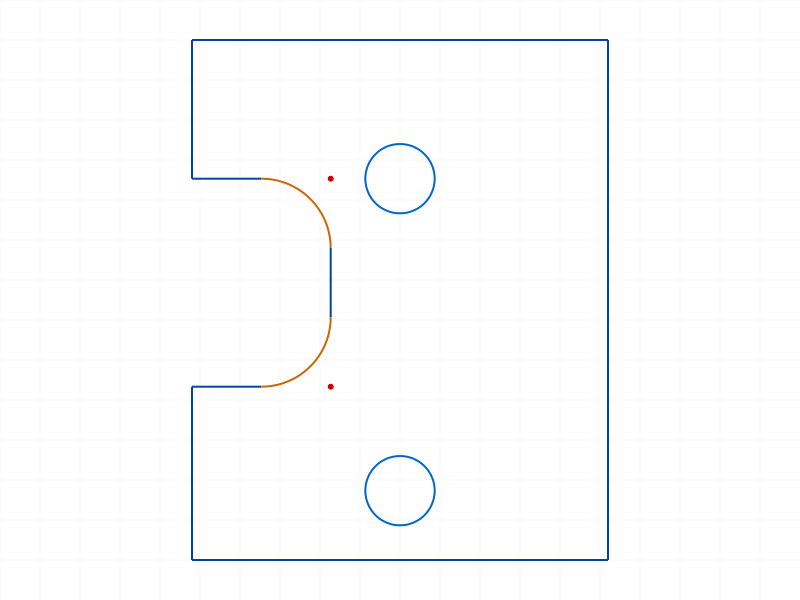
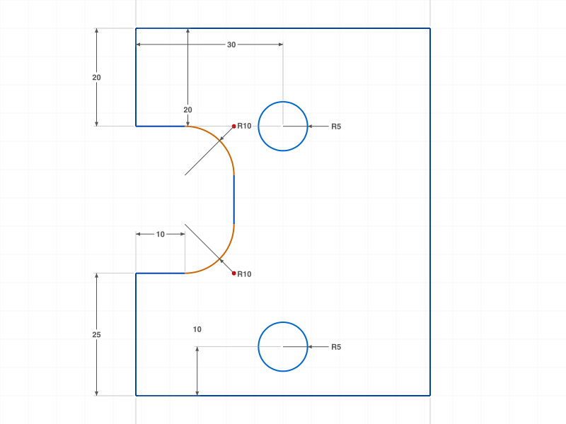

# Training: Bracket Plate from Technical Drawing

**Date:** 2026-04-13

## Goal

Recreate a bracket plate from a dimensioned technical drawing using the sketch API.

**Shape:** 60×75 rectangle with a U-shaped notch cut from the left side, two holes, and R10 fillets.

**Dimensions extracted from drawing:**
- Overall width: 60
- From top to upper hole center: 20 (vertical)
- From left to upper hole center: 30 (horizontal)
- Notch height: 30 (vertical, from upper hole level down to step)
- Bottom section height: 25 (from bottom to notch bottom)
- From bottom to lower hole center: 10 (vertical)
- R10 fillets on notch inner corners
- Total height: 20 + 30 + 25 = 75
- Notch depth: ~20 (estimated — not explicitly dimensioned)
- Hole radii: ~R5 (estimated — not explicitly dimensioned)

**Profile vertices (origin at bottom-left):**
(0,75) → (60,75) → (60,0) → (0,0) → (0,25) → (20,25) → (20,55) → (0,55) → (0,75)

**Holes:** (30,55) R5, (30,10) R5

---

## 01 — batch line creation (failed)

Script: `scripts/01-profile.mjs` — batch `sketch.line` with arrays of startPos/endPos returned null. Individual line creation works.

## 02 — individual line profile

Script: `scripts/02-profile-v2.mjs` — ✅ 8 lines created individually, R10 fillets on both notch corners, two R5 holes.

|  |
|---|

Shape matches the technical drawing: U-notch on left, two circles, rounded inner corners.

## 04 — debug getPoints API

Script: `scripts/04-debug-points.mjs` — discovered `getPoints` returns objects, not arrays:
- Lines: `{ startId, endId }`
- Circles: `{ centerId }`
- Sketch-level getPoints returns null

## 05 — full geometry + dimensions

Script: `scripts/05-full.mjs` — ✅ all geometry + 12 dimensional constraints.

|  |
|---|

**Dimensions applied (all maxLevel=31, success):**
- OFFSET on top edge (=60), bottom edge (=60), left-top section (=20), left-bottom section (=25), notch bottom edge (~10 after fillet trim)
- HORIZONTAL_DISTANCE: left edge to upper hole center (=30)
- VERTICAL_DISTANCE: top to upper hole (=20), bottom to lower hole (=10)
- RADIUS: both fillets (=R10), both holes (=R5)

**Findings:**
- Batch `sketch.line` with array-of-arrays doesn't work — use individual calls
- `sketch.getPoints` returns named objects (`{startId, endId}`, `{centerId}`), not arrays
- Fillet trims the adjacent lines, so OFFSET on a filleted line gives the trimmed length (not original)
- The notch depth (horizontal) was not dimensioned in the drawing — estimated at 20mm

