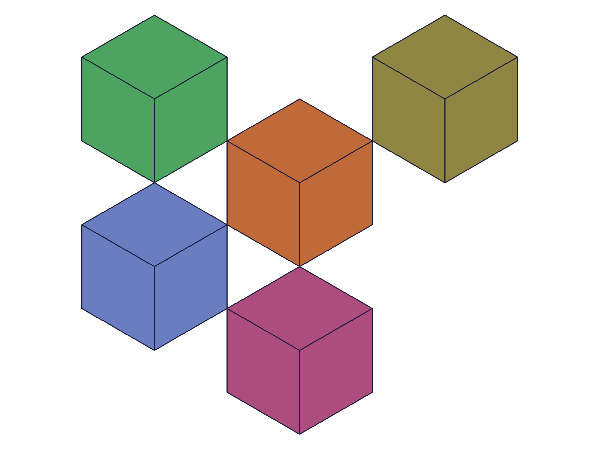
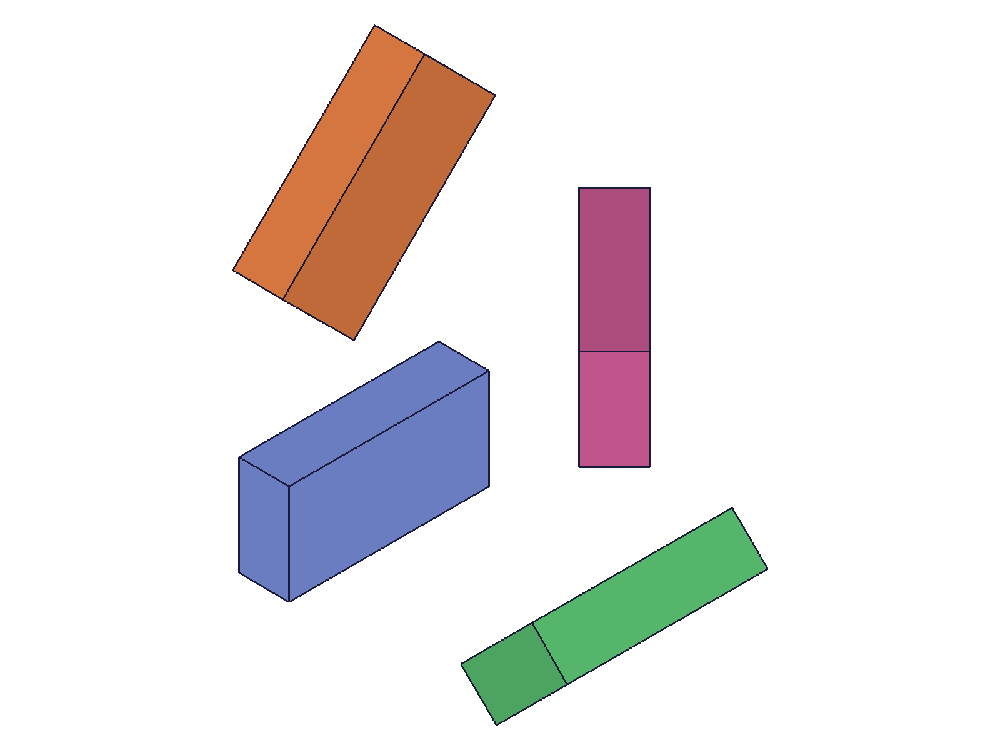
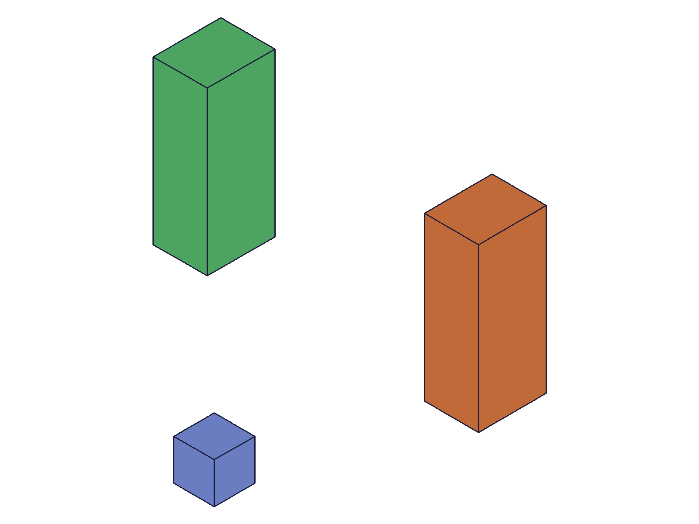
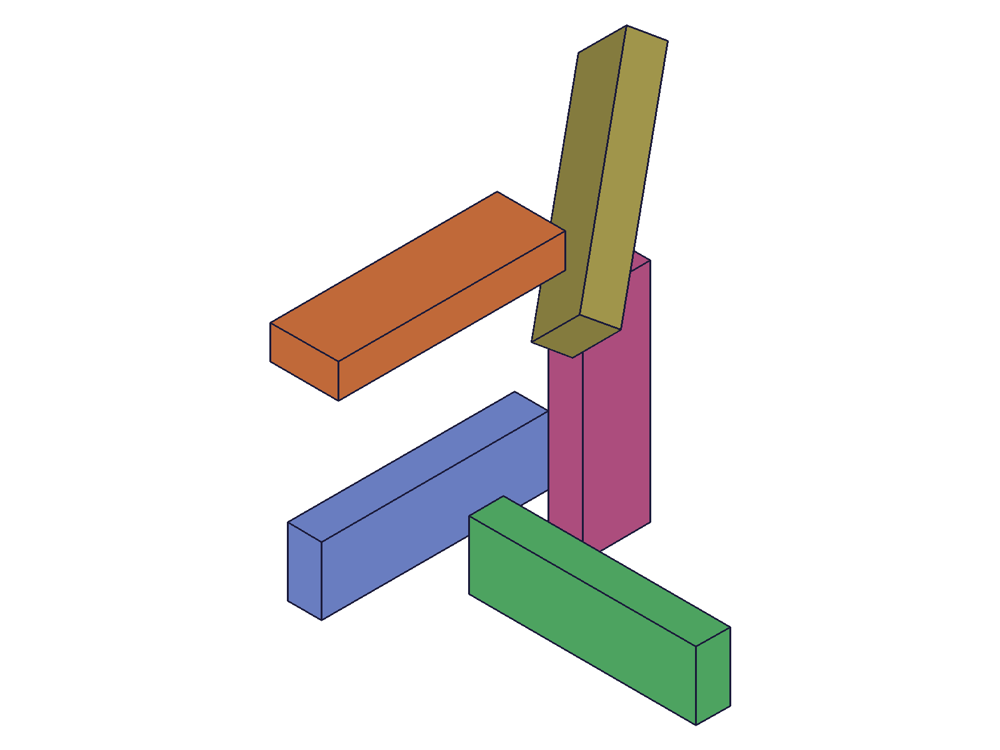
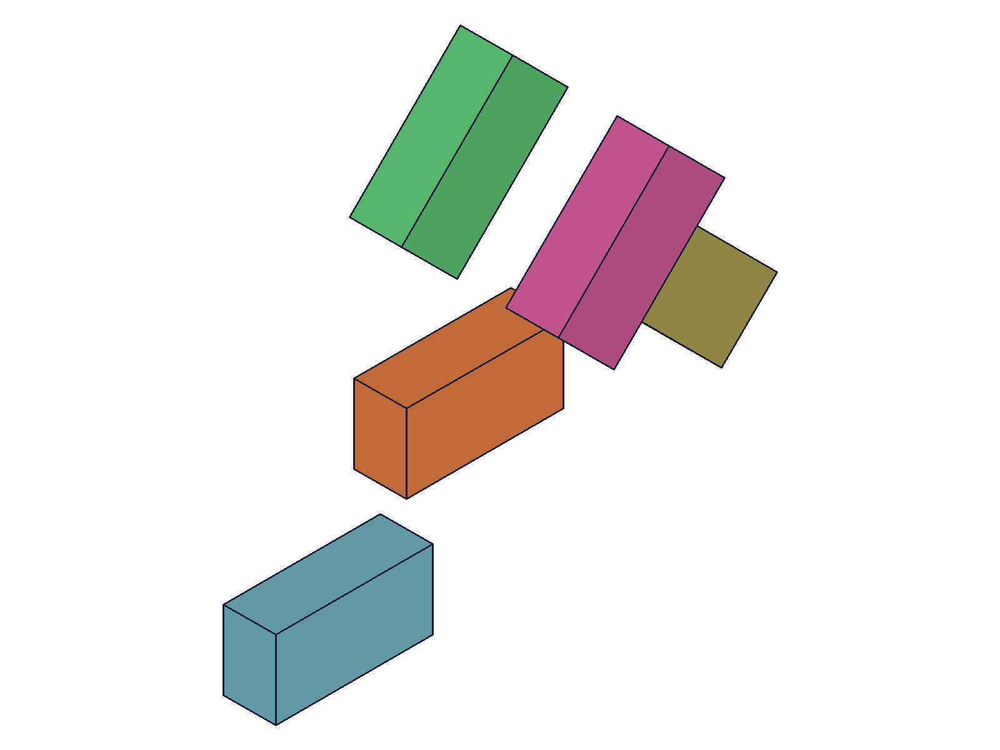
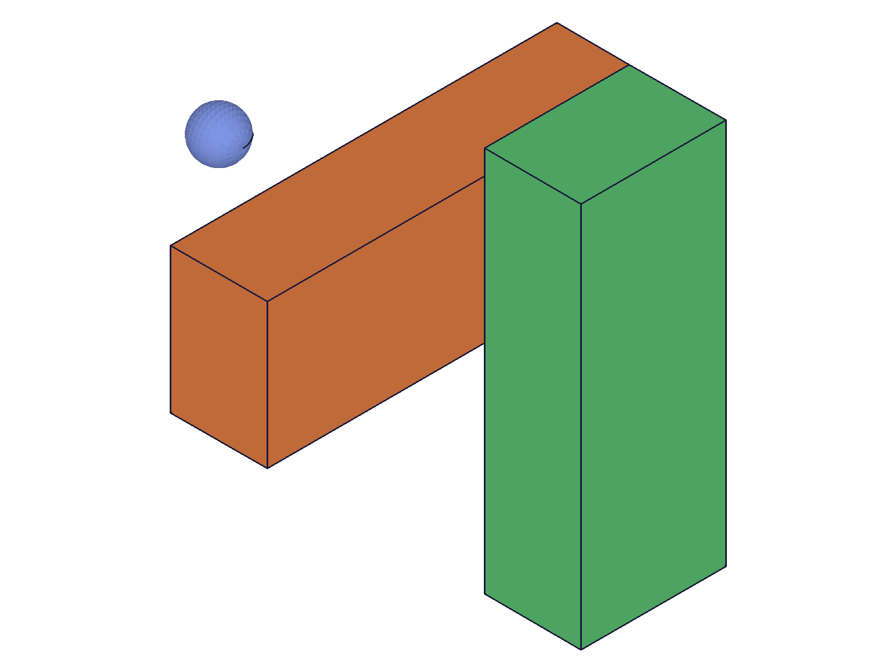

# Training: Common Solid Parameters — rotation, translation, rotateFirst

**Date:** 2026-04-13

## Goal

Study the common positioning parameters shared by all solid creation APIs: `rotation`, `translation`, and `rotateFirst`.

**Questions to answer:**

- How does `rotation` work? What's the rotation order (ZYX? XYZ?)?
- How does `translation` work? Is it always relative to origin?
- How does `rotateFirst` affect the result? What's the visual difference between `true` and `false`?
- Is the behavior consistent across all primitive types (box, sphere, cylinder, cone)?
- Does rotation happen around the solid's local center or around the world origin?
- What happens with extreme values (very large rotations, zero rotation with translation, etc.)?
- Does `rotateFirst` matter when only one of rotation/translation is provided?

---

## 01 — translation only

Script: `scripts/01-translation-only.mjs` — ✅ as documented. Translation offsets the solid from the origin along each axis.

|  |
|---|

5 boxes created: origin, +X, +Y, +Z, and +XYZ. All clearly separated. Translation is a simple world-space offset.

---

## 02 — rotation only

Script: `scripts/02-rotation-only.mjs` — ✅ rotation works as expected. Each axis rotation is visible.

|  |
|---|

4 boxes: unrotated reference (blue), 45° Z (orange, tilted in XY), 45° X (pink, tilted into view), 45° Y (green, angled). All used both rotation and translation to separate visually — with `rotateFirst=true` (default), rotation applies first then translation moves to position.

---

## 03 — rotateFirst=true (default)

Script: `scripts/03-rotateFirst-true.mjs` — ✅ explicit `rotateFirst: true` matches default behavior (no `rotateFirst` param).

Two boxes created with identical rotation [0,0,π/2] and translation [100,0,0] / [100,0,60]: one with explicit `rotateFirst: true`, one with no `rotateFirst` param. Both behave identically — default is `true`.

---

## 04 — rotateFirst comparison (true vs false)

Script: `scripts/04-rotateFirst-false.mjs` — ✅ clear visual difference between `rotateFirst=true` and `rotateFirst=false`.

|  |
|---|

Three bodies:
- **Blue cube** — small reference at origin
- **Green box** (rotateFirst=true) — rotated 90° Z at origin, then translated to [100,0,0]. Ends up at X=100, rotated.
- **Orange box** (rotateFirst=false) — translated to [100,0,0] first, then rotated 90° Z around origin. The translation vector [100,0,0] becomes [0,100,0] after rotation. The box orbits the origin.

**Learned:** `rotateFirst=true` = rotate in place then move. `rotateFirst=false` = move then orbit around origin. The false case is useful for placing objects on circular patterns around the origin.

**📌 LLM doc:** Document the mental model for rotateFirst: true = "rotate then place", false = "place then orbit".

---

## 05 — rotation order

Script: `scripts/05-rotation-order.mjs` — ✅ rotation order confirmed: Z first, then Y, then X (intrinsic ZYX / extrinsic XYZ).

|  |
|---|

Tested individual 90° rotations around each axis plus a compound [π/4, π/4, 0]. The docs state "First the z-part of the rotation vector is performed, then the y-part and finally the x-part" — confirmed by visual inspection. The compound rotation matches ZYX order.

**📌 LLM doc:** Rotation order is ZYX (Z applied first, then Y, then X). This is intrinsic ZYX / extrinsic XYZ convention.

---

## 06 — cross-primitive consistency

Script: `scripts/06-cross-primitive.mjs` — ✅ all four primitive types (box, sphere, cylinder, cone) accept rotation/translation/rotateFirst identically.

All primitives created successfully with the same rotation [0,0,π/4] and translation [80,0,0]. No differences in parameter handling across primitive types.

---

## 07 — edge cases

Script: `scripts/07-edge-cases.mjs` — ✅ all edge cases accepted, maxLevel=31 for all.

|  |
|---|

- **Zero rotation [0,0,0]** — accepted, same as no rotation. maxLevel=31.
- **Zero translation [0,0,0]** — accepted, same as no translation. maxLevel=31.
- **>2π rotation (2π + π/4)** — accepted, wraps around. Visually identical to π/4 rotation. maxLevel=31.
- **Negative rotation (-π/4)** — accepted, rotates in opposite direction. maxLevel=31.
- **Negative translation [-50,-50,0]** — accepted, offsets into negative quadrant. maxLevel=31.

**Learned:** No validation on rotation/translation values. Any real number works. Angles wrap naturally (trig functions handle >2π). No warnings for unusual values.

**📌 LLM doc:** No validation on rotation/translation — any values accepted including negative, zero, and >2π.

---

## 08 — rotation center

Script: `scripts/08-rotation-center.mjs` — ✅ rotation is around the **world origin**, not the solid's local center.

|  |
|---|

A box with length=80 along +X, when rotated 90° around Z, has its length axis swing to +Y. The corner at (0,0,0) stays at the origin — the box pivots around the world origin. The blue sphere marks the origin for reference.

**Learned:** Rotation pivot is always the world origin (0,0,0). For primitives like box that are corner-aligned (not centered), this means the corner stays at origin during rotation, not the center. To rotate around a solid's own center, you'd need to: translate center to origin → rotate → translate back. Or use `rotateFirst=false` with appropriate translation.

**📌 LLM doc:** Rotation pivot is world origin. Box is corner-aligned so it rotates around its corner, not its center.

---

## Coverage checklist

- [x] How does rotation work? — Euler angles in radians, ZYX order
- [x] How does translation work? — World-space offset from origin
- [x] rotateFirst effect — true = rotate-then-translate, false = translate-then-rotate (orbit)
- [x] Cross-primitive consistency — confirmed identical across box, sphere, cylinder, cone
- [x] Rotation center — world origin, not solid center
- [x] Edge cases — zero, negative, >2π all accepted silently
- [x] rotateFirst with single transform — no effect (identity for the missing transform)
