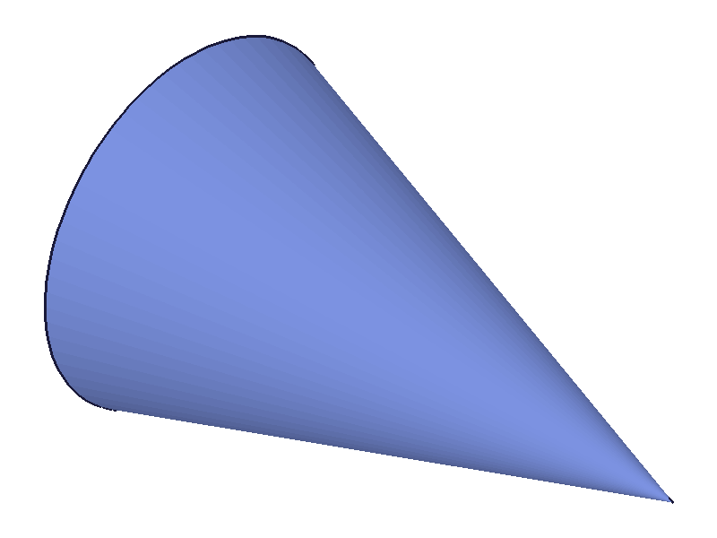
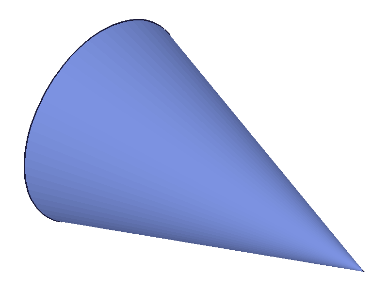
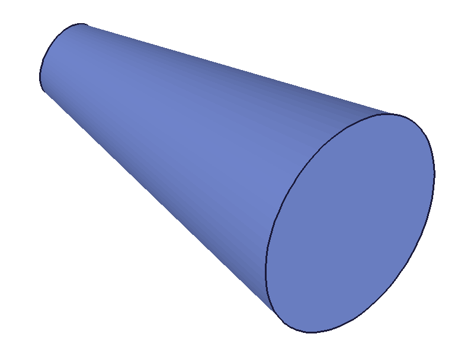
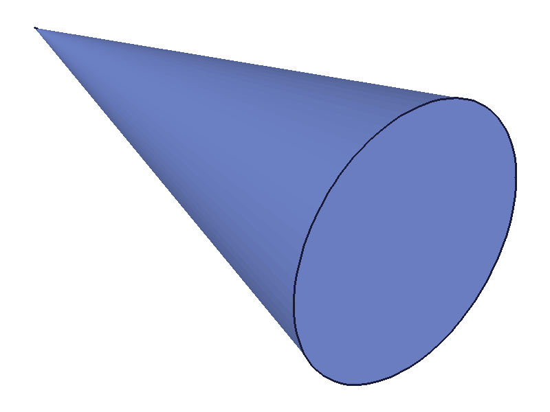
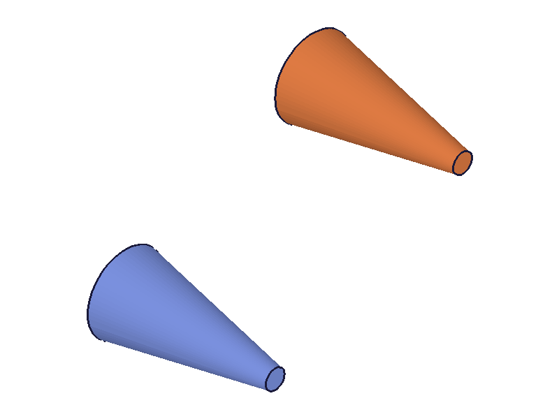
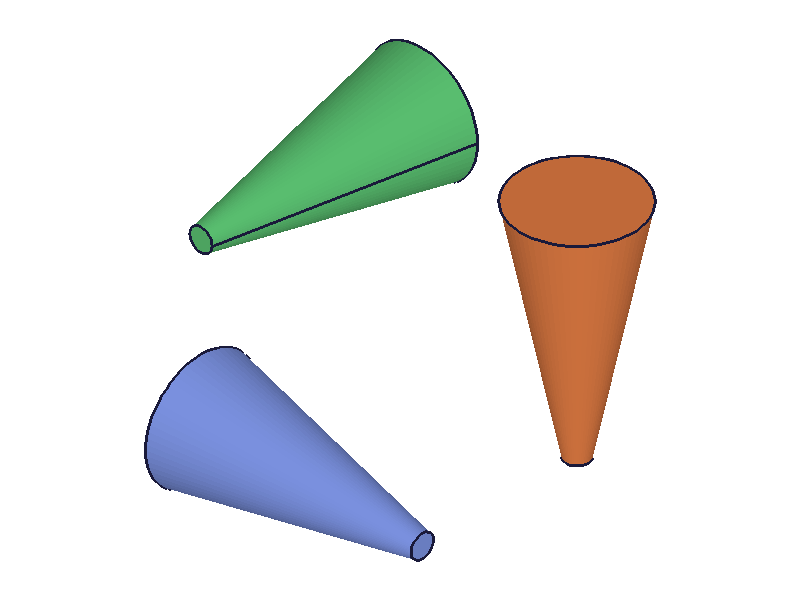
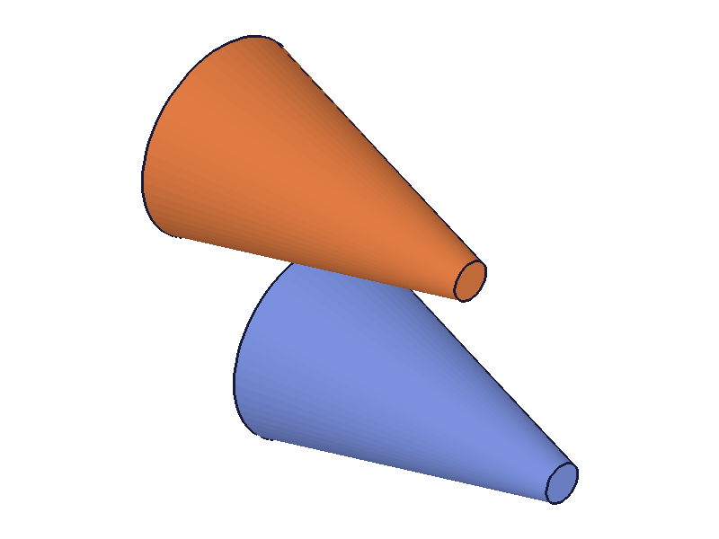
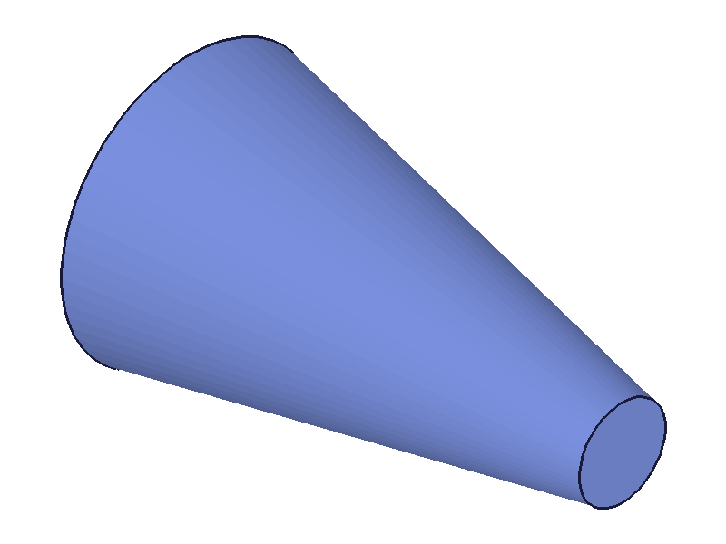
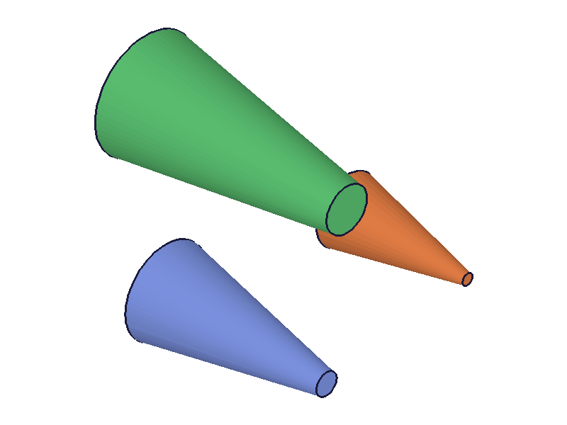
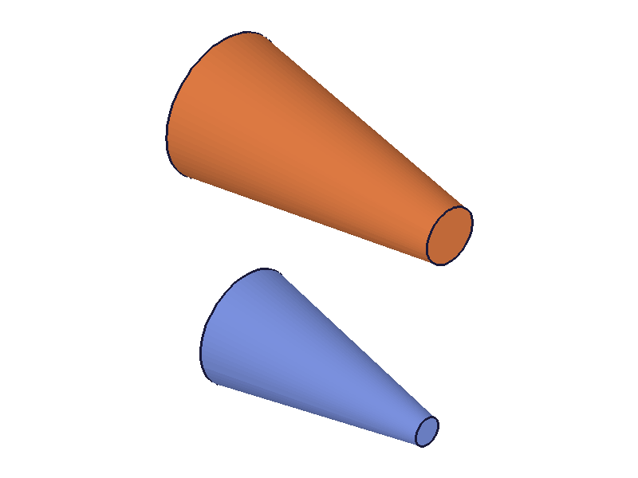

# Training: solid.cone

**Date:** 2026-04-13

## Goal

Testing `v1.solid.cone` — creates a cone/frustum primitive within an entity injection feature.

**Methods to cover:**

- `cone` — required params: `id`, `height`, `bDiameter`, `tDiameter`
- `cone` — optional params: `rotation`, `translation`, `rotateFirst`
- Cone vs frustum: `tDiameter=0` (or near-zero) for a true cone, `tDiameter>0` for a frustum
- Edge cases: zero/negative dimensions, degenerate inputs, missing params

**Questions:**

- What's the alignment? Centered in XY like cylinder, or corner-aligned like box?
- Does `tDiameter=0` work for a true pointed cone, or must it be > 0?
- What happens with `bDiameter=0`? Inverted cone?
- What about equal diameters (`bDiameter == tDiameter`)? Does it create a cylinder-like shape?
- How does `rotateFirst` interact with rotation + translation?
- What are the exact error messages for missing params?
- Validation order for required params?

---

## 01 — basic cone (frustum)

Script: `scripts/01-basic.mjs` — ✅ Creates a frustum with height=100, bDiameter=60, tDiameter=20. Returns solid ID 61, maxLevel=31, messages=[].

|  |
|---|

## 02 — true pointed cone (tDiameter=0)

Script: `scripts/02-true-cone.mjs` — ✅ Both `tDiameter=0.1` (docs example) and `tDiameter=0` (true point) succeed. Both return valid IDs, maxLevel=31, no errors.

|  |  |
|---|---|

**Learned:** The docs use `tDiameter: 0.1` in examples, suggesting 0 might not work — but `tDiameter: 0` is perfectly valid. A true pointed cone is fine.

**📌 LLM doc:** `tDiameter: 0` works for a true pointed cone. The docs example's `0.1` is not a requirement.

## 03 — equal diameters (cylinder-like)

Script: `scripts/03-equal-diameters.mjs` — ✅ `bDiameter=50, tDiameter=50` creates a cylinder-like solid. Returns ID 61, maxLevel=31.

|  |
|---|

**Learned:** Equal diameters produce a cylinder. Not an error.

## 04 — inverted cone and bDiameter=0

Script: `scripts/04-inverted.mjs` — ✅ Both inverted frustum (`bDiameter=20, tDiameter=60`) and inverted point (`bDiameter=0, tDiameter=60`) succeed. maxLevel=31, no errors.

|  |  |
|---|---|

**Learned:** `bDiameter` and `tDiameter` are fully symmetric — either can be 0 or larger than the other.

**📌 LLM doc:** Inverted cones work. `bDiameter=0` creates an inverted point cone.

## 05 — degenerate dimensions

Script: `scripts/05-degenerate.mjs` — All degenerate inputs accepted silently (maxLevel=31, no errors):
- `height=0`: creates degenerate flat disk
- `height=-50`: accepted, creates geometry
- `bDiameter=-60`: accepted silently
- `bDiameter=0, tDiameter=0`: both zero, accepted

**Data:** See `files/05-degenerate-degenerate-results.json`. All four return valid solid IDs with maxLevel=31.

**📌 LLM doc:** Same pattern as box/cylinder — zero and negative dimensions are accepted silently. Always validate > 0 before calling.

## 06 — missing required params & validation order

Script: `scripts/06-missing-params.mjs` — Tests validation behavior:
- Missing height: `"The parameter \"height\" must be provided"` (level 51)
- Missing bDiameter: `"The parameter \"bDiameter\" must be provided"` (level 51)
- Missing tDiameter: `"The parameter \"tDiameter\" must be provided"` (level 51)
- Missing all three: reports `"bDiameter"` first
- Wrong ID type: `"The parameter \"id\" has a wrong id type!"` (level 51)

**Data:** See `files/06-missing-params-missing-params.json`.

**Learned:** Validation order is `id → bDiameter → height → tDiameter`. When all three dimensions are missing, bDiameter is reported first (not height). This differs from cylinder (height → diameter) and box (length → width → height).

**📌 LLM doc:** Validation order: id → bDiameter → height → tDiameter.

## 07 — translation

Script: `scripts/07-translation.mjs` — ✅ Translation works as expected. Reference cone at origin + translated cone at [100, 50, 0].

|  |
|---|

## 08 — rotation

Script: `scripts/08-rotation.mjs` — ✅ Rotation works. Three cones: upright reference, 90° around X (lies along Y), -90° around Y (lies along X).

|  |
|---|

## 09 — rotateFirst flag

Script: `scripts/09-rotateFirst.mjs` — ✅ Two cones with identical rotation (45° around Z) and translation ([100,0,0]):
- `rotateFirst=true` (default): rotates around origin first, then translates — cone is offset and tilted
- `rotateFirst=false`: translates first, then rotates — cone orbits the origin

|  |
|---|

**Learned:** Same `rotateFirst` semantics as box/cylinder. Default true = rotate-then-translate.

## 10 — alignment verification (data)

Script: `scripts/10-alignment.mjs` — Dumped graphic data to verify positioning.

**Data:** Bounding box from mesh vertices (height=100, bDiameter=60, tDiameter=20):
- X: [-30.0, 30.0] (bRadius = 30)
- Y: [-30.0, 30.0] (bRadius = 30)
- Z: [-50.0, 50.0] (height/2 = 50)

|  |
|---|

**Learned:** The cone is **fully centered at origin** — centered in XY (like cylinder) AND centered in Z (unlike cylinder which goes z=0 to z=height, and unlike box which is corner-aligned). The cone extends from z=-height/2 to z=+height/2. This is a significant difference from the other primitives.

**📌 LLM doc:** Cone is centered at origin in all three axes. Z range is [-height/2, +height/2]. This differs from cylinder (z=0 to z=height) and box (corner at origin).

## 11 — multiple cones + deleteSolid

Script: `scripts/11-multiple-delete.mjs` — ✅ Three cones in one EIF, each gets unique ID (61, 64, 67). `deleteSolid` with specific IDs removes one, without IDs clears all. Returns null (VOID), maxLevel=31.

|  |  |
|---|---|

---

## Coverage Summary

- [x] Basic happy path (01)
- [x] Every required param tested (01-06)
- [x] Optional params: translation (07), rotation (08), rotateFirst (09)
- [x] tDiameter=0 (true point cone) — works (02)
- [x] bDiameter=0 (inverted point cone) — works (04)
- [x] Equal diameters (cylinder-like) — works (03)
- [x] Inverted frustum — works (04)
- [x] Degenerate: zero/negative dimensions — all silent (05)
- [x] Missing params + validation order (06)
- [x] Alignment verified numerically (10)
- [x] Multiple cones + deleteSolid (11)
- [x] Behavioral claims verified with filewrite data

