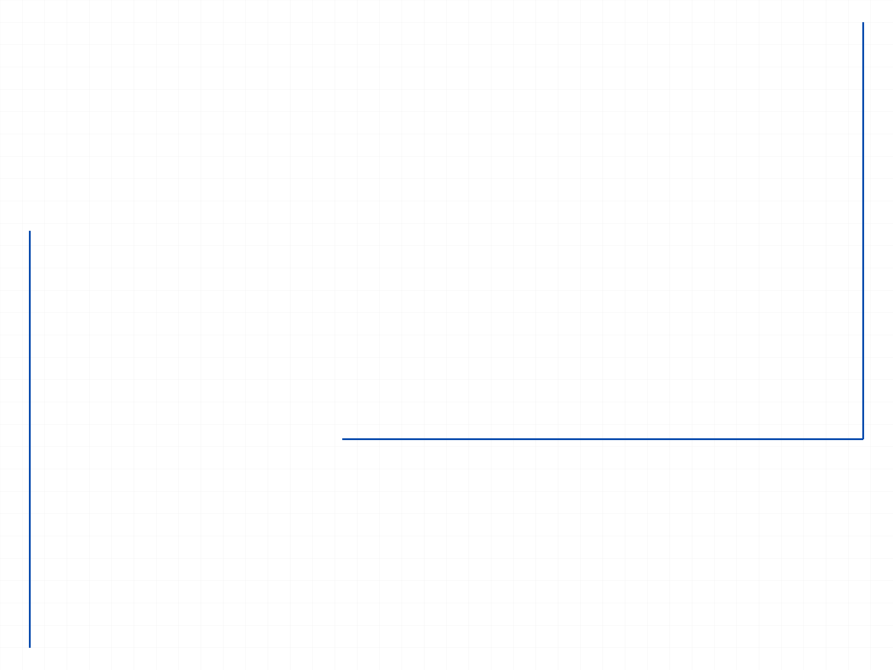
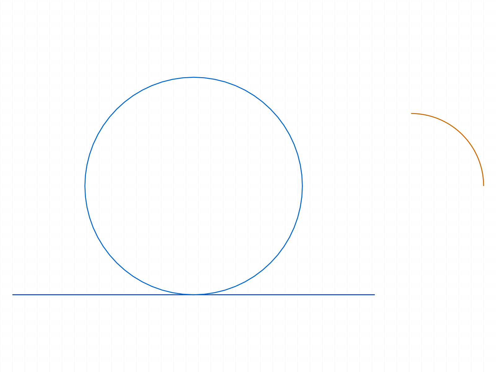
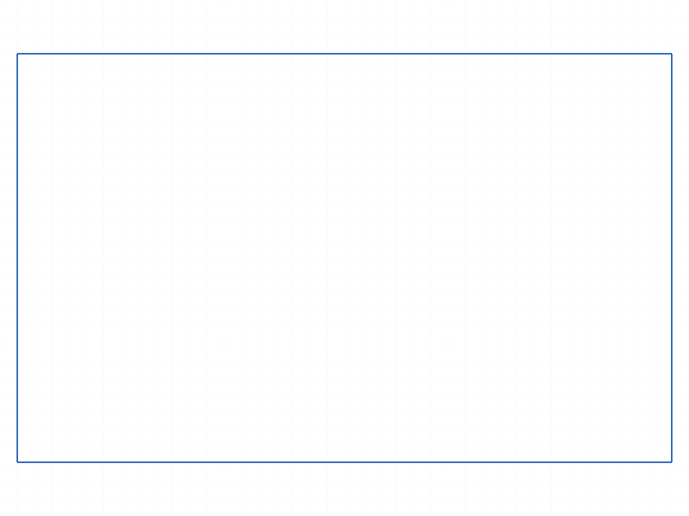
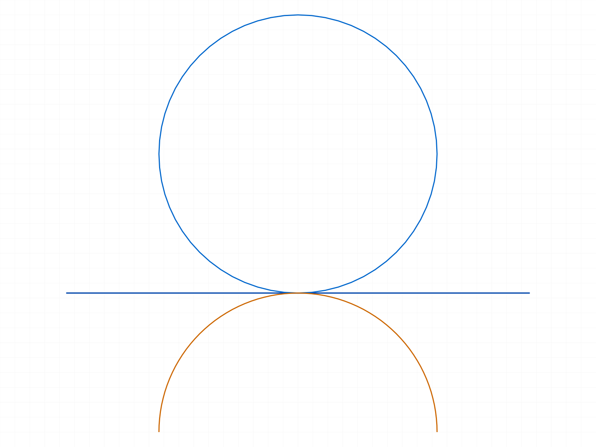

# Training: sketch.generateAutoConstraints

**Date:** 2026-04-14

## Goal

Testing `v1.sketch.generateAutoConstraints` — automatic constraint generation for sketch geometry.

**Methods to cover:**

- `generateAutoConstraints` — basic call with sketch ID as geomId
- `generateAutoConstraints` — with individual geometry ID as geomId
- `genFixation` flag — toggle fixation constraint generation
- `genIncidence` flag — toggle coincidence constraint generation
- `genTangency` flag — toggle tangency constraint generation
- `genVertAndHoriz` flag — toggle vertical/horizontal constraint generation
- Behavior with different geometry types (lines, circles, arcs, rectangles)
- What constraints are actually generated? (inspect structure tree)

**Questions:**

- Does passing the sketch ID vs a geometry ID produce different results?
- What does VOID return value mean — how do we know which constraints were created?
- Which flags actually produce visible changes for common geometry?
- Does it interact with existing manual constraints?
- Does calling it multiple times produce duplicates?

---

## 01 — basic call with sketch ID as geomId

Script: `scripts/01-basic-sketch-id.mjs` — **ERROR.** Passing sketch ID as `geomId` fails: `"The parameter \"geomId\" has a wrong id type! Provide only following id types: [\"sketch-curve\",\"sketch-point\"]"` (maxLevel=51).

**Learned:** Despite the docs saying `geomId` can be "the sketch id itself to autoconstraint each of sketch's objects," the API rejects sketch IDs. Only sketch-curve and sketch-point IDs are accepted.

**Also noted:** A `sketch.rectangle` auto-creates 9 constraints at creation time (4 coincidents, 1 fixation, 1 parallel, 2 perpendicular, 1 horizontal).

**📌 LLM doc:** geomId must be sketch-curve or sketch-point. Sketch ID is rejected despite docs.

## 02 — individual geometry IDs

Script: `scripts/02-geom-id.mjs` — ✅ succeeds (maxLevel=31) but adds 0 new constraints.

Lines at near-H/V angles (0.5° and 0.3° off axis) got no new constraints from autoGen. Existing 5 constraints (2 fixations, 2 coincidences, 1 coincidence) were all from line creation.

**Learned:** Line creation already auto-generates constraints. AutoGen on already-constrained geometry is a no-op (respects "doesn't add up redundancy").

## 03 — different line orientations

Script: `scripts/03-flags-off-then-on.mjs` — ✅ succeeds, 0 new constraints.

Three lines (diagonal, exactly horizontal, exactly vertical) at isolated positions. Only 2 constraints existed before autoGen (Auto_H for the horizontal line, Auto_V for the vertical line). AutoGen added nothing because the constraints were already detected at creation time.

## 04 — regen after delete (failed)

Script: `scripts/04-regen-after-delete.mjs` — deleteObject on Auto_Fix and Auto_H returned maxLevel=51. Constraints could not be deleted, so the regen test was moot.

**Learned:** Auto-generated constraints may not be deletable via `sketch.deleteObject`.

## 05 — point ID as geomId

Script: `scripts/05-point-id.mjs` — ✅ both standalone `sketch.point` IDs and line endpoint IDs (from `getPoints`) are accepted. maxLevel=31, no errors. No new constraints generated (no nearby geometry to detect).

## 06 — coincident detection after move

Script: `scripts/06-coincident-detection.mjs` — moveGeometry failed (maxLevel=51) due to solver constraints. Could not test the "move then autoGen" workflow.

|  |
|---|

**Learned:** With planeId set, moveGeometry is constraint-aware and rejects conflicting moves. Can't use move-then-autoGen pattern with an active solver.

## 07–08 — circle and arc creation issues

Scripts: `scripts/07-tangency-detection.mjs`, `scripts/08-circle-error.mjs` — Circle/arc with wrong param name (`center` instead of `centerPos`) returned null IDs. Passing null to autoGen produced `"geomId = VOID is not allowed"` error.

**Learned:** Circle/arc creation uses `centerPos`, not `center`. When creation fails silently (null result), passing null to autoGen produces a confusing "VOID" error.

**📌 LLM doc:** If circle/arc creation returns null, don't pass it to autoGen — you'll get a misleading VOID error.

## 09 — ID type inspection

Script: `scripts/09-id-types.mjs` — `circle()` and `arcByCenter()` both returned null due to wrong param name. Confirmed `line()` returns numeric ID (CC_Line class), `point()` returns numeric ID.

## 11 — circle and arc with correct params

Script: `scripts/11-circle-arc-autogen.mjs` — ✅ With `centerPos`, circle and arc creation succeed. AutoGen on both returns maxLevel=31 (accepted) but adds 0 constraints.

|  |
|---|

**Learned:** Circle and arc IDs are accepted by autoGen. Tangency between circle and line (geometrically tangent) is NOT detected.

## 12 — manual rectangle (4 lines)

Script: `scripts/12-manual-rectangle.mjs` — 10 auto-constraints from line creation (4 coincidents, 2 fixations, 2 horizontal, 2 vertical). AutoGen on each line adds nothing.

|  |
|---|

## 13 — flags test and point-on-line detection (BREAKTHROUGH)

Script: `scripts/13-flags-test.mjs` — **Point created BEFORE line, autoGen detects the coincidence.**

- Point at (25, 0, 0), then line from (0,0,0) to (50,0,0).
- 2 constraints from creation (Auto_Fix, Auto_H for the line). No coincidence.
- AutoGen on the point → **adds 1 new constraint: CC_2DCoincidentConstraint (Auto_Coinc).**
- All flag combinations (genFixation=false, genIncidence=false, etc.) accepted without error.

**📌 LLM doc:** Key use case — autoGen detects spatial relationships that weren't detected at creation time due to creation order. Point-on-curve coincidence is the primary example.

## 15 — creation order confirmed

Script: `scripts/15-order-matters.mjs` — Definitive test:
- **Case A (point first, line second):** 2 constraints, NO coincidence. After autoGen: 3 constraints, YES coincidence.
- **Case B (line first, point second):** 6 constraints including coincidence from point creation.
- **Case C:** `genIncidence=false` → no new constraint. `genIncidence=true` → adds 1.

**📌 LLM doc:** genIncidence flag confirmed working. Controls whether coincidence constraints are generated.

## 16 — genFixation and genVertAndHoriz flags

Script: `scripts/16-genFixation-genVH.mjs` — Both flags accepted but no new constraints generated (fixation and H/V already detected at creation time).

**Learned:** These flags are hard to test in isolation because their effects overlap with creation-time auto-detection. They would matter for geometry loaded via `loadFrom` or similar non-standard creation paths.

## 17 — duplicate safety and return value

Script: `scripts/17-duplicate-and-return.mjs` — ✅ No duplicates after 3 consecutive calls. Return value is always null (VOID).

**📌 LLM doc:** Safe to call multiple times — never adds duplicates. Return is always null.

## 18 — tangency detection

Script: `scripts/18-genTangency.mjs` — Circle tangent to line (geometrically exact): **NO tangency constraint detected.** AutoGen on arc with nearby geometry added 3 new constraints (2 coincidences + 1 horizontal), but no tangency.

|  |
|---|

**📌 LLM doc:** Tangency detection via autoGen not observed. genTangency flag accepted but produced no tangent constraints in testing.

---

## Summary of Answers

1. **Sketch ID vs geometry ID:** Sketch ID is rejected (error). Only sketch-curve and sketch-point IDs work.
2. **VOID return:** Always null. New constraints detected via structure tree diff (count constraint nodes before/after).
3. **Which flags matter:** `genIncidence` is the only flag with confirmed effect. Others accepted but no testable difference.
4. **Interaction with manual constraints:** AutoGen respects existing constraints — never adds duplicates.
5. **Multiple calls:** Safe, idempotent, no duplicates.
6. **Primary use case:** Detecting spatial relationships missed by creation-order-dependent auto-detection. Key scenario: point created before the line it sits on.
