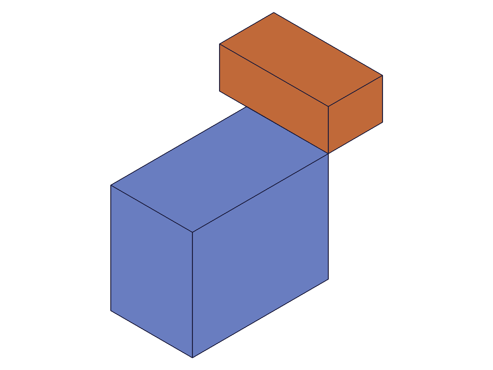
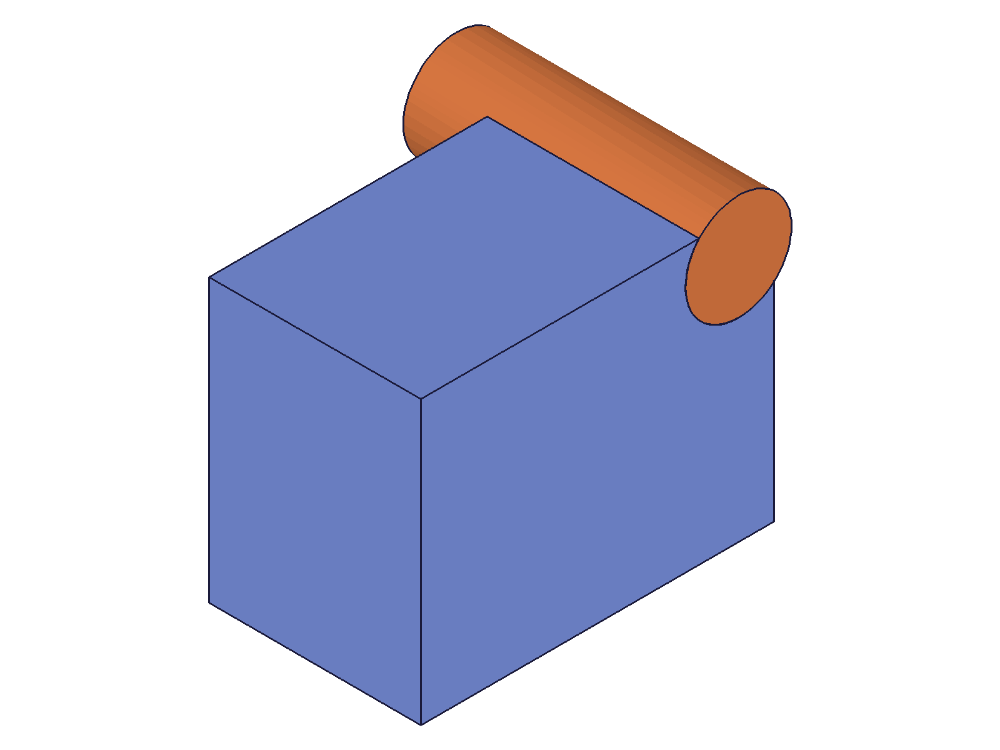
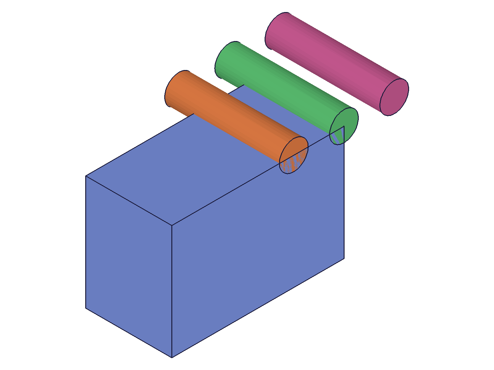
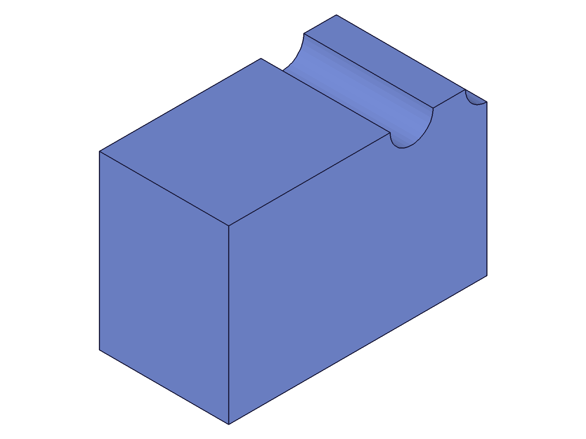
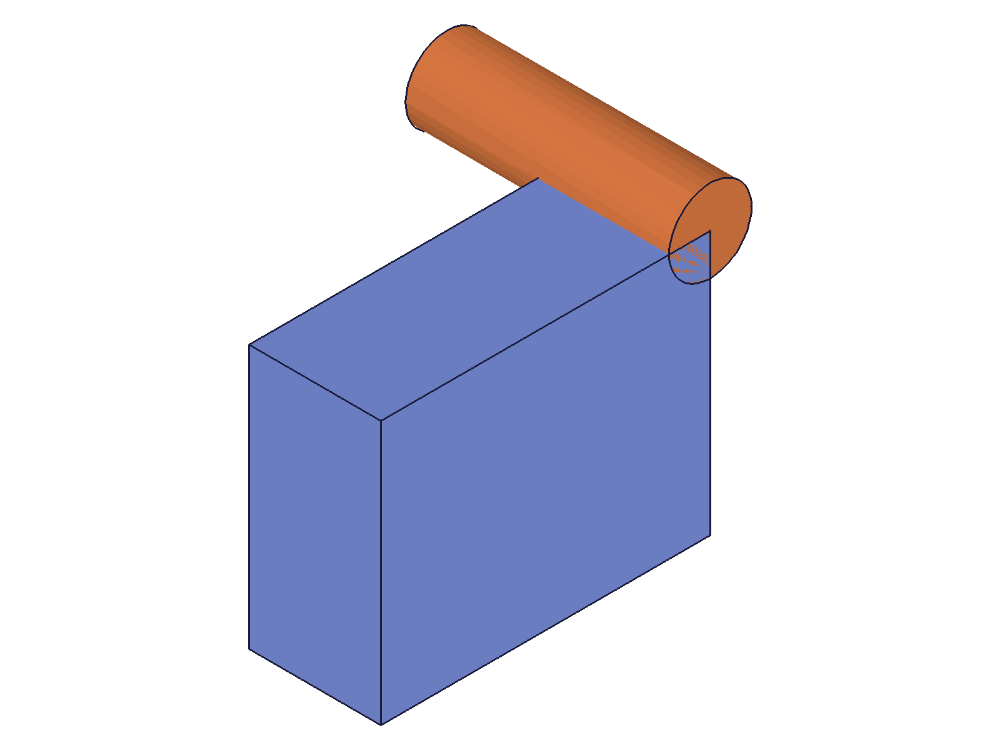
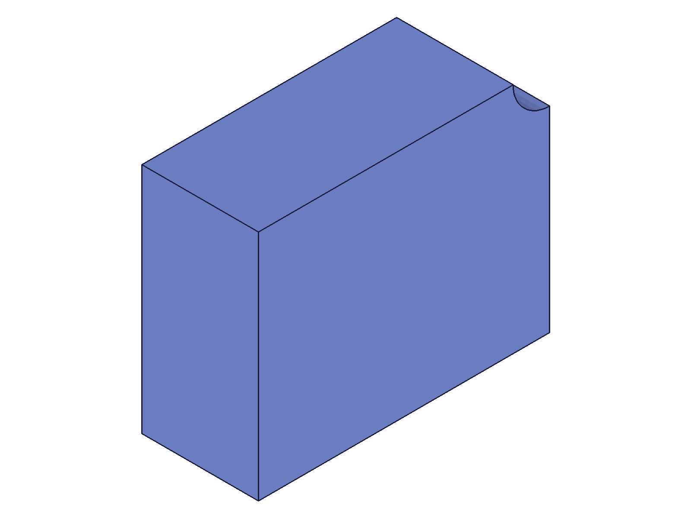
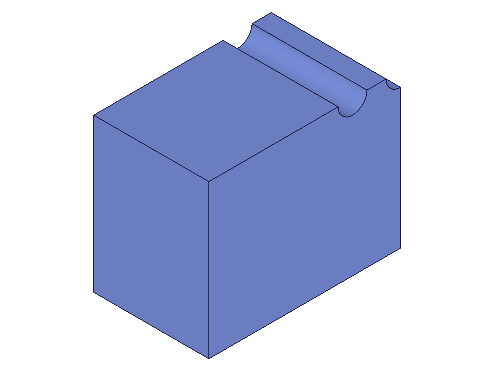
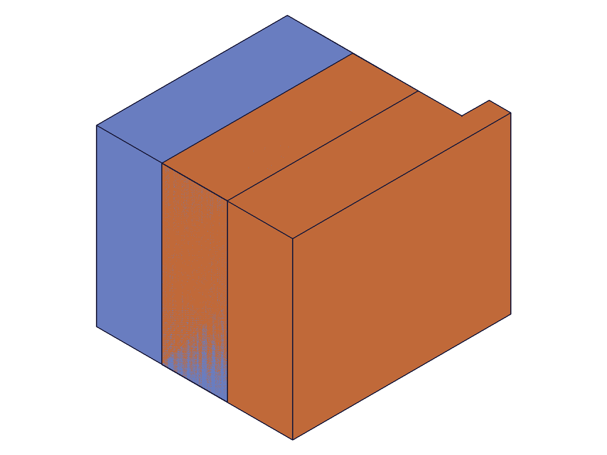
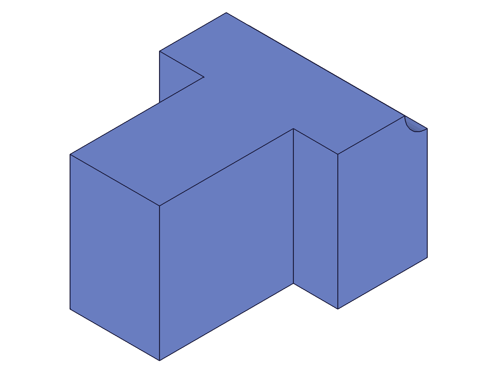

# Training: solid.subtraction

**Date:** 2026-04-14

## Goal

Testing `v1.solid.subtraction` — boolean subtract (cut tool shapes from target).

**Methods to cover:**

- `subtraction` — basic call: target, tools, id (EIF)
- `subtraction` params: `keepTools` (default false vs true)
- Multiple tools in one call
- Non-overlapping bodies (tool doesn't intersect target)
- Tool completely inside target (through-hole)
- Tool partially intersecting
- Self-subtraction (same ID as target and tool — expect hang like union)
- Return value: target ID or VOID?
- Empty tools array
- Chained subtractions

**Questions:**

- Does it return the target ID like union does?
- Does self-subtraction hang like union?
- What happens when the tool doesn't overlap the target?
- What happens when the tool completely envelops the target?
- Can you subtract from a compound solid (result of a prior union)?

---

## 01 — basic subtraction

Script: `scripts/01-basic-subtraction.mjs` — ✅ Subtraction works as expected. Returns target ID (61), maxLevel=31, tool consumed.

|  |  |
| --- | --- |

**Data:** result=61 (target ID), maxLevel=31, messages=[]. Tool (box2 ID 64) is consumed — `solid.copy` on it returns null with maxLevel=51. See `files/01-basic-subtraction-subtraction-result.json`.

**Learned:** Same pattern as `solid.union` — returns target ID, tool consumed by default.

---

## 02 — keepTools: true

Script: `scripts/02-keep-tools.mjs` — ✅ keepTools preserves tool visually (cylinder still rendered in orange), but `solid.copy` on the tool returned null/maxLevel=51.

|  |
| --- |

**Data:** Subtraction succeeded (result=61, maxLevel=31). Tool cylinder visible in snapshot. But `solid.copy({ id: eifId, solid: cyl })` failed. This was a test methodology issue — copy may have different requirements. See script 09 for definitive keepTools proof.

---

## 03 — multiple tools in one call

Script: `scripts/03-multiple-tools.mjs` — ✅ Three cylinders subtracted in one call. All three holes visible.

|  |  |
| --- | --- |

**Data:** result=61 (target ID), maxLevel=31. All three tool cylinders consumed. See `files/03-multiple-tools-multi-tools-result.json`.

**Learned:** Multiple tools in one call works. More efficient than sequential subtractions.

---

## 04 — non-overlapping tool

Script: `scripts/04-non-overlapping.mjs` — ✅ Subtraction with no overlap succeeds silently. Target unchanged, tool consumed.

|  |
| --- |

**Data:** result=61 (target ID), maxLevel=31, messages=[]. No error, no warning. Target geometry unchanged. See `files/04-non-overlapping-no-overlap-result.json`.

**Learned:** Non-overlapping subtraction is a silent no-op on the target geometry, but tool is still consumed.
**📌 LLM doc:** Document silent no-op for non-overlapping tools.

---

## 05 — through-hole

Script: `scripts/05-through-hole.mjs` — ✅ Cylinder passes fully through box, creating a clean through-hole.

|  |  |
| --- | --- |

**Data:** result=61 (target ID), maxLevel=31. See `files/05-through-hole-through-hole-result.json`.

---

## 06 — empty tools + chained subtractions

Script: `scripts/06-empty-tools.mjs` — ✅ Empty tools array is a no-op (result=target ID, maxLevel=31). Chained subtractions (3 sequential cylinders on same target) all succeed.

|  |
| --- |

**Data:** All 4 calls returned result=61, maxLevel=31. See `files/06-empty-tools-edge-cases.json`.

**Learned:** Chained subtractions on the same target work perfectly — target ID remains stable throughout. Same behavior as union.

---

## 07 — tool completely envelops target

Script: `scripts/07-tool-envelops-target.mjs` — Tool completely contains the target. Subtraction removes the target entirely.

**Data:** result=null, maxLevel=51, error message: `"Target solid was removed by subtraction."` (code 1014). See `files/07-tool-envelops-target-envelop-result.json`.

**Learned:** When the tool entirely envelops the target, the result is null (VOID) and you get an explicit error (code 1014, level 51). The target solid is destroyed. This is different from union which would just combine them.
**📌 LLM doc:** Document "target removed" error — result is null, code 1014.

---

## 08 — solid.translation on consumed tool (server hang)

Script: `scripts/08-keeptools-verify.mjs` — ❌ Script timed out. Calling `solid.translation` on a consumed (invalid) tool solid **hung the server** at 100% CPU, requiring kill -9 and restart.

**Learned:** Operating on consumed solid IDs (at least with `solid.translation`) hangs the server, identical to the self-union hang documented in `union.md`. This is a broader ClassCAD pattern: passing invalid solid IDs to certain operations = infinite loop.
**📌 LLM doc:** Document that referencing consumed tool IDs in solid operations hangs the server. Cross-reference with union.md.

---

## 09 — keepTools: true (definitive proof)

Script: `scripts/09-keeptools-safe.mjs` — ✅ keepTools proven by reusing the same tool for a second subtraction on a different target.

|  |
| --- |

**Data:** First subtraction (box1, keepTools:true): result=61, maxLevel=31. Second subtraction (box2, same tool cyl, keepTools:false): result=64, maxLevel=31. Both succeeded — the tool was valid for reuse after first subtraction. See `files/09-keeptools-safe-keeptools-reuse.json`.

**Learned:** `keepTools: true` definitely preserves tool solids for reuse. The script 02 failure was a `solid.copy` issue, not a keepTools issue.

---

## 10 — subtract from compound solid (union result)

Script: `scripts/10-subtract-from-union.mjs` — ✅ Subtraction works on compound solids (union results).

|  |
| --- |

**Data:** Union + subtraction chain: both maxLevel=31, target ID stable. See `files/10-subtract-from-union-union-then-subtract.json`.

**Learned:** Boolean operations compose freely — union then subtract, chained subtracts, etc. Target ID stays stable through all operations.
