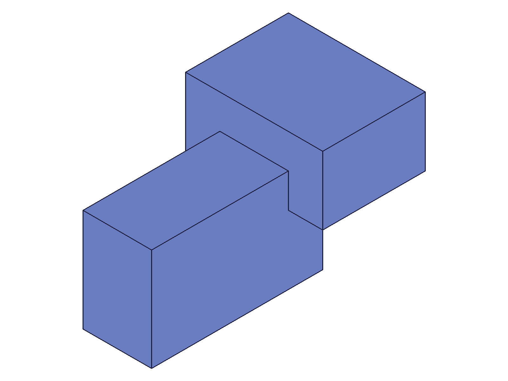
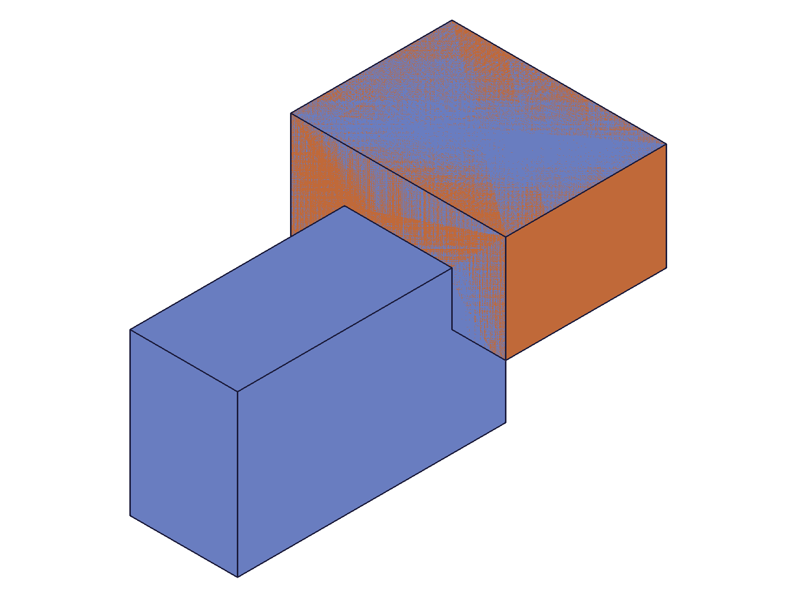
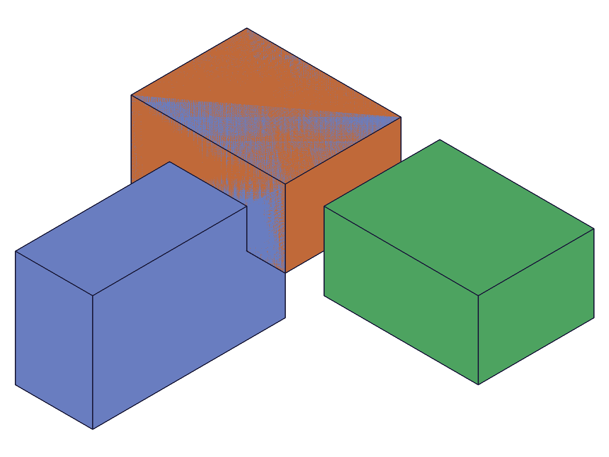
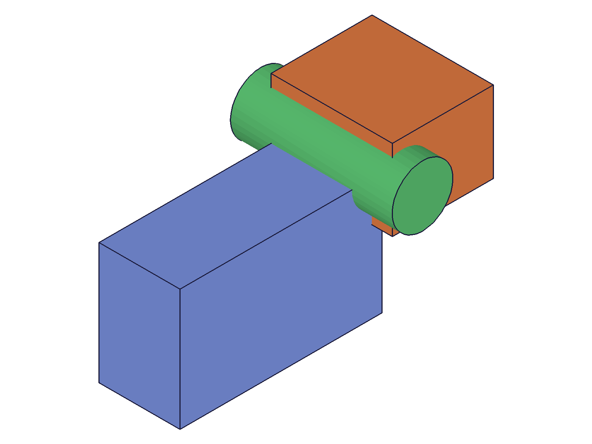
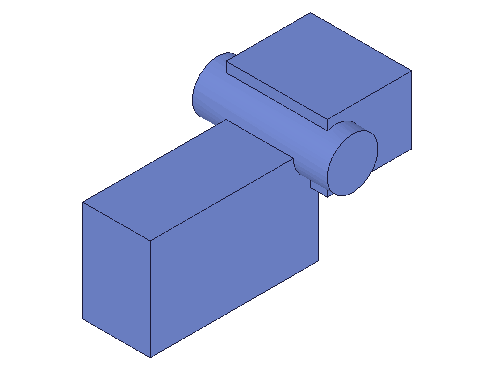
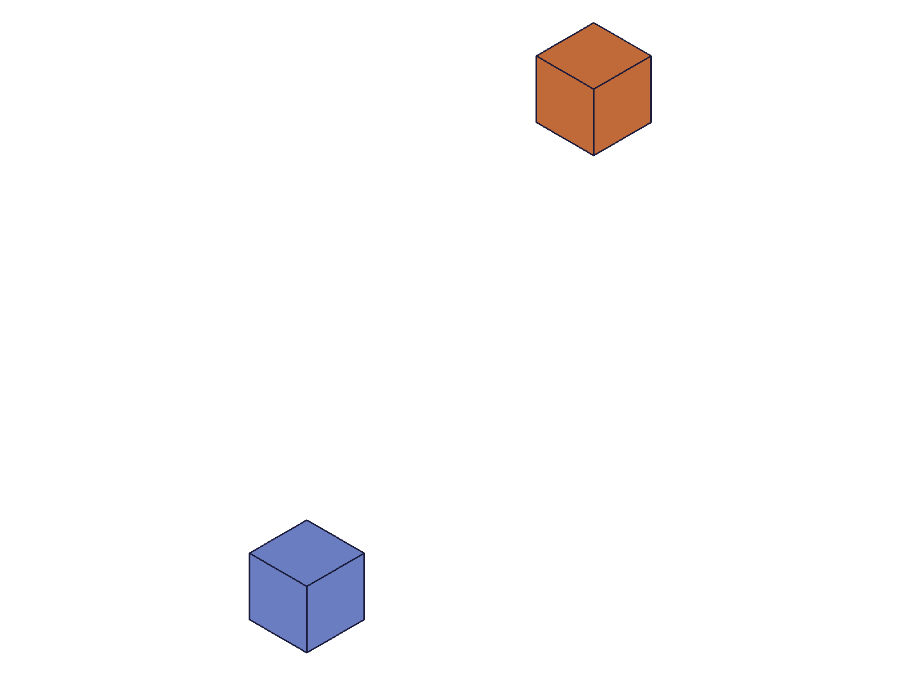
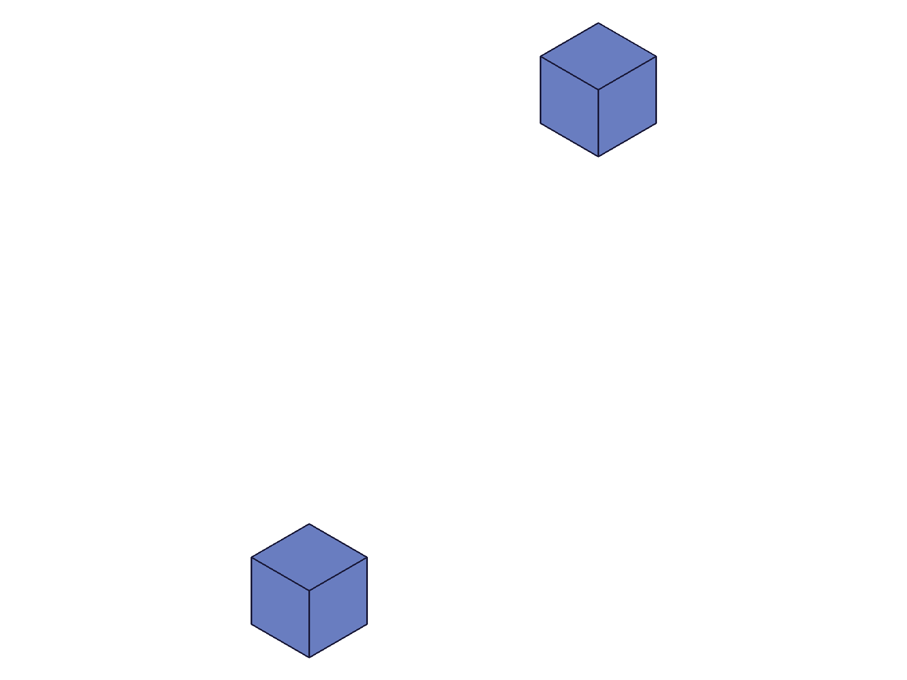
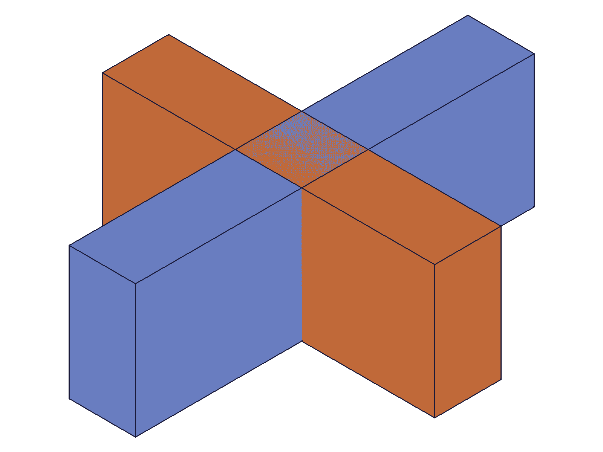
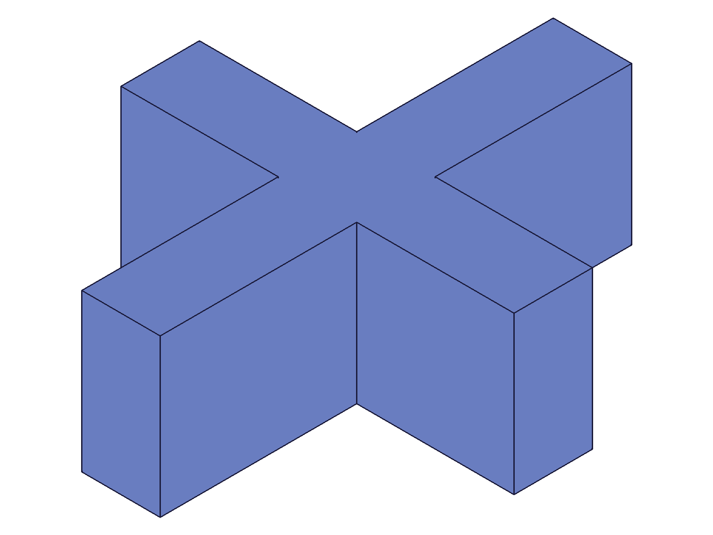
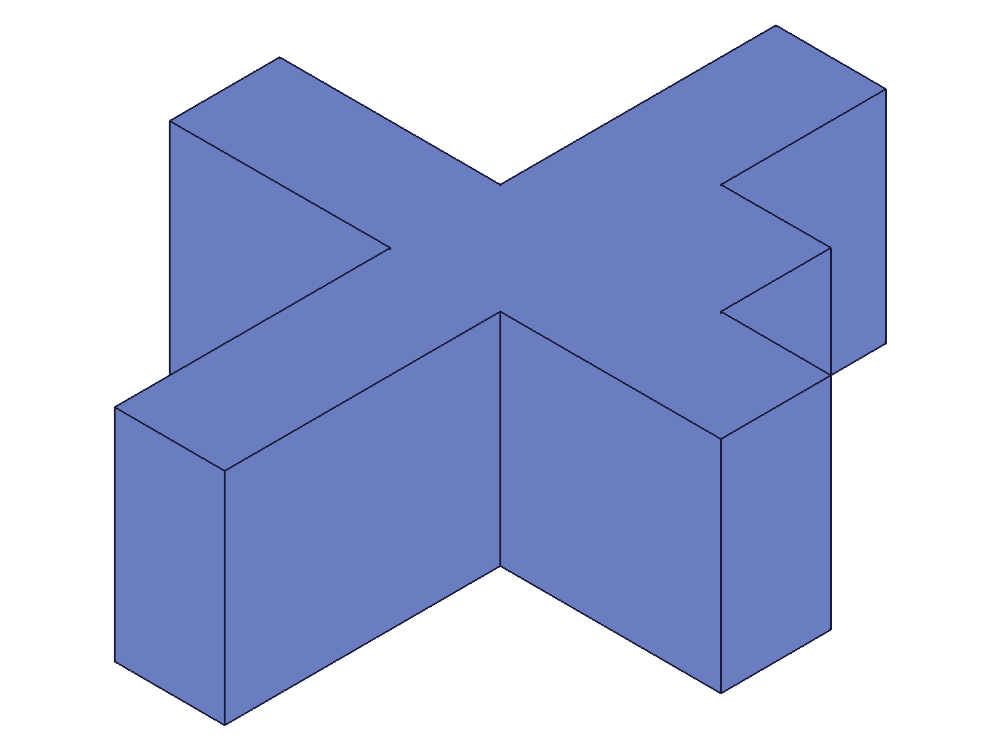

# Training: solid.union

**Date:** 2026-04-14

## Goal

Testing `v1.solid.union` — boolean union of solids within an entity injection feature.

**Methods to cover:**

- `union` — basic union of two overlapping boxes
- `union` params: id (EIF), target, tools (array), keepTools
- `union` — multiple tools at once
- `union` — non-overlapping bodies
- `union` — keepTools: true vs false (default)
- `union` — return value (what ID comes back?)

**Questions:**

- Does union consume tool solids by default (like docs say)?
- What does `keepTools: true` actually do — copies or preserves originals?
- What happens when bodies don't overlap?
- Can you union more than 2 bodies in one call?
- What is the return value — target ID, new ID, or VOID?
- What happens if target and tools are the same solid?

---

## 01 — basic union

Script: `scripts/01-basic-union.mjs` — ✅ Two overlapping boxes successfully unioned.

|  |  |
|---|---|

**Data:** union returns target ID (61 = box1). maxLevel=31, messages=[]. See `files/01-basic-union-union-response.json`.

**Learned:** Union returns the **target solid's ID**, not a new ID. The target is modified in place.

---

## 02 — keepTools: true

Script: `scripts/02-keepTools.mjs` — ✅ keepTools preserves tool solids.

|  |  |
|---|---|

**Data:** Union result=61 (target), maxLevel=31. After union, box2 (ID 64) is still valid — `solid.copy` on box2 succeeded (returned ID 68, maxLevel=31). See `files/02-keepTools-keepTools-copy-check.json`.

**Learned:** `keepTools: true` preserves the original tool solid — it remains a separate, usable solid after the union. The union result absorbs the tool's geometry but the tool solid persists.
**📌 LLM doc:** Document keepTools behavior — tool solid remains valid and reusable.

---

## 03 — multiple tools in one call

Script: `scripts/03-multiple-tools.mjs` — ✅ Two tools (box + cylinder) unioned in one call.

|  |  |
|---|---|

**Data:** Union result=61 (target), maxLevel=31, messages=[]. All three bodies merged into one. See `files/03-multiple-tools-multi-tools-response.json`.

**Learned:** Multiple tools array works — all tools are consumed into the target in a single call.

---

## 04 — non-overlapping bodies

Script: `scripts/04-non-overlapping.mjs` — ✅ Non-overlapping union succeeds (no error).

|  |  |
|---|---|

**Data:** Union result=61, maxLevel=31, messages=[]. See `files/04-non-overlapping-non-overlap-response.json`.

**Learned:** Union of non-overlapping bodies succeeds silently. The result is a compound solid (disjoint bodies under one solid ID). No error, no warning.
**📌 LLM doc:** Non-overlapping union creates a compound/disjoint solid — not an error.

---

## 05 — self-union (target = tool)

Script: `scripts/05-same-solid.mjs` — ❌ **Server hang.** Union where target and tool are the same solid ID causes the ClassCAD worker to spin at 100% CPU indefinitely. Required kill -9 and worker restart.

**Data:** No response received — timeout after 30s. Worker CPU at 99.1%.

**Learned:** Passing the same solid as both target and tool is a **fatal edge case** — it hangs the server. Never do this.
**📌 LLM doc:** CRITICAL gotcha — same ID as target and tool hangs the server.

---

## 06 — empty tools array

Script: `scripts/06-empty-tools.mjs` — ✅ Empty tools array is a no-op.

**Data:** Union result=61 (target), maxLevel=31, messages=[]. See `files/06-empty-tools-empty-tools-response.json`.

**Learned:** Empty `tools: []` is accepted silently — returns target ID unchanged. No error, no warning. Effectively a no-op.

---

## 07 — tool consumed (default keepTools=false)

Script: `scripts/07-tool-consumed.mjs` — ✅ Confirms tool is consumed by default.

**Data:** After union (keepTools default=false), attempting `solid.copy` on the consumed tool (box2, ID 64) fails with maxLevel=51, error: `"An element of parameter \"target\" has an invalid id!"`. See `files/07-tool-consumed-tool-consumed-check.json`.

**Learned:** Default behavior (keepTools=false) **destroys** the tool solid — its ID becomes invalid. Any subsequent reference to it errors.
**📌 LLM doc:** Document that consumed tools have invalid IDs — referencing them is an error.

---

## 08 — realistic usage (L-bracket with chained unions)

Script: `scripts/08-realistic-usage.mjs` — ✅ L-shaped bracket built via two chained unions.

|  |  |  |
|---|---|---|

**Data:** First union result=61, second union result=61. Both maxLevel=31. The target ID persists through multiple chained unions.

**Learned:** Chained unions work — you can repeatedly union new solids into the same target. The target ID stays stable across all operations.

---

## Coverage Checklist

- [x] API called successfully
- [x] Every required parameter tested (id, target, tools)
- [x] Key optional parameter exercised (keepTools)
- [x] No enum variants for union
- [x] No update/delete method for union
- [x] Realistic usage combining with prerequisites (script 08)
- [x] Behavioral claims verified with data (scripts 02, 07 — keepTools/consumed)
- [x] Edge cases: self-union hang (05), empty tools (06), non-overlapping (04)
