# Training: Constraint Types — Conceptual Study

**Date:** 2026-04-14

## Goal

Conceptual study of constraint types: COINCIDENT, PARALLEL, PERPENDICULAR, TANGENT, EQUAL_LENGTH, EQUAL_RADIUS, HORIZONTAL, VERTICAL, SYMMETRY, FIXATION, MIDPOINT, COLINEAR, CONCENTRIC.

The retrain session (`2026-04-14_10-00-00_constraintRetrain`) already tested each type individually. This session fills remaining gaps in the conceptual understanding.

**Questions to answer:**

- COINCIDENT: Does point-on-circle and point-on-arc work? (only pt-pt and pt-line were tested)
- TANGENT: Does circle-circle and arc-arc work? What about circle-line?
- SYMMETRY: Does it work with line pairs, not just points?
- Constraint deletion: When a constraint is deleted, does geometry revert or stay?
- Constraint chaining: If A constrains B and B constrains C, does the solver propagate correctly?
- Constraint interaction: Multiple constraint types on the same geometry

---

## 01 — COINCIDENT point-on-circle

Script: `scripts/01-coincident-pt-on-circle.mjs` — ✅ Point snapped onto circle circumference.

| 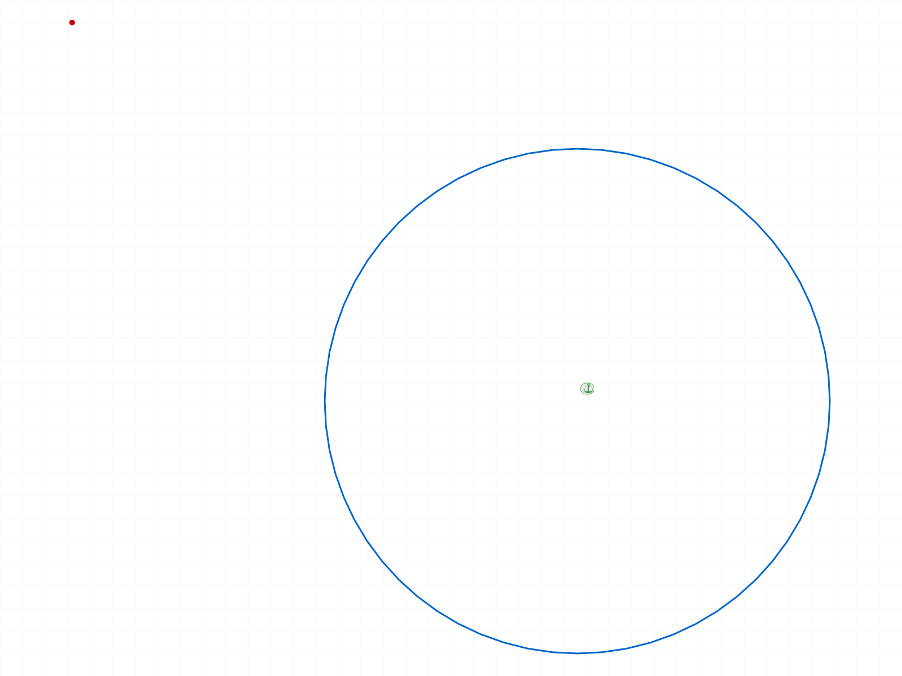 |
|---|

**Data:** Circle center (50,30), radius 20. Free point at (10,60). After COINCIDENT: point at (34,42). Distance from center: sqrt((34-50)²+(42-30)²) = sqrt(256+144) = sqrt(400) = 20.0 = radius. ✅ Exactly on circle.

📌 LLM doc: COINCIDENT works for point-on-circle. Point snaps to nearest circumference point.

---

## 02 — COINCIDENT point-on-arc

Script: `scripts/02-coincident-pt-on-arc.mjs` — ✅ Point snapped onto arc circumference.

| 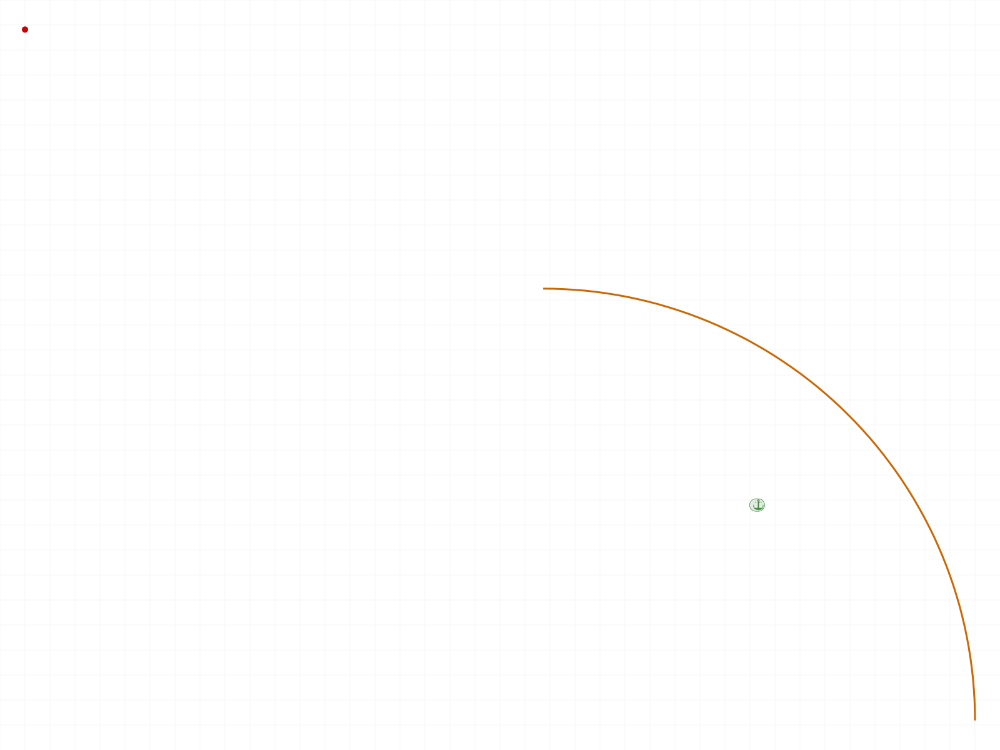 | 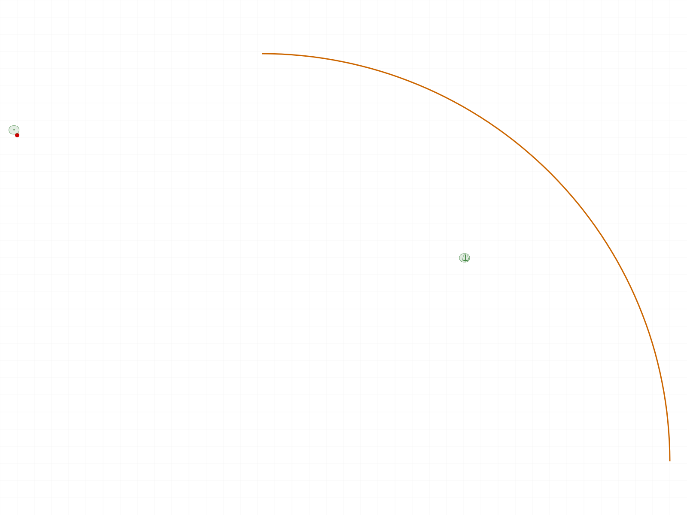 |
|---|---|

**Data:** Arc center (40,20), radius 25. Free point at (10,60). After COINCIDENT: point at (25,40). Distance from center = 25.0 = radius. ✅ Exactly on arc. See `files/02-coincident-pt-on-arc-coincident-pt-arc.json`.

📌 LLM doc: COINCIDENT point-on-arc works identically to point-on-circle.

---

## 03c — TANGENT circle-line (verified with getPoints)

Script: `scripts/03c-tangent-verify.mjs` — ✅ Circle center moved to tangent position.

| 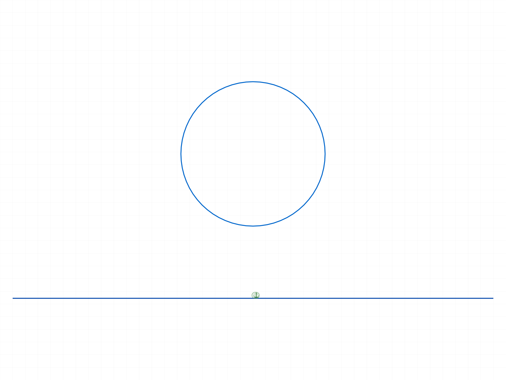 | 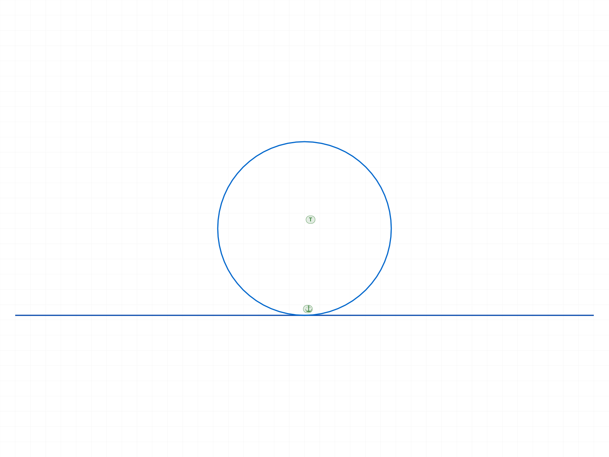 |
|---|---|

**Data:** Fixed horizontal line at y=0. Circle center at (50,30), radius 15. After TANGENT: center at (50,15). Center Y = 15 = radius. ✅ Tangent to line.

**Note:** `getPositions` returns null for circles. Use `getPoints({id: circleId}).result.centerId` to get a point ID, then `getPositions({id: centerId})` to read position.

📌 LLM doc: For circles, use `getPoints` → `centerId` → `getPositions` to read center. Direct `getPositions(circleId)` returns null.

---

## 04c — TANGENT circle-circle (external tangent)

Script: `scripts/04c-tangent-cc-verify.mjs` — ✅ Circles achieved external tangency.

| 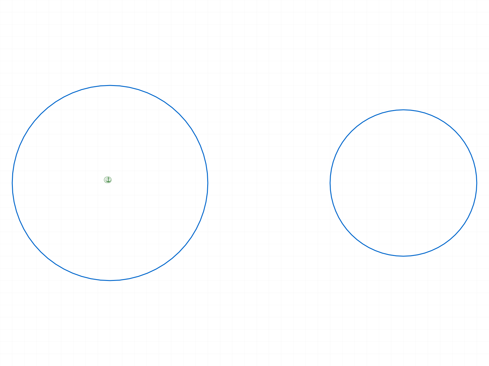 | 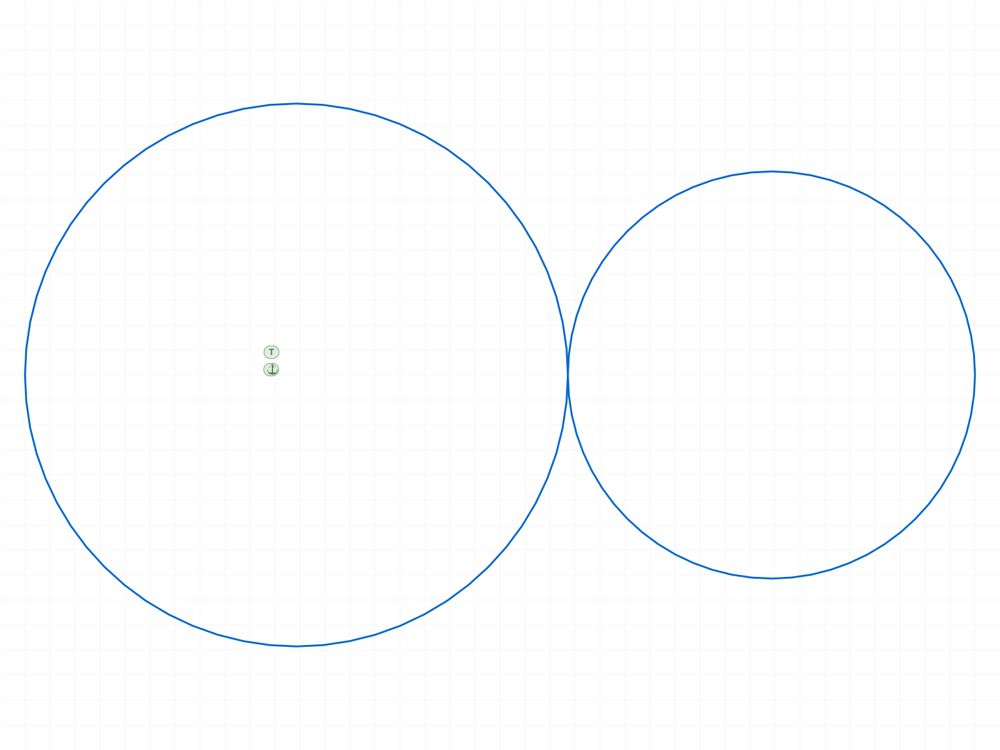 |
|---|---|

**Data:** c1 fixed at (0,0) r=20. c2 at (60,0) r=15. After TANGENT: c2 moved to (35,0). Center distance = 35 = r1+r2. ✅ External tangent. See `files/04c-tangent-cc-verify-tangent-cc-verify.json`.

**Learned:** TANGENT circle-circle produces external tangency (circles touching, not overlapping). The unconstrained circle moves toward the fixed one until center distance = sum of radii.

📌 LLM doc: TANGENT circle-circle → external tangent (dist = r1+r2). Solver moves unconstrained circle.

---

## 05 — SYMMETRY with lines (partial convergence)

Script: `scripts/05-symmetry-lines.mjs` — ⚠️ Constraint accepted (maxLevel=31) but convergence is approximate.

| 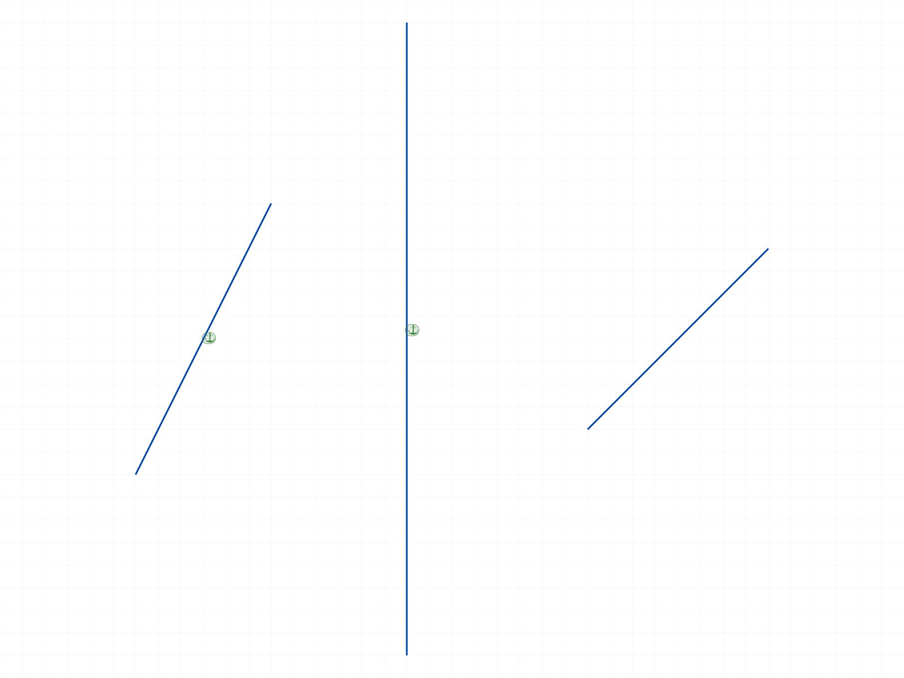 | 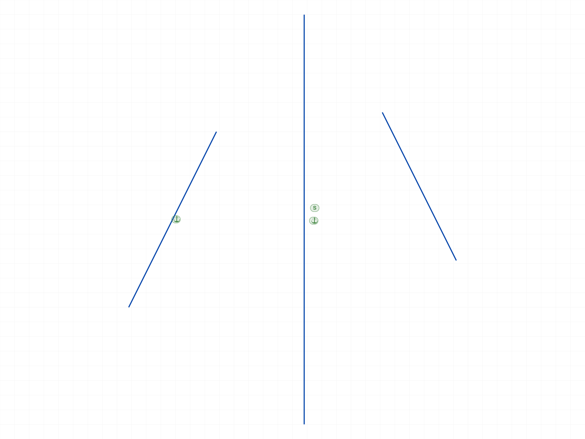 |
|---|---|

**Data:** Vertical axis at x=40. l1 fixed at (10,10)→(25,40) [length 33.54]. l2 at (60,15)→(80,35) [length 28.28]. After SYMMETRY: l2 at (66,18)→(53.35, 43.30) [length 28.27]. Expected exact mirror: (70,10)→(55,40). Actual positions off by ~4-8 units.

l2 kept its own length (28.27) while the solver tried to mirror l1 (length 33.54). Since the lines have different lengths, exact endpoint-by-endpoint mirroring is impossible. The solver moves l2 toward the mirror orientation while preserving its individual length.

See `files/05-symmetry-lines-symmetry-lines.json`.

**Learned:** SYMMETRY with lines of different lengths → approximate convergence. The solver mirrors orientation but preserves individual line lengths. For exact mirroring, use EQUAL_LENGTH first or use points instead of lines.

📌 LLM doc: SYMMETRY on lines with different lengths → approximate mirror. Orientation mirrors, individual lengths preserved. Use EQUAL_LENGTH + SYMMETRY for exact mirroring, or constrain individual endpoints via SYMMETRY on point pairs.

---

## 06 — Constraint deletion (geometry stays)

Script: `scripts/06-delete-constraint.mjs` — ✅ Key finding: geometry does NOT revert after constraint deletion.

| 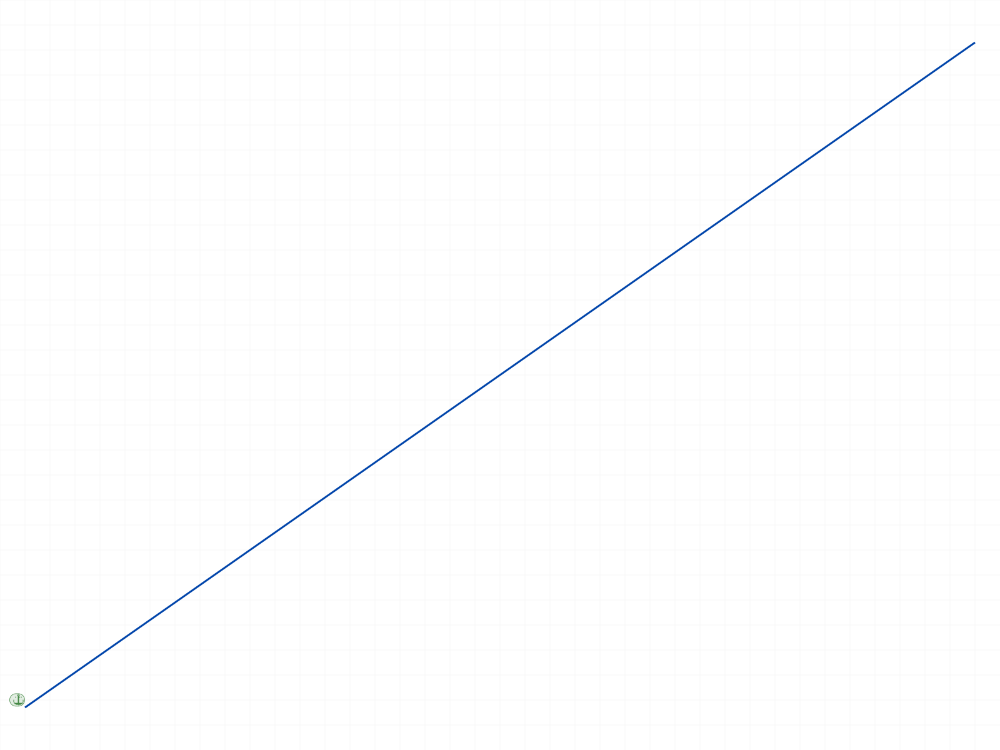 | 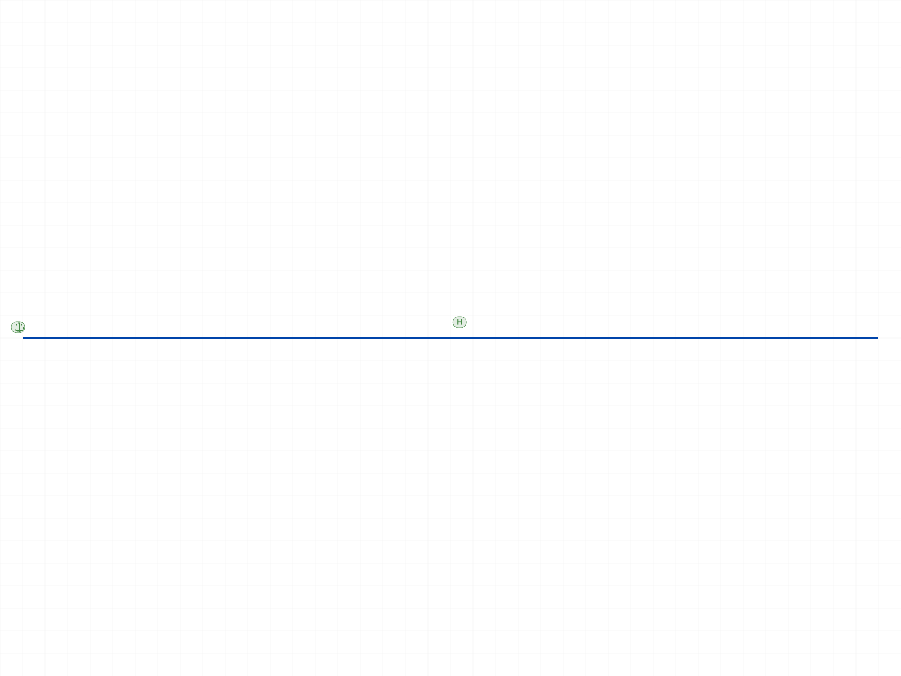 | 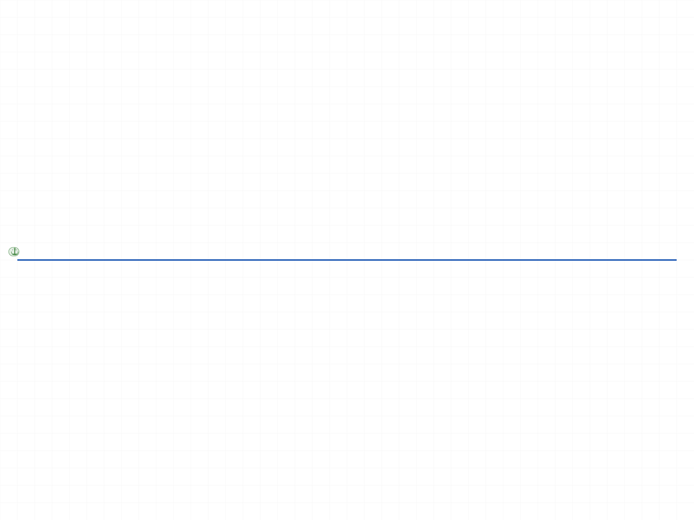 |
|---|---|---|

**Data:** Diagonal line end at (60,40). After HORIZONTAL: end at (71.03, 5.0). After DELETE of HORIZONTAL constraint: end still at (71.03, 5.0). `stayedAtH: true`, `revertedToOriginal: false`. See `files/06-delete-constraint-delete-constraint.json`.

**Learned:** Deleting a constraint does NOT undo its geometric effect. The geometry stays where the solver put it. The constraint is removed from the structure tree but positions are not reverted. This is consistent with how parametric systems work — constraints define current state, not history.

📌 LLM doc: Deleting a constraint leaves geometry in its current position. There is no "undo" effect — geometry does not revert to pre-constraint state.

---

## 07 — Constraint chaining (propagation works)

Script: `scripts/07-chaining.mjs` — ✅ Constraints propagate through chains perfectly.

| 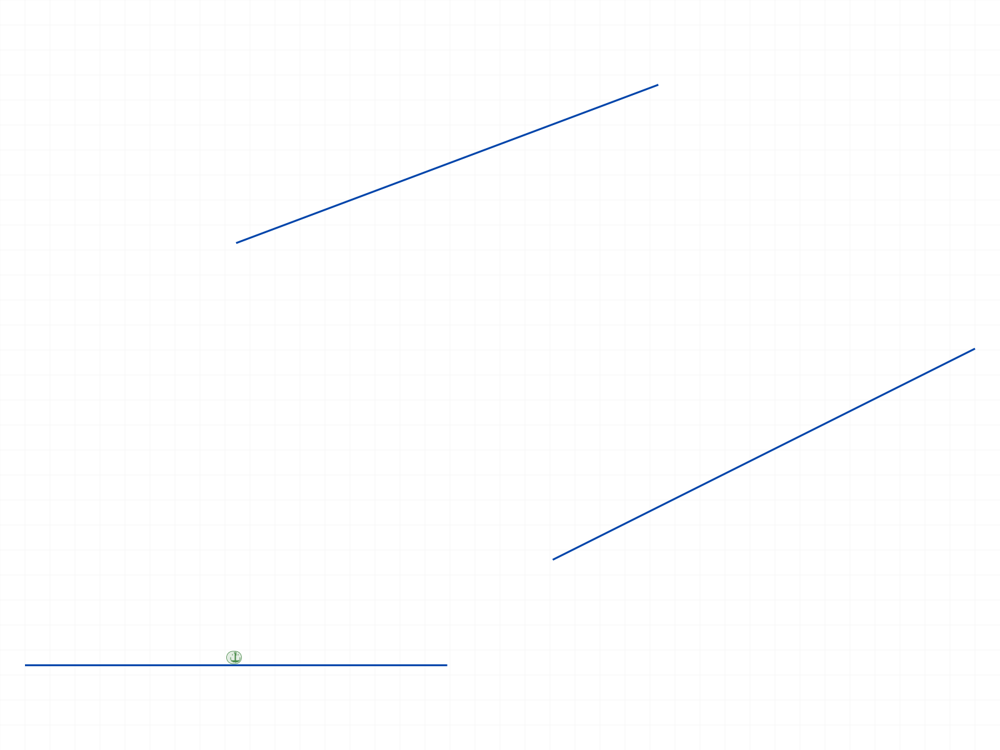 | 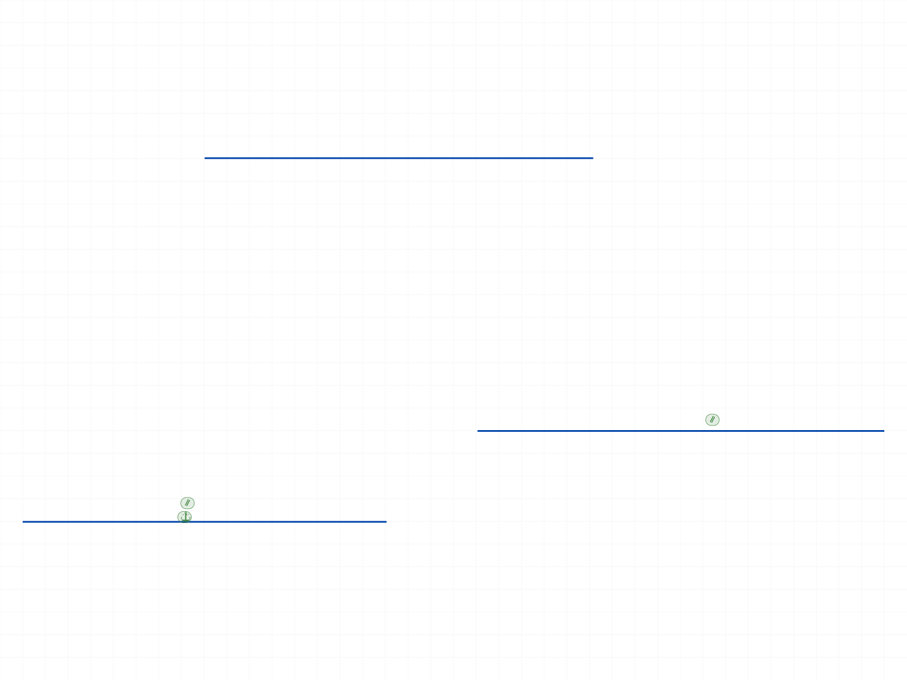 |
|---|---|

**Data:** l1 fixed horizontal. PARALLEL(l1, l2) → l2 horizontal ✅. PARALLEL(l2, l3) → l3 horizontal ✅. Chain propagated: l1→l2→l3 all horizontal. See `files/07-chaining-chaining.json`.

**Learned:** The solver propagates constraints transitively through chains. If A∥B and B∥C, then C becomes parallel to A. This works immediately — no need to explicitly connect A to C.

📌 LLM doc: Constraints propagate through chains. PARALLEL(A,B) + PARALLEL(B,C) = all three parallel.

---

## 08 — Multi-constraint interaction (building a square)

Script: `scripts/08-multi-constraint.mjs` — ✅ Built a perfect square from rough quadrilateral.

| 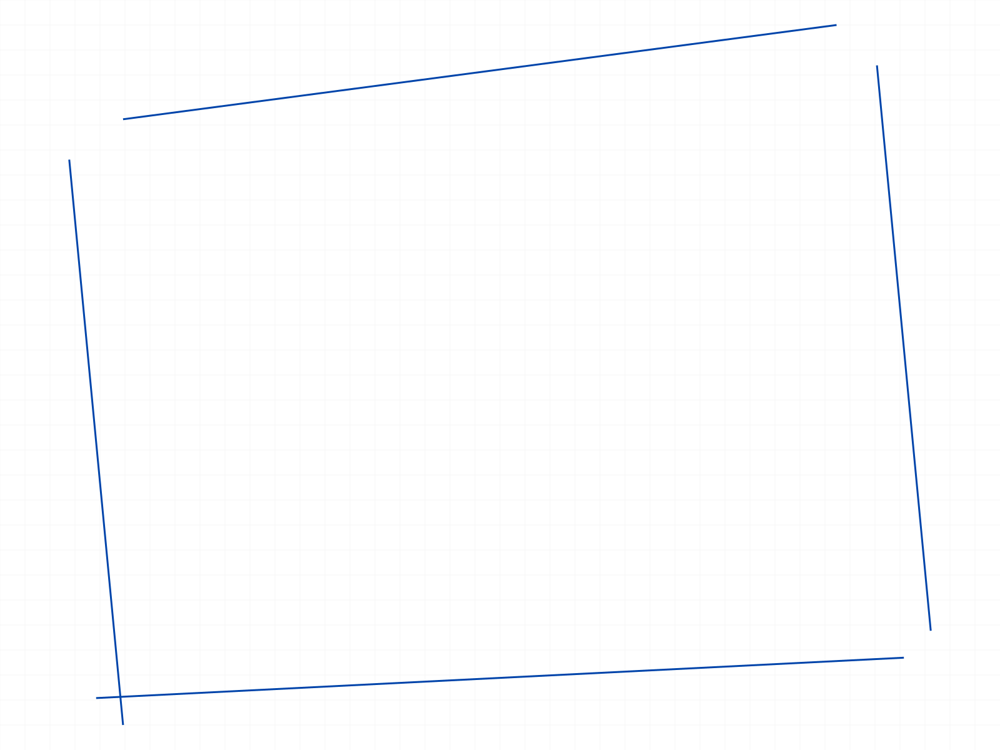 | 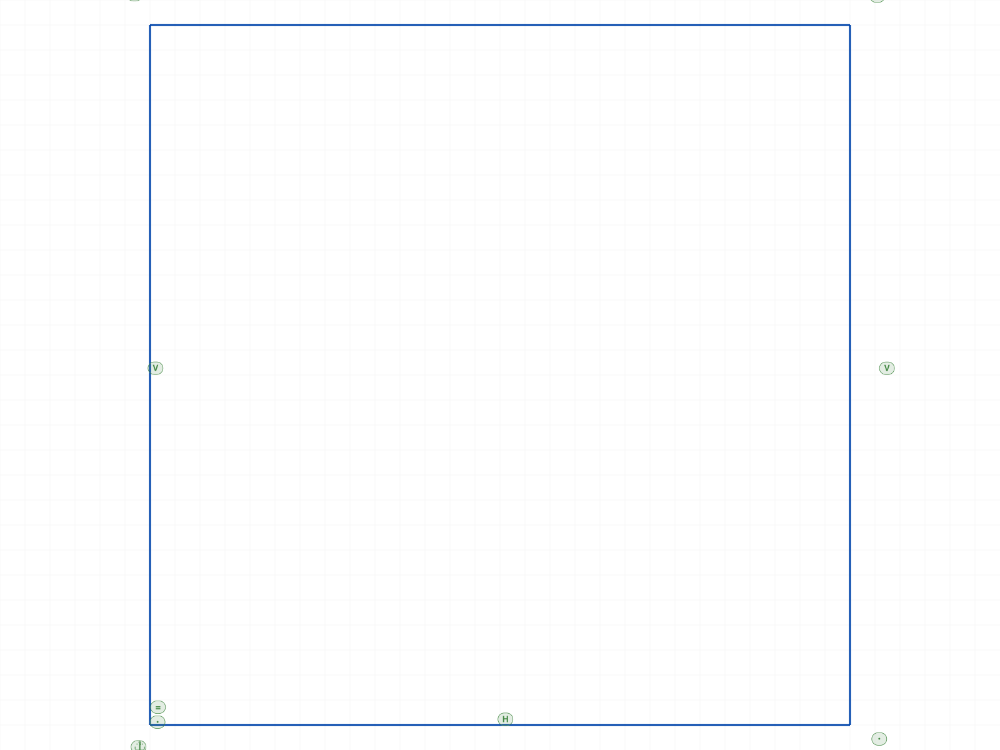 |
|---|---|

**Data:** Started with 4 rough lines. Applied:
1. FIXATION on bottom-left point
2. COINCIDENT × 4 (connect corners)
3. HORIZONTAL × 2 + VERTICAL × 2 (make rectangle)
4. EQUAL_LENGTH (make square)

Result: Perfect square, all sides = 43.0. All constraint batches returned maxLevel=31. See `files/08-multi-constraint-multi-constraint.json`.

**Learned:** Multiple constraint types compose correctly. The solver handles FIXATION + COINCIDENT + HORIZONTAL/VERTICAL + EQUAL_LENGTH together in sequence. Batch creation works for all types. This is the pattern for building constrained sketches: fix a reference point → connect geometry → add directional constraints → add dimensional/equality constraints.

📌 LLM doc: Recommended constraint application order: FIXATION (anchor) → COINCIDENT (connect) → directional (H/V/PARALLEL/PERP) → equality/dimensional.

---

## Coverage Checklist

- [✅] COINCIDENT: pt-pt (retrain), pt-line (retrain), pt-circle (01), pt-arc (02) — all work
- [✅] HORIZONTAL: on line (retrain), on point pair (retrain) — both work
- [✅] VERTICAL: on line (retrain), on point pair (retrain) — both work
- [✅] PARALLEL: pair of lines (retrain), chaining (07) — works, propagates
- [✅] PERPENDICULAR: pair of lines (retrain) — works
- [✅] TANGENT: arc-line (retrain), circle-line (03c), circle-circle (04c) — all work
- [✅] COLINEAR: pair of lines (retrain) — works
- [✅] CONCENTRIC: pair of circles (retrain) — works
- [✅] SYMMETRY: points (retrain ✅), lines (05 ⚠️ approximate with different lengths)
- [✅] FIXATION: locks geometry (retrain), anchors for other constraints (10)
- [✅] EQUAL_LENGTH: works, may change either line (retrain)
- [✅] EQUAL_RADIUS: works, FIXATION protects radius (retrain)
- [✅] MIDPOINT: works with line endpoints, fails with free points (retrain)
- [❌] SPLINE_FIT_POINT: not testable (no spline creation API)
- [✅] Constraint deletion: geometry stays (06)
- [✅] Constraint chaining: propagates (07)
- [✅] Multi-constraint interaction: composes correctly (08)
