# Training: sketch.dimension

**Date:** 2026-04-14

## Goal

Testing `v1.sketch.dimension` — creating dimensional constraints in sketches with active solver (planeId set).

**Methods to cover:**

- `dimension` — all 7 types: RADIUS, DIAMETER, OFFSET, HORIZONTAL_DISTANCE, VERTICAL_DISTANCE, ANGLE, ANGLEOX
- `dimension` params: id, type, geomIds, value, dimPos, reflex, name
- Batch creation (array of dimension params)
- Auto-calculated value (omit `value` param)
- Expression-driven values (`value: '60deg'`, `value: '@expr.X'`)

**Questions:**

- What geomIds does each dimension type expect? (1 line? 2 lines? 1 circle? points?)
- What structure tree class is created for each type?
- Does `value` auto-calculate when omitted? What value does it pick?
- Does creating a dimension with a specific `value` cause the solver to reposition geometry?
- What is `dimPos` and how does it affect the result?
- What does `reflex` do for ANGLE type?
- What happens with invalid geomIds or wrong types?
- Does batch dimension creation work?

---

## 01 — OFFSET basic (auto-value)

Script: `scripts/01-offset-basic.mjs` — ✅ OFFSET on a single line, auto-value.

| 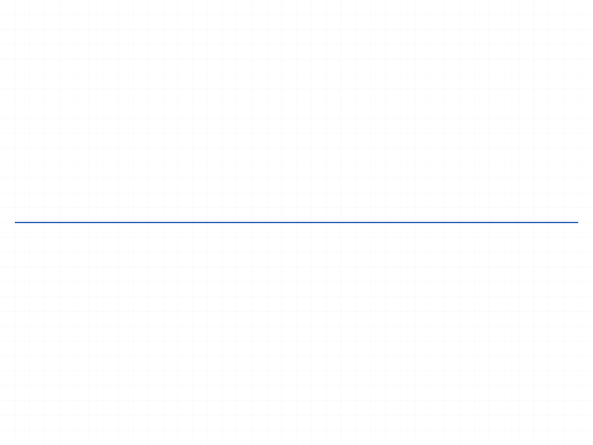 | 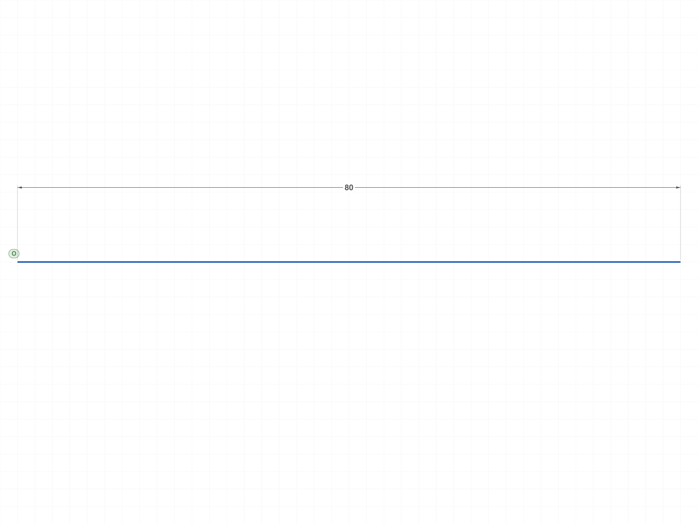 |
|---|---|

**Data:** Line at (0,0)→(80,0). OFFSET dimension created: ID 68, maxLevel=31. Class: `CC_LinearFeatureDimension`, name: "Offset". Auto-calculated value captures current line length (80). Structure has `startPt`, `endPt`, `dimPt` (auto-positioned), `paramName: "@value"`. See `files/01-offset-basic-offset-basic.json`.

📌 LLM doc: OFFSET on a single line measures its length. Auto-name is "Offset". Class: `CC_LinearFeatureDimension`.

---

## 02 — OFFSET with explicit value (solver resizes)

Script: `scripts/02-offset-with-value.mjs` — ✅ Solver resized line from 80→50.

|  | 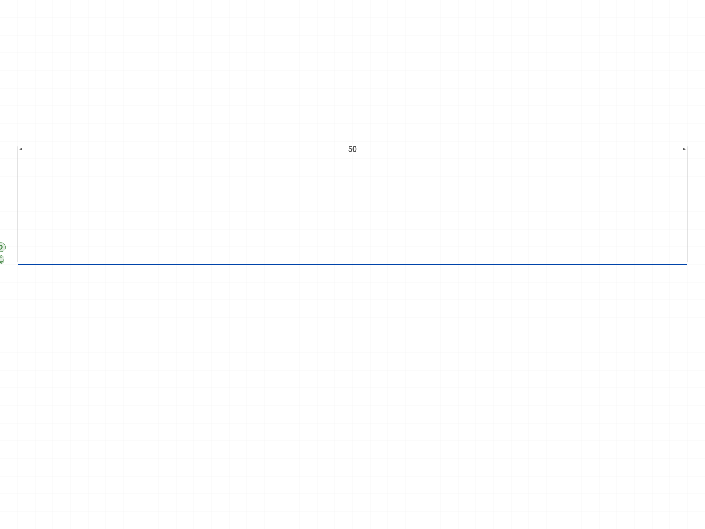 |
|---|---|

**Data:** Line 80 units, start fixed. `dimension({type:'OFFSET', geomIds:[l1], value:50})` → maxLevel=31. End moved from (80,0) to (50,0). Solver immediately resized the line to match the dimension value. See `files/02-offset-with-value-offset-with-value.json`.

**Learned:** Dimensions are active constraints. Providing a `value` that differs from current geometry causes the solver to reposition geometry immediately on creation.

📌 LLM doc: Dimension `value` drives the solver — geometry is resized/repositioned immediately on creation. Fix an anchor point first.

---

## 03 — HORIZONTAL_DISTANCE

Script: `scripts/03-horizontal-distance.mjs` — ✅ on line, ⚠️ on 2 points (over-constrained).

| 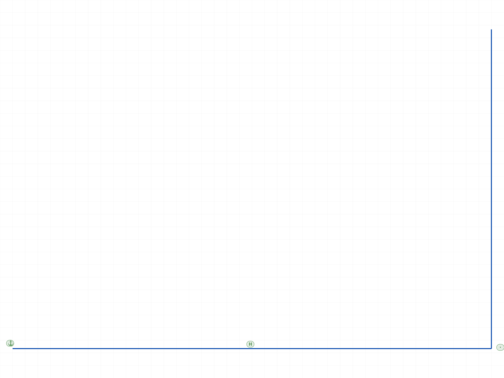 | 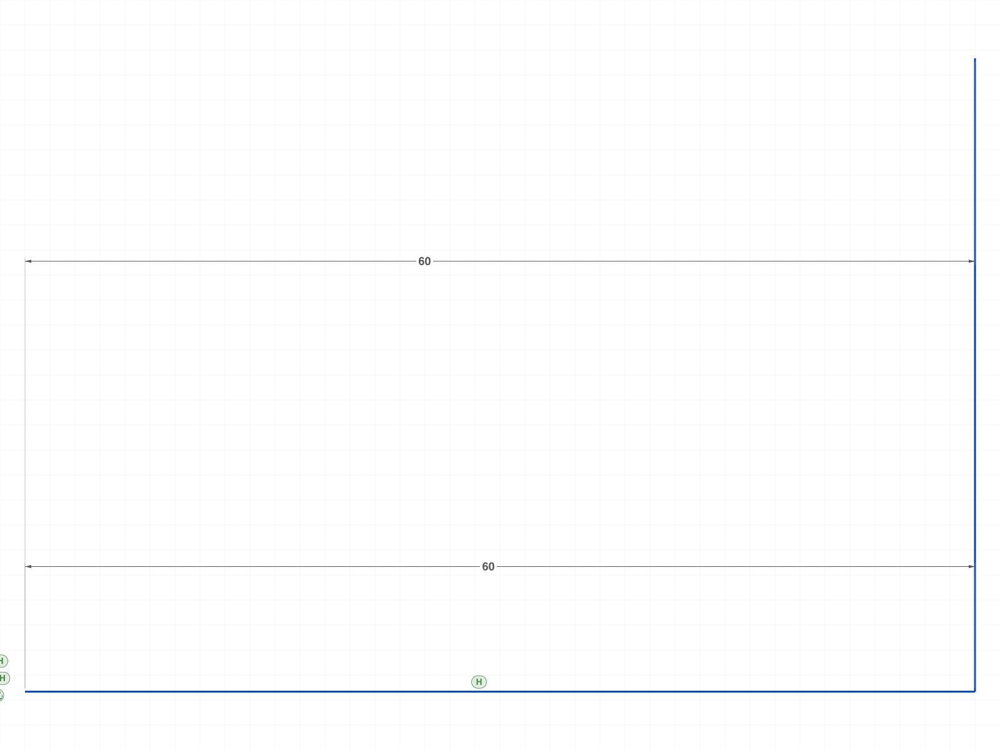 |
|---|---|

**Data:**
- H_DIST on single line: ID 82, maxLevel=31, class `CC_LinearFeatureDimension`, name "HD". No value specified → auto-calculated.
- H_DIST between 2 points with value=80: ID 86, maxLevel=51 (solver error). Dimension created but solver couldn't resolve (geometry over-constrained with existing FIXATION + COINCIDENT). No geometry change.

📌 LLM doc: HORIZONTAL_DISTANCE works on a single line or between two points. Auto-name "HD". When used between points with value, check for over-constraining.

---

## 04 — VERTICAL_DISTANCE (solver resizes)

Script: `scripts/04-vertical-distance.mjs` — ✅ Solver resized vertical line from 70→50.

| 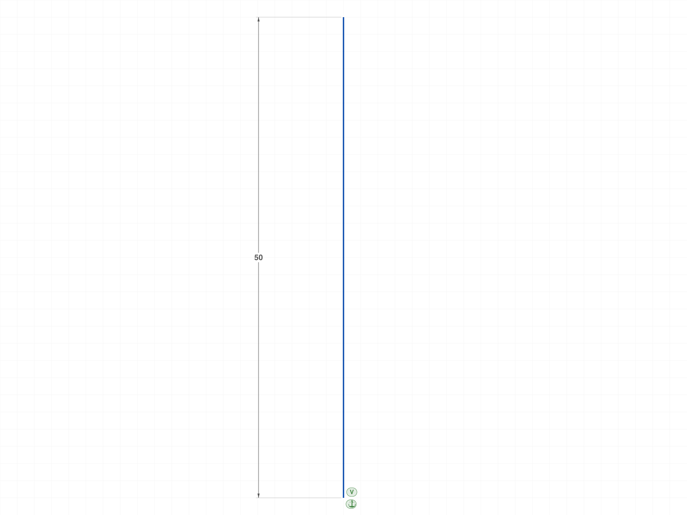 |
|---|

**Data:** Vertical line (0,0)→(0,70), start fixed. V_DIST with value=50: maxLevel=31. End moved from (0,70) to (0,50). Class `CC_LinearFeatureDimension`. See `files/04-vertical-distance-vdist-data.json`.

---

## 05 — RADIUS (solver resizes circle)

Script: `scripts/05-radius.mjs` — ✅ Circle radius changed from 30→20.

|  | 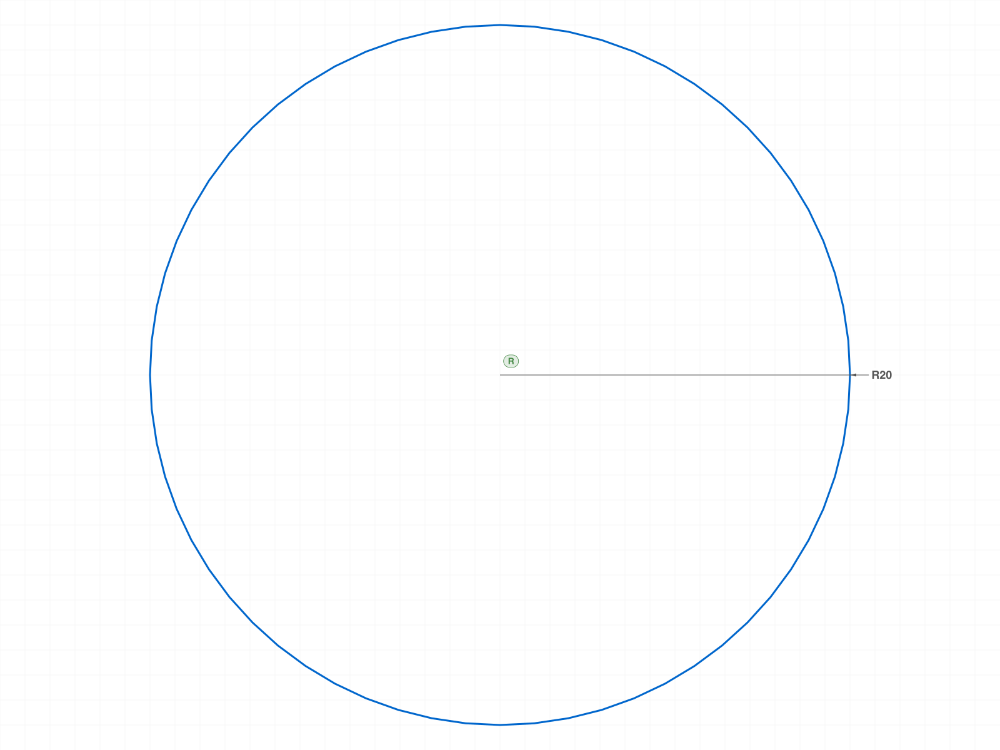 |
|---|---|

**Data:** Circle r=30, center fixed. RADIUS dim with value=20: maxLevel=31. Structure tree shows `radius.value=20`. Class: `CC_RadialFeatureDimension`, name: "R". See `files/05-radius-radius-data.json`.

📌 LLM doc: RADIUS takes 1 circle/arc geomId. Class: `CC_RadialFeatureDimension`. Auto-name "R".

---

## 06 — DIAMETER (solver resizes circle)

Script: `scripts/06-diameter.mjs` — ✅ Circle radius changed from 25→30 (diameter 60).

|  | 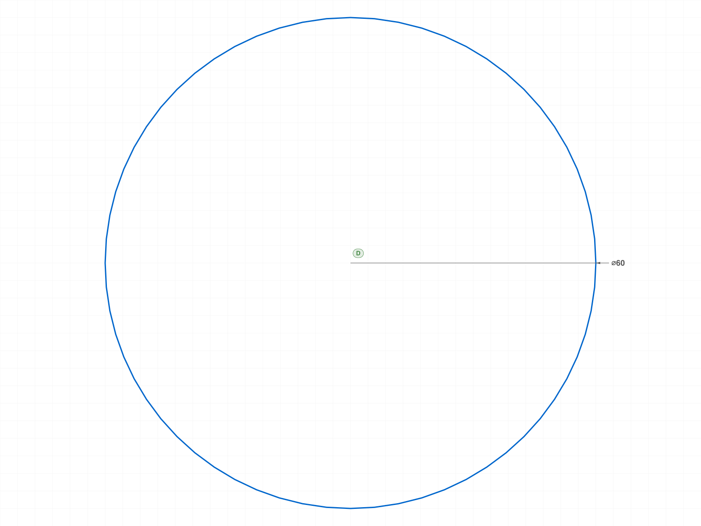 |
|---|---|

**Data:** Circle r=25. DIAMETER dim with value=60: maxLevel=31. `radius.value=30` in structure. Class: `CC_DiameterFeatureDimension`, name: "D". See `files/06-diameter-diameter-data.json`.

📌 LLM doc: DIAMETER takes 1 circle/arc geomId. Value is diameter (not radius). Class: `CC_DiameterFeatureDimension`. Auto-name "D".

---

## 07 — ANGLE between two lines

Script: `scripts/07-angle.mjs` — ✅ Line rotated to 60° from fixed line.

| 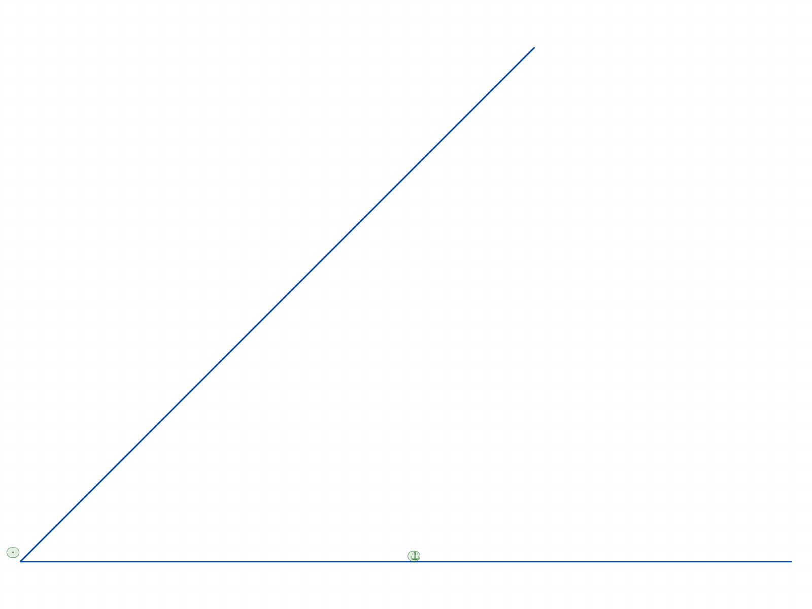 | 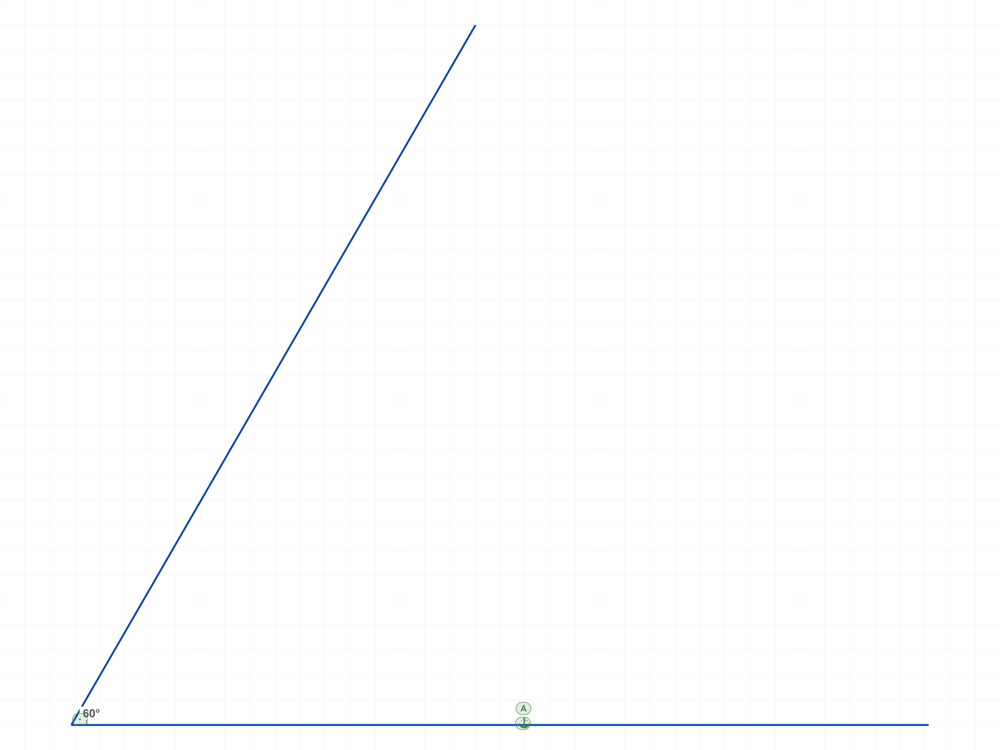 |
|---|---|

**Data:** l1 fixed horizontal, l2 diagonal ~45°. ANGLE dim with `value:'60deg'`, `dimPos:[20,15,0]`: maxLevel=31. l2 end moved from (40,40) to (28.28, 48.99). Length preserved (≈56.57). Angle atan2(48.99, 28.28) ≈ 60°. ✅ Class: `CC_AngularFeatureDimension`, name: "Ang". See `files/07-angle-angle-data.json`.

**Learned:** ANGLE value uses 'Ndeg' string syntax (e.g., `'60deg'`). `dimPos` selects which sector to constrain.

📌 LLM doc: ANGLE needs 2 line geomIds. Value is a string with `deg` suffix: `'60deg'`. `dimPos` selects the angular sector. Class: `CC_AngularFeatureDimension`. Auto-name "Ang".

---

## 08 — ANGLEOX (angle to X axis)

Script: `scripts/08-angleox.mjs` — ✅ Line rotated to 45° from X axis.

| 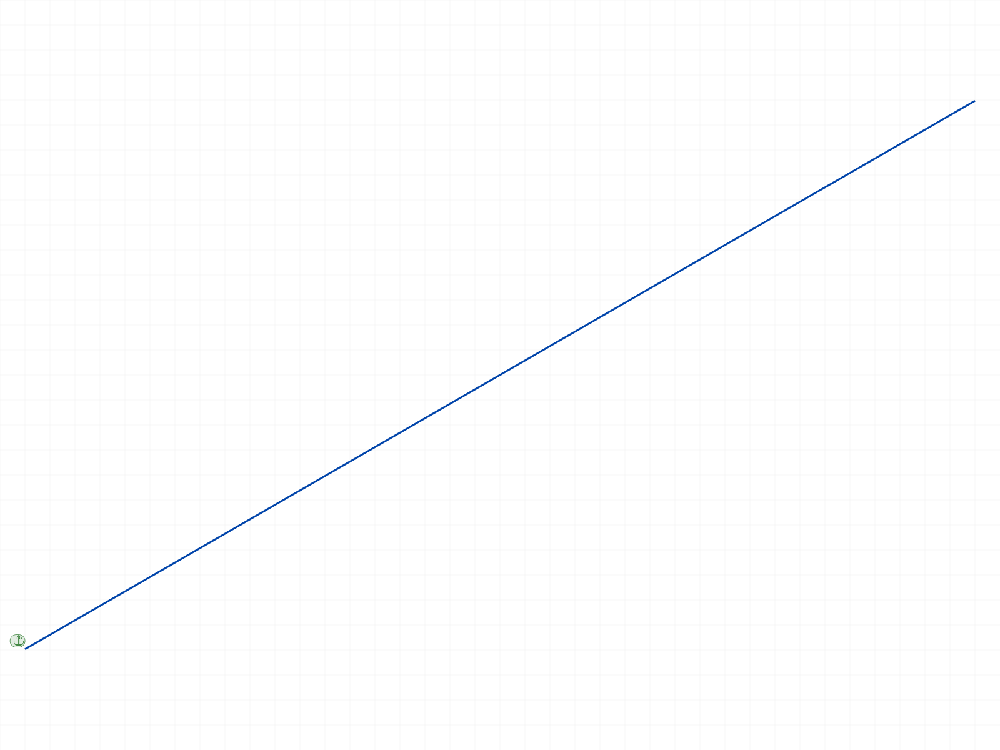 | 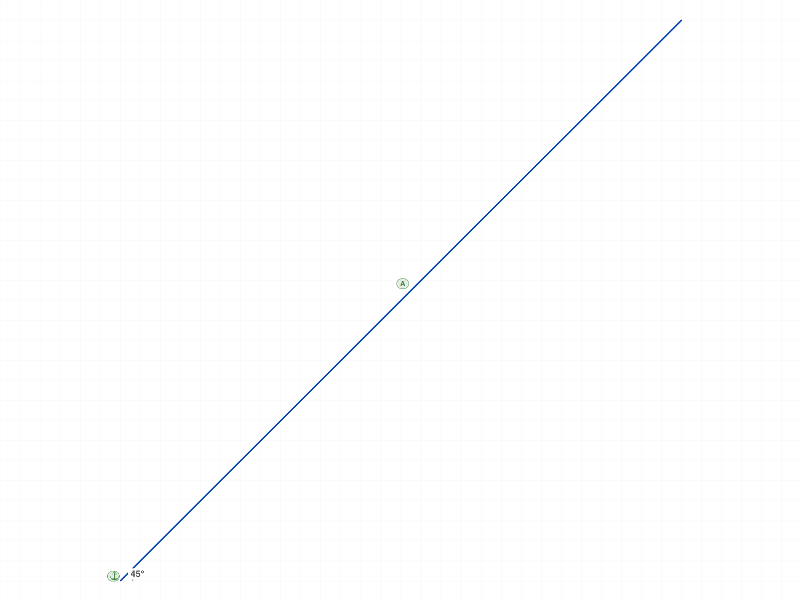 |
|---|---|

**Data:** Line ~30° from X axis, start fixed. ANGLEOX with `value:'45deg'`: maxLevel=31. End moved from (50, 28.87) to (40.83, 40.83). atan2(40.83, 40.83)=45°. ✅ Class: `CC_AngularFeatureDimension`. See `files/08-angleox-angleox-data.json`.

📌 LLM doc: ANGLEOX takes 1 line geomId. Measures angle of line relative to X axis. Value uses `deg` suffix.

---

## 09 — Batch creation and name param

Script: `scripts/09-batch-and-name.mjs` — ✅ Batch returns array of IDs, names work.

| 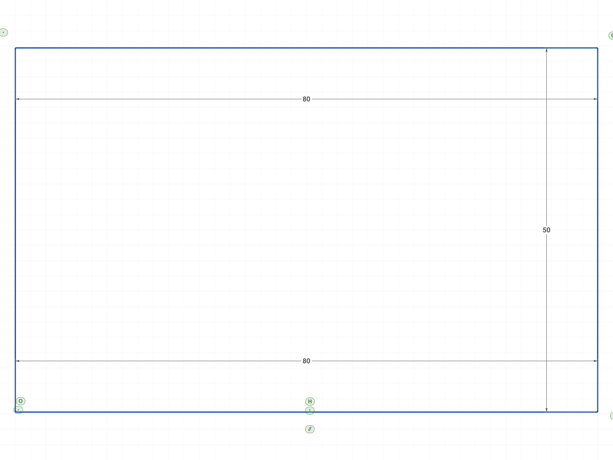 |
|---|

**Data:** Rectangle, batch of 3 OFFSET dimensions. Result: `[94, 98, 102]`, maxLevel=31. Named dims: "width" and "height" appear with their names in structure. Unnamed dim gets auto-name "Offset". See `files/09-batch-and-name-batch-name-data.json`.

📌 LLM doc: Batch creation: pass array of param objects. Returns array of IDs. `name` param sets custom dimension name in structure tree.

---

## 10 — Auto-calculated value (no value param)

Script: `scripts/10-auto-value.mjs` — ✅ Auto-value = current geometry measurement.

| 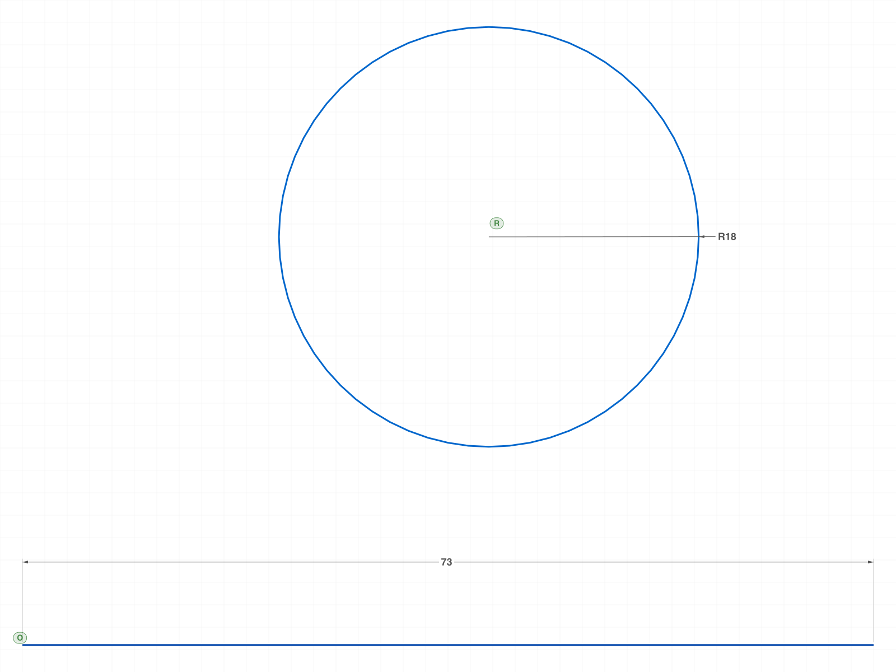 |
|---|

**Data:**
- Line 73 units: OFFSET auto-value captures current length. Structure has `startPt:(10,5)`, `endPt:(83,5)`. No explicit `value` member in linear dim — value is derived from start/end points.
- Circle r=18: RADIUS auto-value = 18. Structure has explicit `members.value:18` and `members.radius:18`.
- `getExpression` on dimension returns null (maxLevel=51) — dimensions aren't accessible via the expression API.

📌 LLM doc: Omitting `value` auto-calculates from current geometry. Locks the current measurement without resizing. RADIUS/DIAMETER have explicit `value` member; linear dims derive value from endpoints.

---

## 11 — Expression values

Script: `scripts/11-expression-value.mjs` — ⚠️ `@expr.` references fail in dimension value, but formulas work.

| 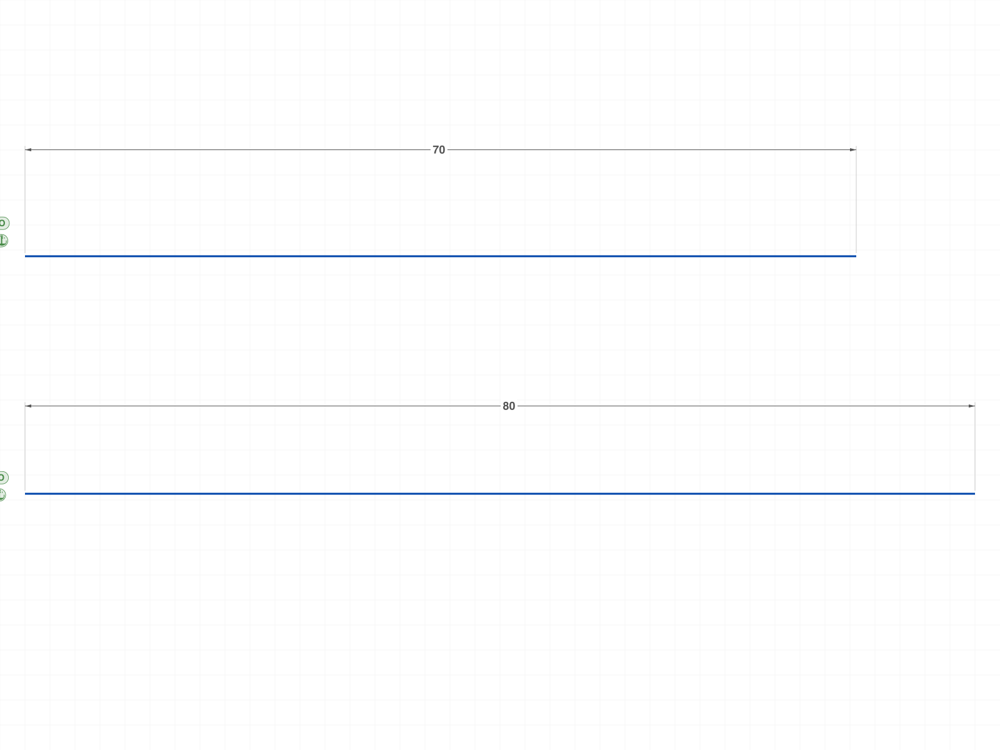 |
|---|

**Data:**
- `value: '@expr.myWidth'` → dimension created (ID 72) BUT maxLevel=51 and line NOT resized (stayed at x=80). Expression reference failed silently.
- `value: '60+10'` → maxLevel=31, line resized to 70 units. Formula expressions work.

**Learned:** `@expr.NAME` syntax does NOT work in the `value` parameter of `sketch.dimension`. Only numeric values and arithmetic expressions (like `'60+10'`) work. Use `updateDimension` with `@expr.` to link after creation.

📌 LLM doc: `value` accepts numbers and formula strings (e.g., `'60+10'`, `'45deg'`). `@expr.NAME` references do NOT work in `dimension()` — use `updateDimension` to link with expressions after creation.

---

## 12 — Reflex angle

Script: `scripts/12-reflex-angle.mjs` — ✅ `reflex:true` constrains the outer (>180°) angle.

| 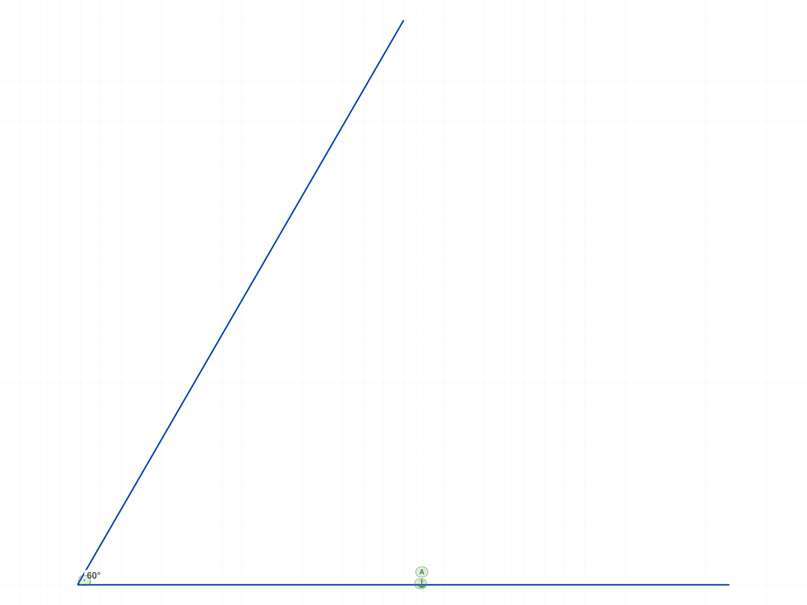 | 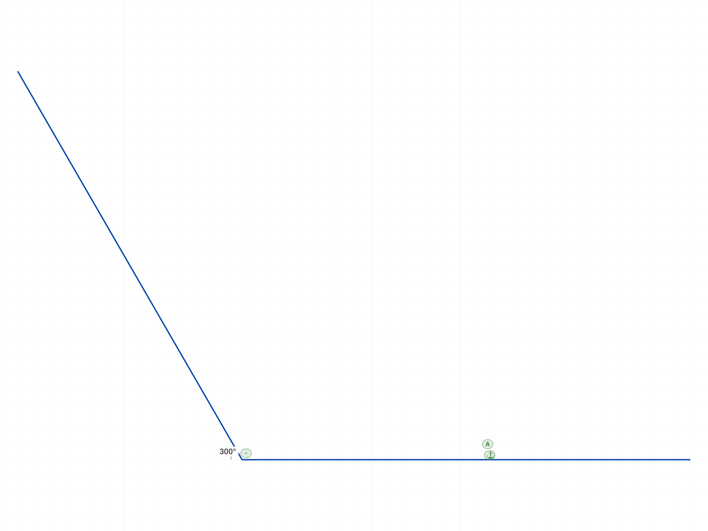 |
|---|---|

**Data:**
- Normal 60°: l2 end at (30.02, 51.99). Line in first quadrant. ✅
- Reflex 300° (with `reflex:true`): l2 end at (-30.02, 51.99). Line flipped to second quadrant — the "outside" angle from l1 is 300°. ✅

**Learned:** `reflex:true` measures the reflex (outer) angle. The `dimPos` parameter also affects which sector is constrained. For reflex angles, the value should be >180°.

📌 LLM doc: `reflex:true` measures the outer angle (>180°). Combined with `dimPos` to select the correct angular sector.

---

## 13 — OFFSET between two parallel lines

Script: `scripts/13-offset-two-lines.mjs` — ✅ Solver moved l2 from 30 to 50 units from l1.

| 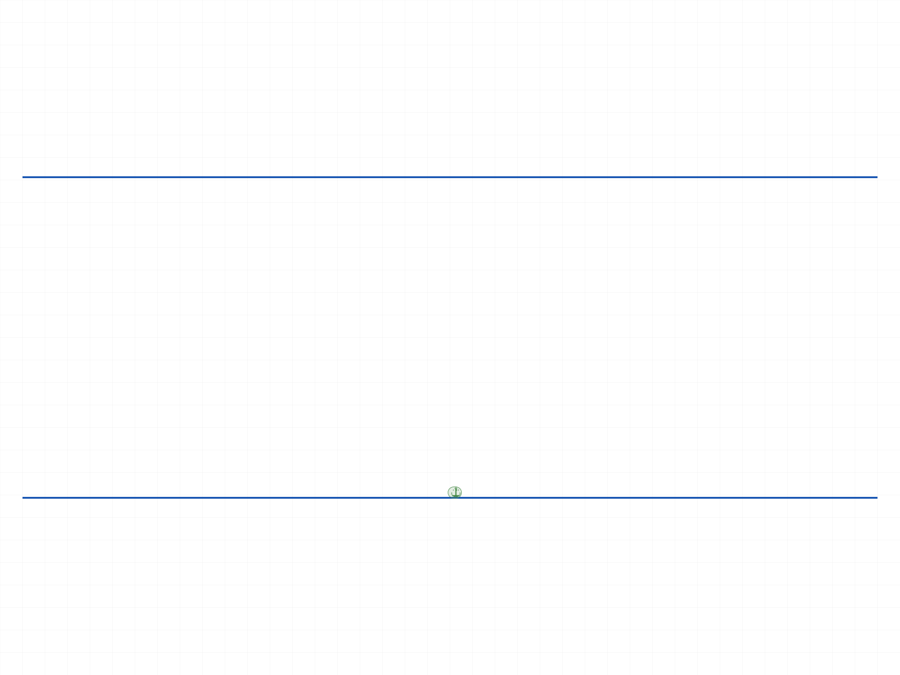 | 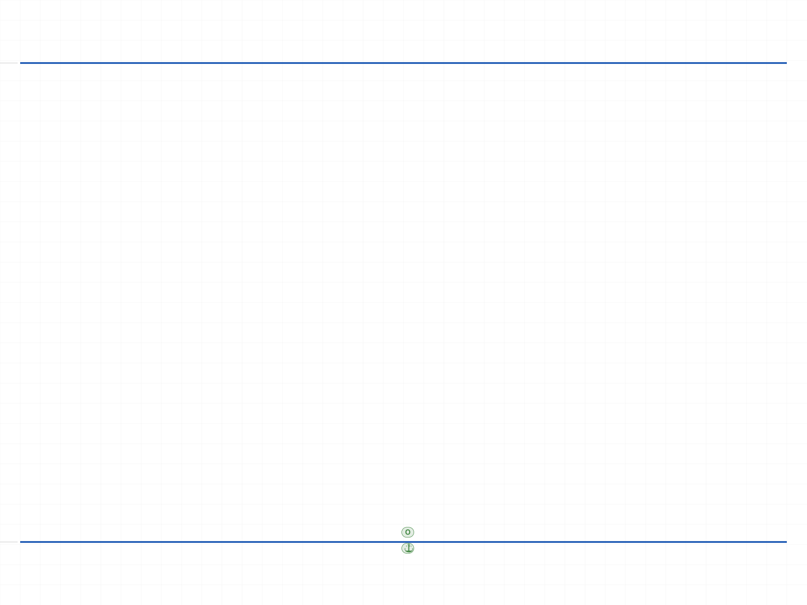 |
|---|---|

**Data:** l1 fixed at y=0, l2 at y=30. OFFSET with 2 geomIds and value=50: maxLevel=31. l2 moved to y=50. Class: `CC_LinearFeatureDimension`. See `files/13-offset-two-lines-offset-two-lines-data.json`.

📌 LLM doc: OFFSET with 2 line geomIds measures the perpendicular distance between them. Solver moves the unconstrained line.

---

## 14 — Error cases

Script: `scripts/14-error-cases.mjs` — Mixed results.

| Case | result | maxLevel | Error |
|---|---|---|---|
| RADIUS on line | null | 51 | "Datamember radius not found" |
| OFFSET on circle | null | 51 | "Wrong number of geometry ids for offset" |
| Invalid type | null | 51 | "not valid. Possible values are: [RADIUS, DIAMETER, OFFSET, H_DIST, V_DIST, ANGLE, ANGLEOX]" (code 1013) |
| Missing geomIds | null | 51 | "geomIds must be provided" (code 1004) |
| Missing type | null | 51 | "type must be provided" (code 1004) |
| ANGLE on 1 line | null | 51 | "Index 1 ausserhalb des Arraybereichs" (array OOB) |
| Negative OFFSET value | 77 | 51 | Created but solver couldn't set value — "Couldn't set the value for dimension" |

**Learned:** Most invalid inputs return null. But negative OFFSET value creates the dimension (gets an ID) then fails to set the value — the dimension exists in a broken state. Always check maxLevel even when result is non-null.

📌 LLM doc: Invalid geometry type → null. Missing params → null with specific error codes. Negative values may create broken dimensions (non-null ID but maxLevel=51). Always verify maxLevel ≤ 31.

---

## 15 — H_DIST and V_DIST between points

Script: `scripts/15-hdist-vdist-points.mjs` — ✅ Both work between point pairs.

| 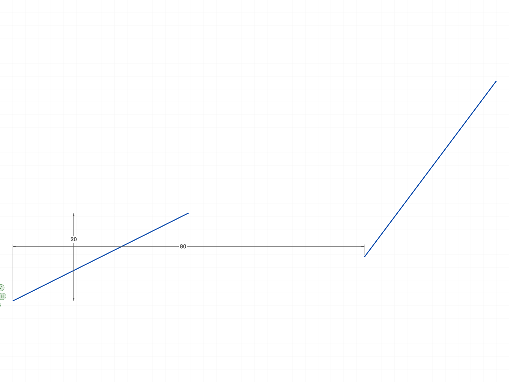 |
|---|

**Data:**
- H_DIST between l1.start(0,0) and l2.start with value=80: maxLevel=31. l2.start moved from x=60 to x=80.
- V_DIST between l1.start(0,0) and l1.end with value=20: maxLevel=31. l1.end moved from y=30 to y=20.

📌 LLM doc: H_DIST and V_DIST work with `geomIds: [point1, point2]`. Measures and constrains horizontal/vertical distance between two points.

---

## Coverage Checklist

- [x] All 7 dimension types tested (OFFSET, H_DIST, V_DIST, RADIUS, DIAMETER, ANGLE, ANGLEOX)
- [x] Required params: id, type, geomIds
- [x] Optional params: value, name, dimPos, reflex
- [x] Batch creation (array input → array output)
- [x] Auto-value (omit value → captures current geometry)
- [x] Expression values (@expr fails, formulas work, 'Ndeg' works for angles)
- [x] Solver resizes geometry when value differs from current state
- [x] Reflex angle (outer angle >180°)
- [x] Two-line OFFSET (perpendicular distance)
- [x] Point-to-point H_DIST and V_DIST
- [x] Error cases (wrong geometry type, missing params, negative values)
- [x] Structure tree classes documented for all types
