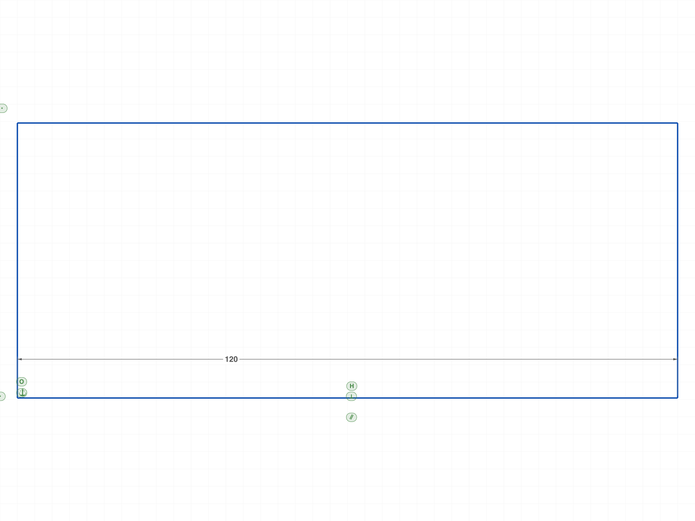
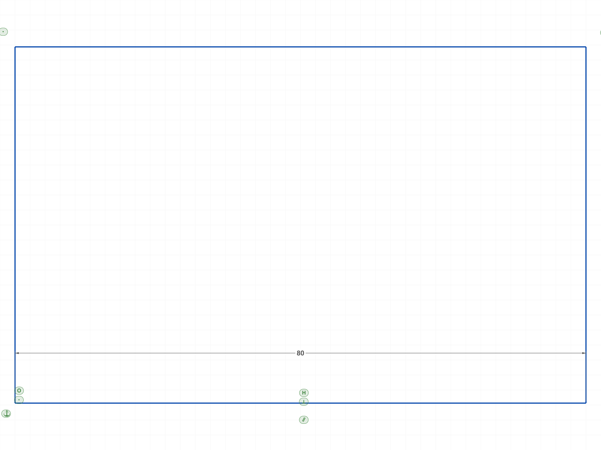
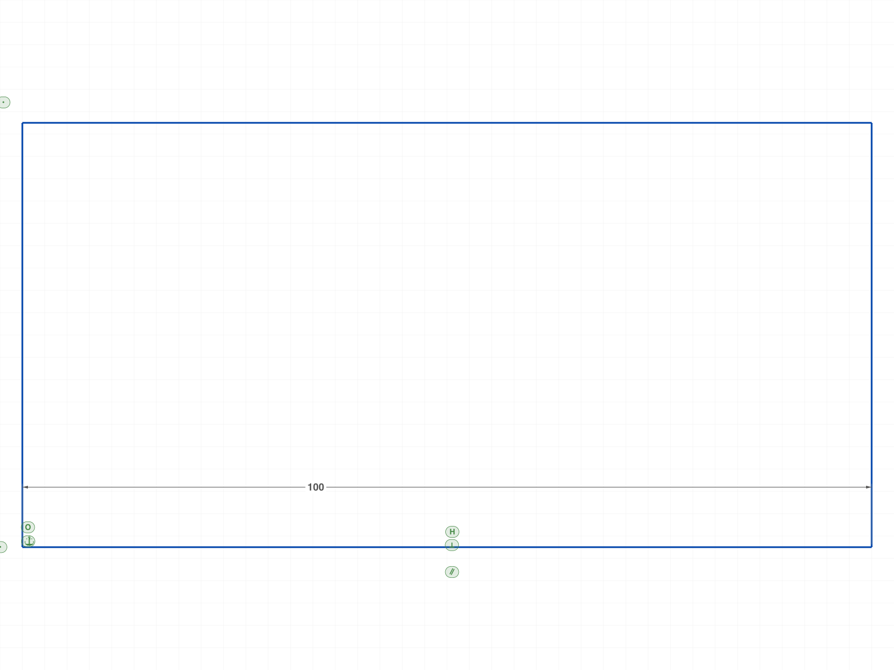
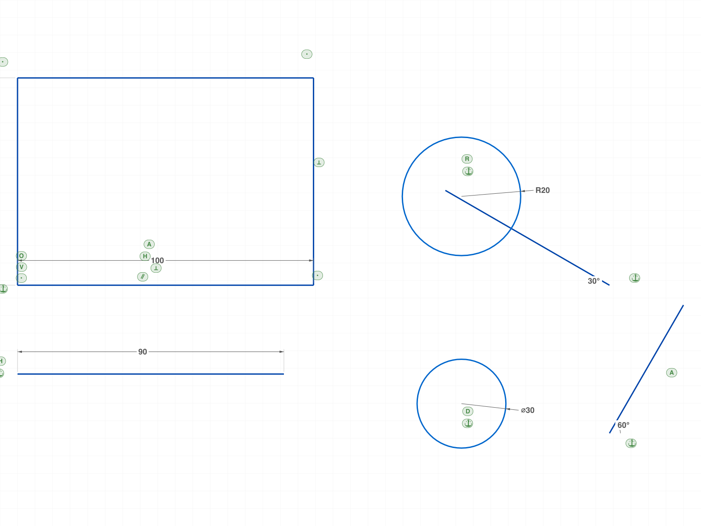
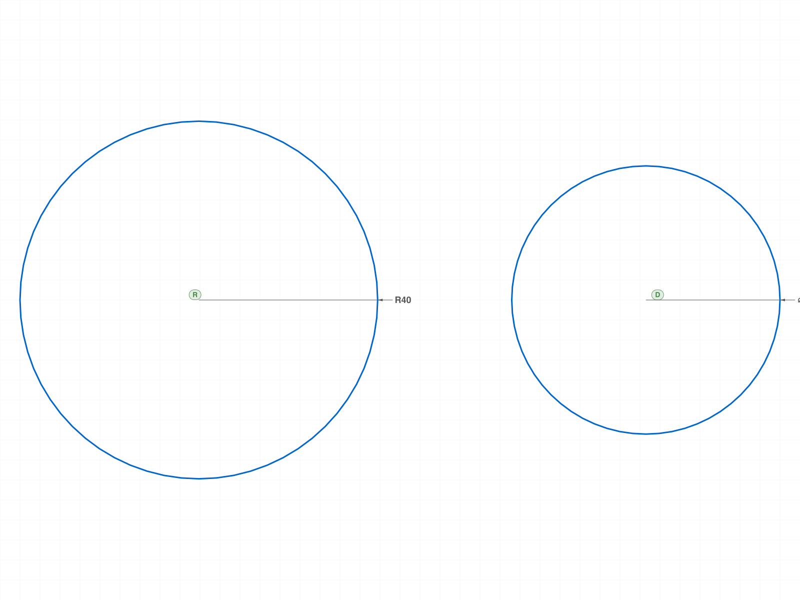
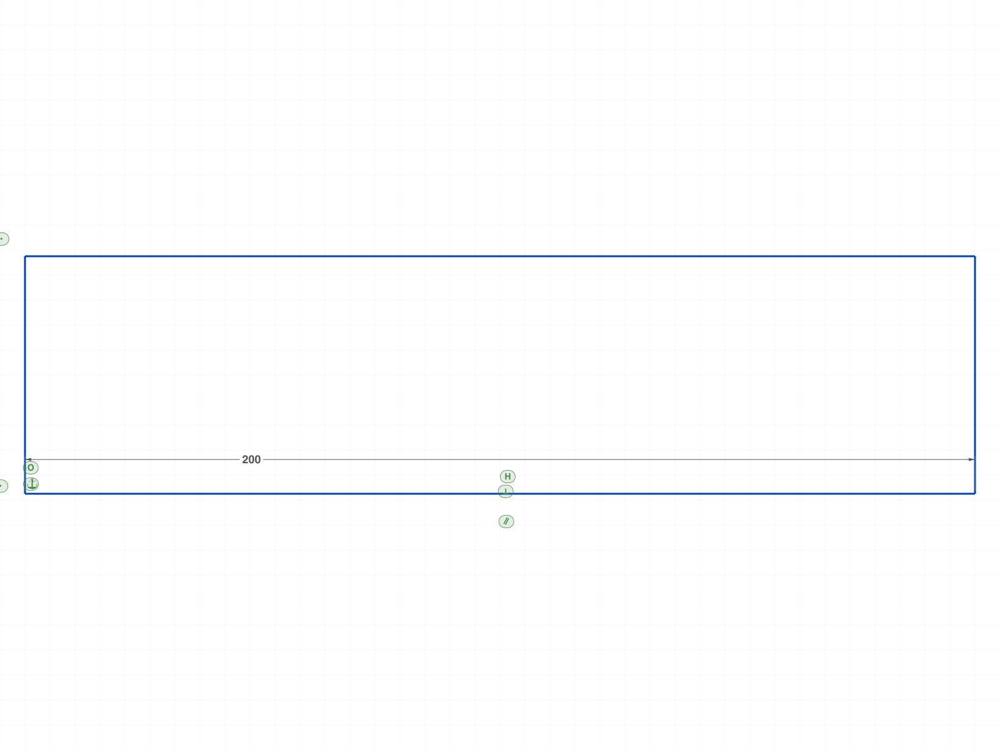

# Training: sketch.updateDimension

**Date:** 2026-04-14

## Goal

Testing `v1.sketch.updateDimension` — updates a dimension value and re-solves the sketch.

**Methods to cover:**

- `updateDimension` — basic numeric value change
- `updateDimension` — with expression string `'@expr.NAME'`
- `updateDimension` — with formula string `'50+10'`
- `updateDimension` — on each dimension type (OFFSET, HORIZONTAL_DISTANCE, VERTICAL_DISTANCE, RADIUS, DIAMETER, ANGLE, ANGLEOX)
- Return value: `result: boolean` (docs say boolean — actual behavior TBD)
- Edge cases: negative value, zero, very large, invalid dimension ID

**Questions:**

- Does the solver reposition geometry when value changes?
- Does `@expr.NAME` work (it doesn't work in `dimension` creation)?
- Does it require open/close feature editing?
- What happens with a value that over-constrains the sketch?
- Can you call it multiple times in sequence?

---

## 01 — Basic numeric update (OFFSET)

Script: `scripts/01-basic-numeric.mjs` — ✅ Rectangle bottom line extended from 80 to 120.

|  |  |
|---|---|

**Data:** Bottom line endX: 80 → 120. Right line moved accordingly (120, 50). updateDimension returned `result: 2` (not boolean true). maxLevel=31. See `files/01-basic-numeric-basic-update-data.json`.

**Learned:** `updateDimension` works. Solver resizes geometry immediately. Return value is NOT boolean — `result: 2` for a well-constrained sketch.

📌 LLM doc: updateDimension resizes geometry immediately. Return value is solver state, not boolean.

---

## 02 — @expr.NAME in updateDimension

Script: `scripts/02-expr-link.mjs` — ❌ @expr.NAME does NOT work. No error, no geometry change.

|  |  |
|---|---|

**Data:** updateDimension with `value: '@expr.myWidth'`: result=0, maxLevel=31 (no error), endX stayed at 80 (didn't change to 150). After updating expression to 200: endX still 80. See `files/02-expr-link-expr-link-data.json`.

**Learned:** `@expr.NAME` does NOT work in updateDimension. The API docs example `value: '@expr.distance1'` is wrong. result=0 means solver failed/unsolved.

📌 LLM doc: @expr.NAME does NOT work in updateDimension value param. Fails silently with result=0.

---

## 03 — Formula strings

Script: `scripts/03-formula-string.mjs` — ✅ All formulas evaluated correctly.

|  |
|---|

**Data:** `'50+70'` → endX=120 ✅. `'sqrt(2)*50'` → endX=70.71 ✅. `'100'` (string number) → endX=100 ✅. All returned result=2. See `files/03-formula-string-formula-data.json`.

📌 LLM doc: Formula strings work: arithmetic, math functions (sqrt, sin, etc.), string-encoded numbers.

---

## 04 — All 7 dimension types

Script: `scripts/04-all-dim-types.mjs` — Mixed results. Linear types work well, radial/angular less so when over-constrained.

|  |
|---|

**Data:** See `files/04-all-dim-types-all-types-data.json`.
- OFFSET: result=2, endX=100 ✅
- HORIZONTAL_DISTANCE: result=2, endX=90 ✅
- VERTICAL_DISTANCE: result=2 ✅ (line updated)
- RADIUS: result=0 (circle was FIXATION-locked — radius protected)
- DIAMETER: result=0 (circle was FIXATION-locked)
- ANGLE: result=0 but geometry DID move (diagEnd changed) — partial convergence?
- ANGLEOX: result=0 but geometry DID move — partial convergence

**Learned:** RADIUS/DIAMETER failed because circles had FIXATION (which protects radius). ANGLE/ANGLEOX returned 0 but still moved geometry — result=0 doesn't always mean "no change".

---

## 07 — RADIUS and DIAMETER without FIXATION

Script: `scripts/07-radius-no-fix.mjs` — ✅ Both work when circle is unconstrained.

|  |
|---|

**Data:** RADIUS update 20→40: result=1, radius=40 ✅. DIAMETER update 30→60 (radius 15→30): result=1, radius=30 ✅. Note: result=1 (not 2) because circles without FIXATION are under-constrained (center is free). See `files/07-radius-no-fix-radius-no-fix-data.json`.

**Learned:** RADIUS/DIAMETER update works fine on unconstrained circles. result=1 means solved but under-constrained.

📌 LLM doc: Return value meanings: 0=unsolved, 1=solved under-constrained, 2=well-constrained.

---

## 05 — Edge cases

Script: `scripts/05-edge-cases.mjs` — Zero works, negative fails silently, large works, sequential works.

|  |
|---|

**Data:** See `files/05-edge-cases-edge-cases-data.json`.
- Zero: result=2, endX=0 ✅ (line collapsed to zero length)
- Negative (-50): result=0, endX=50 ⚠️ (geometry moved to |value|, but solver reports unsolved)
- Very large (999999): result=2, endX≈999999 ✅
- Sequential (50→100→200): all result=2, endX correct ✅

**Learned:** Zero collapses geometry (valid). Negative values partially affect geometry (moves to absolute value?) but solver reports unsolved. Very large values work. Multiple sequential updates are fine.

📌 LLM doc: Zero is valid. Negative values fail silently (result=0), geometry may partially change. Sequential updates work.

---

## 06 — Error cases

Script: `scripts/06-error-cases.mjs` — All errors are clear and descriptive.

**Data:** See `files/06-error-cases-error-cases-data.json`.
- Wrong ID type (sketch/line/constraint): null, maxLevel=51, code 1001: "wrong id type! Provide only following id types: [\"dimension\"]"
- Invalid/nonexistent ID: null, maxLevel=51, codes 0+1006
- Missing value: null, maxLevel=51, code 1004
- Missing id: null, maxLevel=51, code 1004

📌 LLM doc: Error messages for wrong ID type, missing params, invalid ID.

---

## 08 — Return value semantics

Script: `scripts/08-return-values.mjs` — Confirmed: 0=unsolved, 2=solved.

**Data:** Same value (80→80): result=2. Different value (80→100): result=2. Over-constrained (both endpoints fixed + dimension changed): result=0, geometry kept old value (endX=100, not 120). See `files/08-return-values-return-values-data.json`.

**Learned:** result=0 on over-constrained sketches. The solver does not change geometry when it can't satisfy all constraints. No error raised (maxLevel=31).

📌 LLM doc: Over-constraining returns result=0 with no error. Geometry unchanged.

---

## 09 — Feature state (open/close not required)

Script: `scripts/09-feature-state.mjs` — ✅ Works without open/close feature editing.

**Data:** updateDimension with value=100 succeeded (result=2, endX=100) without any open/close calls. See `files/09-feature-state-feature-state-data.json`.

📌 LLM doc: No open/close feature editing required.

---

## 10 — linkWithExpression for dimensions

Script: `scripts/10-expr-via-link.mjs` — ❌ Failed. "Datamember myLen not found" on len.value.

**Data:** `linkWithExpression({ id: dimId, exprName: 'myLen', name: 'value' })` → error code 0, level 51: "Evaluation error in len.value: Datamember myLen not found". See `files/10-expr-via-link-expr-via-link-data.json`.

---

## 11 — Expression syntax variations

Script: `scripts/11-expr-syntax.mjs` — ❌ All fail. Bare name, @expr., formula ref, $prefix — all result=0.

**Data:** All four variants returned result=0, maxLevel=31, no error messages, geometry unchanged. See `files/11-expr-syntax-expr-syntax-data.json`.

📌 LLM doc: Expression binding is NOT supported for dimensions. Neither @expr.NAME in updateDimension nor linkWithExpression works. Only literal numbers and formula strings.

---

## 12 — Dimension structure tree

Script: `scripts/12-dim-structure.mjs` — Dimension has no `value` member. Value is implied by startPt/endPt.

**Data:** CC_LinearFeatureDimension members: master, _VERSION, orientationType, startPt, endPt, angle, valHandlePos, valHandleBehaviour, dimPt, classification, paramName, displayInfo. No `value` member. linkWithExpression failed on all members (null, maxLevel=31). See `files/12-dim-structure-dim-node.json`, `files/12-dim-structure-link-results.json`.

📌 LLM doc: Dimensions don't have a linkable `value` member. This is why linkWithExpression doesn't work for dimensions.

---

## Summary

### Key Findings

1. **updateDimension works for numeric values and formula strings.** Geometry resizes immediately.
2. **Return value is NOT boolean** — it's a solver state: 0=failed/unsolved, 1=under-constrained but solved, 2=well-constrained.
3. **Expression binding does NOT work for dimensions.** @expr.NAME in updateDimension fails silently (result=0). linkWithExpression fails because dimensions have no linkable `value` member. The API docs are wrong about @expr support.
4. **No open/close feature editing required.**
5. **Works on all 7 dimension types** (OFFSET, H_DIST, V_DIST, RADIUS, DIAMETER, ANGLE, ANGLEOX).
6. **Edge cases:** Zero is valid. Negative values fail silently. Very large values work. Sequential updates work.
7. **Over-constraining:** returns result=0, no error, geometry unchanged.
