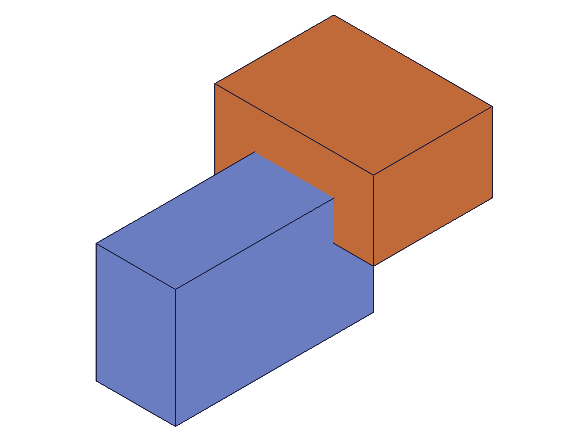
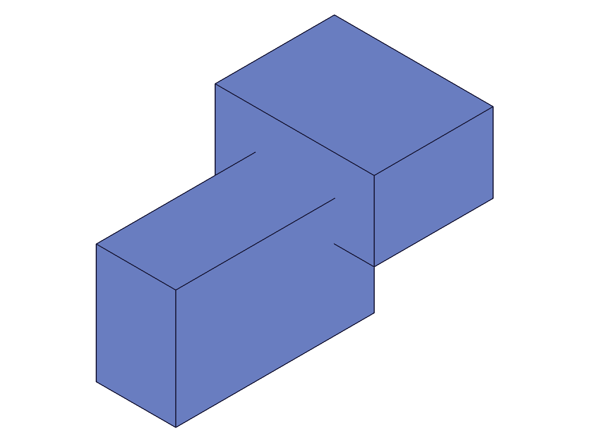
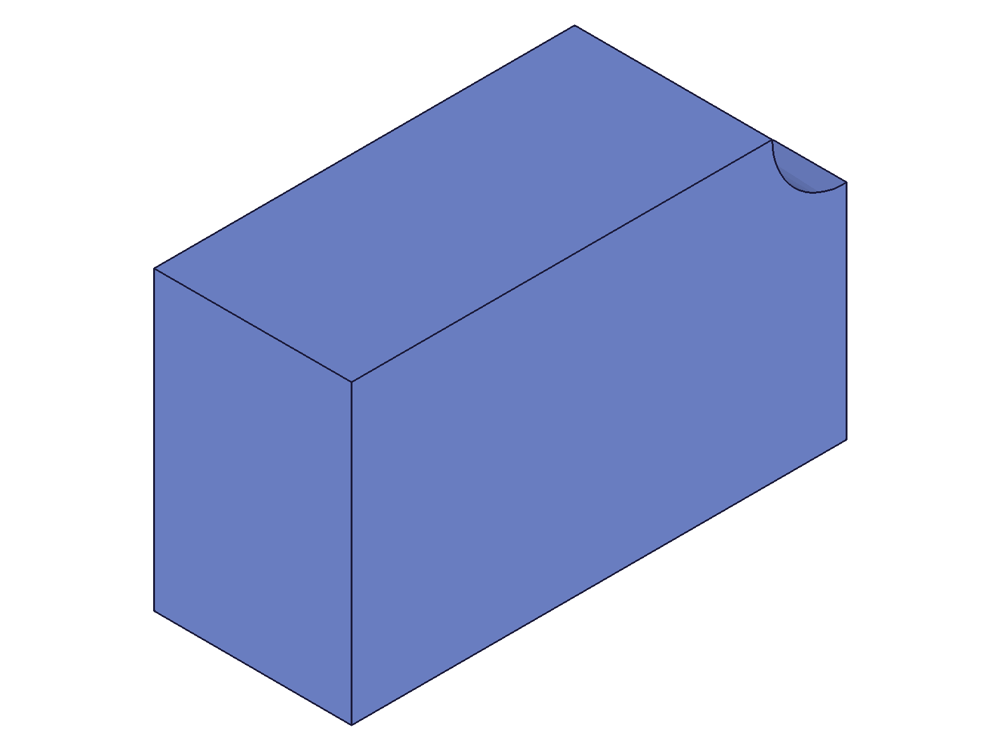

# Training: solid.merge

**Date:** 2026-04-14

## Goal

Testing `v1.solid.merge` — documented as "NOT a union". Same target/tools/keepTools parameter pattern as boolean ops, but different semantics.

**Methods to cover:**

- `merge` — basic call with two overlapping solids
- `merge` — two non-overlapping (disjoint) solids
- `merge` params: id, target, tools, keepTools
- `merge` — multiple tools in one call
- `merge` — keepTools: true vs false (default)
- No `updateMerge` exists in the API docs

**Questions:**

- What does merge actually do if it's not a union? Does it combine topology without boolean computation?
- Does it create a compound solid (multiple shells under one ID) like disjoint union?
- Does the target solid ID remain valid? Is it returned?
- What happens to tool solid IDs after merge (consumed like boolean ops)?
- How does the result differ from union visually and in structure data?
- What happens with overlapping bodies — does it resolve the intersection or leave double walls?
- Can you merge a solid with itself (self-merge)? Does it hang like self-union?
- Edge case: empty tools array

---

## 01 — Basic merge of two overlapping boxes

Script: `scripts/01-basic-merge.mjs` — ✅ merge succeeds. Returns target ID (61), maxLevel=31.

|  |  |
| --- | --- |

**Data:** merge result=61 (target ID), maxLevel=31, messages=[]. Copy of box2 (tool) after merge with `solid` param failed — later found to be wrong param name (see script 18).

**Learned:** Basic merge works. Two separate colored bodies become one single-color body. Tool solid appears consumed by default.

## 05 — Graphic comparison: merge vs union topology

Script: `scripts/05-graphic-deep.mjs` — ✅ reveals key structural difference.

**Data (merge):** 1 container, 12 meshes (ALL 4 verts / 2 tris each), 24 edges.
**Data (union):** 1 container, 12 meshes (some 6 verts/4 tris, some 8 verts/6 tris), 30 edges.

**Learned:** Merge preserves ALL original faces from both bodies — 6 per box × 2 = 12, each a flat quad (4 verts, 2 tris). Union computes the boolean intersection, splitting faces where bodies overlap, creating L-shaped faces with more triangles. The vertex/edge count difference proves merge does NOT resolve overlapping geometry — it simply concatenates shells.

**📌 LLM doc:** This is the core finding. Merge = geometry concatenation, not boolean computation. Overlapping regions retain internal/double walls.

## 06 — Disjoint (non-overlapping) merge

Script: `scripts/06-disjoint-merge.mjs` — ✅ succeeds, same pattern.

**Data:** 1 container, 12 meshes, 24 edges. Same as overlapping merge.

**Learned:** Disjoint merge behaves identically to overlapping merge — simply combines faces under one ID.

## 08 — Multiple tools

Script: `scripts/08-multiple-tools.mjs` — ✅ three boxes merged in one call.

**Data:** 1 container, 18 meshes (6×3), 36 edges (12×3). Both tool IDs consumed (copy failed, but this was due to wrong param name — see script 18 correction).

**Learned:** Multiple tools in one call works. Meshes scale linearly: 6 per box primitive.

## 09 — Empty tools array

Script: `scripts/09-empty-tools.mjs` — ✅ silent no-op.

**Data:** result=61 (target ID), maxLevel=31. No error, no change.

**Learned:** Empty tools array is a no-op, same as union. Succeeds silently.

## 10 — Self-merge (same ID as target and tool)

Script: `scripts/10-self-merge.mjs` — ❌ **SERVER HANG.** 100% CPU, no response.

**Data:** Worker PID went to 99.3% CPU. Harness timed out after 30s. Had to `kill -9` the worker and restart.

**Learned:** Self-merge (`target: X, tools: [X]`) causes the same infinite loop as self-union. Never pass the same solid ID as both target and tool.

**📌 LLM doc:** CRITICAL gotcha — self-merge hangs the server, identical to self-union.

## 11 — Mixed primitives (box + cylinder + sphere)

Script: `scripts/11-mixed-primitives.mjs` — ✅ works with different primitive types.

**Data:** 1 container, 10 meshes (6 box + 3 cylinder + 1 sphere), 16 edges.

**Learned:** Merge works across primitive types. Face counts match expectations per primitive.

## 12 — Merge then boolean subtraction

Script: `scripts/12-merge-then-boolean.mjs` — ✅ boolean ops work on merged solids.

|  |
| --- |

**Data:** Merge succeeded (maxLevel=31), then subtraction of cylinder from merged result succeeded (maxLevel=31). 7 meshes remain after cut.

**Learned:** Merged solids are valid targets for boolean operations. This is a practical workflow: merge first to combine geometry, then use booleans on the result.

**📌 LLM doc:** Document that merged solids can be used as targets for union/subtraction/intersection.

## 13 — Cross-EIF merge

Script: `scripts/13-merge-cross-eif.mjs` — ✅ works across entity injection features.

**Data:** box1 in eif1, box2 in eif2. Merge with `id: eif1, target: box1, tools: [box2]` succeeded (maxLevel=31).

**Learned:** Tools can come from a different EIF than the target. The `id` param specifies the target EIF.

**📌 LLM doc:** Cross-EIF merge is supported.

## 14 — Merge chaining

Script: `scripts/14-merge-chaining.mjs` — ✅ sequential merges on same target.

**Data:** Two successive merges, both returning target ID 61. Final state: 18 meshes (6×3), 36 edges.

**Learned:** Target ID remains stable across multiple merge calls. Chaining works.

## 15 — keepTools detailed comparison

Script: `scripts/15-keeptools-detailed.mjs` — both keepTools values produce identical topology (12 meshes, 24 edges, 1 container). Copy test used wrong param name (`solid` instead of `target`) — see script 18 for correction.

## 17 — Copy of merged solid

Script: `scripts/17-merge-copy-fixed.mjs` — ✅ copy works with correct `target` param.

**Data:** Merged solid (12 meshes) copied successfully to new ID 66 (12 meshes). The copy preserves the compound structure.

**Learned:** Merged solids can be copied with `solid.copy`. The compound geometry is preserved in the copy.

## 18 — keepTools retest with correct copy syntax

Script: `scripts/18-keeptools-retest.mjs` — ✅ keepTools DOES work for merge.

**Data:**
- keepTools=true: copy of tool box2 succeeds (result: 66, maxLevel: 31)
- keepTools=false: copy of tool box4 fails ("invalid id", code 1006, maxLevel: 51)

**Learned:** keepTools works identically to boolean ops. With true, tool IDs remain valid. With false (default), tool IDs are consumed and become invalid. Earlier scripts (07, 15, 16) falsely concluded keepTools didn't work — that was caused by using wrong param name (`solid` instead of `target`) for the copy API.

**📌 LLM doc:** keepTools works for merge, same semantics as booleans. Correct earlier wrong conclusion.

---

## Summary of findings

1. **Merge = geometry concatenation**, not boolean computation. Faces from all sources are combined under one solid ID without resolving overlaps. Internal/double walls remain.
2. **Topology difference from union:** Merge preserves all original faces as-is (flat quads). Union computes intersections, splitting faces at overlap boundaries. Merge has fewer vertices/edges than union for the same input.
3. **Same parameter pattern** as union/subtraction/intersection: `id`, `target`, `tools`, `keepTools`.
4. **keepTools** works identically to boolean ops: false=tools consumed, true=tools preserved.
5. **Self-merge hangs the server** — same infinite loop as self-union. Never do this.
6. **Empty tools** = silent no-op.
7. **Cross-EIF merge** supported.
8. **Chaining** works — target ID is stable.
9. **Merged solids work with booleans** — can be used as target for union/subtraction/intersection.
10. **No `updateMerge`** exists.
