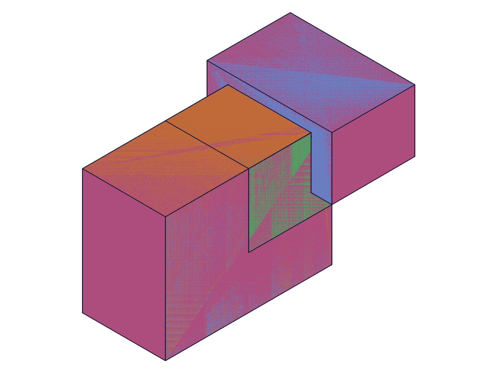
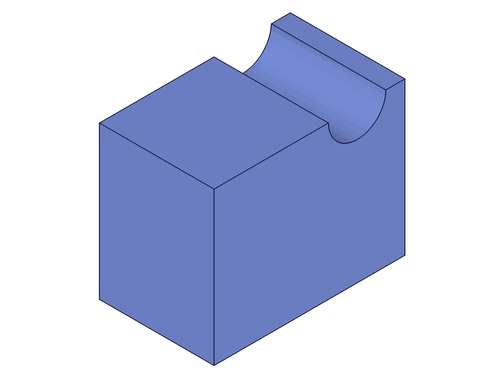
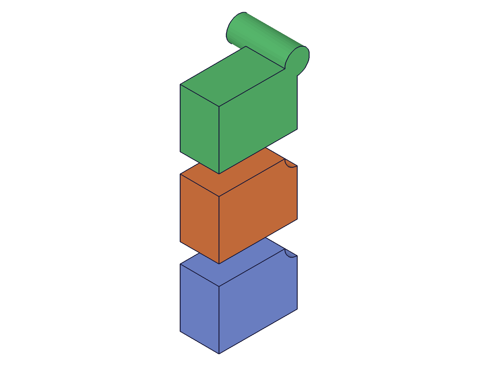
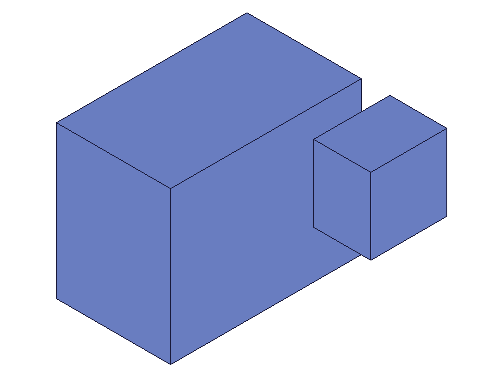
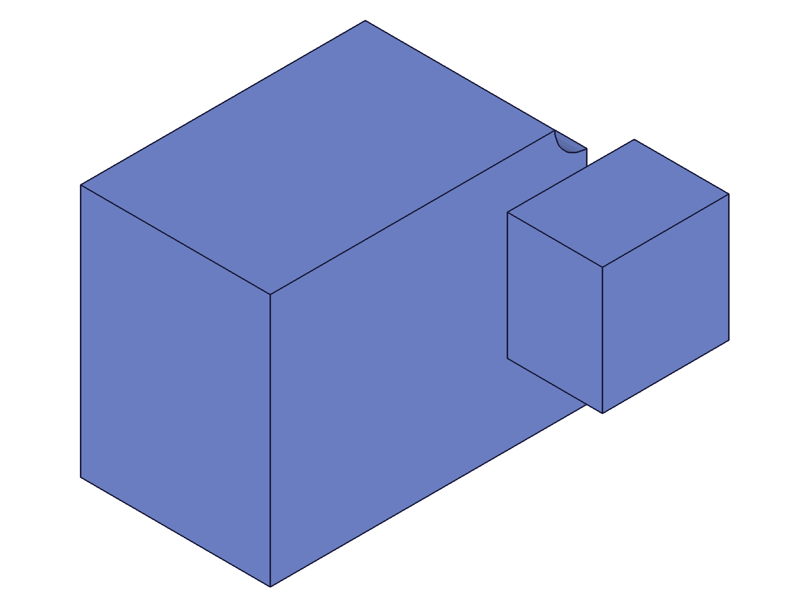
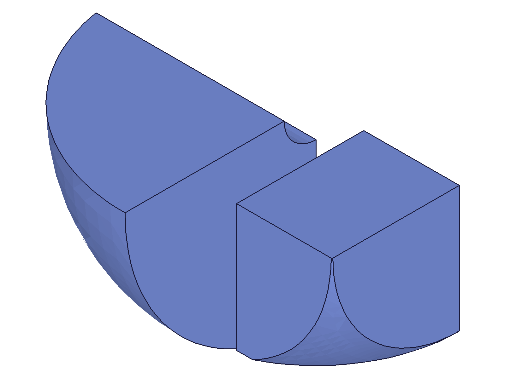
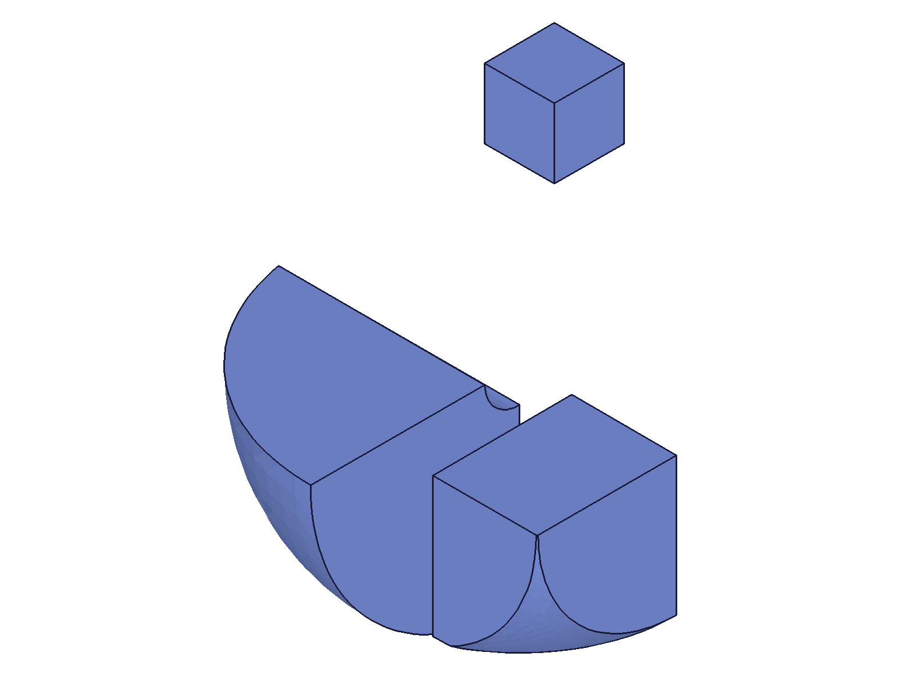

# Training: target/tools pattern — cross-cutting boolean study

**Date:** 2026-04-14

## Goal

Studying the `target`, `tools[]`, `keepTools` pattern shared by `solid.union`, `solid.subtraction`, `solid.intersection`, and `solid.merge`. Individual APIs were already trained — this session verifies the pattern is universal and explores cross-cutting behavior.

**Questions to answer:**

- Is the parameter signature truly identical across all 4 operations?
- Is `keepTools` behavior identical across all 4? (tool IDs valid/invalid after call)
- Does `tools: []` (empty array) behave the same across all 4? (no-op)
- Does tool ordering matter? (e.g., `tools: [A, B]` vs `tools: [B, A]`)
- Can tools come from a different EIF than the target?
- Can a single tool be reused across multiple boolean calls (with `keepTools: true`)?
- What is the return value pattern across all 4? (always target ID? always same maxLevel?)
- Self-referencing (target === tool) — confirmed hang across all 4? (SKIPPED — known from individual API training, too dangerous to re-verify)
- What happens when you chain different boolean types (union then subtract then intersect)?
- Are there any subtle differences in how `merge` handles the pattern vs the true booleans?

---

## 01 — signature uniformity

Script: `scripts/01-signature-uniformity.mjs` — ✅ All 4 operations accept identical `{ id, target, tools, keepTools }` signature. All return the target solid ID with maxLevel=31 on success.

|  |
|---|

**Data:** `files/01-signature-uniformity-signature-results.json` — all 4 show `targetReturned: true`, `maxLevel: 31`.

**📌 LLM doc:** The parameter signature is identical across union, subtraction, intersection, and merge.

---

## 02 — keepTools uniformity

Script: `scripts/02-keeptools-uniformity.mjs` — ✅ `keepTools` behavior is perfectly uniform across all 4 operations.

**Data:** `files/02-keeptools-uniformity-keeptools-results.json`
- `keepTools: true` → tool alive (translation succeeds, moveMaxLevel=31) for all 4
- `keepTools: false` (default) → tool dead (translation fails, moveMaxLevel=51) for all 4

**📌 LLM doc:** keepTools behavior is identical across all 4 operations.

---

## 03 — empty tools array

Script: `scripts/03-empty-tools.mjs` — ✅ `tools: []` is a no-op across all 4. Returns target ID, maxLevel=31, no messages.

**Data:** `files/03-empty-tools-empty-tools-results.json` — uniform no-op behavior.

**📌 LLM doc:** Empty tools array is a universal no-op.

---

## 04–05 — tool ordering

Script: `scripts/04-tool-ordering.mjs` — Vertex count from graphic was 0 (graphic iteration logic wrong for this response format). Inconclusive on data alone.

Script: `scripts/05-tool-ordering-v2.mjs` — ✅ Created identical geometry with `tools: [A, B]` vs `tools: [B, A]` for subtraction. Structure files are **exactly the same size** (21052 bytes). Snapshots visually identical.

|  |  |
|---|---|

**Data:** Structure trees at `files/05-tool-ordering-v2-structure-AB.json` and `files/05-tool-ordering-v2-structure-BA.json` — both 21052 bytes.

**📌 LLM doc:** Tool ordering in the `tools` array does not affect the result. Operations are order-independent.

---

## 06 — tool reuse with keepTools

Script: `scripts/06-tool-reuse-keeptools.mjs` — ✅ A single tool can be reused across different boolean operation types with `keepTools: true`. Created one cylinder tool, used it in: subtraction on box1 (keep) → translate → subtraction on box2 (keep) → translate → union on box3 (consume). All 3 operations succeeded. After final consume, tool is dead (maxLevel=51 on translate).

|  |
|---|

**Data:** `files/06-tool-reuse-keeptools-reuse-results.json` — sub1: maxLevel=31, sub2: maxLevel=31, union3: maxLevel=31, toolConsumed: true.

**📌 LLM doc:** Tools with `keepTools: true` can be moved and reused across different operation types. The last operation can consume the tool.

---

## 07 + 10 — chaining mixed operations (and the intersection mystery)

Script: `scripts/07-chain-mixed-ops.mjs` — Chain: union → subtraction → intersection → merge on same target ID. Intersection returned null/maxLevel=51, but merge afterwards succeeded (maxLevel=31). Seemed contradictory.

Script: `scripts/10-intersection-chain-mystery.mjs` — Reproduced exact chain. **Root cause found:** The intersection used `solid.sphere({ diameter: 120, ... })` but sphere takes `radius`, not `diameter`. Sphere creation silently failed (unknown param ignored), returned null. Then `tools: [null]` caused error code 1001 (wrong type). The target was **never destroyed** — the intersection simply errored out, leaving the target intact.

**Learned:** The script 07 "mystery" was a bug in my script (wrong param name), not surprising server behavior. Intersection does NOT destroy targets when the operation errors for parameter reasons.

---

## 12 — corrected chain test

Script: `scripts/12-chain-corrected.mjs` — ✅ With correct `radius` for sphere: union → subtraction → intersection → merge all succeed on the same target (ID=61). Target ID is stable through all 4 operations.

|  |  |
|---|---|
|  |  |

**Data:** `files/12-chain-corrected-chain-corrected-results.json` — all 4 return same target ID (61), all maxLevel=31.

**📌 LLM doc:** Target ID is stable across arbitrarily mixed boolean chains. You can freely alternate between union, subtraction, intersection, and merge on the same target.

---

## 08 — destroyed target behavior

Script: `scripts/08-destroyed-target-reuse.mjs` — Tested what happens when you operate on a truly destroyed target (intersection of non-overlapping boxes, code 1014).

**Results after target destruction:**
- `solid.translation` → **silent no-op** (maxLevel=31, no error)
- `solid.union` → **null, maxLevel=51**, error: "There must be two valid solids to perform a boolean operation"
- `solid.merge` → **returns target ID (61!), maxLevel=51**, error: "There must be two valid solids to perform a merge operation"

**Learned:** Destroyed target behavior is NOT uniform across operations. Translation is a silent no-op. Union returns null. Merge returns the dead target ID with an error. The merge return value is particularly misleading — you get the target ID back but maxLevel=51 signals failure.

**📌 LLM doc:** After a target is destroyed (code 1014), different operations respond differently. Always check maxLevel, not just the return value.

---

## 09 — multi-tool vs sequential

Script: `scripts/09-multi-vs-sequential.mjs` — ✅ `tools: [A, B, C]` in one call produces identical results to 3 sequential single-tool calls. Structure trees are exactly the same size (21055 bytes for both).

**Data:** `files/09-multi-vs-sequential-multi-structure.json` (21055 bytes) vs `files/09-multi-vs-sequential-seq-structure.json` (21055 bytes).

**📌 LLM doc:** Multi-tool and sequential single-tool calls are equivalent. Multi-tool is preferred (fewer API calls).

---

## 11 — invalid tool IDs

Script: `scripts/11-invalid-tool-ids.mjs` — ✅ Error handling for invalid tool IDs is uniform across all 4 operations:
- `tools: [null]` → code 1001 (wrong type), maxLevel=51
- `tools: [99999]` → code 0 (generic), maxLevel=51
- `tools: ["bad"]` → code 0 (generic), maxLevel=51

**Data:** `files/11-invalid-tool-ids-invalid-tool-results.json`

**📌 LLM doc:** Invalid tool ID error handling is uniform.

---

## 13 — cross-EIF tools

Script: `scripts/13-cross-eif-tools.mjs` — ✅ All 4 operations accept tools from a different EIF than the target. All succeed with maxLevel=31.

**📌 LLM doc:** Cross-EIF boolean operations are supported for all 4 operations, not just merge.

---

## 14–15 — `id` parameter semantics

Script: `scripts/14-id-param-mismatch.mjs` — The `id` param does NOT need to match the target's or tool's EIF. Passing a different EIF works fine for all booleans.

Script: `scripts/15-id-param-irrelevant.mjs` — But `id` IS validated: must be an entity injection type. Passing partId → error code 1001 ("wrong id type, provide entityinjection"). Passing 99999 → code 1006 ("invalid id").

**Learned:** For boolean ops, `id` must be a valid entity injection feature, but it doesn't need to be the one owning the target or tools. The actual solids are resolved by their own IDs. The `id` param likely establishes scope/context but doesn't restrict which solids can participate.

**📌 LLM doc:** The `id` param must be a valid EIF but need not match where target/tools live. Cross-EIF operations work freely.
