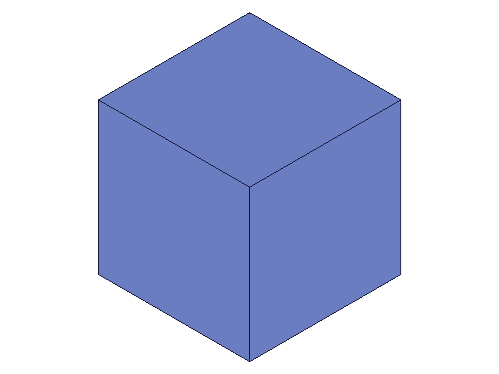
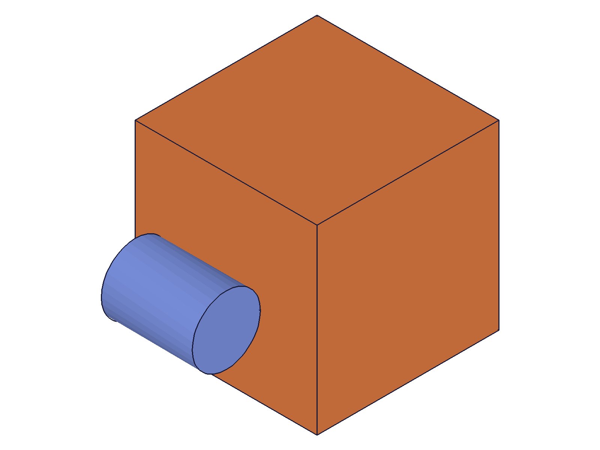
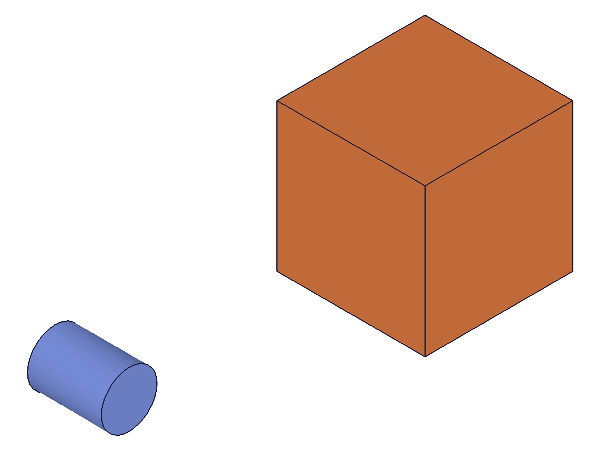
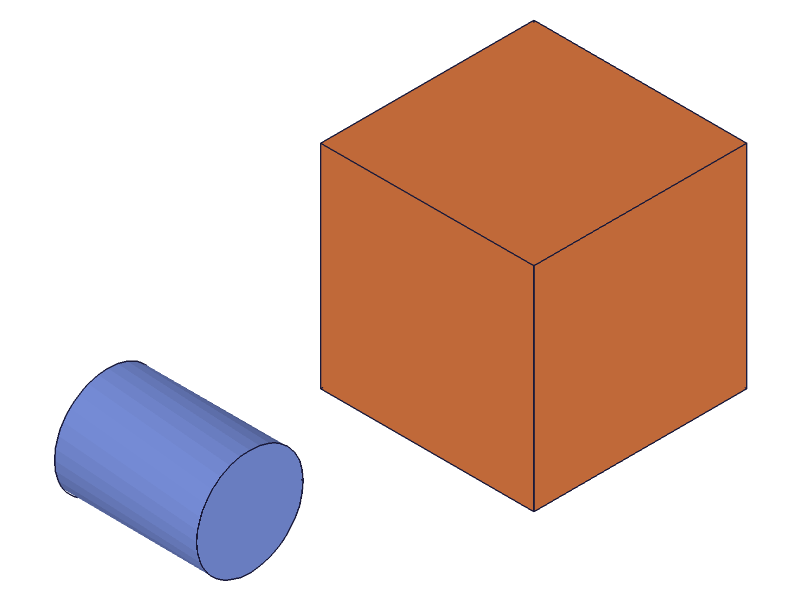
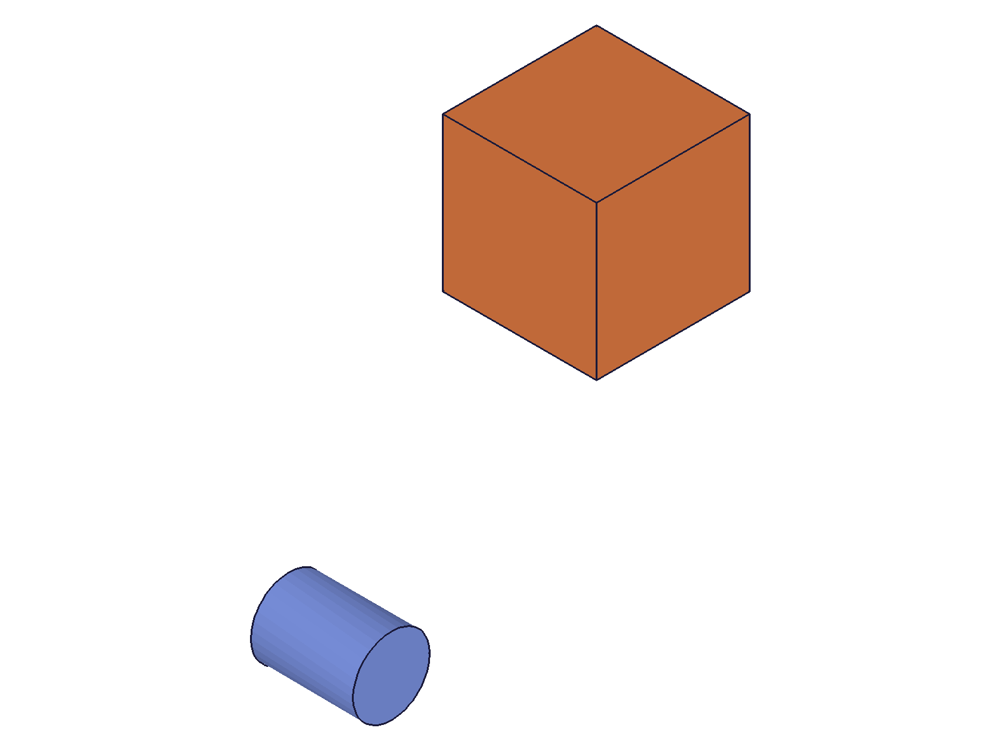
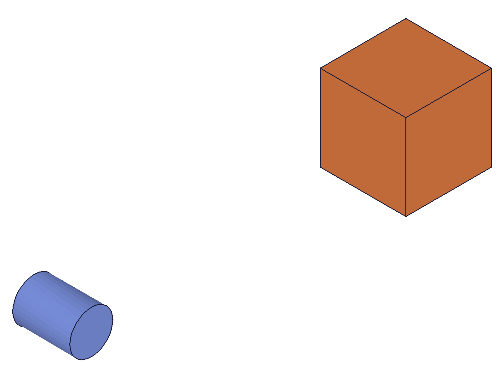
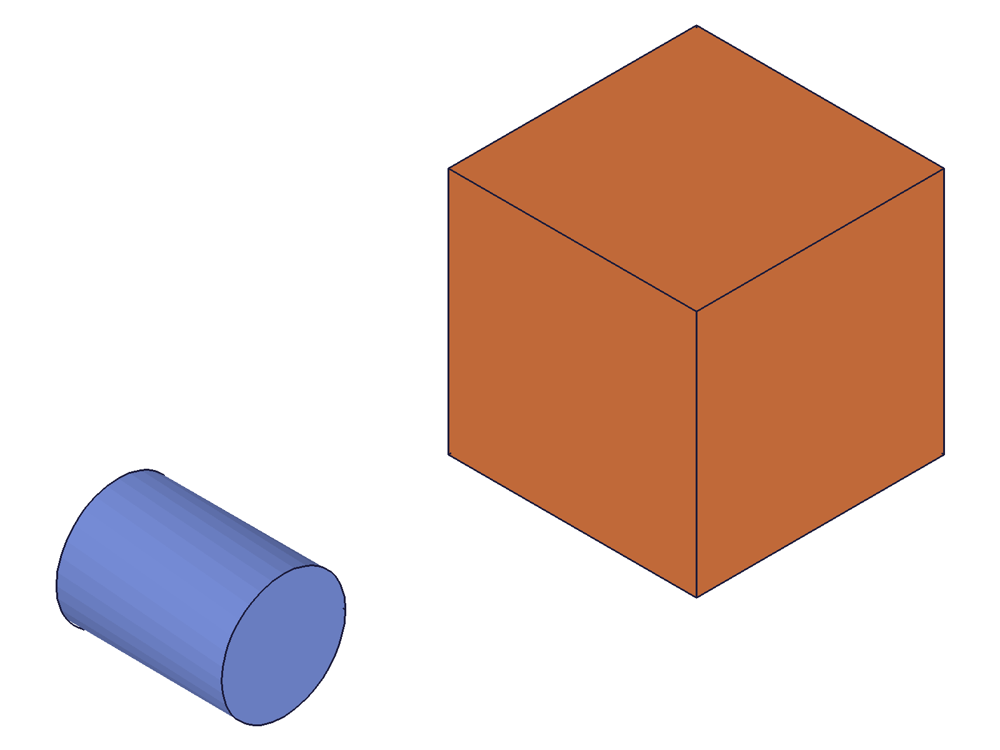
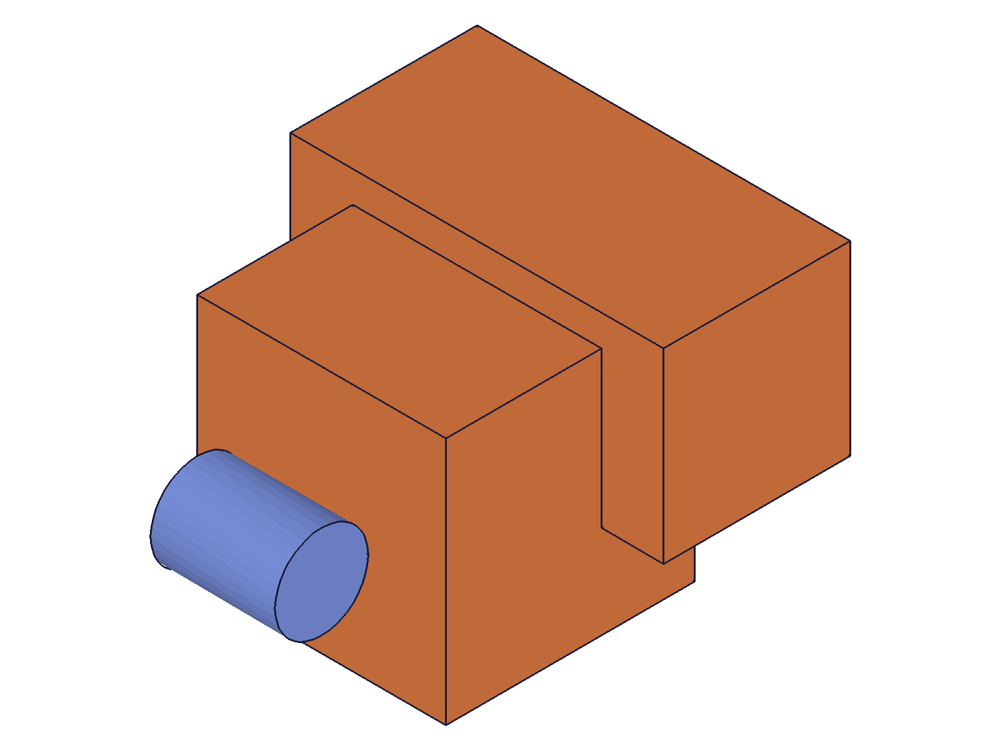
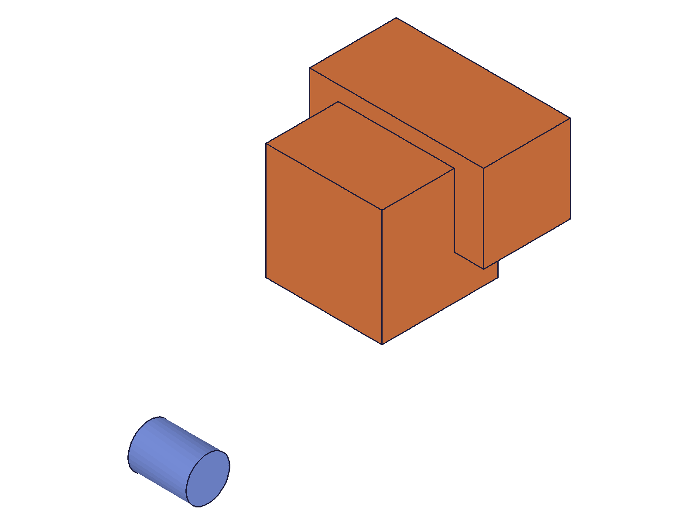

# Training: solid.translation

**Date:** 2026-04-14

## Goal

Testing `v1.solid.translation` — translates an existing solid by a given vector.

**Methods to cover:**

- `translation` — basic translate along X, Y, Z
- `translation` — translate in multiple axes simultaneously
- `translation` — translate with zero vector
- `translation` — translate with negative values
- `translation` — translate the same solid multiple times (cumulative?)
- `translation` — translate after boolean operations
- No `updateTranslation` exists in docs — confirm no update method

**Questions:**

- Does it return the target solid ID or a new ID?
- Is the translation cumulative (successive calls stack) or absolute?
- What happens with a zero vector `[0,0,0]`?
- What happens with very large translation values?
- Does it work on compound solids (post-boolean)?
- Does it work on consumed tool solids? (likely error based on prior findings)
- What is the `id` param — is it the EIF ID or part ID?

---

## 01 — basic translation

Script: `scripts/01-basic-translate.mjs` — ✅ Translates box along X by 80. Returns same solid ID (61), maxLevel=31, empty messages.

**Data:** result=boxId (61), maxLevel=31. Confirmed: returns the target solid ID, not a new one.

|  |  |
|---|---|

Note: Single-body snapshots look identical due to auto-scaling (no reference body).

---

## 02 — translation with reference body

Script: `scripts/02-ref-body-translate.mjs` — ✅ Box at [30,0,0] translated +60 on X. Reference cylinder at origin stays fixed.

|  |  |
|---|---|

**Data:** result=64 (boxId), maxLevel=31. Visually confirmed: box moved significantly further from the reference cylinder.

📌 LLM doc: Translation modifies solid in place, returns same ID. Coordinate system is the part's coordinate system.

---

## 03 — cumulative translations

Script: `scripts/03-cumulative.mjs` — ✅ Two successive translations: first +50 X, then +50 Y. Both succeed (maxLevel=31, same boxId returned).

|  |  |
|---|---|

**Data:** Both calls return boxId (64), maxLevel=31. Visually: after first translate, box is right of cylinder. After second, box moved up-right (both X and Y offsets visible).

📌 LLM doc: Translations are cumulative. Each call adds to the current position — not absolute positioning.

---

## 04 — zero vector

Script: `scripts/04-zero-vector.mjs` — ✅ `translation: [0,0,0]` succeeds silently. result=boxId, maxLevel=31, messages=[].

**Data:** No-op confirmed. No error, no warning.

---

## 05 — negative values

Script: `scripts/05-negative-values.mjs` — ✅ Box started at [60,60,60], translated by [-30,-30,-30]. result=boxId, maxLevel=31.

|  |  |
|---|---|

**Data:** Visually confirmed — box moved closer to the reference cylinder.

---

## 06 — wrong ID types

Script: `scripts/06-wrong-ids.mjs` — tested three error cases:

1. **partId as `id`:** result=null, maxLevel=51, code 1001: `"The parameter \"id\" has a wrong id type! Provide only following id types: [\"entityinjection\"]"`
2. **Invalid target (9999):** result=null, maxLevel=51, code 1006: `"An element of parameter \"target\" has an invalid id!"`
3. **eifId as target:** result=null, maxLevel=51, code 1001: `"The parameter \"target\" has a wrong id type! Provide only following id types: [\"solid\"]"`

**Data:** See `files/06-wrong-ids-wrong-ids.json`. All three produce clear, descriptive errors.

📌 LLM doc: `id` must be an entity injection feature ID. `target` must be a solid ID. Clear error messages on type mismatch.

---

## 07 — translate after boolean

Script: `scripts/07-after-boolean.mjs` — ✅ Union two boxes, then translate the compound solid.

|  |  |
|---|---|

**Data:** Union returns box1 ID (64). Translation of compound returns same ID (64), maxLevel=31. Visually: compound shape moved away from reference.

📌 LLM doc: Works on compound solids (post-boolean). Translates the entire compound as one unit.

---

## 08 — large and fractional values

Script: `scripts/08-large-values.mjs` — ✅ Both succeed.

- `[10000, 0, 0]` — maxLevel=31, no issues.
- `[0.001, 0.5, -0.123]` — maxLevel=31, no issues.

**Data:** No upper bound observed. Fractional values handled without precision errors (at API level).

---

## 09 — consumed tool solid

Script: `scripts/09-consumed-tool.mjs` — ✅ Expected error. After union consumes box2, translating box2 fails.

**Data:** result=null, maxLevel=51, code 1006: `"An element of parameter \"target\" has an invalid id!"`. Same error as prior sessions documented for consumed tool IDs.

---

## 10 — missing required params

Script: `scripts/10-missing-param.mjs` — both required params properly validated:

- Missing `translation`: code 1004, `"The parameter \"translation\" must be provided in the api call!"`
- Missing `target`: code 1004, `"The parameter \"target\" must be provided in the api call!"`

**Data:** See `files/10-missing-param-missing-param-response.json`.

---

## Coverage Summary

- [x] API called successfully
- [x] Every required parameter tested (id, target, translation)
- [x] Zero vector, negative, large, fractional values tested
- [x] No enum variants (N/A)
- [x] No `updateTranslation` method exists — confirmed by docs
- [x] Realistic usage: translate after boolean union
- [x] Error cases: wrong ID types, consumed tools, missing params
- [x] Visual + data evidence agree on all findings
