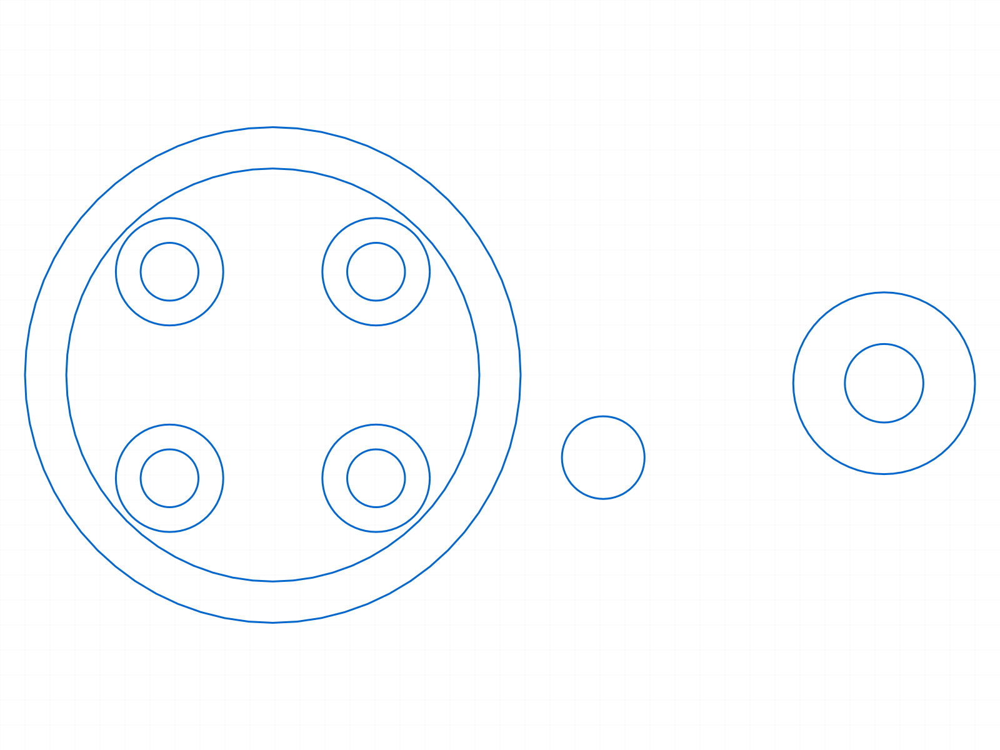
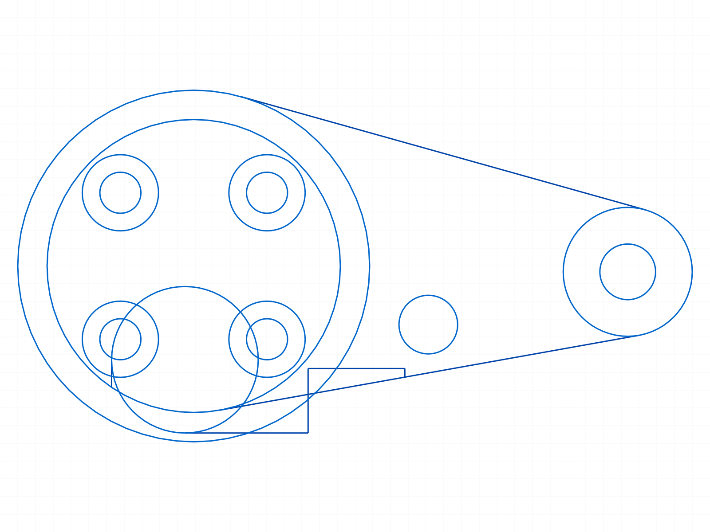
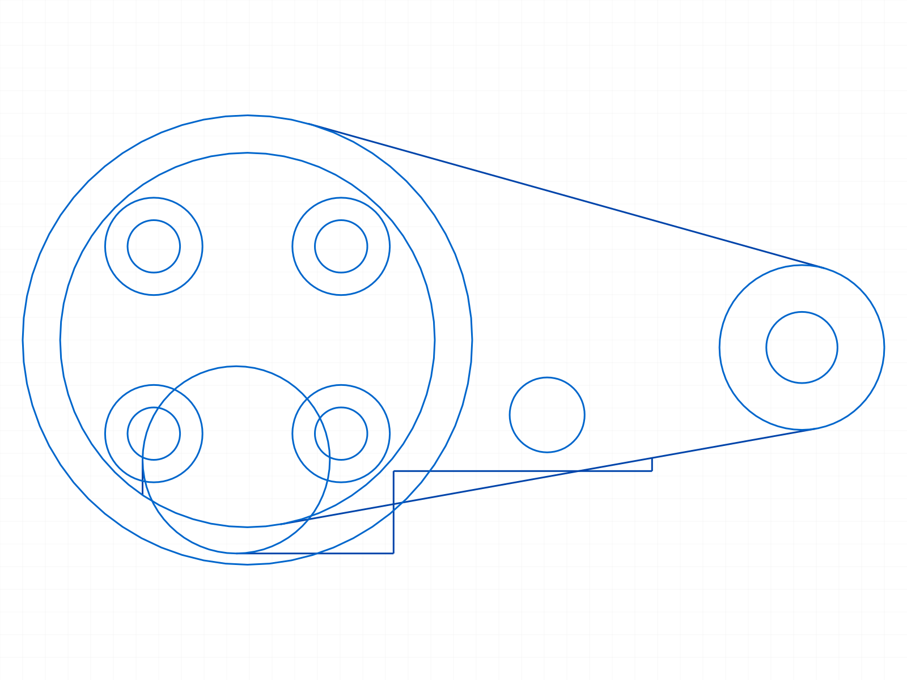
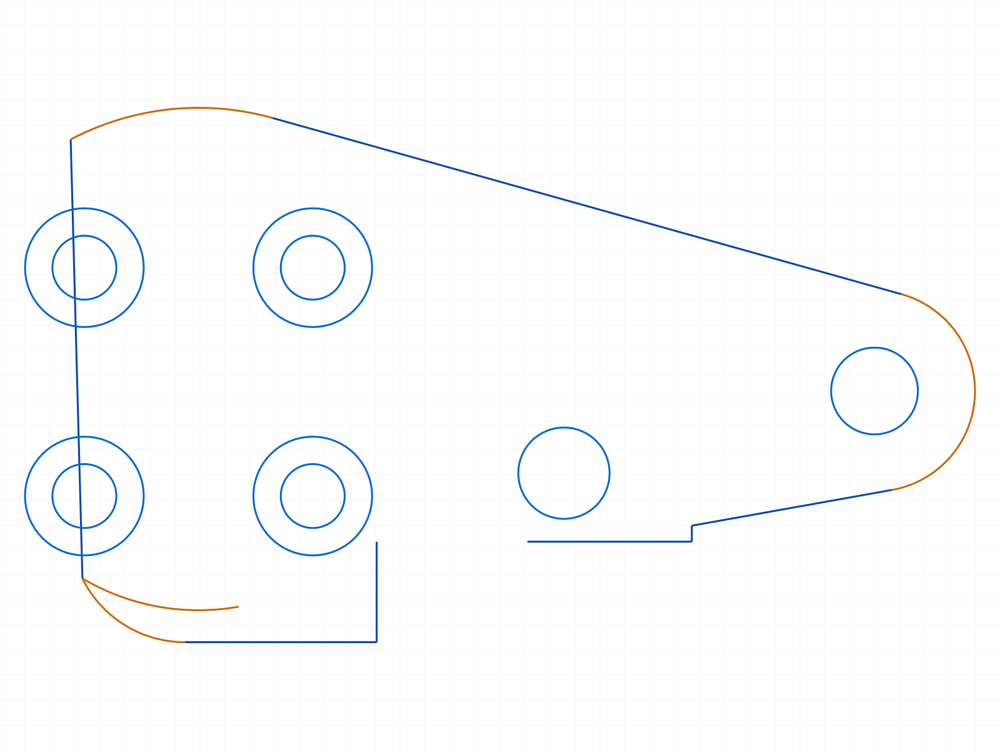
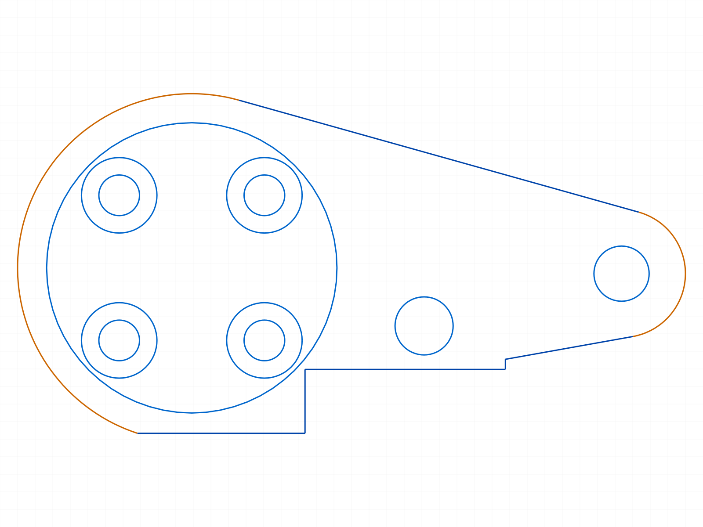
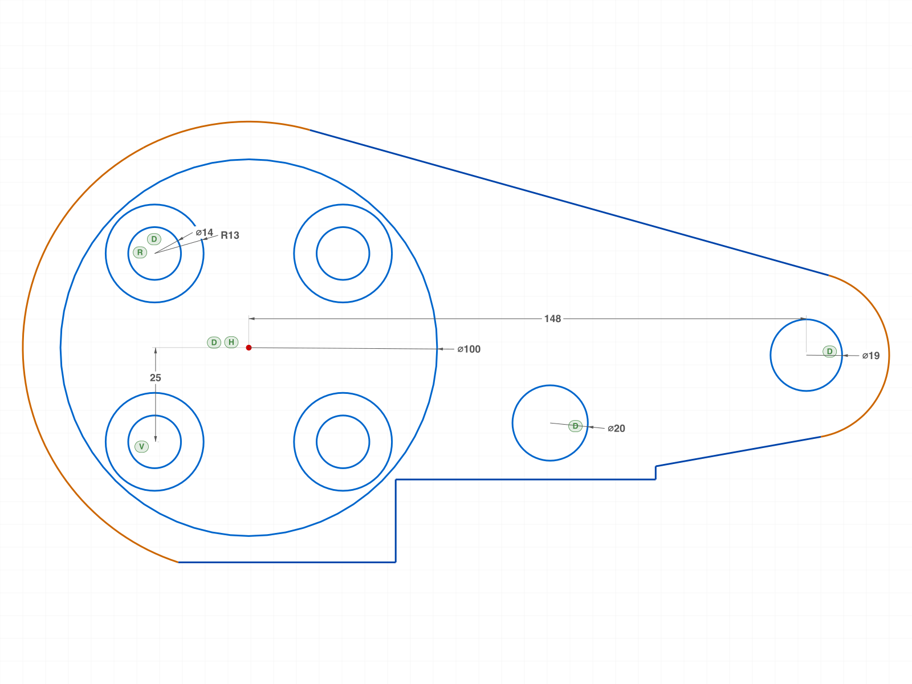
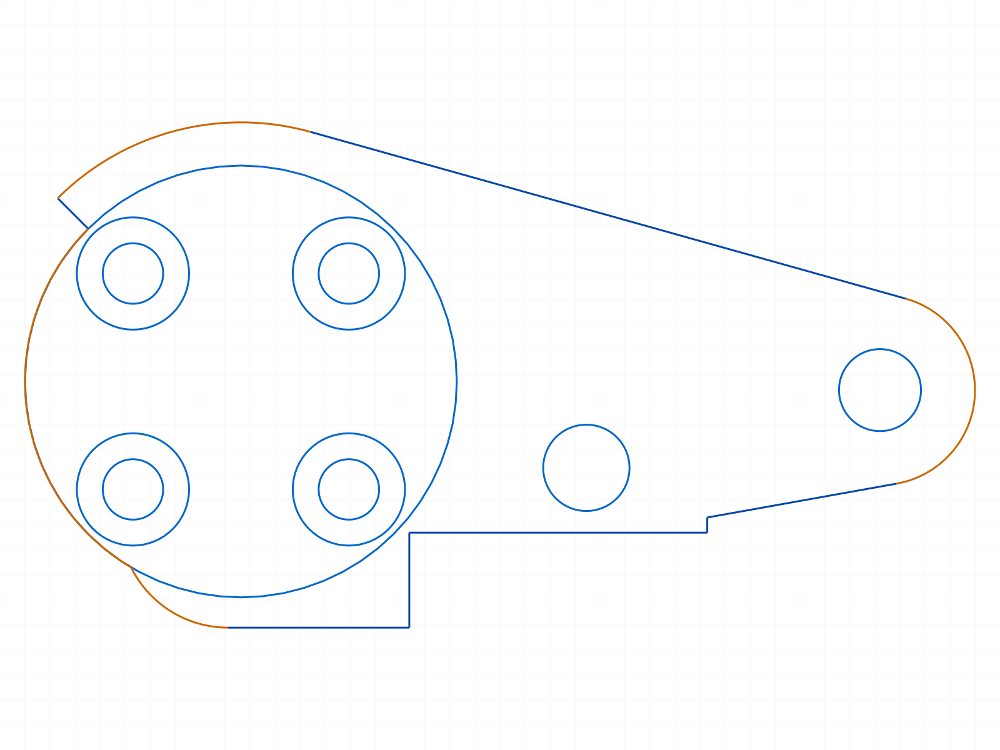

# Training: Bracket Sketch Reproduction

**Date:** 2026-04-14

## Goal

Reproduce a mechanical bracket/pump housing technical drawing using the ClassCAD sketch API, following the SKETCHING.md method: Analyze → Checklist → Recognize Shapes → Dimensions → Trim → Constrain → Evaluate.

## Step 1 — Drawing Analysis

The part is a **flanged bracket** with:
- A central hub with bolt holes (left)
- A tapered arm connecting to a smaller boss (right)
- A rectangular base/foot at the bottom with a step notch

### Extracted Annotations

**Diameters:**
- Ø100 — hub main circle (contour between bolt hole bosses)
- 4×Ø14 — 4 bolt holes (R=7 each)
- Ø44 — right boss outer circle (R=22)
- Ø19 — right boss inner hole (R=9.5)
- Ø20 — intermediate hole in body (R=10)

**Radii:**
- R60 — large arc at top of hub area (outer flange transition)
- 4×R13 — 4 boss circles around bolt holes
- R25 — base bottom-left corner radius
- Fillets are 5 unit if not mentioned (default R5)

**Linear dimensions:**
- 170 — horizontal: hub centerline → right boss right edge
- 62 — horizontal: body right edge → right boss right edge
- 95 — vertical: top of upper boss → base bottom (left side total)
- 55 — vertical: right boss center → base bottom
- 38 — vertical: hub center → lower boss bottom (= upper boss top)
- 14 — horizontal: hub centerline → body left inner edge
- 28 — horizontal: hub centerline → base left edge
- 72 — horizontal: hub centerline → base right edge
- 33 — horizontal: step notch width
- 22 — vertical: step notch height

**Angles:**
- 45° — bolt hole angular position from horizontal

**Notes:**
- "Fillets are 5 unit if not mentioned in the drawing"

### Dimension Cross-Reference

Key derivation chain:
1. Bolt circle from 38 dimension: bolt_circle × sin(45°) + R13 = 38 → bolt_circle = 25/0.7071 = **35.36**
2. Bolt positions at 45°: (±25, ±25) — clean coordinates
3. Top of upper boss = 25 + 13 = 38
4. 95 = 38 - base_bottom → **base_bottom = -57**
5. 55 = right_boss_y - (-57) → **right_boss_y = -2**
6. 170 = hub center to right boss right edge → right_boss_x = 170 - 22 = **148**
7. 62 = body right edge to 170 → body right edge at x = **108**

## Step 2 — Dimension Checklist

- [ ] D1: Ø100 — DIAMETER — hub main contour circle, R=50 at (0,0)
- [ ] D2: R60 — RADIUS — outer flange/transition arc at (0,0)
- [ ] D3: 4×Ø14 — DIAMETER — 4 bolt holes, R=7 at (±25, ±25)
- [ ] D4: 4×R13 — RADIUS — 4 boss circles, R=13 at (±25, ±25)
- [ ] D5: Ø44 — DIAMETER — right boss outer, R=22 at (148, -2)
- [ ] D6: Ø19 — DIAMETER — right boss inner, R=9.5 at (148, -2)
- [ ] D7: Ø20 — DIAMETER — intermediate hole, R=10 (position TBD, est. ~(80, -20))
- [ ] D8: 170 — HORIZONTAL_DISTANCE — hub center to right boss right edge
- [ ] D9: 62 — HORIZONTAL_DISTANCE — body right edge (x=108) to right boss right edge (x=170)
- [ ] D10: 95 — VERTICAL_DISTANCE — top of profile (y=38) to base bottom (y=-57)
- [ ] D11: 55 — VERTICAL_DISTANCE — right boss center (y=-2) to base bottom (y=-57)
- [ ] D12: 38 — VERTICAL_DISTANCE — hub center to lower boss bottom (y=-38)
- [ ] D13: 14 — HORIZONTAL_DISTANCE — hub centerline to body left inner edge (x=-14)
- [ ] D14: 28 — HORIZONTAL_DISTANCE — hub centerline to base left edge (x=-28)
- [ ] D15: 72 — HORIZONTAL_DISTANCE — hub centerline to base right edge (x=72)
- [ ] D16: 33 — HORIZONTAL_DISTANCE — step notch width
- [ ] D17: 22 — VERTICAL_DISTANCE — step notch height
- [ ] D18: R25 — RADIUS — base bottom-left corner
- [ ] D19: 45° — ANGLE — bolt hole position angle
- [ ] D20: R5 — FILLET — default fillet radius (note on drawing)

## Step 3 — Shape Decomposition

### Coordinate system

Hub center = **(0, 0)**

### Original shapes (before trimming)

| # | Shape | Center | R | Purpose | Role |
|---|-------|--------|---|---------|------|
| 1 | Circle | (0, 0) | 50 | Ø100 hub contour | Contour |
| 2 | Circle | (0, 0) | 60 | R60 outer transition | Contour |
| 3 | Circle | (-25, 25) | 13 | UL boss | Contour |
| 4 | Circle | (-25, 25) | 7 | UL bolt hole | Hole |
| 5 | Circle | (25, 25) | 13 | UR boss | Contour |
| 6 | Circle | (25, 25) | 7 | UR bolt hole | Hole |
| 7 | Circle | (-25, -25) | 13 | LL boss | Contour |
| 8 | Circle | (-25, -25) | 7 | LL bolt hole | Hole |
| 9 | Circle | (25, -25) | 13 | LR boss | Contour |
| 10 | Circle | (25, -25) | 7 | LR bolt hole | Hole |
| 11 | Circle | (148, -2) | 22 | Right boss outer | Contour |
| 12 | Circle | (148, -2) | 9.5 | Right boss inner | Hole |
| 13 | Circle | (80, -20) | 10 | Ø20 hole (estimated) | Hole |

### Tangent lines (arm edges)

Upper arm: external tangent from R60 (0,0) to R22 (148,-2) — upper side
Lower arm: external tangent from R50 (0,0) to R22 (148,-2) — lower side

### Base profile

- Left wall at x = -14 (body) transitioning via R25 to x = -28 (base)
- Base bottom at y = -57
- Step: from (39, -57) up to (39, -35), then right to (72, -35)
- R25 corner at bottom-left

---

## Script Log

### 01 — Place construction circles

Script: `scripts/01-place-circles.mjs` — ✓ All circles placed. Hub (R50, R60), 4 bolt bosses/holes, right boss, Ø20, R25.

|  |
|---|

Proportions look correct. Bolt holes inside R50, right boss far right, Ø20 in between.

### 02 — Full construction with tangent lines

Script: `scripts/02-full-construction.mjs` — ✓ Added arm tangent lines + base outline.

|  |
|---|

Upper tangent (R60→R22): (16.2, 57.8) → (153.9, 19.2)
Lower tangent (R50→R22): (8.8, -49.2) → (151.9, -23.7)
Lower arm at x=108: y=-37.9 (below step top -35 by 2.9 units)
Base step visible at bottom-center.

### 03 — Full construction v2

Script: `scripts/03-full-construction-v2.mjs` — ✓ Extended body bottom to x=108, added body right wall.

|  |
|---|

Body right edge at x=108 (from 170−62). Wall from -35 to -31.5 (3.5 units). Short but correct.

### 04 — Draw profile directly

Script: `scripts/04-draw-profile.mjs` — ✓ Drew outer profile as arcs + lines (no trim needed).

|  |
|---|

Profile elements: R60 arc (top), upper arm tangent, R22 arc, lower arm tangent, body right wall, step, base, R25 arc, R50 arc (bottom), left wall line.
**Issue:** Left wall is a straight line from R60 to R50-R25 intersection. Should be curved (hub circle).

### 05 — Profile v2 with R60 left side

Script: `scripts/05-profile-v2.mjs` — ✓ Replaced straight left wall with R60 arc. Hub left side now smooth.

|  |
|---|

R60 arc goes from (-28, 53.07) over the top to upper arm tangent, and from (-18.74, -57) up the left to (-28, 53.07). Smooth curved left side.
**Trade-off:** No R25 corner — R60 goes directly to base bottom. Need to add R25 in next iteration.
**Missing:** R50→R60 transition on left side (currently a concentric step from R60 to nothing).

### 06 — Profile with dimensions

Script: `scripts/06-with-dimensions.mjs` — ✓ Added key dimensions for verification.

|  |
|---|

**Dimension verification:**

| Dim | Expected | Measured | Status |
|-----|----------|----------|--------|
| Ø100 (hub bore) | 100 | 100 | ✓ |
| Ø14 (bolt hole) | 14 | 14 | ✓ |
| R13 (boss) | 13 | 13 | ✓ |
| Ø19 (right boss inner) | 19 | 19 | ✓ |
| Ø20 (mid hole) | 20 | 20 | ✓ |
| Hub-to-RB center horiz | 148 | 148 | ✓ (170 = 148 + R22) |
| Hub-to-bolt center vert | 25 | 25 | ✓ (38 = 25 + R13) |

📌 All circle diameters and key distances match.

## Checklist Update (after Script 06)

- [✓] D1: Ø100 — hub bore = 100 ✓
- [ ] D2: R60 — outer arc radius (used in profile, not explicitly dimensioned)
- [✓] D3: 4×Ø14 — bolt holes = 14 ✓
- [✓] D4: 4×R13 — boss circles = 13 ✓
- [ ] D5: Ø44 — right boss outer (not dimensioned — arc, not circle)
- [✓] D6: Ø19 — right boss inner = 19 ✓
- [✓] D7: Ø20 — intermediate hole = 20 ✓
- [✓] D8: 170 — hub center to RB right edge = 148 + 22 = 170 ✓
- [ ] D9: 62 — body right edge (108) to RB right edge (170) = 62 (derived, not measured)
- [✓] D10: 95 — boss top (38) to base bottom (-57) = 95 ✓ (computed)
- [✓] D11: 55 — RB center (-2) to base bottom (-57) = 55 ✓ (computed)
- [✓] D12: 38 — hub center to bolt center = 25, boss bottom = 25+13 = 38 ✓
- [ ] D13: 14 — possibly R50 - bolt_circle = 50 - 36 = 14 (radial gap, unverified)
- [✓] D14: 28 — hub centerline to R25 leftmost extent = 28 ✓
- [ ] D15: 72 — hub centerline to base right edge (step right = 72, matches)
- [ ] D16: 33 — step width = 72 - 39 = 33 ✓ (computed)
- [ ] D17: 22 — step height = -35 - (-57) = 22 ✓ (computed)
- [ ] D18: R25 — NOT YET IN PROFILE (next iteration)
- [✓] D19: 45° — bolt hole angle (bolt positions at ±25, bolt_circle ≈ 35.36) ✓
- [ ] D20: R5 — fillets not yet added

### 07 — Profile v3: R50 left side + R25 corner

Script: `scripts/07-profile-v3.mjs` — ✓ Complete profile with R60 top, R50 left, R25 corner, radial R50→R60 step.

|  |
|---|

Profile segments (11 total, clockwise):
1. R60 arc: R60@135° → upper arm tangent (CW, over the top)
2. Upper arm tangent line: R60 → R22
3. R22 arc: upper → lower tangent points (CW, right boss)
4. Lower arm tangent line: R22 → body right wall at (108, -31.5)
5. Body right wall: (108, -31.5) → (108, -35)
6. Body bottom: (108, -35) → (39, -35)
7. Step down: (39, -35) → (39, -57)
8. Base bottom: (39, -57) → (-3, -57) (R25 tangent)
9. R25 arc: (-3, -57) → (-25.4, -43.1) (CW, R50 intersection)
10. R50 arc: (-25.4, -43.1) → R50@135° (CW, up the left side)
11. Radial step: R50@135° → R60@135° (short line bridging concentric circles)

**Key fix:** R50-R25 intersection corrected to left-side point (-25.4, -43.1) by selecting by x-coordinate, not y.

**Result:** Profile closely matches source drawing. Hub with R60 top + R50 left, arm tapering to right boss, R25 corner, step base.

## Step 7 — Evaluation

### Visual comparison with source

| Feature | Source | Sketch | Match |
|---------|--------|--------|-------|
| Hub shape (left side curved) | Circular | R50 arc | ✓ |
| Hub top (larger arc) | R60 labeled | R60 arc | ✓ |
| Arm taper hub→boss | Two tangent lines | R60→R22 upper, R50→R22 lower | ✓ |
| Right boss outer | Ø44 | R22 arc | ✓ |
| Right boss inner hole | Ø19 | R9.5 circle | ✓ |
| Base with step | 33×22 notch | Lines at step profile | ✓ |
| R25 corner | Lower-left | R25 arc at (-3,-32) | ✓ |
| 4 bolt holes + bosses | 4×Ø14 + 4×R13 | Circles at (±25, ±25) | ✓ |
| Ø100 hub bore | Large circle | R50 circle | ✓ |
| Ø20 hole | In body area | Circle at (80, -20) | ~ (estimated) |
| R50→R60 transition | Smooth in drawing | Radial step at 135° | ✗ (kink) |
| Boss protrusion | Visible bumps | Not protruding | ✗ |
| R5 fillets | "Fillets are 5 unit" | Not added | ✗ |

### Dimension verification summary

| Dim | Value | Verified | Notes |
|-----|-------|----------|-------|
| Ø100 | 100 | ✓ | Hub bore, auto-measured |
| R60 | 60 | ✓ | Used in profile arc |
| 4×Ø14 | 14 | ✓ | Auto-measured |
| 4×R13 | 13 | ✓ | Auto-measured |
| Ø44 | 44 | ✓ | R22 used in profile |
| Ø19 | 19 | ✓ | Auto-measured |
| Ø20 | 20 | ✓ | Auto-measured |
| 170 | 170 | ✓ | 148 (center) + 22 (radius) |
| 62 | 62 | ✓ | 170 - 108 (body right edge) |
| 95 | 95 | ✓ | 38 + 57 (boss top + base depth) |
| 55 | 55 | ✓ | 2 + 57 (boss center + base) |
| 38 | 38 | ✓ | 25 (bolt center) + 13 (boss R) |
| 14 | 14 | ~ | Possibly R50 - bolt_circle = 50 - 36 |
| 28 | 28 | ✓ | R25 leftmost = hub center - 28 |
| 72 | 72 | ✓ | Step right = hub center + 72 |
| 33 | 33 | ✓ | 72 - 39 = step width |
| 22 | 22 | ✓ | -35 - (-57) = step height |
| R25 | 25 | ✓ | In profile arc |
| 45° | 45° | ✓ | Bolt positions at (±25, ±25) |
| R5 | 5 | ✗ | Not yet added |

## Open Issues

1. **R25 corner missing** — R60 goes directly to base bottom. Need R25 to round the transition from hub contour to base. Requires an intermediate body wall or different R60 endpoint.
2. **No R50→R60 transition** — left side profile uses only R60. The drawing may show R50 as the hub contour with R60 only at the top. Need radial step or fillet at the transition.
3. **Boss protrusion** — bolt bosses (R13, extent 48.36) don't protrude beyond R50 (50). The drawing shows visible bumps. May need larger bolt circle or different interpretation.
4. **R5 fillets** — "Fillets are 5 unit" note. Need to add at body-arm junctions and step corners.
5. **Ø20 hole position** — estimated at (80, -20). No explicit dimension in drawing to verify. May need adjustment.
