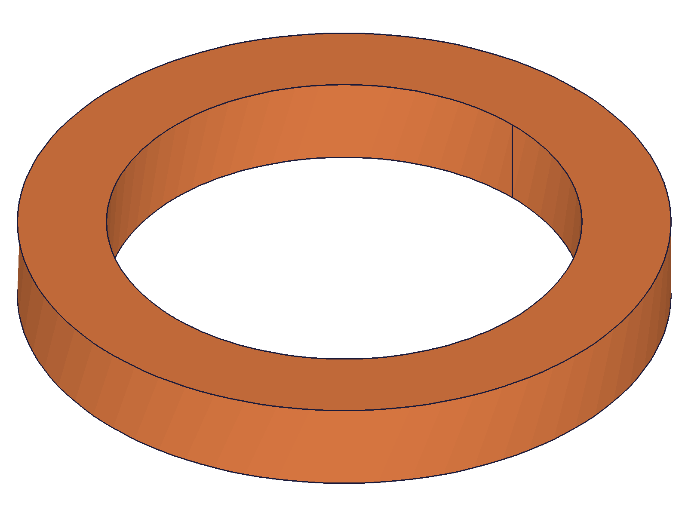
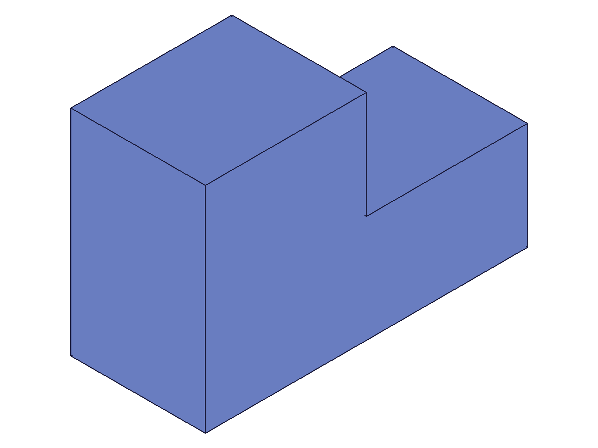
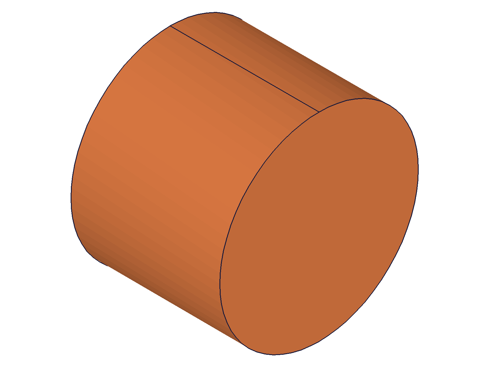

# Training: curves parameter — shape ID vs sketch element IDs

**Date:** 2026-04-14

## Goal

Studying how the `curves` parameter works in `solid.extrusion` and `solid.revolve`. The docs say it accepts "either an array of sketch element ids or a shape id." This session explores both forms in depth.

**Questions to answer:**

- What exactly does each form look like? Shape ID = single value, sketch elements = array of IDs?
- Can you pass a single sketch element ID (not wrapped in array)?
- Can you pass a sketchRegion ID instead of raw element IDs?
- What happens with an empty array `[]`?
- What happens with wrong ID types (part ID, EIF ID, solid ID)?
- Does the behavior differ between `extrusion` and `revolve`?
- Can you mix shape IDs and sketch element IDs in a single array?
- How does the sketch context interact with the EIF context?

---

## 01 — shape ID form (baseline)

Script: `scripts/01-shape-id-form.mjs` — ✅ Shape ID as scalar works. shapeId=60, extId=64, maxLevel=31.

|  |
|---|

**Data:** See `files/01-shape-id-form-shape-id-form.json`. Shape ID is a number passed as scalar.

---

## 02 — sketch element IDs form

Script: `scripts/02-sketch-element-ids.mjs` — ✅ Array of sketch line IDs works. lineIds=[66,72,78,84] from `sketch.rectangle`, extId=105, maxLevel=31.

|  |
|---|

**Data:** `sketch.rectangle` returns an array of 4 line IDs. Passed directly as `curves: lineIds`. See `files/02-sketch-element-ids-sketch-element-ids.json`.

---

## 03 — single/partial sketch elements (unexpected)

Script: `scripts/03-single-sketch-element.mjs` — All three variants fail with "not manifold" (maxLevel=51).

- **A: single scalar ID** (`curves: lineIds[0]`) — fails
- **B: single ID in array** (`curves: [lineIds[0]]`) — fails
- **C: partial array** (`curves: [lineIds[0], lineIds[1]]`) — fails

**Data:** See `files/03-single-sketch-element-single-element-tests.json`. All produce error: `"Brep after linear sweep not manifold"`.

**Learned:** The parameter accepts the IDs without type error, but the kernel requires the curves to form a **closed loop**. A single line or partial loop is accepted by the parameter validator but rejected by the geometry engine.
**📌 LLM doc:** Document that sketch element IDs must form a complete closed loop.

---

## 04 — sketchRegion IDs (unexpected)

Script: `scripts/04-sketch-region.mjs` — ❌ sketchRegion IDs are NOT accepted as curves.

- **A: region as scalar** — error: `"The parameter \"curves\" has a wrong id type! Provide only following id types: [\"shape\",\"sketch-curve\"]"`
- **B: region in array** — same error

**Data:** See `files/04-sketch-region-sketch-region-tests.json`. regionId=100 was created successfully (maxLevel=31), but extrusion rejects it.

**Learned:** The error message reveals the two accepted ID types explicitly: **`"shape"` and `"sketch-curve"`**. A sketchRegion is a different type entirely and cannot be used. This is important because `part.extrusion` (the feature version) uses `references` which DOES accept sketchRegion IDs — but `solid.extrusion` does not.
**📌 LLM doc:** Document that only "shape" and "sketch-curve" types are accepted, NOT sketchRegion.

---

## 05 — edge cases: empty array, wrong ID types

Script: `scripts/05-edge-cases.mjs` — All fail with clear errors.

- **A: empty array `[]`** — error: `"The parameter \"curves\" has the wrong type! It should be of type (Array<object>|Array<string|real|id>)"`
- **B: part ID** — error: `"curves has a wrong id type! Provide only following id types: [\"shape\",\"sketch-curve\"]"`
- **C: EIF ID** — same error
- **D: solid ID** — same error

**Data:** See `files/05-edge-cases-edge-cases.json`. Empty array produces a different error (type error vs id type error). All wrong ID types produce the same "shape/sketch-curve" message.

**Learned:** The parameter has two validation layers: (1) type check (must be id or array of ids), (2) id type check (must be shape or sketch-curve). Empty array fails at layer 1.
**📌 LLM doc:** Document error messages for wrong inputs.

---

## 06 — revolve with sketch elements

Script: `scripts/06-revolve-sketch-elements.mjs` — ✅ Both forms work identically for revolve.

|  |
|---|

**Data:** shapeId form: revId=64, maxLevel=31. lineIds form: revId=109, maxLevel=31. See `files/06-revolve-sketch-elements-revolve-curves-forms.json`.

**Learned:** `solid.revolve` accepts `curves` in exactly the same two forms as `solid.extrusion`. No behavioral difference.

---

## 07 — manual sketch loop (individual lines)

Script: `scripts/07-manual-sketch-loop.mjs` — ✅ L-shaped profile from 6 individual `sketch.line` calls works.

|  |
|---|

**Data:** 6 lineIds → extId=125, maxLevel=31. See `files/07-manual-sketch-loop-manual-loop.json`.

**Learned:** Any combination of sketch-curve elements that form a closed loop works — not limited to the output of `sketch.rectangle`.

---

## 08 — sketch.circle as curves (unexpected)

Script: `scripts/08-sketch-arc-circle.mjs` — ✅ sketch.circle returns an ID (66) that works as curves.

|  |
|---|

- **A: circle in array** (`curves: [circId]`) — extId=71, maxLevel=31
- **B: circle as scalar** (`curves: circId`) — extId=74, maxLevel=31

**Data:** See `files/08-sketch-arc-circle-circle-extrusion.json` and `files/08-sketch-arc-circle-circle-scalar.json`.

**Learned:** `sketch.circle` returns a sketch-curve ID (unlike `curve.circle` which returns VOID). A single sketch circle is a complete closed loop, so it works as a scalar — no array needed.
**📌 LLM doc:** Document that sketch.circle returns an ID usable as curves, unlike curve.circle.

---

## 09 — shape ID in array

Script: `scripts/09-shape-in-array.mjs` — ✅ Shape ID wrapped in an array `[shapeId]` works. extId=64, maxLevel=31.

**Data:** See `files/09-shape-in-array-shape-in-array.json`.

**Learned:** The parameter is flexible — shape IDs work as both scalar and array element.
**📌 LLM doc:** Document that both scalar and array forms work for shape IDs.

---

## 10 — cross-sketch elements

Script: `scripts/10-cross-sketch.mjs` — ✅ Elements from two different sketches can be combined. extId=109, maxLevel=31.

**Data:** sk1 lines [66,74] + sk2 lines [88,94] → forms a closed rectangle → extrusion succeeds. See `files/10-cross-sketch-cross-sketch.json`.

**Learned:** The system doesn't care which sketch the elements come from. As long as the geometry forms a closed loop in 3D space, it works.
**📌 LLM doc:** Document cross-sketch mixing works.

---

## 11 — mixed shape + sketch elements (unexpected)

Script: `scripts/11-mix-shape-sketch.mjs` — ✅ Shape ID + sketch element IDs in the same array works! extId=97, maxLevel=31.

**Data:** shapeId=60 (one open polyline) + sketch lines [69,75,83] (three closing lines) → combined into a closed loop → extrusion succeeds. See `files/11-mix-shape-sketch-mix-shape-sketch.json`.

**Learned:** The kernel combines all provided curves regardless of source. You can even mix curve.shape elements with sketch elements in a single array. The separation described in the docs ("either...or") is softer than it appears.
**📌 LLM doc:** Document that mixing is possible — shapes and sketch curves are interchangeable in the array.

---

## Coverage checklist

- [x] Shape ID form tested — scalar works (01), array works (09)
- [x] Sketch element IDs form tested — rectangle (02), manual lines (07), circle (08)
- [x] Incomplete loops → kernel error, not param error (03)
- [x] sketchRegion IDs → rejected, only "shape"/"sketch-curve" accepted (04)
- [x] Edge cases: empty array, wrong ID types (05)
- [x] Revolve same behavior as extrusion (06)
- [x] Cross-sketch mixing works (10)
- [x] Mixed shape + sketch in same array works (11)
- [x] Accepted ID types confirmed via error messages: "shape" and "sketch-curve"
- [x] All questions from goal answered

## Answers to questions

1. **What does each form look like?** Shape ID = number (e.g., 60), sketch elements = array of numbers (e.g., [66,72,78,84]). Both are numeric IDs, the distinction is the *type* of object they reference.
2. **Single sketch element as scalar?** Accepted by param validator, but fails at kernel level unless the curve is closed (e.g., a circle).
3. **sketchRegion ID?** NO — explicitly rejected. Only "shape" and "sketch-curve" types accepted.
4. **Empty array?** Type error — needs at least one element.
5. **Wrong ID types?** Clear error: "Provide only following id types: [shape, sketch-curve]"
6. **Extrusion vs revolve?** Identical behavior for both.
7. **Mix shape + sketch in array?** YES — works, kernel combines all curves.
8. **Cross-sketch interaction?** Works — elements from different sketches can be combined.
