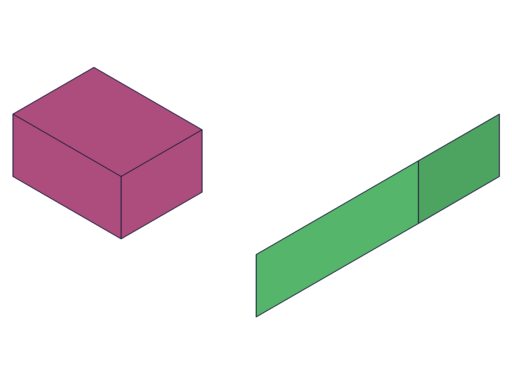
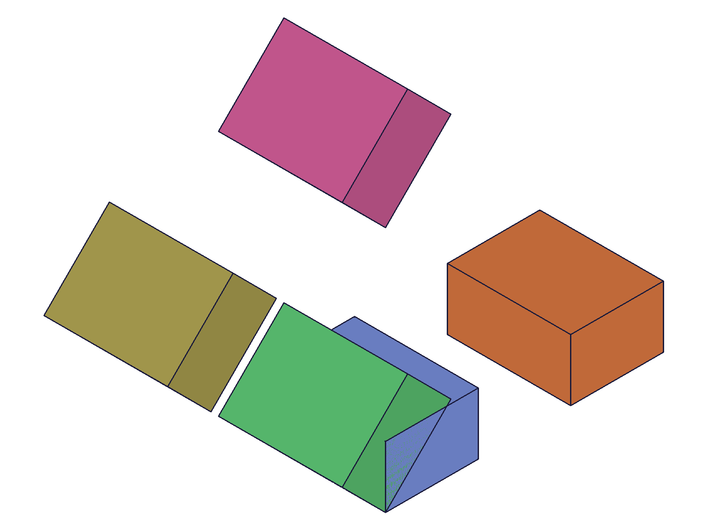
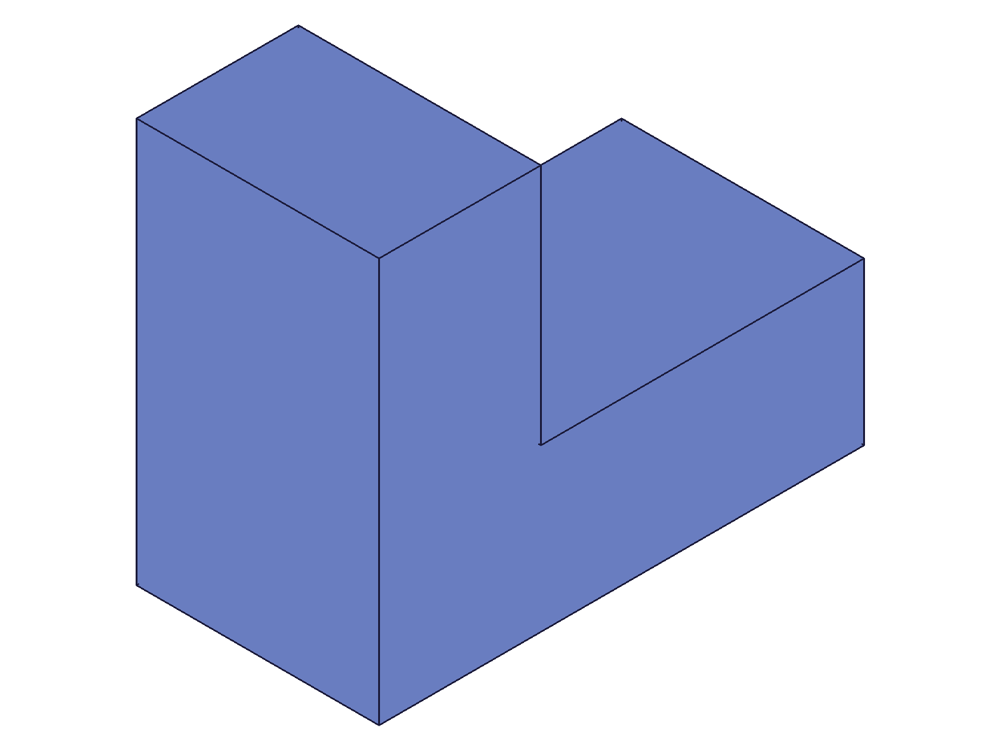
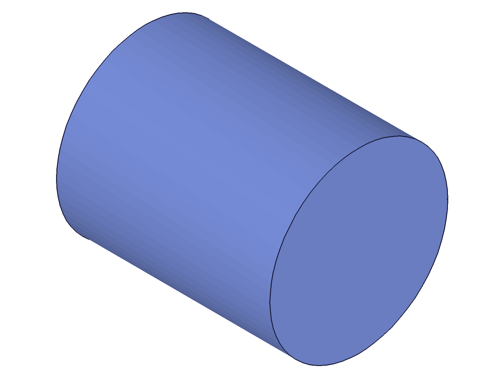
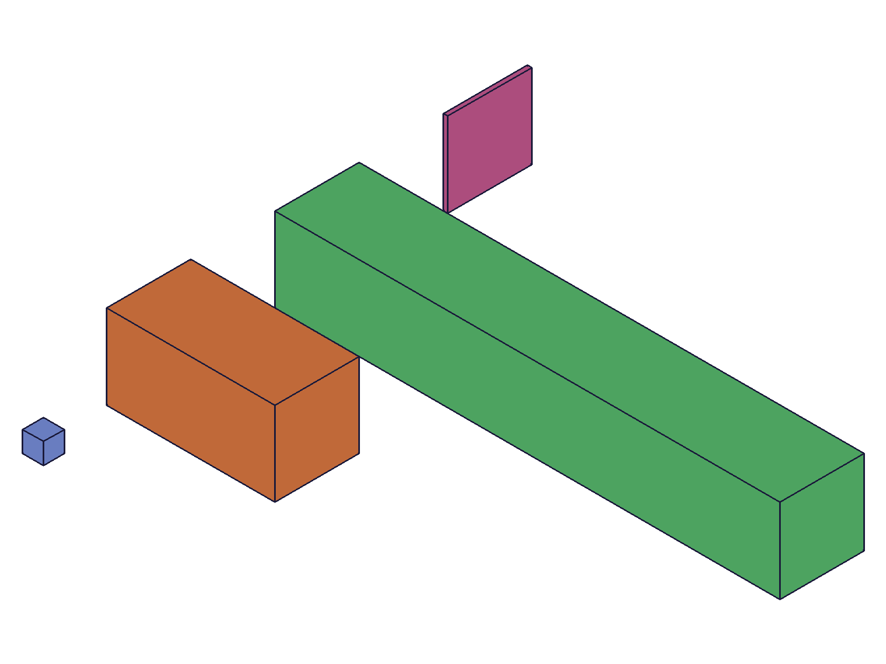
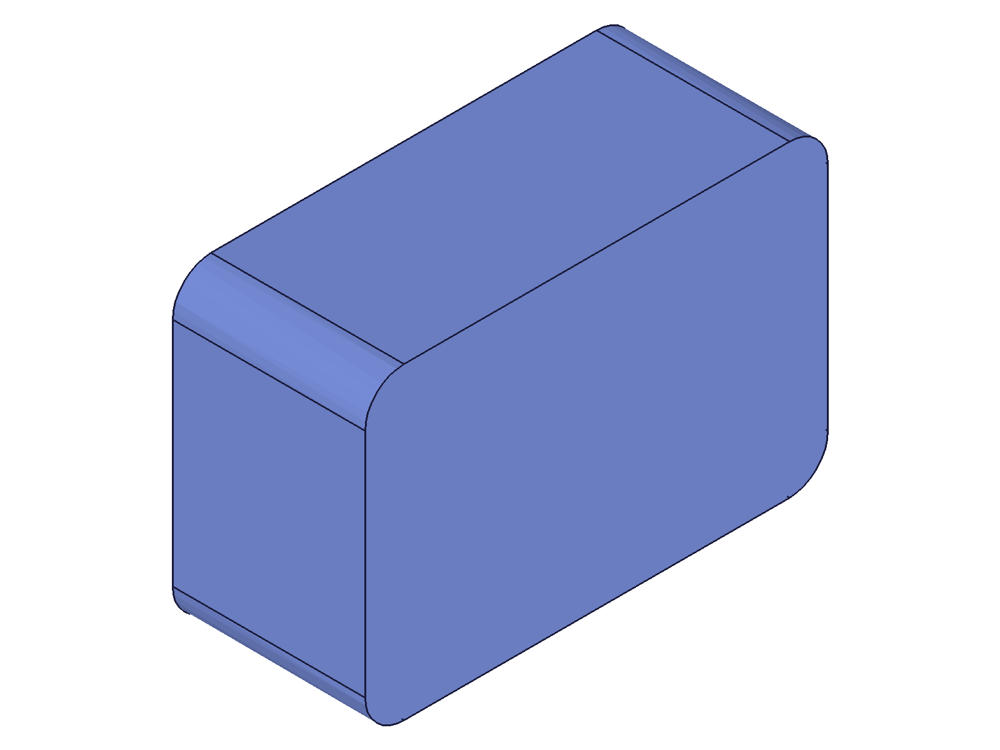

# Training: solid.extrusion

**Date:** 2026-04-14

## Goal

Testing `v1.solid.extrusion` — creates a solid by sweeping a 2D profile (curve shape or sketch elements) along a direction vector.

**Methods to cover:**

- `extrusion` — basic extrusion from curve shape
- `extrusion` params: id (EIF), direction, curves (shape ID vs array of sketch element IDs)
- Optional params: rotation, translation, rotateFirst
- Direction vector semantics — does length encode distance?
- Edge cases: zero direction, open profiles, negative direction components

**Questions:**

- What does the `curves` param accept — only shape IDs, or also arrays of sketch element IDs?
- Does `direction` length define the extrusion distance, or is it just a direction + separate distance?
- What happens with an open profile (non-closed polyline)?
- What happens with zero-length direction `[0,0,0]`?
- Does rotation/translation work identically to primitives?
- What does the return value look like (ID, maxLevel)?

---

## 01 — basic extrusion

Script: `scripts/01-basic.mjs` — ✅ 80×50 rect extruded 40 units along Z. Result=64, maxLevel=31, messages=[].

|  |
|---|

**Data:** shapeId=60, extId=64. Pattern: create part → create EIF → create curve shape in EIF → add polyline to shape → extrude with shape ID.

---

## 02 — direction variants

Script: `scripts/02-direction-variants.mjs` — ✅ All direction variants work. Along X, Y, angled [30,30,30], and negative Z all produce valid solids.

|  |
|---|

**Data:** All maxLevel=31, all returned valid IDs (see `files/02-direction-variants-direction-results.json`). Negative direction `[0,0,-40]` extrudes in the negative Z direction — perfectly valid. Angled direction produces an oblique extrusion.

---

## 03 — zero direction (unexpected)

Script: `scripts/03-zero-direction.mjs` — Direction `[0,0,0]` succeeds silently. Result=64, maxLevel=31, messages=[].

**Data:** See `files/03-zero-direction-zero-direction.json`. No error, no warning. Creates a degenerate zero-thickness solid (essentially a flat face at the profile position).

**Learned:** Zero direction is NOT validated. Unlike a human expecting an error, ClassCAD accepts it silently and creates degenerate geometry.
**📌 LLM doc:** Document that `direction: [0,0,0]` is a silent no-op that produces degenerate geometry.

---

## 04 — open profile

Script: `scripts/04-open-profile.mjs` — ✅ Open profile correctly fails with error.

**Data:** Result=null, maxLevel=51. Error: `"Brep after linear sweep not manifold"` (code 0, level 51). See `files/04-open-profile-open-profile.json`.

**Learned:** Extrusion requires a closed profile. Open profiles produce a non-manifold error. The error message is technical (from the kernel) but clear about the cause.
**📌 LLM doc:** Document that profiles must be closed — open profiles error with "not manifold".

---

## 05 — transform parameters

Script: `scripts/05-transform-params.mjs` — ✅ All transform params work identically to primitives.

|  |
|---|

**Data:** 5 extrusions created — reference, translated, rotated, rot+trans (rotateFirst=true), rot+trans (rotateFirst=false). All maxLevel=31. See `files/05-transform-params-transform-results.json`. Transform behavior is consistent with primitives (see `generic.md`).

---

## 06 — L-shaped profile

Script: `scripts/06-l-shaped-profile.mjs` — ✅ Non-rectangular profile works perfectly.

|  |
|---|

**Data:** Result=64, maxLevel=31. Any closed polyline shape can be extruded — not limited to rectangles.

---

## 07 — circle profile

Script: `scripts/07-circle-profile.mjs` — ✅ Circle profile produces a cylinder.

|  |
|---|

**Data:** Result=64, maxLevel=31. `curve.circle` creates a closed circle in a shape, which extrudes into a cylinder. This is equivalent to `solid.cylinder` but from a curve profile.

---

## 08 — direction length determines distance

Script: `scripts/08-direction-length.mjs` — ✅ Direction vector length encodes extrusion distance.

|  |
|---|

**Data:** Three extrusions with directions [0,0,40], [0,0,120], [0,0,1] side by side with a 5×5×5 reference box. The snapshot clearly shows the 120-unit extrusion is 3× longer than the 40-unit one. The unit vector [0,0,1] produces a paper-thin extrusion. See `files/08-direction-length-direction-length.json`.

**Learned:** The direction vector is NOT normalized — its magnitude IS the extrusion distance. `[0,0,40]` = extrude 40 units along Z. `[1,1,1]` ≈ extrude ~1.73 units along the (1,1,1) diagonal.
**📌 LLM doc:** Emphasize that direction vector magnitude = extrusion distance, not just direction.

---

## 09 — sketch element IDs as curves

Script: `scripts/09-sketch-curves.mjs` — ✅ Sketch element IDs work as `curves` parameter.

**Data:** Created a sketch with `sketch.rectangle` which returned 4 line IDs [66, 72, 78, 84]. Passed the array directly as `curves`. Extrusion succeeded: result=105, maxLevel=31. See `files/09-sketch-curves-sketch-curves.json`.

**Learned:** The `curves` parameter accepts BOTH:
1. A single shape ID (from `curve.shape`) — the common case
2. An array of sketch element IDs (from sketch drawing APIs like `sketch.rectangle`, `sketch.line`, etc.)

**📌 LLM doc:** Document both `curves` input forms with examples.

---

## 10 — wrong ID types

Script: `scripts/10-wrong-id.mjs` — ✅ Clear error messages for wrong ID types.

**Data:** Both part ID and shape ID as `id` param produce: result=null, maxLevel=51, error `"The parameter \"id\" has a wrong id type! Provide only following id types: [\"entityinjection\"]"` (code 1001). See `files/10-wrong-id-wrong-id.json`.

---

## 11 — filleted profile

Script: `scripts/11-filleted-profile.mjs` — ✅ Profile with fillet radii at corners produces rounded extrusion.

|  |
|---|

**Data:** Result=64, maxLevel=31. advancedPolyline with `r: 5` at each corner creates a rounded rectangle profile, which extrudes into a rounded-corner box.

---

## Coverage checklist

- [x] Basic extrusion called successfully
- [x] Required params tested: id, direction, curves
- [x] Optional params tested: rotation, translation, rotateFirst
- [x] Direction variants: X, Y, Z, angled, negative — all work
- [x] Direction length = extrusion distance confirmed
- [x] curves: shape ID — works
- [x] curves: array of sketch element IDs — works
- [x] Edge case: zero direction — silent degenerate geometry
- [x] Edge case: open profile — error (not manifold)
- [x] Edge case: wrong ID type — clear error
- [x] Profile types: rectangle, L-shape, circle, filleted — all work
- [x] Realistic usage: curve shape + advancedPolyline + extrusion
- [x] No update/delete method specific to extrusion (use `solid.deleteSolid` for removal)
