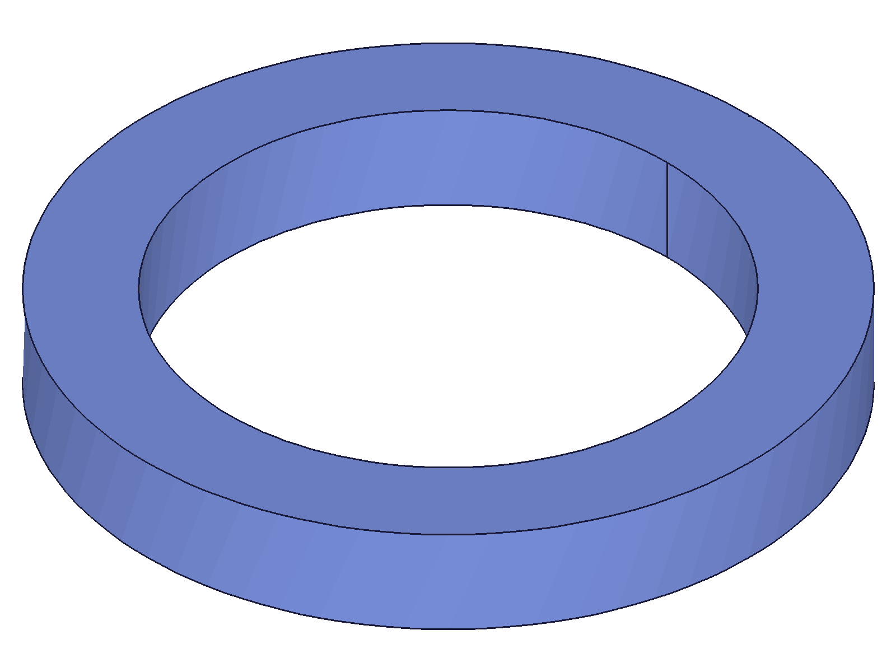
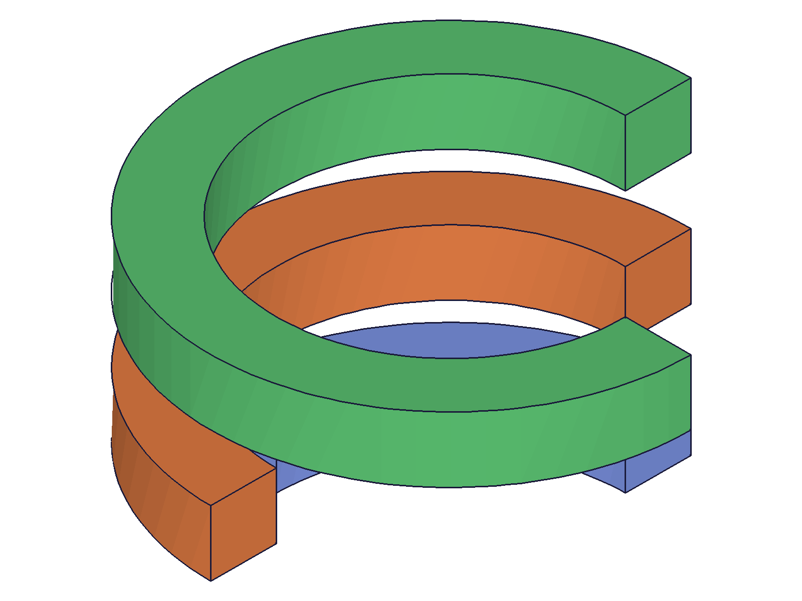
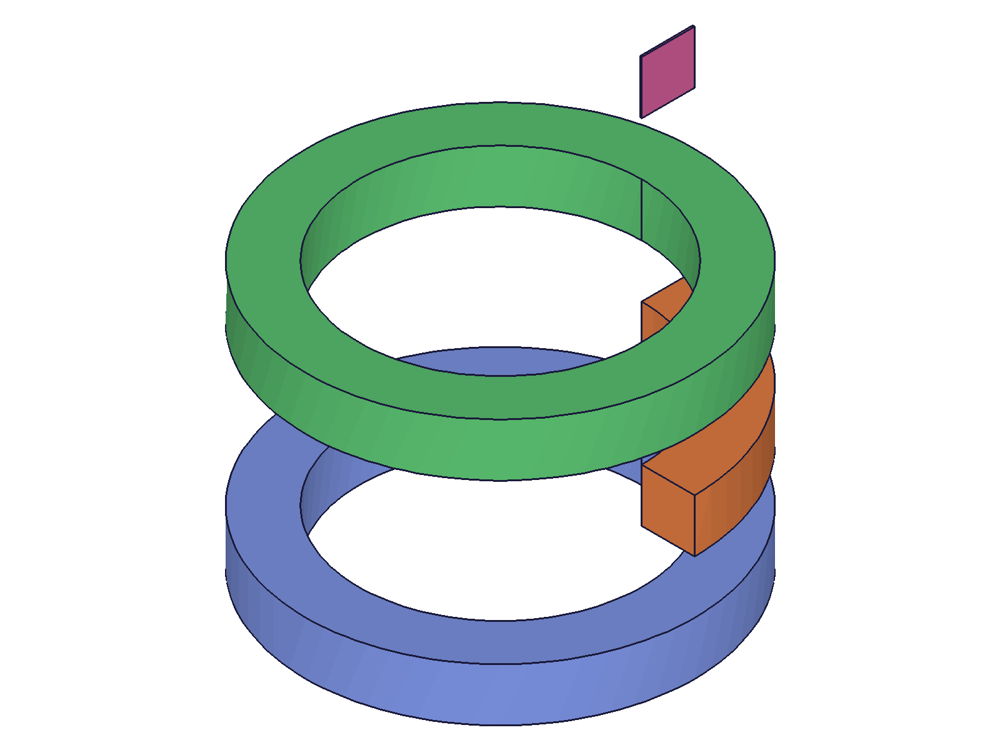
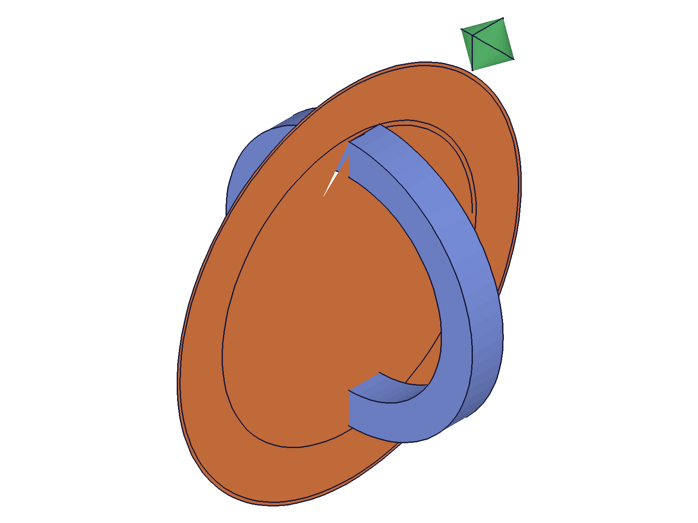
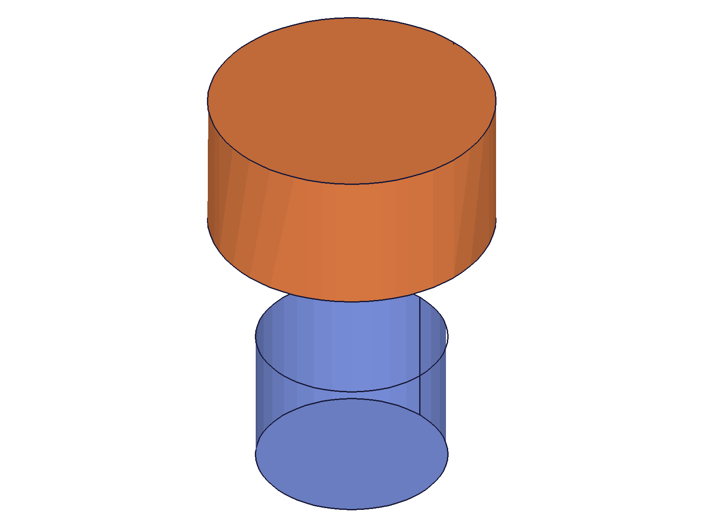
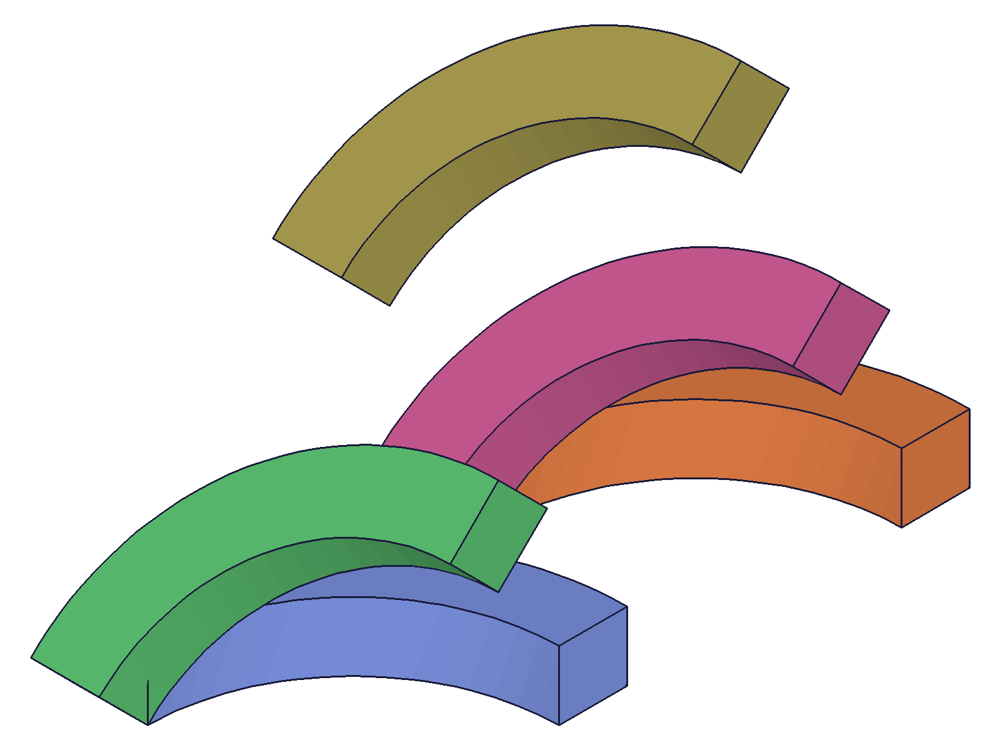
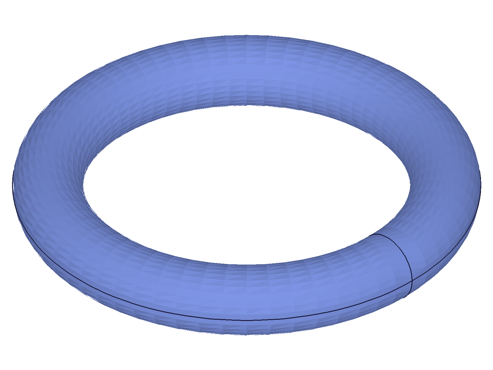
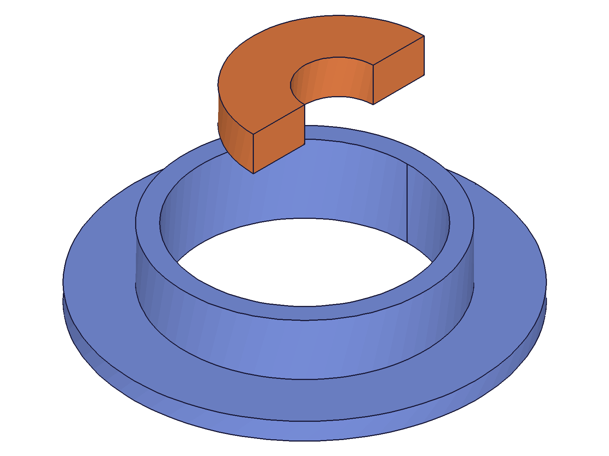

# Training: solid.revolve

**Date:** 2026-04-14

## Goal

Testing `v1.solid.revolve` — creates a solid by revolving a 2D profile around an axis.

**Methods to cover:**

- `revolve` — basic full revolve (360 degrees)
- `revolve` — partial revolve (< 2*PI)
- `revolve` params: id, originPos, direction, angle, curves
- `revolve` optional params: rotation, translation, rotateFirst
- Edge cases: zero angle, very small angle, negative angle, > 2*PI angle
- Profile types: rectangle, circle, L-shape
- Axis orientation: Y-axis, X-axis, Z-axis
- Profile position relative to axis (offset required for revolve)

**Questions:**

- What happens if the profile intersects the revolve axis?
- What happens with angle=0?
- Does negative angle work (reverse direction)?
- Does angle > 2*PI do anything special?
- Can the same profile be used for both extrusion and revolve?
- What error do you get if the profile is not closed?

---

## 01 — basic full revolve

Script: `scripts/01-basic-full-revolve.mjs` — ✅ Full 360° revolve of rectangle profile around Y axis creates a torus-like solid. result=64, maxLevel=31.

|  |
|---|

## 02 — partial revolves

Script: `scripts/02-partial-revolve.mjs` — ✅ 90°, 180°, 270° revolves all work. Each returns a valid solid ID with maxLevel=31.

**Data:** 90° → ID 64, 180° → ID 70, 270° → ID 76. All maxLevel=31, no messages.

|  |
|---|

## 03 — edge case angles

Script: `scripts/03-edge-angles.mjs` — all edge cases succeed silently with maxLevel=31 and valid IDs.

|  |
|---|

**Data** (from `files/03-edge-angles-edge-angle-results.json`):
- angle=0: result=64, maxLevel=31, no messages. Returns valid ID but creates degenerate geometry (visible as tiny pink square in snapshot).
- angle=-PI/2 (-90°): result=70, works — revolves in opposite direction.
- angle=3*PI (>360°): result=76, works — appears to produce a full 360° torus (capped, not over-revolved).
- angle=0.01 (tiny): result=82, works — creates a very thin sliver.

**📌 LLM doc:** angle=0 is a silent degenerate case — returns valid ID with no error. Negative angles work (reverse direction). Angles > 2*PI seem to cap at a full revolution.

## 04 — zero angle graphic verification

Script: `scripts/04-zero-angle-verify.mjs` — graphic mesh data is empty in CLI context (expected per TOOLS.md). Cannot verify vertex counts directly. angle=0 returns result=64, maxLevel=31 — same as a valid revolve.

**📌 LLM doc:** angle=0 is accepted silently. Always validate angle is non-zero before calling.

## 05 — axis directions

Script: `scripts/05-axis-directions.mjs` — ✅ X-axis, Z-axis, and diagonal [1,1,0] axis all work. All return maxLevel=31.

|  |
|---|

**Data:** X-axis → ID 64, Z-axis → ID 70, diagonal → ID 76. Direction does not need to be normalized — `[1,1,0]` works fine.

## 06 — profile intersecting axis

Script: `scripts/06-profile-on-axis.mjs` — ✅ Both crossing and touching profiles succeed with maxLevel=31.

|  |
|---|

**Learned:** Profile crossing the axis (rect from x=-10 to x=10, axis at x=0) creates a solid disc/cylinder (orange, larger). Profile touching the axis (starting at x=0) creates a smaller cylinder. No errors — revolve handles this gracefully by creating a solid of revolution (no hollow center when profile crosses/touches axis).

**📌 LLM doc:** Profile does NOT need to be offset from the axis. Crossing or touching the axis creates solid discs/cylinders instead of rings/tori. This is valid behavior, not an error.

## 07 — transform parameters

Script: `scripts/07-transforms.mjs` — ✅ All 5 variants work (base, translation, rotation, rotateFirst=true, rotateFirst=false).

|  |
|---|

**Data:** All 5 return maxLevel=31. Different positions in the snapshot confirm transforms are applied correctly. The rotateFirst parameter affects the ordering of rotation and translation operations.

## 08 — open profile error

Script: `scripts/08-open-profile-error.mjs` — ✅ Fails as expected. Open profile (close: false) returns null with maxLevel=51.

**Error:** `"Brep after revolve operation not manifold"` (code 0, level 51). Same kernel error as with extrusion — profiles must be closed.

**📌 LLM doc:** Open profiles fail with "Brep after revolve operation not manifold". Same error as solid.extrusion with open profiles.

## 09–10 — circle profile (initial failure + diagnosis)

Scripts: `scripts/09-circle-profile.mjs`, `scripts/10-circle-profile-fix.mjs` — initial attempt failed because `curve.circle` param is `centerPos`, not `center`.

**Root cause:** Used wrong parameter name (`center` instead of `centerPos`). `curve.circle` returned null (maxLevel=51), causing revolve to fail with "NULLID not allowed".

**📌 LLM doc:** Common mistake — `curve.circle` uses `centerPos`, not `center`. If the shape has no valid curves, revolve fails with "NULLID not allowed".

## 11 — circle profile (corrected)

Script: `scripts/11-circle-profile-correct.mjs` — ✅ Circular profile revolve creates a true torus. result=64, maxLevel=31.

|  |
|---|

`curve.circle` returns VOID (null with maxLevel=31), not an ID. The circle is added to the shape container. Pass the shape ID to revolve.

## 12 — wrong ID type error

Script: `scripts/12-wrong-id-type.mjs` — ✅ Passing part ID instead of EIF ID gives clear error.

**Error:** `"The parameter \"id\" has a wrong id type! Provide only following id types: [\"entityinjection\"]"` (code 1001, level 51). Same error as extrusion.

**📌 LLM doc:** Same error pattern as other solid APIs — `id` must be an entity injection feature ID.

## 13 — L-shape profile and offset originPos

Script: `scripts/13-l-shape-and-offset-origin.mjs` — ✅ Both work.

|  |
|---|

**Learned:** L-shaped profile revolve (blue) creates a flanged ring with L cross-section. Offset originPos (axis at x=10 instead of x=0) works correctly — the ring's center is at x=10, not x=0.

**📌 LLM doc:** `originPos` defines the point the axis passes through, not necessarily the world origin. Any point works.

---

## Coverage Summary

- ✅ Basic revolve (full 360°)
- ✅ Partial revolves (90°, 180°, 270°)
- ✅ All required params tested (id, originPos, direction, angle, curves)
- ✅ All optional params tested (rotation, translation, rotateFirst)
- ✅ Edge case angles (0, negative, >2PI, tiny)
- ✅ Multiple profile types (rectangle, circle, L-shape)
- ✅ Multiple axis directions (X, Y, Z, diagonal)
- ✅ Profile crossing/touching axis
- ✅ Offset originPos
- ✅ Error cases (open profile, wrong ID type)
- N/A: No `updateRevolve` method exists in the docs
