# Training: solid.offset

**Date:** 2026-04-15

## Goal

Testing `v1.solid.offset` — creating offset solids from existing solids within entity injection features.

**Methods to cover:**

- `offset` — basic offset of a box (simple topology)
- `offset` — positive vs negative distance
- `offset` — `extend: TRUE` vs `extend: FALSE` (default) gap-filling behavior
- `offset` — on different primitives: sphere, cylinder, cone
- `offset` — on profile-based solids (extrusion, revolve)
- `offset` — on solids with boolean cuts (topology changes expected to cause failure)
- `offset` — edge cases: zero distance, very large distance, very small distance
- `offset` — what happens when topology would change (e.g., small box with large offset causing edges to collapse)

**Questions:**

- Does `offset` create a new solid or modify the target?
- What ID does it return — the new offset solid's ID?
- Is the target consumed or preserved?
- What does `extend: TRUE` actually look like vs `FALSE`?
- How fragile is it really? Which geometries fail?
- What error messages/levels appear on failure?
- What does negative distance do (inward offset)?
- Can you offset a solid that was already boolean'd?

---

## 01 — basic box offset

Script: `scripts/01-basic-box-offset.mjs` — ✅ offset works on a box with `distance: 5`.

|  | 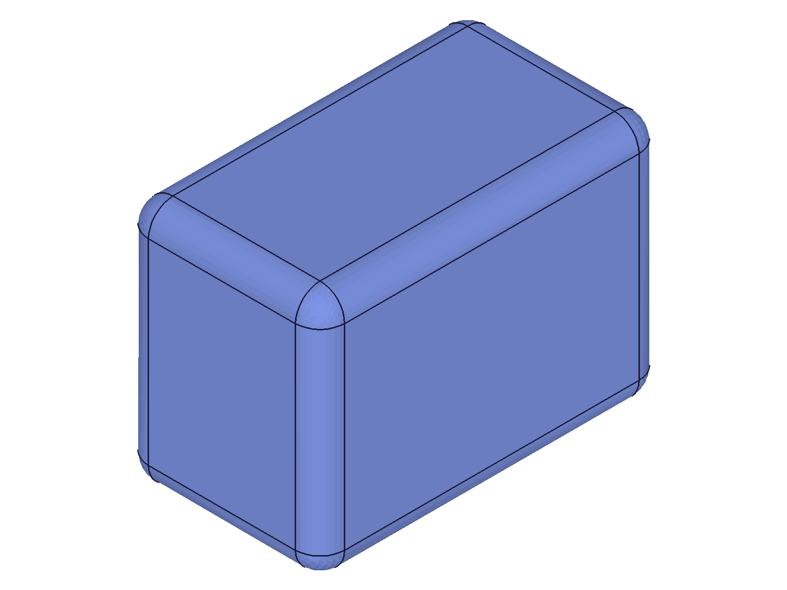 |
| --- | --- |

**Data:** `result: 61` (same as boxId — offset modifies the target in place, does NOT create a new solid). `maxLevel: 31` (info). No messages. STEP file grew from 9.7KB to 51KB — significant complexity increase from fillet surfaces.

**Learned:**
- `offset` returns the **same ID** as the target. It modifies the solid in place.
- With `extend: FALSE` (default), the algorithm fills gaps at edges with **fillet surfaces** of radius equal to the offset distance. The box visibly gets rounded edges/corners.
- This changes topology (more faces/edges than original box) despite the docs warning about topology changes. The topology constraint likely applies to `extend: TRUE` mode specifically.

**📌 LLM doc:** offset returns target ID (in-place modification, not a new solid). Default `extend: FALSE` adds fillet surfaces at edges.

---

## 02 — negative distance (inward offset)

Script: `scripts/02-negative-distance.mjs` — ✅ succeeds with `distance: -5` but produces degenerate geometry.

| 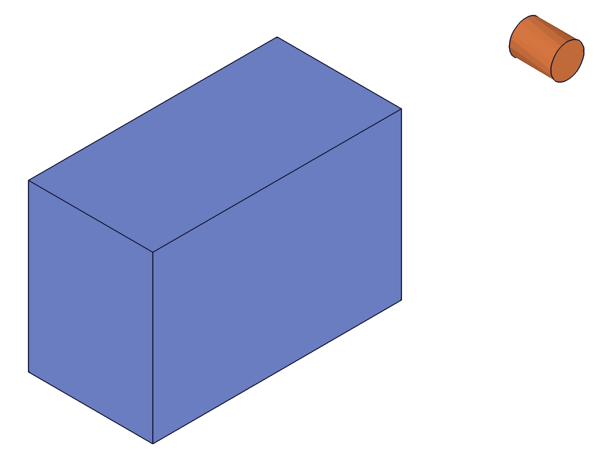 | 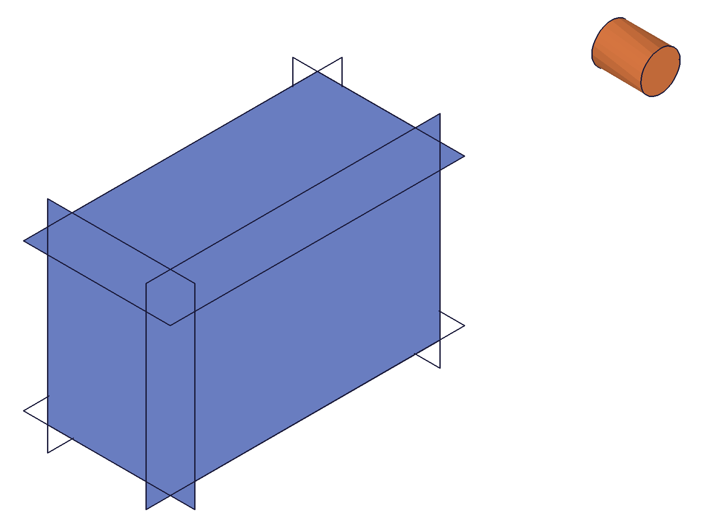 |
| --- | --- |

**Data:** `result: 61` (target ID). `maxLevel: 31` (info). No messages or errors. Reference cylinder unchanged.

**Learned:** Negative distance with `extend: FALSE` produces self-intersecting geometry. The faces move inward but the fillet-filling algorithm can't handle negative-radius fillets. Result shows faces protruding beyond corners — effectively self-intersecting. The API returns success (no error) even though the result is geometrically degenerate.

**📌 LLM doc:** Negative distance is accepted without error but produces self-intersecting geometry with `extend: FALSE`. Use with extreme caution.

---

## 03 — extend: TRUE on a box

Script: `scripts/03-extend-true.mjs` — ✅ `extend: TRUE` produces a sharp-edged larger box, no fillets.

| 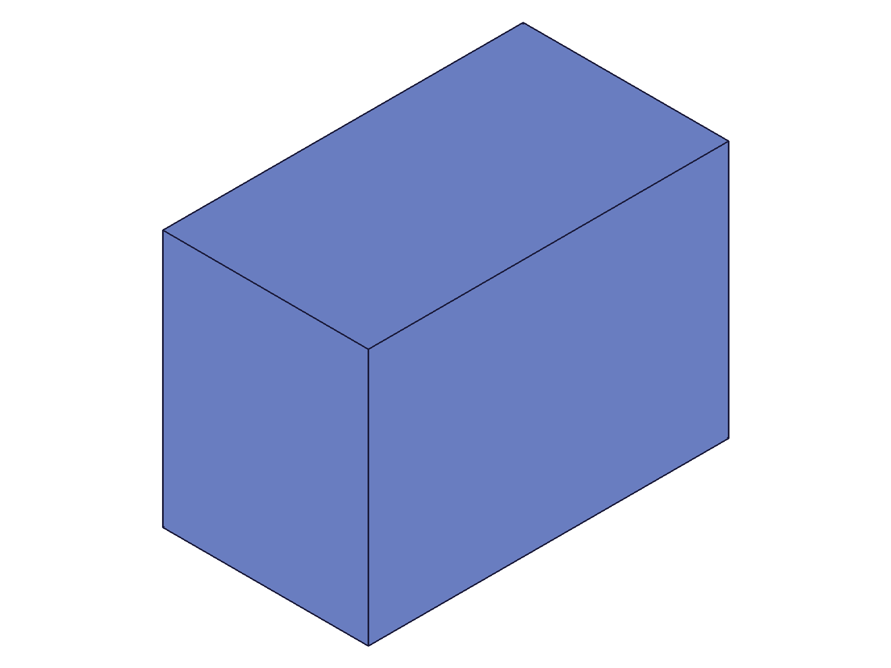 |
| --- |

**Data:** `result: 61` (target ID). `maxLevel: 31` (info). No messages.

**Learned:** With `extend: TRUE`, surfaces are extended beyond their trimming curves to meet each other naturally. For a box, all 6 planar faces extend and still meet at sharp 90° angles — same topology (6 faces, 12 edges, 8 vertices). No fillet surfaces added. This is the "preserve topology" mode described in the docs.

Compare to script 01: `extend: FALSE` (default) added fillet surfaces at edges (rounded corners); `extend: TRUE` keeps sharp edges.

**📌 LLM doc:** `extend: TRUE` preserves topology — surfaces extend to meet each other. `extend: FALSE` fills edge gaps with fillet surfaces. Use `TRUE` for sharp-edge preservation, `FALSE` for rounded results.

---

## 04 — sphere offset

Script: `scripts/04-sphere-offset.mjs` — ✅ trivial case, sphere grows uniformly.

| 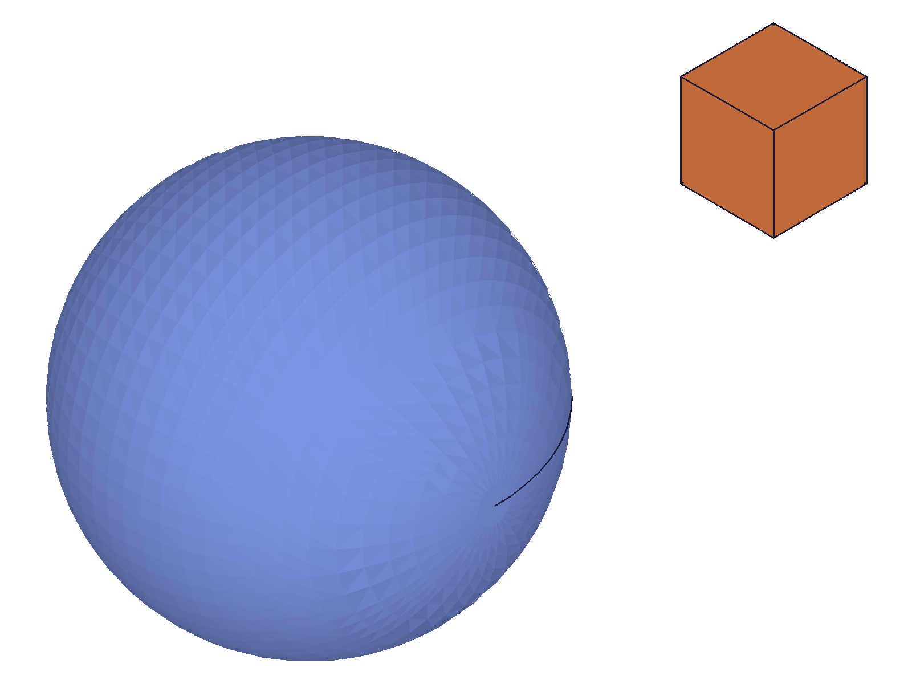 | 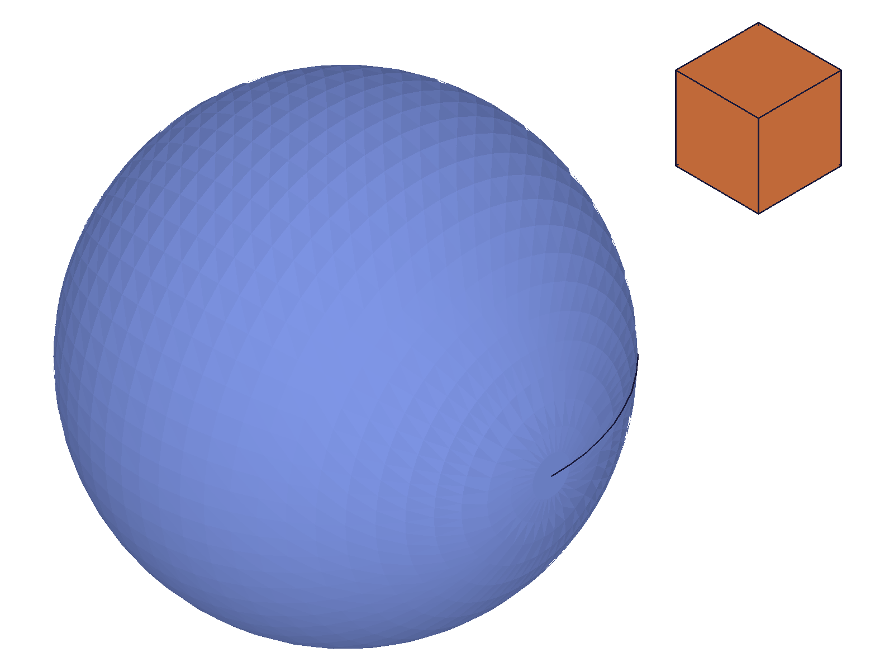 |
| --- | --- |

**Data:** `result: 60` (sphere ID). `maxLevel: 31`. Sphere grew visibly relative to the fixed-size reference box. Offset of a sphere is trivially radius + distance.

**Learned:** Sphere offset works perfectly — simplest possible case (no edges, single face). Reference body confirms actual size change.

---

## 05 — cylinder offset

Script: `scripts/05-cylinder-offset.mjs` — ✅ cylinder offset with filleted edges.

| 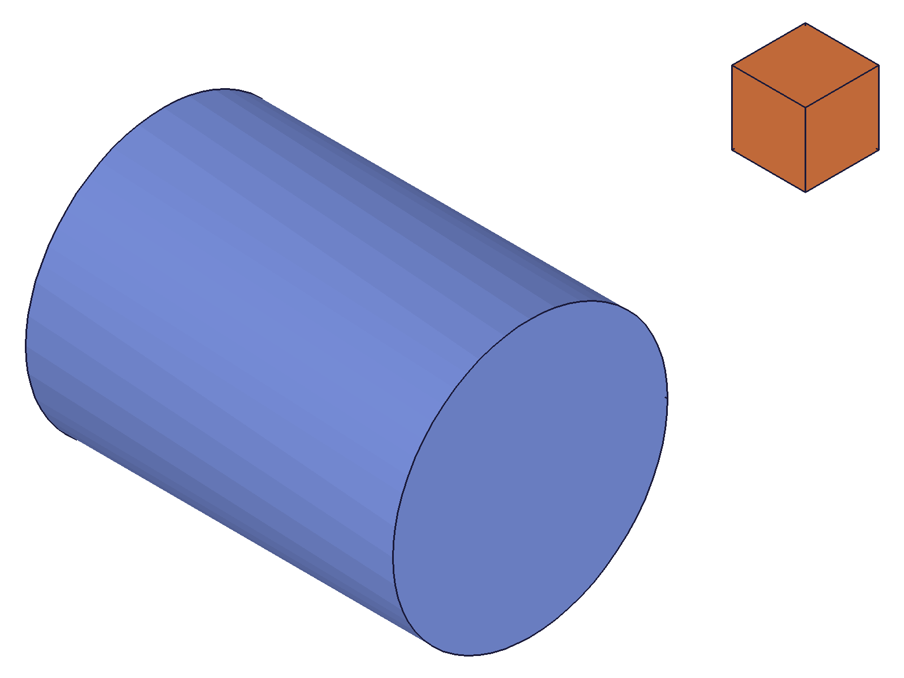 | 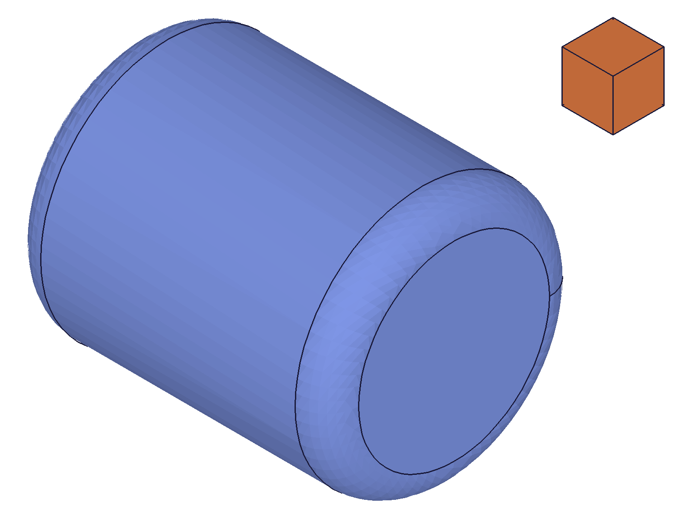 |
| --- | --- |

**Data:** `result: 61` (cylinder ID). `maxLevel: 31`. No messages.

**Learned:** Cylinder offset with `extend: FALSE` adds fillet surfaces where the flat end caps meet the curved side. The cylinder's edges become rounded. Similar behavior to box offset — the default mode always introduces fillets at edges.

**📌 LLM doc:** Cylinder offset adds fillets at top/bottom edges with `extend: FALSE`.

---

## 06 — cone offset

Script: `scripts/06-cone-offset.mjs` — ✅ cone offset works, fillets at edges.

| 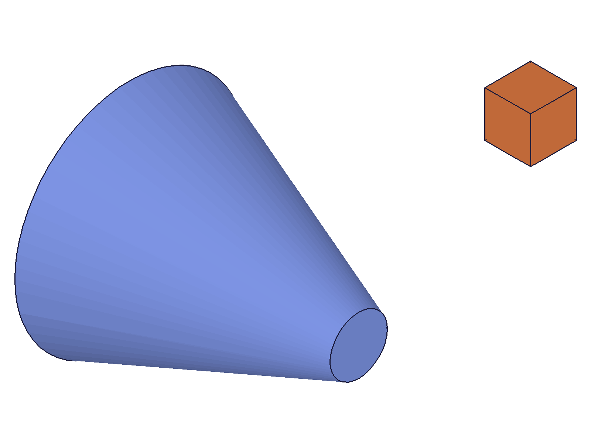 | 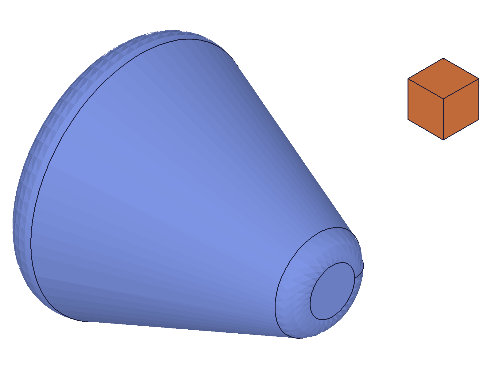 |
| --- | --- |

**Data:** `result: 61` (cone ID). `maxLevel: 31`. Cone grew relative to reference box. Fillets visible at top edge (flat cap → conical surface) and bottom edge.

**Learned:** Cone offset with `extend: FALSE` works cleanly. Fillets appear at the edges where flat caps meet the conical surface.

---

## 07 — zero distance

Script: `scripts/07-zero-distance.mjs` — ✅ zero offset is a no-op, box unchanged.

|  |
| --- |

**Data:** `result: 61` (box ID). `maxLevel: 31`. Box looks identical to a regular box — no fillets, no change.

**Learned:** `distance: 0` is accepted without error. It's a no-op — the solid is unchanged. No fillet surfaces added because there's nothing to fill.

---

## 08 — large negative distance (degenerate)

Script: `scripts/08-large-distance.mjs` — ✅ succeeds but produces degenerate geometry.

| 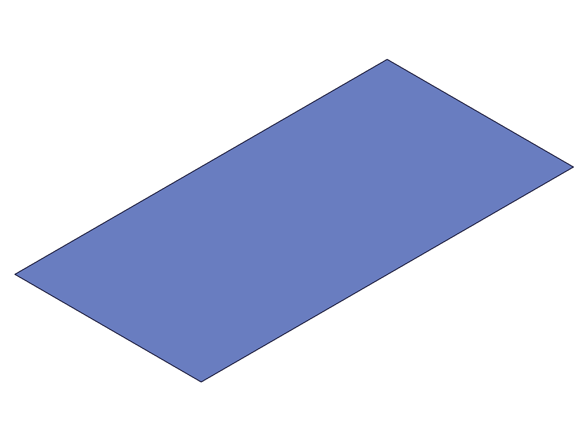 |
| --- |

**Data:** `result: 61` (box ID). `maxLevel: 31`. **No error.** A 60×40×30 box with `distance: -20` collapsed into a flat sheet — the top and bottom faces moved inward 20 units each (total 40) on a 30-height box, causing them to cross. The result is a degenerate near-zero-thickness parallelogram.

**Learned:** The API does NOT validate whether the offset distance is geometrically safe. Excessively large negative distances produce collapsed/degenerate geometry silently (no error, no warning). This is the "fragile" part — the caller must ensure distance is reasonable.

**📌 LLM doc:** No distance validation — large negative distances collapse geometry silently. Caller must ensure `|distance| < half_smallest_dimension`.

---

## 09 — boolean solid offset (box with cylinder hole)

Script: `scripts/09-boolean-solid.mjs` — ✅ offset works on boolean'd solids.

| 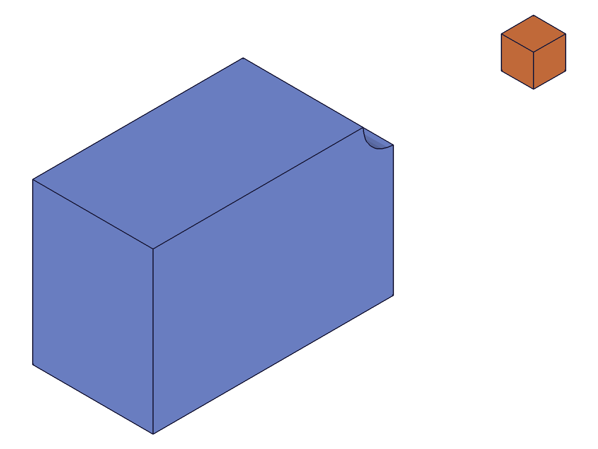 | 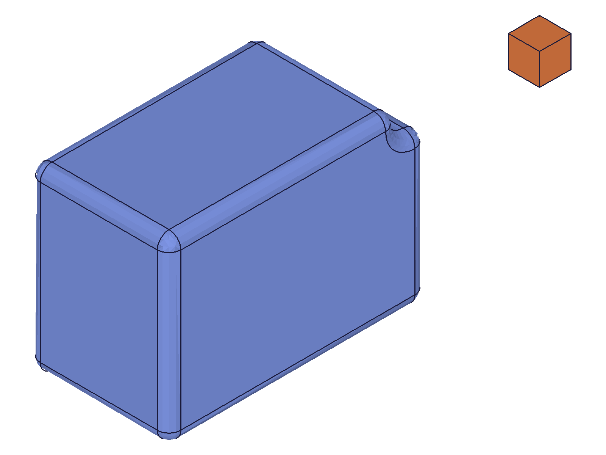 |
| --- | --- |

**Data:** `result: 61` (box ID). `maxLevel: 31`. The box+hole grew (filleted edges visible). The cylindrical hole is preserved and its inner surface moved outward (hole got smaller). Reference box confirms size change.

**Learned:** Offset works on boolean-subtracted solids with `distance: 3`. The existing cylinder-hole topology is preserved. With `extend: FALSE`, fillets appear at the box edges AND at the hole rim where it meets the top/bottom faces. The hole's diameter effectively decreases by 2×distance (inner surface offsets outward).

**📌 LLM doc:** Offset works on boolean'd solids with simple cuts (e.g., cylinder hole through box). Holes shrink by 2×distance on outward offset.

---

## 10 — extend: TRUE with negative distance

Script: `scripts/10-extend-true-negative.mjs` — ✅ clean inward offset with sharp edges.

|  | 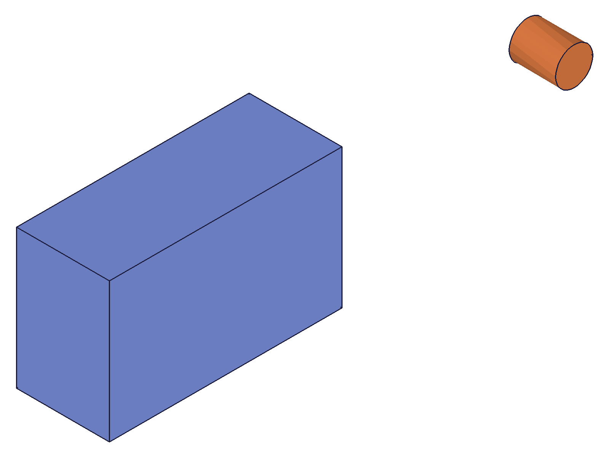 |
| --- | --- |

**Data:** `result: 61` (box ID). `maxLevel: 31`. Box visibly shrank relative to reference cylinder (same size). Sharp edges preserved — no fillets.

**Learned:** `extend: TRUE` with negative distance is the **correct way to do inward offset**. Surfaces recede and still meet at sharp angles. Compare to script 02 (`extend: FALSE` + negative) which produced degenerate self-intersecting geometry.

**📌 LLM doc:** For inward (negative) offset, always use `extend: TRUE`. `extend: FALSE` with negative distance produces self-intersecting geometry.

---

## 11 — extrusion offset (L-shape)

Script: `scripts/11-extrusion-offset.mjs` — ✅ works on extruded L-profile, fillets at all edges including concave inner corner.

| 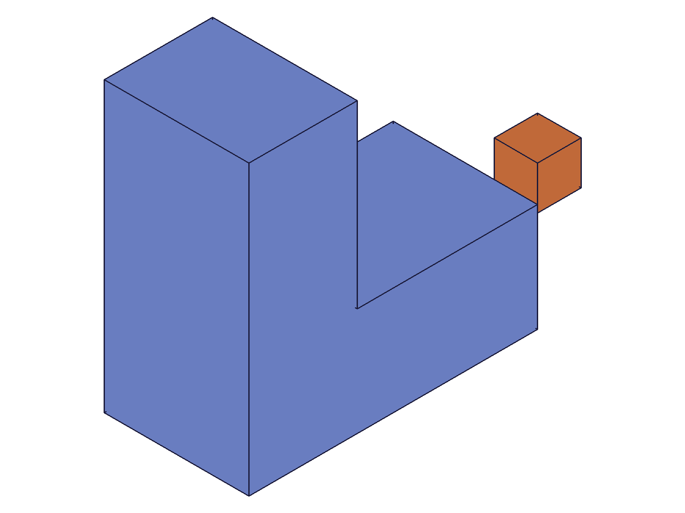 | 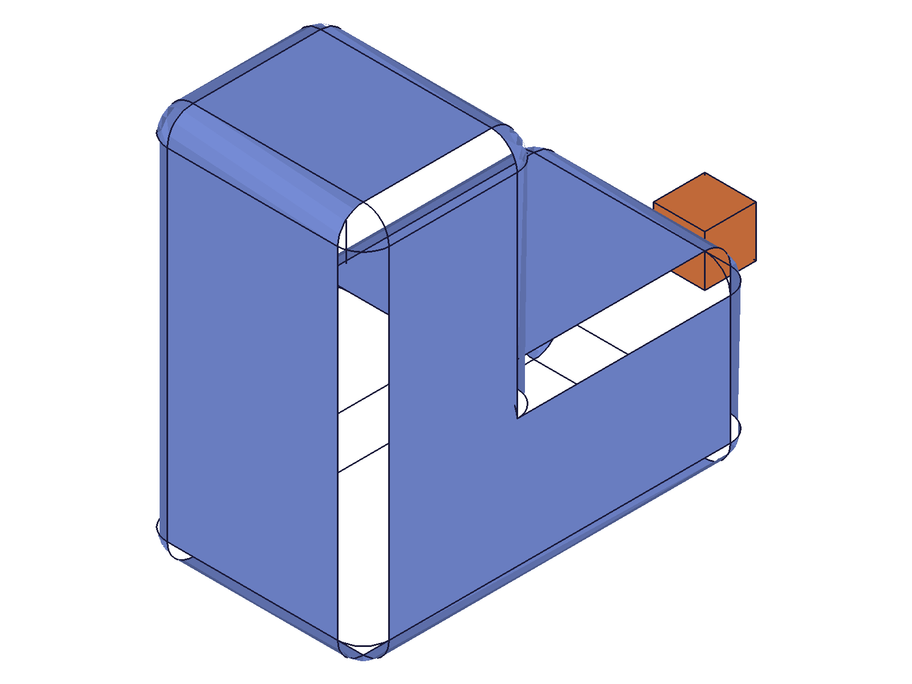 |
| --- | --- |

**Data:** `result: 64` (extrusion ID). `maxLevel: 31`. L-shape grew with fillets at all edges. The concave 270° inner corner shows some rendering artifacts (white gaps/seams) — possibly tessellation struggling with the concave fillet geometry, or actual geometric gaps.

**Learned:** Offset handles concave geometry (inner corners of L-shapes). The fillet algorithm creates concave fillets at inner edges. Rendering quality may suffer at complex fillet junctions.

---

## 12 — revolve offset (torus)

Script: `scripts/12-revolve-offset.mjs` — ✅ works on a revolved rectangular cross-section torus.

| 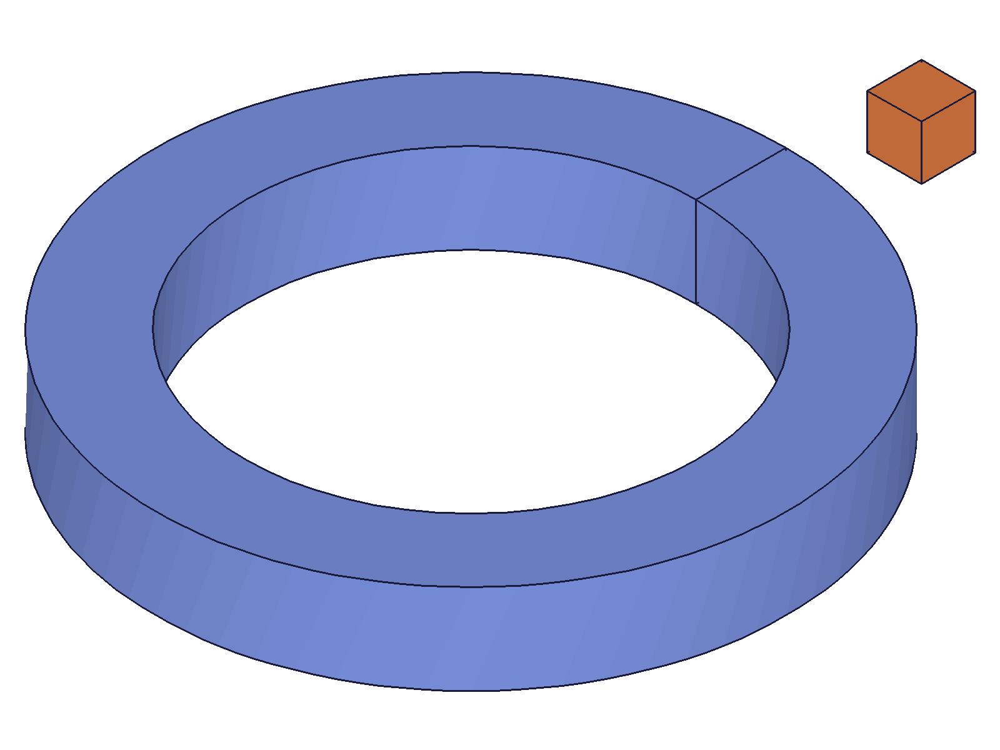 | 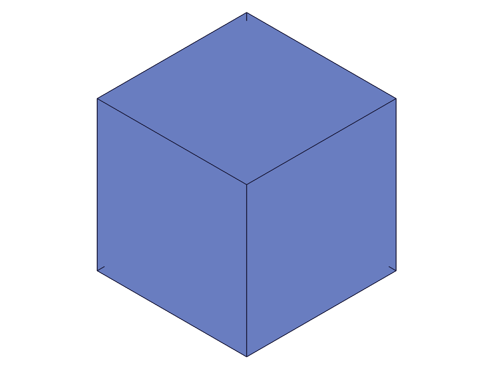 |
| --- | --- |

**Data:** `result: 64` (revolve ID). `maxLevel: 31`. Torus grew relative to reference box. Fillets visible at the edges where flat and curved surfaces meet. Revolve seam line visible but handled correctly.

**Learned:** Offset works on revolve-based solids. The revolve seam (start/end face junction) is handled properly.

---

## 13 — multiple booleans (SERVER HANG)

Script: `scripts/13-multiple-booleans.mjs` — ❌ **TIMEOUT at 30s. Worker hung at 100% CPU.**

No output, no snapshot. Box with 3 cylinder holes (complex boolean topology) caused the offset algorithm to enter an infinite loop.

**Data:** No response — worker hung. Had to `kill -9` and restart.

**Learned:** This is the "fragile" failure mode documented by the API. Multiple boolean operations create complex topology (many edges, concave/convex face intersections) that the offset algorithm cannot handle. **The server does not return an error — it hangs permanently.** There is no graceful failure. This is the most dangerous behavior: no error, no timeout, just a dead server.

**📌 LLM doc:** CRITICAL: offset on solids with multiple boolean operations (3+ holes) can hang the server permanently (100% CPU, no response). There is no error — it just hangs. Only use offset on simple-topology solids (primitives, single boolean cut). Always have a timeout/watchdog.

---

## 14 — target identity check

Script: `scripts/14-target-consumed.mjs` — ✅ confirms in-place modification.

| 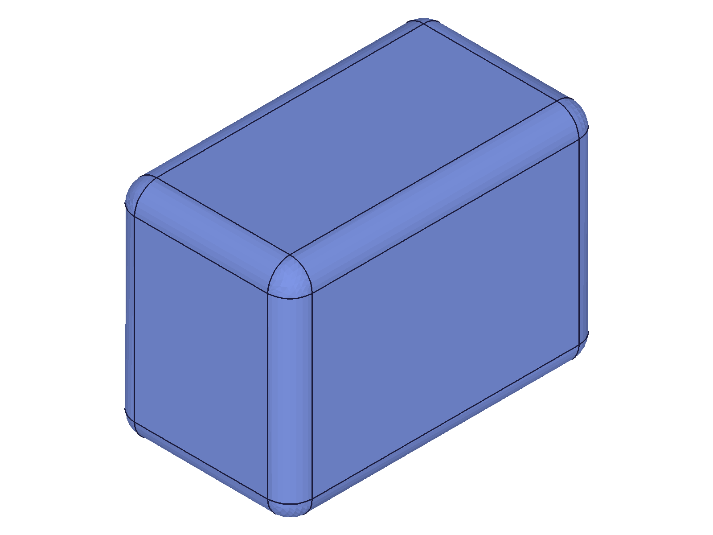 |
| --- |

**Data:** `offset result === boxId? true`. Body count after offset = 1. Translation of the offset result using the same ID succeeded (`maxLevel: 31`).

**Learned:** Offset definitively modifies the target in place. `r.result === boxId` is `true`. The target ID remains valid after offset and can be used in subsequent operations (e.g., translation). No new solid is created.

---

## 15 — extend: TRUE on L-shape extrusion

Script: `scripts/15-extend-true-lshape.mjs` — ✅ clean result with sharp edges, no artifacts.

| 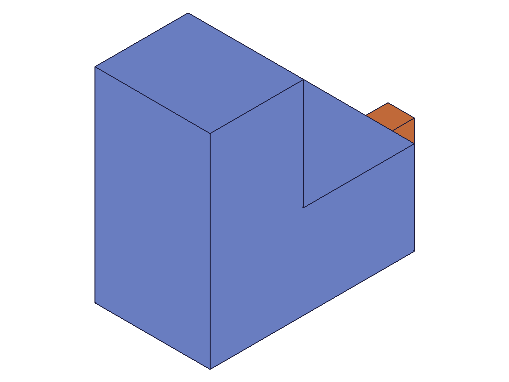 |
| --- |

**Data:** `result: 64` (extrusion ID). `maxLevel: 31`. L-shape grew with all sharp edges preserved. No fillets, no white gaps. Compare to script 11 (`extend: FALSE`) which had rendering artifacts at the inner corner fillets.

**Learned:** `extend: TRUE` is cleaner for complex shapes — surfaces extend to meet naturally, preserving topology. `extend: FALSE` can produce fragile fillet geometry at concave corners.

---

## 16 — extend: TRUE on boolean solid (box - cylinder)

Script: `scripts/16-extend-true-boolean.mjs` — ✅ works, sharp edges preserved.

| 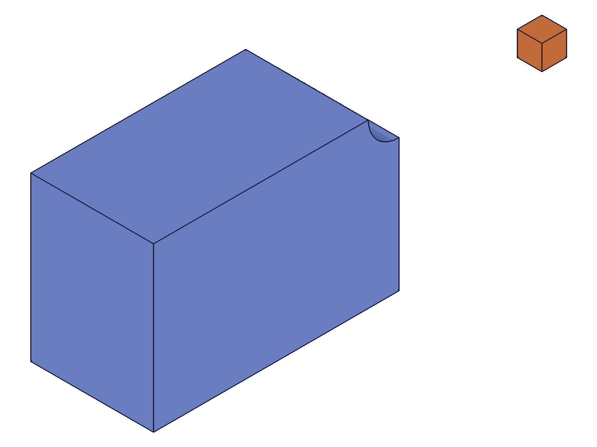 | 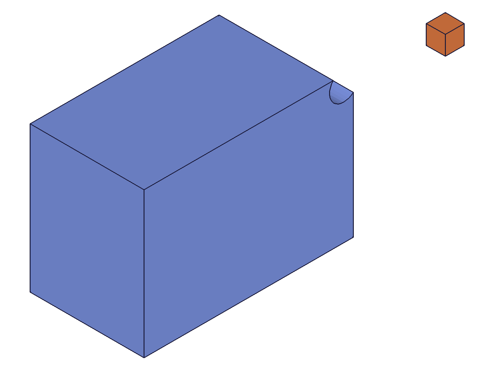 |
| --- | --- |

**Data:** `result: 61` (box ID). `maxLevel: 31`. Box grew with sharp edges. Cylinder hole still visible but smaller. No fillet surfaces added at edges — only the surfaces moved outward.

**Learned:** `extend: TRUE` on boolean'd solids preserves the sharp-edged character. The cylinder hole surface extends inward (hole shrinks), outer box surfaces extend outward. Same qualitative result as `extend: FALSE` (script 09) but without added fillets.

---

## Coverage summary

16 scripts total. Covered: all required params, optional `extend` param, positive/negative/zero distances, 6 primitive types (box, sphere, cylinder, cone, extrusion, revolve), boolean solids, identity check. Found: server hang on complex topology (script 13), degenerate geometry on excessive negative distance (script 08), self-intersecting geometry on `extend: FALSE` + negative (script 02).
