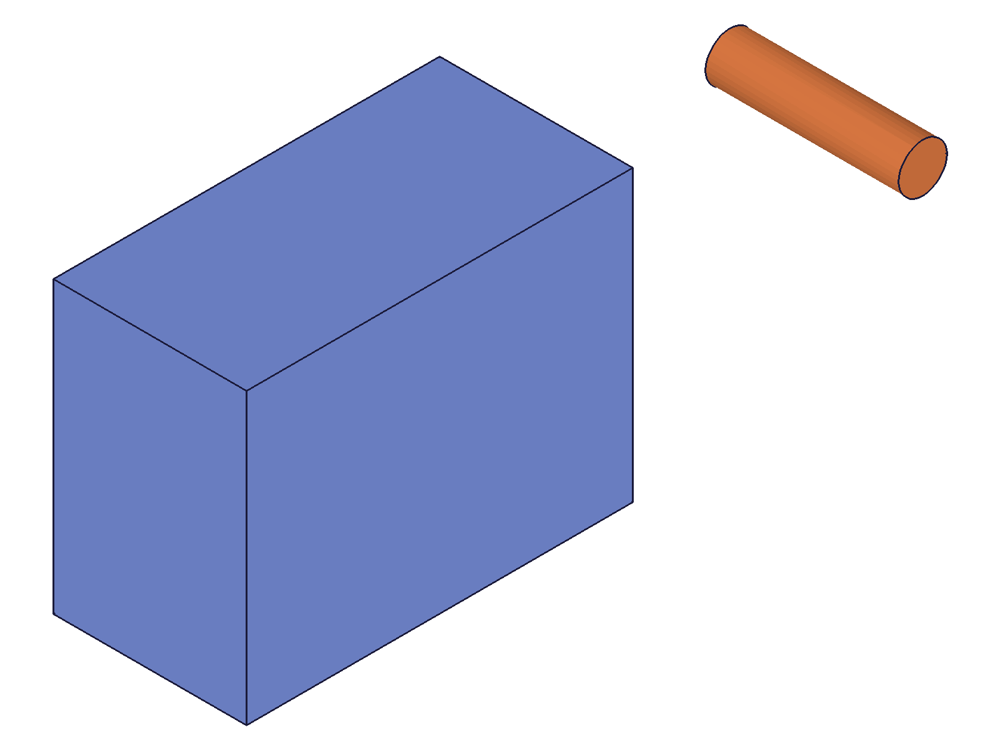
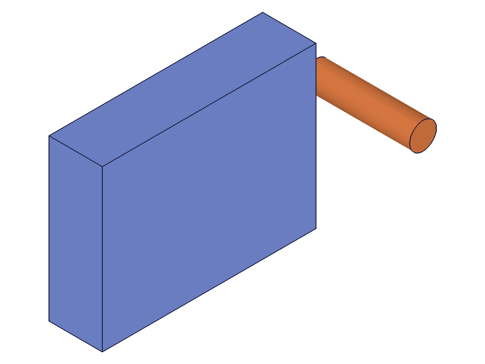
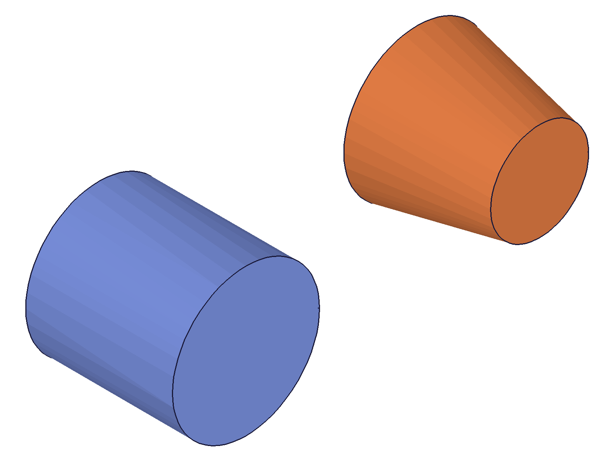
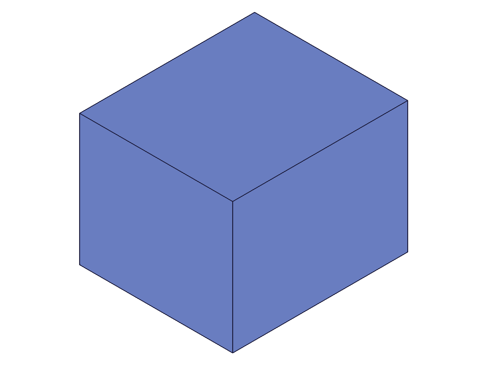
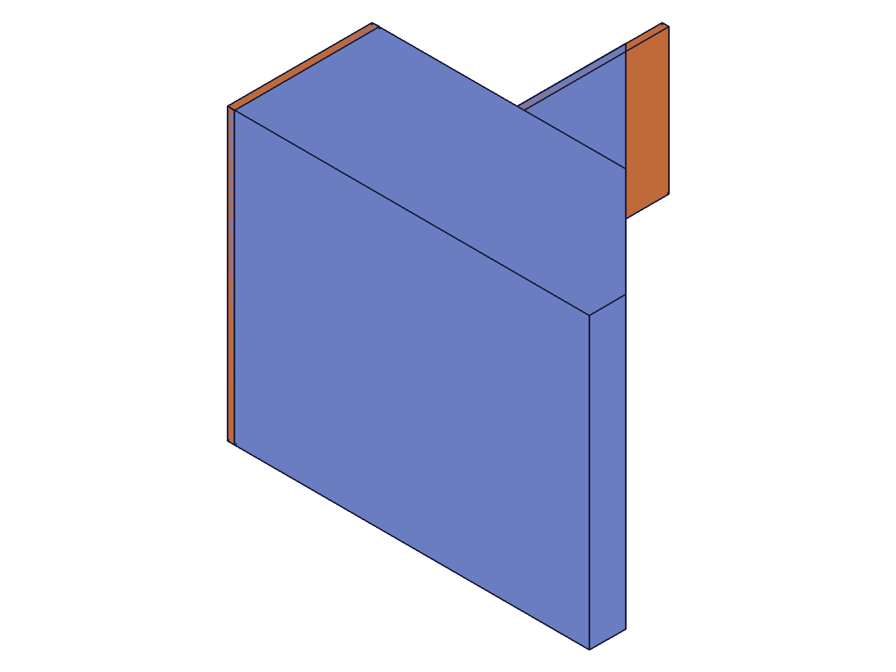

# Training: solid.slice

**Date:** 2026-04-15

## Goal

Testing `v1.solid.slice` — cutting solids at a defined plane.

**Methods to cover:**

- `slice` — basic plane cut with default `keepBoth: TRUE`
- `slice` — `keepBoth: FALSE` (discard one half)
- `slice` params: `id`, `target`, `originPos`, `normal`, `keepBoth`
- Normal direction variations — which side is kept/discarded
- Slicing at different positions through the solid
- Slicing at edges/boundaries (degenerate cases)
- Slicing multiple solids / multiple sequential slices
- Return value: ID behavior with keepBoth TRUE vs FALSE

---

## 01 — basic keepBoth default (TRUE)

Script: `scripts/01-basic-keepboth.mjs` — ❌ **SERVER HANG**. The slice call with default `keepBoth` (TRUE) caused the server to hang at 100% CPU. Timed out after 30s. Worker had to be killed and restarted.

**📌 LLM doc:** `keepBoth: true` (the default!) causes a server hang. CRITICAL — always pass `keepBoth: false` explicitly.

## 02 — keepBoth: false (basic)

Script: `scripts/02-slice-simple.mjs` — ✅ Slice at z=20, normal [0,0,1], keepBoth: false. Result: null (VOID). maxLevel: 31. No messages. The box was sliced successfully.

|  |
|---|

**Data:** result=null, maxLevel=31, messages=[]. See `files/02-slice-simple-slice-response.json`.

## 03 — keepBoth: true (explicit)

Script: `scripts/03-keepboth-true.mjs` — ❌ **SERVER HANG**. Confirms that `keepBoth: true` reliably hangs the server. Worker at 100% CPU, no response. Killed and restarted.

**📌 LLM doc:** Confirmed — `keepBoth: true` hangs on simple box. Both default and explicit `true` cause the hang. This is a kernel bug.

## 04 — normal direction with reference

Script: `scripts/04-normal-direction.mjs` — ✅ Normal [0,0,1] at z=20 with reference cylinder. Due to auto-scaling, before/after snapshots look identical.

|  |  |
|---|---|

**Data:** Visually indistinguishable due to auto-scaling. Same result/maxLevel as script 02. Needed numeric verification.

## 05 — verify with data (attempt)

Script: `scripts/05-verify-with-data.mjs` — ✅ ran but `r.graphic.meshes` is empty in CLI context. The graphic data structure uses `containers[].meshes` not top-level `meshes`. Redirected to script 06.

## 06 — structure and graphic exploration

Script: `scripts/06-structure-data.mjs` — ✅ Discovered the graphic data structure: `r.graphic.containers[].properties.{min, max}` holds the bounding box. Both before and after graphic files were 11059 bytes and had identical bounding boxes — because the slice was at z=20 (top face of the centered box), so nothing was actually cut.

**Learned:** Graphic data is in `r.graphic.containers[]`, each with `owner` (solid ID), `properties.min/max` (bounding box), and `meshes[]` (vertex data). The boxes built with `solid.box` are centered at origin.

## 07 — midplane slice with numeric verification

Script: `scripts/07-midplane-slice.mjs` — ✅ Box centered at origin (Z: -20 to 20). Sliced at z=0, normal [0,0,1].

|  |
|---|

**Data:** BEFORE bbox Z: [-20, 20]. AFTER bbox Z: [-20, 0]. The **bottom half** (negative Z) was kept. The **top half** (positive Z, where the normal points) was removed. Reference cylinder at x=60 is full height, confirming the box is now half-height.

**📌 LLM doc:** Doc discrepancy! The docs say "Part on the **negative** side of normal vector is removed." But the actual behavior is: **the positive side (where the normal points) is removed**. The solid is kept on the side OPPOSITE to the normal direction.

## 08 — reversed normal

Script: `scripts/08-reversed-normal.mjs` — ✅ Normal [0,0,-1] at z=0. Result: bbox Z: [0, 20]. The **top half** was kept this time.

**Data:** Normal [0,0,-1] keeps Z[0,20] (positive Z). Normal [0,0,1] keeps Z[-20,0] (negative Z). The pattern is consistent: the side the normal points toward is removed. Confirmed the doc discrepancy from script 07.

**📌 LLM doc:** Document the corrected behavior: normal points toward the material to DISCARD.

## 09 — diagonal normal

Script: `scripts/09-diagonal-normal.mjs` — ✅ Normal [1,0,1] at origin. Box centered 100³.

**Data:** AFTER bbox: X[-40,20] Y[-30,30] Z[-20,20]. The max X changed from 40 to 20 (the diagonal plane x+z=0 intersects the bottom face at x=20). Consistent with positive-side-removed behavior.

## 10 — sphere slice

Script: `scripts/10-sphere-slice.mjs` — ✅ Sphere radius 30, sliced at y=10, normal [0,1,0].

**Data:** AFTER bbox: Y[-30,10]. Sphere trimmed correctly. Works on curved geometry.

## 11 — cylinder and cone

Script: `scripts/11-cylinder-cone.mjs` — ✅ Both sliced at z=0.

|  |
|---|

**Data:** Cylinder Z: [-30,0]. Cone Z: [-25,0]. Both halved correctly. Snapshot shows clean flat-top shapes.

## 12 — plane outside solid

Script: `scripts/12-outside-solid.mjs` — ✅ Two cases: plane above (z=50) and plane below (z=-50), normal [0,0,1].

|  |
|---|

**Data:** Both cases are no-ops. Bbox unchanged after both slices. No error, no messages. maxLevel: 31.

**📌 LLM doc:** Slicing with a non-intersecting plane is a silent no-op. No error, solid unchanged.

## 13 — slice at face boundary

Script: `scripts/13-at-face.mjs` — Two sequential slices: top face (z=20) then bottom face (z=-20), both normal [0,0,1].

**Data:** Top face (z=20): no-op, bbox unchanged. Bottom face (z=-20): bbox null, no PNG generated — the solid was **deleted**. When the plane coincides with a face such that the entire solid is on the remove side, the solid is eliminated.

## 14 — plane below solid (clean test)

Script: `scripts/14-plane-below-only.mjs` — ✅ Single slice at z=-50, normal [0,0,1]. Box still exists, bbox unchanged.

**Data:** Confirmed: non-intersecting planes are no-ops even when the solid is entirely on the positive (remove) side. The plane must actually touch/intersect the solid geometry for the operation to take effect.

**📌 LLM doc:** Document the boundary behavior: non-intersecting = no-op, face-coincident on remove side = solid deleted.

## 15 — exact face boundary (clean test)

Script: `scripts/15-exact-face-boundary.mjs` — ✅ Single slice at z=-20 (bottom face), normal [0,0,1].

**Data:** Container count: 0. Solid deleted. Confirms finding from script 13.

## 16 — boolean result slice

Script: `scripts/16-boolean-result.mjs` — ✅ L-shaped union of two boxes, sliced at z=0.

**Data:** AFTER bbox: Z[-20,0]. Boolean results are sliceable. The union was treated as a single solid.

## 17 — in-place modification check

Script: `scripts/17-in-place-check.mjs` — ✅ After slicing (bbox Z: [-20,0]), translated by [0,0,30]. New bbox Z: [10,30].

**Data:** The original boxId (61) remains valid and usable after slice. `solid.translation` returned the same ID (61). Slice modifies the target in place — no new solid ID is created.

**📌 LLM doc:** Target is modified in place. The original solid ID remains valid for subsequent operations.

## 18 — multiple sequential slices

Script: `scripts/18-multi-slice.mjs` — ✅ Box 100³, three sequential slices trimming top/right/front.

|  |
|---|

**Data:** After 3 slices: bbox [-50,-50,-50] to [30,10,20]. Each slice progressively trimmed the solid. All three used the same boxId. Multiple slices work correctly in sequence.

## 19 — unnormalized and zero normal

Script: `scripts/19-unnormalized-normal.mjs` — ✅ Two cases.

**Data:**
- Unnormalized [0,0,100]: worked identically to [0,0,1]. bbox Z: [-20,0]. Normal magnitude doesn't matter, only direction.
- Zero normal [0,0,0]: result=null, maxLevel=31, messages=[]. **Silent no-op** — no error, no change.

**📌 LLM doc:** Normal doesn't need to be unit length. Zero normal is a silent no-op.

## 20 — extrusion slice (complex profile)

Script: `scripts/20-extrusion-slice.mjs` — ✅ L-shaped extrusion sliced diagonally.

|  |
|---|

**Data:** AFTER bbox: [0,0,0] to [55,40,50]. Diagonal cut visible in snapshot. Works correctly on complex extruded profiles.
