# Training: solid.rotation

**Date:** 2026-04-15

## Goal

Testing `v1.solid.rotation` — rotates a solid by a rotation vector `[rx, ry, rz]` in radians. Docs state: "First the z-part of the rotation vector is performed, then the y-part and finally the x-part."

**Methods to cover:**

- `rotation` — basic rotate around single axis (X, Y, Z individually)
- `rotation` — combined multi-axis rotation
- `rotation` — rotation order (Z→Y→X) verification
- `rotation` — zero vector `[0,0,0]`
- `rotation` — negative angles
- `rotation` — cumulative rotations (successive calls stack?)
- `rotation` — on compound solids (post-boolean)
- `rotation` — error cases: wrong ID types, consumed tools, missing params

**Questions:**

- Does it return the target solid ID or a new ID?
- Is rotation cumulative like translation?
- What is the rotation order? Docs say Z→Y→X — verify with non-symmetric solid
- What happens with `[0,0,0]`?
- What happens with angles > 2π?
- Does it work on compound solids?
- Are angles truly in radians? (π/2 ≈ 1.5708 should be 90°)
- Where is the rotation center — origin or body center?

---

## 01 — basic Z rotation

Script: `scripts/01-basic-rotate-z.mjs` — ✅ Box (80×40×20) rotated 45° around Z. Returns same solid ID (61), maxLevel=31, messages=[].

| 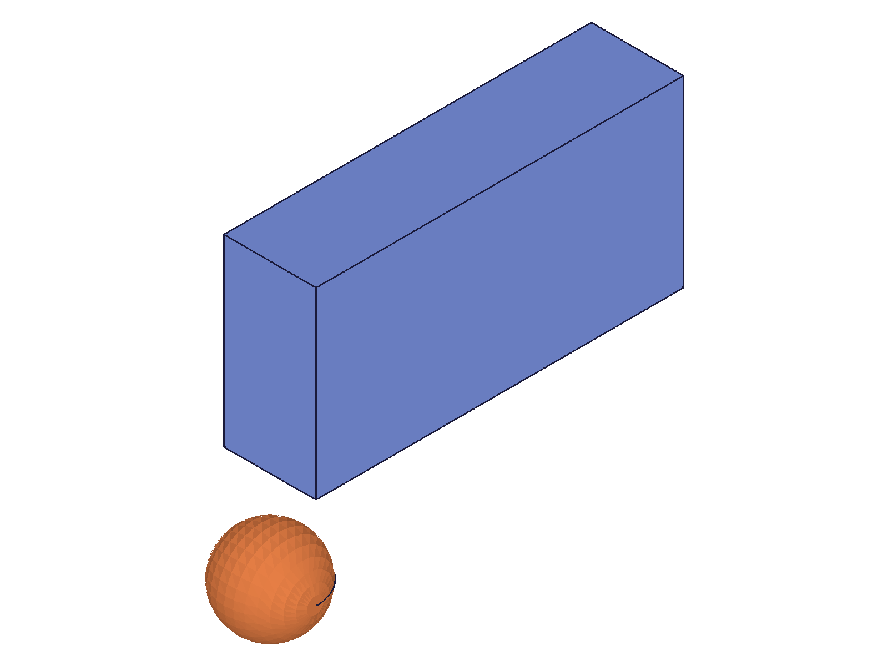 | 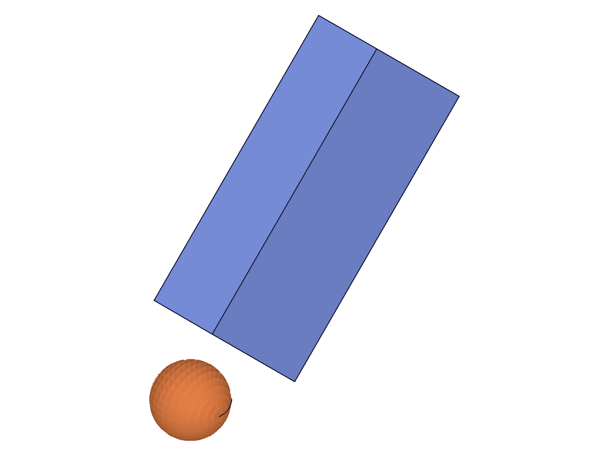 |
|---|---|

**Data:** result=61 (same boxId), maxLevel=31. See `files/01-basic-rotate-z-rotation-z-response.json`. Visually: box clearly rotated — the long axis (80 in X) is now at 45° in XY plane. Reference sphere unmoved.

📌 LLM doc: Returns same solid ID, maxLevel=31 on success. Angles are in radians.

---

## 02 — per-axis 90° rotations

Script: `scripts/02-rotate-each-axis.mjs` — ✅ Three identical boxes (80×40×20), each rotated 90° around a different axis.

| 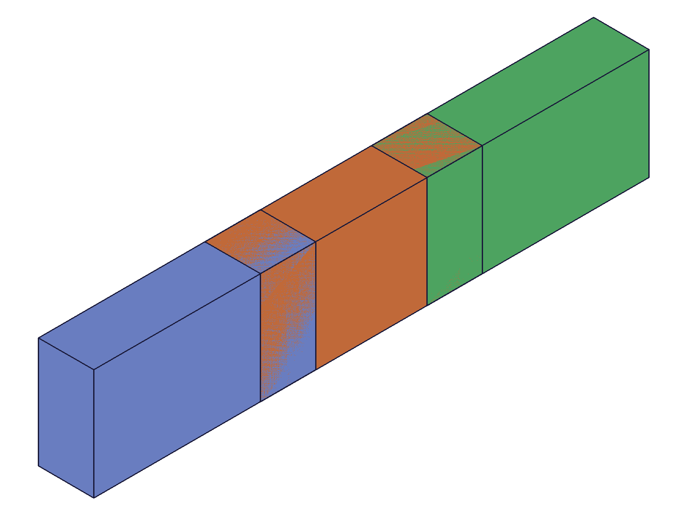 | 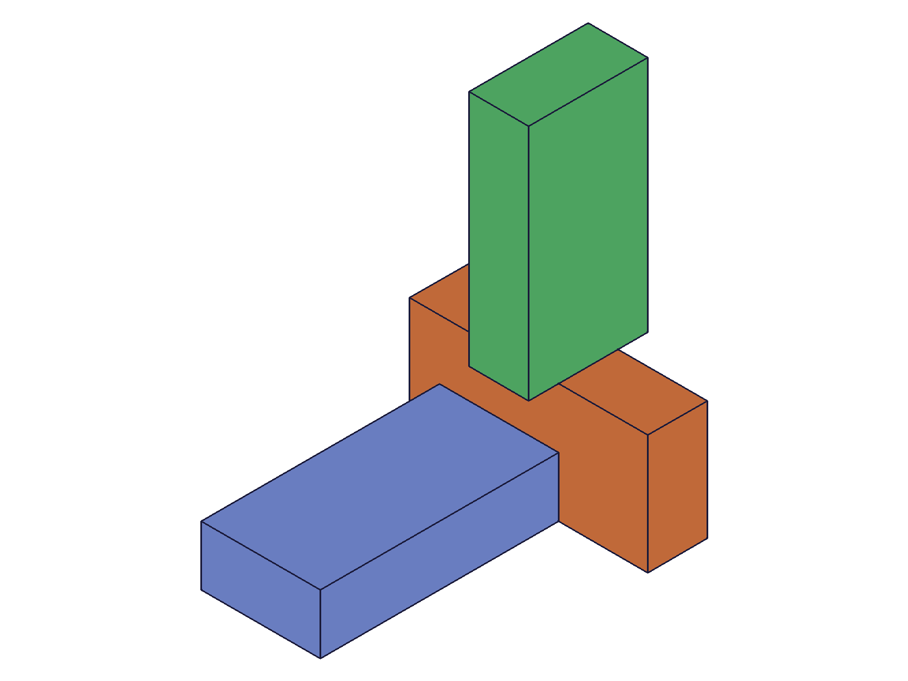 |
|---|---|

**Data:** All three return their original IDs (61, 64, 67), all maxLevel=31. See `files/02-rotate-each-axis-per-axis-results.json`. Visually: each box has a distinctly different orientation — X-rotated box is standing on its narrow edge, Y-rotated box has its length going vertical, Z-rotated box has its long axis pointing in Y direction. Confirms π/2 = 90° (radians confirmed).

---

## 03 — rotation order (combined vs sequential)

Script: `scripts/03-rotation-order.mjs` — ✅ Combined [π/4, π/4, 0] vs separate Y-then-X rotations produce **different results**.

| 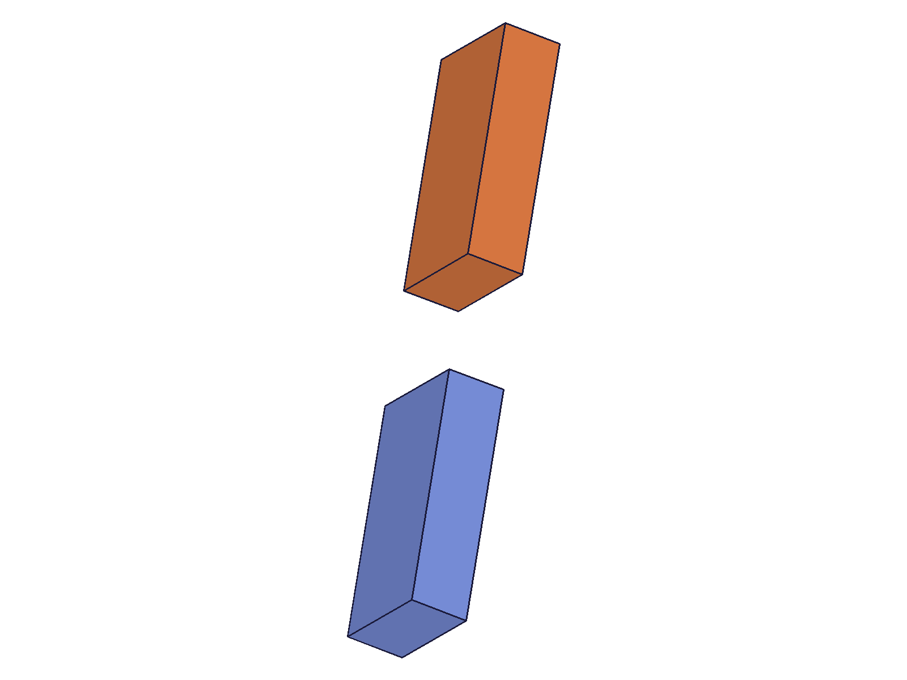 |
|---|

**Data:** Both succeed (maxLevel=31). Visually: the two boxes (blue=combined, orange=sequential) are in distinctly different orientations.

**Learned:** A single call with `rotation: [rx, ry, rz]` applies all three rotations as a single Euler angle operation (Z→Y→X order as documented). This is NOT the same as three separate `rotation` calls. Each separate call rotates around world axes at the current orientation. The combined call applies intrinsic Euler angles: first Z, then Y (in the Z-rotated frame), then X (in the ZY-rotated frame).

📌 LLM doc: Combined [rx,ry,rz] uses Euler angle convention (Z→Y→X), which differs from calling rotation three separate times. Separate calls each rotate around world axes.

---

## 04 — zero vector

Script: `scripts/04-zero-vector.mjs` — ✅ `rotation: [0,0,0]` succeeds silently. result=boxId, maxLevel=31, messages=[].

|  |  |
|---|---|

**Data:** See `files/04-zero-vector-zero-rotation.json`. No-op confirmed — snapshots identical, data confirms success with no change.

---

## 05 — negative angles

Script: `scripts/05-negative-angles.mjs` — ✅ Two boxes: one at +π/4 (45° CCW), one at -π/4 (45° CW) around Z.

|  | 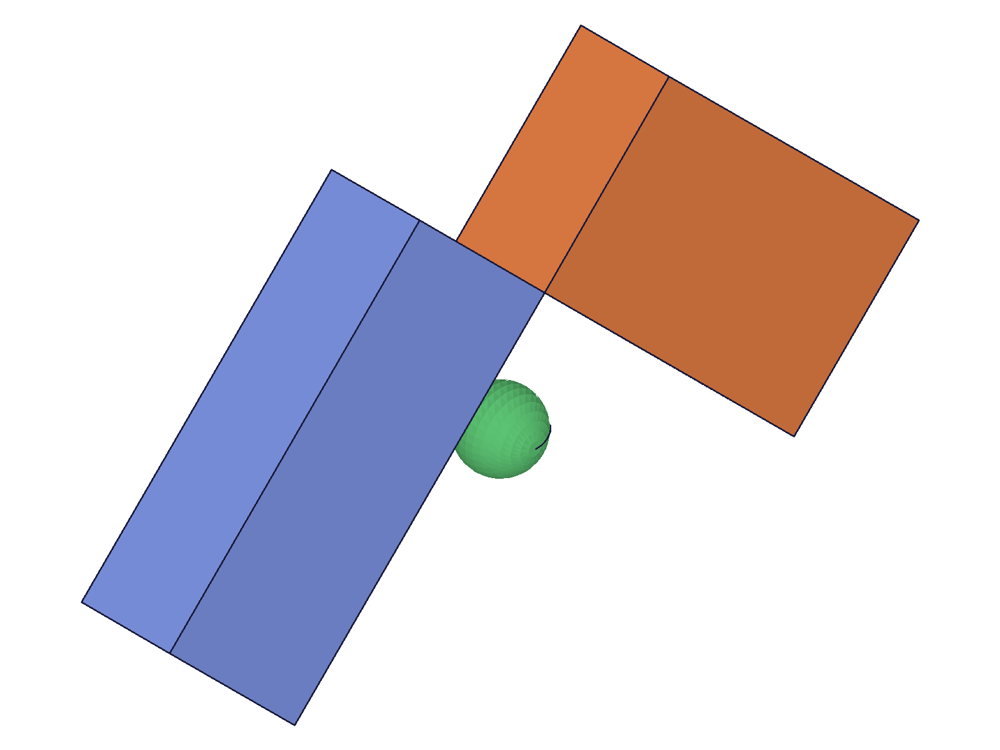 |
|---|---|

**Data:** Both return their solid IDs (61, 64), both maxLevel=31. See `files/05-negative-angles-neg-angles.json`. Visually: boxes are mirror images of each other — blue rotated counterclockwise, orange rotated clockwise. Negative angles work as expected.

---

## 06 — cumulative rotations

Script: `scripts/06-cumulative.mjs` — ✅ Two π/4 calls == one π/2 call. Both boxes end up with identical orientation.

| 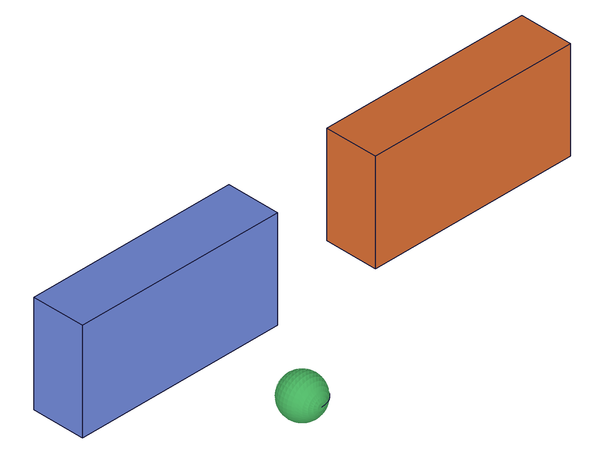 | 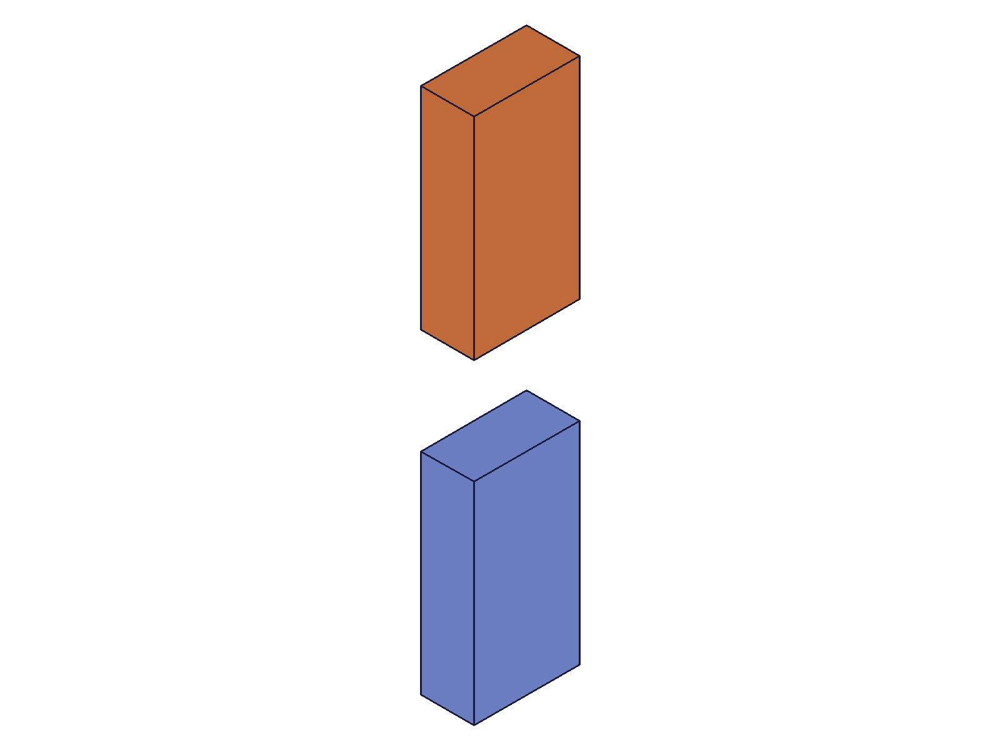 |
|---|---|

**Data:** All calls return solid IDs, maxLevel=31. See `files/06-cumulative-cumulative-results.json`. Visually: both boxes have the same orientation after rotation — confirming successive single-axis rotations are cumulative.

📌 LLM doc: Rotations are cumulative. Two calls of [0,0,π/4] equal one call of [0,0,π/2].

---

## 07 — large angles (>2π)

Script: `scripts/07-large-angles.mjs` — ✅ Full revolution (2π), 3π, and 10π all succeed.

**Data:** All three return boxId (61), all maxLevel=31. See `files/07-large-angles-large-angles.json`. No upper bound on angle values. Angles >2π wrap as expected (2π = full revolution = back to start, 3π = 180°, 10π = 0°).

---

## 08 — compound solid (post-boolean)

Script: `scripts/08-compound-solid.mjs` — ✅ L-shaped compound (union of two boxes) rotated 90° around Z.

| 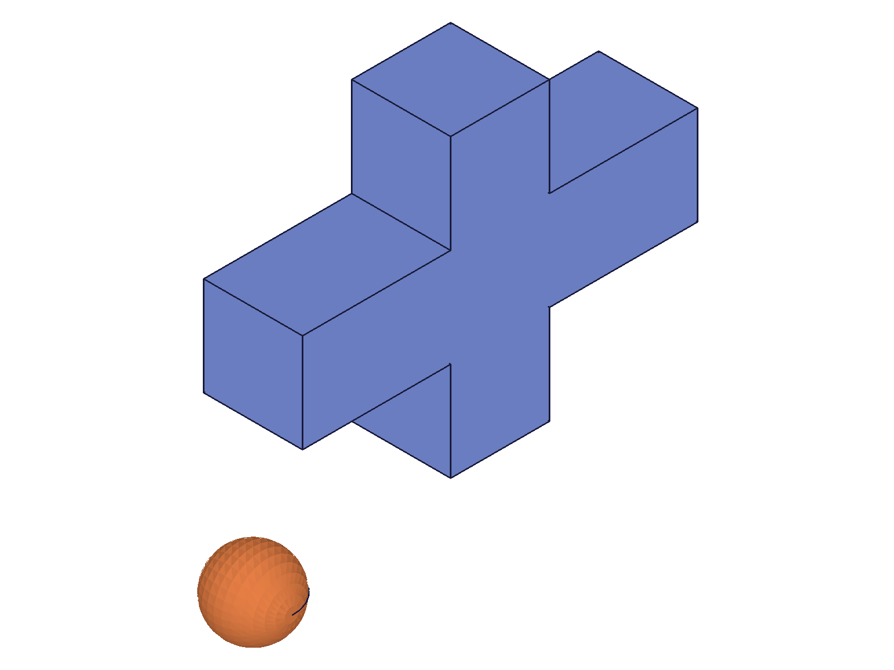 | 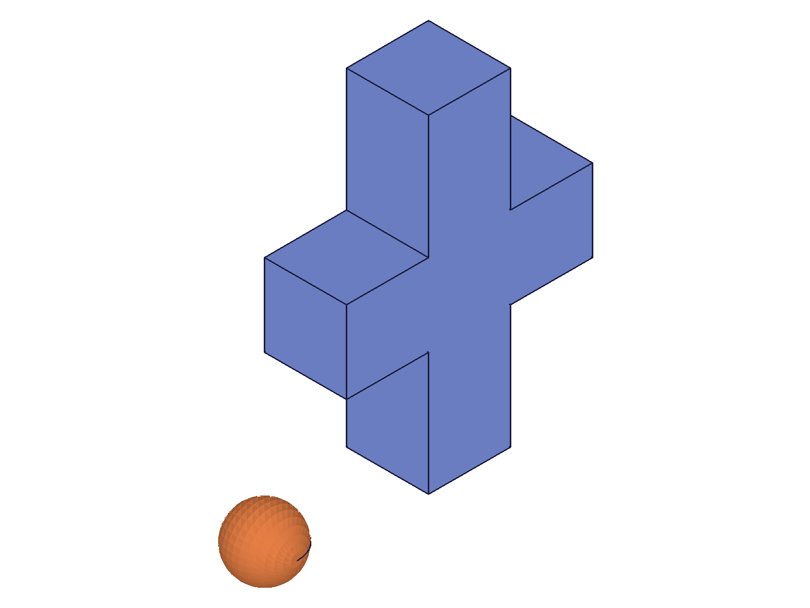 |
|---|---|

**Data:** result=61 (union target ID), maxLevel=31. See `files/08-compound-solid-compound-rotation.json`. Visually: the entire L-shape rotated 90° as a single unit — the L arm switched direction. Reference sphere stayed fixed.

📌 LLM doc: Works on compound solids (post-boolean). Rotates the entire compound as one unit.

---

## 09 — error cases (wrong IDs, missing params)

Script: `scripts/09-wrong-ids.mjs` — ✅ All five error cases produce clear, descriptive messages.

**Data:** See `files/09-wrong-ids-error-cases.json`. All cases: result=null, maxLevel=51.

| Case | Code | Message |
|---|---|---|
| partId as `id` | 1001 | `"The parameter \"id\" has a wrong id type! Provide only following id types: [\"entityinjection\"]"` |
| Invalid target (9999) | 1006 | `"An element of parameter \"target\" has an invalid id!"` |
| eifId as target | 1001 | `"The parameter \"target\" has a wrong id type! Provide only following id types: [\"solid\"]"` |
| Missing rotation | 1004 | `"The parameter \"rotation\" must be provided in the api call!"` |
| Missing target | 1004 | `"The parameter \"target\" must be provided in the api call!"` |

📌 LLM doc: Same error pattern as solid.translation — identical codes and messages.

---

## 10 — consumed tool solid

Script: `scripts/10-consumed-tool.mjs` — ✅ After union consumes box2, rotating box2 fails.

**Data:** result=null, maxLevel=51, code 1006 + warning "ToId()/TOID() didn't get an existing or valid id." See `files/10-consumed-tool-consumed-tool.json`.

---

## 11 — rotation center (origin, not body center)

Script: `scripts/11-rotation-center.mjs` — ✅ Key finding: **rotation is around the part origin (0,0,0)**, not the body center.

| 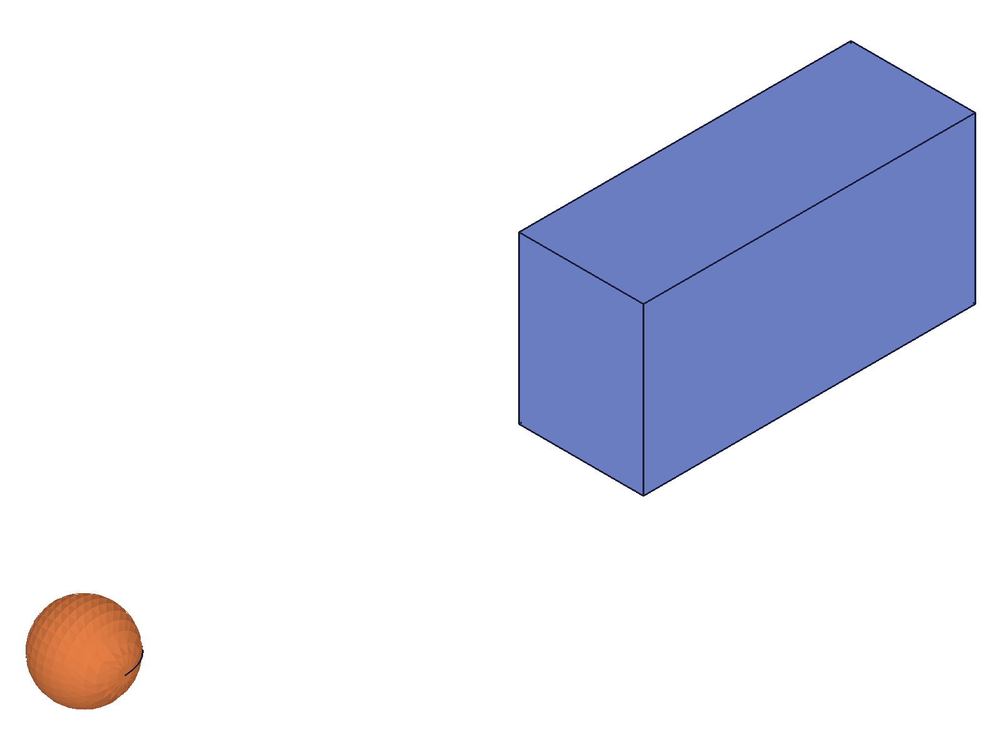 | 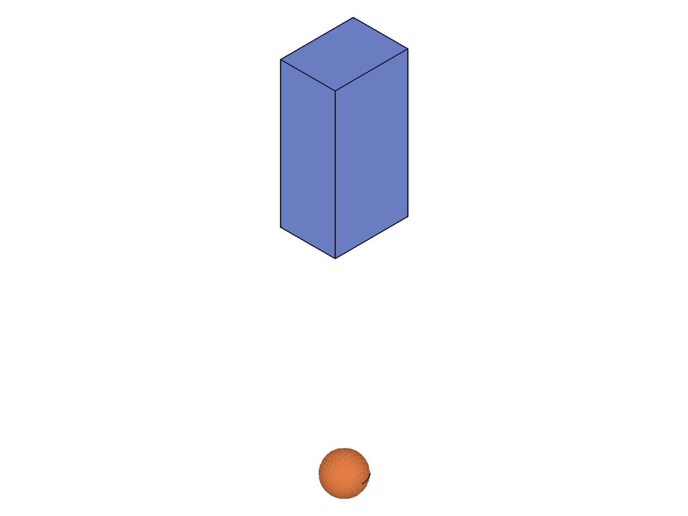 |
|---|---|

**Data:** Box started at translation=[80,0,0]. After 90° Z rotation, the box orbited to approximately [0,80,0] — it moved from the +X region to the +Y region. The reference sphere at origin remained in the same relative position (lower-left). The box didn't just rotate in place — it orbited the origin.

📌 LLM doc: Rotation center is the part coordinate system origin (0,0,0). A body offset from origin will orbit around origin, not rotate in place. To rotate a body around its own center, first translate it to the origin, rotate, then translate back.

---

## 12 — rotation + translation order matters

Script: `scripts/12-rotation-then-translate.mjs` — ✅ "Rotate then translate" produces a different result than "translate then rotate".

| 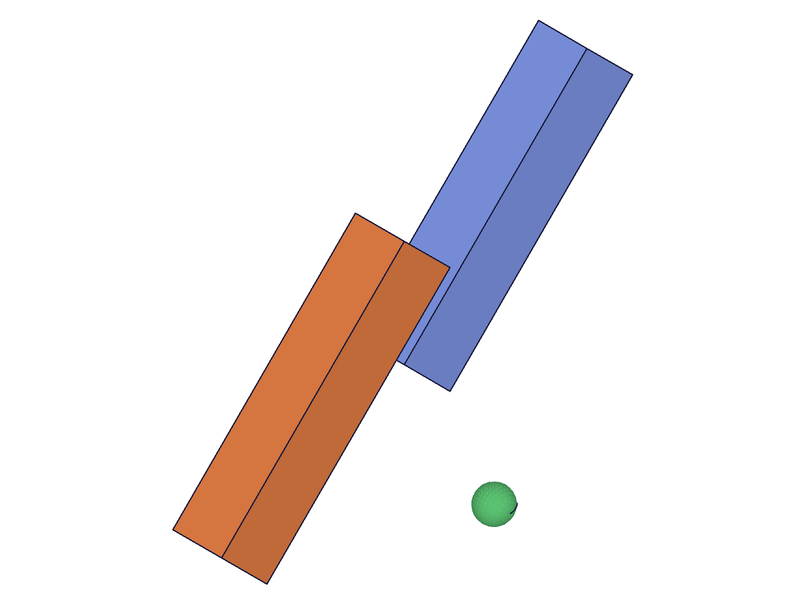 |
|---|

**Data:** Both boxes are at different positions and orientations. Blue (rotate first, then translate +80Y) ends up at a different position than orange (translate +80Y first, then rotate). This is expected because rotation is around the origin — so translating first moves the body away from origin, then rotation orbits it.

📌 LLM doc: Order of rotation/translation matters. Rotation orbits around the origin, so a pre-translated body will orbit rather than spin in place.

---

## Coverage Summary

- [x] API called successfully
- [x] Every required parameter tested (id, target, rotation)
- [x] Single-axis rotation (X, Y, Z) tested
- [x] Combined multi-axis rotation tested
- [x] Rotation order (Z→Y→X Euler) verified
- [x] Zero vector, negative angles, large angles (>2π) tested
- [x] Cumulative behavior confirmed
- [x] Rotation center = origin verified
- [x] Rotation + translation order investigated
- [x] No enum variants (N/A)
- [x] No `updateRotation` method exists
- [x] Realistic usage: rotate after boolean union
- [x] Error cases: wrong ID types, consumed tools, missing params
- [x] Visual + data evidence agree on all findings
