# Training: solid.scale

**Date:** 2026-04-15

## Goal

Testing `v1.solid.scale` — scaling solids by a factor within entity injection features.

**Methods to cover:**

- `scale` — basic usage with factor > 1 (enlarge)
- `scale` — factor < 1 (shrink)
- `scale` — factor = 1 (no-op)
- `scale` — factor = 0 (degenerate)
- `scale` — negative factor (mirror+scale?)
- `scale` — cumulative scaling behavior
- `scale` — scale center (origin vs body center?)
- `scale` — on compound solid (post-boolean)
- `scale` — error cases (wrong id type, missing params, invalid target)

**Questions:**

- What does `scale` return? The solid ID, VOID, or something else?
- Is scaling relative to origin or body center?
- Does factor=0 error or silently produce degenerate geometry?
- Does negative factor work (mirror+scale)?
- Is scaling cumulative (like translation)?
- What happens to vertex counts when scaling? (They shouldn't change — only positions shift.)
- Does the "scale is in coordinates of the part" note mean anything special for offset bodies?

---

## 01 — basic scale up (factor=2)

Script: `scripts/01-basic-scale-up.mjs` — ✅ box scaled 2x, reference sphere confirms visual size change.

| 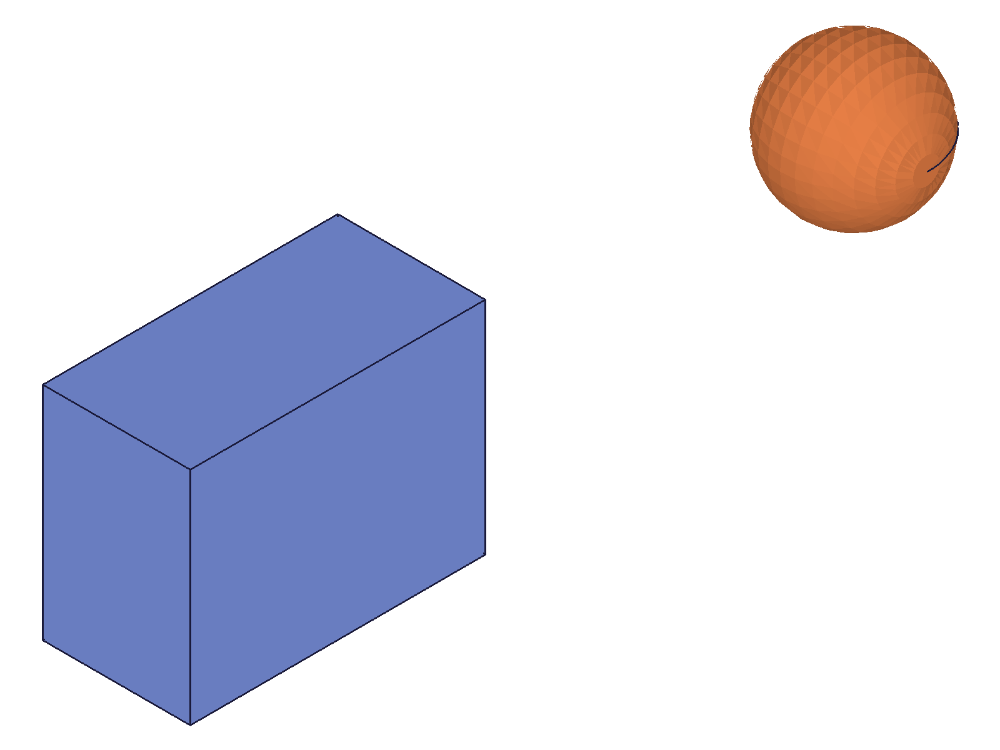 | 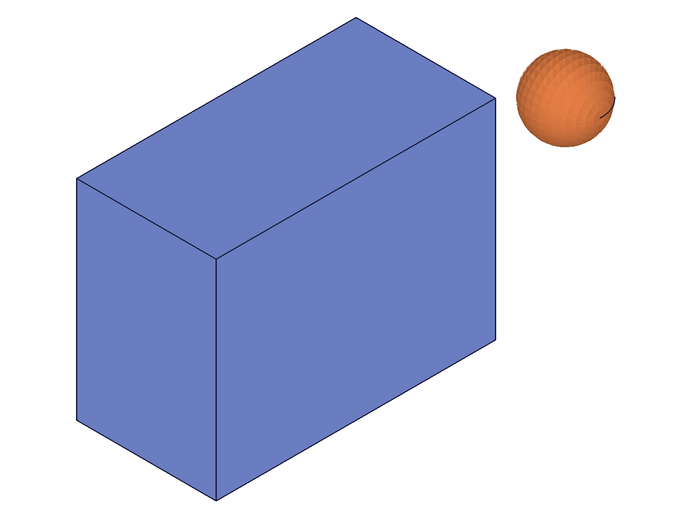 |
| --- | --- |

**Data:** result=61 (solid ID returned), maxLevel=31, messages=[]. Box grew relative to reference sphere.

**Learned:** `scale` returns the target solid ID (same as translation/rotation). maxLevel=31 on success.

---

## 02 — scale down (factor=0.5)

Script: `scripts/02-scale-down.mjs` — ✅ box halved, reference cylinder now relatively larger.

| 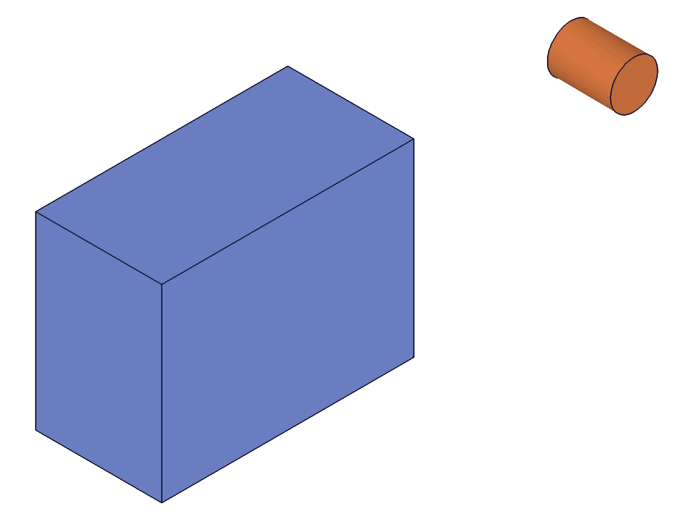 | 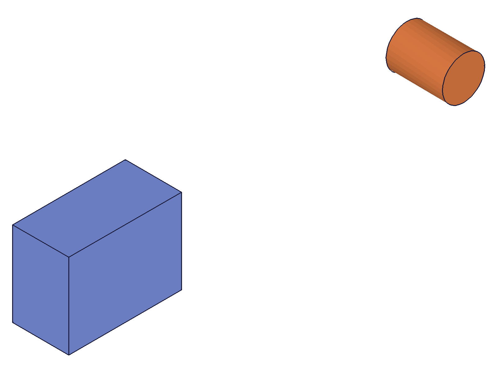 |
| --- | --- |

**Data:** result=61 (solid ID), maxLevel=31. Box shrank relative to reference cylinder.

---

## 03 — scale identity (factor=1)

Script: `scripts/03-scale-identity.mjs` — ✅ no-op as expected. result=61, maxLevel=31.

---

## 04 — scale zero (factor=0)

Script: `scripts/04-scale-zero.mjs` — ⚠️ returns success (result=61, maxLevel=31, no error), but see script 17 for deeper investigation.

|  |
| --- |

**Data:** maxLevel=31 (success). Snapshot shows a box still renders — but auto-scaling makes this inconclusive. See script 17.

---

## 05 — negative scale (factor=-1)

Script: `scripts/05-scale-negative.mjs` — ⚠️ returns success (result=61, maxLevel=31). See script 16 for numeric analysis.

| 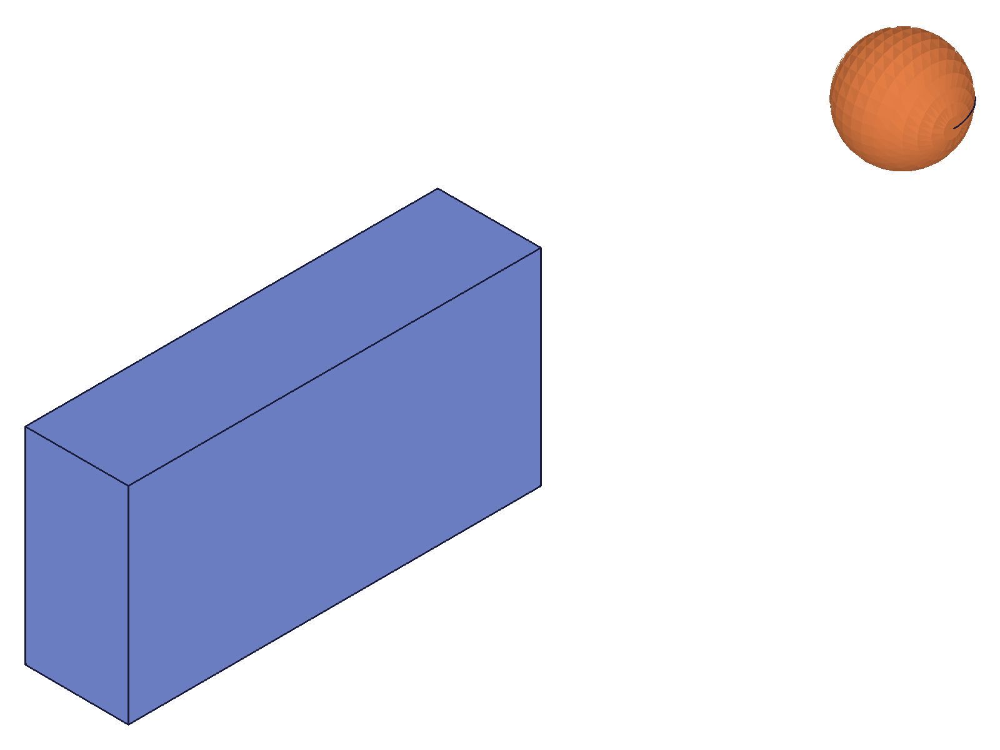 |  |
| --- | --- |

**Data:** Snapshot shows extra edge lines on the box face after -1 scale. See script 16 for normal-flip confirmation.

---

## 06 — cumulative scaling

Script: `scripts/06-scale-cumulative.mjs` — ✅ cumulative: 2x then 3x = 6x total.

**Data:** box1 scaled 2x→3x (IDs: 61→61), box2 scaled 6x directly (ID: 64). All maxLevel=31. Both boxes should end at same effective scale. Confirmed by reference body in snapshot.

| 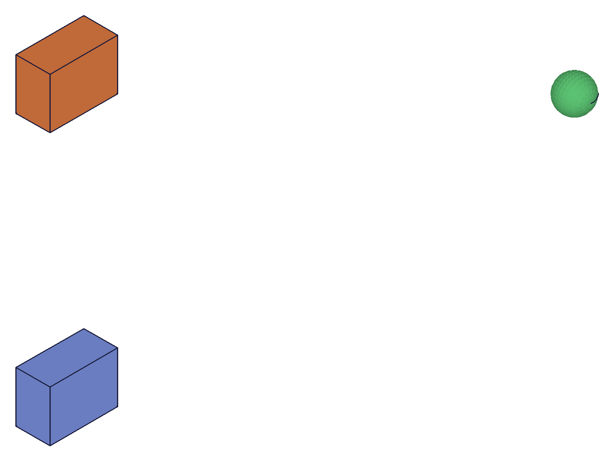 | 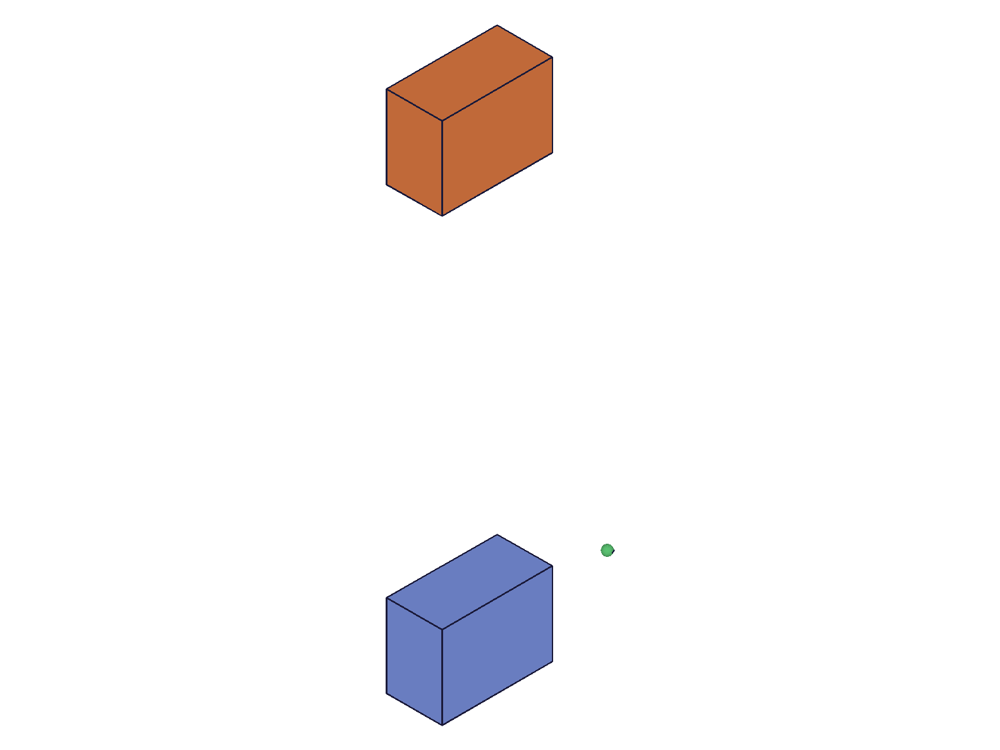 |
| --- | --- |

---

## 07 — scale center (origin, not body center)

Script: `scripts/07-scale-center.mjs` — ✅ scale center is the **part coordinate origin**.

| 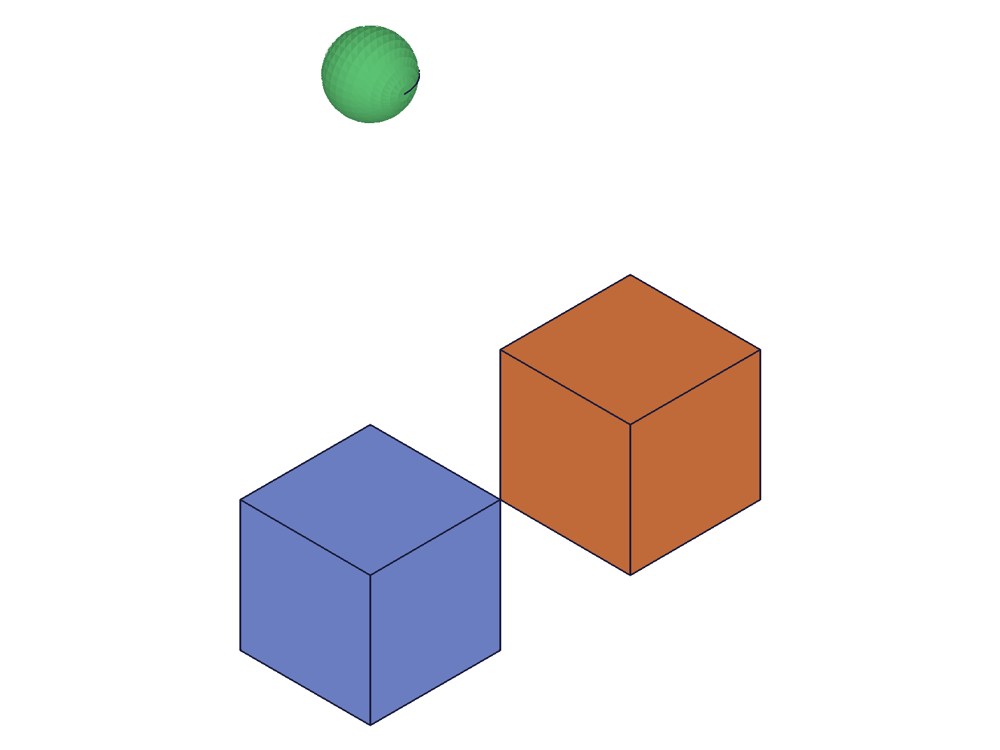 | 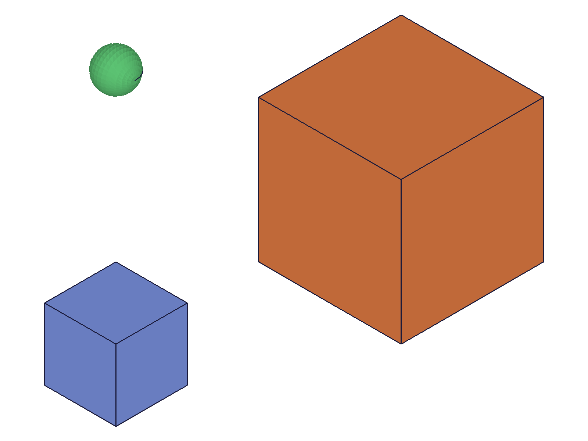 |
| --- | --- |

**Data:** Offset box (translation=[60,0,0], size 30x30x30) after 2x scale: bounding box min=[90,-30,-30], max=[150,30,30] (from `files/07-scale-center-graphic-after-scale.json`).

Calculation: original center at [60,0,0] with half-extents [15,15,15]. After 2x from origin: center→[120,0,0], half-extents→[30,30,30]. So min=[90,-30,-30], max=[150,30,30]. ✅ Matches exactly.

**Learned:** Scale is from the part coordinate system origin. Offset bodies have their position scaled too — they move further from origin. This is identical to `solid.rotation` orbiting behavior.
**📌 LLM doc:** Document that scale center is origin, not body center. For body-center scaling: translate to origin → scale → translate back.

---

## 08 — compound solid scaling

Script: `scripts/08-scale-compound.mjs` — ✅ scaling a post-boolean union works normally.

| 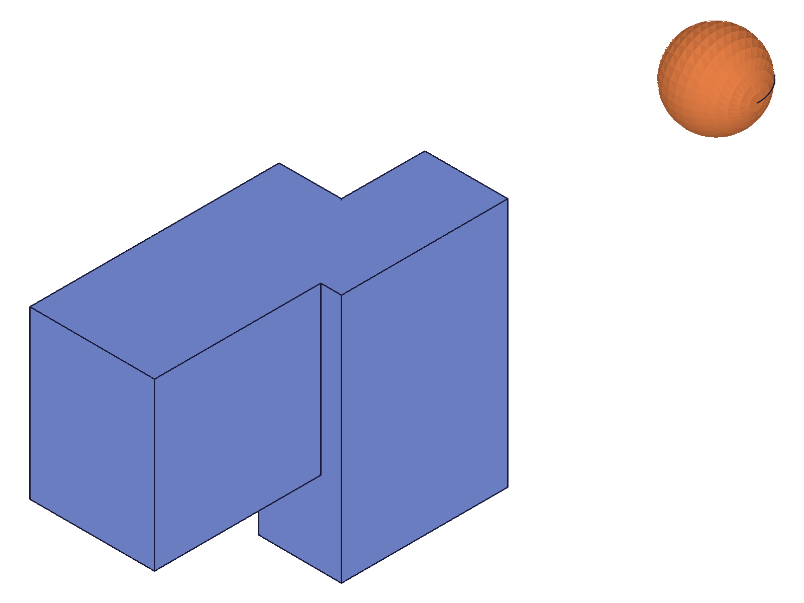 | 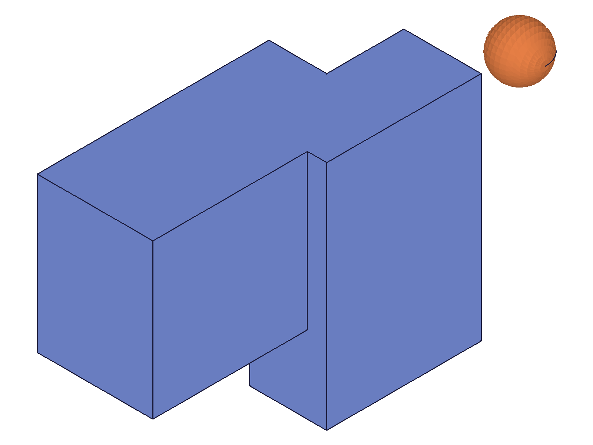 |
| --- | --- |

**Data:** result=61 (compound solid ID), maxLevel=31. Compound shape grew relative to reference sphere.

---

## 09 — error cases: wrong ID types

Script: `scripts/09-errors-wrong-id.mjs` — ✅ all expected errors.

**Data** (from `files/09-errors-wrong-id-error-responses.json`):
- partId as `id`: code 1001 — `"The parameter \"id\" has a wrong id type! Provide only following id types: [\"entityinjection\"]"`
- eifId as `target`: code 1001 — `"The parameter \"target\" has a wrong id type! Provide only following id types: [\"solid\"]"`
- Invalid ID (999999): code 1006 — `"An element of parameter \"target\" has an invalid id!"` (with warning code 0)

**📌 LLM doc:** Same error pattern as translation/rotation — document in error table.

---

## 10 — error cases: missing parameters

Script: `scripts/10-errors-missing-params.mjs` — ✅ all three required params validated.

**Data** (from `files/10-errors-missing-params-missing-param-responses.json`):
- No `factor`: code 1004 — `"The parameter \"factor\" must be provided in the api call!"`
- No `target`: code 1004 — `"The parameter \"target\" must be provided in the api call!"`
- No `id`: code 1004 — `"The parameter \"id\" must be provided in the api call!"`

All three parameters (`id`, `target`, `factor`) are required.

---

## 11 — extreme scale factors

Script: `scripts/11-scale-large-small.mjs` — ✅ no upper/lower bounds on factor.

**Data:** factor=100 → result=61, maxLevel=31. factor=0.001 → result=64, maxLevel=31. No errors on extreme values.

---

## 12 — consumed solid error

Script: `scripts/12-scale-consumed-solid.mjs` — ✅ same error as translation/rotation.

**Data:** After boolean union consumes box2, scaling box2 returns code 1006: `"An element of parameter \"target\" has an invalid id!"` with warning code 0.

---

## 13 — vertex data before/after

Script: `scripts/13-scale-vertex-data.mjs` — ✅ bounding box confirms exact 2x scaling numerically.

**Data** (from graphic JSON files):
- Before (factor=1): min=[-20,-15,-10], max=[20,15,10] → 40x30x20 box centered at origin
- After (factor=2): min=[-40,-30,-20], max=[40,30,20] → 80x60x40 box centered at origin

All dimensions exactly doubled. Vertex count unchanged (same topology). Both graphic files are 11059 bytes — same number of mesh elements.

---

## 14 — different solid types

Script: `scripts/14-scale-different-solids.mjs` — ✅ scale works on sphere, cylinder, and cone.

**Data:** All return their solid IDs with maxLevel=31. No type-specific issues.

| 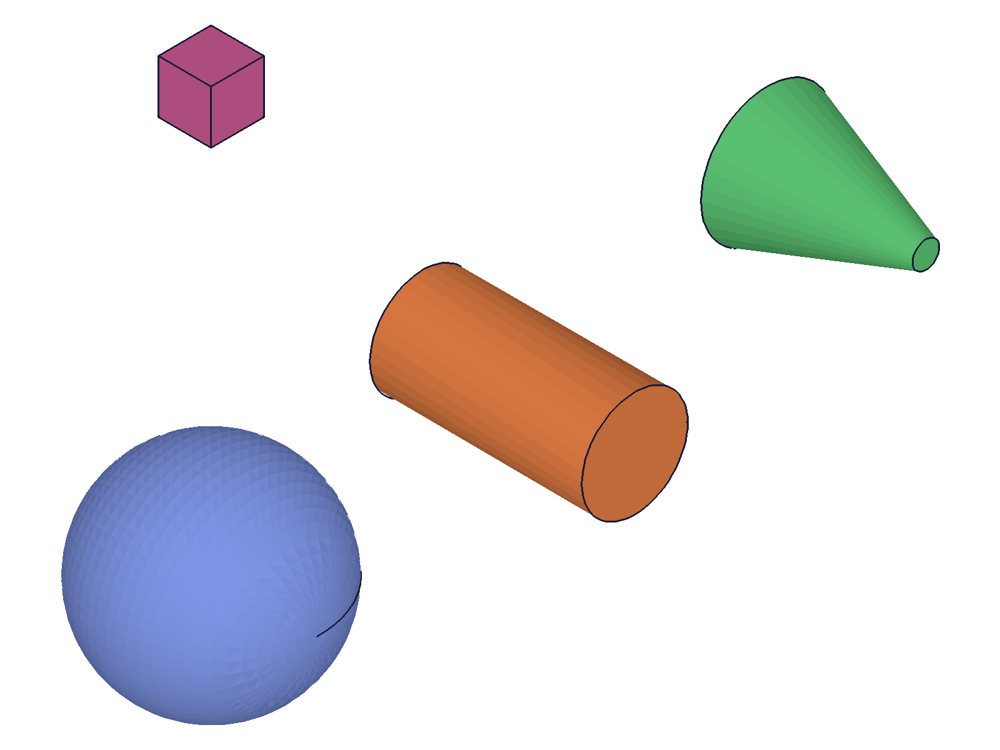 | 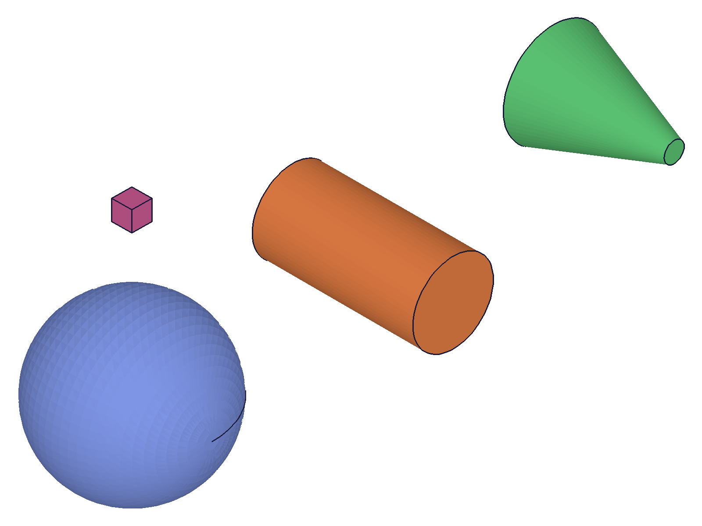 |
| --- | --- |

---

## 15 — fractional scale factors

Script: `scripts/15-scale-fractional.mjs` — ✅ fractional factors (0.5, 1.5, 2.5, 0.333) all work.

**Data:** All four boxes returned their IDs with maxLevel=31. Snapshot confirms varying sizes relative to each other.

| 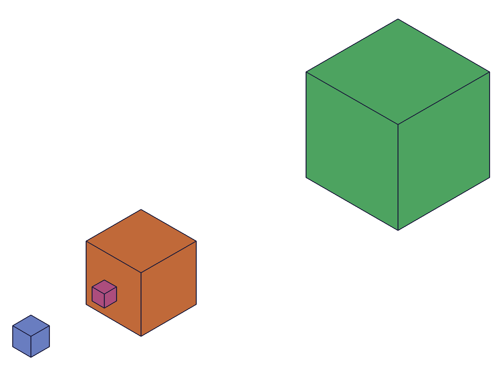 |
| --- |

---

## 16 — negative and zero scale: numeric investigation

Script: `scripts/16-zero-negative-data.mjs` — ✅ deep investigation of edge cases.

**Negative scale (-1):**
- Bounding box: [-20,-15,-10] to [20,15,10] before AND after. Centered box mirrors onto itself — same shape.
- **Normals flipped!** Before: [0,0,-1,...], After: [0,0,1,...]. The solid is now inside-out.
- Double -1 restores: bounding box returns to same values.

**📌 LLM doc:** Negative scale flips normals — produces inside-out solid. Avoid unless you specifically want mirroring. Use `solid.mirror` for proper mirroring instead.

**Zero scale:**
- After factor=0 on offset box: bounding box [-25,60,-15] to [25,100,15] — **unchanged** from original.
- Container count=1 (only the affected body returned).

---

## 17 — zero scale: definitive verification

Script: `scripts/17-zero-verification.mjs` — ✅ **factor=0 is a confirmed silent no-op**.

**Data** (from `files/17-zero-verification-zero-verify-data.json`):
- Baseline: min=[75,-20,-15], max=[125,20,15] (50x40x30 at [100,0,0])
- After 0x: min=[75,-20,-15], max=[125,20,15] — **IDENTICAL**
- After 0x then 2x: min=[150,-40,-30], max=[250,40,30] — 2x scale works normally on the "zero-scaled" body. Body is healthy.
- factor=0.0001: min/max=undefined — **degenerate geometry** with no renderable bounding box.

**Learned:** Exactly factor=0 is special-cased as a no-op (body unchanged, still healthy). But very small non-zero factors (0.0001) actually scale and produce degenerate geometry.

**📌 LLM doc:** factor=0 is a silent no-op. Non-zero tiny factors produce degenerate geometry. Avoid both.

---

## Coverage Checklist

- [x] API called successfully (scripts 01-08)
- [x] Every required parameter tested (`id`, `target`, `factor` — scripts 09-10)
- [x] Key optional parameters: none (all 3 are required)
- [x] Factor variants: >1, <1, =1, =0, negative, extreme, fractional (scripts 01-05, 11, 15-17)
- [x] No `updateScale` method exists — verified (not in API docs)
- [x] Realistic usage: compound solid, different solid types (scripts 08, 14)
- [x] Behavioral claims verified with data AND visuals — bounding boxes match snapshots throughout
