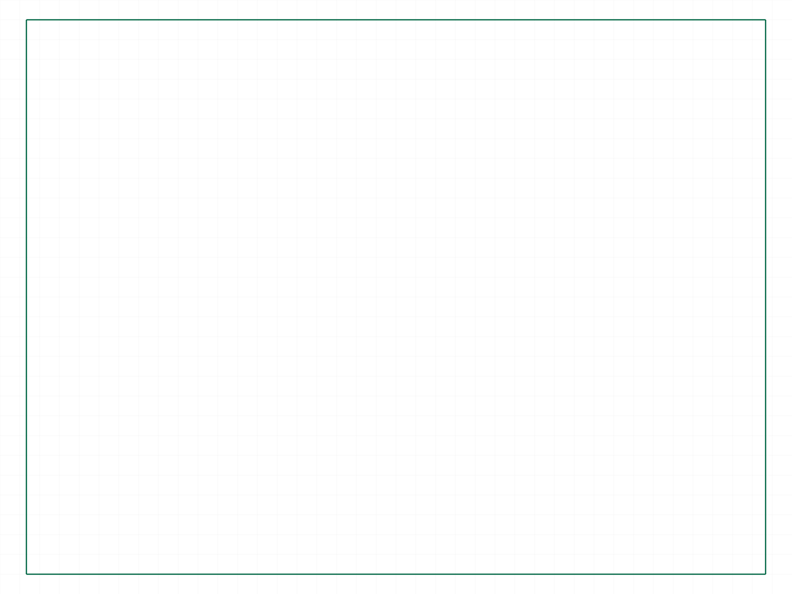
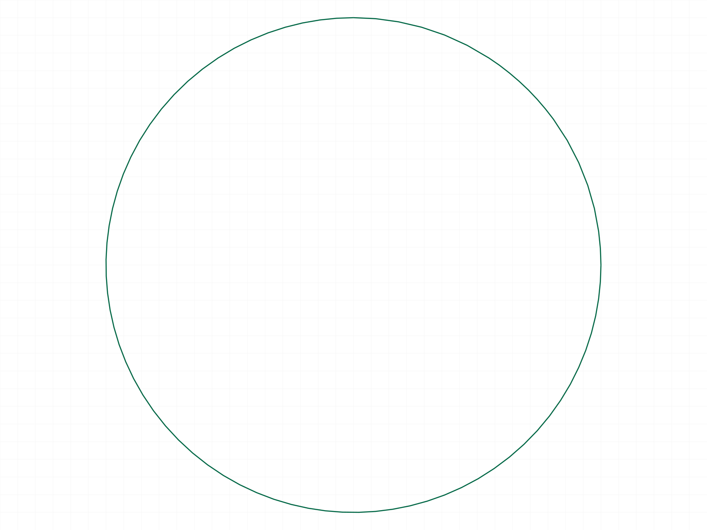
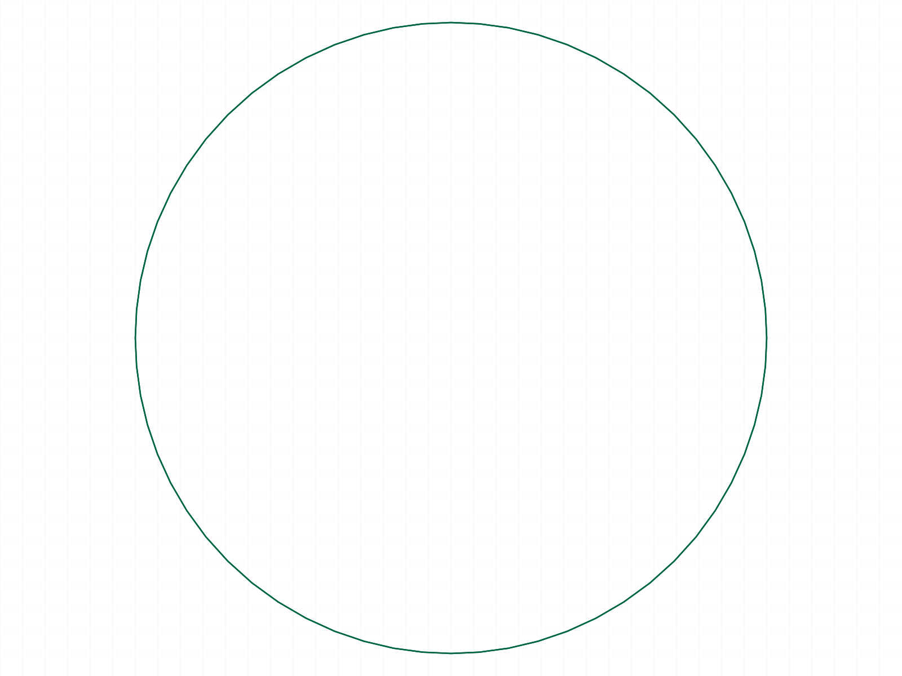
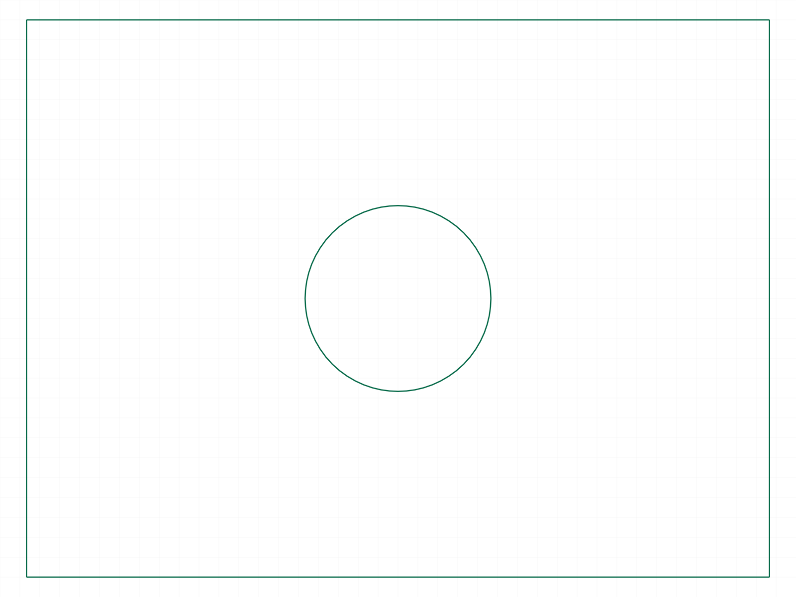
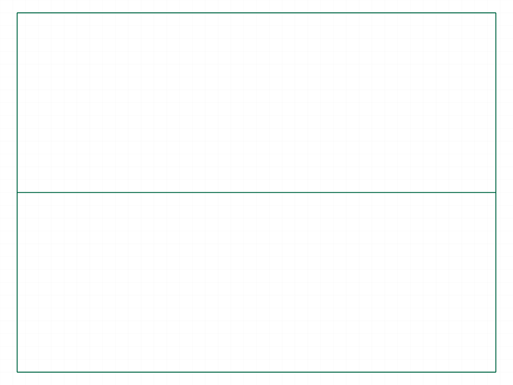
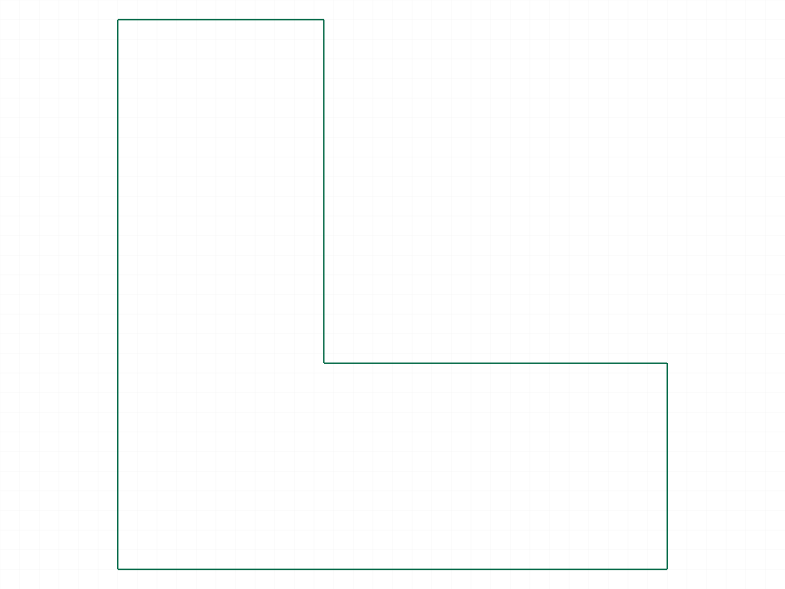

# Training: solid.section

**Date:** 2026-04-15

## Goal

Testing `v1.solid.section` — creates cross-section curves at a plane through a solid.

**Methods to cover:**

- `section` — basic call with `id`, `target`, `originPos`, `normal`
- Return value — docs say "id of the created section array". What is this object? How to inspect it?
- Various plane orientations (XY, XZ, YZ, diagonal)
- Various solid types (box, sphere, cylinder, cone, extrusion, boolean result)

**Questions:**

- Is the target solid modified (destructive) or preserved (non-destructive)?
- What is the "section array" — curves? A shape container? How to visualize/inspect it?
- What happens when the plane doesn't intersect the solid?
- What happens with a zero normal `[0,0,0]`?
- What happens when the plane is coplanar with a face?
- Can the section result be used downstream (e.g., as an extrusion profile)?
- How does the renderer handle the section result (curve rendering vs solid)?
- Does the section share `slice`'s `keepBoth` hang bug, or is it unrelated?

---

## 01 — basic section of a box (XY plane at z=0)

Script: `scripts/01-basic-section-box.mjs` — ✅ section works, non-destructive.

|  |  |  |
|---|---|---|

**Data:** `result: 66` (an ID, not VOID). `maxLevel: 31` (info). Solid unchanged (before/after identical). Curves snapshot shows a rectangle — the cross-section outline at z=0.

**Learned:** Section is **non-destructive** — target solid is preserved. Returns an ID of the created cross-section entity. The renderer detects both the solid and the new curves, producing separate snapshots.

## 02 — inspect section result structure

Script: `scripts/02-inspect-section-result.mjs` — ✅ structure + graphic dumped.

**Data:** The returned ID (64) is a `CC_CurveEntity` named "Curve", class `CC_CurveEntity`, child of the entity injection (54). Its `geometryIdList: [62]` points to a graphic container (type=2) with 4 edges:
- Edge -33: (-40,-30,0) → (-40,30,0)
- Edge -34: (-40,30,0) → (40,30,0)
- Edge -35: (40,30,0) → (40,-30,0)
- Edge -36: (40,-30,0) → (-40,-30,0)

All at z=0 (the section plane). Bounding box: [-40,-30,0] to [40,30,0] — exactly the 80×60 box cross-section. Edge IDs are negative (internal/generated). Container color is black [0,0,0].

**Learned:** Section creates a `CC_CurveEntity` inside the entity injection with edge data forming the cross-section outline. The graphic container `type: 2` means curves (vs type for solid meshes). The part's `solids` array includes the curve container ID alongside the actual solid.
📌 LLM doc: Return type is a CC_CurveEntity ID containing cross-section edges. Non-destructive.

## 03 — section of a sphere

Script: `scripts/03-section-sphere.mjs` — ✅ sphere section at z=10 produces a circle.

|  |
|---|

**Data:** 2 edges: one with 65 points, one with 21 points. The circle cross-section is tessellated into multi-point polylines. Curved surfaces produce tessellated (polygon-approximated) edges, not exact analytic curves.

## 04 — section of a cylinder (horizontal + diagonal)

Script: `scripts/04-section-cylinder.mjs` — ✅ both sections produce curves.

|  |
|---|

**Data:** Horizontal section (XY plane): 1 edge, 65 points — a full circle tessellation. Diagonal section (45° plane): 2 edges, 33 points each — the ellipse split into two half-edges.

**Learned:** Curved cross-sections are tessellated into multi-point edges. A full circle is one edge; split curves (ellipse at angle) become multiple edges.

## 05 — non-intersecting plane

Script: `scripts/05-no-intersection.mjs` — ✅ no error, empty section entity.

**Data:** `result: 64` (still returns an ID), `maxLevel: 31`. No `-curves.png` produced — the section entity was created but contains no edges. Section at z=50 on a box that goes to z=20 produces an empty CurveEntity.

**Learned:** Non-intersecting plane → silent no-op section with empty geometry. Still returns a valid ID. No error, no warning.
📌 LLM doc: Non-intersecting plane creates empty section entity (no error).

## 06 — zero normal [0,0,0]

Script: `scripts/06-zero-normal.mjs` — ✅ no error, empty section entity.

**Data:** `result: 64`, `maxLevel: 31`. No `-curves.png` produced. Same behavior as non-intersecting: returns ID but no geometry.

**Learned:** Zero normal is a silent no-op. No error, no curves.
📌 LLM doc: Zero normal [0,0,0] produces empty section entity (no error, no curves).

## 07 — coplanar with box face

Script: `scripts/07-coplanar-face.mjs` — ✅ at least one coplanar section produces curves.

|  |
|---|

**Data:** Top face (z=20): `result: 64`, maxLevel: 31. Bottom face (z=-20): `result: 67`, maxLevel: 31. Curves snapshot shows a rectangle — at least one coplanar section generated the face outline. Both sections created entities. The rectangle in the snapshot matches the 80×60 box face outline.

**Learned:** Section coplanar with a solid face CAN produce curves (the face outline). Unlike `slice` which may no-op on coplanar faces, `section` generates the intersection.

## 08 — section of a cone

Script: `scripts/08-section-cone.mjs` — ✅ circle cross-section.

**Data:** 1 edge, 65 points. Bounding box min=[-5.74, 0, 0] max=[12.5, 12.5, 0]. The cone (bDiameter=40, tDiameter=10, height=60) sectioned at z=0 produces a circle with radius ~12.5 (interpolated between bottom r=20 and top r=5).

## 09 — section of a boolean result (box with cylindrical hole)

Script: `scripts/09-section-boolean.mjs` — ✅ complex cross-section.

|  |
|---|

**Data:** 5 edges: 4 with 2 points each (rectangle outline) + 1 with 65 points (hole circle tessellation). The cross-section correctly shows the rectangular box outline with a circular hole inside.

**Learned:** Section works correctly on boolean results. Complex cross-sections produce multiple edges — straight segments for flat intersections, tessellated edges for curved ones.
📌 LLM doc: Works on boolean results; complex sections produce separate edges per feature.

## 10 — multiple sections on the same solid

Script: `scripts/10-multiple-sections.mjs` — ✅ each section creates a separate entity.

|  |
|---|

**Data:** 4 sections created with unique IDs: 64, 67, 70, 73. Three horizontal (z=-10, 0, 10) + one vertical (y=0). The incremental graphic from the last API call only contains that section's data. All section entities accumulate in the entity injection.

**Learned:** Multiple sections can be created on the same solid. Each creates a separate CC_CurveEntity with its own ID. They coexist in the entity injection.

## 11 — delete section with deleteSolid

Script: `scripts/11-delete-section.mjs` — ⚠️ unexpected behavior.

**Data:** `deleteSolid(target: sectionId)` returned `result: null`, `maxLevel: 31` (success). But the after-delete snapshot shows curves survived while the solid disappeared (no `-solid.png`, only `-curves.png`). Investigated further in script 18.

## 12 — unnormalized normal [0,0,100]

Script: `scripts/12-unnormalized-normal.mjs` — ✅ identical to normalized.

**Data:** 4 edges, bbox [-40,-30,0] to [40,30,0] — identical to script 01 with `[0,0,1]`. Normal magnitude is irrelevant; only direction matters.

## 13 — verify solid unchanged (inconclusive)

Script: `scripts/13-verify-solid-unchanged.mjs` — ⚠️ inconclusive verification approach.

**Data:** The section API response's graphic only contains the new section's curves container (1 container, type=2). The solid's graphic data is not included in the incremental response. Better verified by script 14 (using the solid for further operations).

## 14 — solid usable after section

Script: `scripts/14-solid-usable-after-section.mjs` — ✅ solid remains fully usable.

**Data:** After section, `solid.slice` on the same boxId succeeded (maxLevel: 31). The sliced result graphic shows the half-box (container type=1, 12 edges). Confirms section is non-destructive and the solid remains valid for further operations.

**Learned:** The original solid ID remains valid after section. You can freely section a solid and then continue to modify it.
📌 LLM doc: Solid remains fully usable after section.

## 15 — diagonal section (45° plane)

Script: `scripts/15-diagonal-section.mjs` — ✅ parallelogram cross-section.

**Data:** 4 edges (all 2-point straight lines). Vertices at (20,30,-20), (20,-30,-20), (-20,-30,20), (-20,30,20). The diagonal plane at 45° between X and Z produces a tilted rectangular cross-section. Bbox: [-20,-30,-20] to [20,30,20] — a 3D bounding box since the section is not axis-aligned.

## 16 — section of an L-shaped extrusion

Script: `scripts/16-section-extrusion.mjs` — ✅ L-shaped cross-section.

|  |
|---|

**Data:** 6 edges, all 2-point. The L-shaped profile has 6 sides, producing 6 straight edges. Matches the original profile exactly.

**Learned:** Section of an extrusion at a plane perpendicular to the sweep direction reproduces the original profile shape.

## 17 — normal direction (winding order)

Script: `scripts/17-normal-direction.mjs` — ✅ normal affects winding, not shape.

**Data:** Both `[0,0,1]` and `[0,0,-1]` produce 4 edges at z=5 with identical bounding box [-40,-30,5] to [40,30,5]. Edge data is NOT byte-identical — the winding order is reversed:
- `[0,0,1]` (up): CCW traversal (-40,-30) → (-40,30) → (40,30) → (40,-30)
- `[0,0,-1]` (down): CW traversal (-40,30) → (-40,-30) → (40,-30) → (40,30)

**Learned:** Normal direction determines edge winding order (right-hand rule). The cross-section shape and position are identical regardless of normal direction. Unlike `slice` where normal determines which side is removed, for `section` the normal only affects winding.
📌 LLM doc: Normal direction only affects edge winding order, not shape or position.

## 18 — deleteSolid investigation (CRITICAL)

Script: `scripts/18-delete-investigate.mjs` — ❌ deleteSolid on section deletes the ORIGINAL SOLID.

**Data:**
- Before delete: `part.solids = [59, 62]` (59=box geometry, 62=section curves)
- After `deleteSolid(target: sectionId=64)`: `part.solids = [62]` — the BOX (59) was removed, section curves (62) survived!
- Attempting `slice` on boxId after delete → `maxLevel: 51` (ERROR) — box is gone.

**Learned:** `solid.deleteSolid(target: sectionId)` does NOT delete the section curves. It deletes the **original solid** associated with the section. The CC_CurveEntity (sectionId) resolves to the wrong geometry target — it kills the solid that was sectioned, not the section result.

**DO NOT use `solid.deleteSolid` to remove section entities.** There is no safe way to delete a section result without destroying the original solid. If you need to remove section curves, you may need to investigate other cleanup methods.
📌 LLM doc: CRITICAL — `deleteSolid` on a section entity deletes the original solid, not the section.
