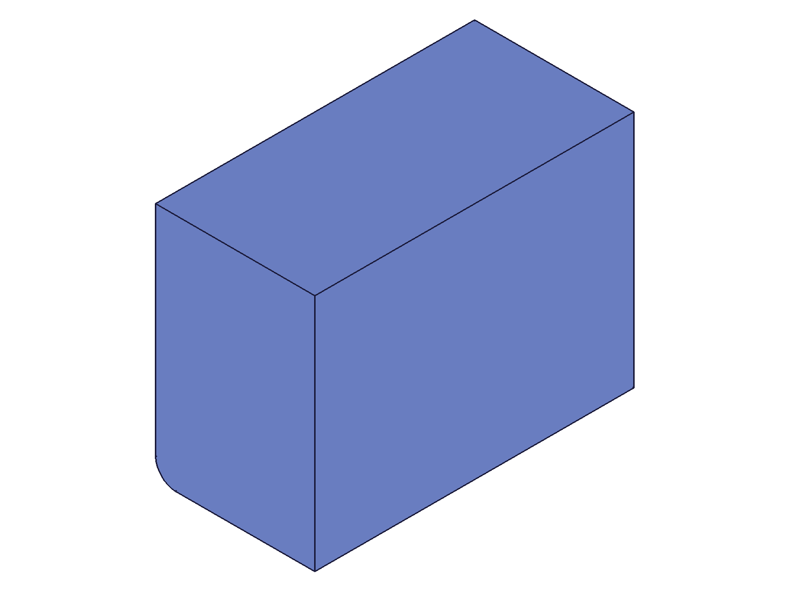
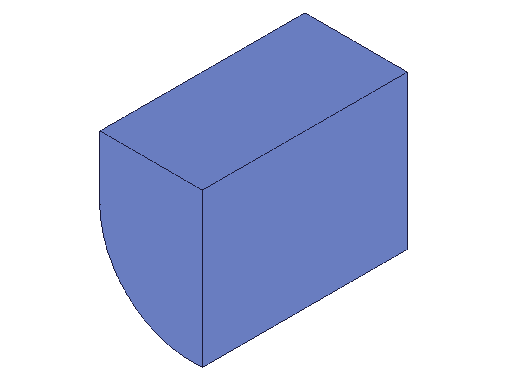
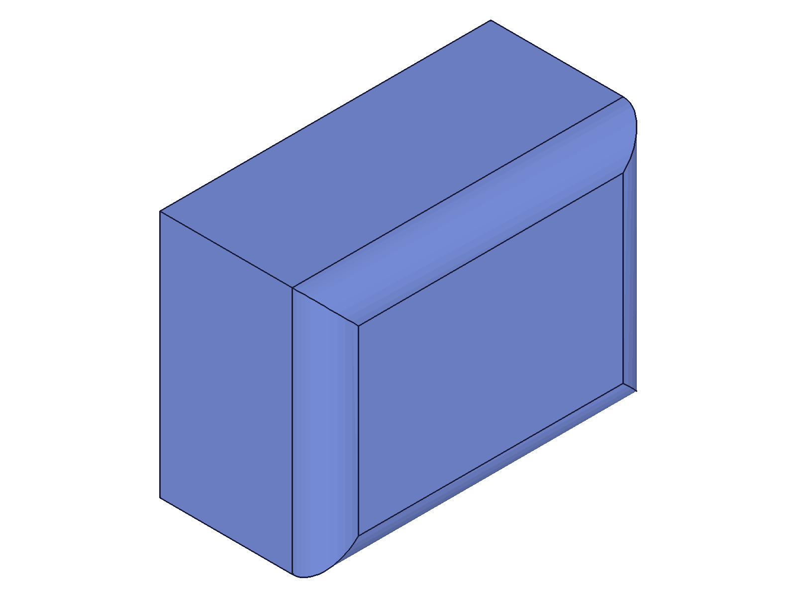
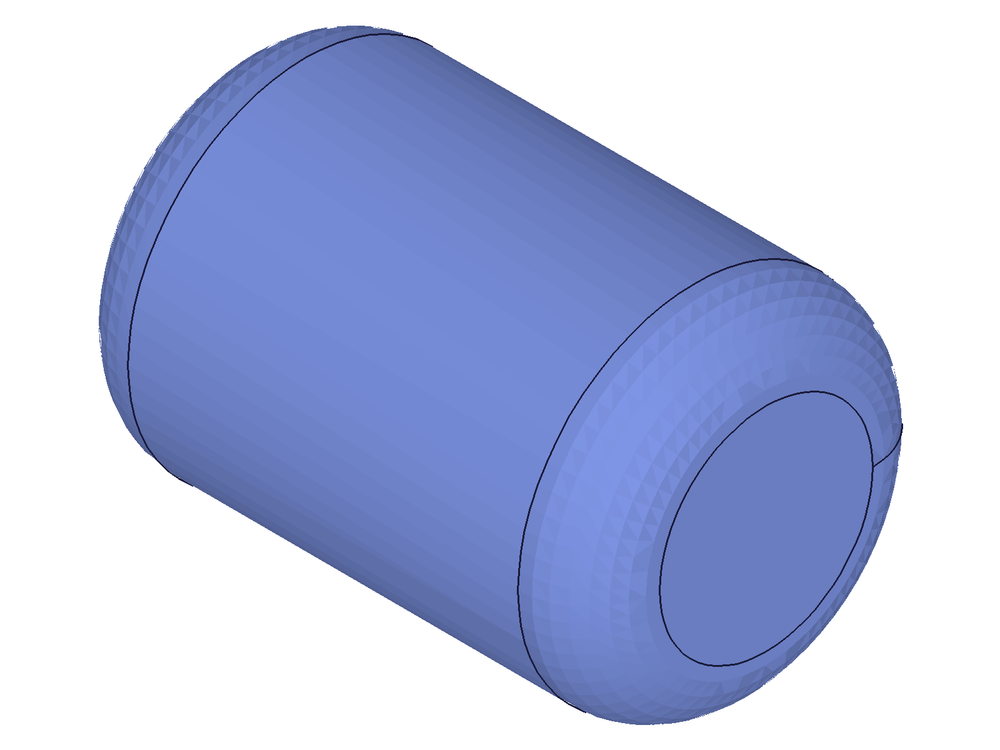
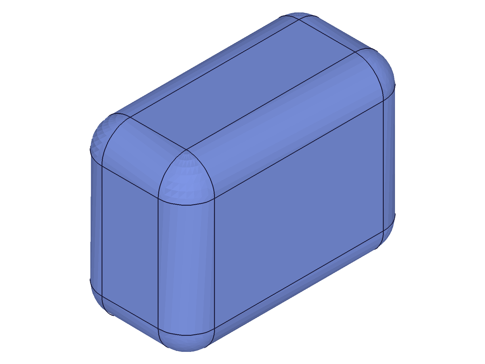
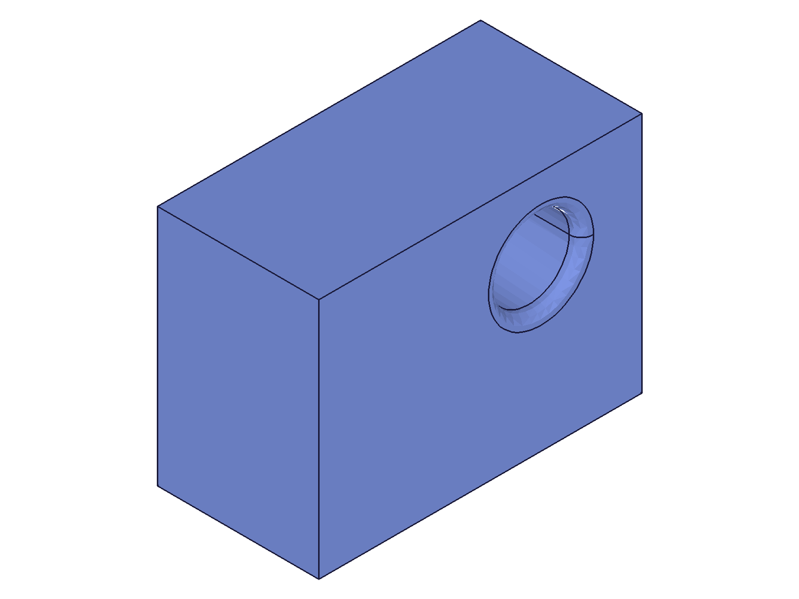
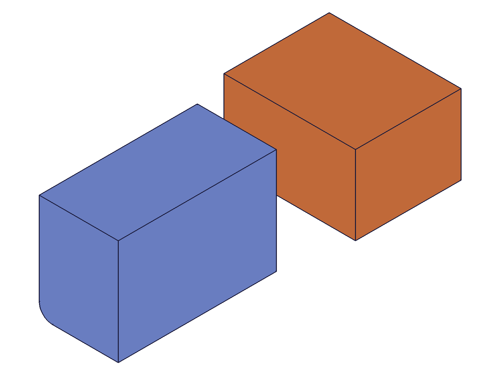
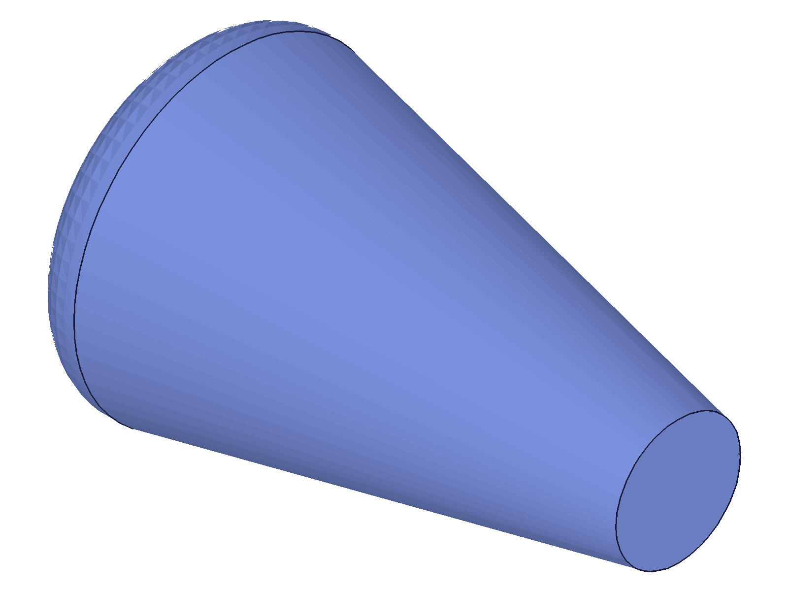
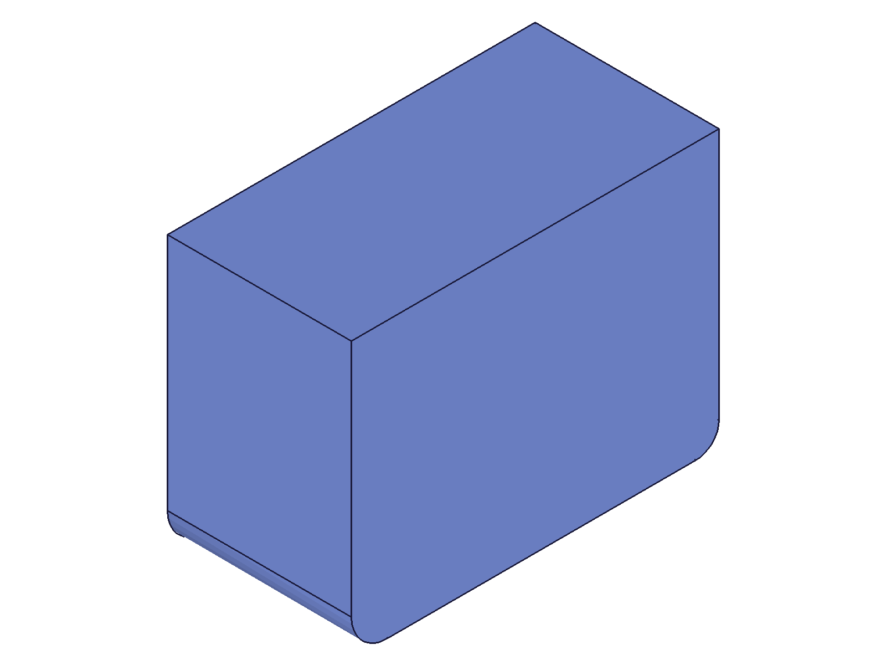
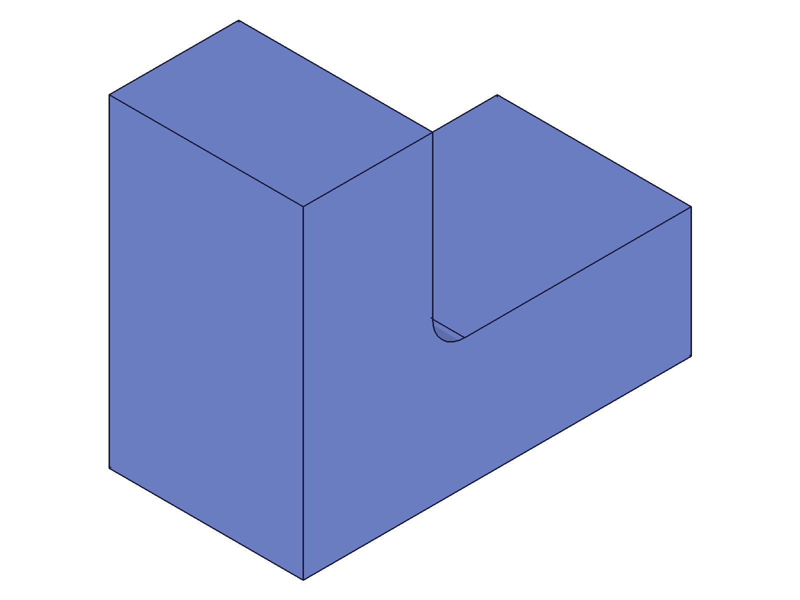

# Training: solid.fillet

**Date:** 2026-04-15

## Goal

Testing `v1.solid.fillet` — creates fillets at brep edge IDs within an entity injection feature.

**Methods to cover:**

- `fillet` — basic call with `id`, `radius`, `geomIds`
- Discovering brep edge IDs from structure/graphic data (prerequisite)
- Different radius values (small, large, too-large)
- Fillet on different solid types (box, cylinder, cone, extrusion)
- Fillet on multiple edges at once
- Fillet on edges from different solids in same EIF
- Fillet on boolean result edges
- Return value: `id[] | VOID` — what IDs come back?
- Edge cases: zero radius, negative radius, invalid edge ID, radius too large for edge

**Questions:**

- How do you obtain brep edge IDs to pass to `geomIds`?
- What does the return value look like — array of fillet solid IDs?
- Can you fillet edges from different solids in one call (docs say "Edges can be of different solids")?
- What happens when radius is too large for the edge geometry?
- Does the fillet consume/modify the original solid or create a new one?
- Can you delete a fillet after creation?

---

## 01 — discover edges from graphic data

Script: `scripts/01-discover-edges.mjs` — `r.graphic.edges` is empty for a `solid.box` call. Edge data is NOT in the graphic payload.

**Data:** `edges.length = 0`. No edge IDs available from graphic response.

**Learned:** Cannot get brep edge IDs from `r.graphic.edges`. Need a different approach.

---

## 02 — brep edge enumeration via getBrepGeometryByIndex

Script: `scripts/02-brep-by-index.mjs` — ✅ `getBrepGeometryByIndex` with `lineIndex` enumerates all 12 line edges of a box.

**Data:** 12 line edges (IDs: -20, -15, -17, -24, -19, -21, -23, -18, -22, -16, -13, -14), 8 point vertices. Edge IDs are negative numbers (brep sub-element convention). See `files/02-brep-by-index-brep-index-results.json`.

|  |
|---|

**📌 LLM doc:** Edge IDs are negative numbers obtained via `part.getBrepGeometryByIndex`. A box has 12 line edges and 8 vertices.

---

## 03 — basic fillet on one edge

Script: `scripts/03-basic-fillet.mjs` — ✅ Fillet on one vertical edge of a box with radius=5.

|  |  |
| --- | --- |

**Data:** `result: [61]` (array containing the original solid ID). `maxLevel: 31` (info). `messages: []`. Container count stayed at 1 — solid modified in-place. See `files/03-basic-fillet-fillet-response.json`.

**Learned:** Fillet returns an array of the solid IDs that were modified. The fillet modifies the solid in-place — no new entity is created. The returned ID is the same as the input solid ID.

**📌 LLM doc:** Returns `id[]` — array of modified solid IDs (same IDs as the input solids). Modifies in-place.

---

## 04 — multiple edges (buggy position filter)

Script: `scripts/04-multiple-edges.mjs` — Bug: `getGeometryPositions` returns `{x, y, z}` objects, not `[x, y, z]` arrays. Also the box is centered at origin so "top" is z=+20 not z=40. Filter returned empty array → fillet with empty geomIds returned `result: []`, `maxLevel: 31` (no error, just empty).

**Learned:** `getGeometryPositions` returns positions as `{x, y, z}` objects. Empty `geomIds` array is silently accepted (returns empty result).

---

## 05 — large radius

Script: `scripts/05-large-radius.mjs` — ✅ radius=35 on one vertical edge of an 80x60x40 box succeeded.

|  |
|---|

**Data:** `result: [61]`, `maxLevel: 31`. Very large fillet visible — the edge is almost fully rounded. See `files/05-large-radius-large-radius-response.json`.

**Learned:** The kernel tolerates very large radii — radius=35 on a 40-high box works (radius near the full height). The limit depends on geometry, not a simple rule.

---

## 06 — zero and negative radius

Script: `scripts/06-zero-negative-radius.mjs` — radius=0 accepted (silent no-op). radius=-5 errors.

**Data:**
- `radius=0`: `result: [61]`, `maxLevel: 31` — succeeds but likely no-op
- `radius=-5`: `result: null`, `maxLevel: 51`, error: "Set the parameter \"id\" = VOID is not allowed in this situation!"

**📌 LLM doc:** Zero radius accepted (no-op). Negative radius → error (maxLevel 51). The error message about "id = VOID" is misleading — it's actually rejecting the negative radius internally.

---

## 07 — multiple edges (fixed)

Script: `scripts/07-multiple-edges-fix.mjs` — ✅ Fillet all 4 top edges (z=20) of a box with radius=8.

|  |
|---|

**Data:** Top edges: [-22, -16, -13, -14]. `result: [61]`, `maxLevel: 31`. Container verts went to 12. See `files/07-multiple-edges-fix-multi-top-fillet.json`.

**Learned:** Multiple edges in one call works cleanly. Returns single-element array (one solid modified).

---

## 08 — fillet cylinder circular edges

Script: `scripts/08-fillet-cylinder.mjs` — ✅ Fillet both top and bottom circular edges of a cylinder.

|  |
|---|

**Data:** Cylinder has 1 line edge (seam, lineIndex=0), 2 arc edges (arcIndex=0 at z=-30, arcIndex=1 at z=+30). Filleting both arcs: `result: [61]`, `maxLevel: 31`. See `files/08-fillet-cylinder-cyl-fillet-response.json`.

**Learned:** For cylinders, use `arcIndex` (not `lineIndex`) to find circular edges. Fillet on arc edges works the same as on line edges. Cylinder becomes capsule-shaped.

**📌 LLM doc:** Use `getBrepGeometryByIndex` with `arcIndex` for circular edges (cylinders, cones). `lineIndex` for straight edges.

---

## 09 — fillet all 12 edges of a box

Script: `scripts/09-fillet-all-edges.mjs` — ✅ All 12 edges filleted with radius=10.

|  |
|---|

**Data:** `result: [61]`, `maxLevel: 31`. Container verts: 24 (up from 8 for a box). Produces a soap-bar/pillow shape.

---

## 10 — cross-solid fillet (buggy — solidIndex not used)

Script: `scripts/10-cross-solid-fillet.mjs` — Bug: `getBrepGeometryByIndex` without `solidIndex` only returns edges from solid 0 (first box). Could not find `box2Edge` → passed `null` in geomIds → error.

**Data:** `box2Edge: null`, error: "An element of parameter \"geomIds\" has the wrong type!"

**Learned:** For multiple solids in one EIF, must specify `solidIndex` in `getBrepGeometryByIndex`. Default is `solidIndex: 0`.

---

## 11 — fillet on boolean result

Script: `scripts/11-boolean-then-fillet.mjs` — ✅ Fillet the circular edges from a cylinder subtraction.

|  |
|---|

**Data:** After subtraction: 13 line edges, 2 arc edges (the cylinder hole boundaries). Filleting arcs [-48, -49] with radius=3: `result: [61]`, `maxLevel: 31`. The hole edge is rounded.

**📌 LLM doc:** Works on boolean result edges. Subtraction creates new edges (arc/line) at the cut boundary — these can be filleted.

---

## 12 — invalid edge IDs

Script: `scripts/12-invalid-edge-id.mjs` — All three invalid ID types → error (maxLevel 51).

**Data:**
- Solid ID (61) as edge: internal NullMem type error
- Fake ID (999999): "id = VOID is not allowed"
- Part ID as edge: "id = VOID is not allowed"

**📌 LLM doc:** Invalid geomIds (non-edge IDs or nonexistent IDs) → maxLevel 51 error. No partial success — the whole call fails.

---

## 13 — cross-solid fillet (fixed with solidIndex)

Script: `scripts/13-cross-solid-fix.mjs` — ✅ Fillet one edge from each of two separate boxes in a single call.

|  |
|---|

**Data:** box1 edge (solidIndex=0, lineIndex=0) = -20. box2 edge (solidIndex=1, lineIndex=0) = -52. `result: [64, 61]` — returns array of BOTH solid IDs (reverse order from input). `maxLevel: 31`.

**Learned:** Cross-solid fillet confirmed — docs' claim "Edges can be of different solids" verified. Result array contains all affected solid IDs. Use `solidIndex` in `getBrepGeometryByIndex` to access edges from different solids.

**📌 LLM doc:** Cross-solid fillet works. Result includes all modified solid IDs. Must use `solidIndex` when enumerating edges from multiple solids.

---

## 14 — sequential fillets (edge IDs invalidated)

Script: `scripts/14-sequential-fillet.mjs` — CRITICAL: second fillet FAILS because edge IDs are invalidated by the first fillet.

**Data:** edge0=-20, edge1=-15. First fillet (edge0, radius=5): success. Second fillet (edge1, radius=8): `result: null`, `maxLevel: 51`, NullMem type error.

**Learned:** After a fillet modifies a solid's brep, all previously-obtained edge IDs become invalid. The brep is rebuilt — old IDs point to nothing. Must re-enumerate edges after each fillet.

**📌 LLM doc:** CRITICAL gotcha: edge IDs become invalid after any fillet call. Always re-query edges (via `getGeometryIds` or `getBrepGeometryByIndex`) after each fillet before applying another.

---

## 15 — position-based edge finding with getGeometryIds

Script: `scripts/15-getGeometryIds-fillet.mjs` — ✅ `getGeometryIds` with `lines: [{ pos: [x, y, z] }]` finds edges by position.

**Data:** Two edge midpoint positions → found edges [-21, -22]. Fillet succeeded: `result: [61]`, `maxLevel: 31`.

**Learned:** `getGeometryIds` is the preferred way to find edges for fillet — more robust than index-based enumeration, especially for sequential fillets (just re-query by known position).

**📌 LLM doc:** Prefer `part.getGeometryIds` with `lines: [{ pos: [midpoint] }]` for finding edges to fillet. Positions are stable across brep rebuilds; indices are not.

---

## 16 — fillet cone bottom edge

Script: `scripts/16-fillet-cone.mjs` — ✅ Fillet the bottom circular edge of a truncated cone.

|  |
|---|

**Data:** Cone has 1 line (seam), 2 arcs (top/bottom circles). arc -8 at z=-30 (bottom), arc -9 at z=+30 (top). Filleting bottom arc with radius=5: `result: [61]`, `maxLevel: 31`.

---

## 17 — sequential fillets (fixed with position re-lookup)

Script: `scripts/17-sequential-fix.mjs` — ✅ Two sequential fillets using `getGeometryIds` to re-find edges after each fillet.

|  |
|---|

**Data:** First edge found at (40, -30, 0) → ID -21, fillet radius=5 → success. After fillet, re-query at (-40, -30, 0) → ID -19, fillet radius=8 → success. Both fillets visible in snapshot.

**Learned:** Position-based re-lookup (`getGeometryIds`) is the correct pattern for sequential fillets.

---

## 18 — fillet on extrusion solid

Script: `scripts/18-fillet-extrusion.mjs` — ✅ Fillet the inner corner edge of an L-shaped extrusion.

|  |
|---|

**Data:** `getBrepGeometryByIndex` with `lineIndex` returned 0 lines for the extrusion. But `getGeometryIds` with `lines: [{ pos: [20, 20, 15] }]` found edge -27 → fillet succeeded: `result: [64]`, `maxLevel: 31`.

**Learned:** For non-primitive solids (extrusions), `getBrepGeometryByIndex` with `lineIndex` may return no results even when straight edges exist. `getGeometryIds` (position-based) is more reliable.

**📌 LLM doc:** `getGeometryIds` is essential for non-primitive solids. `getBrepGeometryByIndex` lineIndex may return nothing on extrusions.

---

## 19 — radius too large (actual failure threshold)

Script: `scripts/19-radius-too-large.mjs` — radius=12 succeeds, radius=16 fails on a 40x30x20 box.

**Data:**
- `radius=12`: `result: [61]`, `maxLevel: 31` — success despite radius > half of shortest dim (20/2=10)
- `radius=16`: `result: null`, `maxLevel: 51` — "id = VOID is not allowed" error

**Learned:** The kernel limit is NOT simply "radius < half the shortest adjacent face dimension." It's more complex — depends on the specific edge geometry and adjacent topology. On a 40x30x20 box, the threshold for a vertical edge is somewhere between 12 and 16.

**📌 LLM doc:** Radius limit depends on geometry. No simple rule. If radius is too large, get maxLevel=51 error. Test with gradually increasing radii.

---

## 20 — fillet is in-place modification (no undo)

Script: `scripts/20-delete-fillet.mjs` — Confirmed fillet modifies solid in-place. `result[0] === boxId` is true. Container count stays at 1.

**Data:** `filletResult: [61]`, `originalBoxId: 61`, `sameId: true`. One container (id=59) after fillet.

**Learned:** Fillet is an irreversible in-place modification in entity injection context. No separate fillet entity to delete. To "undo," you'd need to recreate the solid.

**📌 LLM doc:** Fillet is permanent in-place modification. Cannot be undone/deleted separately. The returned ID is the same solid ID that was filleted.

---

## Coverage Checklist

- [x] API called successfully (script 03)
- [x] All required parameters tested: `id`, `radius`, `geomIds` (scripts 03-20)
- [x] No optional parameters exist (API has only 3 params)
- [x] No enum values (no type variants)
- [x] No corresponding `update*` / `delete*` method (fillet is a direct operation, not a parametric feature)
- [x] Realistic usage: boolean subtraction → fillet hole edges (script 11), extrusion → fillet inner corner (script 18)
- [x] Behavioral claims verified with both data and visuals

## Questions Answered

1. **How to get brep edge IDs:** Use `part.getBrepGeometryByIndex` (with `lineIndex`/`arcIndex`/`solidIndex`) or `part.getGeometryIds` (position-based). The latter is more reliable.
2. **Return value:** `id[]` — array of modified solid IDs. Same IDs as input solids.
3. **Cross-solid fillet:** Confirmed. Returns all affected solid IDs.
4. **Radius too large:** No simple rule. Kernel rejects with maxLevel=51 when geometry can't support it.
5. **In-place modification:** Yes — fillet modifies the solid, doesn't create new entity.
6. **Delete fillet:** Not possible in entity injection context. Fillet is permanent.
