# Training: solid.copy

**Date:** 2026-04-15

## Goal

Testing `v1.solid.copy` — duplicate a solid with optional positioning.

**Methods to cover:**

- `copy` — basic duplication (no transform)
- `copy` with `translation` only
- `copy` with `rotation` only
- `copy` with both `rotation` + `translation`, `rotateFirst: true` (default)
- `copy` with both `rotation` + `translation`, `rotateFirst: false`
- Copy of different solid types (box, sphere, cylinder, cone)
- Copy of boolean result solids
- Multiple copies of the same source
- Cross-EIF copy (copy target from one entity injection, id of another)
- Copy independence — verify original and copy are decoupled
- Error cases — invalid target, invalid id

**Questions:**

- Does the copy land at the same position as the original when no transform is given?
- Can you copy a solid into a different entity injection than its source?
- Is the copy fully independent (modifying original doesn't affect copy)?
- Does copying preserve mesh topology (same vertex count)?
- What happens when you copy a non-existent solid ID?

---

## 01 — basic copy (no transform)

Script: `scripts/01-basic-copy.mjs` — ✅ Copy returns a new solid ID. No transform → copy overlaps the original at the same position.

|  | 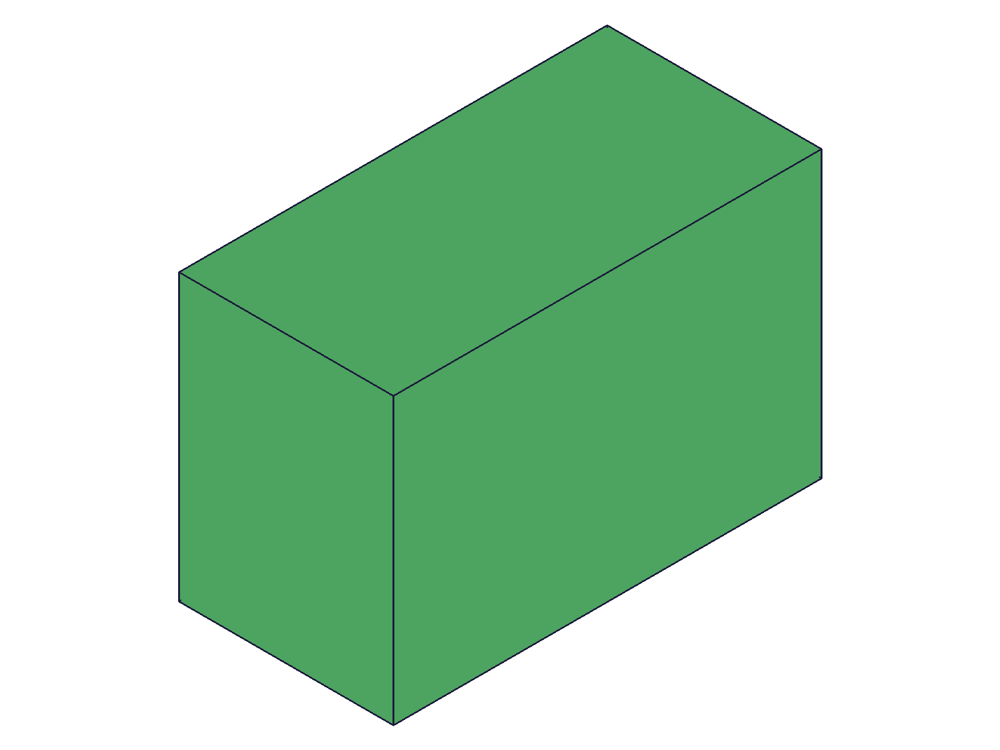 |
|---|---|

**Data:** First copy returned id=65, second copy returned id=68. Both maxLevel=31 (info), empty messages array. Each copy gets a unique, incrementing ID. `copyId !== boxId` confirmed true.

**Learned:** Basic copy with no transform creates an overlapping duplicate at the exact same position. Returns the new solid's ID.

---

## 02 — copy with translation

Script: `scripts/02-copy-with-translation.mjs` — ✅ Translation offsets the copy as expected.

| 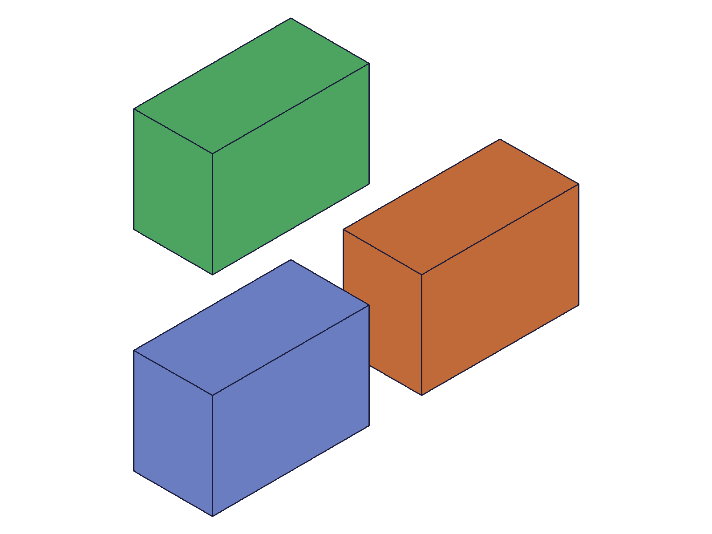 |
|---|

**Data:** Original box at origin (id=61). Copy 1 at [80,0,0] (id=63). Copy 2 at [0,80,0] (id=66). All maxLevel=31. Graphic data (11068 bytes) shows 3 distinct body containers.

**Learned:** Translation works as expected — offsets the copy in world space. Multiple copies from the same source are independent.

---

## 03 — copy with rotation

Script: `scripts/03-copy-with-rotation.mjs` — ✅ Rotation around Z axis clearly visible.

| 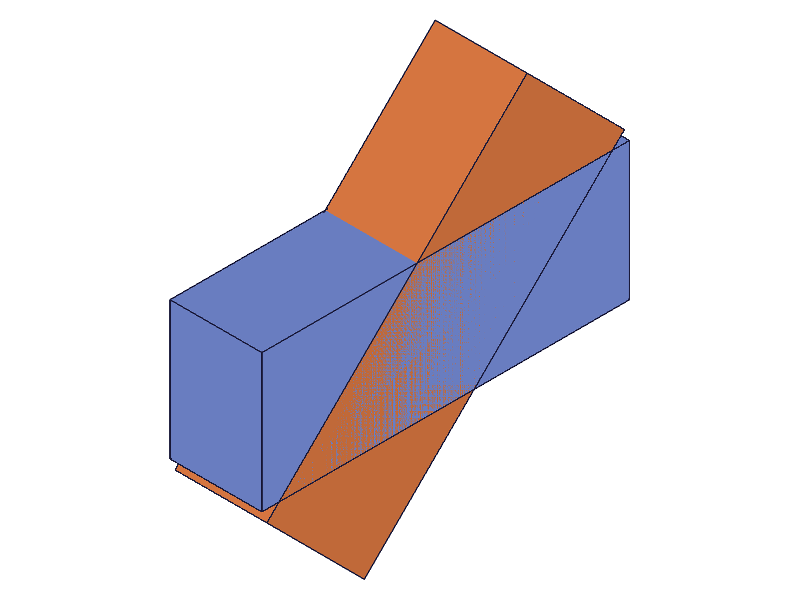 |
|---|

**Data:** Original box (id=61, 80×30×20) and copy (id=63) rotated 45° around Z. Both share origin so they overlap.

**Learned:** Rotation applies around the world origin, consistent with `generic.md` documentation. Non-symmetric box dimensions make rotation clearly visible.

---

## 04 — rotateFirst=true (default)

Script: `scripts/04-rotate-first-true.mjs` — ✅ Rotate then translate behavior confirmed.

| 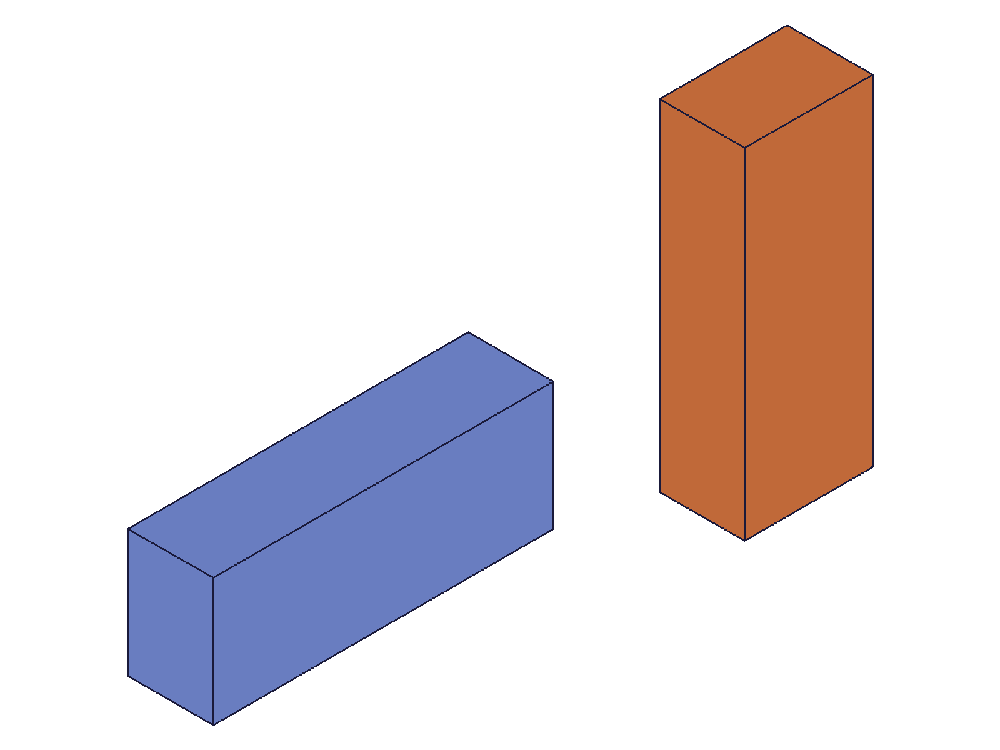 |
|---|

**Data:** Original box (blue) extends in +X at origin. Copy (orange) with rotation=[0,0,π/2] + translation=[100,0,0]: box rotated 90° Z (now extends in +Y direction), then translated to X=100. Copy appears at X=100 oriented along +Y.

**Learned:** `rotateFirst: true` (default) rotates the solid around the origin first, then translates. "Orient, then place."

---

## 05 — rotateFirst=false

Script: `scripts/05-rotate-first-false.mjs` — ✅ Translate then rotate (orbit) behavior confirmed.

| 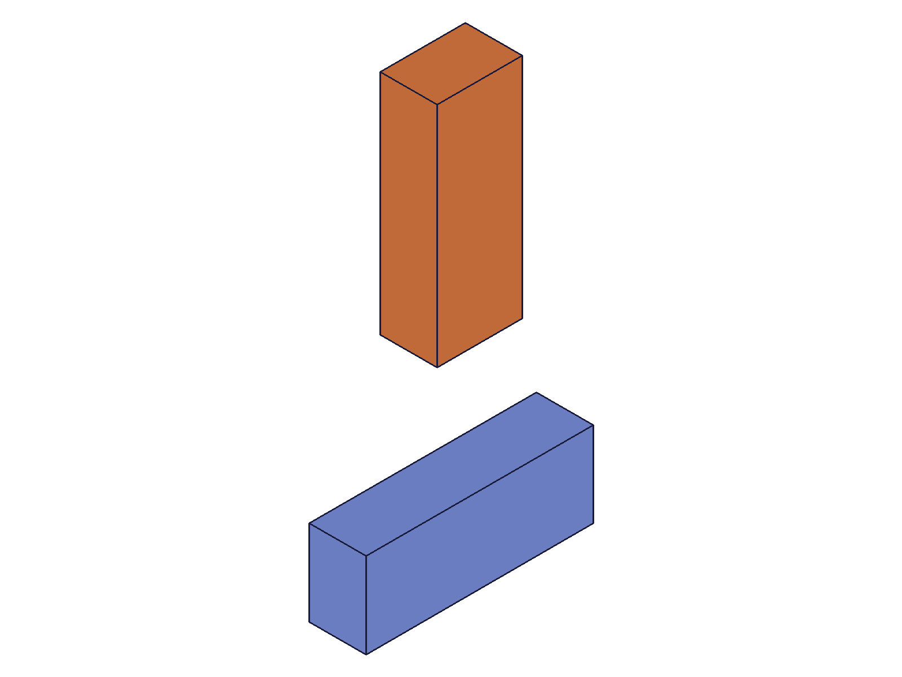 |
|---|

**Data:** Same params as script 04 but `rotateFirst: false`. The copy was translated to [100,0,0] first, then rotated 90° Z around origin — orbiting to approximately [0,100,0]. Visually distinct from script 04.

**Learned:** `rotateFirst: false` creates an orbital pattern — useful for distributing copies in a circle around the origin.

---

## 06 — copy different solid types

Script: `scripts/06-copy-different-shapes.mjs` — ✅ All primitive types copy successfully.

| 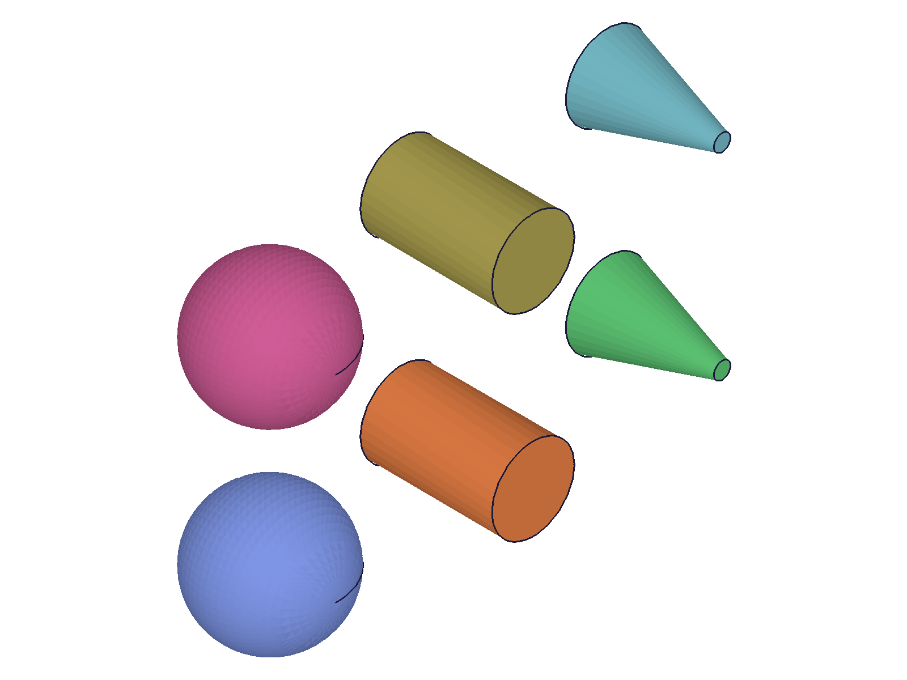 |
|---|

**Data:** Sphere (60→69), cylinder (64→72), cone (67→75). All copies returned valid IDs, maxLevel=31. Each copy translated [0,60,0] from its original. 6 bodies total, each with distinct color in renderer.

**Learned:** Copy works identically for all solid types — box, sphere, cylinder, cone. No type-specific behavior.

---

## 07 — copy boolean result

Script: `scripts/07-copy-boolean-result.mjs` — ✅ Copy preserves boolean topology.

| 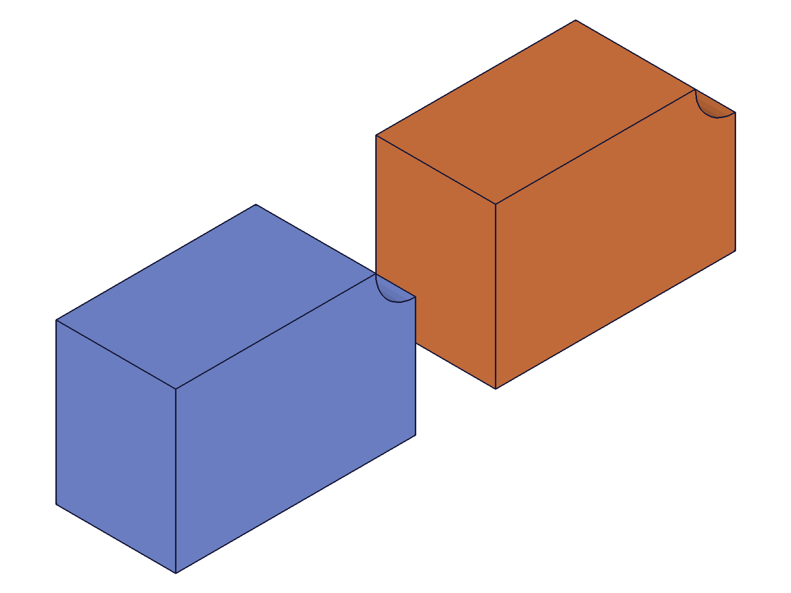 |
|---|

**Data:** Box with cylinder subtracted (cylindrical hole). Copy (id=68, maxLevel=31) at [80,0,0] shows identical hole topology. Both original and copy show the cylindrical notch in the snapshot. Graphic data (19952 bytes) confirms 3 body containers.

**Learned:** Copy preserves the full B-rep topology of boolean results. The hole from the subtraction is faithfully duplicated.
**📌 LLM doc:** Copy preserves boolean topology — document this as a key behavior.

---

## 08 — multiple copies (circular pattern)

Script: `scripts/08-multiple-copies.mjs` — ✅ 5 copies at 60° intervals + center cylinder = 7 bodies.

| 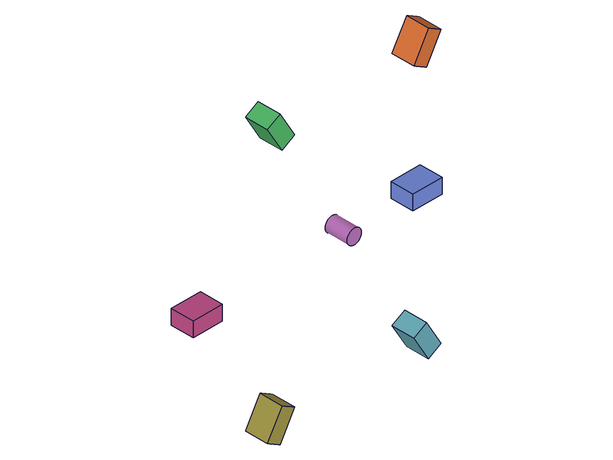 |
|---|

**Data:** Original box at [50,0,0]. 5 copies with `rotateFirst: false`, rotation angles 60°/120°/180°/240°/300°. IDs: 63, 66, 69, 72, 75. All maxLevel=31.

**Learned:** `rotateFirst: false` with `translation` + varying `rotation` creates a clean radial pattern around the origin. This is the primary use case for `rotateFirst: false` in copy.
**📌 LLM doc:** Document circular pattern recipe using rotateFirst=false.

---

## 09 — copy independence

Script: `scripts/09-copy-independence.mjs` — ✅ Copy is fully independent from original.

| 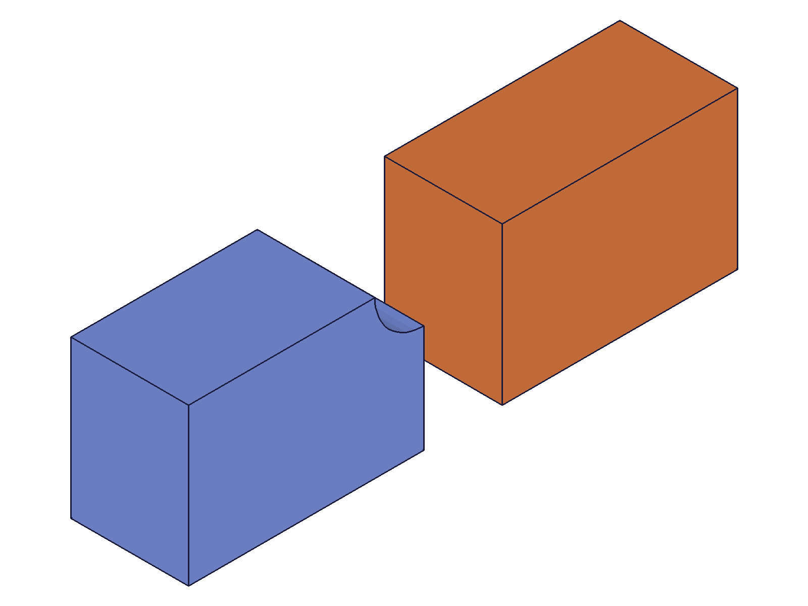 |
|---|

**Data:** Created a box (id=61), copied it (id=63, at [80,0,0]). Then subtracted a cylinder from the ORIGINAL only. After-snapshot shows: original (blue) has cylindrical notch, copy (orange) remains an intact box with no hole.

**Learned:** Copies are fully independent. Modifying the original (boolean subtraction) does not affect the copy. They share no state.
**📌 LLM doc:** Document copy independence.

---

## 10 — cross-EIF copy

Script: `scripts/10-cross-eif-copy.mjs` — ✅ Cross-EIF copy works!

**Data:** eif1=54, eif2=62. Box created in eif1 (id=69). Copied into eif2 with translation [80,0,0]: result=71, maxLevel=31. No errors.

**Learned:** The `id` parameter (destination EIF) does not need to be the same EIF that contains the `target` solid. You can copy a solid from one entity injection feature into another.
**📌 LLM doc:** Cross-EIF copy is supported — document this.

---

## 11 — error cases

Script: `scripts/11-error-invalid-target.mjs` — ✅ All 4 error cases return maxLevel=51 (ERROR), result=null.

**Data:**

| Case | Params | Error code | Error message |
|---|---|---|---|
| Bad target (99999) | valid EIF, non-existent target | 1006 | `An element of parameter "target" has an invalid id!` |
| Bad EIF (99999) | non-existent EIF, valid target | 1006 | `An element of parameter "id" has an invalid id!` |
| Target = EIF id | target points to EIF, not solid | 1001 | `The parameter "target" has a wrong id type! Provide only following id types: ["solid"]` |
| Target = part id | target points to part | 1001 | same as above |

**Learned:** Error messages are descriptive and distinguish between "invalid id" (non-existent, code 1006) and "wrong id type" (exists but not a solid, code 1001). All errors preceded by a warning (level 41) `"ToId()/TOID() didn't get an existing or valid id."` for the non-existent ID cases.
**📌 LLM doc:** Document error codes and messages.

---

## 12 — mesh topology verification

Script: `scripts/12-mesh-verification.mjs` — ✅ Copy preserves exact mesh topology.

**Data:** Box original graphic: 1 container, 12 vertices, 12 edges. Box copy graphic: 1 container, 12 vertices, 12 edges — identical. Sphere original: 5091 vertices, 1 edge. Sphere copy: 5091 vertices, 1 edge — identical.

**Learned:** Copy creates an exact geometric duplicate. Vertex counts and edge counts are identical between original and copy. The graphic response from `solid.copy` includes only the newly created body (1 container), not the entire scene.

---

## 13 — copy extrusion solid

Script: `scripts/13-copy-extrusion.mjs` — ✅ Copy preserves complex extrusion geometry.

| 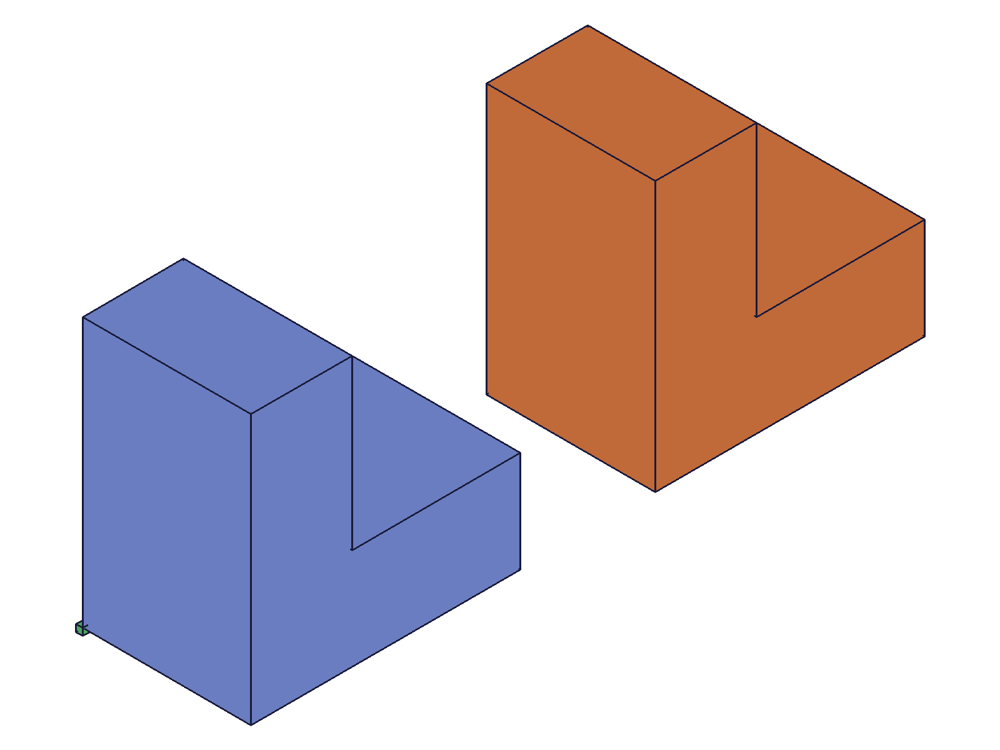 |
|---|

**Data:** L-shaped extrusion (id=64) copied with translation [60,0,0] (copy id=66, maxLevel=31). Both L-shapes are visually identical in the snapshot. Graphic data: 15691 bytes for the copy.

**Learned:** Copy works on extrusion results just like primitives. The L-shaped profile is faithfully preserved.

---

## 14 — copy as boolean tool

Script: `scripts/14-copy-as-boolean-tool.mjs` — ✅ Copied solids can be used as boolean tools.

| 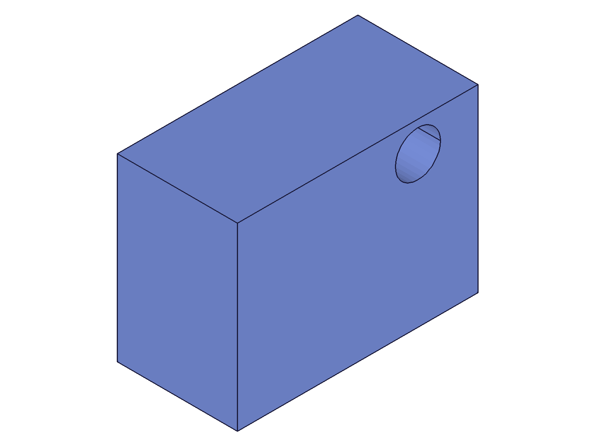 |
|---|

**Data:** Created a cylinder (id=64) and copied it with [30,0,0] offset (id=66). Used both as tools in subtraction from a large box. Result: maxLevel=31, the box shows a cylindrical hole. Both cylinders were consumed as tools.

**Learned:** Copies are first-class solid citizens — they can be used as boolean tools just like any other solid. The copy and original can be used together in the same boolean operation.
**📌 LLM doc:** Copies can be used as boolean tools.

---

## 15 — copy then independent transform

Script: `scripts/15-copy-self-same-eif.mjs` — ✅ Copy and original can be independently transformed post-creation.

| 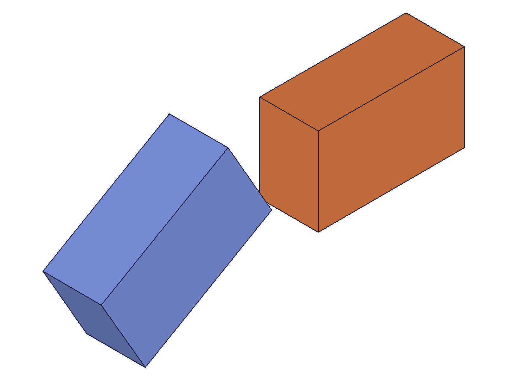 |
|---|

**Data:** Box (id=61) copied (id=63) with no transform (overlapping). Then: copy translated [70,0,0] (result=63, maxLevel=31), original rotated 30° Z (result=61, maxLevel=31). Snapshot shows rotated blue box and axis-aligned orange box at separate positions.

**Learned:** After copying with no transform, both IDs remain valid and independently transformable. The overlapping copy can be separated by subsequent `solid.translation` / `solid.rotation` calls.

---

## Coverage Checklist

- [x] API called successfully (scripts 01-15)
- [x] Required params tested: `id` (EIF), `target` (solid)
- [x] Optional params: `translation` (02), `rotation` (03), `rotateFirst` true (04) and false (05)
- [x] All `rotateFirst` variants exercised
- [x] No `update*` / `delete*` method exists for copy
- [x] Realistic usage: circular pattern (08), boolean tool (14), cross-EIF (10)
- [x] Findings verified with data + snapshots — both agree in all cases
