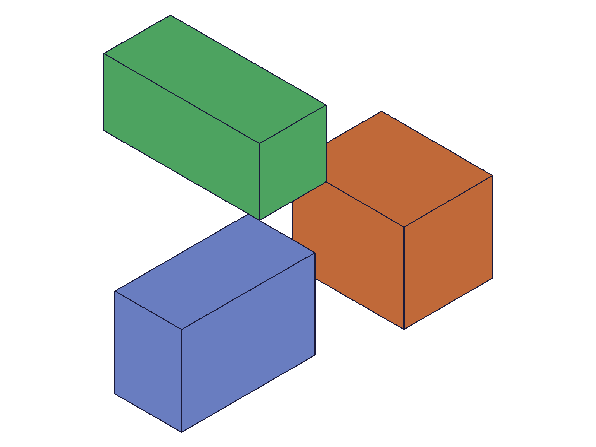
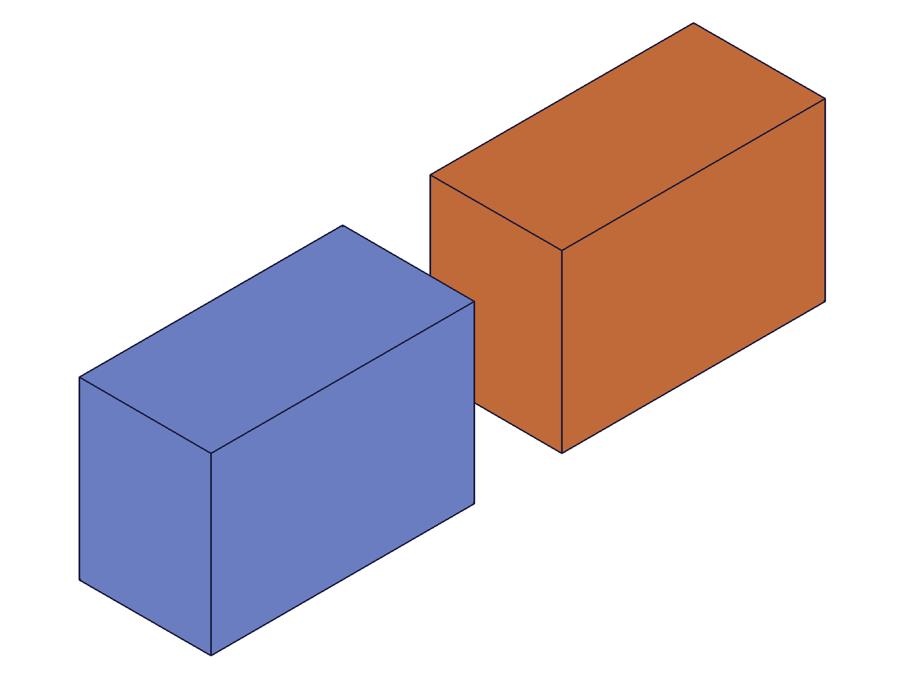
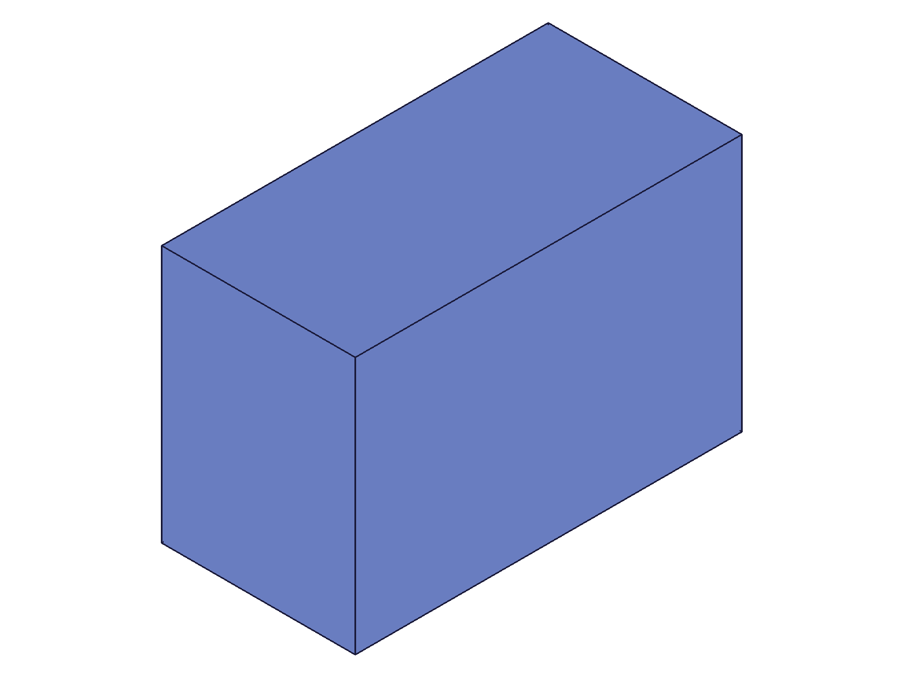
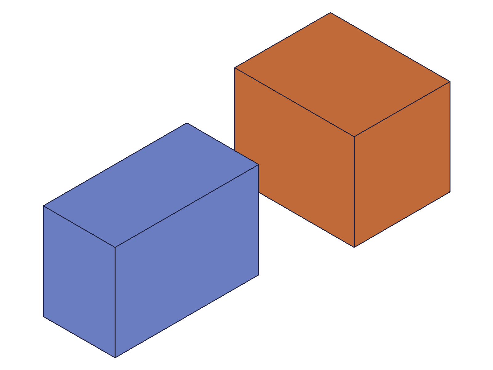
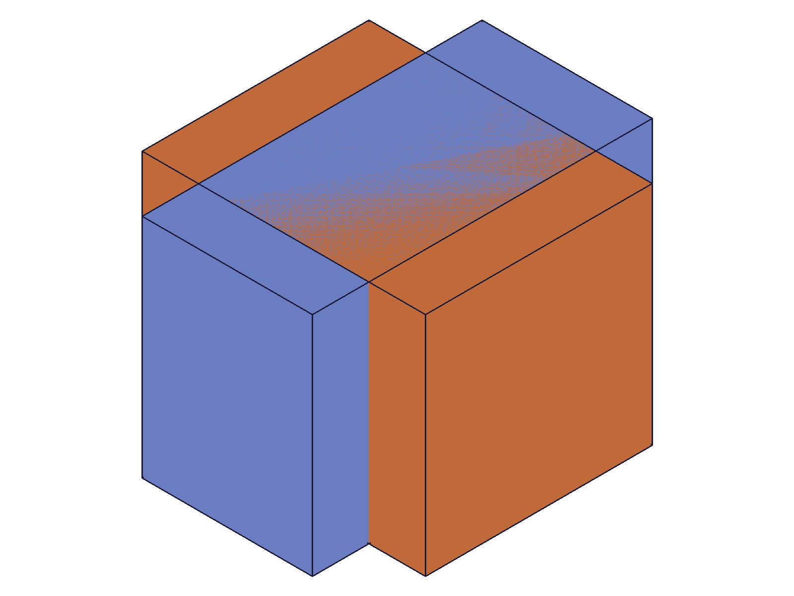
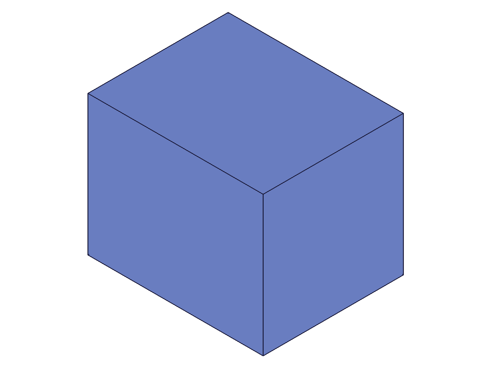
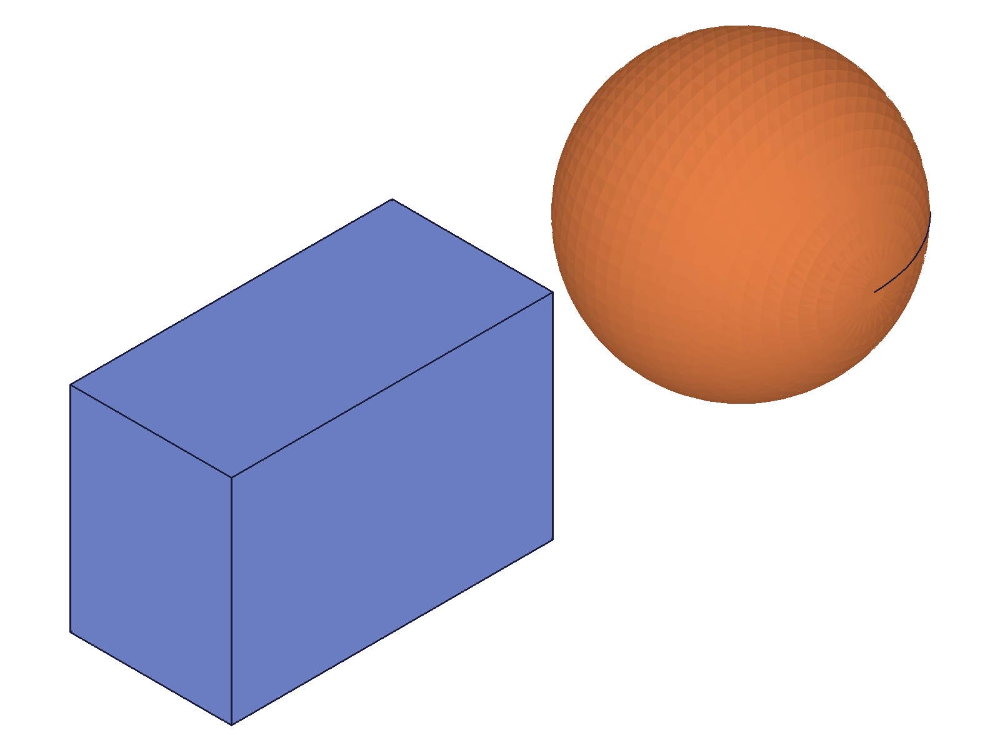
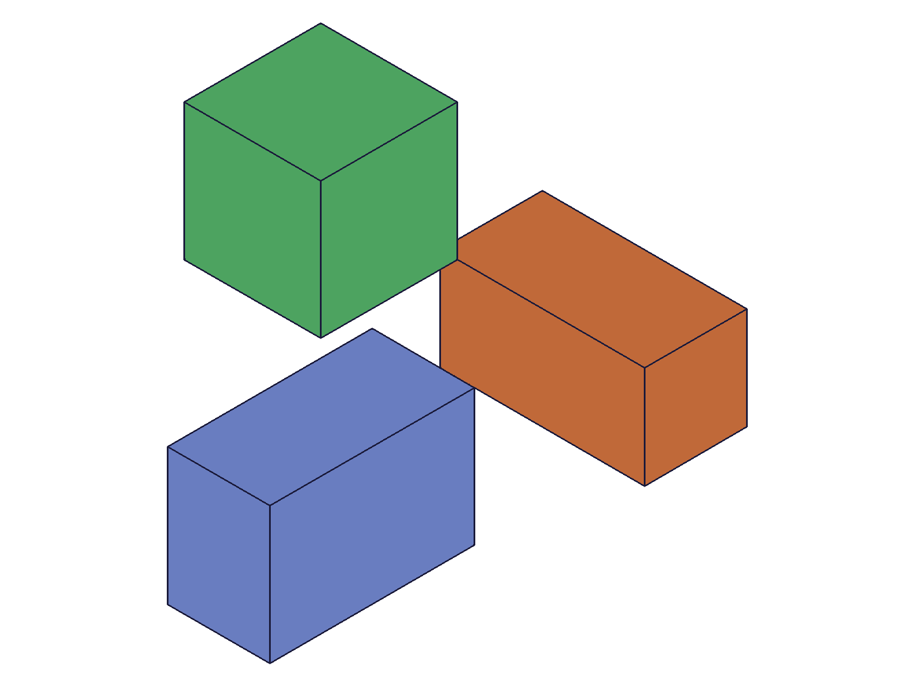

# Training: solid.deleteSolid

**Date:** 2026-04-15

## Goal

Testing `v1.solid.deleteSolid` — the only deletion API in the solid domain.

**Methods to cover:**

- `deleteSolid` with `ids` — delete specific solids by ID array
- `deleteSolid` without `ids` — delete ALL solids in the entity injection
- `deleteSolid` with single-element `ids` array
- `deleteSolid` with empty `ids` array (edge case)

**Questions:**

- Does it return VOID on success, or something else?
- What error/message level when deleting an invalid/nonexistent solid ID?
- What happens if you delete an already-deleted solid (double-delete)?
- Can you delete a solid from a different EIF than it belongs to?
- After deletion, do IDs become invalid for subsequent operations?
- What happens to the graphic/structure data after deletion?
- If you delete only some solids, do the remaining solids stay intact?

---

## 01 — delete single solid

Script: `scripts/01-delete-single.mjs` — ✅ as documented. Deleting one solid from a two-solid EIF removes it cleanly.

|  |  |
|---|---|

**Data:** `result: null`, `maxLevel: 31`, `messages: []`. Graphic data after deletion is `null` (4 bytes). Structure tree (21KB) shows remaining solid only.

**Learned:** Returns null/VOID on success. maxLevel=31 (info) — not 0. Empty messages array on success.

---

## 02 — delete multiple solids

Script: `scripts/02-delete-multiple.mjs` — ✅ as documented. `ids: [box1, box3]` deletes both, box2 survives.

|  |  |
|---|---|

**Data:** `result: null`, `maxLevel: 31`. Before: 3 boxes (blue, orange, green). After: 1 box (blue, box2).

---

## 03 — delete all (no ids param)

Script: `scripts/03-delete-all.mjs` — ✅ as documented. Omitting `ids` removes ALL solids.

|  |
|---|

**Data:** `result: null`, `maxLevel: 31`. After deletion, no PNG was produced by snapshot — no solids left to render. `graphic` response is `null` (4 bytes). OFB and STP files still generated (empty drawing).

**Learned:** Delete-all is clean — no rendering output when all geometry is gone.

---

## 04 — invalid IDs (nonexistent, wrong type)

Script: `scripts/04-invalid-id.mjs` — errors as expected for all three cases.

|  |
|---|

**Data:**
- Nonexistent ID (99999): `maxLevel: 51`, code 1006: `"An element of parameter "ids" has an invalid id!"` + warning 41: `"ToId()/TOID() didn't get an existing or valid id."`
- EIF ID as solid: `maxLevel: 51`, code 1001: `"The parameter "ids" has a wrong id type! Provide only following id types: ["solid"]"`
- Part ID as solid: same code 1001 as above.

Original box survives all invalid calls. Invalid IDs don't cause side effects.

**📌 LLM doc:** Error codes and messages for invalid IDs. Code 1006 = nonexistent, code 1001 = wrong type.

---

## 05 — double delete

Script: `scripts/05-double-delete.mjs` — first delete succeeds (maxLevel: 31), second delete fails (maxLevel: 51).

**Data:**
- First: `result: null, maxLevel: 31, messages: []`
- Second: `result: null, maxLevel: 51`, code 1006: `"An element of parameter "ids" has an invalid id!"` — same as nonexistent ID.

**Learned:** Deleted solid IDs become invalid immediately. Double-delete is treated identically to nonexistent ID.

**📌 LLM doc:** Deleted IDs are invalidated — same error as nonexistent IDs.

---

## 06 — empty ids array

Script: `scripts/06-empty-ids.mjs` — ✅ no-op, no error. `maxLevel: 31`, box survives.

**Data:** `result: null, maxLevel: 31, messages: []`. Box still present in snapshot.

**Learned:** Empty `ids: []` is a silent no-op, NOT equivalent to delete-all. Semantics: "delete these specific solids (none specified)" → nothing happens. Omitting `ids` entirely is what triggers delete-all.

**📌 LLM doc:** Critical distinction: `ids: []` ≠ no `ids` param. Former is no-op, latter deletes all.

---

## 07 — delete from empty EIF

Script: `scripts/07-delete-from-empty-eif.mjs` — ✅ no-op, no error. `maxLevel: 31`.

**Data:** `result: null, maxLevel: 31, messages: []`.

**Learned:** Deleting all from an empty EIF is a clean no-op. No warnings.

---

## 08 — delete original after copy

Script: `scripts/08-delete-after-operations.mjs` — ✅ deleting source doesn't affect the copy.

|  |  |  |
|---|---|---|

**Data:** Delete original: `maxLevel: 31`. Translate copy after: `result: 63, maxLevel: 31` — copy is fully independent.

**Learned:** Copies are independent objects. Deleting the source solid has no effect on its copies. Copies remain valid for all subsequent operations.

**📌 LLM doc:** Copies survive deletion of their source.

---

## 09 — delete different solid types

Script: `scripts/09-delete-different-types.mjs` — sphere deleted fine. Cylinder creation failed (`cylId: null`), which is a script issue (wrong param name for cylinder — not a `deleteSolid` issue).

**Data:** Sphere deletion: `maxLevel: 31`. Attempting to delete box + null (failed cylinder): `maxLevel: 51` — the null ID was invalid.

**Note:** Script bug — `solid.cylinder` uses `length` not `height` for the axis dimension. Not relevant to `deleteSolid` itself. The key finding: `deleteSolid` works on all solid types (box, sphere confirmed, cylinder untested due to creation failure).

---

## 10 — mixed valid + invalid IDs (initial test)

Script: `scripts/10-mixed-valid-invalid.mjs` — `maxLevel: 51`, both boxes survived.

|  |  |
|---|---|

**Data:** `maxLevel: 51`, error code 1006 on invalid ID. Before and after snapshots identical — both boxes survive.

**Learned:** When `ids` contains a mix of valid and invalid IDs, the operation appears to be atomic: the invalid ID causes an error and no deletions occur.

---

## 11 — cross-EIF deletion

Script: `scripts/11-cross-eif.mjs` — cross-EIF specific deletion WORKS. Delete-all is scoped.

|  |  |  |
|---|---|---|

**Data:**
- Cross-EIF delete (`deleteSolid({ id: eif2, ids: [box1_in_eif1] })`): `maxLevel: 31` — success! Box1 deleted despite specifying wrong EIF.
- Delete-all from eif1 after: `maxLevel: 31` — eif1 already empty (box1 was deleted). Box2 in eif2 survives.

**📌 LLM doc:** CRITICAL — When using `ids` array, the `id` param does NOT restrict deletion scope. Solids from ANY EIF can be deleted. The `id` is just a context/container reference, not a filter.

---

## 12 — use deleted solid ID

Script: `scripts/12-use-id-after-delete.mjs` — all operations on deleted IDs fail with code 1006.

**Data:**
- `solid.copy({ target: deletedId })`: maxLevel 51, code 1006 "invalid id" on `target`
- `solid.translation({ target: deletedId })`: maxLevel 51, code 1006 "invalid id" on `target`
- `solid.subtraction({ tools: [deletedId] })`: maxLevel 51, code 1006 "invalid id" — same pattern

Box2 survives all failed operations (snapshot shows one box after all attempts).

**Learned:** Deleted IDs are fully invalidated. They cannot be used in any subsequent API call — copy, translate, boolean all reject them with code 1006.

**📌 LLM doc:** Deleted IDs become permanently invalid for all operations.

---

## 13 — cross-EIF verification (distinct shapes)

Script: `scripts/13-cross-eif-verify.mjs` — confirmed with distinct shapes (box vs sphere).

|  |  |
|---|---|

**Data:** Before: box (in eif1) + sphere (in eif2). After `deleteSolid({ id: eif2, ids: [boxId_in_eif1] })`: only sphere remains. Then delete-all from eif2 removes sphere — no PNG produced.

**Learned:** Visually confirmed with distinct shapes: cross-EIF specific deletion works. The box (eif1) was deleted via a call referencing eif2.

---

## 14 — delete-all is EIF-scoped

Script: `scripts/14-delete-all-scoped.mjs` — confirmed delete-all only removes solids in the specified EIF.

|  |  |
|---|---|

**Data:** Before: 3 boxes (b1 and b2 in eif1, b3 in eif2). After `deleteSolid({ id: eif1 })`: 1 box remains (b3 in eif2).

**Learned:** Delete-all mode (no `ids`) is strictly scoped to the specified EIF. Solids in other EIFs are untouched.

**📌 LLM doc:** Delete-all scoped to EIF. Specific-ID deletion crosses EIF boundaries.

---

## 15 — mixed valid+invalid atomicity (definitive)

Script: `scripts/15-mixed-atomicity.mjs` — **confirmed atomic**. Called `deleteSolid({ ids: [box1, 99999, box3] })`. All three boxes survived.

**Data:** `maxLevel: 51`, error code 1006. Post-check via `solid.copy` on each: box1 alive YES, box2 alive YES, box3 alive YES.

**Learned:** The `ids` array is validated atomically. If ANY ID is invalid, the ENTIRE call fails and NO deletions occur. Valid IDs in the array are NOT processed individually — it's all-or-nothing.

**📌 LLM doc:** CRITICAL — atomic validation on ids array. One bad ID = zero deletions.

---

## Coverage checklist

- [x] The API has been called at least once successfully
- [x] Every required parameter (`id`) tested
- [x] Key optional parameter (`ids`) exercised — with values, empty, and omitted
- [x] Both modes tested: specific-ID deletion and delete-all
- [x] No `updateDeleteSolid` / `deleteDeleteSolid` exists (this IS the delete API)
- [x] Realistic usage: delete after copy, use ID after delete, cross-EIF operations
- [x] Behavioral claims verified with data AND visual evidence
