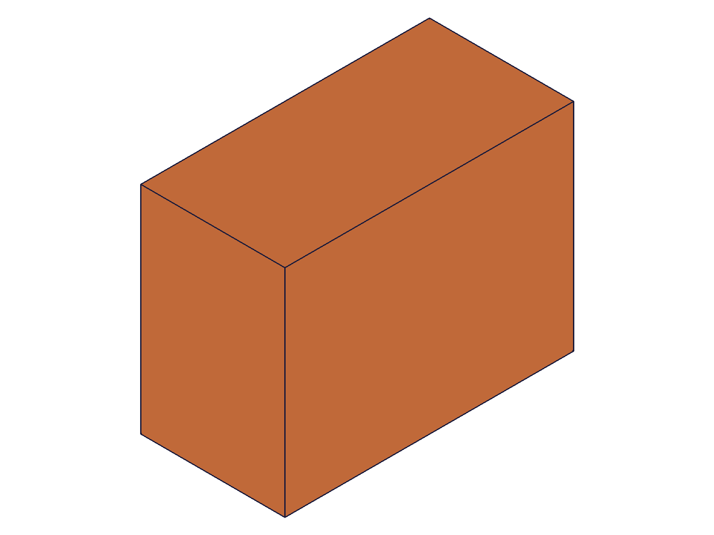
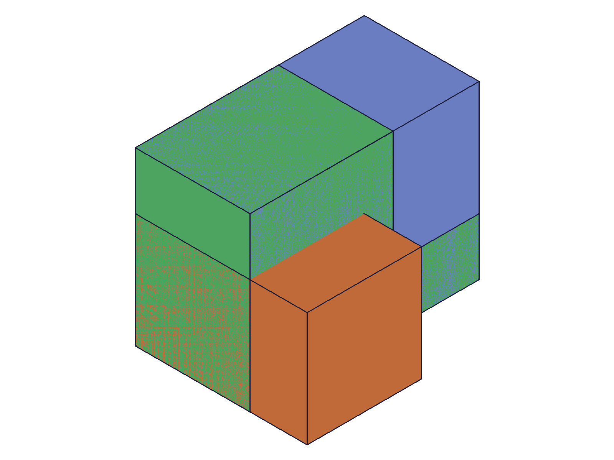
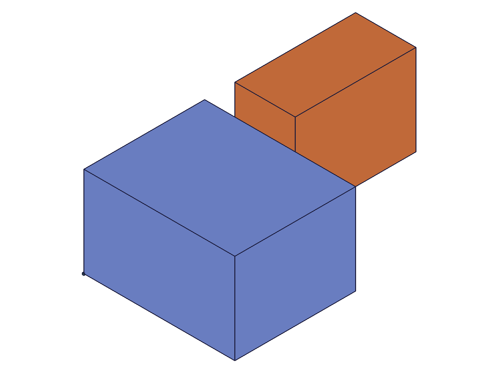
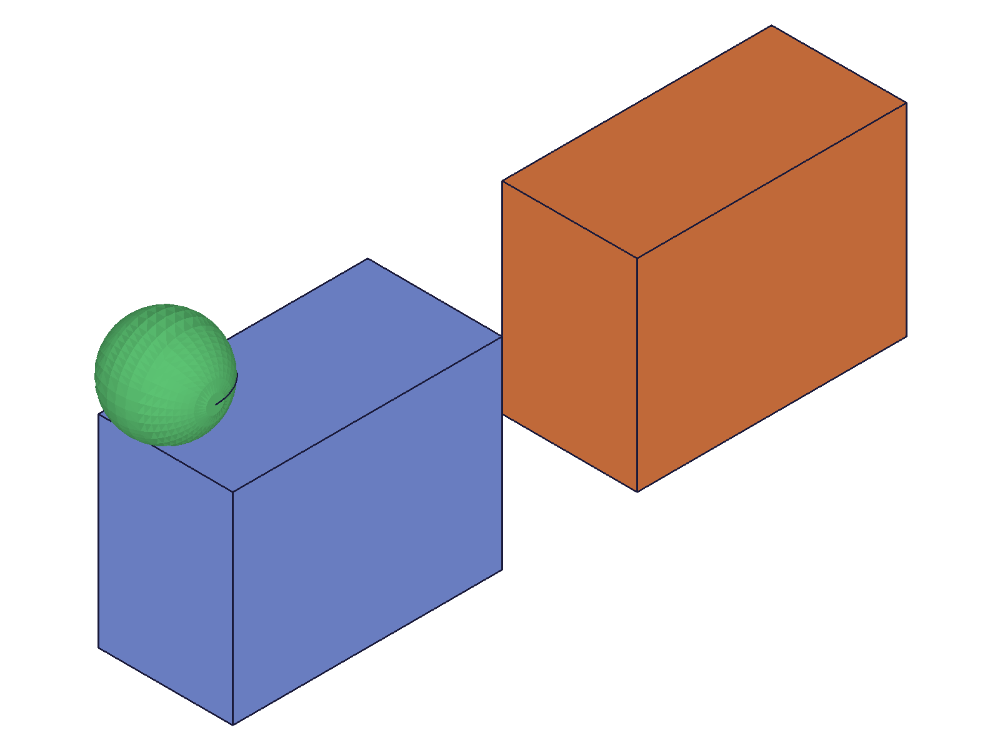
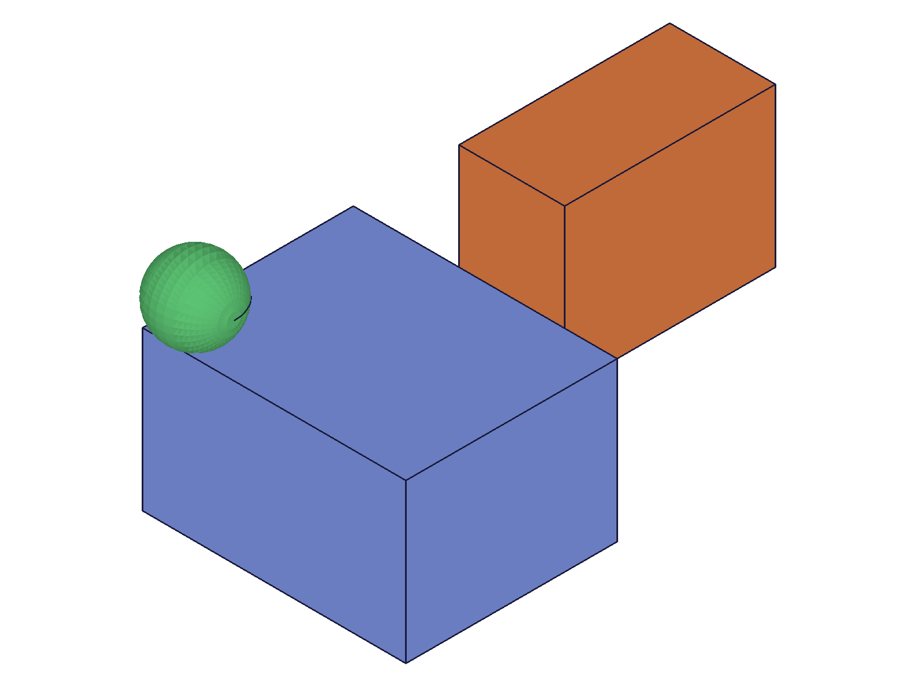

# Training: solid.useSolid

**Date:** 2026-04-15

## Goal

Testing `v1.solid.useSolid` — accessing solids from other features within an entity injection.

**Methods to cover:**

- `useSolid` — basic usage: pull solids from a part-level feature (e.g., `part.box`) into an entity injection
- `useSolid` with `from` as plain ID array (all solids from feature)
- `useSolid` with `from` as object array with `indices` (select specific solids)
- `useSolid` with multiple features in `from`
- `useSolid` return value — `id[]` array of solid IDs usable in the destination EI
- Cross-feature usage: use returned IDs for boolean operations, transforms, deletions

**Questions:**

- What does `useSolid` return — IDs of the solids, or something else?
- Can you use solids pulled via `useSolid` in boolean operations?
- What happens if you `useSolid` from an entity injection (not a part-level feature)?
- What happens if the source feature has no solids?
- What do the `indices` mean — which solids in a multi-solid feature?
- Are the returned IDs the same as the original solid IDs, or new copies?
- What happens when the source solid is modified after `useSolid`?

---

## 01 — basic useSolid

Script: `scripts/01-basic-useSolid.mjs` — ✅ `useSolid` pulls a solid from `part.box` into an entity injection.

**Data:** `from: [boxFeatId=54]`, `in: eifId=91` → result `[98]`, maxLevel=31. Returns an array of solid IDs.

|  |
|---|

**Learned:** Returns `id[]` — one ID per solid pulled. The box is visible in the destination EI.
**📌 LLM doc:** Return value is `id[]`, not a single ID.

## 02 — use returned IDs for operations

Script: `scripts/02-use-returned-ids.mjs` — ✅ Returned IDs work for boolean and transform operations.

**Data:** `useSolid` from two `part.box` features → `[135, 138]`. `solid.translation` on 138: maxLevel=31. `solid.subtraction` on 135 with tool 138: maxLevel=31.

|  |
|---|

**Learned:** useSolid'd IDs are first-class solid IDs — usable in any `solid.*` operation (translate, boolean, etc.). The original part-level features remain visible as separate bodies.
**📌 LLM doc:** Returned IDs support all solid operations.

## 03 — useSolid from entity injection

Script: `scripts/03-from-entity-injection.mjs` — ✅ Works from entity injection features, not just part-level features.

**Data:** Source EI (ID 54) with box (61) + cylinder (64). useSolid into dest EI (68) → `[75, 78]`, maxLevel=31.

**Learned:** `from` accepts entity injection IDs, not only part-level feature IDs. Returns one ID per solid in the source EI.
**📌 LLM doc:** Works with any feature type that contains solids.

## 04 — indices with consumed source (confounded)

Script: `scripts/04-indices-select.mjs` — ⚠️ Indices tests were confounded by consumption. First call (no indices) consumed the source; subsequent calls failed.

**Data:**
- All solids (no indices): `[78, 81, 84]` — ✅
- `indices: [0]` after all-consumed: `[]` maxLevel=51 — code 1014 "already consumed/used"
- `indices: [1,2]` after all-consumed: `[]` maxLevel=51 — code 1014
- `indices: [5]` (bad): `[]` maxLevel=51 — "objId not found"

**Learned:** First call consumed all solids from the source feature. Subsequent calls fail with code 1014. Must test indices in isolation (see scripts 06-08).

## 05 — consumption test

Script: `scripts/05-consumption.mjs` — ✅ Confirmed: `useSolid` consumes the source feature's solids.

**Data:**
- First call `from: [boxFeat=54]` → `[98]` maxLevel=31
- Second call same source → `[]` maxLevel=51, code 1014: "Entity 'SourceBox' is not available. It has already been consumed/used in another operation."

**Learned:** Each solid in a feature can only be consumed/used by `useSolid` once. After consumption, the source feature is marked unavailable for further `useSolid` calls.
**📌 LLM doc:** Source solids are consumed — cannot useSolid the same source twice.

## 06 — indices on fresh source

Script: `scripts/06-indices-fresh.mjs` — ✅ Indices work correctly on a fresh (unconsumed) source.

**Data:** Source EI with 3 solids (box1=61, box2=64, cyl=67). `useSolid from: [{ id: srcEif, indices: [0] }]` → `[78]` maxLevel=31.

**Learned:** `indices` parameter works. It selects specific solids by their positional index within the feature (0-based).
**📌 LLM doc:** indices is 0-based, selects specific solids from multi-solid features.

## 07 — indices on part-level feature

Script: `scripts/07-indices-part-feature.mjs` — ✅ Indices work on part-level features (part.box has one solid at index 0).

**Data:**
- `indices: [0]` on `part.box` → `[98]` maxLevel=31
- `indices: [1]` on same box → `[]` maxLevel=51 — "objId not found" (not "consumed")

**Learned:** `indices` works on part features. Invalid index gives "objId not found" (code 0), different from the "consumed" error. Note: first call with indices [0] did NOT prevent second call with indices [1] from giving a different error — suggests per-solid consumption.

## 08 — indices consume per-solid, not per-feature

Script: `scripts/08-indices-twice.mjs` — ✅ **Critical finding:** consumption is per-solid, not per-feature.

**Data:**
- First call `indices: [0]` → `[75]` ✅
- Second call `indices: [0]` again → `[]` ❌ code 1014 "already consumed"
- Third call `indices: [1]` → `[94]` ✅ — **different index still works!**

**Learned:** When using `indices`, only the specific solids at those indices are consumed. Other indices remain available. Plain `from: [featureId]` (no object form) consumes ALL solids at once.
**📌 LLM doc:** Consumption is per-solid. Use indices to selectively consume individual solids from multi-solid features.

## 09 — multiple features in from

Script: `scripts/09-multiple-from.mjs` — ✅ Multiple features in `from` array works.

**Data:** `from: [box1=54, box2=91]` → `[135, 138]` maxLevel=31. Translate on 138: OK.

**Learned:** One ID returned per feature (assuming each feature has one solid). Result array order matches `from` array order.
**📌 LLM doc:** Multiple features supported in from array.

## 10 — mixed form in from array

Script: `scripts/10-mixed-form.mjs` — ❌ Mixing plain IDs and object form in `from` fails.

**Data:** `from: [box1, { id: srcEif, indices: [0] }]` → `null` maxLevel=51, code 1001: "An element of parameter 'from' has the wrong type!"

**Learned:** The `from` array must be homogeneous: either ALL plain IDs (`Array<id>`) or ALL objects (`Array<object>`). Cannot mix.
**📌 LLM doc:** from array must be all plain IDs or all objects, never mixed.

## 11 — self-reference

Script: `scripts/11-self-reference.mjs` — ❌ Cannot useSolid from the same EI into itself.

**Data:** `from: [eif], in: eif` → `null` maxLevel=51, code 1014: "Entity of operation 'SelfEI' is not available. Only entities of operations which have been created before the container can be used."

**Learned:** Source features must be created BEFORE the destination EI in the feature tree. Self-reference and backward references are forbidden — enforces DAG ordering.
**📌 LLM doc:** Source must precede destination in feature tree. No self-reference or backward references.

## 12 — empty source

Script: `scripts/12-empty-source.mjs` — ✅ Empty source returns empty array, no error.

**Data:** `from: [emptyEif]` → `[]` maxLevel=31.

**Learned:** Graceful handling — no error, just empty result.

## 13 — returned IDs are new, not original

Script: `scripts/13-are-ids-new.mjs` — ✅ useSolid returns new IDs; original IDs remain valid.

**Data:**
- Original box ID: 61, useSolid returned: 75. `sameId: false`.
- Translate original (61): maxLevel=31 ✅
- Translate useSolid'd (75): maxLevel=31 ✅

**Learned:** useSolid creates new reference IDs in the destination EI. The original solid ID in the source feature remains independently valid. Both can be operated on.
**📌 LLM doc:** Returns NEW IDs — different from source solid IDs. Both original and new IDs are independently valid.

## 14 — parametric link (visual)

Script: `scripts/14-parametric-link.mjs` — ✅ useSolid creates a parametric link, not a copy.

**Data:** Source box updated from height=40 to height=100 via `openFeature → updateBox → closeFeature → recalc`. After update, the useSolid'd solid's ID (98) still works for translation. Visual comparison shows both bodies changed proportions.

|  |  |
|---|---|

**Learned:** useSolid creates a parametric reference — when the source feature is updated and recalculated, the useSolid'd solid updates too. This is fundamentally different from `solid.copy` which creates an independent duplicate.
**📌 LLM doc:** Parametric link — source updates propagate to useSolid'd references after recalc.

## 15 — error cases

Script: `scripts/15-error-cases.mjs` — ✅ Comprehensive error testing.

**Data:**
| Input | Result | Error |
|---|---|---|
| `from: [partId]` | null, maxLevel=51 | Internal server crash (code 0, German error) |
| `from: [solidId]` | null, maxLevel=51 | Same internal crash |
| `from: [99999]` | null, maxLevel=51 | code 1006 "invalid id" |
| `in: partId` | null, maxLevel=51 | code 1001 "wrong id type, must be entityinjection" |
| `from: []` | null, maxLevel=51 | code 1001 "wrong type, should be Array<object\|id>" |

**Learned:**
- `in` must be an entity injection ID — clean error for wrong type.
- `from` must contain feature IDs (EI or part-level features like box/extrusion) — passing part IDs or solid IDs causes an internal server crash (not a clean error message).
- Nonexistent IDs get clean error 1006.
- Empty `from` array is rejected.
**📌 LLM doc:** from requires feature IDs (not part/solid IDs — causes crash). in requires entity injection ID.

## 17 — parametric link with data verification

Script: `scripts/17-parametric-clean.mjs` — ✅ Confirmed parametric behavior with structure tree + reference sphere.

**Data:** Structure tree before: `SrcBox.height.value = 40`. After `updateBox(height: 100)`: `SrcBox.height.value = 100`. The useSolid'd solid (ID 98) has `consumed: 0`, `dontClearEntity: 1`, `consumeNeedsCopy: 1` — confirming it's a reference that needs copying if consumed.

|  |  |
|---|---|

Reference sphere (green) shows the blue source box and orange useSolid'd box both got taller. Proportions match: both are now 80x60x100. Visual + data agree.

**Learned:** The useSolid'd solid has `consumeNeedsCopy: 1` in the structure tree — it's a live reference. When used in a boolean or other consuming operation, the system copies it first. This is why useSolid'd solids can participate in operations without destroying the reference.
**📌 LLM doc:** useSolid creates a live parametric reference with `consumeNeedsCopy` flag. Source updates propagate. Consuming operations (booleans) implicitly copy first.

---

## Answers to Goal Questions

1. **What does `useSolid` return?** → `id[]` — array of new solid IDs in the destination EI. One per solid pulled.
2. **Can you use returned IDs in booleans?** → Yes — full first-class solid IDs. Translate, boolean, delete all work.
3. **From entity injection?** → Yes — works with any feature containing solids (EI or part-level features).
4. **Empty source?** → Returns `[]`, maxLevel=31. Graceful no-op.
5. **What are indices?** → 0-based index selecting specific solids from multi-solid features. Enables partial consumption.
6. **Same IDs or new?** → New IDs. Originals remain valid.
7. **Source modified after useSolid?** → Updates propagate (parametric link). The useSolid'd solid reflects source changes after recalc.
