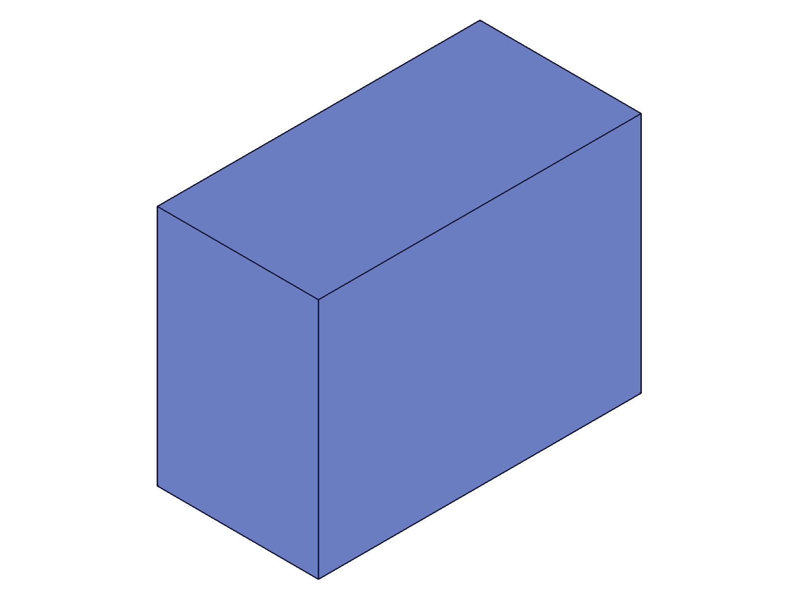
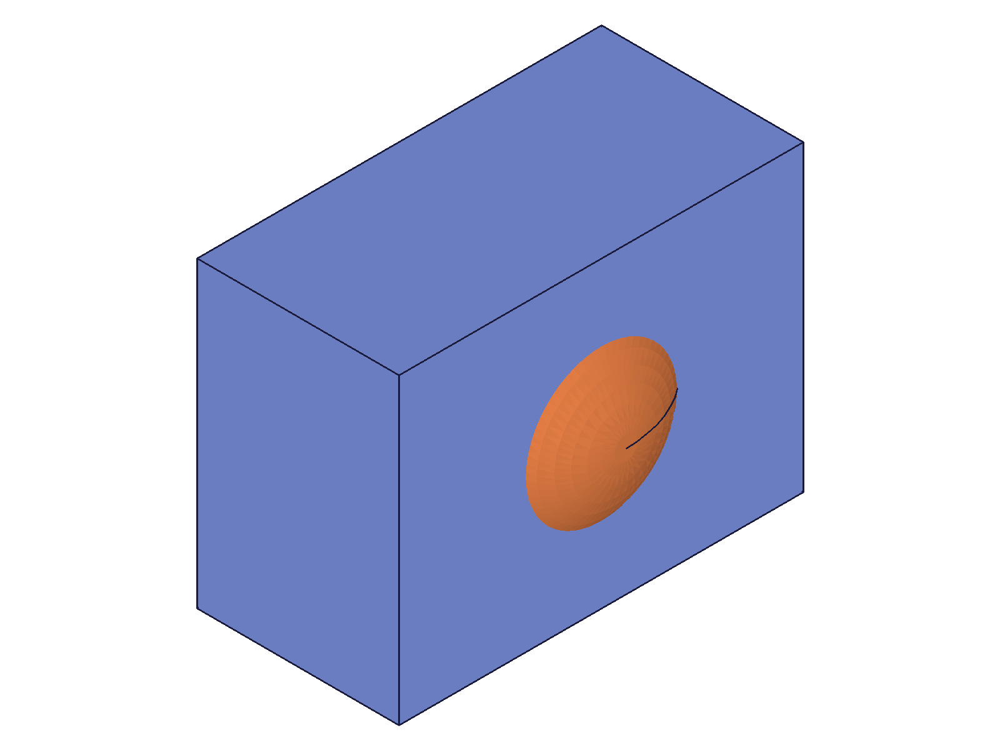

# Training: common.save

**Date:** 2026-04-15

## Goal

Testing `v1.common.save` — serialization of ClassCAD models to various formats as data strings.

**Methods to cover:**

- `save` — default (OFB format, no encoding/compression)
- `save` params: `format` (OFB, STP, STL, DXF, SCG, IWP), `encoding` (base64), `compression` (deflate)
- `save` → encoding + compression combined
- `save` OFB options: `ofb.version`, `ofb.geometry` (0, 1, 2, 3, 4)
- `save` STP options: `stp.asPart`, `stp.analytic`, `stp.version` (AP203/AP214/AP242), `stp.header`
- `save` STL options: `stl.facetingTol`, `stl.angleTol`, `stl.binary`
- `save` DXF options: `dxf.digits`, `dxf.version`
- `save` result structure: `{ success, content? }`

**Questions:**

- What does the raw OFB content look like (binary? text?)?
- Does encoding=base64 produce readable base64 strings?
- Does compression=deflate reduce size significantly?
- What happens with encoding+compression combined — order of operations?
- Do format-specific options (ofb.geometry levels, stp.version) affect content size/structure?
- Can you save an empty drawing? What comes back?
- What does STL ASCII output look like vs binary?
- Does DXF work on 3D geometry or only 2D?

---

## 01 — basic OFB save (no encoding)

Script: `scripts/01-basic-ofb-save.mjs` — ✅ OFB default produces a text-based format.

**Data:** `success: 1` (numeric, not boolean). Content is a text string, 33,246 chars. Starts with `classcad\nVersion=11\n...` header block. `maxLevel: 31` (info). Empty messages array.

**Learned:**
- `success` is numeric 1/0, not JS boolean true/false
- Raw OFB is plain text with a key=value header, human-readable
- Result keys are `['content', 'success']` — content is only present when no `file`/`url` is set

**📌 LLM doc:** `success` is numeric (1=ok, 0=fail). Raw OFB is text format.

## 02 — base64 encoding

Script: `scripts/02-base64-encoding.mjs` — ✅ base64 encoding works as expected.

**Data:** Raw OFB: 33,178 chars. Base64 OFB: 44,240 chars. Ratio: 1.333x (standard base64 expansion of ~33%). Content is clean base64 characters.

**📌 LLM doc:** Base64 expands content by ~33%. Always use for data transport.

## 03 — deflate compression (alone)

Script: `scripts/03-deflate-compression.mjs` — ⚠️ Deflate alone produces binary data, unreliable as a JSON string.

**Data:** Raw: 33,178 chars. Deflated string `.length`: 22 chars — but this is binary data measured by JS string length, which is meaningless (null bytes, encoding issues). The content preview shows garbled characters.

**Learned:** Deflate without base64 produces raw binary that cannot survive JSON string transport reliably. JS string `.length` on binary content is misleading. Not a practical option for data-string saves.

**📌 LLM doc:** Never use `compression: 'deflate'` without `encoding: 'base64'`. Binary data in JSON strings is unreliable.

## 04 — deflate + base64 combined

Script: `scripts/04-deflate-base64-combined.mjs` — ✅ The practical pipeline.

**Data:**
| Pipeline | Length (chars) |
|---|---|
| Raw OFB | 33,178 |
| Base64 only | 44,240 |
| Deflate only | 215 (unreliable) |
| Deflate + base64 | 5,664 |

Deflate+base64 = 87% reduction vs raw, 87% reduction vs base64-only. Order per docs: save = data → deflate → base64. Load = base64-decode → inflate → data.

**📌 LLM doc:** Always use `{ encoding: 'base64', compression: 'deflate' }` for data transport. ~87% compression on typical models.

## 05 — STP format variants

Script: `scripts/05-save-stp-formats.mjs` — ✅ All STP versions work.

**Data:**
| Variant | Length (chars) |
|---|---|
| AP214 (default, version=2) | 9,766 |
| AP203 (version=1) | 9,923 |
| AP242 (version=3) | 9,784 |
| asPart=TRUE | 9,584 |
| with header | 9,766 |

Content starts with `ISO-10303-21;` and `FILE_SCHEMA(('AUTOMOTIVE_DESIGN'))` for AP214. All versions succeed. Size differences are minor for a simple box.

**📌 LLM doc:** STP default is AP214. All three AP versions work. `asPart` produces slightly smaller output (no assembly structure).

## 06 — STL format (binary data corruption)

Script: `scripts/06-save-stl.mjs` — ⚠️ STL without encoding is corrupt — binary data in JSON strings.

**Data:** All four variants (binary default, ASCII, fine, coarse) show `length: 32` and identical content `"STL Binary file created by SMLib"`. This is just the readable ASCII portion of the 80-byte STL header — everything after the first null byte is lost in string transport.

**Learned:** STL is inherently binary (even "ASCII" mode appears to be binary in this context). Without base64 encoding, the content is truncated to the header text. `stl.binary: 0` did not produce ASCII STL output, possibly because ClassCAD's FALSE boolean constant is not the same as JS `0`.

**📌 LLM doc:** STL MUST use `encoding: 'base64'` for data-string saves. Without it, content is corrupted.

## 07 — DXF format (broken in CLI)

Script: `scripts/07-save-dxf.mjs` — ❌ DXF export fails in CLI environment.

**Data:** All attempts (3D geometry, 2D sketch, custom version) fail with `success: 0`, `maxLevel: 51` (ERROR). Error message: `"[Evaluation error in GeometryExportManager.StoreGeometryToStream:[CCVM::lcm: Function CADH_GetDxfTemplateFile not found]]"`

**Learned:** DXF export requires a template file that is not available in the CLI worker. This is a server configuration issue, not an API error. DXF format is unusable in this environment.

**📌 LLM doc:** DXF export is broken in classcad-cli — missing template file. Don't attempt DXF saves against CLI workers.

## 08 — STL with base64 encoding

Script: `scripts/08-stl-with-base64.mjs` — ✅ STL works correctly with base64.

**Data:**
| Variant | Length (b64 chars) |
|---|---|
| Binary + b64 | 912 |
| ASCII + b64 | 912 |
| Deflate + b64 | 228 |
| Fine faceting + b64 | 912 |

Binary and ASCII produce identical sizes (912 chars). For a box (12 triangles, all flat faces), faceting parameters have no effect — faces are already flat. Deflate+b64 compresses to 228 chars.

**📌 LLM doc:** STL faceting params (`facetingTol`, `angleTol`) only affect curved surfaces. Flat-faced geometry (boxes) is unaffected. `stl.binary` flag may not work for data-string mode.

## 09 — OFB geometry levels

Script: `scripts/09-ofb-geometry-levels.mjs` — ⚠️ All 5 geometry levels produce identical output in CLI.

**Data:** All levels (0-4) produce exactly 44,232 chars (base64). No difference in content size.

**Learned:** In CLI mode (no visualization context), the `ofb.geometry` parameter has no observable effect. The server likely doesn't generate graphics data in CLI mode, so levels 3/4 (which include graphics) are indistinguishable from levels 0-2.

**📌 LLM doc:** `ofb.geometry` has no effect in CLI mode. All levels produce identical output.

## 10 — empty drawing save

Script: `scripts/10-empty-drawing.mjs` — ✅ Expected: save fails on empty drawing.

**Data:** All formats (OFB, STP, STL) fail with `success: 0`, `maxLevel: 51`. Error messages: `"No root product could be found."` and `"There is nothing to be stored."` Content length is 0.

**Learned:** A `part.create` call is the minimum requirement before saving. An empty drawing (no part) cannot be saved.

**📌 LLM doc:** Cannot save empty drawings. Must have at least `part.create` called. Error: "No root product could be found."

## 11 — bare part save (no geometry)

Script: `scripts/11-bare-part-save.mjs` — ✅ A bare part (no geometry) saves successfully in OFB and STP.

**Data:**
| Format | Success | Length (b64) |
|---|---|---|
| OFB | 1 | 12,956 |
| STP | 1 | 1,794 |
| STL | 1 | 0 |

OFB includes the parametric structure even with no geometry. STP produces a minimal valid STEP file. STL succeeds but with empty content (0 chars) — no triangles to tessellate.

**📌 LLM doc:** Bare part (no geometry) saves successfully in OFB/STP. STL succeeds with empty content. Minimum: `part.create`.

## 12 — SCG and IWP formats

Script: `scripts/12-scg-iwp-formats.mjs` — ✅ Both work.

**Data:**
| Format | Length (b64) |
|---|---|
| SCG | 19,464 |
| IWP ASCII | 48,532 |
| IWP Binary | 22,344 |

SCG (scene graph) is mid-size. IWP is an SMLib internal format — ASCII mode is largest overall, binary mode about half. All succeed with maxLevel=31.

**📌 LLM doc:** SCG and IWP are niche formats. IWP binary mode (`iwp.binary: 1`) halves the content size vs ASCII.

## 13 — STP analytic option

Script: `scripts/13-stp-analytic.mjs` — ⚠️ analytic=1 works but generates error-level messages.

**Data:** analytic=0 (default): 9,778 chars. analytic=1: 8,552 chars (smaller). But analytic=1 has `maxLevel: 51` (ERROR level) despite producing valid content and `success: 1`.

**Learned:** `stp.analytic` converts B-spline geometry to analytic forms (planes, cylinders, etc.). Produces smaller STEP files. But the conversion generates error-level server messages even when successful. The errors don't prevent output.

**📌 LLM doc:** `stp.analytic: 1` produces smaller STEP files but triggers error-level messages (maxLevel=51). Check `success` field, not maxLevel, for actual failure.

## 14 — OFB save → clear → load roundtrip

Script: `scripts/14-save-load-roundtrip.mjs` — ✅ Full roundtrip works perfectly.

|  |  |
| --- | --- |

**Data:** Save: deflate+b64, 5,716 chars. Clear: maxLevel=31. Load: `{id: 4}` (same root part ID). Load maxLevel=31, no messages. Snapshots identical before/after.

**📌 LLM doc:** OFB roundtrip (save → clear → load) preserves geometry and structure perfectly. Use `{ format: 'OFB', encoding: 'base64', compression: 'deflate' }` for the roundtrip pipeline.

## 15 — multi-body save and roundtrip

Script: `scripts/15-multi-body-save.mjs` — ✅ Multi-body save and roundtrip work. (Note: `solid.cylinder` does not accept `position` param — returned null.)

|  |  |
| --- | --- |

**Data:** Box (61) + sphere (63) saved. OFB: 40,816 chars, STP: 15,088 chars, STL: 239,848 chars (b64). STL is huge for sphere (many triangles). Roundtrip load returns `{id: 4}`. Snapshots identical before/after.

## 16 — STP header customization

Script: `scripts/16-stp-header-content.mjs` — ⚠️ STP `header` option has no observable effect.

**Data:** Default and custom headers are identical. The FILE_NAME field uses the part name ('HeaderTest'), not the custom `stp.header.filename.name`. Custom `organization` field is also absent. `custom name present: false`, `custom org present: false`.

**Learned:** `stp.header` options are either not implemented for data-string output, or require file-based output to take effect.

**📌 LLM doc:** `stp.header` options do not affect data-string output. May only work with `file`-based saves.

## 17 — feature-based part save (parametric preservation)

Script: `scripts/17-feature-part-save.mjs` — ✅ OFB preserves parametric data through roundtrip.

**Data:** Feature part with expressions (L=80, W=60, H=40) driving a box feature. OFB: 46,532 chars (b64), STP: 9,612 chars. After OFB roundtrip, `getExpression('L')` returns `{expression:"", value:80}` — value preserved. Expression formula is empty string because the original was a literal number (80), not a formula.

**Learned:** OFB preserves the full parametric model including expressions. STP only preserves geometry. OFB is ~4.8x larger than STP for the same geometry because it includes feature history.

**📌 LLM doc:** Use OFB to preserve parametric data (expressions, features). STP/STL/IWP are geometry-only — parametric info is lost.

## 18 — OFB version parameter

Script: `scripts/18-ofb-version.mjs` — OFB version parameter has no observable effect.

**Data:** Versions -2, -1, 0 all produce 44,252 chars. OFB header shows `Version=11` regardless. The `version` option may control internal binary layout but doesn't affect text-mode output size or header.

## 19 — STP save → clear → load roundtrip

Script: `scripts/19-stp-roundtrip.mjs` — ✅ STP roundtrip works.

|  |  |
| --- | --- |

**Data:** STP (b64): 13,044 chars. Load returns `{id: 11}` (ID changes — differs from original 4). Snapshots identical.

**Learned:** IDs are not preserved across STP roundtrips. OFB roundtrips appear to preserve the root ID (got 4 both times).

**📌 LLM doc:** STP roundtrip changes IDs. OFB preserves root ID. Never hardcode IDs — always use the `id` from the load result.

## 20 — format size comparison (all formats, base64, same box)

Script: `scripts/20-format-size-comparison.mjs` — ✅ Comprehensive size comparison.

**Data:**

| Format | Length (b64 chars) |
|---|---|
| OFB (raw b64) | 44,256 |
| OFB (deflate+b64) | 5,668 |
| SCG (b64) | 19,464 |
| STP (b64) | 13,040 |
| STL (b64) | 912 |
| IWP ASCII (b64) | 48,652 |
| IWP Binary (b64) | 22,412 |

**Learned:** OFB is largest (includes parametric data). STL is smallest (just mesh). OFB+deflate is the best balance of completeness and compactness for data transport. STP is the standard exchange format, mid-size.

**📌 LLM doc:** For data transport, use `OFB + deflate + base64` (~87% smaller than raw OFB). For interchange with other CAD tools, use STP (AP214 default).
