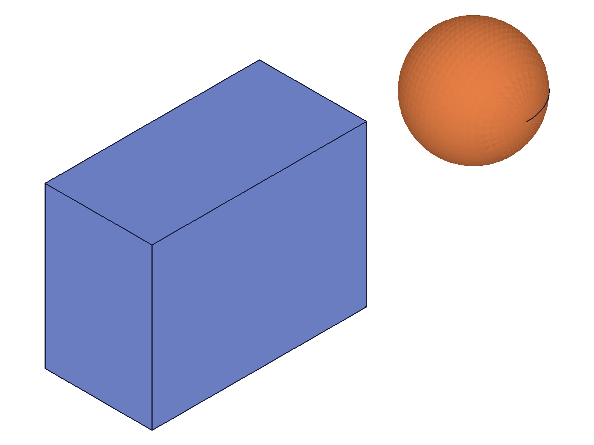
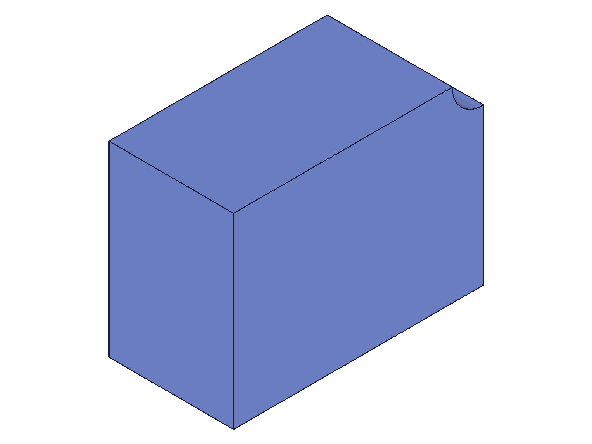

# Training: common.load

**Date:** 2026-04-15

## Goal

Testing `v1.common.load` — loading models from data strings and files, understanding all parameters, format interplay, and edge cases.

**Methods to cover:**

- `load` with `data` param — OFB format, base64 encoding, deflate compression
- `load` with `doClear` param — auto-clear before loading
- `load` with `format` — OFB, STP, IWP (and attempting SCG)
- `load` with `encoding` and `compression` — base64, deflate, and combinations
- `load` with `ofb.geometry` option — levels 2, 3, 4
- `load` with `stp.asPart` option — flattening assembly structure
- `load` with `ident` param — custom identifier for loaded root product
- `load` with `file` param — disk-based loading, auto-format detection
- `load` result structure — `{ id }` returned, ID preservation across formats

**Questions:**

- Does OFB roundtrip truly preserve the root part ID? **YES**
- Does STP roundtrip change IDs as save.md claims? **YES** (4→11)
- What happens if you load into a non-cleared drawing without `doClear`? **Error: "already a model which must be removed first"**
- What does `ofb.geometry` do on load (2/3/4)? **No observable difference in CLI mode**
- Does `ident` actually rename the loaded product? **No observable effect on OFB**
- What happens loading corrupted/empty data? **maxLevel=51, descriptive error messages**
- Does the drawing need `recalc` after load? **No — geometry renders immediately**
- Can you load, modify, then save again? **YES — full roundtrip works**

---

## 01 — basic OFB roundtrip

Script: `scripts/01-basic-ofb-roundtrip.mjs` — ✅ OFB round-trip preserves part ID.

|  |  |
|---|---|

**Data:** Save produced 5712 b64 chars (deflate+base64). Load returned `{ id: 4 }` — same as the original partId=4. maxLevel=31, no messages.

**Learned:** OFB format preserves the root part ID through save/load. `result.id` gives you the loaded model's root product ID.
**📌 LLM doc:** OFB roundtrip preserves IDs. Always use `result.id` from load.

---

## 02 — load without clear

Script: `scripts/02-load-without-clear.mjs` — ❌ Loading into a non-cleared drawing fails.

**Data:** `result: null`, maxLevel=51, error message: `"There is already a model which must be removed first."`. No snapshot (nothing changed).

**Learned:** Must `clear()` before `load()`, or use `doClear: 1`.
**📌 LLM doc:** Document the clear requirement and doClear alternative.

---

## 03 — doClear parameter

Script: `scripts/03-doclear-param.mjs` — ✅ `doClear: 1` auto-clears before loading.

|  |
|---|

**Data:** Load returned `{ id: 4 }`, maxLevel=31. No manual `clear()` needed.

**Learned:** `doClear: 1` (TRUE) is a convenience shortcut — clears + loads in one call.
**📌 LLM doc:** Document `doClear` as the preferred approach for one-step load.

---

## 04 — STP roundtrip

Script: `scripts/04-stp-roundtrip.mjs` — ✅ STP roundtrip works but changes IDs.

|  |
|---|

**Data:** Original partId=4, loaded id=11. IDs do NOT match. STP content was 13040 b64 chars. maxLevel=31.

**Learned:** Confirms save.md claim — STP roundtrip changes all IDs. Always use `loadResult.result.id` as the new root.
**📌 LLM doc:** STP changes IDs. Never hardcode IDs across STP save/load.

---

## 05 — STP asPart option

Script: `scripts/05-stp-aspart.mjs` — ⚠️ `stp.asPart: 1` loads but with error-level messages.

**Data:** With `asPart: 1`: result `{ id: 6 }`, maxLevel=51 with error `"CreateNamedPoint not found"`. Without asPart: result `{ id: 12 }`, maxLevel=31 (clean). Structure files dumped (21-22KB each).

**Learned:** `stp.asPart: 1` on load triggers an evaluation error but still produces usable geometry. The error appears harmless. Default STP load (no asPart) is cleaner.
**📌 LLM doc:** Document `stp.asPart` error on load — maxLevel=51 but geometry loads fine.

---

## 06 — ident parameter

Script: `scripts/06-ident-param.mjs` — No observable effect.

**Data:** Load returned `{ id: 4 }`, maxLevel=31. Structure tree still shows root product named "IdentTest" (the original name), not "MyCustomIdent". The `ident` parameter had no visible impact on the OFB load.

**Learned:** `ident` param does not rename the loaded product (at least for OFB). May only apply to non-OFB imports or have an internal-only effect not reflected in the structure tree name.
**📌 LLM doc:** Document `ident` as having no observable effect in testing.

---

## 07 — ofb.geometry option

Script: `scripts/07-ofb-geometry-option.mjs` — No observable difference between levels.

**Data:** All three levels (geometry=2, 3, 4) produced `{ id: 4 }`, maxLevel=31. Identical results.

**Learned:** Like the save-side `ofb.geometry`, the load-side option has no observable effect in CLI mode (no graphics context). All levels produce the same loaded model.
**📌 LLM doc:** `ofb.geometry` on load: no observable CLI effect. Default (2) is fine.

---

## 08 — encoding combinations

Script: `scripts/08-encoding-combos.mjs` — ✅ All encoding combos work for OFB.

**Data:** Raw OFB: 33219 chars → loaded OK. Base64: 44292 chars → loaded OK. Deflate+base64: 5664 chars → loaded OK. All returned `{ id: 4 }`, maxLevel=31.

**Learned:** Raw OFB (no encoding, no compression) works for data-string load because OFB is text-based. This differs from STL which requires base64 for data transport. Encoding/compression params on load must match what was used on save.
**📌 LLM doc:** Raw OFB works for data load (text-based format). Must match save encoding.

---

## 09 — corrupt data

Script: `scripts/09-corrupt-data.mjs` — ✅ Proper error handling for all cases.

**Data:**
- Empty data: maxLevel=51, `"Import has to contain a CC_Product."` + `"Nothing could be loaded!"`
- Garbage data: Same two errors
- Garbage base64: Same two errors
- No source (no data/file/url): maxLevel=51, code=1004, `"Either data, file or url must be provided to load content from."`

**Learned:** Load fails gracefully with descriptive error messages. The "no source" case even has a unique error code (1004). Always check `maxLevel > 31` to detect load failures.
**📌 LLM doc:** Document error messages and detection pattern.

---

## 10 — recalc after load

Script: `scripts/10-recalc-after-load.mjs` — Geometry renders immediately after load.

|  |  |
|---|---|

**Data:** After load: graphic not null (has meshes but 0 vertices), structure present. After recalc: graphic is null, result=null, maxLevel=31. Snapshots show identical box in both states — geometry is renderable immediately.

**Learned:** `recalc()` after load is not needed for basic usage. The model is ready immediately. The graphic vertex count of 0 after load is a harness artifact — the renderer still finds geometry to render. Recalc may be needed for complex parametric models that reference expressions.
**📌 LLM doc:** No recalc needed after basic load. May help for complex parametric models.

---

## 11 — full roundtrip with modification

Script: `scripts/11-full-roundtrip-modify.mjs` — ✅ Can modify loaded model and save again.

|  |  |  |
|---|---|---|

**Data:** OFB load preserved partId=4 and eifId=54. Added sphere to eifId=54 → success (sphereId=65, maxLevel=31). Second save: 7588 chars vs first save 5720 chars (larger due to added sphere).

**Learned:** OFB roundtrip preserves ALL IDs, including entity injection IDs. You can continue adding geometry using the same EIF ID after loading. Full create→save→load→modify→save pipeline works.
**📌 LLM doc:** OFB preserves entity injection IDs — can modify loaded models seamlessly.

---

## 12 — IWP roundtrip

Script: `scripts/12-iwp-roundtrip.mjs` — ✅ IWP roundtrip works, IDs change.

|  |
|---|

**Data:** Save: 48532 b64 chars. Load: `{ id: 6 }` (original was 4), maxLevel=31, no messages.

**Learned:** IWP loads cleanly. Like STP, IDs change (4→6). IWP is significantly larger than OFB for the same geometry.
**📌 LLM doc:** IWP loads fine. IDs change like STP.

---

## 13 — mismatched format

Script: `scripts/13-mismatched-format.mjs` — ❌ Mismatched format is properly rejected.

**Data:** OFB data loaded as STP: `result: null`, maxLevel=51, `"No product could be loaded, expected a CC_Product"`.

**Learned:** Format mismatch is caught. The error message is somewhat generic — doesn't explicitly say "wrong format", just "no product could be loaded".
**📌 LLM doc:** Mismatched format produces a generic error, not a format-specific one.

---

## 14 — complex model roundtrip

Script: `scripts/14-complex-model-roundtrip.mjs` — ✅ Expressions and booleans survive OFB roundtrip.

|  |  |
|---|---|

**Data:** Model with expressions (W=80, H=40) and boolean subtraction (box - cylinder). After load: partId preserved (4→4). Expressions verified: W={expression:"", value:80}, H={expression:"", value:40}. Boolean geometry visible in snapshot (cylindrical hole present).

**Learned:** OFB preserves the full parametric model: expressions, feature tree, boolean operations. Expression values are correct. The `expression` field is empty string for simple numeric values (expected — no formula).
**📌 LLM doc:** OFB preserves expressions and boolean history.

---

## 15 — no format specified (data load)

Script: `scripts/15-no-format-specified.mjs` — ✅ OFB auto-detected from data content.

**Data:** Load without `format` param, only `encoding` and `compression` set. Result: `{ id: 4 }`, maxLevel=31, no messages.

**Learned:** The server can auto-detect OFB format from the data content even without the `format` parameter. Docs say format is optional for file loads (inferred from extension), but it also works for data loads (at least for OFB).
**📌 LLM doc:** Format auto-detection works for OFB data strings. Still best practice to specify it explicitly.

---

## 16 — file-based load

Script: `scripts/16-file-based-load.mjs` — ✅ File load works with auto-format detection.

|  |
|---|

**Data:** Save to `/tmp/classcad-load-test.ofb` → `{ success: 1 }` (no content field). Load from file → `{ id: 4 }`, maxLevel=31. Auto-format load (no format param, .ofb extension) → same result.

**Learned:** File-based loading works. The `file` param takes the absolute path. Format is auto-detected from the file extension. When saving to file, `result.content` is absent (only present for data-string saves).
**📌 LLM doc:** File load with auto-format from extension. Path must be accessible to ClassCAD process.

---

## 17 — SCG roundtrip (FAILS)

Script: `scripts/17-scg-roundtrip.mjs` — ❌ **SCG format cannot be loaded.**

**Data:** SCG save: 19480 b64 chars (success). SCG load: `result: null`, maxLevel=51, code=1013, `"The provided value for parameter \"format\" is not valid. Possible values are: [\"OFB\",\"STP\",\"IWP\"]"`.

**Learned:** `common.load` only accepts 3 formats: **OFB, STP, IWP**. Even though `common.save` supports OFB, SCG, STP, IWP, STL, DXF — only 3 of these can be loaded. SCG, STL, and DXF are **save-only** formats.
**📌 LLM doc:** CRITICAL — only OFB/STP/IWP can be loaded. SCG/STL/DXF are export-only.

---

## 18 — STP file load with auto-format

Script: `scripts/18-stp-file-load.mjs` — ✅ File extension detected for STP.

|  |
|---|

**Data:** Save to `/tmp/classcad-load-test.stp`. Load from file (no format param) → `{ id: 11 }`, maxLevel=31. STP IDs changed (original 4→11), consistent with script 04.

**Learned:** Auto-format detection works for .stp extension too.

---

## Summary

### ID Preservation by Format

| Format | IDs Preserved? | Notes |
|---|---|---|
| OFB | ✅ Yes | All IDs preserved — can modify loaded model using original IDs |
| STP | ❌ No | IDs change (4→11). Must use `result.id` from load |
| IWP | ❌ No | IDs change (4→6). Must use `result.id` from load |

### Load Format Support

| Format | Can Save | Can Load | Notes |
|---|---|---|---|
| OFB | ✅ | ✅ | Native format, full fidelity, ID preservation |
| STP | ✅ | ✅ | Standard CAD interchange. `stp.asPart` available but produces error-level messages |
| IWP | ✅ | ✅ | SMLib internal format. Clean load |
| SCG | ✅ | ❌ | Save-only. Load returns code=1013 |
| STL | ✅ | ❌ | Save-only (mesh format) |
| DXF | ❌ (broken) | ❌ | Broken in CLI |

### Key Parameters

- `doClear: 1` — auto-clear before load (recommended over manual clear+load)
- `format` — `'OFB'`, `'STP'`, `'IWP'` only. Auto-detected from file extension or data content
- `encoding`/`compression` — must match what was used on save
- `ident` — no observable effect in testing
- `ofb.geometry` — no observable CLI effect
- `stp.asPart: 1` — loads but generates error-level messages (harmless)
