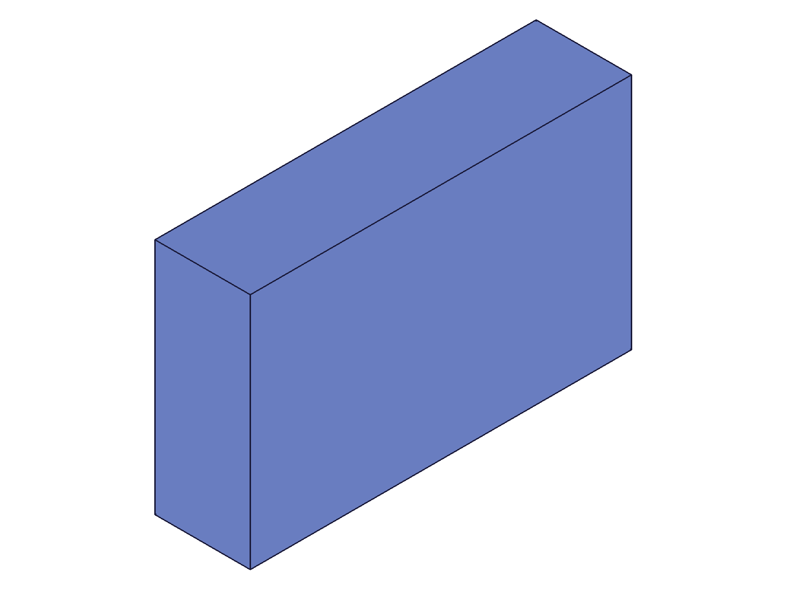
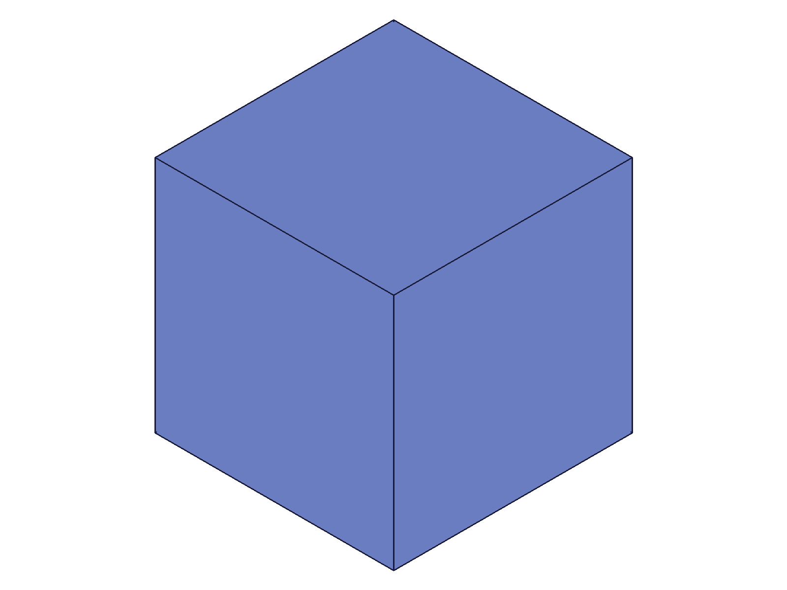

# Training: common.clear

**Date:** 2026-04-15

## Goal

Testing `v1.common.clear` — deletes all objects in the current drawing.

**Methods to cover:**

- `clear({})` — basic call, no params
- `clear()` — no-arg call
- `clear({ keepIds: [...] })` — selective preservation of specific objects

**Questions:**

- Does `clear({})` truly remove everything? What does the drawing look like after?
- Does calling `clear` return any messages or just VOID?
- Does `keepIds` work? Can you keep a part? A feature? A solid? A sketch?
- What happens if you pass invalid IDs in `keepIds`?
- What happens if you call `clear` on an already-empty drawing?
- Can you create new objects after `clear`? Is it equivalent to a fresh state?
- Does `clear` reset the ID counter or do new IDs continue from where they left off?
- How does `clear` interact with `load`? (Already partially covered by save/load session)

---

## 01 — basic clear

Script: `scripts/01-basic-clear.mjs` — ✅ as documented. Creates part+eif+box, calls `clear({})`.

|  |
|---|

**Data:** result=null (VOID), maxLevel=31 (info), messages=[]. No "after" snapshot — drawing is empty. See `files/01-basic-clear-clear-response.json`.

**📌 LLM doc:** Basic behavior: returns VOID, maxLevel 31, no messages. Empty drawing produces no snapshot.

---

## 02 — create after clear

Script: `scripts/02-create-after-clear.mjs` — ✅ clear resets state completely.

|  |
|---|

**Data:** Before clear: partId=4, eifId=54, boxId=61. After clear+create: partId=4, eifId=54, boxId=61. **IDs are reused** — counter resets to initial values.

**📌 LLM doc:** IDs reset after clear. `part.create` after `clear` returns the same ID sequence (4, 54, 61...) as a fresh session.

---

## 03 — clear on empty drawing

Script: `scripts/03-clear-empty.mjs` — ✅ safe. No errors on empty or double clear.

**Data:** Clear on empty drawing: result=null, maxLevel=31. Double clear: same. partId after: 4.

**📌 LLM doc:** Clearing an empty drawing is safe. Double clear is safe.

---

## 04 — keepIds=[partId] (initial test, timed out)

Script: `scripts/04-keepIds-part.mjs` — ⚠️ Timed out after clear succeeded.

|  |
|---|

**Data:** `clear({ keepIds: [partId] })` returned result=null, maxLevel=31. Then the script timed out during snapshot. Investigation showed: the PNG was rendered successfully (identical to "before"), but STEP/OFB export on the partially-cleared state hung the server (100% CPU).

**📌 LLM doc:** After `clear({ keepIds })`, avoid STEP/OFB export until new valid geometry is created. PNG rendering works fine.

---

## 04b — keepIds=[partId] safe test

Script: `scripts/04b-keepIds-safe.mjs` — ✅ keepIds preserves the part.

**Data:** After `clear({ keepIds: [partId] })`: server responsive, `getExpression({ id: partId, name: 'CC_BasePart' })` returns `{ expression: '', value: null }` — part exists.

---

## 06 — keepIds: what survives

Script: `scripts/06-keepIds-what-survives.mjs` — ✅ key findings about what keepIds preserves.

**Data:**
- Expression "W" (value=42) **survives** — `getExpression` returns `{ expression: '', value: 42 }`
- Old eifId (54) is **gone** — `solid.copy` from it fails with maxLevel=51
- New eifId2 (65) created successfully in the kept part
- New boxId2 (72) created in new eif

**📌 LLM doc:** `keepIds: [partId]` preserves the part container AND its expressions, but NOT child features (entity injections, work geometry). New features can be created in the kept part. IDs continue from the highest surviving ID (65, 72...), NOT reset.

---

## 07 — keepIds with invalid IDs

Script: `scripts/07-keepIds-invalid.mjs` — ❌ invalid keepIds aborts the entire clear.

**Data:** `clear({ keepIds: [999999] })`: maxLevel=51, messages include code 1006 "An element of parameter keepIds has an invalid id!" and code 0 WARNING "ToId()/TOID() didn't get an existing or valid id."

Subsequent `part.create` returns null — drawing was NOT cleared.

**📌 LLM doc:** Invalid keepIds causes clear to ABORT entirely. Nothing is cleared. The error is atomic — validate IDs before calling.

---

## 08 — keepIds with solid ID

Script: `scripts/08-keepIds-solid.mjs` — ⚠️ accepted silently but solid is effectively lost.

**Data:** `clear({ keepIds: [boxId] })`: maxLevel=31, no error. But `part.create` returns 4 (IDs reset) — the solid wasn't meaningfully kept.

---

## 09 — keepIds with eif ID only

Script: `scripts/09-keepIds-eif.mjs` — ⚠️ eif becomes orphan.

**Data:** `clear({ keepIds: [eifId] })`: accepted, but creating a box in old eifId fails (maxLevel=51). Without parent part, the eif is unusable.

---

## 10 — keepIds with part + eif

Script: `scripts/10-keepIds-multiple.mjs` — ✅ containers survive, can create new geometry.

**Data:** `clear({ keepIds: [partId, eifId] })`: both survive. New box in old eifId works (result=67). Old boxId (61) copy fails (maxLevel=51) — old solids are gone.

**📌 LLM doc:** Must keep the full container hierarchy (part + eif) for the eif to remain usable. Solids within the eif are still deleted.

---

## 11 — keepIds full hierarchy

Script: `scripts/11-keepIds-full-hierarchy.mjs` — ❌ even keeping [partId, eifId, boxId], solid operations on boxId fail.

**Data:** Copy of kept boxId: maxLevel=51. Copy of dropped cylId: maxLevel=51. Snapshot timed out (STEP/OFB export hang on partial state).

---

## 12b — keepIds full hierarchy, no snapshot

Script: `scripts/12b-keepIds-no-snapshot.mjs` — ✅ confirms solid internals broken.

**Data:** `solid.translation` on kept boxId: returns result=61 but maxLevel=51, error "An element of parameter ids has an invalid id!" — the solid's internal geometry references are gone. New box in kept eif: result=64, maxLevel=31 — new geometry works fine.

**📌 LLM doc:** Solid IDs in keepIds are accepted without error, but the solid's internal geometry (B-rep, mesh) is deleted. The ID exists as a shell but is unusable for any solid operation.

---

## 13 — clear() no args

Script: `scripts/13-no-arg-clear.mjs` — ✅ identical to `clear({})`.

**Data:** result=null, maxLevel=31. partId after: 4.

---

## 14 — clear keepIds=[]

Script: `scripts/14-keepIds-empty-array.mjs` — ✅ identical to full clear.

**Data:** result=null, maxLevel=31. partId after: 4.

---

## 15 — clear after load

Script: `scripts/15-clear-after-load.mjs` — ✅ save/load/clear cycle works.

**Data:** Save → load → clear → part.create works. IDs reset (partId=4, eifId=54, boxId=61).

---

## 16 — invalid keepIds recovery

Script: `scripts/16-invalid-keepIds-recovery.mjs` — ✅ key finding: aborted clear is recoverable.

**Data:** `clear({ keepIds: [999999] })`: maxLevel=51. `part.create` fails: code 1200 "There is already a root assembly or part which must be removed first." — confirms clear was ABORTED. Recovery: `clear({})` succeeds, then `part.create` returns 4.

**📌 LLM doc:** After a failed clear (invalid keepIds), call `clear({})` (no keepIds) to recover.

---

## 17 — mixed valid+invalid keepIds

Script: `scripts/17-mixed-keepIds.mjs` — ❌ any invalid ID aborts entire clear.

**Data:** `clear({ keepIds: [partId, 999999] })`: maxLevel=51, same error as pure invalid. Drawing untouched — `part.create` fails (root already exists), old eif still usable (new box succeeds).

**📌 LLM doc:** Clear with keepIds is ATOMIC. If any single ID is invalid, nothing is cleared.

---

## 18 — keepIds + recalc

Script: `scripts/18-keepIds-recalc.mjs` — ✅ recalc is safe after keepIds clear.

**Data:** `recalc({})` after `clear({ keepIds: [partId] })`: result=null, maxLevel=31, no hang.

---

## 19 — keepIds + new geometry + snapshot

Script: `scripts/19-keepIds-new-geo-snapshot.mjs` — ✅ snapshot works after adding new valid geometry.

|  |
|---|

**Data:** After keepIds clear (part+eif), new box (ID 64) created, snapshot succeeds.

---

## 20 — empty part snapshot (control)

Script: `scripts/20-empty-part-snapshot.mjs` — ✅ snapshot on empty part works fine.

---

## 21 — keepIds + snapshot retest (fresh worker)

Script: `scripts/21-keepIds-snapshot-retest.mjs` — ✅ snapshot after keepIds works on fresh worker.

|  |
|---|

**Data:** Snapshot succeeds. The earlier timeout in script 04 was caused by STEP/OFB export, not PNG rendering.

---

## Summary of Findings

1. **Basic behavior:** `clear()`, `clear({})`, `clear({ keepIds: [] })` are all equivalent — delete everything, return VOID, maxLevel 31
2. **ID reset:** After full clear, IDs reset to initial values (partId=4). After keepIds clear, IDs continue from highest surviving ID
3. **Safe to call on empty:** No error on empty drawing, double clear is safe
4. **keepIds preserves containers, not geometry:**
   - Part → preserved (including expressions)
   - Entity injection → preserved only if parent part also kept
   - Solids → ID accepted but internal geometry broken (unusable)
5. **keepIds is atomic:** Any invalid ID aborts the entire operation. Nothing is cleared
6. **Recovery from aborted clear:** Call `clear({})` with no keepIds
7. **STEP/OFB export hazard:** After keepIds clear, STEP/OFB export may hang on partial state. PNG rendering works. Safe once new valid geometry is added
8. **recalc is safe:** After any clear variant, `recalc({})` works normally
