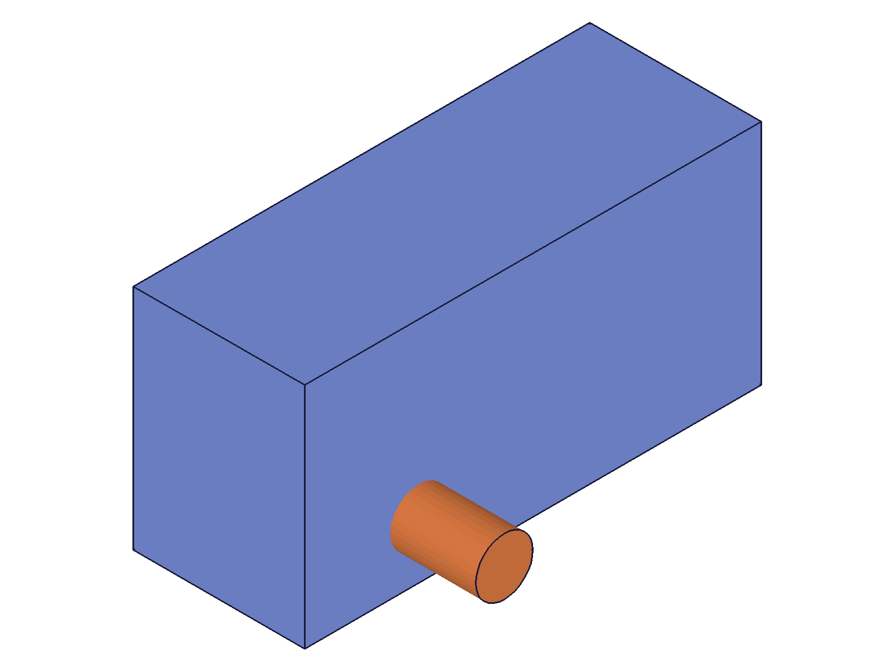
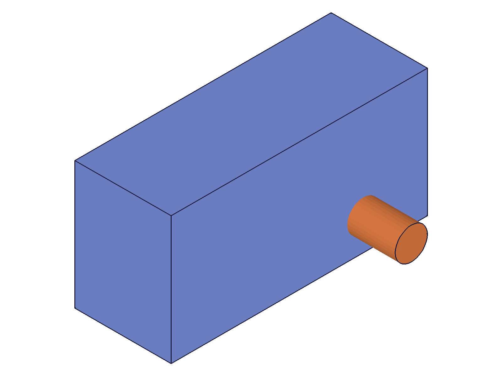

# Training: solid.mirror

**Date:** 2026-04-15

## Goal

Testing `v1.solid.mirror` — mirrors a solid at a defined plane.

**Methods to cover:**

- `mirror` — basic mirroring across XY, XZ, YZ planes
- `mirror` params: id (EIF ID), target (solid ID), originPos, normal
- Mirror across an arbitrary plane (non-axis-aligned)
- Mirror at offset plane (originPos != origin)
- Mirror preserves/creates a new body vs. modifies in place?
- Mirror on compound (post-boolean) solids
- Mirror with different solid types (box, cylinder, sphere)

**Questions:**

- Does mirror create a new solid or modify the target in place?
- What does it return? The original ID or a new one?
- Does mirror flip normals (like negative scale)?
- What happens if originPos is at the body center? (should produce same body?)
- What happens with a zero normal vector?
- Does mirror work on consumed tool solids? (expect error)
- Are there any silent failures or edge cases?

---

## 01–04 — Basic mirror setup and graphic structure discovery

Scripts: `scripts/01-basic-yz-plane.mjs` through `scripts/04-dump-graphic-structure.mjs`

Scripts 01–03 were exploratory — establishing the graphic data structure. The graphic has `containers[].properties.min/max` for bounding boxes and `containers[].meshes[].vertices/normals` for mesh data. Script 04 confirmed the full structure: `{ containers: [{ id, owner, type, properties: { min, max, ... }, meshes: [...], edges: [...], vertices: [...] }] }`.

**Key finding:** `mirror` returns the **same solid ID** (in-place modification). maxLevel=31, empty messages on success.

## 05 — YZ plane mirror (verified)

Script: `scripts/05-mirror-bbox-verify.mjs` — ✅ Box at translation [20,10,0] (80x40x30), mirrored across YZ plane (normal=[1,0,0] at origin).

|  |  |
|---|---|

**Data:** Before: min=[-20,-10,-15] max=[60,30,15]. After: min=[-60,-10,-15] max=[20,30,15]. X coords negated, Y/Z unchanged. Reference cylinder confirms the box moved relative to fixed geometry.

**📌 LLM doc:** Mirror modifies in place, returns same ID. Bounding box confirms correct X-reflection.

## 06 — XZ plane mirror

Script: `scripts/06-mirror-xz-plane.mjs` — ✅ Mirror across XZ plane (normal=[0,1,0]).

**Data:** Before Y:[10,50]. After Y:[-50,-10]. X,Z unchanged. As expected.

## 07 — XY plane mirror

Script: `scripts/07-mirror-xy-plane.mjs` — ✅ Mirror across XY plane (normal=[0,0,1]).

**Data:** Before Z:[10,40]. After Z:[-40,-10]. X,Y unchanged. All three axis-aligned planes confirmed correct.

**📌 LLM doc:** All three axis-aligned plane mirrors work as expected.

## 08 — Offset plane mirror

Script: `scripts/08-mirror-offset-plane.mjs` — ✅ Mirror across plane at X=50 (originPos=[50,0,0], normal=[1,0,0]).

**Data:** Box at origin (X:[-20,20]) mirrored to X:[80,120]. Formula: point at X=-20 reflects to 50+(50-(-20))=120, X=20 reflects to 50+(50-20)=80. Confirmed.

**📌 LLM doc:** `originPos` defines the plane position, not just a direction from origin. The plane passes through `originPos` with the given `normal`.

## 09 — Diagonal plane mirror

Script: `scripts/09-mirror-diagonal-plane.mjs` — ✅ Mirror across 45° plane (normal=[1,1,0]).

**Data:** Box at X:[10,70] Y:[-15,15]. After: X:[-15,15] Y:[-70,-10]. Reflection across [1,1,0] plane effectively swaps and negates X↔Y coordinates. Mathematically correct (reflection formula p'=p-2(p·n̂)n̂).

**📌 LLM doc:** Arbitrary non-axis-aligned planes work correctly.

## 10 — Double mirror (identity)

Script: `scripts/10-double-mirror.mjs` — ✅ Two mirrors across the same plane restore original position exactly.

**Data:** Original: min=[-20,-10,-10] max=[60,30,20]. After 1st: min=[-60,-10,-10] max=[20,30,20]. After 2nd: identical to original. `restored: true`.

**📌 LLM doc:** Mirror is its own inverse — double mirror = identity.

## 11 — Mirror cylinder

Script: `scripts/11-mirror-cylinder.mjs` — ✅ Cylinder at X:[25,55] mirrored to X:[-55,-25].

## 12 — Mirror compound solid

Script: `scripts/12-mirror-compound.mjs` — ✅ L-shaped compound (from boolean union) mirrors correctly.

**Data:** Compound at X:[10,90] (after translate +50) mirrored to X:[-90,-10]. Works on post-boolean bodies.

**📌 LLM doc:** Works on compound (post-boolean) solids — mirrors the entire compound shape.

## 13 — Error cases

Script: `scripts/13-error-cases.mjs` — All 6 error cases return maxLevel=51.

| Error case | Code | Message |
|---|---|---|
| Part ID instead of EIF ID | 1001 | `"The parameter \"id\" has a wrong id type!"` |
| Missing target | 1004 | `"The parameter \"target\" must be provided!"` |
| Missing originPos | 1004 | `"The parameter \"originPos\" must be provided!"` |
| Missing normal | 1004 | `"The parameter \"normal\" must be provided!"` |
| Consumed solid | 1006 | `"An element of parameter \"target\" has an invalid id!"` |
| Missing id | 1004 | `"The parameter \"id\" must be provided!"` |

All error codes consistent with other `solid.*` transforms. Consumed solids get warning (level 41) + error (level 51).

**📌 LLM doc:** All four parameters are required. Error codes match other transforms (1001 wrong type, 1004 missing, 1006 invalid).

## 14 — Zero normal vector

Script: `scripts/14-zero-normal.mjs` — ✅ Error: `"Invalid mirror normal!"` from kernel (code 0, level 51).

**Data:** result=null, maxLevel=51. The error comes from the geometry kernel (`CADH_CADMirrorEntitys` in `Transformation.cpp`).

**📌 LLM doc:** Zero normal vector produces a kernel-level error (not a parameter validation error). Error message: "Invalid mirror normal!".

## 15 — Unnormalized normal vector

Script: `scripts/15-unnormalized-normal.mjs` — ✅ Normal [5,0,0] produces identical result to [1,0,0].

**Data:** Before min=[-20,-10,-15] max=[60,30,15]. After min=[-60,-10,-15] max=[20,30,15]. Same as script 05.

**📌 LLM doc:** The API auto-normalizes the normal vector. No need to normalize before calling.

## 16 — Normal direction doesn't matter

Script: `scripts/16-normal-direction.mjs` — ✅ Normal [1,0,0] and [-1,0,0] produce identical results.

**Data:** Both produce bbox min=[-60,-10,-15] max=[20,30,15]. `sameResult: true`.

**📌 LLM doc:** Flipping the normal direction defines the same plane — same result. Only the plane matters, not which side is "front".

## 17 + 21 — Face normals preserved correctly

Scripts: `scripts/17-mirror-normals-check.mjs`, `scripts/21-normals-full-check.mjs`

**Data:** 6 unique face normals for a box: [-1,0,0], [0,-1,0], [0,0,-1], [0,0,1], [0,1,0], [1,0,0]. After YZ mirror: same set of 6 normals. Mirror correctly reflects normals — unlike negative scale which flips them inside-out.

**📌 LLM doc:** Mirror properly handles face normals (no inside-out geometry). This is why `solid.scale` docs recommend `solid.mirror` over negative scale factors.

## 18 — Mirror sphere

Script: `scripts/18-mirror-sphere.mjs` — ✅ Sphere at X:[20,60] mirrored to X:[-60,-20]. Shape unchanged, center moved.

## 19 — Mirror + translate chain

Script: `scripts/19-mirror-then-translate.mjs` — ✅ Transforms chain correctly.

**Data:** Original X:[10,70] → mirror → X:[-70,-10] → +100 translate → X:[30,90]. All as expected.

## 20 — Mirror cone

Script: `scripts/20-mirror-cone.mjs` — ✅ Cone at X:[25,55] mirrored to X:[-55,-25].

---

## Coverage Checklist

- [x] API called successfully (scripts 05-12, 15-21)
- [x] Every required parameter tested: `id`, `target`, `originPos`, `normal`
- [x] No optional parameters exist for this API
- [x] No enum values — N/A
- [x] No `updateMirror`/`deleteMirror` method exists
- [x] Realistic usage: compound mirror (12), transform chain (19)
- [x] All behavioral claims verified with data (bbox comparisons) AND visuals (snapshots with reference bodies)
- [x] Error cases fully documented (13, 14)
- [x] Edge cases: zero normal (14), unnormalized normal (15), normal direction (16), double mirror (10)
