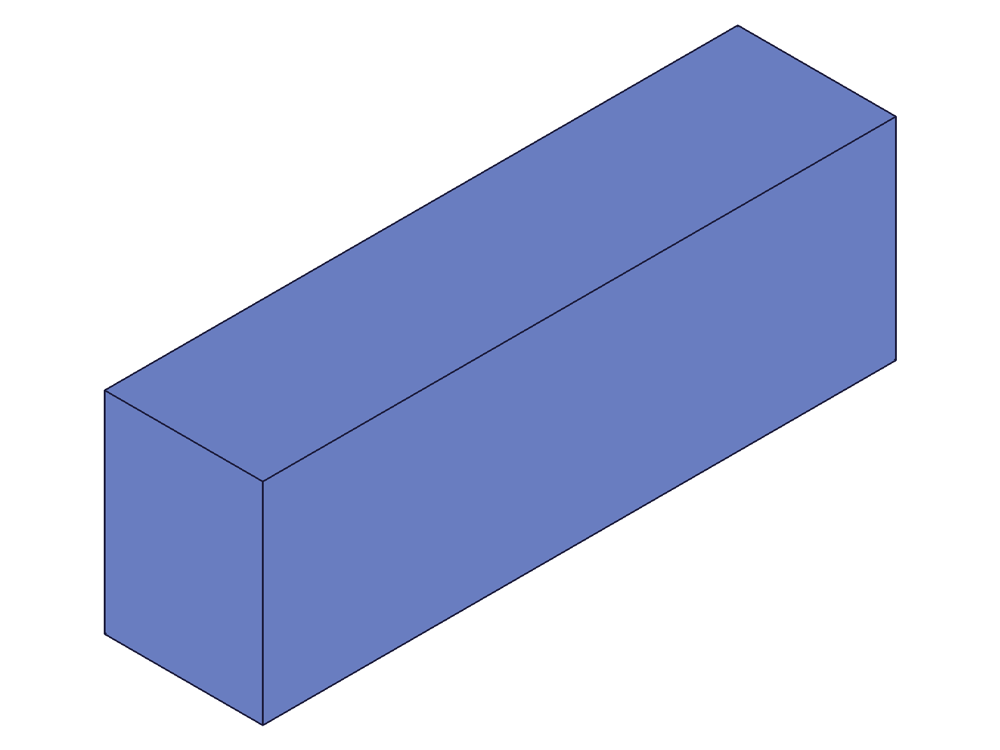

# Training: common.recalc

**Date:** 2026-04-15

## Goal

Testing `v1.common.recalc` — full drawing recalculation.

**Methods to cover:**

- `recalc` — no-parameter call, returns VOID
- Behavior on empty drawing
- Behavior after creating geometry (part + solid)
- Behavior after `common.load` — is recalc needed/useful?
- Effect on structure tree and graphic data (before/after comparison)
- Effect on shape IDs (known invalidation bug from curve transform sessions)
- Interaction with expression-driven features
- Messages and maxLevel behavior
- Multiple consecutive recalc calls (idempotent?)
- Recalc after `common.clear` with keepIds

**Questions:**

- When is `recalc` actually needed vs. redundant?
- Does recalc change anything measurable (structure, graphic, IDs)?
- Does recalc produce messages?
- Does recalc invalidate shape IDs (confirming prior findings)?
- Is recalc safe on an empty drawing?
- Does recalc after load produce different results than load alone?

---

## 01 — empty drawing

Script: `scripts/01-empty-drawing.mjs` — ✅ recalc on empty drawing succeeds.

**Data:** result=null (VOID), maxLevel=31 (info), messages=[] (see `files/01-empty-drawing-recalc-empty.json`).

**Learned:** Safe to call on empty drawing. No errors, no warnings.

---

## 02 — with geometry

Script: `scripts/02-with-geometry.mjs` — ✅ recalc with a box present, no visible effect.

|  |
|---|

**Data:** result=null, maxLevel=31. Before/after structure keys identical: `[root, currentProduct, currentInstance, testRoot, tree]`. No graphic data in either case (`hasGraphic: false`).

**Learned:** Recalc on a drawing with geometry succeeds silently. Structure tree shape unchanged. No graphic data generated (graphic remains null in CLI context).

---

## 03 — multiple consecutive calls

Script: `scripts/03-multiple-recalc.mjs` — ✅ 5 consecutive recalc calls, all identical.

**Data:** All 5 calls return `{result: null, maxLevel: 31, msgCount: 0}` (see `files/03-multiple-recalc-multi-recalc.json`).

**Learned:** Perfectly idempotent. Calling recalc repeatedly has no cumulative effect — each call returns the same result.
**📌 LLM doc:** Document idempotent behavior.

---

## 04 — after save/clear/load

Script: `scripts/04-after-load.mjs` — ✅ recalc after load cycle, no measurable effect.

**Data:** Structure node count is 10631 both before and after recalc. Load itself returns `{id: 4}` with maxLevel=31.

**Learned:** After loading OFB data, the drawing is already in a consistent state. Recalc adds nothing measurable — structure tree byte count is identical.
**📌 LLM doc:** Note that recalc after load is redundant for OFB format.

---

## 05 — shape ID invalidation (confirmed)

Script: `scripts/05-shape-id-invalidation.mjs` — ✅ Confirmed: recalc invalidates shape IDs.

**Data:** `translateShape` before recalc: maxLevel=31 (success). After recalc: maxLevel=51 with error 1006 "An element of parameter `ids` has an invalid id!" (see `files/05-shape-id-invalidation-shape-invalidation.json`).

**Learned:** This confirms the known bug documented in curve transform LLM docs. Recalc rebuilds internal structures and invalidates shape references. All shape transforms must happen BEFORE any recalc call (or snapshot, which calls recalc internally).
**📌 LLM doc:** Document shape ID invalidation as a key side effect.

---

## 06 — expression-driven features

Script: `scripts/06-expression-driven.mjs` — ✅ recalc after updateExpression is redundant.

**Data:** W before update: `{expression: "", value: 60}`. After `updateExpression`: `{expression: "", value: 120}`. After recalc: `{expression: "", value: 120}` — unchanged.

**Learned:** `updateExpression` auto-recalculates. Calling recalc afterward changes nothing. Confirms prior training findings.
**📌 LLM doc:** Document when recalc is NOT needed.

---

## 07 — solid IDs survive recalc

Script: `scripts/07-solid-ids-survive.mjs` — ✅ Solid IDs survive recalc (unlike shape IDs).

**Data:** `solid.translation` with same boxId: maxLevel=31 before recalc, maxLevel=31 after recalc. Both return the solid ID (61).

**Learned:** Recalc does NOT invalidate solid IDs. Only shape (curve container) IDs are affected. This is an important distinction — the invalidation bug is specific to shape IDs in the curve domain.
**📌 LLM doc:** Document that solid IDs, sketch IDs, feature IDs all survive recalc. Only curve shape IDs are invalidated.

---

## 08 — graphic data comparison

Script: `scripts/08-graphic-data-compare.mjs` — ✅ No graphic data before or after recalc.

**Data:** `hasGraphic: false` both before and after. Recalc envelope itself also has `graphic: false` but `structure: true`.

**Learned:** In CLI context, graphic data is not generated by API calls or recalc. The renderer pipeline (snapshot) generates graphics separately. Recalc DOES return a full structure tree but no graphic data.

---

## 09 — after clear with keepIds

Script: `scripts/09-after-clear-keepIds.mjs` — ✅ recalc after partial clear succeeds.

**Data:** clear result: maxLevel=31. recalc result: maxLevel=31. No messages or errors.

**Learned:** Safe to call recalc after `clear({ keepIds: [...] })`. No warnings or errors. Consistent with prior `clear.md` LLM doc finding.

---

## 10 — recalc response envelope

Script: `scripts/10-recalc-envelope.mjs` — ✅ Full envelope structure examined.

**Data:** Envelope keys: `[result, messages, maxLevel, structure, graphic]`. Structure keys: `[root, currentProduct, currentInstance, testRoot, tree]`. Tree is an object (not array) keyed by numeric node IDs (e.g., `['1', '4', '6', '8', ...]`). Graphic is null/absent.

**Learned:** Recalc returns the standard envelope. The structure tree is present and contains the full object tree. No graphic data. The tree property is an object (ID → node), not an array.
**📌 LLM doc:** Document return value structure.

---

## 11 — recalc vs closeFeature

Script: `scripts/11-recalc-vs-closeFeature.mjs` — ✅ recalc during and after openFeature/closeFeature cycle.

|  |
|---|

**Data:**
- `updateBox` while open: result=54, maxLevel=31
- `recalc` while feature is open: result=null, maxLevel=31, no messages
- `closeFeature`: result=null, maxLevel=31
- `recalc` after close: result=null, maxLevel=31

**Learned:** Recalc while a feature is open succeeds silently — it does NOT trigger an error. After closeFeature, recalc is redundant (closeFeature auto-recalculates). The snapshot shows the updated box (length=120), confirming the update+close cycle worked.

---

## 12 — recalc with sketch geometry

Script: `scripts/12-recalc-with-sketch.mjs` — ✅ Sketch IDs survive recalc.

**Data:** Geometry before recalc: `{arcs:[], circles:[], lines:[58,64,70,76], points:[]}`. After recalc: identical. `getPoints` after recalc: maxLevel=31, result=`{endId:60, startId:59}` — IDs still valid.

**Learned:** Sketch curve IDs, point IDs, and geometry queries all work fine after recalc. No invalidation. Only curve domain shape IDs are affected.

---

## 13 — after linkWithExpression

Script: `scripts/13-after-linkExpression.mjs` — ✅ linkWithExpression auto-recalculates, recalc is redundant.

**Data:** Structure after link: 21279 bytes. Structure after recalc: 21279 bytes — identical.

**Learned:** `linkWithExpression` updates geometry immediately. Recalc adds nothing. This contradicts the source API docs (expressions.md) which imply recalc is needed — confirmed: it's NOT needed for link/unlink.
**📌 LLM doc:** Clarify that linkWithExpression auto-recalculates.

---

## 14 — recalc in batch

Script: `scripts/14-in-batch.mjs` — ✅ recalc works inside a batch call.

**Data:** Batch result: `[{result: null}, {result: ""}]`. First entry is recalc (null=VOID), second is getAppVersion (version string). maxLevel=31.

**Learned:** Recalc works correctly in batch context. Result is VOID (null) as expected.

---

## 15 — no params vs empty object

Script: `scripts/15-no-params-vs-empty.mjs` — ✅ Both `recalc()` and `recalc({})` produce identical results.

**Data:** Both return `{result: null, maxLevel: 31}`.

**Learned:** Both calling conventions work identically. The API takes no parameters so both are equivalent.
